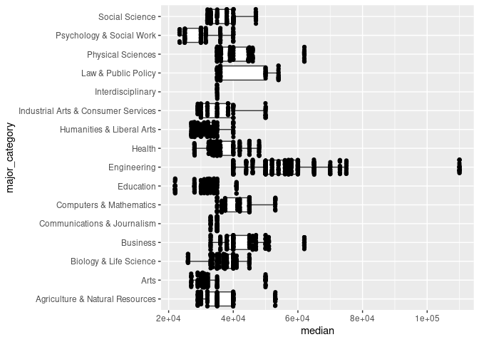

Activity 5
================
Josephat Oyondi

## Data and packages

Again, we will load all of the `{tidyverse}` for this Activity.

``` r
library(tidyverse)
```

We continue our exploration of college majors and earnings from the data
behind the FiveThirtyEight story [The Economic Guide To Picking A
College
Major](https://fivethirtyeight.com/features/the-economic-guide-to-picking-a-college-major/).
Remember that there are many considerations that go into picking a
major. Earning potential and employment prospects are two (important) of
these considerations, but they do not tell the entire story.

We read in the same data from Activity 4 below, but notice that this
code is now surrounded in parentheses.

``` r
(college_recent_grads <- read_csv("data/recent-grads.csv"))
```

    ## # A tibble: 173 x 21
    ##     rank major_code major           major_category total sample_size   men women
    ##    <dbl>      <dbl> <chr>           <chr>          <dbl>       <dbl> <dbl> <dbl>
    ##  1     1       2419 Petroleum Engi… Engineering     2339          36  2057   282
    ##  2     2       2416 Mining And Min… Engineering      756           7   679    77
    ##  3     3       2415 Metallurgical … Engineering      856           3   725   131
    ##  4     4       2417 Naval Architec… Engineering     1258          16  1123   135
    ##  5     5       2405 Chemical Engin… Engineering    32260         289 21239 11021
    ##  6     6       2418 Nuclear Engine… Engineering     2573          17  2200   373
    ##  7     7       6202 Actuarial Scie… Business        3777          51  2110  1667
    ##  8     8       5001 Astronomy And … Physical Scie…  1792          10   832   960
    ##  9     9       2414 Mechanical Eng… Engineering    91227        1029 80320 10907
    ## 10    10       2408 Electrical Eng… Engineering    81527         631 65511 16016
    ## # … with 163 more rows, and 13 more variables: sharewomen <dbl>,
    ## #   employed <dbl>, employed_fulltime <dbl>, employed_parttime <dbl>,
    ## #   employed_fulltime_yearround <dbl>, unemployed <dbl>,
    ## #   unemployment_rate <dbl>, p25th <dbl>, median <dbl>, p75th <dbl>,
    ## #   college_jobs <dbl>, non_college_jobs <dbl>, low_wage_jobs <dbl>

Compare this code output to the `load_data` chunk in your knitted
Activity 4 `.md` report. What does enclosing an assignment code (i.e.,
`object_name <- r_code`) in parentheses do?

**Response**:

### Data Codebook

Descriptions of the variables are again provided below. Again note that
the ACS only asks [one
question](https://www.census.gov/acs/www/about/why-we-ask-each-question/sex/)
about a person’s sexual identity.

| Header                         | Description                                                                 |
|:-------------------------------|:----------------------------------------------------------------------------|
| `rank`                         | Rank by median earnings                                                     |
| `major_code`                   | Major code, FO1DP in ACS PUMS                                               |
| `major`                        | Major description                                                           |
| `major_category`               | Category of major from Carnevale et al                                      |
| `total`                        | Total number of people with major                                           |
| `sample_size`                  | Sample size (unweighted) of full-time, year-round ONLY (used for earnings)  |
| `men`                          | Male graduates                                                              |
| `women`                        | Female graduates                                                            |
| `sharewomen`                   | Women as share of total                                                     |
| `employed`                     | Number employed (ESR == 1 or 2)                                             |
| `employed_full_time`           | Employed 35 hours or more                                                   |
| `employed_part_time`           | Employed less than 35 hours                                                 |
| `employed_full_time_yearround` | Employed at least 50 weeks (WKW == 1) and at least 35 hours (WKHP &gt;= 35) |
| `unemployed`                   | Number unemployed (ESR == 3)                                                |
| `unemployment_rate`            | Unemployed / (Unemployed + Employed)                                        |
| `median`                       | Median earnings of full-time, year-round workers                            |
| `p25th`                        | 25th percentile of earnings                                                 |
| `p75th`                        | 75th percentile of earnings                                                 |
| `college_jobs`                 | Number with job requiring a college degree                                  |
| `non_college_jobs`             | Number with job not requiring a college degree                              |
| `low_wage_jobs`                | Number in low-wage service jobs                                             |

The questions we will answer in this activity are:

-   How do the distributions of median income compare across major
    categories?
-   Do women tend to choose majors with lower or higher earnings?

## Analysis

### Median Earnings Description

### Median … Median Earnings

For the rest of this semester, I will no longer provide you with R code
chunks. Have no fear! There are a number of ways to create a code chunk:

-   Tired: Copy-and-paste a previous code chunk, delete the code, then
    add your new code
-   Wired: Click on the 
    and select  (notice all
    the different types of code chunks that you can use within an
    RMarkdown file!)
-   Inspired: Ctrl/Command + Alt/Option + I

Below, create a code chunk and name it `median_earnings`. Make sure
there is an empty line above and below the code chunk.

``` r
median_earnings <- summarise(college_recent_grads, median(median))

median_earnings
```

    ## # A tibble: 1 x 1
    ##   `median(median)`
    ##              <dbl>
    ## 1            36000

In your newly created R code chunk, verify that the median income for
all majors was $36,000. Using the `college_recent_grads` dataset and
functions from `{dplyr}`, verify the *median* summary statistic for the
variable median earnings of full-time, year-round workers (`median`).
Name this numerical summary `median_all_majors`.

``` r
median_all_majors <- summarise(college_recent_grads, median(median))
median_all_majors
```

    ## # A tibble: 1 x 1
    ##   `median(median)`
    ##              <dbl>
    ## 1            36000

 **Planned Pause Point**: If you have any
questions, contact your instructor. Otherwise feel free to continue on.

### Additional Summaries of Median Earnings

Often we would like more information than the median to help us to
better understand the distribution of a variable. Using the
`college_recent_grads` dataset and functions from `{dplyr}`, obtain the
sample size (i.e., *n*umber of observations), *mean*, *s*tandard
*d*eviation, *min*imum, *median*, and *max*imum summaries for the
variable `median` earnings of full-time, year-round workers. Be careful
when you name your output summaries as we are dealing with things that
could use the same name (i.e., “median”). When I and obtaining numerical
summaries for variables, I like to include the variable name in my
summary name (e.g., `mean_med_earnings = mean(median)`). Create a code
chunk and name it `summary_earnings`.

``` r
summary_earnings <- summarise(college_recent_grads, sample(median), mean(median), sd(median), min(median), max(median))

summary_earnings
```

    ## # A tibble: 173 x 5
    ##    `sample(median)` `mean(median)` `sd(median)` `min(median)` `max(median)`
    ##               <dbl>          <dbl>        <dbl>         <dbl>         <dbl>
    ##  1            40000         40151.       11470.         22000        110000
    ##  2            50000         40151.       11470.         22000        110000
    ##  3            34000         40151.       11470.         22000        110000
    ##  4            32000         40151.       11470.         22000        110000
    ##  5            33000         40151.       11470.         22000        110000
    ##  6            31000         40151.       11470.         22000        110000
    ##  7            36000         40151.       11470.         22000        110000
    ##  8            56000         40151.       11470.         22000        110000
    ##  9            60000         40151.       11470.         22000        110000
    ## 10            30000         40151.       11470.         22000        110000
    ## # … with 163 more rows

Provide a discussion on what you believe the distribution of median
earnings will look like. You should discuss the center, spread, and
potential shape only using these values - I do NOT want to see any data
visualizations here.

**Response**: Based on the values of the mean and median, the median is
higher than the median. This indicates that the less number of college
graduates earn higher amounts while a significant number of the
graduates earn less than the average value. Additionally, the spread (as
indicated by the standard deviation) shows there is a significant
variation of earnings between different majors. The potential shape of
the chart will be a curve decreasing as earnings increase.

### Median Earnings by Major Category

Now we will see how the different major categories compare to the
overall distribution of median earnings. Using the
`college_recent_grads` dataset and functions from `{dplyr}`, obtain
similar summaries of the variable `median` earnings of full-time,
year-round workers as your `summary_earnings` code chunk, *by* for each
`major_category`. *Arrange* this summary table by the median earning.
Create a code chunk and name it `major_earnings`.

``` r
major_earnings <- college_recent_grads %>% 
  group_by(major_category) %>% #group by major category
  summarise(college_recent_grads, sample(median), mean(median), sd(median), min(median), max(median)) #creates a summary of the median for all the earnings
```

    ## `summarise()` has grouped output by 'major_category'. You can override using the `.groups` argument.

``` r
knitr::kable(major_earnings)
```

| major\_category                     | rank | major\_code | major                                                             |  total | sample\_size |    men |  women | sharewomen | employed | employed\_fulltime | employed\_parttime | employed\_fulltime\_yearround | unemployed | unemployment\_rate | p25th | median |  p75th | college\_jobs | non\_college\_jobs | low\_wage\_jobs | sample(median) | mean(median) | sd(median) | min(median) | max(median) |
|:------------------------------------|-----:|------------:|:------------------------------------------------------------------|-------:|-------------:|-------:|-------:|-----------:|---------:|-------------------:|-------------------:|------------------------------:|-----------:|-------------------:|------:|-------:|-------:|--------------:|-------------------:|----------------:|---------------:|-------------:|-----------:|------------:|------------:|
| Engineering                         |    1 |        2419 | Petroleum Engineering                                             |   2339 |           36 |   2057 |    282 |  0.1205643 |     1976 |               1849 |                270 |                          1207 |         37 |          0.0183805 | 95000 | 110000 | 125000 |          1534 |                364 |             193 |          53000 |     40151.45 |   11470.18 |       22000 |      110000 |
| Engineering                         |    2 |        2416 | Mining And Mineral Engineering                                    |    756 |            7 |    679 |     77 |  0.1018519 |      640 |                556 |                170 |                           388 |         85 |          0.1172414 | 55000 |  75000 |  90000 |           350 |                257 |              50 |          56000 |     40151.45 |   11470.18 |       22000 |      110000 |
| Engineering                         |    3 |        2415 | Metallurgical Engineering                                         |    856 |            3 |    725 |    131 |  0.1530374 |      648 |                558 |                133 |                           340 |         16 |          0.0240964 | 50000 |  73000 | 105000 |           456 |                176 |               0 |          38000 |     40151.45 |   11470.18 |       22000 |      110000 |
| Engineering                         |    4 |        2417 | Naval Architecture And Marine Engineering                         |   1258 |           16 |   1123 |    135 |  0.1073132 |      758 |               1069 |                150 |                           692 |         40 |          0.0501253 | 43000 |  70000 |  80000 |           529 |                102 |               0 |          30000 |     40151.45 |   11470.18 |       22000 |      110000 |
| Engineering                         |    5 |        2405 | Chemical Engineering                                              |  32260 |          289 |  21239 |  11021 |  0.3416305 |    25694 |              23170 |               5180 |                         16697 |       1672 |          0.0610977 | 50000 |  65000 |  75000 |         18314 |               4440 |             972 |          41300 |     40151.45 |   11470.18 |       22000 |      110000 |
| Engineering                         |    6 |        2418 | Nuclear Engineering                                               |   2573 |           17 |   2200 |    373 |  0.1449670 |     1857 |               2038 |                264 |                          1449 |        400 |          0.1772264 | 50000 |  65000 | 102000 |          1142 |                657 |             244 |          34000 |     40151.45 |   11470.18 |       22000 |      110000 |
| Business                            |    7 |        6202 | Actuarial Science                                                 |   3777 |           51 |   2110 |   1667 |  0.4413556 |     2912 |               2924 |                296 |                          2482 |        308 |          0.0956522 | 53000 |  62000 |  72000 |          1768 |                314 |             259 |          36000 |     40151.45 |   11470.18 |       22000 |      110000 |
| Physical Sciences                   |    8 |        5001 | Astronomy And Astrophysics                                        |   1792 |           10 |    832 |    960 |  0.5357143 |     1526 |               1085 |                553 |                           827 |         33 |          0.0211674 | 31500 |  62000 | 109000 |           972 |                500 |             220 |          36000 |     40151.45 |   11470.18 |       22000 |      110000 |
| Engineering                         |    9 |        2414 | Mechanical Engineering                                            |  91227 |         1029 |  80320 |  10907 |  0.1195589 |    76442 |              71298 |              13101 |                         54639 |       4650 |          0.0573423 | 48000 |  60000 |  70000 |         52844 |              16384 |            3253 |          34000 |     40151.45 |   11470.18 |       22000 |      110000 |
| Engineering                         |   10 |        2408 | Electrical Engineering                                            |  81527 |          631 |  65511 |  16016 |  0.1964503 |    61928 |              55450 |              12695 |                         41413 |       3895 |          0.0591738 | 45000 |  60000 |  72000 |         45829 |              10874 |            3170 |          35000 |     40151.45 |   11470.18 |       22000 |      110000 |
| Engineering                         |   11 |        2407 | Computer Engineering                                              |  41542 |          399 |  33258 |   8284 |  0.1994126 |    32506 |              30315 |               5146 |                         23621 |       2275 |          0.0654093 | 45000 |  60000 |  75000 |         23694 |               5721 |             980 |          36000 |     40151.45 |   11470.18 |       22000 |      110000 |
| Engineering                         |   12 |        2401 | Aerospace Engineering                                             |  15058 |          147 |  12953 |   2105 |  0.1397928 |    11391 |              11106 |               2724 |                          8790 |        794 |          0.0651621 | 42000 |  60000 |  70000 |          8184 |               2425 |             372 |          40000 |     40151.45 |   11470.18 |       22000 |      110000 |
| Engineering                         |   13 |        2404 | Biomedical Engineering                                            |  14955 |           79 |   8407 |   6548 |  0.4378469 |    10047 |               9017 |               2694 |                          5986 |       1019 |          0.0920839 | 36000 |  60000 |  70000 |          6439 |               2471 |             789 |          35000 |     40151.45 |   11470.18 |       22000 |      110000 |
| Engineering                         |   14 |        5008 | Materials Science                                                 |   4279 |           22 |   2949 |   1330 |  0.3108203 |     3307 |               2751 |                878 |                          1967 |         78 |          0.0230428 | 39000 |  60000 |  65000 |          2626 |                391 |              81 |          36000 |     40151.45 |   11470.18 |       22000 |      110000 |
| Engineering                         |   15 |        2409 | Engineering Mechanics Physics And Science                         |   4321 |           30 |   3526 |    795 |  0.1839852 |     3608 |               2999 |                811 |                          2004 |         23 |          0.0063343 | 25000 |  58000 |  74000 |          2439 |                947 |             263 |          60000 |     40151.45 |   11470.18 |       22000 |      110000 |
| Engineering                         |   16 |        2402 | Biological Engineering                                            |   8925 |           55 |   6062 |   2863 |  0.3207843 |     6170 |               5455 |               1983 |                          3413 |        589 |          0.0871431 | 40000 |  57100 |  76000 |          3603 |               1595 |             524 |          57100 |     40151.45 |   11470.18 |       22000 |      110000 |
| Engineering                         |   17 |        2412 | Industrial And Manufacturing Engineering                          |  18968 |          183 |  12453 |   6515 |  0.3434732 |    15604 |              14879 |               2243 |                         11326 |        699 |          0.0428755 | 37900 |  57000 |  67000 |          8306 |               3235 |             640 |          40000 |     40151.45 |   11470.18 |       22000 |      110000 |
| Engineering                         |   18 |        2400 | General Engineering                                               |  61152 |          425 |  45683 |  15469 |  0.2529598 |    44931 |              41235 |               7199 |                         33540 |       2859 |          0.0598242 | 36000 |  56000 |  69000 |         26898 |              11734 |            3192 |          34000 |     40151.45 |   11470.18 |       22000 |      110000 |
| Engineering                         |   19 |        2403 | Architectural Engineering                                         |   2825 |           26 |   1835 |    990 |  0.3504425 |     2575 |               2277 |                343 |                          1848 |        170 |          0.0619308 | 38000 |  54000 |  65000 |          1665 |                649 |             137 |          30500 |     40151.45 |   11470.18 |       22000 |      110000 |
| Law & Public Policy                 |   20 |        3201 | Court Reporting                                                   |   1148 |           14 |    877 |    271 |  0.2360627 |      930 |                808 |                223 |                           808 |         11 |          0.0116897 | 50000 |  54000 |  54000 |           402 |                528 |             144 |          40000 |     40151.45 |   11470.18 |       22000 |      110000 |
| Computers & Mathematics             |   21 |        2102 | Computer Science                                                  | 128319 |         1196 |  99743 |  28576 |  0.2226950 |   102087 |              91485 |              18726 |                         70932 |       6884 |          0.0631728 | 39000 |  53000 |  70000 |         68622 |              25667 |            5144 |          37500 |     40151.45 |   11470.18 |       22000 |      110000 |
| Agriculture & Natural Resources     |   22 |        1104 | Food Science                                                      |     NA |           36 |     NA |     NA |         NA |     3149 |               2558 |               1121 |                          1735 |        338 |          0.0969315 | 32000 |  53000 |  70000 |          1183 |               1274 |             485 |          29000 |     40151.45 |   11470.18 |       22000 |      110000 |
| Engineering                         |   23 |        2502 | Electrical Engineering Technology                                 |  11565 |           97 |   8181 |   3384 |  0.2926070 |     8587 |               7530 |               1873 |                          5681 |        824 |          0.0875571 | 35000 |  52000 |  60000 |          5126 |               2686 |             696 |          70000 |     40151.45 |   11470.18 |       22000 |      110000 |
| Engineering                         |   24 |        2413 | Materials Engineering And Materials Science                       |   2993 |           22 |   2020 |    973 |  0.3250919 |     2449 |               1658 |               1040 |                          1151 |         70 |          0.0277888 | 35000 |  52000 |  62000 |          1911 |                305 |              70 |          32000 |     40151.45 |   11470.18 |       22000 |      110000 |
| Business                            |   25 |        6212 | Management Information Systems And Statistics                     |  18713 |          278 |  13496 |   5217 |  0.2787901 |    16413 |              15141 |               2420 |                         13017 |       1015 |          0.0582396 | 38000 |  51000 |  60000 |          6342 |               5741 |             708 |          40000 |     40151.45 |   11470.18 |       22000 |      110000 |
| Engineering                         |   26 |        2406 | Civil Engineering                                                 |  53153 |          565 |  41081 |  12072 |  0.2271179 |    43041 |              38302 |              10080 |                         29196 |       3270 |          0.0706096 | 40000 |  50000 |  60000 |         28526 |               9356 |            2899 |          34000 |     40151.45 |   11470.18 |       22000 |      110000 |
| Industrial Arts & Consumer Services |   27 |        5601 | Construction Services                                             |  18498 |          295 |  16820 |   1678 |  0.0907125 |    16318 |              15690 |               1751 |                         12313 |       1042 |          0.0600230 | 36000 |  50000 |  60000 |          3275 |               5351 |             703 |          34000 |     40151.45 |   11470.18 |       22000 |      110000 |
| Business                            |   28 |        6204 | Operations Logistics And e-Commerce                               |  11732 |          156 |   7921 |   3811 |  0.3248380 |    10027 |               9639 |               1183 |                          7724 |        504 |          0.0478587 | 40000 |  50000 |  60000 |          1466 |               3629 |             285 |          35000 |     40151.45 |   11470.18 |       22000 |      110000 |
| Engineering                         |   29 |        2499 | Miscellaneous Engineering                                         |   9133 |          118 |   7398 |   1735 |  0.1899704 |     7428 |               6811 |               1662 |                          5476 |        597 |          0.0743925 | 39000 |  50000 |  65000 |          3445 |               2426 |             365 |          32100 |     40151.45 |   11470.18 |       22000 |      110000 |
| Law & Public Policy                 |   30 |        5402 | Public Policy                                                     |   5978 |           55 |   2639 |   3339 |  0.5585480 |     4547 |               4163 |               1306 |                          2776 |        670 |          0.1284263 | 35000 |  50000 |  70000 |          1550 |               1871 |             340 |          33000 |     40151.45 |   11470.18 |       22000 |      110000 |
| Engineering                         |   31 |        2410 | Environmental Engineering                                         |   4047 |           26 |   2662 |   1385 |  0.3422288 |     2983 |               2384 |                930 |                          1951 |        308 |          0.0935886 | 42000 |  50000 |  56000 |          2028 |                830 |             260 |          33500 |     40151.45 |   11470.18 |       22000 |      110000 |
| Engineering                         |   32 |        2500 | Engineering Technologies                                          |   3600 |           39 |   2695 |    905 |  0.2513889 |     2799 |               2257 |                689 |                          1723 |        163 |          0.0550304 | 43000 |  50000 |  60000 |          1017 |               1269 |             142 |          52000 |     40151.45 |   11470.18 |       22000 |      110000 |
| Arts                                |   33 |        6099 | Miscellaneous Fine Arts                                           |   3340 |           30 |   1970 |   1370 |  0.4101796 |     2914 |               2049 |               1067 |                          1200 |        286 |          0.0893750 | 25000 |  50000 |  66000 |           693 |               1714 |             755 |          36000 |     40151.45 |   11470.18 |       22000 |      110000 |
| Engineering                         |   34 |        2411 | Geological And Geophysical Engineering                            |    720 |            5 |    488 |    232 |  0.3222222 |      604 |                524 |                126 |                           396 |         49 |          0.0750383 | 42800 |  50000 |  57000 |           501 |                 50 |              49 |          35000 |     40151.45 |   11470.18 |       22000 |      110000 |
| Health                              |   35 |        6107 | Nursing                                                           | 209394 |         2554 |  21773 | 187621 |  0.8960190 |   180903 |             151191 |              40818 |                        122817 |       8497 |          0.0448627 | 39000 |  48000 |  58000 |        151643 |              26146 |            6193 |          28000 |     40151.45 |   11470.18 |       22000 |      110000 |
| Business                            |   36 |        6207 | Finance                                                           | 174506 |         2189 | 115030 |  59476 |  0.3408250 |   145696 |             137921 |              21463 |                        108595 |       9413 |          0.0606864 | 35000 |  47000 |  64000 |         24243 |              48447 |            9910 |          34000 |     40151.45 |   11470.18 |       22000 |      110000 |
| Social Science                      |   37 |        5501 | Economics                                                         | 139247 |         1322 |  89749 |  49498 |  0.3554691 |   104117 |              96567 |              25325 |                         70740 |      11452 |          0.0990923 | 35000 |  47000 |  65000 |         25582 |              37057 |           10653 |          62000 |     40151.45 |   11470.18 |       22000 |      110000 |
| Business                            |   38 |        6205 | Business Economics                                                |  13302 |          199 |   7575 |   5727 |  0.4305368 |    10914 |              10048 |               1937 |                          8000 |       1165 |          0.0964484 | 33000 |  46000 |  58000 |          1578 |               4612 |            1284 |          40000 |     40151.45 |   11470.18 |       22000 |      110000 |
| Engineering                         |   39 |        2503 | Industrial Production Technologies                                |   4631 |           73 |   3477 |   1154 |  0.2491902 |     4428 |               3988 |                597 |                          3242 |        129 |          0.0283081 | 35000 |  46000 |  65000 |          1394 |               2454 |             480 |          40000 |     40151.45 |   11470.18 |       22000 |      110000 |
| Physical Sciences                   |   40 |        5102 | Nuclear, Industrial Radiology, And Biological Technologies        |   2116 |           31 |    528 |   1588 |  0.7504726 |     1778 |               1392 |                579 |                          1115 |        137 |          0.0715405 | 38000 |  46000 |  53000 |           162 |               1475 |             124 |          33000 |     40151.45 |   11470.18 |       22000 |      110000 |
| Business                            |   41 |        6201 | Accounting                                                        | 198633 |         2042 |  94519 | 104114 |  0.5241526 |   165527 |             151967 |              27693 |                        123169 |      12411 |          0.0697490 | 34000 |  45000 |  56000 |         11417 |              39323 |           10886 |          27000 |     40151.45 |   11470.18 |       22000 |      110000 |
| Computers & Mathematics             |   42 |        3700 | Mathematics                                                       |  72397 |          541 |  39956 |  32441 |  0.4480987 |    58118 |              46399 |              18079 |                         33738 |       2884 |          0.0472771 | 33000 |  45000 |  60000 |         34800 |              14829 |            4569 |          47000 |     40151.45 |   11470.18 |       22000 |      110000 |
| Computers & Mathematics             |   43 |        2100 | Computer And Information Systems                                  |  36698 |          425 |  27392 |   9306 |  0.2535833 |    28459 |              26348 |               4332 |                         21130 |       2934 |          0.0934603 | 30000 |  45000 |  60000 |         13344 |              11783 |            1672 |          65000 |     40151.45 |   11470.18 |       22000 |      110000 |
| Physical Sciences                   |   44 |        5007 | Physics                                                           |  32142 |          142 |  23080 |   9062 |  0.2819364 |    25302 |              19428 |               8721 |                         14389 |       1282 |          0.0482245 | 30000 |  45000 |  68000 |         18674 |               4576 |            1823 |          46000 |     40151.45 |   11470.18 |       22000 |      110000 |
| Health                              |   45 |        6105 | Medical Technologies Technicians                                  |  15914 |          190 |   3916 |  11998 |  0.7539274 |    13150 |              11510 |               2665 |                          9005 |        505 |          0.0369828 | 36000 |  45000 |  50000 |          5546 |               7176 |            1002 |          30000 |     40151.45 |   11470.18 |       22000 |      110000 |
| Computers & Mathematics             |   46 |        2105 | Information Sciences                                              |  11913 |          158 |   9005 |   2908 |  0.2441031 |     9881 |               9105 |               1468 |                          7378 |        639 |          0.0607414 | 32500 |  45000 |  58000 |          4390 |               4102 |             608 |          33400 |     40151.45 |   11470.18 |       22000 |      110000 |
| Computers & Mathematics             |   47 |        3702 | Statistics And Decision Science                                   |   6251 |           37 |   2960 |   3291 |  0.5264758 |     4247 |               3190 |               1840 |                          2151 |        401 |          0.0862737 | 26700 |  45000 |  60000 |          2298 |               1200 |             343 |          30000 |     40151.45 |   11470.18 |       22000 |      110000 |
| Computers & Mathematics             |   48 |        3701 | Applied Mathematics                                               |   4939 |           45 |   2794 |   2145 |  0.4342984 |     3854 |               3465 |               1176 |                          2593 |        385 |          0.0908233 | 34000 |  45000 |  63000 |          2437 |                803 |             357 |          53000 |     40151.45 |   11470.18 |       22000 |      110000 |
| Biology & Life Science              |   49 |        3607 | Pharmacology                                                      |   1762 |            3 |    515 |   1247 |  0.7077185 |     1144 |                657 |                532 |                           565 |        107 |          0.0855316 | 40000 |  45000 |  45000 |           603 |                478 |              93 |          35000 |     40151.45 |   11470.18 |       22000 |      110000 |
| Physical Sciences                   |   50 |        5006 | Oceanography                                                      |   2418 |           36 |    752 |   1666 |  0.6889992 |     1638 |               1931 |                379 |                          1595 |         99 |          0.0569948 | 23000 |  44700 |  50000 |           459 |                996 |             186 |          40000 |     40151.45 |   11470.18 |       22000 |      110000 |
| Engineering                         |   51 |        2501 | Engineering And Industrial Management                             |   2906 |           29 |   2400 |    506 |  0.1741225 |     2125 |               1992 |                462 |                          1358 |         74 |          0.0336517 | 30000 |  44000 |  50000 |           482 |                844 |             245 |          40100 |     40151.45 |   11470.18 |       22000 |      110000 |
| Health                              |   52 |        6104 | Medical Assisting Services                                        |  11123 |           67 |    803 |  10320 |  0.9278072 |     9168 |               5643 |               4107 |                          4290 |        407 |          0.0425065 | 30000 |  42000 |  65000 |          2091 |               6948 |            1270 |          60000 |     40151.45 |   11470.18 |       22000 |      110000 |
| Computers & Mathematics             |   53 |        4005 | Mathematics And Computer Science                                  |    609 |            7 |    500 |    109 |  0.1789819 |      559 |                584 |                  0 |                           391 |          0 |          0.0000000 | 30000 |  42000 |  78000 |           452 |                 67 |              25 |          50000 |     40151.45 |   11470.18 |       22000 |      110000 |
| Computers & Mathematics             |   54 |        2101 | Computer Programming And Data Processing                          |   4168 |           43 |   3046 |   1122 |  0.2691939 |     3257 |               3204 |                482 |                          2453 |        419 |          0.1139826 | 20000 |  41300 |  46000 |          2024 |               1033 |             263 |          47000 |     40151.45 |   11470.18 |       22000 |      110000 |
| Biology & Life Science              |   55 |        4006 | Cognitive Science And Biopsychology                               |   3831 |           25 |   1667 |   2164 |  0.5648656 |     2741 |               2470 |                711 |                          1584 |        223 |          0.0752362 | 20000 |  41000 |  60000 |          1369 |                921 |             135 |          38400 |     40151.45 |   11470.18 |       22000 |      110000 |
| Education                           |   56 |        2303 | School Student Counseling                                         |    818 |            4 |    119 |    699 |  0.8545232 |      730 |                595 |                135 |                           545 |         88 |          0.1075795 | 41000 |  41000 |  43000 |           509 |                221 |               0 |          27500 |     40151.45 |   11470.18 |       22000 |      110000 |
| Social Science                      |   57 |        5505 | International Relations                                           |  28187 |          219 |  10345 |  17842 |  0.6329868 |    21190 |              18681 |               5563 |                         13583 |       2271 |          0.0967989 | 31200 |  40100 |  53000 |          6774 |               9570 |            2499 |          37000 |     40151.45 |   11470.18 |       22000 |      110000 |
| Business                            |   58 |        6200 | General Business                                                  | 234590 |         2380 | 132238 | 102352 |  0.4363016 |   190183 |             171385 |              36241 |                        138299 |      14946 |          0.0728615 | 30000 |  40000 |  55000 |         29334 |             100831 |           27320 |          28000 |     40151.45 |   11470.18 |       22000 |      110000 |
| Engineering                         |   59 |        1401 | Architecture                                                      |  46420 |          362 |  25463 |  20957 |  0.4514649 |    34158 |              29223 |              10206 |                         20026 |       4366 |          0.1133319 | 31000 |  40000 |  50000 |         16178 |              13724 |            4221 |          35000 |     40151.45 |   11470.18 |       22000 |      110000 |
| Business                            |   60 |        6210 | International Business                                            |  25894 |          260 |  10624 |  15270 |  0.5897119 |    19660 |              17563 |               4890 |                         12823 |       2092 |          0.0961751 | 30000 |  40000 |  50000 |          3383 |               9482 |            3046 |          26000 |     40151.45 |   11470.18 |       22000 |      110000 |
| Health                              |   61 |        6108 | Pharmacy Pharmaceutical Sciences And Administration               |  23551 |           38 |   8697 |  14854 |  0.6307163 |    16620 |              12537 |               5346 |                          9131 |        977 |          0.0555208 | 20000 |  40000 |  90000 |         11573 |               4493 |            1121 |          29000 |     40151.45 |   11470.18 |       22000 |      110000 |
| Biology & Life Science              |   62 |        3603 | Molecular Biology                                                 |  18300 |           90 |   7426 |  10874 |  0.5942076 |    11581 |               9441 |               4590 |                          6183 |       1067 |          0.0843612 | 29000 |  40000 |  47000 |          7225 |               3145 |            1168 |          62000 |     40151.45 |   11470.18 |       22000 |      110000 |
| Business                            |   63 |        6299 | Miscellaneous Business & Medical Administration                   |  17947 |          244 |  10285 |   7662 |  0.4269237 |    14826 |              13364 |               3366 |                         10637 |       1150 |          0.0719830 | 30000 |  40000 |  51000 |          2236 |               8937 |            1758 |          45000 |     40151.45 |   11470.18 |       22000 |      110000 |
| Agriculture & Natural Resources     |   64 |        1101 | Agriculture Production And Management                             |  14240 |          273 |   9658 |   4582 |  0.3217697 |    12323 |              11119 |               2196 |                          9093 |        649 |          0.0500308 | 25000 |  40000 |  50000 |          1925 |               6221 |            1362 |          28000 |     40151.45 |   11470.18 |       22000 |      110000 |
| Agriculture & Natural Resources     |   65 |        1100 | General Agriculture                                               |  10399 |          158 |   6053 |   4346 |  0.4179248 |     8884 |               7589 |               2031 |                          5888 |        178 |          0.0196425 | 30000 |  40000 |  50000 |          2418 |               4717 |             839 |          45000 |     40151.45 |   11470.18 |       22000 |      110000 |
| Engineering                         |   66 |        2599 | Miscellaneous Engineering Technologies                            |   8804 |          125 |   7043 |   1761 |  0.2000227 |     7502 |               7001 |               1240 |                          5825 |        416 |          0.0525385 | 30400 |  40000 |  56000 |          2446 |               3896 |             386 |          40000 |     40151.45 |   11470.18 |       22000 |      110000 |
| Engineering                         |   67 |        2504 | Mechanical Engineering Related Technologies                       |   4790 |           71 |   4419 |    371 |  0.0774530 |     4186 |               4175 |                247 |                          3607 |        250 |          0.0563571 | 27000 |  40000 |  52000 |          1861 |               2121 |             406 |          34000 |     40151.45 |   11470.18 |       22000 |      110000 |
| Biology & Life Science              |   68 |        3605 | Genetics                                                          |   3635 |           11 |   1761 |   1874 |  0.5155433 |     2463 |               1787 |                847 |                          1487 |         87 |          0.0341176 | 34000 |  40000 |  45000 |          1675 |                678 |             201 |          35000 |     40151.45 |   11470.18 |       22000 |      110000 |
| Social Science                      |   69 |        5599 | Miscellaneous Social Sciences                                     |   3283 |           28 |   1499 |   1784 |  0.5434054 |     2727 |               2183 |                907 |                          1530 |        215 |          0.0730795 | 30000 |  40000 |  54000 |           744 |               1654 |             573 |          54000 |     40151.45 |   11470.18 |       22000 |      110000 |
| Humanities & Liberal Arts           |   70 |        6403 | United States History                                             |   3079 |           22 |   1756 |   1323 |  0.4296850 |     2787 |               2103 |                839 |                          1274 |        138 |          0.0471795 | 30000 |  40000 |  42000 |           801 |               1591 |             302 |          30000 |     40151.45 |   11470.18 |       22000 |      110000 |
| Psychology & Social Work            |   71 |        5205 | Industrial And Organizational Psychology                          |   3014 |           24 |   1075 |   1939 |  0.6433311 |     2343 |               1644 |               1095 |                          1409 |        286 |          0.1087866 | 32000 |  40000 |  53000 |           559 |               1224 |             272 |          35000 |     40151.45 |   11470.18 |       22000 |      110000 |
| Agriculture & Natural Resources     |   72 |        1102 | Agricultural Economics                                            |   2439 |           44 |   1749 |    690 |  0.2829028 |     2174 |               1819 |                620 |                          1528 |        182 |          0.0772496 | 27000 |  40000 |  54000 |           535 |                893 |              94 |          32000 |     40151.45 |   11470.18 |       22000 |      110000 |
| Physical Sciences                   |   73 |        5000 | Physical Sciences                                                 |   1436 |           10 |    894 |    542 |  0.3774373 |     1146 |                768 |                437 |                           653 |         42 |          0.0353535 | 30000 |  40000 |  55000 |           530 |                465 |             269 |          40000 |     40151.45 |   11470.18 |       22000 |      110000 |
| Industrial Arts & Consumer Services |   74 |        3801 | Military Technologies                                             |    124 |            4 |    124 |      0 |  0.0000000 |        0 |                111 |                  0 |                           111 |          0 |          0.0000000 | 40000 |  40000 |  40000 |             0 |                  0 |               0 |          30000 |     40151.45 |   11470.18 |       22000 |      110000 |
| Physical Sciences                   |   75 |        5003 | Chemistry                                                         |  66530 |          353 |  32923 |  33607 |  0.5051405 |    48535 |              39509 |              15066 |                         29910 |       2769 |          0.0539724 | 30000 |  39000 |  49900 |         30382 |              14718 |            4288 |          50000 |     40151.45 |   11470.18 |       22000 |      110000 |
| Industrial Arts & Consumer Services |   76 |        5701 | Electrical, Mechanical, And Precision Technologies And Production |   2435 |           37 |   1869 |    566 |  0.2324435 |     2107 |               2057 |                287 |                          1752 |         64 |          0.0294795 | 22500 |  38400 |  45000 |           221 |               1659 |              81 |          35000 |     40151.45 |   11470.18 |       22000 |      110000 |
| Business                            |   77 |        6203 | Business Management And Administration                            | 329927 |         4212 | 173809 | 156118 |  0.4731895 |   276234 |             251540 |              50357 |                        199897 |      21502 |          0.0722183 | 29000 |  38000 |  50000 |         36720 |             148395 |           32395 |          52000 |     40151.45 |   11470.18 |       22000 |      110000 |
| Business                            |   78 |        6206 | Marketing And Marketing Research                                  | 205211 |         2684 |  78857 | 126354 |  0.6157272 |   178862 |             156668 |              35829 |                        127230 |      11663 |          0.0612151 | 30000 |  38000 |  50000 |         25320 |              93889 |           27968 |          30000 |     40151.45 |   11470.18 |       22000 |      110000 |
| Social Science                      |   79 |        5506 | Political Science And Government                                  | 182621 |         1387 |  93880 |  88741 |  0.4859299 |   133454 |             117709 |              43711 |                         83236 |      15022 |          0.1011746 | 28000 |  38000 |  50000 |         36854 |              66947 |           19803 |          23400 |     40151.45 |   11470.18 |       22000 |      110000 |
| Social Science                      |   80 |        5504 | Geography                                                         |  18480 |          179 |  11404 |   7076 |  0.3829004 |    14057 |              11367 |               5651 |                          8628 |       1799 |          0.1134586 | 30000 |  38000 |  50000 |          5350 |               6830 |            1905 |          36000 |     40151.45 |   11470.18 |       22000 |      110000 |
| Biology & Life Science              |   81 |        3606 | Microbiology                                                      |  15232 |           62 |   6383 |   8849 |  0.5809480 |     9685 |               7453 |               3379 |                          5080 |        693 |          0.0667759 | 29600 |  38000 |  50000 |          5577 |               3174 |            1246 |          31500 |     40151.45 |   11470.18 |       22000 |      110000 |
| Computers & Mathematics             |   82 |        2106 | Computer Administration Management And Security                   |   8066 |          103 |   6607 |   1459 |  0.1808827 |     6509 |               6289 |               1030 |                          4936 |        721 |          0.0997234 | 25000 |  37500 |  50000 |          2354 |               3244 |             308 |          75000 |     40151.45 |   11470.18 |       22000 |      110000 |
| Biology & Life Science              |   83 |        3601 | Biochemical Sciences                                              |  39107 |          174 |  18951 |  20156 |  0.5154064 |    25678 |              20643 |               9948 |                         13785 |       2249 |          0.0805314 | 29000 |  37400 |  50000 |         15654 |               8394 |            3012 |          35600 |     40151.45 |   11470.18 |       22000 |      110000 |
| Biology & Life Science              |   84 |        3602 | Botany                                                            |   1329 |            9 |    626 |    703 |  0.5289692 |     1010 |                946 |                169 |                           740 |          0 |          0.0000000 | 26000 |  37000 |  40000 |           677 |                184 |              56 |          32000 |     40151.45 |   11470.18 |       22000 |      110000 |
| Computers & Mathematics             |   85 |        2107 | Computer Networking And Telecommunications                        |   7613 |           97 |   5291 |   2322 |  0.3050046 |     6144 |               5495 |               1447 |                          4369 |       1100 |          0.1518498 | 27000 |  36400 |  49000 |          2593 |               2941 |             352 |          25000 |     40151.45 |   11470.18 |       22000 |      110000 |
| Physical Sciences                   |   86 |        5004 | Geology And Earth Science                                         |  10972 |           78 |   5813 |   5159 |  0.4701969 |     8296 |               6966 |               2913 |                          5008 |        677 |          0.0754486 | 28000 |  36200 |  47000 |          4858 |               2792 |             959 |          40000 |     40151.45 |   11470.18 |       22000 |      110000 |
| Business                            |   87 |        6209 | Human Resources And Personnel Management                          |  24497 |          264 |   6184 |  18313 |  0.7475609 |    20760 |              18550 |               3767 |                         15446 |       1315 |          0.0595696 | 28000 |  36000 |  45000 |          2406 |               9629 |            1906 |          40000 |     40151.45 |   11470.18 |       22000 |      110000 |
| Law & Public Policy                 |   88 |        3202 | Pre-Law And Legal Studies                                         |  13528 |           92 |   4435 |   9093 |  0.6721614 |     9762 |               7851 |               3595 |                          5370 |        757 |          0.0719650 | 29200 |  36000 |  46000 |          2002 |               6454 |            1336 |         110000 |     40151.45 |   11470.18 |       22000 |      110000 |
| Health                              |   89 |        6199 | Miscellaneous Health Medical Professions                          |  13386 |           81 |   1589 |  11797 |  0.8812939 |    10076 |               7514 |               4145 |                          5868 |        893 |          0.0814112 | 23000 |  36000 |  42000 |          5652 |               3835 |            1422 |          35000 |     40151.45 |   11470.18 |       22000 |      110000 |
| Law & Public Policy                 |   90 |        5401 | Public Administration                                             |   5629 |           46 |   2947 |   2682 |  0.4764612 |     4158 |               4148 |                847 |                          2952 |        789 |          0.1594906 | 23000 |  36000 |  60000 |           919 |               2313 |             496 |          32000 |     40151.45 |   11470.18 |       22000 |      110000 |
| Physical Sciences                   |   91 |        5005 | Geosciences                                                       |   1978 |           18 |    809 |   1169 |  0.5910010 |     1441 |               1264 |                354 |                          1011 |         36 |          0.0243737 | 21000 |  36000 |  41000 |           784 |                591 |             221 |          31000 |     40151.45 |   11470.18 |       22000 |      110000 |
| Psychology & Social Work            |   92 |        5206 | Social Psychology                                                 |   1386 |            8 |    413 |    973 |  0.7020202 |     1080 |                828 |                433 |                           529 |         33 |          0.0296496 | 34000 |  36000 |  45000 |           434 |                593 |              37 |          60000 |     40151.45 |   11470.18 |       22000 |      110000 |
| Biology & Life Science              |   93 |        1301 | Environmental Science                                             |  25965 |          225 |  10787 |  15178 |  0.5845561 |    20859 |              16987 |               7071 |                         10916 |       1779 |          0.0785847 | 25000 |  35600 |  40200 |          8149 |              10076 |            3175 |          27000 |     40151.45 |   11470.18 |       22000 |      110000 |
| Communications & Journalism         |   94 |        1901 | Communications                                                    | 213996 |         2394 |  70619 | 143377 |  0.6699985 |   179633 |             147335 |              49889 |                        116251 |      14602 |          0.0751770 | 27000 |  35000 |  45000 |         40763 |              97964 |           27440 |          45000 |     40151.45 |   11470.18 |       22000 |      110000 |
| Law & Public Policy                 |   95 |        5301 | Criminal Justice And Fire Protection                              | 152824 |         1728 |  80231 |  72593 |  0.4750105 |   125393 |             109970 |              32242 |                         88548 |      11268 |          0.0824522 | 26000 |  35000 |  45000 |         24348 |              88858 |           18404 |          60000 |     40151.45 |   11470.18 |       22000 |      110000 |
| Arts                                |   96 |        6004 | Commercial Art And Graphic Design                                 | 103480 |         1186 |  32041 |  71439 |  0.6903653 |    83483 |              67448 |              24387 |                         52243 |       8947 |          0.0967976 | 25000 |  35000 |  45000 |         37389 |              38119 |           14839 |          73000 |     40151.45 |   11470.18 |       22000 |      110000 |
| Communications & Journalism         |   97 |        1902 | Journalism                                                        |  72619 |          843 |  23736 |  48883 |  0.6731434 |    61022 |              51411 |              15902 |                         39524 |       4535 |          0.0691764 | 26000 |  35000 |  42900 |         23279 |              26672 |            8512 |          34000 |     40151.45 |   11470.18 |       22000 |      110000 |
| Physical Sciences                   |   98 |        5098 | Multi-Disciplinary Or General Science                             |  62052 |          427 |  27015 |  35037 |  0.5646393 |    46138 |              37850 |              13133 |                         28966 |       2727 |          0.0558068 | 24000 |  35000 |  50000 |         17923 |              22039 |            5751 |          35000 |     40151.45 |   11470.18 |       22000 |      110000 |
| Communications & Journalism         |   99 |        1904 | Advertising And Public Relations                                  |  53162 |          681 |  12862 |  40300 |  0.7580603 |    45326 |              38815 |              10948 |                         30932 |       3305 |          0.0679608 | 27000 |  35000 |  47000 |          9659 |              23059 |            7214 |          32000 |     40151.45 |   11470.18 |       22000 |      110000 |
| Humanities & Liberal Arts           |  100 |        1501 | Area Ethnic And Civilization Studies                              |  31195 |          249 |   8739 |  22456 |  0.7198590 |    24629 |              18755 |               9541 |                         13109 |       1668 |          0.0634293 | 24500 |  35000 |  44000 |          8465 |              11818 |            3677 |          44700 |     40151.45 |   11470.18 |       22000 |      110000 |
| Education                           |  101 |        2310 | Special Needs Education                                           |  28739 |          246 |   2682 |  26057 |  0.9066773 |    24639 |              21584 |               5153 |                         16642 |       1067 |          0.0415078 | 32000 |  35000 |  42000 |         20185 |               3797 |            1179 |          30000 |     40151.45 |   11470.18 |       22000 |      110000 |
| Biology & Life Science              |  102 |        3608 | Physiology                                                        |  22060 |           99 |   8422 |  13638 |  0.6182230 |    14643 |              10732 |               6541 |                          7588 |       1088 |          0.0691628 | 20000 |  35000 |  50000 |          6587 |               6894 |            2237 |          36200 |     40151.45 |   11470.18 |       22000 |      110000 |
| Social Science                      |  103 |        5503 | Criminology                                                       |  19879 |          214 |  10031 |   9848 |  0.4953972 |    16181 |              13616 |               4543 |                         10548 |       1743 |          0.0972439 | 25000 |  35000 |  45000 |          3373 |              10605 |            1895 |          29000 |     40151.45 |   11470.18 |       22000 |      110000 |
| Health                              |  104 |        4002 | Nutrition Sciences                                                |  18909 |          118 |   2563 |  16346 |  0.8644561 |    13217 |               9601 |               6648 |                          6625 |        975 |          0.0687007 | 26000 |  35000 |  45000 |          6535 |               5473 |            2449 |          65000 |     40151.45 |   11470.18 |       22000 |      110000 |
| Health                              |  105 |        6103 | Health And Medical Administrative Services                        |  18109 |          184 |   4266 |  13843 |  0.7644265 |    15419 |              13534 |               3299 |                         10982 |       1518 |          0.0896263 | 27000 |  35000 |  42000 |          2589 |               8592 |            1391 |          50000 |     40151.45 |   11470.18 |       22000 |      110000 |
| Computers & Mathematics             |  106 |        2001 | Communication Technologies                                        |  18035 |          208 |  11431 |   6604 |  0.3661769 |    14779 |              11981 |               4690 |                          9085 |       2006 |          0.1195115 | 25000 |  35000 |  45000 |          4545 |               8794 |            2495 |          45000 |     40151.45 |   11470.18 |       22000 |      110000 |
| Industrial Arts & Consumer Services |  107 |        5901 | Transportation Sciences And Technologies                          |  15150 |          180 |  13257 |   1893 |  0.1249505 |    12266 |              11688 |               2633 |                          9170 |        962 |          0.0727245 | 22000 |  35000 |  52000 |          4575 |               6147 |             557 |          38000 |     40151.45 |   11470.18 |       22000 |      110000 |
| Agriculture & Natural Resources     |  108 |        1303 | Natural Resources Management                                      |  13773 |          152 |   8617 |   5156 |  0.3743556 |    11797 |              10722 |               2613 |                          6954 |        842 |          0.0666192 | 25000 |  35000 |  42000 |          4333 |               5808 |            1405 |          50000 |     40151.45 |   11470.18 |       22000 |      110000 |
| Biology & Life Science              |  109 |        3611 | Neuroscience                                                      |  13663 |           53 |   4944 |   8719 |  0.6381468 |     9087 |               8027 |               3078 |                          5482 |        463 |          0.0484817 | 30000 |  35000 |  44000 |          5605 |               2301 |             902 |          46000 |     40151.45 |   11470.18 |       22000 |      110000 |
| Interdisciplinary                   |  110 |        4000 | Multi/Interdisciplinary Studies                                   |  12296 |          128 |   2817 |   9479 |  0.7709011 |     9821 |               8032 |               3173 |                          6234 |        749 |          0.0708609 | 25000 |  35000 |  44000 |          5176 |               3903 |            1061 |          45000 |     40151.45 |   11470.18 |       22000 |      110000 |
| Physical Sciences                   |  111 |        5002 | Atmospheric Sciences And Meteorology                              |   4043 |           32 |   2744 |   1299 |  0.3212961 |     3431 |               2659 |               1309 |                          2161 |         78 |          0.0222286 | 28000 |  35000 |  50000 |          1808 |               1317 |             237 |          33000 |     40151.45 |   11470.18 |       22000 |      110000 |
| Agriculture & Natural Resources     |  112 |        1302 | Forestry                                                          |   3607 |           48 |   3156 |    451 |  0.1250347 |     3007 |               2473 |                891 |                          1763 |        322 |          0.0967257 | 28600 |  35000 |  48000 |          1096 |               1692 |             327 |          32400 |     40151.45 |   11470.18 |       22000 |      110000 |
| Agriculture & Natural Resources     |  113 |        1106 | Soil Science                                                      |    685 |            4 |    476 |    209 |  0.3051095 |      613 |                488 |                185 |                           383 |          0 |          0.0000000 | 18500 |  35000 |  44000 |           355 |                144 |               0 |          40000 |     40151.45 |   11470.18 |       22000 |      110000 |
| Education                           |  114 |        2300 | General Education                                                 | 143718 |          919 |  26893 | 116825 |  0.8128766 |   118241 |              98408 |              29558 |                         73531 |       7195 |          0.0573599 | 26000 |  34000 |  41000 |         82007 |              31112 |           11443 |          60000 |     40151.45 |   11470.18 |       22000 |      110000 |
| Humanities & Liberal Arts           |  115 |        6402 | History                                                           | 141951 |         1058 |  78253 |  63698 |  0.4487323 |   105646 |              84681 |              40657 |                         59218 |      11176 |          0.0956669 | 25000 |  34000 |  47000 |         35336 |              54569 |           16839 |          40000 |     40151.45 |   11470.18 |       22000 |      110000 |
| Humanities & Liberal Arts           |  116 |        2602 | French German Latin And Other Common Foreign Language Studies     |  48246 |          342 |  12835 |  35411 |  0.7339676 |    38315 |              29340 |              14569 |                         20056 |       3132 |          0.0755664 | 25000 |  34000 |  45000 |         15051 |              18193 |            5267 |          40000 |     40151.45 |   11470.18 |       22000 |      110000 |
| Humanities & Liberal Arts           |  117 |        4001 | Intercultural And International Studies                           |  24650 |          184 |   8575 |  16075 |  0.6521298 |    18824 |              14354 |               7978 |                          8801 |       1718 |          0.0836335 | 24000 |  34000 |  45000 |          4956 |              10343 |            3168 |          32500 |     40151.45 |   11470.18 |       22000 |      110000 |
| Education                           |  118 |        2311 | Social Science Or History Teacher Education                       |  20198 |          157 |   9950 |  10248 |  0.5073770 |    17700 |              14002 |               5168 |                          8871 |       1012 |          0.0540829 | 23050 |  34000 |  42000 |         10928 |               5561 |            1806 |          29000 |     40151.45 |   11470.18 |       22000 |      110000 |
| Health                              |  119 |        6110 | Community And Public Health                                       |  19735 |          130 |   4103 |  15632 |  0.7920953 |    14512 |              10099 |               6377 |                          7460 |       1833 |          0.1121444 | 21000 |  34000 |  45000 |          5225 |               7385 |            1854 |          38000 |     40151.45 |   11470.18 |       22000 |      110000 |
| Education                           |  120 |        2305 | Mathematics Teacher Education                                     |  14237 |          123 |   3872 |  10365 |  0.7280326 |    13115 |              11259 |               2273 |                          8073 |        216 |          0.0162028 | 30000 |  34000 |  40000 |         10699 |               1977 |             786 |          40000 |     40151.45 |   11470.18 |       22000 |      110000 |
| Education                           |  121 |        2301 | Educational Administration And Supervision                        |    804 |            5 |    280 |    524 |  0.6517413 |      703 |                733 |                  0 |                           504 |          0 |          0.0000000 | 29000 |  34000 |  35000 |           346 |                206 |             111 |          57000 |     40151.45 |   11470.18 |       22000 |      110000 |
| Health                              |  122 |        6106 | Health And Medical Preparatory Programs                           |  12740 |           31 |   5521 |   7219 |  0.5666405 |     7052 |               5029 |               3891 |                          3236 |        529 |          0.0697797 | 23000 |  33500 |  40000 |          3051 |               3539 |            1159 |          35000 |     40151.45 |   11470.18 |       22000 |      110000 |
| Biology & Life Science              |  123 |        3699 | Miscellaneous Biology                                             |  10706 |           63 |   4747 |   5959 |  0.5566038 |     7767 |               6076 |               2568 |                          4542 |        483 |          0.0585455 | 23000 |  33500 |  48000 |          4253 |               2722 |             459 |          33000 |     40151.45 |   11470.18 |       22000 |      110000 |
| Biology & Life Science              |  124 |        3600 | Biology                                                           | 280709 |         1370 | 111762 | 168947 |  0.6018582 |   182295 |             144512 |              72371 |                        100336 |      13874 |          0.0707247 | 24000 |  33400 |  45000 |         88232 |              81109 |           28339 |          50000 |     40151.45 |   11470.18 |       22000 |      110000 |
| Social Science                      |  125 |        5507 | Sociology                                                         | 115433 |         1024 |  32510 |  82923 |  0.7183648 |    92721 |              73475 |              29639 |                         56561 |       8608 |          0.0849510 | 25000 |  33000 |  44000 |         29051 |              48899 |           13748 |          50000 |     40151.45 |   11470.18 |       22000 |      110000 |
| Communications & Journalism         |  126 |        1903 | Mass Media                                                        |  52824 |          590 |  24704 |  28120 |  0.5323338 |    44679 |              35769 |              13078 |                         27521 |       4410 |          0.0898368 | 25000 |  33000 |  45000 |         12855 |              25297 |            6429 |          38000 |     40151.45 |   11470.18 |       22000 |      110000 |
| Health                              |  127 |        6109 | Treatment Therapy Professions                                     |  48491 |          224 |  13487 |  35004 |  0.7218659 |    37861 |              30020 |              12346 |                         21735 |       2409 |          0.0598212 | 24000 |  33000 |  41000 |         22215 |              14616 |            4468 |          40000 |     40151.45 |   11470.18 |       22000 |      110000 |
| Business                            |  128 |        6211 | Hospitality Management                                            |  43647 |          546 |  15204 |  28443 |  0.6516599 |    36728 |              32160 |               7494 |                         23106 |       2393 |          0.0611692 | 25000 |  33000 |  42000 |          2325 |              23341 |            9063 |          45000 |     40151.45 |   11470.18 |       22000 |      110000 |
| Education                           |  129 |        2313 | Language And Drama Education                                      |  30471 |          235 |   3741 |  26730 |  0.8772275 |    26033 |              21419 |               7239 |                         15266 |       1379 |          0.0503064 | 24000 |  33000 |  40000 |         17985 |               6824 |            2819 |          38000 |     40151.45 |   11470.18 |       22000 |      110000 |
| Humanities & Liberal Arts           |  130 |        2601 | Linguistics And Comparative Language And Literature               |  16601 |           88 |   4416 |  12185 |  0.7339919 |    11165 |               8462 |               4831 |                          5821 |       1302 |          0.1044357 | 25000 |  33000 |  40000 |          4122 |               5695 |            2085 |          42000 |     40151.45 |   11470.18 |       22000 |      110000 |
| Education                           |  131 |        2399 | Miscellaneous Education                                           |  10150 |          126 |   3654 |   6496 |  0.6400000 |     8691 |               7264 |               2202 |                          5816 |        547 |          0.0592120 | 30000 |  33000 |  45000 |          5284 |               2438 |             657 |          60000 |     40151.45 |   11470.18 |       22000 |      110000 |
| Social Science                      |  132 |        4007 | Interdisciplinary Social Sciences                                 |   9916 |           95 |   2337 |   7579 |  0.7643203 |     7444 |               5843 |               2834 |                          4714 |        757 |          0.0923058 | 24000 |  33000 |  40000 |          2630 |               3906 |            1470 |          35000 |     40151.45 |   11470.18 |       22000 |      110000 |
| Biology & Life Science              |  133 |        3604 | Ecology                                                           |   9154 |           86 |   3878 |   5276 |  0.5763601 |     7585 |               5603 |               2741 |                          3912 |        437 |          0.0544752 | 23000 |  33000 |  42000 |          2856 |               4159 |             976 |          54000 |     40151.45 |   11470.18 |       22000 |      110000 |
| Education                           |  134 |        2309 | Secondary Teacher Education                                       |  17125 |          156 |   6820 |  10305 |  0.6017518 |    15116 |              12520 |               3782 |                          9193 |        833 |          0.0522290 | 25000 |  32500 |  38000 |         10304 |               3967 |            1385 |          58000 |     40151.45 |   11470.18 |       22000 |      110000 |
| Health                              |  135 |        6100 | General Medical And Health Services                               |  33599 |          202 |   7574 |  26025 |  0.7745766 |    24406 |              18166 |              11088 |                         12809 |       2183 |          0.0821016 | 25000 |  32400 |  45000 |          9364 |              12889 |            3816 |          46000 |     40151.45 |   11470.18 |       22000 |      110000 |
| Humanities & Liberal Arts           |  136 |        4801 | Philosophy And Religious Studies                                  |  54814 |          375 |  31967 |  22847 |  0.4168096 |    40157 |              31086 |              16659 |                         21816 |       4267 |          0.0960517 | 23000 |  32200 |  47100 |         14444 |              20313 |            8051 |          31000 |     40151.45 |   11470.18 |       22000 |      110000 |
| Education                           |  137 |        2314 | Art And Music Education                                           |  34181 |          338 |  10732 |  23449 |  0.6860244 |    30007 |              23018 |               9209 |                         16537 |       1206 |          0.0386377 | 25000 |  32100 |  40000 |         20821 |               8260 |            2767 |          31000 |     40151.45 |   11470.18 |       22000 |      110000 |
| Humanities & Liberal Arts           |  138 |        3301 | English Language And Literature                                   | 194673 |         1436 |  58227 | 136446 |  0.7008984 |   149180 |             114386 |              57825 |                         81180 |      14345 |          0.0877236 | 23000 |  32000 |  41000 |         57690 |              71827 |           26503 |          33000 |     40151.45 |   11470.18 |       22000 |      110000 |
| Education                           |  139 |        2304 | Elementary Education                                              | 170862 |         1629 |  13029 | 157833 |  0.9237455 |   149339 |             123177 |              37965 |                         86540 |       7297 |          0.0465857 | 23400 |  32000 |  38000 |        108085 |              36972 |           11502 |          32000 |     40151.45 |   11470.18 |       22000 |      110000 |
| Industrial Arts & Consumer Services |  140 |        4101 | Physical Fitness Parks Recreation And Leisure                     | 125074 |         1014 |  62181 |  62893 |  0.5028463 |   103078 |              77428 |              38515 |                         57978 |       5593 |          0.0514673 | 24000 |  32000 |  43000 |         27581 |              63946 |           16838 |          30000 |     40151.45 |   11470.18 |       22000 |      110000 |
| Humanities & Liberal Arts           |  141 |        3401 | Liberal Arts                                                      |  71369 |          569 |  22339 |  49030 |  0.6869930 |    54844 |              43401 |              19187 |                         33438 |       4657 |          0.0782676 | 25000 |  32000 |  42000 |         18565 |              28558 |            9030 |          40000 |     40151.45 |   11470.18 |       22000 |      110000 |
| Arts                                |  142 |        6005 | Film Video And Photographic Arts                                  |  38761 |          331 |  22357 |  16404 |  0.4232089 |    31433 |              22457 |              12818 |                         15740 |       3718 |          0.1057722 | 22000 |  32000 |  42000 |          7368 |              20721 |            5862 |          42000 |     40151.45 |   11470.18 |       22000 |      110000 |
| Social Science                      |  143 |        5500 | General Social Sciences                                           |  12920 |          113 |   5079 |   7841 |  0.6068885 |     9602 |               7700 |               3396 |                          5679 |       1108 |          0.1034547 | 27000 |  32000 |  50000 |          3602 |               4778 |            1634 |          50000 |     40151.45 |   11470.18 |       22000 |      110000 |
| Agriculture & Natural Resources     |  144 |        1105 | Plant Science And Agronomy                                        |   7416 |          110 |   4897 |   2519 |  0.3396710 |     6594 |               5798 |               1246 |                          4522 |        314 |          0.0454545 | 22900 |  32000 |  40000 |          2089 |               3545 |            1231 |          32000 |     40151.45 |   11470.18 |       22000 |      110000 |
| Education                           |  145 |        2308 | Science And Computer Teacher Education                            |   6483 |           59 |   2049 |   4434 |  0.6839426 |     5362 |               4764 |               1227 |                          3247 |        266 |          0.0472637 | 28000 |  32000 |  39000 |          4214 |               1106 |             591 |          45000 |     40151.45 |   11470.18 |       22000 |      110000 |
| Psychology & Social Work            |  146 |        5200 | Psychology                                                        | 393735 |         2584 |  86648 | 307087 |  0.7799332 |   307933 |             233205 |             115172 |                        174438 |      28169 |          0.0838109 | 24000 |  31500 |  41000 |        125148 |             141860 |           48207 |          32000 |     40151.45 |   11470.18 |       22000 |      110000 |
| Arts                                |  147 |        6002 | Music                                                             |  60633 |          419 |  29909 |  30724 |  0.5067208 |    47662 |              29010 |              24943 |                         21425 |       3918 |          0.0759597 | 22300 |  31000 |  42000 |         13752 |              28786 |            9286 |          22000 |     40151.45 |   11470.18 |       22000 |      110000 |
| Education                           |  148 |        2306 | Physical And Health Education Teaching                            |  28213 |          259 |  15670 |  12543 |  0.4445823 |    23794 |              19420 |               7230 |                         13651 |       1920 |          0.0746675 | 24000 |  31000 |  40000 |         12777 |               9328 |            2042 |          33000 |     40151.45 |   11470.18 |       22000 |      110000 |
| Humanities & Liberal Arts           |  149 |        6006 | Art History And Criticism                                         |  21030 |          204 |   3240 |  17790 |  0.8459344 |    17579 |              13262 |               6140 |                          9965 |       1128 |          0.0602983 | 23000 |  31000 |  40000 |          5139 |               9738 |            3426 |          41000 |     40151.45 |   11470.18 |       22000 |      110000 |
| Arts                                |  150 |        6000 | Fine Arts                                                         |  74440 |          623 |  24786 |  49654 |  0.6670339 |    59679 |              42764 |              23656 |                         31877 |       5486 |          0.0841863 | 21000 |  30500 |  41000 |         20792 |              32725 |           11880 |          51000 |     40151.45 |   11470.18 |       22000 |      110000 |
| Industrial Arts & Consumer Services |  151 |        2901 | Family And Consumer Sciences                                      |  58001 |          518 |   5166 |  52835 |  0.9109326 |    46624 |              36747 |              15872 |                         26906 |       3355 |          0.0671282 | 22900 |  30000 |  40000 |         20985 |              20133 |            5248 |          35000 |     40151.45 |   11470.18 |       22000 |      110000 |
| Psychology & Social Work            |  152 |        5404 | Social Work                                                       |  53552 |          374 |   5137 |  48415 |  0.9040745 |    45038 |              34941 |              13481 |                         27588 |       3329 |          0.0688279 | 25000 |  30000 |  35000 |         27449 |              14416 |            4344 |          25000 |     40151.45 |   11470.18 |       22000 |      110000 |
| Agriculture & Natural Resources     |  153 |        1103 | Animal Sciences                                                   |  21573 |          255 |   5347 |  16226 |  0.7521439 |    17112 |              14479 |               5353 |                         10824 |        917 |          0.0508625 | 22000 |  30000 |  40000 |          5443 |               9571 |            2125 |          35000 |     40151.45 |   11470.18 |       22000 |      110000 |
| Arts                                |  154 |        6003 | Visual And Performing Arts                                        |  16250 |          132 |   4133 |  12117 |  0.7456615 |    12870 |               8447 |               6253 |                          6322 |       1465 |          0.1021974 | 22000 |  30000 |  40000 |          3849 |               7635 |            2840 |          35000 |     40151.45 |   11470.18 |       22000 |      110000 |
| Education                           |  155 |        2312 | Teacher Education: Multiple Levels                                |  14443 |          142 |   2734 |  11709 |  0.8107041 |    13076 |              11734 |               2214 |                          8457 |        496 |          0.0365458 | 24000 |  30000 |  37000 |         10766 |               1949 |             722 |          45000 |     40151.45 |   11470.18 |       22000 |      110000 |
| Psychology & Social Work            |  156 |        5299 | Miscellaneous Psychology                                          |   9628 |           60 |   1936 |   7692 |  0.7989198 |     7653 |               5201 |               3221 |                          3838 |        419 |          0.0519078 | 20800 |  30000 |  40000 |          2960 |               3948 |            1650 |          35000 |     40151.45 |   11470.18 |       22000 |      110000 |
| Psychology & Social Work            |  157 |        5403 | Human Services And Community Organization                         |   9374 |           89 |    885 |   8489 |  0.9055899 |     8294 |               6455 |               2405 |                          5061 |        326 |          0.0378190 | 24000 |  30000 |  35000 |          2878 |               4595 |             724 |          33000 |     40151.45 |   11470.18 |       22000 |      110000 |
| Humanities & Liberal Arts           |  158 |        3402 | Humanities                                                        |   6652 |           49 |   2013 |   4639 |  0.6973842 |     5052 |               3565 |               2225 |                          2661 |        372 |          0.0685841 | 20000 |  30000 |  49000 |          1168 |               3354 |            1141 |          33500 |     40151.45 |   11470.18 |       22000 |      110000 |
| Humanities & Liberal Arts           |  159 |        4901 | Theology And Religious Vocations                                  |  30207 |          310 |  18616 |  11591 |  0.3837190 |    24202 |              18079 |               8767 |                         13944 |       1617 |          0.0626283 | 22000 |  29000 |  38000 |          9927 |              12037 |            3304 |          32200 |     40151.45 |   11470.18 |       22000 |      110000 |
| Arts                                |  160 |        6007 | Studio Arts                                                       |  16977 |          182 |   4754 |  12223 |  0.7199741 |    13908 |              10451 |               5673 |                          7413 |       1368 |          0.0895522 | 19200 |  29000 |  38300 |          3948 |               8707 |            3586 |          35000 |     40151.45 |   11470.18 |       22000 |      110000 |
| Industrial Arts & Consumer Services |  161 |        2201 | Cosmetology Services And Culinary Arts                            |  10510 |          117 |   4364 |   6146 |  0.5847764 |     8650 |               7662 |               2064 |                          5949 |        510 |          0.0556769 | 20000 |  29000 |  36000 |           563 |               7384 |            3163 |          50000 |     40151.45 |   11470.18 |       22000 |      110000 |
| Agriculture & Natural Resources     |  162 |        1199 | Miscellaneous Agriculture                                         |   1488 |           24 |    404 |   1084 |  0.7284946 |     1290 |               1098 |                335 |                           936 |         82 |          0.0597668 | 23000 |  29000 |  42100 |           483 |                626 |              31 |          33000 |     40151.45 |   11470.18 |       22000 |      110000 |
| Humanities & Liberal Arts           |  163 |        5502 | Anthropology And Archeology                                       |  38844 |          247 |  11376 |  27468 |  0.7071362 |    29633 |              20147 |              14515 |                         13232 |       3395 |          0.1027916 | 20000 |  28000 |  38000 |          9805 |              16693 |            6866 |          41000 |     40151.45 |   11470.18 |       22000 |      110000 |
| Health                              |  164 |        6102 | Communication Disorders Sciences And Services                     |  38279 |           95 |   1225 |  37054 |  0.9679981 |    29763 |              19975 |              13862 |                         14460 |       1487 |          0.0475840 | 20000 |  28000 |  40000 |         19957 |               9404 |            5125 |          39000 |     40151.45 |   11470.18 |       22000 |      110000 |
| Education                           |  165 |        2307 | Early Childhood Education                                         |  37589 |          342 |   1167 |  36422 |  0.9689537 |    32551 |              27569 |               7001 |                         20748 |       1360 |          0.0401050 | 21000 |  28000 |  35000 |         23515 |               7705 |            2868 |          35000 |     40151.45 |   11470.18 |       22000 |      110000 |
| Humanities & Liberal Arts           |  166 |        2603 | Other Foreign Languages                                           |  11204 |           56 |   3472 |   7732 |  0.6901107 |     7052 |               5197 |               3685 |                          3214 |        846 |          0.1071157 | 22900 |  27500 |  38000 |          2326 |               3703 |            1115 |          45000 |     40151.45 |   11470.18 |       22000 |      110000 |
| Arts                                |  167 |        6001 | Drama And Theater Arts                                            |  43249 |          357 |  14440 |  28809 |  0.6661194 |    36165 |              25147 |              15994 |                         16891 |       3040 |          0.0775411 | 19200 |  27000 |  35000 |          6994 |              25313 |           11068 |          33000 |     40151.45 |   11470.18 |       22000 |      110000 |
| Humanities & Liberal Arts           |  168 |        3302 | Composition And Rhetoric                                          |  18953 |          151 |   7022 |  11931 |  0.6295046 |    15053 |              10121 |               6612 |                          7832 |       1340 |          0.0817422 | 20000 |  27000 |  35000 |          4855 |               8100 |            3466 |          37400 |     40151.45 |   11470.18 |       22000 |      110000 |
| Biology & Life Science              |  169 |        3609 | Zoology                                                           |   8409 |           47 |   3050 |   5359 |  0.6372934 |     6259 |               5043 |               2190 |                          3602 |        304 |          0.0463203 | 20000 |  26000 |  39000 |          2771 |               2947 |             743 |          35000 |     40151.45 |   11470.18 |       22000 |      110000 |
| Psychology & Social Work            |  170 |        5201 | Educational Psychology                                            |   2854 |            7 |    522 |   2332 |  0.8170988 |     2125 |               1848 |                572 |                          1211 |        148 |          0.0651122 | 24000 |  25000 |  34000 |          1488 |                615 |              82 |          48000 |     40151.45 |   11470.18 |       22000 |      110000 |
| Psychology & Social Work            |  171 |        5202 | Clinical Psychology                                               |   2838 |           13 |    568 |   2270 |  0.7998591 |     2101 |               1724 |                648 |                          1293 |        368 |          0.1490482 | 25000 |  25000 |  40000 |           986 |                870 |             622 |          36400 |     40151.45 |   11470.18 |       22000 |      110000 |
| Psychology & Social Work            |  172 |        5203 | Counseling Psychology                                             |   4626 |           21 |    931 |   3695 |  0.7987462 |     3777 |               3154 |                965 |                          2738 |        214 |          0.0536206 | 19200 |  23400 |  26000 |          2403 |               1245 |             308 |          44000 |     40151.45 |   11470.18 |       22000 |      110000 |
| Education                           |  173 |        3501 | Library Science                                                   |   1098 |            2 |    134 |    964 |  0.8779599 |      742 |                593 |                237 |                           410 |         87 |          0.1049457 | 20000 |  22000 |  22000 |           288 |                338 |             192 |          50000 |     40151.45 |   11470.18 |       22000 |      110000 |
| Engineering                         |    1 |        2419 | Petroleum Engineering                                             |   2339 |           36 |   2057 |    282 |  0.1205643 |     1976 |               1849 |                270 |                          1207 |         37 |          0.0183805 | 95000 | 110000 | 125000 |          1534 |                364 |             193 |          60000 |     40151.45 |   11470.18 |       22000 |      110000 |
| Engineering                         |    2 |        2416 | Mining And Mineral Engineering                                    |    756 |            7 |    679 |     77 |  0.1018519 |      640 |                556 |                170 |                           388 |         85 |          0.1172414 | 55000 |  75000 |  90000 |           350 |                257 |              50 |          32000 |     40151.45 |   11470.18 |       22000 |      110000 |
| Engineering                         |    3 |        2415 | Metallurgical Engineering                                         |    856 |            3 |    725 |    131 |  0.1530374 |      648 |                558 |                133 |                           340 |         16 |          0.0240964 | 50000 |  73000 | 105000 |           456 |                176 |               0 |          30500 |     40151.45 |   11470.18 |       22000 |      110000 |
| Engineering                         |    4 |        2417 | Naval Architecture And Marine Engineering                         |   1258 |           16 |   1123 |    135 |  0.1073132 |      758 |               1069 |                150 |                           692 |         40 |          0.0501253 | 43000 |  70000 |  80000 |           529 |                102 |               0 |          33000 |     40151.45 |   11470.18 |       22000 |      110000 |
| Engineering                         |    5 |        2405 | Chemical Engineering                                              |  32260 |          289 |  21239 |  11021 |  0.3416305 |    25694 |              23170 |               5180 |                         16697 |       1672 |          0.0610977 | 50000 |  65000 |  75000 |         18314 |               4440 |             972 |          50000 |     40151.45 |   11470.18 |       22000 |      110000 |
| Engineering                         |    6 |        2418 | Nuclear Engineering                                               |   2573 |           17 |   2200 |    373 |  0.1449670 |     1857 |               2038 |                264 |                          1449 |        400 |          0.1772264 | 50000 |  65000 | 102000 |          1142 |                657 |             244 |          40000 |     40151.45 |   11470.18 |       22000 |      110000 |
| Business                            |    7 |        6202 | Actuarial Science                                                 |   3777 |           51 |   2110 |   1667 |  0.4413556 |     2912 |               2924 |                296 |                          2482 |        308 |          0.0956522 | 53000 |  62000 |  72000 |          1768 |                314 |             259 |          65000 |     40151.45 |   11470.18 |       22000 |      110000 |
| Physical Sciences                   |    8 |        5001 | Astronomy And Astrophysics                                        |   1792 |           10 |    832 |    960 |  0.5357143 |     1526 |               1085 |                553 |                           827 |         33 |          0.0211674 | 31500 |  62000 | 109000 |           972 |                500 |             220 |          32100 |     40151.45 |   11470.18 |       22000 |      110000 |
| Engineering                         |    9 |        2414 | Mechanical Engineering                                            |  91227 |         1029 |  80320 |  10907 |  0.1195589 |    76442 |              71298 |              13101 |                         54639 |       4650 |          0.0573423 | 48000 |  60000 |  70000 |         52844 |              16384 |            3253 |          28000 |     40151.45 |   11470.18 |       22000 |      110000 |
| Engineering                         |   10 |        2408 | Electrical Engineering                                            |  81527 |          631 |  65511 |  16016 |  0.1964503 |    61928 |              55450 |              12695 |                         41413 |       3895 |          0.0591738 | 45000 |  60000 |  72000 |         45829 |              10874 |            3170 |          42000 |     40151.45 |   11470.18 |       22000 |      110000 |
| Engineering                         |   11 |        2407 | Computer Engineering                                              |  41542 |          399 |  33258 |   8284 |  0.1994126 |    32506 |              30315 |               5146 |                         23621 |       2275 |          0.0654093 | 45000 |  60000 |  75000 |         23694 |               5721 |             980 |          35000 |     40151.45 |   11470.18 |       22000 |      110000 |
| Engineering                         |   12 |        2401 | Aerospace Engineering                                             |  15058 |          147 |  12953 |   2105 |  0.1397928 |    11391 |              11106 |               2724 |                          8790 |        794 |          0.0651621 | 42000 |  60000 |  70000 |          8184 |               2425 |             372 |          35000 |     40151.45 |   11470.18 |       22000 |      110000 |
| Engineering                         |   13 |        2404 | Biomedical Engineering                                            |  14955 |           79 |   8407 |   6548 |  0.4378469 |    10047 |               9017 |               2694 |                          5986 |       1019 |          0.0920839 | 36000 |  60000 |  70000 |          6439 |               2471 |             789 |          35000 |     40151.45 |   11470.18 |       22000 |      110000 |
| Engineering                         |   14 |        5008 | Materials Science                                                 |   4279 |           22 |   2949 |   1330 |  0.3108203 |     3307 |               2751 |                878 |                          1967 |         78 |          0.0230428 | 39000 |  60000 |  65000 |          2626 |                391 |              81 |          28000 |     40151.45 |   11470.18 |       22000 |      110000 |
| Engineering                         |   15 |        2409 | Engineering Mechanics Physics And Science                         |   4321 |           30 |   3526 |    795 |  0.1839852 |     3608 |               2999 |                811 |                          2004 |         23 |          0.0063343 | 25000 |  58000 |  74000 |          2439 |                947 |             263 |          65000 |     40151.45 |   11470.18 |       22000 |      110000 |
| Engineering                         |   16 |        2402 | Biological Engineering                                            |   8925 |           55 |   6062 |   2863 |  0.3207843 |     6170 |               5455 |               1983 |                          3413 |        589 |          0.0871431 | 40000 |  57100 |  76000 |          3603 |               1595 |             524 |          45000 |     40151.45 |   11470.18 |       22000 |      110000 |
| Engineering                         |   17 |        2412 | Industrial And Manufacturing Engineering                          |  18968 |          183 |  12453 |   6515 |  0.3434732 |    15604 |              14879 |               2243 |                         11326 |        699 |          0.0428755 | 37900 |  57000 |  67000 |          8306 |               3235 |             640 |          30000 |     40151.45 |   11470.18 |       22000 |      110000 |
| Engineering                         |   18 |        2400 | General Engineering                                               |  61152 |          425 |  45683 |  15469 |  0.2529598 |    44931 |              41235 |               7199 |                         33540 |       2859 |          0.0598242 | 36000 |  56000 |  69000 |         26898 |              11734 |            3192 |          58000 |     40151.45 |   11470.18 |       22000 |      110000 |
| Engineering                         |   19 |        2403 | Architectural Engineering                                         |   2825 |           26 |   1835 |    990 |  0.3504425 |     2575 |               2277 |                343 |                          1848 |        170 |          0.0619308 | 38000 |  54000 |  65000 |          1665 |                649 |             137 |          56000 |     40151.45 |   11470.18 |       22000 |      110000 |
| Law & Public Policy                 |   20 |        3201 | Court Reporting                                                   |   1148 |           14 |    877 |    271 |  0.2360627 |      930 |                808 |                223 |                           808 |         11 |          0.0116897 | 50000 |  54000 |  54000 |           402 |                528 |             144 |          35000 |     40151.45 |   11470.18 |       22000 |      110000 |
| Computers & Mathematics             |   21 |        2102 | Computer Science                                                  | 128319 |         1196 |  99743 |  28576 |  0.2226950 |   102087 |              91485 |              18726 |                         70932 |       6884 |          0.0631728 | 39000 |  53000 |  70000 |         68622 |              25667 |            5144 |          40000 |     40151.45 |   11470.18 |       22000 |      110000 |
| Agriculture & Natural Resources     |   22 |        1104 | Food Science                                                      |     NA |           36 |     NA |     NA |         NA |     3149 |               2558 |               1121 |                          1735 |        338 |          0.0969315 | 32000 |  53000 |  70000 |          1183 |               1274 |             485 |          45000 |     40151.45 |   11470.18 |       22000 |      110000 |
| Engineering                         |   23 |        2502 | Electrical Engineering Technology                                 |  11565 |           97 |   8181 |   3384 |  0.2926070 |     8587 |               7530 |               1873 |                          5681 |        824 |          0.0875571 | 35000 |  52000 |  60000 |          5126 |               2686 |             696 |          30000 |     40151.45 |   11470.18 |       22000 |      110000 |
| Engineering                         |   24 |        2413 | Materials Engineering And Materials Science                       |   2993 |           22 |   2020 |    973 |  0.3250919 |     2449 |               1658 |               1040 |                          1151 |         70 |          0.0277888 | 35000 |  52000 |  62000 |          1911 |                305 |              70 |          33000 |     40151.45 |   11470.18 |       22000 |      110000 |
| Business                            |   25 |        6212 | Management Information Systems And Statistics                     |  18713 |          278 |  13496 |   5217 |  0.2787901 |    16413 |              15141 |               2420 |                         13017 |       1015 |          0.0582396 | 38000 |  51000 |  60000 |          6342 |               5741 |             708 |          50000 |     40151.45 |   11470.18 |       22000 |      110000 |
| Engineering                         |   26 |        2406 | Civil Engineering                                                 |  53153 |          565 |  41081 |  12072 |  0.2271179 |    43041 |              38302 |              10080 |                         29196 |       3270 |          0.0706096 | 40000 |  50000 |  60000 |         28526 |               9356 |            2899 |          36000 |     40151.45 |   11470.18 |       22000 |      110000 |
| Industrial Arts & Consumer Services |   27 |        5601 | Construction Services                                             |  18498 |          295 |  16820 |   1678 |  0.0907125 |    16318 |              15690 |               1751 |                         12313 |       1042 |          0.0600230 | 36000 |  50000 |  60000 |          3275 |               5351 |             703 |          23400 |     40151.45 |   11470.18 |       22000 |      110000 |
| Business                            |   28 |        6204 | Operations Logistics And e-Commerce                               |  11732 |          156 |   7921 |   3811 |  0.3248380 |    10027 |               9639 |               1183 |                          7724 |        504 |          0.0478587 | 40000 |  50000 |  60000 |          1466 |               3629 |             285 |          50000 |     40151.45 |   11470.18 |       22000 |      110000 |
| Engineering                         |   29 |        2499 | Miscellaneous Engineering                                         |   9133 |          118 |   7398 |   1735 |  0.1899704 |     7428 |               6811 |               1662 |                          5476 |        597 |          0.0743925 | 39000 |  50000 |  65000 |          3445 |               2426 |             365 |          35000 |     40151.45 |   11470.18 |       22000 |      110000 |
| Law & Public Policy                 |   30 |        5402 | Public Policy                                                     |   5978 |           55 |   2639 |   3339 |  0.5585480 |     4547 |               4163 |               1306 |                          2776 |        670 |          0.1284263 | 35000 |  50000 |  70000 |          1550 |               1871 |             340 |          35000 |     40151.45 |   11470.18 |       22000 |      110000 |
| Engineering                         |   31 |        2410 | Environmental Engineering                                         |   4047 |           26 |   2662 |   1385 |  0.3422288 |     2983 |               2384 |                930 |                          1951 |        308 |          0.0935886 | 42000 |  50000 |  56000 |          2028 |                830 |             260 |          39000 |     40151.45 |   11470.18 |       22000 |      110000 |
| Engineering                         |   32 |        2500 | Engineering Technologies                                          |   3600 |           39 |   2695 |    905 |  0.2513889 |     2799 |               2257 |                689 |                          1723 |        163 |          0.0550304 | 43000 |  50000 |  60000 |          1017 |               1269 |             142 |          36200 |     40151.45 |   11470.18 |       22000 |      110000 |
| Arts                                |   33 |        6099 | Miscellaneous Fine Arts                                           |   3340 |           30 |   1970 |   1370 |  0.4101796 |     2914 |               2049 |               1067 |                          1200 |        286 |          0.0893750 | 25000 |  50000 |  66000 |           693 |               1714 |             755 |          45000 |     40151.45 |   11470.18 |       22000 |      110000 |
| Engineering                         |   34 |        2411 | Geological And Geophysical Engineering                            |    720 |            5 |    488 |    232 |  0.3222222 |      604 |                524 |                126 |                           396 |         49 |          0.0750383 | 42800 |  50000 |  57000 |           501 |                 50 |              49 |          30000 |     40151.45 |   11470.18 |       22000 |      110000 |
| Health                              |   35 |        6107 | Nursing                                                           | 209394 |         2554 |  21773 | 187621 |  0.8960190 |   180903 |             151191 |              40818 |                        122817 |       8497 |          0.0448627 | 39000 |  48000 |  58000 |        151643 |              26146 |            6193 |          40000 |     40151.45 |   11470.18 |       22000 |      110000 |
| Business                            |   36 |        6207 | Finance                                                           | 174506 |         2189 | 115030 |  59476 |  0.3408250 |   145696 |             137921 |              21463 |                        108595 |       9413 |          0.0606864 | 35000 |  47000 |  64000 |         24243 |              48447 |            9910 |          62000 |     40151.45 |   11470.18 |       22000 |      110000 |
| Social Science                      |   37 |        5501 | Economics                                                         | 139247 |         1322 |  89749 |  49498 |  0.3554691 |   104117 |              96567 |              25325 |                         70740 |      11452 |          0.0990923 | 35000 |  47000 |  65000 |         25582 |              37057 |           10653 |          40000 |     40151.45 |   11470.18 |       22000 |      110000 |
| Business                            |   38 |        6205 | Business Economics                                                |  13302 |          199 |   7575 |   5727 |  0.4305368 |    10914 |              10048 |               1937 |                          8000 |       1165 |          0.0964484 | 33000 |  46000 |  58000 |          1578 |               4612 |            1284 |          36000 |     40151.45 |   11470.18 |       22000 |      110000 |
| Engineering                         |   39 |        2503 | Industrial Production Technologies                                |   4631 |           73 |   3477 |   1154 |  0.2491902 |     4428 |               3988 |                597 |                          3242 |        129 |          0.0283081 | 35000 |  46000 |  65000 |          1394 |               2454 |             480 |          53000 |     40151.45 |   11470.18 |       22000 |      110000 |
| Physical Sciences                   |   40 |        5102 | Nuclear, Industrial Radiology, And Biological Technologies        |   2116 |           31 |    528 |   1588 |  0.7504726 |     1778 |               1392 |                579 |                          1115 |        137 |          0.0715405 | 38000 |  46000 |  53000 |           162 |               1475 |             124 |          51000 |     40151.45 |   11470.18 |       22000 |      110000 |
| Business                            |   41 |        6201 | Accounting                                                        | 198633 |         2042 |  94519 | 104114 |  0.5241526 |   165527 |             151967 |              27693 |                        123169 |      12411 |          0.0697490 | 34000 |  45000 |  56000 |         11417 |              39323 |           10886 |          60000 |     40151.45 |   11470.18 |       22000 |      110000 |
| Computers & Mathematics             |   42 |        3700 | Mathematics                                                       |  72397 |          541 |  39956 |  32441 |  0.4480987 |    58118 |              46399 |              18079 |                         33738 |       2884 |          0.0472771 | 33000 |  45000 |  60000 |         34800 |              14829 |            4569 |          27000 |     40151.45 |   11470.18 |       22000 |      110000 |
| Computers & Mathematics             |   43 |        2100 | Computer And Information Systems                                  |  36698 |          425 |  27392 |   9306 |  0.2535833 |    28459 |              26348 |               4332 |                         21130 |       2934 |          0.0934603 | 30000 |  45000 |  60000 |         13344 |              11783 |            1672 |          40000 |     40151.45 |   11470.18 |       22000 |      110000 |
| Physical Sciences                   |   44 |        5007 | Physics                                                           |  32142 |          142 |  23080 |   9062 |  0.2819364 |    25302 |              19428 |               8721 |                         14389 |       1282 |          0.0482245 | 30000 |  45000 |  68000 |         18674 |               4576 |            1823 |          38000 |     40151.45 |   11470.18 |       22000 |      110000 |
| Health                              |   45 |        6105 | Medical Technologies Technicians                                  |  15914 |          190 |   3916 |  11998 |  0.7539274 |    13150 |              11510 |               2665 |                          9005 |        505 |          0.0369828 | 36000 |  45000 |  50000 |          5546 |               7176 |            1002 |          60000 |     40151.45 |   11470.18 |       22000 |      110000 |
| Computers & Mathematics             |   46 |        2105 | Information Sciences                                              |  11913 |          158 |   9005 |   2908 |  0.2441031 |     9881 |               9105 |               1468 |                          7378 |        639 |          0.0607414 | 32500 |  45000 |  58000 |          4390 |               4102 |             608 |          35000 |     40151.45 |   11470.18 |       22000 |      110000 |
| Computers & Mathematics             |   47 |        3702 | Statistics And Decision Science                                   |   6251 |           37 |   2960 |   3291 |  0.5264758 |     4247 |               3190 |               1840 |                          2151 |        401 |          0.0862737 | 26700 |  45000 |  60000 |          2298 |               1200 |             343 |          40000 |     40151.45 |   11470.18 |       22000 |      110000 |
| Computers & Mathematics             |   48 |        3701 | Applied Mathematics                                               |   4939 |           45 |   2794 |   2145 |  0.4342984 |     3854 |               3465 |               1176 |                          2593 |        385 |          0.0908233 | 34000 |  45000 |  63000 |          2437 |                803 |             357 |          36000 |     40151.45 |   11470.18 |       22000 |      110000 |
| Biology & Life Science              |   49 |        3607 | Pharmacology                                                      |   1762 |            3 |    515 |   1247 |  0.7077185 |     1144 |                657 |                532 |                           565 |        107 |          0.0855316 | 40000 |  45000 |  45000 |           603 |                478 |              93 |          33500 |     40151.45 |   11470.18 |       22000 |      110000 |
| Physical Sciences                   |   50 |        5006 | Oceanography                                                      |   2418 |           36 |    752 |   1666 |  0.6889992 |     1638 |               1931 |                379 |                          1595 |         99 |          0.0569948 | 23000 |  44700 |  50000 |           459 |                996 |             186 |          48000 |     40151.45 |   11470.18 |       22000 |      110000 |
| Engineering                         |   51 |        2501 | Engineering And Industrial Management                             |   2906 |           29 |   2400 |    506 |  0.1741225 |     2125 |               1992 |                462 |                          1358 |         74 |          0.0336517 | 30000 |  44000 |  50000 |           482 |                844 |             245 |          50000 |     40151.45 |   11470.18 |       22000 |      110000 |
| Health                              |   52 |        6104 | Medical Assisting Services                                        |  11123 |           67 |    803 |  10320 |  0.9278072 |     9168 |               5643 |               4107 |                          4290 |        407 |          0.0425065 | 30000 |  42000 |  65000 |          2091 |               6948 |            1270 |          50000 |     40151.45 |   11470.18 |       22000 |      110000 |
| Computers & Mathematics             |   53 |        4005 | Mathematics And Computer Science                                  |    609 |            7 |    500 |    109 |  0.1789819 |      559 |                584 |                  0 |                           391 |          0 |          0.0000000 | 30000 |  42000 |  78000 |           452 |                 67 |              25 |          27500 |     40151.45 |   11470.18 |       22000 |      110000 |
| Computers & Mathematics             |   54 |        2101 | Computer Programming And Data Processing                          |   4168 |           43 |   3046 |   1122 |  0.2691939 |     3257 |               3204 |                482 |                          2453 |        419 |          0.1139826 | 20000 |  41300 |  46000 |          2024 |               1033 |             263 |          35000 |     40151.45 |   11470.18 |       22000 |      110000 |
| Biology & Life Science              |   55 |        4006 | Cognitive Science And Biopsychology                               |   3831 |           25 |   1667 |   2164 |  0.5648656 |     2741 |               2470 |                711 |                          1584 |        223 |          0.0752362 | 20000 |  41000 |  60000 |          1369 |                921 |             135 |          32000 |     40151.45 |   11470.18 |       22000 |      110000 |
| Education                           |   56 |        2303 | School Student Counseling                                         |    818 |            4 |    119 |    699 |  0.8545232 |      730 |                595 |                135 |                           545 |         88 |          0.1075795 | 41000 |  41000 |  43000 |           509 |                221 |               0 |          35000 |     40151.45 |   11470.18 |       22000 |      110000 |
| Social Science                      |   57 |        5505 | International Relations                                           |  28187 |          219 |  10345 |  17842 |  0.6329868 |    21190 |              18681 |               5563 |                         13583 |       2271 |          0.0967989 | 31200 |  40100 |  53000 |          6774 |               9570 |            2499 |          31000 |     40151.45 |   11470.18 |       22000 |      110000 |
| Business                            |   58 |        6200 | General Business                                                  | 234590 |         2380 | 132238 | 102352 |  0.4363016 |   190183 |             171385 |              36241 |                        138299 |      14946 |          0.0728615 | 30000 |  40000 |  55000 |         29334 |             100831 |           27320 |          45000 |     40151.45 |   11470.18 |       22000 |      110000 |
| Engineering                         |   59 |        1401 | Architecture                                                      |  46420 |          362 |  25463 |  20957 |  0.4514649 |    34158 |              29223 |              10206 |                         20026 |       4366 |          0.1133319 | 31000 |  40000 |  50000 |         16178 |              13724 |            4221 |          45000 |     40151.45 |   11470.18 |       22000 |      110000 |
| Business                            |   60 |        6210 | International Business                                            |  25894 |          260 |  10624 |  15270 |  0.5897119 |    19660 |              17563 |               4890 |                         12823 |       2092 |          0.0961751 | 30000 |  40000 |  50000 |          3383 |               9482 |            3046 |          37400 |     40151.45 |   11470.18 |       22000 |      110000 |
| Health                              |   61 |        6108 | Pharmacy Pharmaceutical Sciences And Administration               |  23551 |           38 |   8697 |  14854 |  0.6307163 |    16620 |              12537 |               5346 |                          9131 |        977 |          0.0555208 | 20000 |  40000 |  90000 |         11573 |               4493 |            1121 |          37000 |     40151.45 |   11470.18 |       22000 |      110000 |
| Biology & Life Science              |   62 |        3603 | Molecular Biology                                                 |  18300 |           90 |   7426 |  10874 |  0.5942076 |    11581 |               9441 |               4590 |                          6183 |       1067 |          0.0843612 | 29000 |  40000 |  47000 |          7225 |               3145 |            1168 |          34000 |     40151.45 |   11470.18 |       22000 |      110000 |
| Business                            |   63 |        6299 | Miscellaneous Business & Medical Administration                   |  17947 |          244 |  10285 |   7662 |  0.4269237 |    14826 |              13364 |               3366 |                         10637 |       1150 |          0.0719830 | 30000 |  40000 |  51000 |          2236 |               8937 |            1758 |          57100 |     40151.45 |   11470.18 |       22000 |      110000 |
| Agriculture & Natural Resources     |   64 |        1101 | Agriculture Production And Management                             |  14240 |          273 |   9658 |   4582 |  0.3217697 |    12323 |              11119 |               2196 |                          9093 |        649 |          0.0500308 | 25000 |  40000 |  50000 |          1925 |               6221 |            1362 |          46000 |     40151.45 |   11470.18 |       22000 |      110000 |
| Agriculture & Natural Resources     |   65 |        1100 | General Agriculture                                               |  10399 |          158 |   6053 |   4346 |  0.4179248 |     8884 |               7589 |               2031 |                          5888 |        178 |          0.0196425 | 30000 |  40000 |  50000 |          2418 |               4717 |             839 |          60000 |     40151.45 |   11470.18 |       22000 |      110000 |
| Engineering                         |   66 |        2599 | Miscellaneous Engineering Technologies                            |   8804 |          125 |   7043 |   1761 |  0.2000227 |     7502 |               7001 |               1240 |                          5825 |        416 |          0.0525385 | 30400 |  40000 |  56000 |          2446 |               3896 |             386 |          32000 |     40151.45 |   11470.18 |       22000 |      110000 |
| Engineering                         |   67 |        2504 | Mechanical Engineering Related Technologies                       |   4790 |           71 |   4419 |    371 |  0.0774530 |     4186 |               4175 |                247 |                          3607 |        250 |          0.0563571 | 27000 |  40000 |  52000 |          1861 |               2121 |             406 |          29000 |     40151.45 |   11470.18 |       22000 |      110000 |
| Biology & Life Science              |   68 |        3605 | Genetics                                                          |   3635 |           11 |   1761 |   1874 |  0.5155433 |     2463 |               1787 |                847 |                          1487 |         87 |          0.0341176 | 34000 |  40000 |  45000 |          1675 |                678 |             201 |          52000 |     40151.45 |   11470.18 |       22000 |      110000 |
| Social Science                      |   69 |        5599 | Miscellaneous Social Sciences                                     |   3283 |           28 |   1499 |   1784 |  0.5434054 |     2727 |               2183 |                907 |                          1530 |        215 |          0.0730795 | 30000 |  40000 |  54000 |           744 |               1654 |             573 |          40100 |     40151.45 |   11470.18 |       22000 |      110000 |
| Humanities & Liberal Arts           |   70 |        6403 | United States History                                             |   3079 |           22 |   1756 |   1323 |  0.4296850 |     2787 |               2103 |                839 |                          1274 |        138 |          0.0471795 | 30000 |  40000 |  42000 |           801 |               1591 |             302 |          40000 |     40151.45 |   11470.18 |       22000 |      110000 |
| Psychology & Social Work            |   71 |        5205 | Industrial And Organizational Psychology                          |   3014 |           24 |   1075 |   1939 |  0.6433311 |     2343 |               1644 |               1095 |                          1409 |        286 |          0.1087866 | 32000 |  40000 |  53000 |           559 |               1224 |             272 |          40000 |     40151.45 |   11470.18 |       22000 |      110000 |
| Agriculture & Natural Resources     |   72 |        1102 | Agricultural Economics                                            |   2439 |           44 |   1749 |    690 |  0.2829028 |     2174 |               1819 |                620 |                          1528 |        182 |          0.0772496 | 27000 |  40000 |  54000 |           535 |                893 |              94 |          36000 |     40151.45 |   11470.18 |       22000 |      110000 |
| Physical Sciences                   |   73 |        5000 | Physical Sciences                                                 |   1436 |           10 |    894 |    542 |  0.3774373 |     1146 |                768 |                437 |                           653 |         42 |          0.0353535 | 30000 |  40000 |  55000 |           530 |                465 |             269 |          31500 |     40151.45 |   11470.18 |       22000 |      110000 |
| Industrial Arts & Consumer Services |   74 |        3801 | Military Technologies                                             |    124 |            4 |    124 |      0 |  0.0000000 |        0 |                111 |                  0 |                           111 |          0 |          0.0000000 | 40000 |  40000 |  40000 |             0 |                  0 |               0 |          27000 |     40151.45 |   11470.18 |       22000 |      110000 |
| Physical Sciences                   |   75 |        5003 | Chemistry                                                         |  66530 |          353 |  32923 |  33607 |  0.5051405 |    48535 |              39509 |              15066 |                         29910 |       2769 |          0.0539724 | 30000 |  39000 |  49900 |         30382 |              14718 |            4288 |          31000 |     40151.45 |   11470.18 |       22000 |      110000 |
| Industrial Arts & Consumer Services |   76 |        5701 | Electrical, Mechanical, And Precision Technologies And Production |   2435 |           37 |   1869 |    566 |  0.2324435 |     2107 |               2057 |                287 |                          1752 |         64 |          0.0294795 | 22500 |  38400 |  45000 |           221 |               1659 |              81 |          32000 |     40151.45 |   11470.18 |       22000 |      110000 |
| Business                            |   77 |        6203 | Business Management And Administration                            | 329927 |         4212 | 173809 | 156118 |  0.4731895 |   276234 |             251540 |              50357 |                        199897 |      21502 |          0.0722183 | 29000 |  38000 |  50000 |         36720 |             148395 |           32395 |          70000 |     40151.45 |   11470.18 |       22000 |      110000 |
| Business                            |   78 |        6206 | Marketing And Marketing Research                                  | 205211 |         2684 |  78857 | 126354 |  0.6157272 |   178862 |             156668 |              35829 |                        127230 |      11663 |          0.0612151 | 30000 |  38000 |  50000 |         25320 |              93889 |           27968 |          40000 |     40151.45 |   11470.18 |       22000 |      110000 |
| Social Science                      |   79 |        5506 | Political Science And Government                                  | 182621 |         1387 |  93880 |  88741 |  0.4859299 |   133454 |             117709 |              43711 |                         83236 |      15022 |          0.1011746 | 28000 |  38000 |  50000 |         36854 |              66947 |           19803 |          32500 |     40151.45 |   11470.18 |       22000 |      110000 |
| Social Science                      |   80 |        5504 | Geography                                                         |  18480 |          179 |  11404 |   7076 |  0.3829004 |    14057 |              11367 |               5651 |                          8628 |       1799 |          0.1134586 | 30000 |  38000 |  50000 |          5350 |               6830 |            1905 |          30000 |     40151.45 |   11470.18 |       22000 |      110000 |
| Biology & Life Science              |   81 |        3606 | Microbiology                                                      |  15232 |           62 |   6383 |   8849 |  0.5809480 |     9685 |               7453 |               3379 |                          5080 |        693 |          0.0667759 | 29600 |  38000 |  50000 |          5577 |               3174 |            1246 |          38000 |     40151.45 |   11470.18 |       22000 |      110000 |
| Computers & Mathematics             |   82 |        2106 | Computer Administration Management And Security                   |   8066 |          103 |   6607 |   1459 |  0.1808827 |     6509 |               6289 |               1030 |                          4936 |        721 |          0.0997234 | 25000 |  37500 |  50000 |          2354 |               3244 |             308 |          30000 |     40151.45 |   11470.18 |       22000 |      110000 |
| Biology & Life Science              |   83 |        3601 | Biochemical Sciences                                              |  39107 |          174 |  18951 |  20156 |  0.5154064 |    25678 |              20643 |               9948 |                         13785 |       2249 |          0.0805314 | 29000 |  37400 |  50000 |         15654 |               8394 |            3012 |          34000 |     40151.45 |   11470.18 |       22000 |      110000 |
| Biology & Life Science              |   84 |        3602 | Botany                                                            |   1329 |            9 |    626 |    703 |  0.5289692 |     1010 |                946 |                169 |                           740 |          0 |          0.0000000 | 26000 |  37000 |  40000 |           677 |                184 |              56 |          38000 |     40151.45 |   11470.18 |       22000 |      110000 |
| Computers & Mathematics             |   85 |        2107 | Computer Networking And Telecommunications                        |   7613 |           97 |   5291 |   2322 |  0.3050046 |     6144 |               5495 |               1447 |                          4369 |       1100 |          0.1518498 | 27000 |  36400 |  49000 |          2593 |               2941 |             352 |          25000 |     40151.45 |   11470.18 |       22000 |      110000 |
| Physical Sciences                   |   86 |        5004 | Geology And Earth Science                                         |  10972 |           78 |   5813 |   5159 |  0.4701969 |     8296 |               6966 |               2913 |                          5008 |        677 |          0.0754486 | 28000 |  36200 |  47000 |          4858 |               2792 |             959 |          35000 |     40151.45 |   11470.18 |       22000 |      110000 |
| Business                            |   87 |        6209 | Human Resources And Personnel Management                          |  24497 |          264 |   6184 |  18313 |  0.7475609 |    20760 |              18550 |               3767 |                         15446 |       1315 |          0.0595696 | 28000 |  36000 |  45000 |          2406 |               9629 |            1906 |          35000 |     40151.45 |   11470.18 |       22000 |      110000 |
| Law & Public Policy                 |   88 |        3202 | Pre-Law And Legal Studies                                         |  13528 |           92 |   4435 |   9093 |  0.6721614 |     9762 |               7851 |               3595 |                          5370 |        757 |          0.0719650 | 29200 |  36000 |  46000 |          2002 |               6454 |            1336 |          35000 |     40151.45 |   11470.18 |       22000 |      110000 |
| Health                              |   89 |        6199 | Miscellaneous Health Medical Professions                          |  13386 |           81 |   1589 |  11797 |  0.8812939 |    10076 |               7514 |               4145 |                          5868 |        893 |          0.0814112 | 23000 |  36000 |  42000 |          5652 |               3835 |            1422 |          35600 |     40151.45 |   11470.18 |       22000 |      110000 |
| Law & Public Policy                 |   90 |        5401 | Public Administration                                             |   5629 |           46 |   2947 |   2682 |  0.4764612 |     4158 |               4148 |                847 |                          2952 |        789 |          0.1594906 | 23000 |  36000 |  60000 |           919 |               2313 |             496 |          33000 |     40151.45 |   11470.18 |       22000 |      110000 |
| Physical Sciences                   |   91 |        5005 | Geosciences                                                       |   1978 |           18 |    809 |   1169 |  0.5910010 |     1441 |               1264 |                354 |                          1011 |         36 |          0.0243737 | 21000 |  36000 |  41000 |           784 |                591 |             221 |          36400 |     40151.45 |   11470.18 |       22000 |      110000 |
| Psychology & Social Work            |   92 |        5206 | Social Psychology                                                 |   1386 |            8 |    413 |    973 |  0.7020202 |     1080 |                828 |                433 |                           529 |         33 |          0.0296496 | 34000 |  36000 |  45000 |           434 |                593 |              37 |          33000 |     40151.45 |   11470.18 |       22000 |      110000 |
| Biology & Life Science              |   93 |        1301 | Environmental Science                                             |  25965 |          225 |  10787 |  15178 |  0.5845561 |    20859 |              16987 |               7071 |                         10916 |       1779 |          0.0785847 | 25000 |  35600 |  40200 |          8149 |              10076 |            3175 |          40000 |     40151.45 |   11470.18 |       22000 |      110000 |
| Communications & Journalism         |   94 |        1901 | Communications                                                    | 213996 |         2394 |  70619 | 143377 |  0.6699985 |   179633 |             147335 |              49889 |                        116251 |      14602 |          0.0751770 | 27000 |  35000 |  45000 |         40763 |              97964 |           27440 |          38000 |     40151.45 |   11470.18 |       22000 |      110000 |
| Law & Public Policy                 |   95 |        5301 | Criminal Justice And Fire Protection                              | 152824 |         1728 |  80231 |  72593 |  0.4750105 |   125393 |             109970 |              32242 |                         88548 |      11268 |          0.0824522 | 26000 |  35000 |  45000 |         24348 |              88858 |           18404 |          29000 |     40151.45 |   11470.18 |       22000 |      110000 |
| Arts                                |   96 |        6004 | Commercial Art And Graphic Design                                 | 103480 |         1186 |  32041 |  71439 |  0.6903653 |    83483 |              67448 |              24387 |                         52243 |       8947 |          0.0967976 | 25000 |  35000 |  45000 |         37389 |              38119 |           14839 |          47000 |     40151.45 |   11470.18 |       22000 |      110000 |
| Communications & Journalism         |   97 |        1902 | Journalism                                                        |  72619 |          843 |  23736 |  48883 |  0.6731434 |    61022 |              51411 |              15902 |                         39524 |       4535 |          0.0691764 | 26000 |  35000 |  42900 |         23279 |              26672 |            8512 |          40000 |     40151.45 |   11470.18 |       22000 |      110000 |
| Physical Sciences                   |   98 |        5098 | Multi-Disciplinary Or General Science                             |  62052 |          427 |  27015 |  35037 |  0.5646393 |    46138 |              37850 |              13133 |                         28966 |       2727 |          0.0558068 | 24000 |  35000 |  50000 |         17923 |              22039 |            5751 |          29000 |     40151.45 |   11470.18 |       22000 |      110000 |
| Communications & Journalism         |   99 |        1904 | Advertising And Public Relations                                  |  53162 |          681 |  12862 |  40300 |  0.7580603 |    45326 |              38815 |              10948 |                         30932 |       3305 |          0.0679608 | 27000 |  35000 |  47000 |          9659 |              23059 |            7214 |          32200 |     40151.45 |   11470.18 |       22000 |      110000 |
| Humanities & Liberal Arts           |  100 |        1501 | Area Ethnic And Civilization Studies                              |  31195 |          249 |   8739 |  22456 |  0.7198590 |    24629 |              18755 |               9541 |                         13109 |       1668 |          0.0634293 | 24500 |  35000 |  44000 |          8465 |              11818 |            3677 |          33000 |     40151.45 |   11470.18 |       22000 |      110000 |
| Education                           |  101 |        2310 | Special Needs Education                                           |  28739 |          246 |   2682 |  26057 |  0.9066773 |    24639 |              21584 |               5153 |                         16642 |       1067 |          0.0415078 | 32000 |  35000 |  42000 |         20185 |               3797 |            1179 |          34000 |     40151.45 |   11470.18 |       22000 |      110000 |
| Biology & Life Science              |  102 |        3608 | Physiology                                                        |  22060 |           99 |   8422 |  13638 |  0.6182230 |    14643 |              10732 |               6541 |                          7588 |       1088 |          0.0691628 | 20000 |  35000 |  50000 |          6587 |               6894 |            2237 |          33500 |     40151.45 |   11470.18 |       22000 |      110000 |
| Social Science                      |  103 |        5503 | Criminology                                                       |  19879 |          214 |  10031 |   9848 |  0.4953972 |    16181 |              13616 |               4543 |                         10548 |       1743 |          0.0972439 | 25000 |  35000 |  45000 |          3373 |              10605 |            1895 |          45000 |     40151.45 |   11470.18 |       22000 |      110000 |
| Health                              |  104 |        4002 | Nutrition Sciences                                                |  18909 |          118 |   2563 |  16346 |  0.8644561 |    13217 |               9601 |               6648 |                          6625 |        975 |          0.0687007 | 26000 |  35000 |  45000 |          6535 |               5473 |            2449 |          35000 |     40151.45 |   11470.18 |       22000 |      110000 |
| Health                              |  105 |        6103 | Health And Medical Administrative Services                        |  18109 |          184 |   4266 |  13843 |  0.7644265 |    15419 |              13534 |               3299 |                         10982 |       1518 |          0.0896263 | 27000 |  35000 |  42000 |          2589 |               8592 |            1391 |          41000 |     40151.45 |   11470.18 |       22000 |      110000 |
| Computers & Mathematics             |  106 |        2001 | Communication Technologies                                        |  18035 |          208 |  11431 |   6604 |  0.3661769 |    14779 |              11981 |               4690 |                          9085 |       2006 |          0.1195115 | 25000 |  35000 |  45000 |          4545 |               8794 |            2495 |          25000 |     40151.45 |   11470.18 |       22000 |      110000 |
| Industrial Arts & Consumer Services |  107 |        5901 | Transportation Sciences And Technologies                          |  15150 |          180 |  13257 |   1893 |  0.1249505 |    12266 |              11688 |               2633 |                          9170 |        962 |          0.0727245 | 22000 |  35000 |  52000 |          4575 |               6147 |             557 |          54000 |     40151.45 |   11470.18 |       22000 |      110000 |
| Agriculture & Natural Resources     |  108 |        1303 | Natural Resources Management                                      |  13773 |          152 |   8617 |   5156 |  0.3743556 |    11797 |              10722 |               2613 |                          6954 |        842 |          0.0666192 | 25000 |  35000 |  42000 |          4333 |               5808 |            1405 |          45000 |     40151.45 |   11470.18 |       22000 |      110000 |
| Biology & Life Science              |  109 |        3611 | Neuroscience                                                      |  13663 |           53 |   4944 |   8719 |  0.6381468 |     9087 |               8027 |               3078 |                          5482 |        463 |          0.0484817 | 30000 |  35000 |  44000 |          5605 |               2301 |             902 |          33000 |     40151.45 |   11470.18 |       22000 |      110000 |
| Interdisciplinary                   |  110 |        4000 | Multi/Interdisciplinary Studies                                   |  12296 |          128 |   2817 |   9479 |  0.7709011 |     9821 |               8032 |               3173 |                          6234 |        749 |          0.0708609 | 25000 |  35000 |  44000 |          5176 |               3903 |            1061 |          50000 |     40151.45 |   11470.18 |       22000 |      110000 |
| Physical Sciences                   |  111 |        5002 | Atmospheric Sciences And Meteorology                              |   4043 |           32 |   2744 |   1299 |  0.3212961 |     3431 |               2659 |               1309 |                          2161 |         78 |          0.0222286 | 28000 |  35000 |  50000 |          1808 |               1317 |             237 |          45000 |     40151.45 |   11470.18 |       22000 |      110000 |
| Agriculture & Natural Resources     |  112 |        1302 | Forestry                                                          |   3607 |           48 |   3156 |    451 |  0.1250347 |     3007 |               2473 |                891 |                          1763 |        322 |          0.0967257 | 28600 |  35000 |  48000 |          1096 |               1692 |             327 |          34000 |     40151.45 |   11470.18 |       22000 |      110000 |
| Agriculture & Natural Resources     |  113 |        1106 | Soil Science                                                      |    685 |            4 |    476 |    209 |  0.3051095 |      613 |                488 |                185 |                           383 |          0 |          0.0000000 | 18500 |  35000 |  44000 |           355 |                144 |               0 |          60000 |     40151.45 |   11470.18 |       22000 |      110000 |
| Education                           |  114 |        2300 | General Education                                                 | 143718 |          919 |  26893 | 116825 |  0.8128766 |   118241 |              98408 |              29558 |                         73531 |       7195 |          0.0573599 | 26000 |  34000 |  41000 |         82007 |              31112 |           11443 |          52000 |     40151.45 |   11470.18 |       22000 |      110000 |
| Humanities & Liberal Arts           |  115 |        6402 | History                                                           | 141951 |         1058 |  78253 |  63698 |  0.4487323 |   105646 |              84681 |              40657 |                         59218 |      11176 |          0.0956669 | 25000 |  34000 |  47000 |         35336 |              54569 |           16839 |          32000 |     40151.45 |   11470.18 |       22000 |      110000 |
| Humanities & Liberal Arts           |  116 |        2602 | French German Latin And Other Common Foreign Language Studies     |  48246 |          342 |  12835 |  35411 |  0.7339676 |    38315 |              29340 |              14569 |                         20056 |       3132 |          0.0755664 | 25000 |  34000 |  45000 |         15051 |              18193 |            5267 |          35000 |     40151.45 |   11470.18 |       22000 |      110000 |
| Humanities & Liberal Arts           |  117 |        4001 | Intercultural And International Studies                           |  24650 |          184 |   8575 |  16075 |  0.6521298 |    18824 |              14354 |               7978 |                          8801 |       1718 |          0.0836335 | 24000 |  34000 |  45000 |          4956 |              10343 |            3168 |          28000 |     40151.45 |   11470.18 |       22000 |      110000 |
| Education                           |  118 |        2311 | Social Science Or History Teacher Education                       |  20198 |          157 |   9950 |  10248 |  0.5073770 |    17700 |              14002 |               5168 |                          8871 |       1012 |          0.0540829 | 23050 |  34000 |  42000 |         10928 |               5561 |            1806 |          57000 |     40151.45 |   11470.18 |       22000 |      110000 |
| Health                              |  119 |        6110 | Community And Public Health                                       |  19735 |          130 |   4103 |  15632 |  0.7920953 |    14512 |              10099 |               6377 |                          7460 |       1833 |          0.1121444 | 21000 |  34000 |  45000 |          5225 |               7385 |            1854 |          32000 |     40151.45 |   11470.18 |       22000 |      110000 |
| Education                           |  120 |        2305 | Mathematics Teacher Education                                     |  14237 |          123 |   3872 |  10365 |  0.7280326 |    13115 |              11259 |               2273 |                          8073 |        216 |          0.0162028 | 30000 |  34000 |  40000 |         10699 |               1977 |             786 |          22000 |     40151.45 |   11470.18 |       22000 |      110000 |
| Education                           |  121 |        2301 | Educational Administration And Supervision                        |    804 |            5 |    280 |    524 |  0.6517413 |      703 |                733 |                  0 |                           504 |          0 |          0.0000000 | 29000 |  34000 |  35000 |           346 |                206 |             111 |          54000 |     40151.45 |   11470.18 |       22000 |      110000 |
| Health                              |  122 |        6106 | Health And Medical Preparatory Programs                           |  12740 |           31 |   5521 |   7219 |  0.5666405 |     7052 |               5029 |               3891 |                          3236 |        529 |          0.0697797 | 23000 |  33500 |  40000 |          3051 |               3539 |            1159 |          44700 |     40151.45 |   11470.18 |       22000 |      110000 |
| Biology & Life Science              |  123 |        3699 | Miscellaneous Biology                                             |  10706 |           63 |   4747 |   5959 |  0.5566038 |     7767 |               6076 |               2568 |                          4542 |        483 |          0.0585455 | 23000 |  33500 |  48000 |          4253 |               2722 |             459 |          50000 |     40151.45 |   11470.18 |       22000 |      110000 |
| Biology & Life Science              |  124 |        3600 | Biology                                                           | 280709 |         1370 | 111762 | 168947 |  0.6018582 |   182295 |             144512 |              72371 |                        100336 |      13874 |          0.0707247 | 24000 |  33400 |  45000 |         88232 |              81109 |           28339 |          40000 |     40151.45 |   11470.18 |       22000 |      110000 |
| Social Science                      |  125 |        5507 | Sociology                                                         | 115433 |         1024 |  32510 |  82923 |  0.7183648 |    92721 |              73475 |              29639 |                         56561 |       8608 |          0.0849510 | 25000 |  33000 |  44000 |         29051 |              48899 |           13748 |          35000 |     40151.45 |   11470.18 |       22000 |      110000 |
| Communications & Journalism         |  126 |        1903 | Mass Media                                                        |  52824 |          590 |  24704 |  28120 |  0.5323338 |    44679 |              35769 |              13078 |                         27521 |       4410 |          0.0898368 | 25000 |  33000 |  45000 |         12855 |              25297 |            6429 |          33400 |     40151.45 |   11470.18 |       22000 |      110000 |
| Health                              |  127 |        6109 | Treatment Therapy Professions                                     |  48491 |          224 |  13487 |  35004 |  0.7218659 |    37861 |              30020 |              12346 |                         21735 |       2409 |          0.0598212 | 24000 |  33000 |  41000 |         22215 |              14616 |            4468 |          30000 |     40151.45 |   11470.18 |       22000 |      110000 |
| Business                            |  128 |        6211 | Hospitality Management                                            |  43647 |          546 |  15204 |  28443 |  0.6516599 |    36728 |              32160 |               7494 |                         23106 |       2393 |          0.0611692 | 25000 |  33000 |  42000 |          2325 |              23341 |            9063 |          44000 |     40151.45 |   11470.18 |       22000 |      110000 |
| Education                           |  129 |        2313 | Language And Drama Education                                      |  30471 |          235 |   3741 |  26730 |  0.8772275 |    26033 |              21419 |               7239 |                         15266 |       1379 |          0.0503064 | 24000 |  33000 |  40000 |         17985 |               6824 |            2819 |          32000 |     40151.45 |   11470.18 |       22000 |      110000 |
| Humanities & Liberal Arts           |  130 |        2601 | Linguistics And Comparative Language And Literature               |  16601 |           88 |   4416 |  12185 |  0.7339919 |    11165 |               8462 |               4831 |                          5821 |       1302 |          0.1044357 | 25000 |  33000 |  40000 |          4122 |               5695 |            2085 |          34000 |     40151.45 |   11470.18 |       22000 |      110000 |
| Education                           |  131 |        2399 | Miscellaneous Education                                           |  10150 |          126 |   3654 |   6496 |  0.6400000 |     8691 |               7264 |               2202 |                          5816 |        547 |          0.0592120 | 30000 |  33000 |  45000 |          5284 |               2438 |             657 |          35000 |     40151.45 |   11470.18 |       22000 |      110000 |
| Social Science                      |  132 |        4007 | Interdisciplinary Social Sciences                                 |   9916 |           95 |   2337 |   7579 |  0.7643203 |     7444 |               5843 |               2834 |                          4714 |        757 |          0.0923058 | 24000 |  33000 |  40000 |          2630 |               3906 |            1470 |          35000 |     40151.45 |   11470.18 |       22000 |      110000 |
| Biology & Life Science              |  133 |        3604 | Ecology                                                           |   9154 |           86 |   3878 |   5276 |  0.5763601 |     7585 |               5603 |               2741 |                          3912 |        437 |          0.0544752 | 23000 |  33000 |  42000 |          2856 |               4159 |             976 |          33000 |     40151.45 |   11470.18 |       22000 |      110000 |
| Education                           |  134 |        2309 | Secondary Teacher Education                                       |  17125 |          156 |   6820 |  10305 |  0.6017518 |    15116 |              12520 |               3782 |                          9193 |        833 |          0.0522290 | 25000 |  32500 |  38000 |         10304 |               3967 |            1385 |          41300 |     40151.45 |   11470.18 |       22000 |      110000 |
| Health                              |  135 |        6100 | General Medical And Health Services                               |  33599 |          202 |   7574 |  26025 |  0.7745766 |    24406 |              18166 |              11088 |                         12809 |       2183 |          0.0821016 | 25000 |  32400 |  45000 |          9364 |              12889 |            3816 |          47000 |     40151.45 |   11470.18 |       22000 |      110000 |
| Humanities & Liberal Arts           |  136 |        4801 | Philosophy And Religious Studies                                  |  54814 |          375 |  31967 |  22847 |  0.4168096 |    40157 |              31086 |              16659 |                         21816 |       4267 |          0.0960517 | 23000 |  32200 |  47100 |         14444 |              20313 |            8051 |          45000 |     40151.45 |   11470.18 |       22000 |      110000 |
| Education                           |  137 |        2314 | Art And Music Education                                           |  34181 |          338 |  10732 |  23449 |  0.6860244 |    30007 |              23018 |               9209 |                         16537 |       1206 |          0.0386377 | 25000 |  32100 |  40000 |         20821 |               8260 |            2767 |          35000 |     40151.45 |   11470.18 |       22000 |      110000 |
| Humanities & Liberal Arts           |  138 |        3301 | English Language And Literature                                   | 194673 |         1436 |  58227 | 136446 |  0.7008984 |   149180 |             114386 |              57825 |                         81180 |      14345 |          0.0877236 | 23000 |  32000 |  41000 |         57690 |              71827 |           26503 |          40000 |     40151.45 |   11470.18 |       22000 |      110000 |
| Education                           |  139 |        2304 | Elementary Education                                              | 170862 |         1629 |  13029 | 157833 |  0.9237455 |   149339 |             123177 |              37965 |                         86540 |       7297 |          0.0465857 | 23400 |  32000 |  38000 |        108085 |              36972 |           11502 |          40000 |     40151.45 |   11470.18 |       22000 |      110000 |
| Industrial Arts & Consumer Services |  140 |        4101 | Physical Fitness Parks Recreation And Leisure                     | 125074 |         1014 |  62181 |  62893 |  0.5028463 |   103078 |              77428 |              38515 |                         57978 |       5593 |          0.0514673 | 24000 |  32000 |  43000 |         27581 |              63946 |           16838 |          35000 |     40151.45 |   11470.18 |       22000 |      110000 |
| Humanities & Liberal Arts           |  141 |        3401 | Liberal Arts                                                      |  71369 |          569 |  22339 |  49030 |  0.6869930 |    54844 |              43401 |              19187 |                         33438 |       4657 |          0.0782676 | 25000 |  32000 |  42000 |         18565 |              28558 |            9030 |          33000 |     40151.45 |   11470.18 |       22000 |      110000 |
| Arts                                |  142 |        6005 | Film Video And Photographic Arts                                  |  38761 |          331 |  22357 |  16404 |  0.4232089 |    31433 |              22457 |              12818 |                         15740 |       3718 |          0.1057722 | 22000 |  32000 |  42000 |          7368 |              20721 |            5862 |          36000 |     40151.45 |   11470.18 |       22000 |      110000 |
| Social Science                      |  143 |        5500 | General Social Sciences                                           |  12920 |          113 |   5079 |   7841 |  0.6068885 |     9602 |               7700 |               3396 |                          5679 |       1108 |          0.1034547 | 27000 |  32000 |  50000 |          3602 |               4778 |            1634 |          42000 |     40151.45 |   11470.18 |       22000 |      110000 |
| Agriculture & Natural Resources     |  144 |        1105 | Plant Science And Agronomy                                        |   7416 |          110 |   4897 |   2519 |  0.3396710 |     6594 |               5798 |               1246 |                          4522 |        314 |          0.0454545 | 22900 |  32000 |  40000 |          2089 |               3545 |            1231 |          34000 |     40151.45 |   11470.18 |       22000 |      110000 |
| Education                           |  145 |        2308 | Science And Computer Teacher Education                            |   6483 |           59 |   2049 |   4434 |  0.6839426 |     5362 |               4764 |               1227 |                          3247 |        266 |          0.0472637 | 28000 |  32000 |  39000 |          4214 |               1106 |             591 |          30000 |     40151.45 |   11470.18 |       22000 |      110000 |
| Psychology & Social Work            |  146 |        5200 | Psychology                                                        | 393735 |         2584 |  86648 | 307087 |  0.7799332 |   307933 |             233205 |             115172 |                        174438 |      28169 |          0.0838109 | 24000 |  31500 |  41000 |        125148 |             141860 |           48207 |          40000 |     40151.45 |   11470.18 |       22000 |      110000 |
| Arts                                |  147 |        6002 | Music                                                             |  60633 |          419 |  29909 |  30724 |  0.5067208 |    47662 |              29010 |              24943 |                         21425 |       3918 |          0.0759597 | 22300 |  31000 |  42000 |         13752 |              28786 |            9286 |          40000 |     40151.45 |   11470.18 |       22000 |      110000 |
| Education                           |  148 |        2306 | Physical And Health Education Teaching                            |  28213 |          259 |  15670 |  12543 |  0.4445823 |    23794 |              19420 |               7230 |                         13651 |       1920 |          0.0746675 | 24000 |  31000 |  40000 |         12777 |               9328 |            2042 |          32400 |     40151.45 |   11470.18 |       22000 |      110000 |
| Humanities & Liberal Arts           |  149 |        6006 | Art History And Criticism                                         |  21030 |          204 |   3240 |  17790 |  0.8459344 |    17579 |              13262 |               6140 |                          9965 |       1128 |          0.0602983 | 23000 |  31000 |  40000 |          5139 |               9738 |            3426 |          37500 |     40151.45 |   11470.18 |       22000 |      110000 |
| Arts                                |  150 |        6000 | Fine Arts                                                         |  74440 |          623 |  24786 |  49654 |  0.6670339 |    59679 |              42764 |              23656 |                         31877 |       5486 |          0.0841863 | 21000 |  30500 |  41000 |         20792 |              32725 |           11880 |          73000 |     40151.45 |   11470.18 |       22000 |      110000 |
| Industrial Arts & Consumer Services |  151 |        2901 | Family And Consumer Sciences                                      |  58001 |          518 |   5166 |  52835 |  0.9109326 |    46624 |              36747 |              15872 |                         26906 |       3355 |          0.0671282 | 22900 |  30000 |  40000 |         20985 |              20133 |            5248 |         110000 |     40151.45 |   11470.18 |       22000 |      110000 |
| Psychology & Social Work            |  152 |        5404 | Social Work                                                       |  53552 |          374 |   5137 |  48415 |  0.9040745 |    45038 |              34941 |              13481 |                         27588 |       3329 |          0.0688279 | 25000 |  30000 |  35000 |         27449 |              14416 |            4344 |          41000 |     40151.45 |   11470.18 |       22000 |      110000 |
| Agriculture & Natural Resources     |  153 |        1103 | Animal Sciences                                                   |  21573 |          255 |   5347 |  16226 |  0.7521439 |    17112 |              14479 |               5353 |                         10824 |        917 |          0.0508625 | 22000 |  30000 |  40000 |          5443 |               9571 |            2125 |          75000 |     40151.45 |   11470.18 |       22000 |      110000 |
| Arts                                |  154 |        6003 | Visual And Performing Arts                                        |  16250 |          132 |   4133 |  12117 |  0.7456615 |    12870 |               8447 |               6253 |                          6322 |       1465 |          0.1021974 | 22000 |  30000 |  40000 |          3849 |               7635 |            2840 |          46000 |     40151.45 |   11470.18 |       22000 |      110000 |
| Education                           |  155 |        2312 | Teacher Education: Multiple Levels                                |  14443 |          142 |   2734 |  11709 |  0.8107041 |    13076 |              11734 |               2214 |                          8457 |        496 |          0.0365458 | 24000 |  30000 |  37000 |         10766 |               1949 |             722 |          60000 |     40151.45 |   11470.18 |       22000 |      110000 |
| Psychology & Social Work            |  156 |        5299 | Miscellaneous Psychology                                          |   9628 |           60 |   1936 |   7692 |  0.7989198 |     7653 |               5201 |               3221 |                          3838 |        419 |          0.0519078 | 20800 |  30000 |  40000 |          2960 |               3948 |            1650 |          38000 |     40151.45 |   11470.18 |       22000 |      110000 |
| Psychology & Social Work            |  157 |        5403 | Human Services And Community Organization                         |   9374 |           89 |    885 |   8489 |  0.9055899 |     8294 |               6455 |               2405 |                          5061 |        326 |          0.0378190 | 24000 |  30000 |  35000 |          2878 |               4595 |             724 |          26000 |     40151.45 |   11470.18 |       22000 |      110000 |
| Humanities & Liberal Arts           |  158 |        3402 | Humanities                                                        |   6652 |           49 |   2013 |   4639 |  0.6973842 |     5052 |               3565 |               2225 |                          2661 |        372 |          0.0685841 | 20000 |  30000 |  49000 |          1168 |               3354 |            1141 |          62000 |     40151.45 |   11470.18 |       22000 |      110000 |
| Humanities & Liberal Arts           |  159 |        4901 | Theology And Religious Vocations                                  |  30207 |          310 |  18616 |  11591 |  0.3837190 |    24202 |              18079 |               8767 |                         13944 |       1617 |          0.0626283 | 22000 |  29000 |  38000 |          9927 |              12037 |            3304 |          34000 |     40151.45 |   11470.18 |       22000 |      110000 |
| Arts                                |  160 |        6007 | Studio Arts                                                       |  16977 |          182 |   4754 |  12223 |  0.7199741 |    13908 |              10451 |               5673 |                          7413 |       1368 |          0.0895522 | 19200 |  29000 |  38300 |          3948 |               8707 |            3586 |          33000 |     40151.45 |   11470.18 |       22000 |      110000 |
| Industrial Arts & Consumer Services |  161 |        2201 | Cosmetology Services And Culinary Arts                            |  10510 |          117 |   4364 |   6146 |  0.5847764 |     8650 |               7662 |               2064 |                          5949 |        510 |          0.0556769 | 20000 |  29000 |  36000 |           563 |               7384 |            3163 |          32000 |     40151.45 |   11470.18 |       22000 |      110000 |
| Agriculture & Natural Resources     |  162 |        1199 | Miscellaneous Agriculture                                         |   1488 |           24 |    404 |   1084 |  0.7284946 |     1290 |               1098 |                335 |                           936 |         82 |          0.0597668 | 23000 |  29000 |  42100 |           483 |                626 |              31 |          36000 |     40151.45 |   11470.18 |       22000 |      110000 |
| Humanities & Liberal Arts           |  163 |        5502 | Anthropology And Archeology                                       |  38844 |          247 |  11376 |  27468 |  0.7071362 |    29633 |              20147 |              14515 |                         13232 |       3395 |          0.1027916 | 20000 |  28000 |  38000 |          9805 |              16693 |            6866 |          46000 |     40151.45 |   11470.18 |       22000 |      110000 |
| Health                              |  164 |        6102 | Communication Disorders Sciences And Services                     |  38279 |           95 |   1225 |  37054 |  0.9679981 |    29763 |              19975 |              13862 |                         14460 |       1487 |          0.0475840 | 20000 |  28000 |  40000 |         19957 |               9404 |            5125 |          35000 |     40151.45 |   11470.18 |       22000 |      110000 |
| Education                           |  165 |        2307 | Early Childhood Education                                         |  37589 |          342 |   1167 |  36422 |  0.9689537 |    32551 |              27569 |               7001 |                         20748 |       1360 |          0.0401050 | 21000 |  28000 |  35000 |         23515 |               7705 |            2868 |          29000 |     40151.45 |   11470.18 |       22000 |      110000 |
| Humanities & Liberal Arts           |  166 |        2603 | Other Foreign Languages                                           |  11204 |           56 |   3472 |   7732 |  0.6901107 |     7052 |               5197 |               3685 |                          3214 |        846 |          0.1071157 | 22900 |  27500 |  38000 |          2326 |               3703 |            1115 |          53000 |     40151.45 |   11470.18 |       22000 |      110000 |
| Arts                                |  167 |        6001 | Drama And Theater Arts                                            |  43249 |          357 |  14440 |  28809 |  0.6661194 |    36165 |              25147 |              15994 |                         16891 |       3040 |          0.0775411 | 19200 |  27000 |  35000 |          6994 |              25313 |           11068 |          34000 |     40151.45 |   11470.18 |       22000 |      110000 |
| Humanities & Liberal Arts           |  168 |        3302 | Composition And Rhetoric                                          |  18953 |          151 |   7022 |  11931 |  0.6295046 |    15053 |              10121 |               6612 |                          7832 |       1340 |          0.0817422 | 20000 |  27000 |  35000 |          4855 |               8100 |            3466 |          31000 |     40151.45 |   11470.18 |       22000 |      110000 |
| Biology & Life Science              |  169 |        3609 | Zoology                                                           |   8409 |           47 |   3050 |   5359 |  0.6372934 |     6259 |               5043 |               2190 |                          3602 |        304 |          0.0463203 | 20000 |  26000 |  39000 |          2771 |               2947 |             743 |          38400 |     40151.45 |   11470.18 |       22000 |      110000 |
| Psychology & Social Work            |  170 |        5201 | Educational Psychology                                            |   2854 |            7 |    522 |   2332 |  0.8170988 |     2125 |               1848 |                572 |                          1211 |        148 |          0.0651122 | 24000 |  25000 |  34000 |          1488 |                615 |              82 |          40000 |     40151.45 |   11470.18 |       22000 |      110000 |
| Psychology & Social Work            |  171 |        5202 | Clinical Psychology                                               |   2838 |           13 |    568 |   2270 |  0.7998591 |     2101 |               1724 |                648 |                          1293 |        368 |          0.1490482 | 25000 |  25000 |  40000 |           986 |                870 |             622 |          50000 |     40151.45 |   11470.18 |       22000 |      110000 |
| Psychology & Social Work            |  172 |        5203 | Counseling Psychology                                             |   4626 |           21 |    931 |   3695 |  0.7987462 |     3777 |               3154 |                965 |                          2738 |        214 |          0.0536206 | 19200 |  23400 |  26000 |          2403 |               1245 |             308 |          50000 |     40151.45 |   11470.18 |       22000 |      110000 |
| Education                           |  173 |        3501 | Library Science                                                   |   1098 |            2 |    134 |    964 |  0.8779599 |      742 |                593 |                237 |                           410 |         87 |          0.1049457 | 20000 |  22000 |  22000 |           288 |                338 |             192 |          30000 |     40151.45 |   11470.18 |       22000 |      110000 |
| Engineering                         |    1 |        2419 | Petroleum Engineering                                             |   2339 |           36 |   2057 |    282 |  0.1205643 |     1976 |               1849 |                270 |                          1207 |         37 |          0.0183805 | 95000 | 110000 | 125000 |          1534 |                364 |             193 |          35000 |     40151.45 |   11470.18 |       22000 |      110000 |
| Engineering                         |    2 |        2416 | Mining And Mineral Engineering                                    |    756 |            7 |    679 |     77 |  0.1018519 |      640 |                556 |                170 |                           388 |         85 |          0.1172414 | 55000 |  75000 |  90000 |           350 |                257 |              50 |          57000 |     40151.45 |   11470.18 |       22000 |      110000 |
| Engineering                         |    3 |        2415 | Metallurgical Engineering                                         |    856 |            3 |    725 |    131 |  0.1530374 |      648 |                558 |                133 |                           340 |         16 |          0.0240964 | 50000 |  73000 | 105000 |           456 |                176 |               0 |          46000 |     40151.45 |   11470.18 |       22000 |      110000 |
| Engineering                         |    4 |        2417 | Naval Architecture And Marine Engineering                         |   1258 |           16 |   1123 |    135 |  0.1073132 |      758 |               1069 |                150 |                           692 |         40 |          0.0501253 | 43000 |  70000 |  80000 |           529 |                102 |               0 |          38000 |     40151.45 |   11470.18 |       22000 |      110000 |
| Engineering                         |    5 |        2405 | Chemical Engineering                                              |  32260 |          289 |  21239 |  11021 |  0.3416305 |    25694 |              23170 |               5180 |                         16697 |       1672 |          0.0610977 | 50000 |  65000 |  75000 |         18314 |               4440 |             972 |          45000 |     40151.45 |   11470.18 |       22000 |      110000 |
| Engineering                         |    6 |        2418 | Nuclear Engineering                                               |   2573 |           17 |   2200 |    373 |  0.1449670 |     1857 |               2038 |                264 |                          1449 |        400 |          0.1772264 | 50000 |  65000 | 102000 |          1142 |                657 |             244 |          57100 |     40151.45 |   11470.18 |       22000 |      110000 |
| Business                            |    7 |        6202 | Actuarial Science                                                 |   3777 |           51 |   2110 |   1667 |  0.4413556 |     2912 |               2924 |                296 |                          2482 |        308 |          0.0956522 | 53000 |  62000 |  72000 |          1768 |                314 |             259 |          45000 |     40151.45 |   11470.18 |       22000 |      110000 |
| Physical Sciences                   |    8 |        5001 | Astronomy And Astrophysics                                        |   1792 |           10 |    832 |    960 |  0.5357143 |     1526 |               1085 |                553 |                           827 |         33 |          0.0211674 | 31500 |  62000 | 109000 |           972 |                500 |             220 |          34000 |     40151.45 |   11470.18 |       22000 |      110000 |
| Engineering                         |    9 |        2414 | Mechanical Engineering                                            |  91227 |         1029 |  80320 |  10907 |  0.1195589 |    76442 |              71298 |              13101 |                         54639 |       4650 |          0.0573423 | 48000 |  60000 |  70000 |         52844 |              16384 |            3253 |          40000 |     40151.45 |   11470.18 |       22000 |      110000 |
| Engineering                         |   10 |        2408 | Electrical Engineering                                            |  81527 |          631 |  65511 |  16016 |  0.1964503 |    61928 |              55450 |              12695 |                         41413 |       3895 |          0.0591738 | 45000 |  60000 |  72000 |         45829 |              10874 |            3170 |          27000 |     40151.45 |   11470.18 |       22000 |      110000 |
| Engineering                         |   11 |        2407 | Computer Engineering                                              |  41542 |          399 |  33258 |   8284 |  0.1994126 |    32506 |              30315 |               5146 |                         23621 |       2275 |          0.0654093 | 45000 |  60000 |  75000 |         23694 |               5721 |             980 |          38000 |     40151.45 |   11470.18 |       22000 |      110000 |
| Engineering                         |   12 |        2401 | Aerospace Engineering                                             |  15058 |          147 |  12953 |   2105 |  0.1397928 |    11391 |              11106 |               2724 |                          8790 |        794 |          0.0651621 | 42000 |  60000 |  70000 |          8184 |               2425 |             372 |          30500 |     40151.45 |   11470.18 |       22000 |      110000 |
| Engineering                         |   13 |        2404 | Biomedical Engineering                                            |  14955 |           79 |   8407 |   6548 |  0.4378469 |    10047 |               9017 |               2694 |                          5986 |       1019 |          0.0920839 | 36000 |  60000 |  70000 |          6439 |               2471 |             789 |          29000 |     40151.45 |   11470.18 |       22000 |      110000 |
| Engineering                         |   14 |        5008 | Materials Science                                                 |   4279 |           22 |   2949 |   1330 |  0.3108203 |     3307 |               2751 |                878 |                          1967 |         78 |          0.0230428 | 39000 |  60000 |  65000 |          2626 |                391 |              81 |          35000 |     40151.45 |   11470.18 |       22000 |      110000 |
| Engineering                         |   15 |        2409 | Engineering Mechanics Physics And Science                         |   4321 |           30 |   3526 |    795 |  0.1839852 |     3608 |               2999 |                811 |                          2004 |         23 |          0.0063343 | 25000 |  58000 |  74000 |          2439 |                947 |             263 |          32000 |     40151.45 |   11470.18 |       22000 |      110000 |
| Engineering                         |   16 |        2402 | Biological Engineering                                            |   8925 |           55 |   6062 |   2863 |  0.3207843 |     6170 |               5455 |               1983 |                          3413 |        589 |          0.0871431 | 40000 |  57100 |  76000 |          3603 |               1595 |             524 |          52000 |     40151.45 |   11470.18 |       22000 |      110000 |
| Engineering                         |   17 |        2412 | Industrial And Manufacturing Engineering                          |  18968 |          183 |  12453 |   6515 |  0.3434732 |    15604 |              14879 |               2243 |                         11326 |        699 |          0.0428755 | 37900 |  57000 |  67000 |          8306 |               3235 |             640 |          35000 |     40151.45 |   11470.18 |       22000 |      110000 |
| Engineering                         |   18 |        2400 | General Engineering                                               |  61152 |          425 |  45683 |  15469 |  0.2529598 |    44931 |              41235 |               7199 |                         33540 |       2859 |          0.0598242 | 36000 |  56000 |  69000 |         26898 |              11734 |            3192 |          33000 |     40151.45 |   11470.18 |       22000 |      110000 |
| Engineering                         |   19 |        2403 | Architectural Engineering                                         |   2825 |           26 |   1835 |    990 |  0.3504425 |     2575 |               2277 |                343 |                          1848 |        170 |          0.0619308 | 38000 |  54000 |  65000 |          1665 |                649 |             137 |          31500 |     40151.45 |   11470.18 |       22000 |      110000 |
| Law & Public Policy                 |   20 |        3201 | Court Reporting                                                   |   1148 |           14 |    877 |    271 |  0.2360627 |      930 |                808 |                223 |                           808 |         11 |          0.0116897 | 50000 |  54000 |  54000 |           402 |                528 |             144 |          41000 |     40151.45 |   11470.18 |       22000 |      110000 |
| Computers & Mathematics             |   21 |        2102 | Computer Science                                                  | 128319 |         1196 |  99743 |  28576 |  0.2226950 |   102087 |              91485 |              18726 |                         70932 |       6884 |          0.0631728 | 39000 |  53000 |  70000 |         68622 |              25667 |            5144 |          31000 |     40151.45 |   11470.18 |       22000 |      110000 |
| Agriculture & Natural Resources     |   22 |        1104 | Food Science                                                      |     NA |           36 |     NA |     NA |         NA |     3149 |               2558 |               1121 |                          1735 |        338 |          0.0969315 | 32000 |  53000 |  70000 |          1183 |               1274 |             485 |          62000 |     40151.45 |   11470.18 |       22000 |      110000 |
| Engineering                         |   23 |        2502 | Electrical Engineering Technology                                 |  11565 |           97 |   8181 |   3384 |  0.2926070 |     8587 |               7530 |               1873 |                          5681 |        824 |          0.0875571 | 35000 |  52000 |  60000 |          5126 |               2686 |             696 |          36000 |     40151.45 |   11470.18 |       22000 |      110000 |
| Engineering                         |   24 |        2413 | Materials Engineering And Materials Science                       |   2993 |           22 |   2020 |    973 |  0.3250919 |     2449 |               1658 |               1040 |                          1151 |         70 |          0.0277888 | 35000 |  52000 |  62000 |          1911 |                305 |              70 |          33500 |     40151.45 |   11470.18 |       22000 |      110000 |
| Business                            |   25 |        6212 | Management Information Systems And Statistics                     |  18713 |          278 |  13496 |   5217 |  0.2787901 |    16413 |              15141 |               2420 |                         13017 |       1015 |          0.0582396 | 38000 |  51000 |  60000 |          6342 |               5741 |             708 |          50000 |     40151.45 |   11470.18 |       22000 |      110000 |
| Engineering                         |   26 |        2406 | Civil Engineering                                                 |  53153 |          565 |  41081 |  12072 |  0.2271179 |    43041 |              38302 |              10080 |                         29196 |       3270 |          0.0706096 | 40000 |  50000 |  60000 |         28526 |               9356 |            2899 |          39000 |     40151.45 |   11470.18 |       22000 |      110000 |
| Industrial Arts & Consumer Services |   27 |        5601 | Construction Services                                             |  18498 |          295 |  16820 |   1678 |  0.0907125 |    16318 |              15690 |               1751 |                         12313 |       1042 |          0.0600230 | 36000 |  50000 |  60000 |          3275 |               5351 |             703 |          65000 |     40151.45 |   11470.18 |       22000 |      110000 |
| Business                            |   28 |        6204 | Operations Logistics And e-Commerce                               |  11732 |          156 |   7921 |   3811 |  0.3248380 |    10027 |               9639 |               1183 |                          7724 |        504 |          0.0478587 | 40000 |  50000 |  60000 |          1466 |               3629 |             285 |          60000 |     40151.45 |   11470.18 |       22000 |      110000 |
| Engineering                         |   29 |        2499 | Miscellaneous Engineering                                         |   9133 |          118 |   7398 |   1735 |  0.1899704 |     7428 |               6811 |               1662 |                          5476 |        597 |          0.0743925 | 39000 |  50000 |  65000 |          3445 |               2426 |             365 |          40000 |     40151.45 |   11470.18 |       22000 |      110000 |
| Law & Public Policy                 |   30 |        5402 | Public Policy                                                     |   5978 |           55 |   2639 |   3339 |  0.5585480 |     4547 |               4163 |               1306 |                          2776 |        670 |          0.1284263 | 35000 |  50000 |  70000 |          1550 |               1871 |             340 |          35000 |     40151.45 |   11470.18 |       22000 |      110000 |
| Engineering                         |   31 |        2410 | Environmental Engineering                                         |   4047 |           26 |   2662 |   1385 |  0.3422288 |     2983 |               2384 |                930 |                          1951 |        308 |          0.0935886 | 42000 |  50000 |  56000 |          2028 |                830 |             260 |          38400 |     40151.45 |   11470.18 |       22000 |      110000 |
| Engineering                         |   32 |        2500 | Engineering Technologies                                          |   3600 |           39 |   2695 |    905 |  0.2513889 |     2799 |               2257 |                689 |                          1723 |        163 |          0.0550304 | 43000 |  50000 |  60000 |          1017 |               1269 |             142 |          35000 |     40151.45 |   11470.18 |       22000 |      110000 |
| Arts                                |   33 |        6099 | Miscellaneous Fine Arts                                           |   3340 |           30 |   1970 |   1370 |  0.4101796 |     2914 |               2049 |               1067 |                          1200 |        286 |          0.0893750 | 25000 |  50000 |  66000 |           693 |               1714 |             755 |          45000 |     40151.45 |   11470.18 |       22000 |      110000 |
| Engineering                         |   34 |        2411 | Geological And Geophysical Engineering                            |    720 |            5 |    488 |    232 |  0.3222222 |      604 |                524 |                126 |                           396 |         49 |          0.0750383 | 42800 |  50000 |  57000 |           501 |                 50 |              49 |          50000 |     40151.45 |   11470.18 |       22000 |      110000 |
| Health                              |   35 |        6107 | Nursing                                                           | 209394 |         2554 |  21773 | 187621 |  0.8960190 |   180903 |             151191 |              40818 |                        122817 |       8497 |          0.0448627 | 39000 |  48000 |  58000 |        151643 |              26146 |            6193 |          26000 |     40151.45 |   11470.18 |       22000 |      110000 |
| Business                            |   36 |        6207 | Finance                                                           | 174506 |         2189 | 115030 |  59476 |  0.3408250 |   145696 |             137921 |              21463 |                        108595 |       9413 |          0.0606864 | 35000 |  47000 |  64000 |         24243 |              48447 |            9910 |          30000 |     40151.45 |   11470.18 |       22000 |      110000 |
| Social Science                      |   37 |        5501 | Economics                                                         | 139247 |         1322 |  89749 |  49498 |  0.3554691 |   104117 |              96567 |              25325 |                         70740 |      11452 |          0.0990923 | 35000 |  47000 |  65000 |         25582 |              37057 |           10653 |          37000 |     40151.45 |   11470.18 |       22000 |      110000 |
| Business                            |   38 |        6205 | Business Economics                                                |  13302 |          199 |   7575 |   5727 |  0.4305368 |    10914 |              10048 |               1937 |                          8000 |       1165 |          0.0964484 | 33000 |  46000 |  58000 |          1578 |               4612 |            1284 |          45000 |     40151.45 |   11470.18 |       22000 |      110000 |
| Engineering                         |   39 |        2503 | Industrial Production Technologies                                |   4631 |           73 |   3477 |   1154 |  0.2491902 |     4428 |               3988 |                597 |                          3242 |        129 |          0.0283081 | 35000 |  46000 |  65000 |          1394 |               2454 |             480 |          32100 |     40151.45 |   11470.18 |       22000 |      110000 |
| Physical Sciences                   |   40 |        5102 | Nuclear, Industrial Radiology, And Biological Technologies        |   2116 |           31 |    528 |   1588 |  0.7504726 |     1778 |               1392 |                579 |                          1115 |        137 |          0.0715405 | 38000 |  46000 |  53000 |           162 |               1475 |             124 |          33000 |     40151.45 |   11470.18 |       22000 |      110000 |
| Business                            |   41 |        6201 | Accounting                                                        | 198633 |         2042 |  94519 | 104114 |  0.5241526 |   165527 |             151967 |              27693 |                        123169 |      12411 |          0.0697490 | 34000 |  45000 |  56000 |         11417 |              39323 |           10886 |          35000 |     40151.45 |   11470.18 |       22000 |      110000 |
| Computers & Mathematics             |   42 |        3700 | Mathematics                                                       |  72397 |          541 |  39956 |  32441 |  0.4480987 |    58118 |              46399 |              18079 |                         33738 |       2884 |          0.0472771 | 33000 |  45000 |  60000 |         34800 |              14829 |            4569 |          40000 |     40151.45 |   11470.18 |       22000 |      110000 |
| Computers & Mathematics             |   43 |        2100 | Computer And Information Systems                                  |  36698 |          425 |  27392 |   9306 |  0.2535833 |    28459 |              26348 |               4332 |                         21130 |       2934 |          0.0934603 | 30000 |  45000 |  60000 |         13344 |              11783 |            1672 |          40000 |     40151.45 |   11470.18 |       22000 |      110000 |
| Physical Sciences                   |   44 |        5007 | Physics                                                           |  32142 |          142 |  23080 |   9062 |  0.2819364 |    25302 |              19428 |               8721 |                         14389 |       1282 |          0.0482245 | 30000 |  45000 |  68000 |         18674 |               4576 |            1823 |          32500 |     40151.45 |   11470.18 |       22000 |      110000 |
| Health                              |   45 |        6105 | Medical Technologies Technicians                                  |  15914 |          190 |   3916 |  11998 |  0.7539274 |    13150 |              11510 |               2665 |                          9005 |        505 |          0.0369828 | 36000 |  45000 |  50000 |          5546 |               7176 |            1002 |          22000 |     40151.45 |   11470.18 |       22000 |      110000 |
| Computers & Mathematics             |   46 |        2105 | Information Sciences                                              |  11913 |          158 |   9005 |   2908 |  0.2441031 |     9881 |               9105 |               1468 |                          7378 |        639 |          0.0607414 | 32500 |  45000 |  58000 |          4390 |               4102 |             608 |          35000 |     40151.45 |   11470.18 |       22000 |      110000 |
| Computers & Mathematics             |   47 |        3702 | Statistics And Decision Science                                   |   6251 |           37 |   2960 |   3291 |  0.5264758 |     4247 |               3190 |               1840 |                          2151 |        401 |          0.0862737 | 26700 |  45000 |  60000 |          2298 |               1200 |             343 |          28000 |     40151.45 |   11470.18 |       22000 |      110000 |
| Computers & Mathematics             |   48 |        3701 | Applied Mathematics                                               |   4939 |           45 |   2794 |   2145 |  0.4342984 |     3854 |               3465 |               1176 |                          2593 |        385 |          0.0908233 | 34000 |  45000 |  63000 |          2437 |                803 |             357 |          60000 |     40151.45 |   11470.18 |       22000 |      110000 |
| Biology & Life Science              |   49 |        3607 | Pharmacology                                                      |   1762 |            3 |    515 |   1247 |  0.7077185 |     1144 |                657 |                532 |                           565 |        107 |          0.0855316 | 40000 |  45000 |  45000 |           603 |                478 |              93 |          58000 |     40151.45 |   11470.18 |       22000 |      110000 |
| Physical Sciences                   |   50 |        5006 | Oceanography                                                      |   2418 |           36 |    752 |   1666 |  0.6889992 |     1638 |               1931 |                379 |                          1595 |         99 |          0.0569948 | 23000 |  44700 |  50000 |           459 |                996 |             186 |          35000 |     40151.45 |   11470.18 |       22000 |      110000 |
| Engineering                         |   51 |        2501 | Engineering And Industrial Management                             |   2906 |           29 |   2400 |    506 |  0.1741225 |     2125 |               1992 |                462 |                          1358 |         74 |          0.0336517 | 30000 |  44000 |  50000 |           482 |                844 |             245 |          33000 |     40151.45 |   11470.18 |       22000 |      110000 |
| Health                              |   52 |        6104 | Medical Assisting Services                                        |  11123 |           67 |    803 |  10320 |  0.9278072 |     9168 |               5643 |               4107 |                          4290 |        407 |          0.0425065 | 30000 |  42000 |  65000 |          2091 |               6948 |            1270 |          35000 |     40151.45 |   11470.18 |       22000 |      110000 |
| Computers & Mathematics             |   53 |        4005 | Mathematics And Computer Science                                  |    609 |            7 |    500 |    109 |  0.1789819 |      559 |                584 |                  0 |                           391 |          0 |          0.0000000 | 30000 |  42000 |  78000 |           452 |                 67 |              25 |          40000 |     40151.45 |   11470.18 |       22000 |      110000 |
| Computers & Mathematics             |   54 |        2101 | Computer Programming And Data Processing                          |   4168 |           43 |   3046 |   1122 |  0.2691939 |     3257 |               3204 |                482 |                          2453 |        419 |          0.1139826 | 20000 |  41300 |  46000 |          2024 |               1033 |             263 |          30000 |     40151.45 |   11470.18 |       22000 |      110000 |
| Biology & Life Science              |   55 |        4006 | Cognitive Science And Biopsychology                               |   3831 |           25 |   1667 |   2164 |  0.5648656 |     2741 |               2470 |                711 |                          1584 |        223 |          0.0752362 | 20000 |  41000 |  60000 |          1369 |                921 |             135 |          35600 |     40151.45 |   11470.18 |       22000 |      110000 |
| Education                           |   56 |        2303 | School Student Counseling                                         |    818 |            4 |    119 |    699 |  0.8545232 |      730 |                595 |                135 |                           545 |         88 |          0.1075795 | 41000 |  41000 |  43000 |           509 |                221 |               0 |          30000 |     40151.45 |   11470.18 |       22000 |      110000 |
| Social Science                      |   57 |        5505 | International Relations                                           |  28187 |          219 |  10345 |  17842 |  0.6329868 |    21190 |              18681 |               5563 |                         13583 |       2271 |          0.0967989 | 31200 |  40100 |  53000 |          6774 |               9570 |            2499 |          36000 |     40151.45 |   11470.18 |       22000 |      110000 |
| Business                            |   58 |        6200 | General Business                                                  | 234590 |         2380 | 132238 | 102352 |  0.4363016 |   190183 |             171385 |              36241 |                        138299 |      14946 |          0.0728615 | 30000 |  40000 |  55000 |         29334 |             100831 |           27320 |          40000 |     40151.45 |   11470.18 |       22000 |      110000 |
| Engineering                         |   59 |        1401 | Architecture                                                      |  46420 |          362 |  25463 |  20957 |  0.4514649 |    34158 |              29223 |              10206 |                         20026 |       4366 |          0.1133319 | 31000 |  40000 |  50000 |         16178 |              13724 |            4221 |          40000 |     40151.45 |   11470.18 |       22000 |      110000 |
| Business                            |   60 |        6210 | International Business                                            |  25894 |          260 |  10624 |  15270 |  0.5897119 |    19660 |              17563 |               4890 |                         12823 |       2092 |          0.0961751 | 30000 |  40000 |  50000 |          3383 |               9482 |            3046 |          28000 |     40151.45 |   11470.18 |       22000 |      110000 |
| Health                              |   61 |        6108 | Pharmacy Pharmaceutical Sciences And Administration               |  23551 |           38 |   8697 |  14854 |  0.6307163 |    16620 |              12537 |               5346 |                          9131 |        977 |          0.0555208 | 20000 |  40000 |  90000 |         11573 |               4493 |            1121 |          62000 |     40151.45 |   11470.18 |       22000 |      110000 |
| Biology & Life Science              |   62 |        3603 | Molecular Biology                                                 |  18300 |           90 |   7426 |  10874 |  0.5942076 |    11581 |               9441 |               4590 |                          6183 |       1067 |          0.0843612 | 29000 |  40000 |  47000 |          7225 |               3145 |            1168 |          30000 |     40151.45 |   11470.18 |       22000 |      110000 |
| Business                            |   63 |        6299 | Miscellaneous Business & Medical Administration                   |  17947 |          244 |  10285 |   7662 |  0.4269237 |    14826 |              13364 |               3366 |                         10637 |       1150 |          0.0719830 | 30000 |  40000 |  51000 |          2236 |               8937 |            1758 |          32000 |     40151.45 |   11470.18 |       22000 |      110000 |
| Agriculture & Natural Resources     |   64 |        1101 | Agriculture Production And Management                             |  14240 |          273 |   9658 |   4582 |  0.3217697 |    12323 |              11119 |               2196 |                          9093 |        649 |          0.0500308 | 25000 |  40000 |  50000 |          1925 |               6221 |            1362 |          40000 |     40151.45 |   11470.18 |       22000 |      110000 |
| Agriculture & Natural Resources     |   65 |        1100 | General Agriculture                                               |  10399 |          158 |   6053 |   4346 |  0.4179248 |     8884 |               7589 |               2031 |                          5888 |        178 |          0.0196425 | 30000 |  40000 |  50000 |          2418 |               4717 |             839 |          37400 |     40151.45 |   11470.18 |       22000 |      110000 |
| Engineering                         |   66 |        2599 | Miscellaneous Engineering Technologies                            |   8804 |          125 |   7043 |   1761 |  0.2000227 |     7502 |               7001 |               1240 |                          5825 |        416 |          0.0525385 | 30400 |  40000 |  56000 |          2446 |               3896 |             386 |          33000 |     40151.45 |   11470.18 |       22000 |      110000 |
| Engineering                         |   67 |        2504 | Mechanical Engineering Related Technologies                       |   4790 |           71 |   4419 |    371 |  0.0774530 |     4186 |               4175 |                247 |                          3607 |        250 |          0.0563571 | 27000 |  40000 |  52000 |          1861 |               2121 |             406 |          48000 |     40151.45 |   11470.18 |       22000 |      110000 |
| Biology & Life Science              |   68 |        3605 | Genetics                                                          |   3635 |           11 |   1761 |   1874 |  0.5155433 |     2463 |               1787 |                847 |                          1487 |         87 |          0.0341176 | 34000 |  40000 |  45000 |          1675 |                678 |             201 |          50000 |     40151.45 |   11470.18 |       22000 |      110000 |
| Social Science                      |   69 |        5599 | Miscellaneous Social Sciences                                     |   3283 |           28 |   1499 |   1784 |  0.5434054 |     2727 |               2183 |                907 |                          1530 |        215 |          0.0730795 | 30000 |  40000 |  54000 |           744 |               1654 |             573 |          40000 |     40151.45 |   11470.18 |       22000 |      110000 |
| Humanities & Liberal Arts           |   70 |        6403 | United States History                                             |   3079 |           22 |   1756 |   1323 |  0.4296850 |     2787 |               2103 |                839 |                          1274 |        138 |          0.0471795 | 30000 |  40000 |  42000 |           801 |               1591 |             302 |          60000 |     40151.45 |   11470.18 |       22000 |      110000 |
| Psychology & Social Work            |   71 |        5205 | Industrial And Organizational Psychology                          |   3014 |           24 |   1075 |   1939 |  0.6433311 |     2343 |               1644 |               1095 |                          1409 |        286 |          0.1087866 | 32000 |  40000 |  53000 |           559 |               1224 |             272 |          40000 |     40151.45 |   11470.18 |       22000 |      110000 |
| Agriculture & Natural Resources     |   72 |        1102 | Agricultural Economics                                            |   2439 |           44 |   1749 |    690 |  0.2829028 |     2174 |               1819 |                620 |                          1528 |        182 |          0.0772496 | 27000 |  40000 |  54000 |           535 |                893 |              94 |          33000 |     40151.45 |   11470.18 |       22000 |      110000 |
| Physical Sciences                   |   73 |        5000 | Physical Sciences                                                 |   1436 |           10 |    894 |    542 |  0.3774373 |     1146 |                768 |                437 |                           653 |         42 |          0.0353535 | 30000 |  40000 |  55000 |           530 |                465 |             269 |          44700 |     40151.45 |   11470.18 |       22000 |      110000 |
| Industrial Arts & Consumer Services |   74 |        3801 | Military Technologies                                             |    124 |            4 |    124 |      0 |  0.0000000 |        0 |                111 |                  0 |                           111 |          0 |          0.0000000 | 40000 |  40000 |  40000 |             0 |                  0 |               0 |          30000 |     40151.45 |   11470.18 |       22000 |      110000 |
| Physical Sciences                   |   75 |        5003 | Chemistry                                                         |  66530 |          353 |  32923 |  33607 |  0.5051405 |    48535 |              39509 |              15066 |                         29910 |       2769 |          0.0539724 | 30000 |  39000 |  49900 |         30382 |              14718 |            4288 |          75000 |     40151.45 |   11470.18 |       22000 |      110000 |
| Industrial Arts & Consumer Services |   76 |        5701 | Electrical, Mechanical, And Precision Technologies And Production |   2435 |           37 |   1869 |    566 |  0.2324435 |     2107 |               2057 |                287 |                          1752 |         64 |          0.0294795 | 22500 |  38400 |  45000 |           221 |               1659 |              81 |          52000 |     40151.45 |   11470.18 |       22000 |      110000 |
| Business                            |   77 |        6203 | Business Management And Administration                            | 329927 |         4212 | 173809 | 156118 |  0.4731895 |   276234 |             251540 |              50357 |                        199897 |      21502 |          0.0722183 | 29000 |  38000 |  50000 |         36720 |             148395 |           32395 |          35000 |     40151.45 |   11470.18 |       22000 |      110000 |
| Business                            |   78 |        6206 | Marketing And Marketing Research                                  | 205211 |         2684 |  78857 | 126354 |  0.6157272 |   178862 |             156668 |              35829 |                        127230 |      11663 |          0.0612151 | 30000 |  38000 |  50000 |         25320 |              93889 |           27968 |          45000 |     40151.45 |   11470.18 |       22000 |      110000 |
| Social Science                      |   79 |        5506 | Political Science And Government                                  | 182621 |         1387 |  93880 |  88741 |  0.4859299 |   133454 |             117709 |              43711 |                         83236 |      15022 |          0.1011746 | 28000 |  38000 |  50000 |         36854 |              66947 |           19803 |          47000 |     40151.45 |   11470.18 |       22000 |      110000 |
| Social Science                      |   80 |        5504 | Geography                                                         |  18480 |          179 |  11404 |   7076 |  0.3829004 |    14057 |              11367 |               5651 |                          8628 |       1799 |          0.1134586 | 30000 |  38000 |  50000 |          5350 |               6830 |            1905 |          42000 |     40151.45 |   11470.18 |       22000 |      110000 |
| Biology & Life Science              |   81 |        3606 | Microbiology                                                      |  15232 |           62 |   6383 |   8849 |  0.5809480 |     9685 |               7453 |               3379 |                          5080 |        693 |          0.0667759 | 29600 |  38000 |  50000 |          5577 |               3174 |            1246 |          36000 |     40151.45 |   11470.18 |       22000 |      110000 |
| Computers & Mathematics             |   82 |        2106 | Computer Administration Management And Security                   |   8066 |          103 |   6607 |   1459 |  0.1808827 |     6509 |               6289 |               1030 |                          4936 |        721 |          0.0997234 | 25000 |  37500 |  50000 |          2354 |               3244 |             308 |          31000 |     40151.45 |   11470.18 |       22000 |      110000 |
| Biology & Life Science              |   83 |        3601 | Biochemical Sciences                                              |  39107 |          174 |  18951 |  20156 |  0.5154064 |    25678 |              20643 |               9948 |                         13785 |       2249 |          0.0805314 | 29000 |  37400 |  50000 |         15654 |               8394 |            3012 |          40000 |     40151.45 |   11470.18 |       22000 |      110000 |
| Biology & Life Science              |   84 |        3602 | Botany                                                            |   1329 |            9 |    626 |    703 |  0.5289692 |     1010 |                946 |                169 |                           740 |          0 |          0.0000000 | 26000 |  37000 |  40000 |           677 |                184 |              56 |          46000 |     40151.45 |   11470.18 |       22000 |      110000 |
| Computers & Mathematics             |   85 |        2107 | Computer Networking And Telecommunications                        |   7613 |           97 |   5291 |   2322 |  0.3050046 |     6144 |               5495 |               1447 |                          4369 |       1100 |          0.1518498 | 27000 |  36400 |  49000 |          2593 |               2941 |             352 |          56000 |     40151.45 |   11470.18 |       22000 |      110000 |
| Physical Sciences                   |   86 |        5004 | Geology And Earth Science                                         |  10972 |           78 |   5813 |   5159 |  0.4701969 |     8296 |               6966 |               2913 |                          5008 |        677 |          0.0754486 | 28000 |  36200 |  47000 |          4858 |               2792 |             959 |          36200 |     40151.45 |   11470.18 |       22000 |      110000 |
| Business                            |   87 |        6209 | Human Resources And Personnel Management                          |  24497 |          264 |   6184 |  18313 |  0.7475609 |    20760 |              18550 |               3767 |                         15446 |       1315 |          0.0595696 | 28000 |  36000 |  45000 |          2406 |               9629 |            1906 |          70000 |     40151.45 |   11470.18 |       22000 |      110000 |
| Law & Public Policy                 |   88 |        3202 | Pre-Law And Legal Studies                                         |  13528 |           92 |   4435 |   9093 |  0.6721614 |     9762 |               7851 |               3595 |                          5370 |        757 |          0.0719650 | 29200 |  36000 |  46000 |          2002 |               6454 |            1336 |          35000 |     40151.45 |   11470.18 |       22000 |      110000 |
| Health                              |   89 |        6199 | Miscellaneous Health Medical Professions                          |  13386 |           81 |   1589 |  11797 |  0.8812939 |    10076 |               7514 |               4145 |                          5868 |        893 |          0.0814112 | 23000 |  36000 |  42000 |          5652 |               3835 |            1422 |          73000 |     40151.45 |   11470.18 |       22000 |      110000 |
| Law & Public Policy                 |   90 |        5401 | Public Administration                                             |   5629 |           46 |   2947 |   2682 |  0.4764612 |     4158 |               4148 |                847 |                          2952 |        789 |          0.1594906 | 23000 |  36000 |  60000 |           919 |               2313 |             496 |          36000 |     40151.45 |   11470.18 |       22000 |      110000 |
| Physical Sciences                   |   91 |        5005 | Geosciences                                                       |   1978 |           18 |    809 |   1169 |  0.5910010 |     1441 |               1264 |                354 |                          1011 |         36 |          0.0243737 | 21000 |  36000 |  41000 |           784 |                591 |             221 |          32000 |     40151.45 |   11470.18 |       22000 |      110000 |
| Psychology & Social Work            |   92 |        5206 | Social Psychology                                                 |   1386 |            8 |    413 |    973 |  0.7020202 |     1080 |                828 |                433 |                           529 |         33 |          0.0296496 | 34000 |  36000 |  45000 |           434 |                593 |              37 |          37500 |     40151.45 |   11470.18 |       22000 |      110000 |
| Biology & Life Science              |   93 |        1301 | Environmental Science                                             |  25965 |          225 |  10787 |  15178 |  0.5845561 |    20859 |              16987 |               7071 |                         10916 |       1779 |          0.0785847 | 25000 |  35600 |  40200 |          8149 |              10076 |            3175 |          40000 |     40151.45 |   11470.18 |       22000 |      110000 |
| Communications & Journalism         |   94 |        1901 | Communications                                                    | 213996 |         2394 |  70619 | 143377 |  0.6699985 |   179633 |             147335 |              49889 |                        116251 |      14602 |          0.0751770 | 27000 |  35000 |  45000 |         40763 |              97964 |           27440 |          34000 |     40151.45 |   11470.18 |       22000 |      110000 |
| Law & Public Policy                 |   95 |        5301 | Criminal Justice And Fire Protection                              | 152824 |         1728 |  80231 |  72593 |  0.4750105 |   125393 |             109970 |              32242 |                         88548 |      11268 |          0.0824522 | 26000 |  35000 |  45000 |         24348 |              88858 |           18404 |          53000 |     40151.45 |   11470.18 |       22000 |      110000 |
| Arts                                |   96 |        6004 | Commercial Art And Graphic Design                                 | 103480 |         1186 |  32041 |  71439 |  0.6903653 |    83483 |              67448 |              24387 |                         52243 |       8947 |          0.0967976 | 25000 |  35000 |  45000 |         37389 |              38119 |           14839 |          40000 |     40151.45 |   11470.18 |       22000 |      110000 |
| Communications & Journalism         |   97 |        1902 | Journalism                                                        |  72619 |          843 |  23736 |  48883 |  0.6731434 |    61022 |              51411 |              15902 |                         39524 |       4535 |          0.0691764 | 26000 |  35000 |  42900 |         23279 |              26672 |            8512 |          33400 |     40151.45 |   11470.18 |       22000 |      110000 |
| Physical Sciences                   |   98 |        5098 | Multi-Disciplinary Or General Science                             |  62052 |          427 |  27015 |  35037 |  0.5646393 |    46138 |              37850 |              13133 |                         28966 |       2727 |          0.0558068 | 24000 |  35000 |  50000 |         17923 |              22039 |            5751 |          46000 |     40151.45 |   11470.18 |       22000 |      110000 |
| Communications & Journalism         |   99 |        1904 | Advertising And Public Relations                                  |  53162 |          681 |  12862 |  40300 |  0.7580603 |    45326 |              38815 |              10948 |                         30932 |       3305 |          0.0679608 | 27000 |  35000 |  47000 |          9659 |              23059 |            7214 |          50000 |     40151.45 |   11470.18 |       22000 |      110000 |
| Humanities & Liberal Arts           |  100 |        1501 | Area Ethnic And Civilization Studies                              |  31195 |          249 |   8739 |  22456 |  0.7198590 |    24629 |              18755 |               9541 |                         13109 |       1668 |          0.0634293 | 24500 |  35000 |  44000 |          8465 |              11818 |            3677 |          35000 |     40151.45 |   11470.18 |       22000 |      110000 |
| Education                           |  101 |        2310 | Special Needs Education                                           |  28739 |          246 |   2682 |  26057 |  0.9066773 |    24639 |              21584 |               5153 |                         16642 |       1067 |          0.0415078 | 32000 |  35000 |  42000 |         20185 |               3797 |            1179 |          44000 |     40151.45 |   11470.18 |       22000 |      110000 |
| Biology & Life Science              |  102 |        3608 | Physiology                                                        |  22060 |           99 |   8422 |  13638 |  0.6182230 |    14643 |              10732 |               6541 |                          7588 |       1088 |          0.0691628 | 20000 |  35000 |  50000 |          6587 |               6894 |            2237 |          54000 |     40151.45 |   11470.18 |       22000 |      110000 |
| Social Science                      |  103 |        5503 | Criminology                                                       |  19879 |          214 |  10031 |   9848 |  0.4953972 |    16181 |              13616 |               4543 |                         10548 |       1743 |          0.0972439 | 25000 |  35000 |  45000 |          3373 |              10605 |            1895 |          31000 |     40151.45 |   11470.18 |       22000 |      110000 |
| Health                              |  104 |        4002 | Nutrition Sciences                                                |  18909 |          118 |   2563 |  16346 |  0.8644561 |    13217 |               9601 |               6648 |                          6625 |        975 |          0.0687007 | 26000 |  35000 |  45000 |          6535 |               5473 |            2449 |          33000 |     40151.45 |   11470.18 |       22000 |      110000 |
| Health                              |  105 |        6103 | Health And Medical Administrative Services                        |  18109 |          184 |   4266 |  13843 |  0.7644265 |    15419 |              13534 |               3299 |                         10982 |       1518 |          0.0896263 | 27000 |  35000 |  42000 |          2589 |               8592 |            1391 |          34000 |     40151.45 |   11470.18 |       22000 |      110000 |
| Computers & Mathematics             |  106 |        2001 | Communication Technologies                                        |  18035 |          208 |  11431 |   6604 |  0.3661769 |    14779 |              11981 |               4690 |                          9085 |       2006 |          0.1195115 | 25000 |  35000 |  45000 |          4545 |               8794 |            2495 |          45000 |     40151.45 |   11470.18 |       22000 |      110000 |
| Industrial Arts & Consumer Services |  107 |        5901 | Transportation Sciences And Technologies                          |  15150 |          180 |  13257 |   1893 |  0.1249505 |    12266 |              11688 |               2633 |                          9170 |        962 |          0.0727245 | 22000 |  35000 |  52000 |          4575 |               6147 |             557 |          65000 |     40151.45 |   11470.18 |       22000 |      110000 |
| Agriculture & Natural Resources     |  108 |        1303 | Natural Resources Management                                      |  13773 |          152 |   8617 |   5156 |  0.3743556 |    11797 |              10722 |               2613 |                          6954 |        842 |          0.0666192 | 25000 |  35000 |  42000 |          4333 |               5808 |            1405 |          50000 |     40151.45 |   11470.18 |       22000 |      110000 |
| Biology & Life Science              |  109 |        3611 | Neuroscience                                                      |  13663 |           53 |   4944 |   8719 |  0.6381468 |     9087 |               8027 |               3078 |                          5482 |        463 |          0.0484817 | 30000 |  35000 |  44000 |          5605 |               2301 |             902 |          35000 |     40151.45 |   11470.18 |       22000 |      110000 |
| Interdisciplinary                   |  110 |        4000 | Multi/Interdisciplinary Studies                                   |  12296 |          128 |   2817 |   9479 |  0.7709011 |     9821 |               8032 |               3173 |                          6234 |        749 |          0.0708609 | 25000 |  35000 |  44000 |          5176 |               3903 |            1061 |          25000 |     40151.45 |   11470.18 |       22000 |      110000 |
| Physical Sciences                   |  111 |        5002 | Atmospheric Sciences And Meteorology                              |   4043 |           32 |   2744 |   1299 |  0.3212961 |     3431 |               2659 |               1309 |                          2161 |         78 |          0.0222286 | 28000 |  35000 |  50000 |          1808 |               1317 |             237 |          35000 |     40151.45 |   11470.18 |       22000 |      110000 |
| Agriculture & Natural Resources     |  112 |        1302 | Forestry                                                          |   3607 |           48 |   3156 |    451 |  0.1250347 |     3007 |               2473 |                891 |                          1763 |        322 |          0.0967257 | 28600 |  35000 |  48000 |          1096 |               1692 |             327 |          42000 |     40151.45 |   11470.18 |       22000 |      110000 |
| Agriculture & Natural Resources     |  113 |        1106 | Soil Science                                                      |    685 |            4 |    476 |    209 |  0.3051095 |      613 |                488 |                185 |                           383 |          0 |          0.0000000 | 18500 |  35000 |  44000 |           355 |                144 |               0 |          45000 |     40151.45 |   11470.18 |       22000 |      110000 |
| Education                           |  114 |        2300 | General Education                                                 | 143718 |          919 |  26893 | 116825 |  0.8128766 |   118241 |              98408 |              29558 |                         73531 |       7195 |          0.0573599 | 26000 |  34000 |  41000 |         82007 |              31112 |           11443 |          32400 |     40151.45 |   11470.18 |       22000 |      110000 |
| Humanities & Liberal Arts           |  115 |        6402 | History                                                           | 141951 |         1058 |  78253 |  63698 |  0.4487323 |   105646 |              84681 |              40657 |                         59218 |      11176 |          0.0956669 | 25000 |  34000 |  47000 |         35336 |              54569 |           16839 |          40100 |     40151.45 |   11470.18 |       22000 |      110000 |
| Humanities & Liberal Arts           |  116 |        2602 | French German Latin And Other Common Foreign Language Studies     |  48246 |          342 |  12835 |  35411 |  0.7339676 |    38315 |              29340 |              14569 |                         20056 |       3132 |          0.0755664 | 25000 |  34000 |  45000 |         15051 |              18193 |            5267 |          27500 |     40151.45 |   11470.18 |       22000 |      110000 |
| Humanities & Liberal Arts           |  117 |        4001 | Intercultural And International Studies                           |  24650 |          184 |   8575 |  16075 |  0.6521298 |    18824 |              14354 |               7978 |                          8801 |       1718 |          0.0836335 | 24000 |  34000 |  45000 |          4956 |              10343 |            3168 |          51000 |     40151.45 |   11470.18 |       22000 |      110000 |
| Education                           |  118 |        2311 | Social Science Or History Teacher Education                       |  20198 |          157 |   9950 |  10248 |  0.5073770 |    17700 |              14002 |               5168 |                          8871 |       1012 |          0.0540829 | 23050 |  34000 |  42000 |         10928 |               5561 |            1806 |          33000 |     40151.45 |   11470.18 |       22000 |      110000 |
| Health                              |  119 |        6110 | Community And Public Health                                       |  19735 |          130 |   4103 |  15632 |  0.7920953 |    14512 |              10099 |               6377 |                          7460 |       1833 |          0.1121444 | 21000 |  34000 |  45000 |          5225 |               7385 |            1854 |          32000 |     40151.45 |   11470.18 |       22000 |      110000 |
| Education                           |  120 |        2305 | Mathematics Teacher Education                                     |  14237 |          123 |   3872 |  10365 |  0.7280326 |    13115 |              11259 |               2273 |                          8073 |        216 |          0.0162028 | 30000 |  34000 |  40000 |         10699 |               1977 |             786 |          53000 |     40151.45 |   11470.18 |       22000 |      110000 |
| Education                           |  121 |        2301 | Educational Administration And Supervision                        |    804 |            5 |    280 |    524 |  0.6517413 |      703 |                733 |                  0 |                           504 |          0 |          0.0000000 | 29000 |  34000 |  35000 |           346 |                206 |             111 |          38000 |     40151.45 |   11470.18 |       22000 |      110000 |
| Health                              |  122 |        6106 | Health And Medical Preparatory Programs                           |  12740 |           31 |   5521 |   7219 |  0.5666405 |     7052 |               5029 |               3891 |                          3236 |        529 |          0.0697797 | 23000 |  33500 |  40000 |          3051 |               3539 |            1159 |          34000 |     40151.45 |   11470.18 |       22000 |      110000 |
| Biology & Life Science              |  123 |        3699 | Miscellaneous Biology                                             |  10706 |           63 |   4747 |   5959 |  0.5566038 |     7767 |               6076 |               2568 |                          4542 |        483 |          0.0585455 | 23000 |  33500 |  48000 |          4253 |               2722 |             459 |          32000 |     40151.45 |   11470.18 |       22000 |      110000 |
| Biology & Life Science              |  124 |        3600 | Biology                                                           | 280709 |         1370 | 111762 | 168947 |  0.6018582 |   182295 |             144512 |              72371 |                        100336 |      13874 |          0.0707247 | 24000 |  33400 |  45000 |         88232 |              81109 |           28339 |          38000 |     40151.45 |   11470.18 |       22000 |      110000 |
| Social Science                      |  125 |        5507 | Sociology                                                         | 115433 |         1024 |  32510 |  82923 |  0.7183648 |    92721 |              73475 |              29639 |                         56561 |       8608 |          0.0849510 | 25000 |  33000 |  44000 |         29051 |              48899 |           13748 |          35000 |     40151.45 |   11470.18 |       22000 |      110000 |
| Communications & Journalism         |  126 |        1903 | Mass Media                                                        |  52824 |          590 |  24704 |  28120 |  0.5323338 |    44679 |              35769 |              13078 |                         27521 |       4410 |          0.0898368 | 25000 |  33000 |  45000 |         12855 |              25297 |            6429 |          35000 |     40151.45 |   11470.18 |       22000 |      110000 |
| Health                              |  127 |        6109 | Treatment Therapy Professions                                     |  48491 |          224 |  13487 |  35004 |  0.7218659 |    37861 |              30020 |              12346 |                         21735 |       2409 |          0.0598212 | 24000 |  33000 |  41000 |         22215 |              14616 |            4468 |          40000 |     40151.45 |   11470.18 |       22000 |      110000 |
| Business                            |  128 |        6211 | Hospitality Management                                            |  43647 |          546 |  15204 |  28443 |  0.6516599 |    36728 |              32160 |               7494 |                         23106 |       2393 |          0.0611692 | 25000 |  33000 |  42000 |          2325 |              23341 |            9063 |          60000 |     40151.45 |   11470.18 |       22000 |      110000 |
| Education                           |  129 |        2313 | Language And Drama Education                                      |  30471 |          235 |   3741 |  26730 |  0.8772275 |    26033 |              21419 |               7239 |                         15266 |       1379 |          0.0503064 | 24000 |  33000 |  40000 |         17985 |               6824 |            2819 |          23400 |     40151.45 |   11470.18 |       22000 |      110000 |
| Humanities & Liberal Arts           |  130 |        2601 | Linguistics And Comparative Language And Literature               |  16601 |           88 |   4416 |  12185 |  0.7339919 |    11165 |               8462 |               4831 |                          5821 |       1302 |          0.1044357 | 25000 |  33000 |  40000 |          4122 |               5695 |            2085 |         110000 |     40151.45 |   11470.18 |       22000 |      110000 |
| Education                           |  131 |        2399 | Miscellaneous Education                                           |  10150 |          126 |   3654 |   6496 |  0.6400000 |     8691 |               7264 |               2202 |                          5816 |        547 |          0.0592120 | 30000 |  33000 |  45000 |          5284 |               2438 |             657 |          30000 |     40151.45 |   11470.18 |       22000 |      110000 |
| Social Science                      |  132 |        4007 | Interdisciplinary Social Sciences                                 |   9916 |           95 |   2337 |   7579 |  0.7643203 |     7444 |               5843 |               2834 |                          4714 |        757 |          0.0923058 | 24000 |  33000 |  40000 |          2630 |               3906 |            1470 |          60000 |     40151.45 |   11470.18 |       22000 |      110000 |
| Biology & Life Science              |  133 |        3604 | Ecology                                                           |   9154 |           86 |   3878 |   5276 |  0.5763601 |     7585 |               5603 |               2741 |                          3912 |        437 |          0.0544752 | 23000 |  33000 |  42000 |          2856 |               4159 |             976 |          60000 |     40151.45 |   11470.18 |       22000 |      110000 |
| Education                           |  134 |        2309 | Secondary Teacher Education                                       |  17125 |          156 |   6820 |  10305 |  0.6017518 |    15116 |              12520 |               3782 |                          9193 |        833 |          0.0522290 | 25000 |  32500 |  38000 |         10304 |               3967 |            1385 |          33500 |     40151.45 |   11470.18 |       22000 |      110000 |
| Health                              |  135 |        6100 | General Medical And Health Services                               |  33599 |          202 |   7574 |  26025 |  0.7745766 |    24406 |              18166 |              11088 |                         12809 |       2183 |          0.0821016 | 25000 |  32400 |  45000 |          9364 |              12889 |            3816 |          45000 |     40151.45 |   11470.18 |       22000 |      110000 |
| Humanities & Liberal Arts           |  136 |        4801 | Philosophy And Religious Studies                                  |  54814 |          375 |  31967 |  22847 |  0.4168096 |    40157 |              31086 |              16659 |                         21816 |       4267 |          0.0960517 | 23000 |  32200 |  47100 |         14444 |              20313 |            8051 |          29000 |     40151.45 |   11470.18 |       22000 |      110000 |
| Education                           |  137 |        2314 | Art And Music Education                                           |  34181 |          338 |  10732 |  23449 |  0.6860244 |    30007 |              23018 |               9209 |                         16537 |       1206 |          0.0386377 | 25000 |  32100 |  40000 |         20821 |               8260 |            2767 |          33000 |     40151.45 |   11470.18 |       22000 |      110000 |
| Humanities & Liberal Arts           |  138 |        3301 | English Language And Literature                                   | 194673 |         1436 |  58227 | 136446 |  0.7008984 |   149180 |             114386 |              57825 |                         81180 |      14345 |          0.0877236 | 23000 |  32000 |  41000 |         57690 |              71827 |           26503 |          36400 |     40151.45 |   11470.18 |       22000 |      110000 |
| Education                           |  139 |        2304 | Elementary Education                                              | 170862 |         1629 |  13029 | 157833 |  0.9237455 |   149339 |             123177 |              37965 |                         86540 |       7297 |          0.0465857 | 23400 |  32000 |  38000 |        108085 |              36972 |           11502 |          36000 |     40151.45 |   11470.18 |       22000 |      110000 |
| Industrial Arts & Consumer Services |  140 |        4101 | Physical Fitness Parks Recreation And Leisure                     | 125074 |         1014 |  62181 |  62893 |  0.5028463 |   103078 |              77428 |              38515 |                         57978 |       5593 |          0.0514673 | 24000 |  32000 |  43000 |         27581 |              63946 |           16838 |          35000 |     40151.45 |   11470.18 |       22000 |      110000 |
| Humanities & Liberal Arts           |  141 |        3401 | Liberal Arts                                                      |  71369 |          569 |  22339 |  49030 |  0.6869930 |    54844 |              43401 |              19187 |                         33438 |       4657 |          0.0782676 | 25000 |  32000 |  42000 |         18565 |              28558 |            9030 |          34000 |     40151.45 |   11470.18 |       22000 |      110000 |
| Arts                                |  142 |        6005 | Film Video And Photographic Arts                                  |  38761 |          331 |  22357 |  16404 |  0.4232089 |    31433 |              22457 |              12818 |                         15740 |       3718 |          0.1057722 | 22000 |  32000 |  42000 |          7368 |              20721 |            5862 |          32000 |     40151.45 |   11470.18 |       22000 |      110000 |
| Social Science                      |  143 |        5500 | General Social Sciences                                           |  12920 |          113 |   5079 |   7841 |  0.6068885 |     9602 |               7700 |               3396 |                          5679 |       1108 |          0.1034547 | 27000 |  32000 |  50000 |          3602 |               4778 |            1634 |          47000 |     40151.45 |   11470.18 |       22000 |      110000 |
| Agriculture & Natural Resources     |  144 |        1105 | Plant Science And Agronomy                                        |   7416 |          110 |   4897 |   2519 |  0.3396710 |     6594 |               5798 |               1246 |                          4522 |        314 |          0.0454545 | 22900 |  32000 |  40000 |          2089 |               3545 |            1231 |          35000 |     40151.45 |   11470.18 |       22000 |      110000 |
| Education                           |  145 |        2308 | Science And Computer Teacher Education                            |   6483 |           59 |   2049 |   4434 |  0.6839426 |     5362 |               4764 |               1227 |                          3247 |        266 |          0.0472637 | 28000 |  32000 |  39000 |          4214 |               1106 |             591 |          34000 |     40151.45 |   11470.18 |       22000 |      110000 |
| Psychology & Social Work            |  146 |        5200 | Psychology                                                        | 393735 |         2584 |  86648 | 307087 |  0.7799332 |   307933 |             233205 |             115172 |                        174438 |      28169 |          0.0838109 | 24000 |  31500 |  41000 |        125148 |             141860 |           48207 |          30000 |     40151.45 |   11470.18 |       22000 |      110000 |
| Arts                                |  147 |        6002 | Music                                                             |  60633 |          419 |  29909 |  30724 |  0.5067208 |    47662 |              29010 |              24943 |                         21425 |       3918 |          0.0759597 | 22300 |  31000 |  42000 |         13752 |              28786 |            9286 |          29000 |     40151.45 |   11470.18 |       22000 |      110000 |
| Education                           |  148 |        2306 | Physical And Health Education Teaching                            |  28213 |          259 |  15670 |  12543 |  0.4445823 |    23794 |              19420 |               7230 |                         13651 |       1920 |          0.0746675 | 24000 |  31000 |  40000 |         12777 |               9328 |            2042 |          50000 |     40151.45 |   11470.18 |       22000 |      110000 |
| Humanities & Liberal Arts           |  149 |        6006 | Art History And Criticism                                         |  21030 |          204 |   3240 |  17790 |  0.8459344 |    17579 |              13262 |               6140 |                          9965 |       1128 |          0.0602983 | 23000 |  31000 |  40000 |          5139 |               9738 |            3426 |          40000 |     40151.45 |   11470.18 |       22000 |      110000 |
| Arts                                |  150 |        6000 | Fine Arts                                                         |  74440 |          623 |  24786 |  49654 |  0.6670339 |    59679 |              42764 |              23656 |                         31877 |       5486 |          0.0841863 | 21000 |  30500 |  41000 |         20792 |              32725 |           11880 |          45000 |     40151.45 |   11470.18 |       22000 |      110000 |
| Industrial Arts & Consumer Services |  151 |        2901 | Family And Consumer Sciences                                      |  58001 |          518 |   5166 |  52835 |  0.9109326 |    46624 |              36747 |              15872 |                         26906 |       3355 |          0.0671282 | 22900 |  30000 |  40000 |         20985 |              20133 |            5248 |          50000 |     40151.45 |   11470.18 |       22000 |      110000 |
| Psychology & Social Work            |  152 |        5404 | Social Work                                                       |  53552 |          374 |   5137 |  48415 |  0.9040745 |    45038 |              34941 |              13481 |                         27588 |       3329 |          0.0688279 | 25000 |  30000 |  35000 |         27449 |              14416 |            4344 |          40000 |     40151.45 |   11470.18 |       22000 |      110000 |
| Agriculture & Natural Resources     |  153 |        1103 | Animal Sciences                                                   |  21573 |          255 |   5347 |  16226 |  0.7521439 |    17112 |              14479 |               5353 |                         10824 |        917 |          0.0508625 | 22000 |  30000 |  40000 |          5443 |               9571 |            2125 |          35000 |     40151.45 |   11470.18 |       22000 |      110000 |
| Arts                                |  154 |        6003 | Visual And Performing Arts                                        |  16250 |          132 |   4133 |  12117 |  0.7456615 |    12870 |               8447 |               6253 |                          6322 |       1465 |          0.1021974 | 22000 |  30000 |  40000 |          3849 |               7635 |            2840 |          41300 |     40151.45 |   11470.18 |       22000 |      110000 |
| Education                           |  155 |        2312 | Teacher Education: Multiple Levels                                |  14443 |          142 |   2734 |  11709 |  0.8107041 |    13076 |              11734 |               2214 |                          8457 |        496 |          0.0365458 | 24000 |  30000 |  37000 |         10766 |               1949 |             722 |          41000 |     40151.45 |   11470.18 |       22000 |      110000 |
| Psychology & Social Work            |  156 |        5299 | Miscellaneous Psychology                                          |   9628 |           60 |   1936 |   7692 |  0.7989198 |     7653 |               5201 |               3221 |                          3838 |        419 |          0.0519078 | 20800 |  30000 |  40000 |          2960 |               3948 |            1650 |          27000 |     40151.45 |   11470.18 |       22000 |      110000 |
| Psychology & Social Work            |  157 |        5403 | Human Services And Community Organization                         |   9374 |           89 |    885 |   8489 |  0.9055899 |     8294 |               6455 |               2405 |                          5061 |        326 |          0.0378190 | 24000 |  30000 |  35000 |          2878 |               4595 |             724 |          54000 |     40151.45 |   11470.18 |       22000 |      110000 |
| Humanities & Liberal Arts           |  158 |        3402 | Humanities                                                        |   6652 |           49 |   2013 |   4639 |  0.6973842 |     5052 |               3565 |               2225 |                          2661 |        372 |          0.0685841 | 20000 |  30000 |  49000 |          1168 |               3354 |            1141 |          32000 |     40151.45 |   11470.18 |       22000 |      110000 |
| Humanities & Liberal Arts           |  159 |        4901 | Theology And Religious Vocations                                  |  30207 |          310 |  18616 |  11591 |  0.3837190 |    24202 |              18079 |               8767 |                         13944 |       1617 |          0.0626283 | 22000 |  29000 |  38000 |          9927 |              12037 |            3304 |          36000 |     40151.45 |   11470.18 |       22000 |      110000 |
| Arts                                |  160 |        6007 | Studio Arts                                                       |  16977 |          182 |   4754 |  12223 |  0.7199741 |    13908 |              10451 |               5673 |                          7413 |       1368 |          0.0895522 | 19200 |  29000 |  38300 |          3948 |               8707 |            3586 |          50000 |     40151.45 |   11470.18 |       22000 |      110000 |
| Industrial Arts & Consumer Services |  161 |        2201 | Cosmetology Services And Culinary Arts                            |  10510 |          117 |   4364 |   6146 |  0.5847764 |     8650 |               7662 |               2064 |                          5949 |        510 |          0.0556769 | 20000 |  29000 |  36000 |           563 |               7384 |            3163 |          30000 |     40151.45 |   11470.18 |       22000 |      110000 |
| Agriculture & Natural Resources     |  162 |        1199 | Miscellaneous Agriculture                                         |   1488 |           24 |    404 |   1084 |  0.7284946 |     1290 |               1098 |                335 |                           936 |         82 |          0.0597668 | 23000 |  29000 |  42100 |           483 |                626 |              31 |          25000 |     40151.45 |   11470.18 |       22000 |      110000 |
| Humanities & Liberal Arts           |  163 |        5502 | Anthropology And Archeology                                       |  38844 |          247 |  11376 |  27468 |  0.7071362 |    29633 |              20147 |              14515 |                         13232 |       3395 |          0.1027916 | 20000 |  28000 |  38000 |          9805 |              16693 |            6866 |          38000 |     40151.45 |   11470.18 |       22000 |      110000 |
| Health                              |  164 |        6102 | Communication Disorders Sciences And Services                     |  38279 |           95 |   1225 |  37054 |  0.9679981 |    29763 |              19975 |              13862 |                         14460 |       1487 |          0.0475840 | 20000 |  28000 |  40000 |         19957 |               9404 |            5125 |          34000 |     40151.45 |   11470.18 |       22000 |      110000 |
| Education                           |  165 |        2307 | Early Childhood Education                                         |  37589 |          342 |   1167 |  36422 |  0.9689537 |    32551 |              27569 |               7001 |                         20748 |       1360 |          0.0401050 | 21000 |  28000 |  35000 |         23515 |               7705 |            2868 |          40000 |     40151.45 |   11470.18 |       22000 |      110000 |
| Humanities & Liberal Arts           |  166 |        2603 | Other Foreign Languages                                           |  11204 |           56 |   3472 |   7732 |  0.6901107 |     7052 |               5197 |               3685 |                          3214 |        846 |          0.1071157 | 22900 |  27500 |  38000 |          2326 |               3703 |            1115 |          50000 |     40151.45 |   11470.18 |       22000 |      110000 |
| Arts                                |  167 |        6001 | Drama And Theater Arts                                            |  43249 |          357 |  14440 |  28809 |  0.6661194 |    36165 |              25147 |              15994 |                         16891 |       3040 |          0.0775411 | 19200 |  27000 |  35000 |          6994 |              25313 |           11068 |          32200 |     40151.45 |   11470.18 |       22000 |      110000 |
| Humanities & Liberal Arts           |  168 |        3302 | Composition And Rhetoric                                          |  18953 |          151 |   7022 |  11931 |  0.6295046 |    15053 |              10121 |               6612 |                          7832 |       1340 |          0.0817422 | 20000 |  27000 |  35000 |          4855 |               8100 |            3466 |          28000 |     40151.45 |   11470.18 |       22000 |      110000 |
| Biology & Life Science              |  169 |        3609 | Zoology                                                           |   8409 |           47 |   3050 |   5359 |  0.6372934 |     6259 |               5043 |               2190 |                          3602 |        304 |          0.0463203 | 20000 |  26000 |  39000 |          2771 |               2947 |             743 |          35000 |     40151.45 |   11470.18 |       22000 |      110000 |
| Psychology & Social Work            |  170 |        5201 | Educational Psychology                                            |   2854 |            7 |    522 |   2332 |  0.8170988 |     2125 |               1848 |                572 |                          1211 |        148 |          0.0651122 | 24000 |  25000 |  34000 |          1488 |                615 |              82 |          32000 |     40151.45 |   11470.18 |       22000 |      110000 |
| Psychology & Social Work            |  171 |        5202 | Clinical Psychology                                               |   2838 |           13 |    568 |   2270 |  0.7998591 |     2101 |               1724 |                648 |                          1293 |        368 |          0.1490482 | 25000 |  25000 |  40000 |           986 |                870 |             622 |          29000 |     40151.45 |   11470.18 |       22000 |      110000 |
| Psychology & Social Work            |  172 |        5203 | Counseling Psychology                                             |   4626 |           21 |    931 |   3695 |  0.7987462 |     3777 |               3154 |                965 |                          2738 |        214 |          0.0536206 | 19200 |  23400 |  26000 |          2403 |               1245 |             308 |          33000 |     40151.45 |   11470.18 |       22000 |      110000 |
| Education                           |  173 |        3501 | Library Science                                                   |   1098 |            2 |    134 |    964 |  0.8779599 |      742 |                593 |                237 |                           410 |         87 |          0.1049457 | 20000 |  22000 |  22000 |           288 |                338 |             192 |          34000 |     40151.45 |   11470.18 |       22000 |      110000 |
| Engineering                         |    1 |        2419 | Petroleum Engineering                                             |   2339 |           36 |   2057 |    282 |  0.1205643 |     1976 |               1849 |                270 |                          1207 |         37 |          0.0183805 | 95000 | 110000 | 125000 |          1534 |                364 |             193 |          35000 |     40151.45 |   11470.18 |       22000 |      110000 |
| Engineering                         |    2 |        2416 | Mining And Mineral Engineering                                    |    756 |            7 |    679 |     77 |  0.1018519 |      640 |                556 |                170 |                           388 |         85 |          0.1172414 | 55000 |  75000 |  90000 |           350 |                257 |              50 |          45000 |     40151.45 |   11470.18 |       22000 |      110000 |
| Engineering                         |    3 |        2415 | Metallurgical Engineering                                         |    856 |            3 |    725 |    131 |  0.1530374 |      648 |                558 |                133 |                           340 |         16 |          0.0240964 | 50000 |  73000 | 105000 |           456 |                176 |               0 |          60000 |     40151.45 |   11470.18 |       22000 |      110000 |
| Engineering                         |    4 |        2417 | Naval Architecture And Marine Engineering                         |   1258 |           16 |   1123 |    135 |  0.1073132 |      758 |               1069 |                150 |                           692 |         40 |          0.0501253 | 43000 |  70000 |  80000 |           529 |                102 |               0 |          36000 |     40151.45 |   11470.18 |       22000 |      110000 |
| Engineering                         |    5 |        2405 | Chemical Engineering                                              |  32260 |          289 |  21239 |  11021 |  0.3416305 |    25694 |              23170 |               5180 |                         16697 |       1672 |          0.0610977 | 50000 |  65000 |  75000 |         18314 |               4440 |             972 |          34000 |     40151.45 |   11470.18 |       22000 |      110000 |
| Engineering                         |    6 |        2418 | Nuclear Engineering                                               |   2573 |           17 |   2200 |    373 |  0.1449670 |     1857 |               2038 |                264 |                          1449 |        400 |          0.1772264 | 50000 |  65000 | 102000 |          1142 |                657 |             244 |          44000 |     40151.45 |   11470.18 |       22000 |      110000 |
| Business                            |    7 |        6202 | Actuarial Science                                                 |   3777 |           51 |   2110 |   1667 |  0.4413556 |     2912 |               2924 |                296 |                          2482 |        308 |          0.0956522 | 53000 |  62000 |  72000 |          1768 |                314 |             259 |          25000 |     40151.45 |   11470.18 |       22000 |      110000 |
| Physical Sciences                   |    8 |        5001 | Astronomy And Astrophysics                                        |   1792 |           10 |    832 |    960 |  0.5357143 |     1526 |               1085 |                553 |                           827 |         33 |          0.0211674 | 31500 |  62000 | 109000 |           972 |                500 |             220 |          38000 |     40151.45 |   11470.18 |       22000 |      110000 |
| Engineering                         |    9 |        2414 | Mechanical Engineering                                            |  91227 |         1029 |  80320 |  10907 |  0.1195589 |    76442 |              71298 |              13101 |                         54639 |       4650 |          0.0573423 | 48000 |  60000 |  70000 |         52844 |              16384 |            3253 |          34000 |     40151.45 |   11470.18 |       22000 |      110000 |
| Engineering                         |   10 |        2408 | Electrical Engineering                                            |  81527 |          631 |  65511 |  16016 |  0.1964503 |    61928 |              55450 |              12695 |                         41413 |       3895 |          0.0591738 | 45000 |  60000 |  72000 |         45829 |              10874 |            3170 |          50000 |     40151.45 |   11470.18 |       22000 |      110000 |
| Engineering                         |   11 |        2407 | Computer Engineering                                              |  41542 |          399 |  33258 |   8284 |  0.1994126 |    32506 |              30315 |               5146 |                         23621 |       2275 |          0.0654093 | 45000 |  60000 |  75000 |         23694 |               5721 |             980 |          57100 |     40151.45 |   11470.18 |       22000 |      110000 |
| Engineering                         |   12 |        2401 | Aerospace Engineering                                             |  15058 |          147 |  12953 |   2105 |  0.1397928 |    11391 |              11106 |               2724 |                          8790 |        794 |          0.0651621 | 42000 |  60000 |  70000 |          8184 |               2425 |             372 |          60000 |     40151.45 |   11470.18 |       22000 |      110000 |
| Engineering                         |   13 |        2404 | Biomedical Engineering                                            |  14955 |           79 |   8407 |   6548 |  0.4378469 |    10047 |               9017 |               2694 |                          5986 |       1019 |          0.0920839 | 36000 |  60000 |  70000 |          6439 |               2471 |             789 |          40000 |     40151.45 |   11470.18 |       22000 |      110000 |
| Engineering                         |   14 |        5008 | Materials Science                                                 |   4279 |           22 |   2949 |   1330 |  0.3108203 |     3307 |               2751 |                878 |                          1967 |         78 |          0.0230428 | 39000 |  60000 |  65000 |          2626 |                391 |              81 |          60000 |     40151.45 |   11470.18 |       22000 |      110000 |
| Engineering                         |   15 |        2409 | Engineering Mechanics Physics And Science                         |   4321 |           30 |   3526 |    795 |  0.1839852 |     3608 |               2999 |                811 |                          2004 |         23 |          0.0063343 | 25000 |  58000 |  74000 |          2439 |                947 |             263 |          33000 |     40151.45 |   11470.18 |       22000 |      110000 |
| Engineering                         |   16 |        2402 | Biological Engineering                                            |   8925 |           55 |   6062 |   2863 |  0.3207843 |     6170 |               5455 |               1983 |                          3413 |        589 |          0.0871431 | 40000 |  57100 |  76000 |          3603 |               1595 |             524 |          35000 |     40151.45 |   11470.18 |       22000 |      110000 |
| Engineering                         |   17 |        2412 | Industrial And Manufacturing Engineering                          |  18968 |          183 |  12453 |   6515 |  0.3434732 |    15604 |              14879 |               2243 |                         11326 |        699 |          0.0428755 | 37900 |  57000 |  67000 |          8306 |               3235 |             640 |          60000 |     40151.45 |   11470.18 |       22000 |      110000 |
| Engineering                         |   18 |        2400 | General Engineering                                               |  61152 |          425 |  45683 |  15469 |  0.2529598 |    44931 |              41235 |               7199 |                         33540 |       2859 |          0.0598242 | 36000 |  56000 |  69000 |         26898 |              11734 |            3192 |          31000 |     40151.45 |   11470.18 |       22000 |      110000 |
| Engineering                         |   19 |        2403 | Architectural Engineering                                         |   2825 |           26 |   1835 |    990 |  0.3504425 |     2575 |               2277 |                343 |                          1848 |        170 |          0.0619308 | 38000 |  54000 |  65000 |          1665 |                649 |             137 |          32000 |     40151.45 |   11470.18 |       22000 |      110000 |
| Law & Public Policy                 |   20 |        3201 | Court Reporting                                                   |   1148 |           14 |    877 |    271 |  0.2360627 |      930 |                808 |                223 |                           808 |         11 |          0.0116897 | 50000 |  54000 |  54000 |           402 |                528 |             144 |          56000 |     40151.45 |   11470.18 |       22000 |      110000 |
| Computers & Mathematics             |   21 |        2102 | Computer Science                                                  | 128319 |         1196 |  99743 |  28576 |  0.2226950 |   102087 |              91485 |              18726 |                         70932 |       6884 |          0.0631728 | 39000 |  53000 |  70000 |         68622 |              25667 |            5144 |          40100 |     40151.45 |   11470.18 |       22000 |      110000 |
| Agriculture & Natural Resources     |   22 |        1104 | Food Science                                                      |     NA |           36 |     NA |     NA |         NA |     3149 |               2558 |               1121 |                          1735 |        338 |          0.0969315 | 32000 |  53000 |  70000 |          1183 |               1274 |             485 |          30000 |     40151.45 |   11470.18 |       22000 |      110000 |
| Engineering                         |   23 |        2502 | Electrical Engineering Technology                                 |  11565 |           97 |   8181 |   3384 |  0.2926070 |     8587 |               7530 |               1873 |                          5681 |        824 |          0.0875571 | 35000 |  52000 |  60000 |          5126 |               2686 |             696 |          31500 |     40151.45 |   11470.18 |       22000 |      110000 |
| Engineering                         |   24 |        2413 | Materials Engineering And Materials Science                       |   2993 |           22 |   2020 |    973 |  0.3250919 |     2449 |               1658 |               1040 |                          1151 |         70 |          0.0277888 | 35000 |  52000 |  62000 |          1911 |                305 |              70 |          65000 |     40151.45 |   11470.18 |       22000 |      110000 |
| Business                            |   25 |        6212 | Management Information Systems And Statistics                     |  18713 |          278 |  13496 |   5217 |  0.2787901 |    16413 |              15141 |               2420 |                         13017 |       1015 |          0.0582396 | 38000 |  51000 |  60000 |          6342 |               5741 |             708 |          40000 |     40151.45 |   11470.18 |       22000 |      110000 |
| Engineering                         |   26 |        2406 | Civil Engineering                                                 |  53153 |          565 |  41081 |  12072 |  0.2271179 |    43041 |              38302 |              10080 |                         29196 |       3270 |          0.0706096 | 40000 |  50000 |  60000 |         28526 |               9356 |            2899 |          36000 |     40151.45 |   11470.18 |       22000 |      110000 |
| Industrial Arts & Consumer Services |   27 |        5601 | Construction Services                                             |  18498 |          295 |  16820 |   1678 |  0.0907125 |    16318 |              15690 |               1751 |                         12313 |       1042 |          0.0600230 | 36000 |  50000 |  60000 |          3275 |               5351 |             703 |          27000 |     40151.45 |   11470.18 |       22000 |      110000 |
| Business                            |   28 |        6204 | Operations Logistics And e-Commerce                               |  11732 |          156 |   7921 |   3811 |  0.3248380 |    10027 |               9639 |               1183 |                          7724 |        504 |          0.0478587 | 40000 |  50000 |  60000 |          1466 |               3629 |             285 |          32000 |     40151.45 |   11470.18 |       22000 |      110000 |
| Engineering                         |   29 |        2499 | Miscellaneous Engineering                                         |   9133 |          118 |   7398 |   1735 |  0.1899704 |     7428 |               6811 |               1662 |                          5476 |        597 |          0.0743925 | 39000 |  50000 |  65000 |          3445 |               2426 |             365 |          48000 |     40151.45 |   11470.18 |       22000 |      110000 |
| Law & Public Policy                 |   30 |        5402 | Public Policy                                                     |   5978 |           55 |   2639 |   3339 |  0.5585480 |     4547 |               4163 |               1306 |                          2776 |        670 |          0.1284263 | 35000 |  50000 |  70000 |          1550 |               1871 |             340 |          32000 |     40151.45 |   11470.18 |       22000 |      110000 |
| Engineering                         |   31 |        2410 | Environmental Engineering                                         |   4047 |           26 |   2662 |   1385 |  0.3422288 |     2983 |               2384 |                930 |                          1951 |        308 |          0.0935886 | 42000 |  50000 |  56000 |          2028 |                830 |             260 |          33000 |     40151.45 |   11470.18 |       22000 |      110000 |
| Engineering                         |   32 |        2500 | Engineering Technologies                                          |   3600 |           39 |   2695 |    905 |  0.2513889 |     2799 |               2257 |                689 |                          1723 |        163 |          0.0550304 | 43000 |  50000 |  60000 |          1017 |               1269 |             142 |          38000 |     40151.45 |   11470.18 |       22000 |      110000 |
| Arts                                |   33 |        6099 | Miscellaneous Fine Arts                                           |   3340 |           30 |   1970 |   1370 |  0.4101796 |     2914 |               2049 |               1067 |                          1200 |        286 |          0.0893750 | 25000 |  50000 |  66000 |           693 |               1714 |             755 |          54000 |     40151.45 |   11470.18 |       22000 |      110000 |
| Engineering                         |   34 |        2411 | Geological And Geophysical Engineering                            |    720 |            5 |    488 |    232 |  0.3222222 |      604 |                524 |                126 |                           396 |         49 |          0.0750383 | 42800 |  50000 |  57000 |           501 |                 50 |              49 |          37400 |     40151.45 |   11470.18 |       22000 |      110000 |
| Health                              |   35 |        6107 | Nursing                                                           | 209394 |         2554 |  21773 | 187621 |  0.8960190 |   180903 |             151191 |              40818 |                        122817 |       8497 |          0.0448627 | 39000 |  48000 |  58000 |        151643 |              26146 |            6193 |          32000 |     40151.45 |   11470.18 |       22000 |      110000 |
| Business                            |   36 |        6207 | Finance                                                           | 174506 |         2189 | 115030 |  59476 |  0.3408250 |   145696 |             137921 |              21463 |                        108595 |       9413 |          0.0606864 | 35000 |  47000 |  64000 |         24243 |              48447 |            9910 |          28000 |     40151.45 |   11470.18 |       22000 |      110000 |
| Social Science                      |   37 |        5501 | Economics                                                         | 139247 |         1322 |  89749 |  49498 |  0.3554691 |   104117 |              96567 |              25325 |                         70740 |      11452 |          0.0990923 | 35000 |  47000 |  65000 |         25582 |              37057 |           10653 |          36000 |     40151.45 |   11470.18 |       22000 |      110000 |
| Business                            |   38 |        6205 | Business Economics                                                |  13302 |          199 |   7575 |   5727 |  0.4305368 |    10914 |              10048 |               1937 |                          8000 |       1165 |          0.0964484 | 33000 |  46000 |  58000 |          1578 |               4612 |            1284 |          23400 |     40151.45 |   11470.18 |       22000 |      110000 |
| Engineering                         |   39 |        2503 | Industrial Production Technologies                                |   4631 |           73 |   3477 |   1154 |  0.2491902 |     4428 |               3988 |                597 |                          3242 |        129 |          0.0283081 | 35000 |  46000 |  65000 |          1394 |               2454 |             480 |          54000 |     40151.45 |   11470.18 |       22000 |      110000 |
| Physical Sciences                   |   40 |        5102 | Nuclear, Industrial Radiology, And Biological Technologies        |   2116 |           31 |    528 |   1588 |  0.7504726 |     1778 |               1392 |                579 |                          1115 |        137 |          0.0715405 | 38000 |  46000 |  53000 |           162 |               1475 |             124 |          30000 |     40151.45 |   11470.18 |       22000 |      110000 |
| Business                            |   41 |        6201 | Accounting                                                        | 198633 |         2042 |  94519 | 104114 |  0.5241526 |   165527 |             151967 |              27693 |                        123169 |      12411 |          0.0697490 | 34000 |  45000 |  56000 |         11417 |              39323 |           10886 |          40000 |     40151.45 |   11470.18 |       22000 |      110000 |
| Computers & Mathematics             |   42 |        3700 | Mathematics                                                       |  72397 |          541 |  39956 |  32441 |  0.4480987 |    58118 |              46399 |              18079 |                         33738 |       2884 |          0.0472771 | 33000 |  45000 |  60000 |         34800 |              14829 |            4569 |          27500 |     40151.45 |   11470.18 |       22000 |      110000 |
| Computers & Mathematics             |   43 |        2100 | Computer And Information Systems                                  |  36698 |          425 |  27392 |   9306 |  0.2535833 |    28459 |              26348 |               4332 |                         21130 |       2934 |          0.0934603 | 30000 |  45000 |  60000 |         13344 |              11783 |            1672 |          34000 |     40151.45 |   11470.18 |       22000 |      110000 |
| Physical Sciences                   |   44 |        5007 | Physics                                                           |  32142 |          142 |  23080 |   9062 |  0.2819364 |    25302 |              19428 |               8721 |                         14389 |       1282 |          0.0482245 | 30000 |  45000 |  68000 |         18674 |               4576 |            1823 |          33000 |     40151.45 |   11470.18 |       22000 |      110000 |
| Health                              |   45 |        6105 | Medical Technologies Technicians                                  |  15914 |          190 |   3916 |  11998 |  0.7539274 |    13150 |              11510 |               2665 |                          9005 |        505 |          0.0369828 | 36000 |  45000 |  50000 |          5546 |               7176 |            1002 |          28000 |     40151.45 |   11470.18 |       22000 |      110000 |
| Computers & Mathematics             |   46 |        2105 | Information Sciences                                              |  11913 |          158 |   9005 |   2908 |  0.2441031 |     9881 |               9105 |               1468 |                          7378 |        639 |          0.0607414 | 32500 |  45000 |  58000 |          4390 |               4102 |             608 |          40000 |     40151.45 |   11470.18 |       22000 |      110000 |
| Computers & Mathematics             |   47 |        3702 | Statistics And Decision Science                                   |   6251 |           37 |   2960 |   3291 |  0.5264758 |     4247 |               3190 |               1840 |                          2151 |        401 |          0.0862737 | 26700 |  45000 |  60000 |          2298 |               1200 |             343 |          35000 |     40151.45 |   11470.18 |       22000 |      110000 |
| Computers & Mathematics             |   48 |        3701 | Applied Mathematics                                               |   4939 |           45 |   2794 |   2145 |  0.4342984 |     3854 |               3465 |               1176 |                          2593 |        385 |          0.0908233 | 34000 |  45000 |  63000 |          2437 |                803 |             357 |          33000 |     40151.45 |   11470.18 |       22000 |      110000 |
| Biology & Life Science              |   49 |        3607 | Pharmacology                                                      |   1762 |            3 |    515 |   1247 |  0.7077185 |     1144 |                657 |                532 |                           565 |        107 |          0.0855316 | 40000 |  45000 |  45000 |           603 |                478 |              93 |          35600 |     40151.45 |   11470.18 |       22000 |      110000 |
| Physical Sciences                   |   50 |        5006 | Oceanography                                                      |   2418 |           36 |    752 |   1666 |  0.6889992 |     1638 |               1931 |                379 |                          1595 |         99 |          0.0569948 | 23000 |  44700 |  50000 |           459 |                996 |             186 |          37500 |     40151.45 |   11470.18 |       22000 |      110000 |
| Engineering                         |   51 |        2501 | Engineering And Industrial Management                             |   2906 |           29 |   2400 |    506 |  0.1741225 |     2125 |               1992 |                462 |                          1358 |         74 |          0.0336517 | 30000 |  44000 |  50000 |           482 |                844 |             245 |          45000 |     40151.45 |   11470.18 |       22000 |      110000 |
| Health                              |   52 |        6104 | Medical Assisting Services                                        |  11123 |           67 |    803 |  10320 |  0.9278072 |     9168 |               5643 |               4107 |                          4290 |        407 |          0.0425065 | 30000 |  42000 |  65000 |          2091 |               6948 |            1270 |          35000 |     40151.45 |   11470.18 |       22000 |      110000 |
| Computers & Mathematics             |   53 |        4005 | Mathematics And Computer Science                                  |    609 |            7 |    500 |    109 |  0.1789819 |      559 |                584 |                  0 |                           391 |          0 |          0.0000000 | 30000 |  42000 |  78000 |           452 |                 67 |              25 |          47000 |     40151.45 |   11470.18 |       22000 |      110000 |
| Computers & Mathematics             |   54 |        2101 | Computer Programming And Data Processing                          |   4168 |           43 |   3046 |   1122 |  0.2691939 |     3257 |               3204 |                482 |                          2453 |        419 |          0.1139826 | 20000 |  41300 |  46000 |          2024 |               1033 |             263 |          40000 |     40151.45 |   11470.18 |       22000 |      110000 |
| Biology & Life Science              |   55 |        4006 | Cognitive Science And Biopsychology                               |   3831 |           25 |   1667 |   2164 |  0.5648656 |     2741 |               2470 |                711 |                          1584 |        223 |          0.0752362 | 20000 |  41000 |  60000 |          1369 |                921 |             135 |          40000 |     40151.45 |   11470.18 |       22000 |      110000 |
| Education                           |   56 |        2303 | School Student Counseling                                         |    818 |            4 |    119 |    699 |  0.8545232 |      730 |                595 |                135 |                           545 |         88 |          0.1075795 | 41000 |  41000 |  43000 |           509 |                221 |               0 |          29000 |     40151.45 |   11470.18 |       22000 |      110000 |
| Social Science                      |   57 |        5505 | International Relations                                           |  28187 |          219 |  10345 |  17842 |  0.6329868 |    21190 |              18681 |               5563 |                         13583 |       2271 |          0.0967989 | 31200 |  40100 |  53000 |          6774 |               9570 |            2499 |          26000 |     40151.45 |   11470.18 |       22000 |      110000 |
| Business                            |   58 |        6200 | General Business                                                  | 234590 |         2380 | 132238 | 102352 |  0.4363016 |   190183 |             171385 |              36241 |                        138299 |      14946 |          0.0728615 | 30000 |  40000 |  55000 |         29334 |             100831 |           27320 |          35000 |     40151.45 |   11470.18 |       22000 |      110000 |
| Engineering                         |   59 |        1401 | Architecture                                                      |  46420 |          362 |  25463 |  20957 |  0.4514649 |    34158 |              29223 |              10206 |                         20026 |       4366 |          0.1133319 | 31000 |  40000 |  50000 |         16178 |              13724 |            4221 |          58000 |     40151.45 |   11470.18 |       22000 |      110000 |
| Business                            |   60 |        6210 | International Business                                            |  25894 |          260 |  10624 |  15270 |  0.5897119 |    19660 |              17563 |               4890 |                         12823 |       2092 |          0.0961751 | 30000 |  40000 |  50000 |          3383 |               9482 |            3046 |          41000 |     40151.45 |   11470.18 |       22000 |      110000 |
| Health                              |   61 |        6108 | Pharmacy Pharmaceutical Sciences And Administration               |  23551 |           38 |   8697 |  14854 |  0.6307163 |    16620 |              12537 |               5346 |                          9131 |        977 |          0.0555208 | 20000 |  40000 |  90000 |         11573 |               4493 |            1121 |          46000 |     40151.45 |   11470.18 |       22000 |      110000 |
| Biology & Life Science              |   62 |        3603 | Molecular Biology                                                 |  18300 |           90 |   7426 |  10874 |  0.5942076 |    11581 |               9441 |               4590 |                          6183 |       1067 |          0.0843612 | 29000 |  40000 |  47000 |          7225 |               3145 |            1168 |          38000 |     40151.45 |   11470.18 |       22000 |      110000 |
| Business                            |   63 |        6299 | Miscellaneous Business & Medical Administration                   |  17947 |          244 |  10285 |   7662 |  0.4269237 |    14826 |              13364 |               3366 |                         10637 |       1150 |          0.0719830 | 30000 |  40000 |  51000 |          2236 |               8937 |            1758 |          42000 |     40151.45 |   11470.18 |       22000 |      110000 |
| Agriculture & Natural Resources     |   64 |        1101 | Agriculture Production And Management                             |  14240 |          273 |   9658 |   4582 |  0.3217697 |    12323 |              11119 |               2196 |                          9093 |        649 |          0.0500308 | 25000 |  40000 |  50000 |          1925 |               6221 |            1362 |          29000 |     40151.45 |   11470.18 |       22000 |      110000 |
| Agriculture & Natural Resources     |   65 |        1100 | General Agriculture                                               |  10399 |          158 |   6053 |   4346 |  0.4179248 |     8884 |               7589 |               2031 |                          5888 |        178 |          0.0196425 | 30000 |  40000 |  50000 |          2418 |               4717 |             839 |          45000 |     40151.45 |   11470.18 |       22000 |      110000 |
| Engineering                         |   66 |        2599 | Miscellaneous Engineering Technologies                            |   8804 |          125 |   7043 |   1761 |  0.2000227 |     7502 |               7001 |               1240 |                          5825 |        416 |          0.0525385 | 30400 |  40000 |  56000 |          2446 |               3896 |             386 |          22000 |     40151.45 |   11470.18 |       22000 |      110000 |
| Engineering                         |   67 |        2504 | Mechanical Engineering Related Technologies                       |   4790 |           71 |   4419 |    371 |  0.0774530 |     4186 |               4175 |                247 |                          3607 |        250 |          0.0563571 | 27000 |  40000 |  52000 |          1861 |               2121 |             406 |          35000 |     40151.45 |   11470.18 |       22000 |      110000 |
| Biology & Life Science              |   68 |        3605 | Genetics                                                          |   3635 |           11 |   1761 |   1874 |  0.5155433 |     2463 |               1787 |                847 |                          1487 |         87 |          0.0341176 | 34000 |  40000 |  45000 |          1675 |                678 |             201 |          52000 |     40151.45 |   11470.18 |       22000 |      110000 |
| Social Science                      |   69 |        5599 | Miscellaneous Social Sciences                                     |   3283 |           28 |   1499 |   1784 |  0.5434054 |     2727 |               2183 |                907 |                          1530 |        215 |          0.0730795 | 30000 |  40000 |  54000 |           744 |               1654 |             573 |          47000 |     40151.45 |   11470.18 |       22000 |      110000 |
| Humanities & Liberal Arts           |   70 |        6403 | United States History                                             |   3079 |           22 |   1756 |   1323 |  0.4296850 |     2787 |               2103 |                839 |                          1274 |        138 |          0.0471795 | 30000 |  40000 |  42000 |           801 |               1591 |             302 |          33400 |     40151.45 |   11470.18 |       22000 |      110000 |
| Psychology & Social Work            |   71 |        5205 | Industrial And Organizational Psychology                          |   3014 |           24 |   1075 |   1939 |  0.6433311 |     2343 |               1644 |               1095 |                          1409 |        286 |          0.1087866 | 32000 |  40000 |  53000 |           559 |               1224 |             272 |          32000 |     40151.45 |   11470.18 |       22000 |      110000 |
| Agriculture & Natural Resources     |   72 |        1102 | Agricultural Economics                                            |   2439 |           44 |   1749 |    690 |  0.2829028 |     2174 |               1819 |                620 |                          1528 |        182 |          0.0772496 | 27000 |  40000 |  54000 |           535 |                893 |              94 |          53000 |     40151.45 |   11470.18 |       22000 |      110000 |
| Physical Sciences                   |   73 |        5000 | Physical Sciences                                                 |   1436 |           10 |    894 |    542 |  0.3774373 |     1146 |                768 |                437 |                           653 |         42 |          0.0353535 | 30000 |  40000 |  55000 |           530 |                465 |             269 |          35000 |     40151.45 |   11470.18 |       22000 |      110000 |
| Industrial Arts & Consumer Services |   74 |        3801 | Military Technologies                                             |    124 |            4 |    124 |      0 |  0.0000000 |        0 |                111 |                  0 |                           111 |          0 |          0.0000000 | 40000 |  40000 |  40000 |             0 |                  0 |               0 |          35000 |     40151.45 |   11470.18 |       22000 |      110000 |
| Physical Sciences                   |   75 |        5003 | Chemistry                                                         |  66530 |          353 |  32923 |  33607 |  0.5051405 |    48535 |              39509 |              15066 |                         29910 |       2769 |          0.0539724 | 30000 |  39000 |  49900 |         30382 |              14718 |            4288 |          36200 |     40151.45 |   11470.18 |       22000 |      110000 |
| Industrial Arts & Consumer Services |   76 |        5701 | Electrical, Mechanical, And Precision Technologies And Production |   2435 |           37 |   1869 |    566 |  0.2324435 |     2107 |               2057 |                287 |                          1752 |         64 |          0.0294795 | 22500 |  38400 |  45000 |           221 |               1659 |              81 |          62000 |     40151.45 |   11470.18 |       22000 |      110000 |
| Business                            |   77 |        6203 | Business Management And Administration                            | 329927 |         4212 | 173809 | 156118 |  0.4731895 |   276234 |             251540 |              50357 |                        199897 |      21502 |          0.0722183 | 29000 |  38000 |  50000 |         36720 |             148395 |           32395 |          30000 |     40151.45 |   11470.18 |       22000 |      110000 |
| Business                            |   78 |        6206 | Marketing And Marketing Research                                  | 205211 |         2684 |  78857 | 126354 |  0.6157272 |   178862 |             156668 |              35829 |                        127230 |      11663 |          0.0612151 | 30000 |  38000 |  50000 |         25320 |              93889 |           27968 |          29000 |     40151.45 |   11470.18 |       22000 |      110000 |
| Social Science                      |   79 |        5506 | Political Science And Government                                  | 182621 |         1387 |  93880 |  88741 |  0.4859299 |   133454 |             117709 |              43711 |                         83236 |      15022 |          0.1011746 | 28000 |  38000 |  50000 |         36854 |              66947 |           19803 |          31000 |     40151.45 |   11470.18 |       22000 |      110000 |
| Social Science                      |   80 |        5504 | Geography                                                         |  18480 |          179 |  11404 |   7076 |  0.3829004 |    14057 |              11367 |               5651 |                          8628 |       1799 |          0.1134586 | 30000 |  38000 |  50000 |          5350 |               6830 |            1905 |          42000 |     40151.45 |   11470.18 |       22000 |      110000 |
| Biology & Life Science              |   81 |        3606 | Microbiology                                                      |  15232 |           62 |   6383 |   8849 |  0.5809480 |     9685 |               7453 |               3379 |                          5080 |        693 |          0.0667759 | 29600 |  38000 |  50000 |          5577 |               3174 |            1246 |          75000 |     40151.45 |   11470.18 |       22000 |      110000 |
| Computers & Mathematics             |   82 |        2106 | Computer Administration Management And Security                   |   8066 |          103 |   6607 |   1459 |  0.1808827 |     6509 |               6289 |               1030 |                          4936 |        721 |          0.0997234 | 25000 |  37500 |  50000 |          2354 |               3244 |             308 |          45000 |     40151.45 |   11470.18 |       22000 |      110000 |
| Biology & Life Science              |   83 |        3601 | Biochemical Sciences                                              |  39107 |          174 |  18951 |  20156 |  0.5154064 |    25678 |              20643 |               9948 |                         13785 |       2249 |          0.0805314 | 29000 |  37400 |  50000 |         15654 |               8394 |            3012 |          60000 |     40151.45 |   11470.18 |       22000 |      110000 |
| Biology & Life Science              |   84 |        3602 | Botany                                                            |   1329 |            9 |    626 |    703 |  0.5289692 |     1010 |                946 |                169 |                           740 |          0 |          0.0000000 | 26000 |  37000 |  40000 |           677 |                184 |              56 |          40000 |     40151.45 |   11470.18 |       22000 |      110000 |
| Computers & Mathematics             |   85 |        2107 | Computer Networking And Telecommunications                        |   7613 |           97 |   5291 |   2322 |  0.3050046 |     6144 |               5495 |               1447 |                          4369 |       1100 |          0.1518498 | 27000 |  36400 |  49000 |          2593 |               2941 |             352 |          45000 |     40151.45 |   11470.18 |       22000 |      110000 |
| Physical Sciences                   |   86 |        5004 | Geology And Earth Science                                         |  10972 |           78 |   5813 |   5159 |  0.4701969 |     8296 |               6966 |               2913 |                          5008 |        677 |          0.0754486 | 28000 |  36200 |  47000 |          4858 |               2792 |             959 |          33000 |     40151.45 |   11470.18 |       22000 |      110000 |
| Business                            |   87 |        6209 | Human Resources And Personnel Management                          |  24497 |          264 |   6184 |  18313 |  0.7475609 |    20760 |              18550 |               3767 |                         15446 |       1315 |          0.0595696 | 28000 |  36000 |  45000 |          2406 |               9629 |            1906 |          30000 |     40151.45 |   11470.18 |       22000 |      110000 |
| Law & Public Policy                 |   88 |        3202 | Pre-Law And Legal Studies                                         |  13528 |           92 |   4435 |   9093 |  0.6721614 |     9762 |               7851 |               3595 |                          5370 |        757 |          0.0719650 | 29200 |  36000 |  46000 |          2002 |               6454 |            1336 |          36400 |     40151.45 |   11470.18 |       22000 |      110000 |
| Health                              |   89 |        6199 | Miscellaneous Health Medical Professions                          |  13386 |           81 |   1589 |  11797 |  0.8812939 |    10076 |               7514 |               4145 |                          5868 |        893 |          0.0814112 | 23000 |  36000 |  42000 |          5652 |               3835 |            1422 |          41300 |     40151.45 |   11470.18 |       22000 |      110000 |
| Law & Public Policy                 |   90 |        5401 | Public Administration                                             |   5629 |           46 |   2947 |   2682 |  0.4764612 |     4158 |               4148 |                847 |                          2952 |        789 |          0.1594906 | 23000 |  36000 |  60000 |           919 |               2313 |             496 |          32400 |     40151.45 |   11470.18 |       22000 |      110000 |
| Physical Sciences                   |   91 |        5005 | Geosciences                                                       |   1978 |           18 |    809 |   1169 |  0.5910010 |     1441 |               1264 |                354 |                          1011 |         36 |          0.0243737 | 21000 |  36000 |  41000 |           784 |                591 |             221 |          33000 |     40151.45 |   11470.18 |       22000 |      110000 |
| Psychology & Social Work            |   92 |        5206 | Social Psychology                                                 |   1386 |            8 |    413 |    973 |  0.7020202 |     1080 |                828 |                433 |                           529 |         33 |          0.0296496 | 34000 |  36000 |  45000 |           434 |                593 |              37 |          37000 |     40151.45 |   11470.18 |       22000 |      110000 |
| Biology & Life Science              |   93 |        1301 | Environmental Science                                             |  25965 |          225 |  10787 |  15178 |  0.5845561 |    20859 |              16987 |               7071 |                         10916 |       1779 |          0.0785847 | 25000 |  35600 |  40200 |          8149 |              10076 |            3175 |          50000 |     40151.45 |   11470.18 |       22000 |      110000 |
| Communications & Journalism         |   94 |        1901 | Communications                                                    | 213996 |         2394 |  70619 | 143377 |  0.6699985 |   179633 |             147335 |              49889 |                        116251 |      14602 |          0.0751770 | 27000 |  35000 |  45000 |         40763 |              97964 |           27440 |          36000 |     40151.45 |   11470.18 |       22000 |      110000 |
| Law & Public Policy                 |   95 |        5301 | Criminal Justice And Fire Protection                              | 152824 |         1728 |  80231 |  72593 |  0.4750105 |   125393 |             109970 |              32242 |                         88548 |      11268 |          0.0824522 | 26000 |  35000 |  45000 |         24348 |              88858 |           18404 |          31000 |     40151.45 |   11470.18 |       22000 |      110000 |
| Arts                                |   96 |        6004 | Commercial Art And Graphic Design                                 | 103480 |         1186 |  32041 |  71439 |  0.6903653 |    83483 |              67448 |              24387 |                         52243 |       8947 |          0.0967976 | 25000 |  35000 |  45000 |         37389 |              38119 |           14839 |          45000 |     40151.45 |   11470.18 |       22000 |      110000 |
| Communications & Journalism         |   97 |        1902 | Journalism                                                        |  72619 |          843 |  23736 |  48883 |  0.6731434 |    61022 |              51411 |              15902 |                         39524 |       4535 |          0.0691764 | 26000 |  35000 |  42900 |         23279 |              26672 |            8512 |          35000 |     40151.45 |   11470.18 |       22000 |      110000 |
| Physical Sciences                   |   98 |        5098 | Multi-Disciplinary Or General Science                             |  62052 |          427 |  27015 |  35037 |  0.5646393 |    46138 |              37850 |              13133 |                         28966 |       2727 |          0.0558068 | 24000 |  35000 |  50000 |         17923 |              22039 |            5751 |          50000 |     40151.45 |   11470.18 |       22000 |      110000 |
| Communications & Journalism         |   99 |        1904 | Advertising And Public Relations                                  |  53162 |          681 |  12862 |  40300 |  0.7580603 |    45326 |              38815 |              10948 |                         30932 |       3305 |          0.0679608 | 27000 |  35000 |  47000 |          9659 |              23059 |            7214 |          35000 |     40151.45 |   11470.18 |       22000 |      110000 |
| Humanities & Liberal Arts           |  100 |        1501 | Area Ethnic And Civilization Studies                              |  31195 |          249 |   8739 |  22456 |  0.7198590 |    24629 |              18755 |               9541 |                         13109 |       1668 |          0.0634293 | 24500 |  35000 |  44000 |          8465 |              11818 |            3677 |          38000 |     40151.45 |   11470.18 |       22000 |      110000 |
| Education                           |  101 |        2310 | Special Needs Education                                           |  28739 |          246 |   2682 |  26057 |  0.9066773 |    24639 |              21584 |               5153 |                         16642 |       1067 |          0.0415078 | 32000 |  35000 |  42000 |         20185 |               3797 |            1179 |          57000 |     40151.45 |   11470.18 |       22000 |      110000 |
| Biology & Life Science              |  102 |        3608 | Physiology                                                        |  22060 |           99 |   8422 |  13638 |  0.6182230 |    14643 |              10732 |               6541 |                          7588 |       1088 |          0.0691628 | 20000 |  35000 |  50000 |          6587 |               6894 |            2237 |          34000 |     40151.45 |   11470.18 |       22000 |      110000 |
| Social Science                      |  103 |        5503 | Criminology                                                       |  19879 |          214 |  10031 |   9848 |  0.4953972 |    16181 |              13616 |               4543 |                         10548 |       1743 |          0.0972439 | 25000 |  35000 |  45000 |          3373 |              10605 |            1895 |          40000 |     40151.45 |   11470.18 |       22000 |      110000 |
| Health                              |  104 |        4002 | Nutrition Sciences                                                |  18909 |          118 |   2563 |  16346 |  0.8644561 |    13217 |               9601 |               6648 |                          6625 |        975 |          0.0687007 | 26000 |  35000 |  45000 |          6535 |               5473 |            2449 |          32000 |     40151.45 |   11470.18 |       22000 |      110000 |
| Health                              |  105 |        6103 | Health And Medical Administrative Services                        |  18109 |          184 |   4266 |  13843 |  0.7644265 |    15419 |              13534 |               3299 |                         10982 |       1518 |          0.0896263 | 27000 |  35000 |  42000 |          2589 |               8592 |            1391 |          35000 |     40151.45 |   11470.18 |       22000 |      110000 |
| Computers & Mathematics             |  106 |        2001 | Communication Technologies                                        |  18035 |          208 |  11431 |   6604 |  0.3661769 |    14779 |              11981 |               4690 |                          9085 |       2006 |          0.1195115 | 25000 |  35000 |  45000 |          4545 |               8794 |            2495 |          34000 |     40151.45 |   11470.18 |       22000 |      110000 |
| Industrial Arts & Consumer Services |  107 |        5901 | Transportation Sciences And Technologies                          |  15150 |          180 |  13257 |   1893 |  0.1249505 |    12266 |              11688 |               2633 |                          9170 |        962 |          0.0727245 | 22000 |  35000 |  52000 |          4575 |               6147 |             557 |          32100 |     40151.45 |   11470.18 |       22000 |      110000 |
| Agriculture & Natural Resources     |  108 |        1303 | Natural Resources Management                                      |  13773 |          152 |   8617 |   5156 |  0.3743556 |    11797 |              10722 |               2613 |                          6954 |        842 |          0.0666192 | 25000 |  35000 |  42000 |          4333 |               5808 |            1405 |          38400 |     40151.45 |   11470.18 |       22000 |      110000 |
| Biology & Life Science              |  109 |        3611 | Neuroscience                                                      |  13663 |           53 |   4944 |   8719 |  0.6381468 |     9087 |               8027 |               3078 |                          5482 |        463 |          0.0484817 | 30000 |  35000 |  44000 |          5605 |               2301 |             902 |          45000 |     40151.45 |   11470.18 |       22000 |      110000 |
| Interdisciplinary                   |  110 |        4000 | Multi/Interdisciplinary Studies                                   |  12296 |          128 |   2817 |   9479 |  0.7709011 |     9821 |               8032 |               3173 |                          6234 |        749 |          0.0708609 | 25000 |  35000 |  44000 |          5176 |               3903 |            1061 |          40000 |     40151.45 |   11470.18 |       22000 |      110000 |
| Physical Sciences                   |  111 |        5002 | Atmospheric Sciences And Meteorology                              |   4043 |           32 |   2744 |   1299 |  0.3212961 |     3431 |               2659 |               1309 |                          2161 |         78 |          0.0222286 | 28000 |  35000 |  50000 |          1808 |               1317 |             237 |          33000 |     40151.45 |   11470.18 |       22000 |      110000 |
| Agriculture & Natural Resources     |  112 |        1302 | Forestry                                                          |   3607 |           48 |   3156 |    451 |  0.1250347 |     3007 |               2473 |                891 |                          1763 |        322 |          0.0967257 | 28600 |  35000 |  48000 |          1096 |               1692 |             327 |          40000 |     40151.45 |   11470.18 |       22000 |      110000 |
| Agriculture & Natural Resources     |  113 |        1106 | Soil Science                                                      |    685 |            4 |    476 |    209 |  0.3051095 |      613 |                488 |                185 |                           383 |          0 |          0.0000000 | 18500 |  35000 |  44000 |           355 |                144 |               0 |          52000 |     40151.45 |   11470.18 |       22000 |      110000 |
| Education                           |  114 |        2300 | General Education                                                 | 143718 |          919 |  26893 | 116825 |  0.8128766 |   118241 |              98408 |              29558 |                         73531 |       7195 |          0.0573599 | 26000 |  34000 |  41000 |         82007 |              31112 |           11443 |          51000 |     40151.45 |   11470.18 |       22000 |      110000 |
| Humanities & Liberal Arts           |  115 |        6402 | History                                                           | 141951 |         1058 |  78253 |  63698 |  0.4487323 |   105646 |              84681 |              40657 |                         59218 |      11176 |          0.0956669 | 25000 |  34000 |  47000 |         35336 |              54569 |           16839 |          33500 |     40151.45 |   11470.18 |       22000 |      110000 |
| Humanities & Liberal Arts           |  116 |        2602 | French German Latin And Other Common Foreign Language Studies     |  48246 |          342 |  12835 |  35411 |  0.7339676 |    38315 |              29340 |              14569 |                         20056 |       3132 |          0.0755664 | 25000 |  34000 |  45000 |         15051 |              18193 |            5267 |          35000 |     40151.45 |   11470.18 |       22000 |      110000 |
| Humanities & Liberal Arts           |  117 |        4001 | Intercultural And International Studies                           |  24650 |          184 |   8575 |  16075 |  0.6521298 |    18824 |              14354 |               7978 |                          8801 |       1718 |          0.0836335 | 24000 |  34000 |  45000 |          4956 |              10343 |            3168 |          45000 |     40151.45 |   11470.18 |       22000 |      110000 |
| Education                           |  118 |        2311 | Social Science Or History Teacher Education                       |  20198 |          157 |   9950 |  10248 |  0.5073770 |    17700 |              14002 |               5168 |                          8871 |       1012 |          0.0540829 | 23050 |  34000 |  42000 |         10928 |               5561 |            1806 |          35000 |     40151.45 |   11470.18 |       22000 |      110000 |
| Health                              |  119 |        6110 | Community And Public Health                                       |  19735 |          130 |   4103 |  15632 |  0.7920953 |    14512 |              10099 |               6377 |                          7460 |       1833 |          0.1121444 | 21000 |  34000 |  45000 |          5225 |               7385 |            1854 |          50000 |     40151.45 |   11470.18 |       22000 |      110000 |
| Education                           |  120 |        2305 | Mathematics Teacher Education                                     |  14237 |          123 |   3872 |  10365 |  0.7280326 |    13115 |              11259 |               2273 |                          8073 |        216 |          0.0162028 | 30000 |  34000 |  40000 |         10699 |               1977 |             786 |          53000 |     40151.45 |   11470.18 |       22000 |      110000 |
| Education                           |  121 |        2301 | Educational Administration And Supervision                        |    804 |            5 |    280 |    524 |  0.6517413 |      703 |                733 |                  0 |                           504 |          0 |          0.0000000 | 29000 |  34000 |  35000 |           346 |                206 |             111 |          50000 |     40151.45 |   11470.18 |       22000 |      110000 |
| Health                              |  122 |        6106 | Health And Medical Preparatory Programs                           |  12740 |           31 |   5521 |   7219 |  0.5666405 |     7052 |               5029 |               3891 |                          3236 |        529 |          0.0697797 | 23000 |  33500 |  40000 |          3051 |               3539 |            1159 |          70000 |     40151.45 |   11470.18 |       22000 |      110000 |
| Biology & Life Science              |  123 |        3699 | Miscellaneous Biology                                             |  10706 |           63 |   4747 |   5959 |  0.5566038 |     7767 |               6076 |               2568 |                          4542 |        483 |          0.0585455 | 23000 |  33500 |  48000 |          4253 |               2722 |             459 |          30000 |     40151.45 |   11470.18 |       22000 |      110000 |
| Biology & Life Science              |  124 |        3600 | Biology                                                           | 280709 |         1370 | 111762 | 168947 |  0.6018582 |   182295 |             144512 |              72371 |                        100336 |      13874 |          0.0707247 | 24000 |  33400 |  45000 |         88232 |              81109 |           28339 |          50000 |     40151.45 |   11470.18 |       22000 |      110000 |
| Social Science                      |  125 |        5507 | Sociology                                                         | 115433 |         1024 |  32510 |  82923 |  0.7183648 |    92721 |              73475 |              29639 |                         56561 |       8608 |          0.0849510 | 25000 |  33000 |  44000 |         29051 |              48899 |           13748 |          28000 |     40151.45 |   11470.18 |       22000 |      110000 |
| Communications & Journalism         |  126 |        1903 | Mass Media                                                        |  52824 |          590 |  24704 |  28120 |  0.5323338 |    44679 |              35769 |              13078 |                         27521 |       4410 |          0.0898368 | 25000 |  33000 |  45000 |         12855 |              25297 |            6429 |          34000 |     40151.45 |   11470.18 |       22000 |      110000 |
| Health                              |  127 |        6109 | Treatment Therapy Professions                                     |  48491 |          224 |  13487 |  35004 |  0.7218659 |    37861 |              30020 |              12346 |                         21735 |       2409 |          0.0598212 | 24000 |  33000 |  41000 |         22215 |              14616 |            4468 |          36000 |     40151.45 |   11470.18 |       22000 |      110000 |
| Business                            |  128 |        6211 | Hospitality Management                                            |  43647 |          546 |  15204 |  28443 |  0.6516599 |    36728 |              32160 |               7494 |                         23106 |       2393 |          0.0611692 | 25000 |  33000 |  42000 |          2325 |              23341 |            9063 |          40000 |     40151.45 |   11470.18 |       22000 |      110000 |
| Education                           |  129 |        2313 | Language And Drama Education                                      |  30471 |          235 |   3741 |  26730 |  0.8772275 |    26033 |              21419 |               7239 |                         15266 |       1379 |          0.0503064 | 24000 |  33000 |  40000 |         17985 |               6824 |            2819 |         110000 |     40151.45 |   11470.18 |       22000 |      110000 |
| Humanities & Liberal Arts           |  130 |        2601 | Linguistics And Comparative Language And Literature               |  16601 |           88 |   4416 |  12185 |  0.7339919 |    11165 |               8462 |               4831 |                          5821 |       1302 |          0.1044357 | 25000 |  33000 |  40000 |          4122 |               5695 |            2085 |          30500 |     40151.45 |   11470.18 |       22000 |      110000 |
| Education                           |  131 |        2399 | Miscellaneous Education                                           |  10150 |          126 |   3654 |   6496 |  0.6400000 |     8691 |               7264 |               2202 |                          5816 |        547 |          0.0592120 | 30000 |  33000 |  45000 |          5284 |               2438 |             657 |          40000 |     40151.45 |   11470.18 |       22000 |      110000 |
| Social Science                      |  132 |        4007 | Interdisciplinary Social Sciences                                 |   9916 |           95 |   2337 |   7579 |  0.7643203 |     7444 |               5843 |               2834 |                          4714 |        757 |          0.0923058 | 24000 |  33000 |  40000 |          2630 |               3906 |            1470 |          33500 |     40151.45 |   11470.18 |       22000 |      110000 |
| Biology & Life Science              |  133 |        3604 | Ecology                                                           |   9154 |           86 |   3878 |   5276 |  0.5763601 |     7585 |               5603 |               2741 |                          3912 |        437 |          0.0544752 | 23000 |  33000 |  42000 |          2856 |               4159 |             976 |          60000 |     40151.45 |   11470.18 |       22000 |      110000 |
| Education                           |  134 |        2309 | Secondary Teacher Education                                       |  17125 |          156 |   6820 |  10305 |  0.6017518 |    15116 |              12520 |               3782 |                          9193 |        833 |          0.0522290 | 25000 |  32500 |  38000 |         10304 |               3967 |            1385 |          35000 |     40151.45 |   11470.18 |       22000 |      110000 |
| Health                              |  135 |        6100 | General Medical And Health Services                               |  33599 |          202 |   7574 |  26025 |  0.7745766 |    24406 |              18166 |              11088 |                         12809 |       2183 |          0.0821016 | 25000 |  32400 |  45000 |          9364 |              12889 |            3816 |          25000 |     40151.45 |   11470.18 |       22000 |      110000 |
| Humanities & Liberal Arts           |  136 |        4801 | Philosophy And Religious Studies                                  |  54814 |          375 |  31967 |  22847 |  0.4168096 |    40157 |              31086 |              16659 |                         21816 |       4267 |          0.0960517 | 23000 |  32200 |  47100 |         14444 |              20313 |            8051 |          73000 |     40151.45 |   11470.18 |       22000 |      110000 |
| Education                           |  137 |        2314 | Art And Music Education                                           |  34181 |          338 |  10732 |  23449 |  0.6860244 |    30007 |              23018 |               9209 |                         16537 |       1206 |          0.0386377 | 25000 |  32100 |  40000 |         20821 |               8260 |            2767 |          50000 |     40151.45 |   11470.18 |       22000 |      110000 |
| Humanities & Liberal Arts           |  138 |        3301 | English Language And Literature                                   | 194673 |         1436 |  58227 | 136446 |  0.7008984 |   149180 |             114386 |              57825 |                         81180 |      14345 |          0.0877236 | 23000 |  32000 |  41000 |         57690 |              71827 |           26503 |          35000 |     40151.45 |   11470.18 |       22000 |      110000 |
| Education                           |  139 |        2304 | Elementary Education                                              | 170862 |         1629 |  13029 | 157833 |  0.9237455 |   149339 |             123177 |              37965 |                         86540 |       7297 |          0.0465857 | 23400 |  32000 |  38000 |        108085 |              36972 |           11502 |          40000 |     40151.45 |   11470.18 |       22000 |      110000 |
| Industrial Arts & Consumer Services |  140 |        4101 | Physical Fitness Parks Recreation And Leisure                     | 125074 |         1014 |  62181 |  62893 |  0.5028463 |   103078 |              77428 |              38515 |                         57978 |       5593 |          0.0514673 | 24000 |  32000 |  43000 |         27581 |              63946 |           16838 |          32000 |     40151.45 |   11470.18 |       22000 |      110000 |
| Humanities & Liberal Arts           |  141 |        3401 | Liberal Arts                                                      |  71369 |          569 |  22339 |  49030 |  0.6869930 |    54844 |              43401 |              19187 |                         33438 |       4657 |          0.0782676 | 25000 |  32000 |  42000 |         18565 |              28558 |            9030 |          40000 |     40151.45 |   11470.18 |       22000 |      110000 |
| Arts                                |  142 |        6005 | Film Video And Photographic Arts                                  |  38761 |          331 |  22357 |  16404 |  0.4232089 |    31433 |              22457 |              12818 |                         15740 |       3718 |          0.1057722 | 22000 |  32000 |  42000 |          7368 |              20721 |            5862 |          27000 |     40151.45 |   11470.18 |       22000 |      110000 |
| Social Science                      |  143 |        5500 | General Social Sciences                                           |  12920 |          113 |   5079 |   7841 |  0.6068885 |     9602 |               7700 |               3396 |                          5679 |       1108 |          0.1034547 | 27000 |  32000 |  50000 |          3602 |               4778 |            1634 |          62000 |     40151.45 |   11470.18 |       22000 |      110000 |
| Agriculture & Natural Resources     |  144 |        1105 | Plant Science And Agronomy                                        |   7416 |          110 |   4897 |   2519 |  0.3396710 |     6594 |               5798 |               1246 |                          4522 |        314 |          0.0454545 | 22900 |  32000 |  40000 |          2089 |               3545 |            1231 |          35000 |     40151.45 |   11470.18 |       22000 |      110000 |
| Education                           |  145 |        2308 | Science And Computer Teacher Education                            |   6483 |           59 |   2049 |   4434 |  0.6839426 |     5362 |               4764 |               1227 |                          3247 |        266 |          0.0472637 | 28000 |  32000 |  39000 |          4214 |               1106 |             591 |          30000 |     40151.45 |   11470.18 |       22000 |      110000 |
| Psychology & Social Work            |  146 |        5200 | Psychology                                                        | 393735 |         2584 |  86648 | 307087 |  0.7799332 |   307933 |             233205 |             115172 |                        174438 |      28169 |          0.0838109 | 24000 |  31500 |  41000 |        125148 |             141860 |           48207 |          46000 |     40151.45 |   11470.18 |       22000 |      110000 |
| Arts                                |  147 |        6002 | Music                                                             |  60633 |          419 |  29909 |  30724 |  0.5067208 |    47662 |              29010 |              24943 |                         21425 |       3918 |          0.0759597 | 22300 |  31000 |  42000 |         13752 |              28786 |            9286 |          45000 |     40151.45 |   11470.18 |       22000 |      110000 |
| Education                           |  148 |        2306 | Physical And Health Education Teaching                            |  28213 |          259 |  15670 |  12543 |  0.4445823 |    23794 |              19420 |               7230 |                         13651 |       1920 |          0.0746675 | 24000 |  31000 |  40000 |         12777 |               9328 |            2042 |          32500 |     40151.45 |   11470.18 |       22000 |      110000 |
| Humanities & Liberal Arts           |  149 |        6006 | Art History And Criticism                                         |  21030 |          204 |   3240 |  17790 |  0.8459344 |    17579 |              13262 |               6140 |                          9965 |       1128 |          0.0602983 | 23000 |  31000 |  40000 |          5139 |               9738 |            3426 |          50000 |     40151.45 |   11470.18 |       22000 |      110000 |
| Arts                                |  150 |        6000 | Fine Arts                                                         |  74440 |          623 |  24786 |  49654 |  0.6670339 |    59679 |              42764 |              23656 |                         31877 |       5486 |          0.0841863 | 21000 |  30500 |  41000 |         20792 |              32725 |           11880 |          35000 |     40151.45 |   11470.18 |       22000 |      110000 |
| Industrial Arts & Consumer Services |  151 |        2901 | Family And Consumer Sciences                                      |  58001 |          518 |   5166 |  52835 |  0.9109326 |    46624 |              36747 |              15872 |                         26906 |       3355 |          0.0671282 | 22900 |  30000 |  40000 |         20985 |              20133 |            5248 |          44700 |     40151.45 |   11470.18 |       22000 |      110000 |
| Psychology & Social Work            |  152 |        5404 | Social Work                                                       |  53552 |          374 |   5137 |  48415 |  0.9040745 |    45038 |              34941 |              13481 |                         27588 |       3329 |          0.0688279 | 25000 |  30000 |  35000 |         27449 |              14416 |            4344 |          41000 |     40151.45 |   11470.18 |       22000 |      110000 |
| Agriculture & Natural Resources     |  153 |        1103 | Animal Sciences                                                   |  21573 |          255 |   5347 |  16226 |  0.7521439 |    17112 |              14479 |               5353 |                         10824 |        917 |          0.0508625 | 22000 |  30000 |  40000 |          5443 |               9571 |            2125 |          39000 |     40151.45 |   11470.18 |       22000 |      110000 |
| Arts                                |  154 |        6003 | Visual And Performing Arts                                        |  16250 |          132 |   4133 |  12117 |  0.7456615 |    12870 |               8447 |               6253 |                          6322 |       1465 |          0.1021974 | 22000 |  30000 |  40000 |          3849 |               7635 |            2840 |          34000 |     40151.45 |   11470.18 |       22000 |      110000 |
| Education                           |  155 |        2312 | Teacher Education: Multiple Levels                                |  14443 |          142 |   2734 |  11709 |  0.8107041 |    13076 |              11734 |               2214 |                          8457 |        496 |          0.0365458 | 24000 |  30000 |  37000 |         10766 |               1949 |             722 |          65000 |     40151.45 |   11470.18 |       22000 |      110000 |
| Psychology & Social Work            |  156 |        5299 | Miscellaneous Psychology                                          |   9628 |           60 |   1936 |   7692 |  0.7989198 |     7653 |               5201 |               3221 |                          3838 |        419 |          0.0519078 | 20800 |  30000 |  40000 |          2960 |               3948 |            1650 |          33000 |     40151.45 |   11470.18 |       22000 |      110000 |
| Psychology & Social Work            |  157 |        5403 | Human Services And Community Organization                         |   9374 |           89 |    885 |   8489 |  0.9055899 |     8294 |               6455 |               2405 |                          5061 |        326 |          0.0378190 | 24000 |  30000 |  35000 |          2878 |               4595 |             724 |          35000 |     40151.45 |   11470.18 |       22000 |      110000 |
| Humanities & Liberal Arts           |  158 |        3402 | Humanities                                                        |   6652 |           49 |   2013 |   4639 |  0.6973842 |     5052 |               3565 |               2225 |                          2661 |        372 |          0.0685841 | 20000 |  30000 |  49000 |          1168 |               3354 |            1141 |          29000 |     40151.45 |   11470.18 |       22000 |      110000 |
| Humanities & Liberal Arts           |  159 |        4901 | Theology And Religious Vocations                                  |  30207 |          310 |  18616 |  11591 |  0.3837190 |    24202 |              18079 |               8767 |                         13944 |       1617 |          0.0626283 | 22000 |  29000 |  38000 |          9927 |              12037 |            3304 |          32200 |     40151.45 |   11470.18 |       22000 |      110000 |
| Arts                                |  160 |        6007 | Studio Arts                                                       |  16977 |          182 |   4754 |  12223 |  0.7199741 |    13908 |              10451 |               5673 |                          7413 |       1368 |          0.0895522 | 19200 |  29000 |  38300 |          3948 |               8707 |            3586 |          30000 |     40151.45 |   11470.18 |       22000 |      110000 |
| Industrial Arts & Consumer Services |  161 |        2201 | Cosmetology Services And Culinary Arts                            |  10510 |          117 |   4364 |   6146 |  0.5847764 |     8650 |               7662 |               2064 |                          5949 |        510 |          0.0556769 | 20000 |  29000 |  36000 |           563 |               7384 |            3163 |          38000 |     40151.45 |   11470.18 |       22000 |      110000 |
| Agriculture & Natural Resources     |  162 |        1199 | Miscellaneous Agriculture                                         |   1488 |           24 |    404 |   1084 |  0.7284946 |     1290 |               1098 |                335 |                           936 |         82 |          0.0597668 | 23000 |  29000 |  42100 |           483 |                626 |              31 |          34000 |     40151.45 |   11470.18 |       22000 |      110000 |
| Humanities & Liberal Arts           |  163 |        5502 | Anthropology And Archeology                                       |  38844 |          247 |  11376 |  27468 |  0.7071362 |    29633 |              20147 |              14515 |                         13232 |       3395 |          0.1027916 | 20000 |  28000 |  38000 |          9805 |              16693 |            6866 |          50000 |     40151.45 |   11470.18 |       22000 |      110000 |
| Health                              |  164 |        6102 | Communication Disorders Sciences And Services                     |  38279 |           95 |   1225 |  37054 |  0.9679981 |    29763 |              19975 |              13862 |                         14460 |       1487 |          0.0475840 | 20000 |  28000 |  40000 |         19957 |               9404 |            5125 |          35000 |     40151.45 |   11470.18 |       22000 |      110000 |
| Education                           |  165 |        2307 | Early Childhood Education                                         |  37589 |          342 |   1167 |  36422 |  0.9689537 |    32551 |              27569 |               7001 |                         20748 |       1360 |          0.0401050 | 21000 |  28000 |  35000 |         23515 |               7705 |            2868 |          46000 |     40151.45 |   11470.18 |       22000 |      110000 |
| Humanities & Liberal Arts           |  166 |        2603 | Other Foreign Languages                                           |  11204 |           56 |   3472 |   7732 |  0.6901107 |     7052 |               5197 |               3685 |                          3214 |        846 |          0.1071157 | 22900 |  27500 |  38000 |          2326 |               3703 |            1115 |          30000 |     40151.45 |   11470.18 |       22000 |      110000 |
| Arts                                |  167 |        6001 | Drama And Theater Arts                                            |  43249 |          357 |  14440 |  28809 |  0.6661194 |    36165 |              25147 |              15994 |                         16891 |       3040 |          0.0775411 | 19200 |  27000 |  35000 |          6994 |              25313 |           11068 |          40000 |     40151.45 |   11470.18 |       22000 |      110000 |
| Humanities & Liberal Arts           |  168 |        3302 | Composition And Rhetoric                                          |  18953 |          151 |   7022 |  11931 |  0.6295046 |    15053 |              10121 |               6612 |                          7832 |       1340 |          0.0817422 | 20000 |  27000 |  35000 |          4855 |               8100 |            3466 |          33000 |     40151.45 |   11470.18 |       22000 |      110000 |
| Biology & Life Science              |  169 |        3609 | Zoology                                                           |   8409 |           47 |   3050 |   5359 |  0.6372934 |     6259 |               5043 |               2190 |                          3602 |        304 |          0.0463203 | 20000 |  26000 |  39000 |          2771 |               2947 |             743 |          35000 |     40151.45 |   11470.18 |       22000 |      110000 |
| Psychology & Social Work            |  170 |        5201 | Educational Psychology                                            |   2854 |            7 |    522 |   2332 |  0.8170988 |     2125 |               1848 |                572 |                          1211 |        148 |          0.0651122 | 24000 |  25000 |  34000 |          1488 |                615 |              82 |          36000 |     40151.45 |   11470.18 |       22000 |      110000 |
| Psychology & Social Work            |  171 |        5202 | Clinical Psychology                                               |   2838 |           13 |    568 |   2270 |  0.7998591 |     2101 |               1724 |                648 |                          1293 |        368 |          0.1490482 | 25000 |  25000 |  40000 |           986 |                870 |             622 |          32000 |     40151.45 |   11470.18 |       22000 |      110000 |
| Psychology & Social Work            |  172 |        5203 | Counseling Psychology                                             |   4626 |           21 |    931 |   3695 |  0.7987462 |     3777 |               3154 |                965 |                          2738 |        214 |          0.0536206 | 19200 |  23400 |  26000 |          2403 |               1245 |             308 |          40000 |     40151.45 |   11470.18 |       22000 |      110000 |
| Education                           |  173 |        3501 | Library Science                                                   |   1098 |            2 |    134 |    964 |  0.8779599 |      742 |                593 |                237 |                           410 |         87 |          0.1049457 | 20000 |  22000 |  22000 |           288 |                338 |             192 |          40000 |     40151.45 |   11470.18 |       22000 |      110000 |
| Engineering                         |    1 |        2419 | Petroleum Engineering                                             |   2339 |           36 |   2057 |    282 |  0.1205643 |     1976 |               1849 |                270 |                          1207 |         37 |          0.0183805 | 95000 | 110000 | 125000 |          1534 |                364 |             193 |          57100 |     40151.45 |   11470.18 |       22000 |      110000 |
| Engineering                         |    2 |        2416 | Mining And Mineral Engineering                                    |    756 |            7 |    679 |     77 |  0.1018519 |      640 |                556 |                170 |                           388 |         85 |          0.1172414 | 55000 |  75000 |  90000 |           350 |                257 |              50 |          50000 |     40151.45 |   11470.18 |       22000 |      110000 |
| Engineering                         |    3 |        2415 | Metallurgical Engineering                                         |    856 |            3 |    725 |    131 |  0.1530374 |      648 |                558 |                133 |                           340 |         16 |          0.0240964 | 50000 |  73000 | 105000 |           456 |                176 |               0 |          51000 |     40151.45 |   11470.18 |       22000 |      110000 |
| Engineering                         |    4 |        2417 | Naval Architecture And Marine Engineering                         |   1258 |           16 |   1123 |    135 |  0.1073132 |      758 |               1069 |                150 |                           692 |         40 |          0.0501253 | 43000 |  70000 |  80000 |           529 |                102 |               0 |          45000 |     40151.45 |   11470.18 |       22000 |      110000 |
| Engineering                         |    5 |        2405 | Chemical Engineering                                              |  32260 |          289 |  21239 |  11021 |  0.3416305 |    25694 |              23170 |               5180 |                         16697 |       1672 |          0.0610977 | 50000 |  65000 |  75000 |         18314 |               4440 |             972 |          31500 |     40151.45 |   11470.18 |       22000 |      110000 |
| Engineering                         |    6 |        2418 | Nuclear Engineering                                               |   2573 |           17 |   2200 |    373 |  0.1449670 |     1857 |               2038 |                264 |                          1449 |        400 |          0.1772264 | 50000 |  65000 | 102000 |          1142 |                657 |             244 |          31000 |     40151.45 |   11470.18 |       22000 |      110000 |
| Business                            |    7 |        6202 | Actuarial Science                                                 |   3777 |           51 |   2110 |   1667 |  0.4413556 |     2912 |               2924 |                296 |                          2482 |        308 |          0.0956522 | 53000 |  62000 |  72000 |          1768 |                314 |             259 |          37400 |     40151.45 |   11470.18 |       22000 |      110000 |
| Physical Sciences                   |    8 |        5001 | Astronomy And Astrophysics                                        |   1792 |           10 |    832 |    960 |  0.5357143 |     1526 |               1085 |                553 |                           827 |         33 |          0.0211674 | 31500 |  62000 | 109000 |           972 |                500 |             220 |          35000 |     40151.45 |   11470.18 |       22000 |      110000 |
| Engineering                         |    9 |        2414 | Mechanical Engineering                                            |  91227 |         1029 |  80320 |  10907 |  0.1195589 |    76442 |              71298 |              13101 |                         54639 |       4650 |          0.0573423 | 48000 |  60000 |  70000 |         52844 |              16384 |            3253 |          60000 |     40151.45 |   11470.18 |       22000 |      110000 |
| Engineering                         |   10 |        2408 | Electrical Engineering                                            |  81527 |          631 |  65511 |  16016 |  0.1964503 |    61928 |              55450 |              12695 |                         41413 |       3895 |          0.0591738 | 45000 |  60000 |  72000 |         45829 |              10874 |            3170 |          33000 |     40151.45 |   11470.18 |       22000 |      110000 |
| Engineering                         |   11 |        2407 | Computer Engineering                                              |  41542 |          399 |  33258 |   8284 |  0.1994126 |    32506 |              30315 |               5146 |                         23621 |       2275 |          0.0654093 | 45000 |  60000 |  75000 |         23694 |               5721 |             980 |          33500 |     40151.45 |   11470.18 |       22000 |      110000 |
| Engineering                         |   12 |        2401 | Aerospace Engineering                                             |  15058 |          147 |  12953 |   2105 |  0.1397928 |    11391 |              11106 |               2724 |                          8790 |        794 |          0.0651621 | 42000 |  60000 |  70000 |          8184 |               2425 |             372 |          36000 |     40151.45 |   11470.18 |       22000 |      110000 |
| Engineering                         |   13 |        2404 | Biomedical Engineering                                            |  14955 |           79 |   8407 |   6548 |  0.4378469 |    10047 |               9017 |               2694 |                          5986 |       1019 |          0.0920839 | 36000 |  60000 |  70000 |          6439 |               2471 |             789 |          41300 |     40151.45 |   11470.18 |       22000 |      110000 |
| Engineering                         |   14 |        5008 | Materials Science                                                 |   4279 |           22 |   2949 |   1330 |  0.3108203 |     3307 |               2751 |                878 |                          1967 |         78 |          0.0230428 | 39000 |  60000 |  65000 |          2626 |                391 |              81 |          50000 |     40151.45 |   11470.18 |       22000 |      110000 |
| Engineering                         |   15 |        2409 | Engineering Mechanics Physics And Science                         |   4321 |           30 |   3526 |    795 |  0.1839852 |     3608 |               2999 |                811 |                          2004 |         23 |          0.0063343 | 25000 |  58000 |  74000 |          2439 |                947 |             263 |          35000 |     40151.45 |   11470.18 |       22000 |      110000 |
| Engineering                         |   16 |        2402 | Biological Engineering                                            |   8925 |           55 |   6062 |   2863 |  0.3207843 |     6170 |               5455 |               1983 |                          3413 |        589 |          0.0871431 | 40000 |  57100 |  76000 |          3603 |               1595 |             524 |          35000 |     40151.45 |   11470.18 |       22000 |      110000 |
| Engineering                         |   17 |        2412 | Industrial And Manufacturing Engineering                          |  18968 |          183 |  12453 |   6515 |  0.3434732 |    15604 |              14879 |               2243 |                         11326 |        699 |          0.0428755 | 37900 |  57000 |  67000 |          8306 |               3235 |             640 |          45000 |     40151.45 |   11470.18 |       22000 |      110000 |
| Engineering                         |   18 |        2400 | General Engineering                                               |  61152 |          425 |  45683 |  15469 |  0.2529598 |    44931 |              41235 |               7199 |                         33540 |       2859 |          0.0598242 | 36000 |  56000 |  69000 |         26898 |              11734 |            3192 |          44700 |     40151.45 |   11470.18 |       22000 |      110000 |
| Engineering                         |   19 |        2403 | Architectural Engineering                                         |   2825 |           26 |   1835 |    990 |  0.3504425 |     2575 |               2277 |                343 |                          1848 |        170 |          0.0619308 | 38000 |  54000 |  65000 |          1665 |                649 |             137 |          35000 |     40151.45 |   11470.18 |       22000 |      110000 |
| Law & Public Policy                 |   20 |        3201 | Court Reporting                                                   |   1148 |           14 |    877 |    271 |  0.2360627 |      930 |                808 |                223 |                           808 |         11 |          0.0116897 | 50000 |  54000 |  54000 |           402 |                528 |             144 |          33500 |     40151.45 |   11470.18 |       22000 |      110000 |
| Computers & Mathematics             |   21 |        2102 | Computer Science                                                  | 128319 |         1196 |  99743 |  28576 |  0.2226950 |   102087 |              91485 |              18726 |                         70932 |       6884 |          0.0631728 | 39000 |  53000 |  70000 |         68622 |              25667 |            5144 |          45000 |     40151.45 |   11470.18 |       22000 |      110000 |
| Agriculture & Natural Resources     |   22 |        1104 | Food Science                                                      |     NA |           36 |     NA |     NA |         NA |     3149 |               2558 |               1121 |                          1735 |        338 |          0.0969315 | 32000 |  53000 |  70000 |          1183 |               1274 |             485 |          35000 |     40151.45 |   11470.18 |       22000 |      110000 |
| Engineering                         |   23 |        2502 | Electrical Engineering Technology                                 |  11565 |           97 |   8181 |   3384 |  0.2926070 |     8587 |               7530 |               1873 |                          5681 |        824 |          0.0875571 | 35000 |  52000 |  60000 |          5126 |               2686 |             696 |          32000 |     40151.45 |   11470.18 |       22000 |      110000 |
| Engineering                         |   24 |        2413 | Materials Engineering And Materials Science                       |   2993 |           22 |   2020 |    973 |  0.3250919 |     2449 |               1658 |               1040 |                          1151 |         70 |          0.0277888 | 35000 |  52000 |  62000 |          1911 |                305 |              70 |          33000 |     40151.45 |   11470.18 |       22000 |      110000 |
| Business                            |   25 |        6212 | Management Information Systems And Statistics                     |  18713 |          278 |  13496 |   5217 |  0.2787901 |    16413 |              15141 |               2420 |                         13017 |       1015 |          0.0582396 | 38000 |  51000 |  60000 |          6342 |               5741 |             708 |          30000 |     40151.45 |   11470.18 |       22000 |      110000 |
| Engineering                         |   26 |        2406 | Civil Engineering                                                 |  53153 |          565 |  41081 |  12072 |  0.2271179 |    43041 |              38302 |              10080 |                         29196 |       3270 |          0.0706096 | 40000 |  50000 |  60000 |         28526 |               9356 |            2899 |          37500 |     40151.45 |   11470.18 |       22000 |      110000 |
| Industrial Arts & Consumer Services |   27 |        5601 | Construction Services                                             |  18498 |          295 |  16820 |   1678 |  0.0907125 |    16318 |              15690 |               1751 |                         12313 |       1042 |          0.0600230 | 36000 |  50000 |  60000 |          3275 |               5351 |             703 |          34000 |     40151.45 |   11470.18 |       22000 |      110000 |
| Business                            |   28 |        6204 | Operations Logistics And e-Commerce                               |  11732 |          156 |   7921 |   3811 |  0.3248380 |    10027 |               9639 |               1183 |                          7724 |        504 |          0.0478587 | 40000 |  50000 |  60000 |          1466 |               3629 |             285 |          30000 |     40151.45 |   11470.18 |       22000 |      110000 |
| Engineering                         |   29 |        2499 | Miscellaneous Engineering                                         |   9133 |          118 |   7398 |   1735 |  0.1899704 |     7428 |               6811 |               1662 |                          5476 |        597 |          0.0743925 | 39000 |  50000 |  65000 |          3445 |               2426 |             365 |          33000 |     40151.45 |   11470.18 |       22000 |      110000 |
| Law & Public Policy                 |   30 |        5402 | Public Policy                                                     |   5978 |           55 |   2639 |   3339 |  0.5585480 |     4547 |               4163 |               1306 |                          2776 |        670 |          0.1284263 | 35000 |  50000 |  70000 |          1550 |               1871 |             340 |          33000 |     40151.45 |   11470.18 |       22000 |      110000 |
| Engineering                         |   31 |        2410 | Environmental Engineering                                         |   4047 |           26 |   2662 |   1385 |  0.3422288 |     2983 |               2384 |                930 |                          1951 |        308 |          0.0935886 | 42000 |  50000 |  56000 |          2028 |                830 |             260 |          33000 |     40151.45 |   11470.18 |       22000 |      110000 |
| Engineering                         |   32 |        2500 | Engineering Technologies                                          |   3600 |           39 |   2695 |    905 |  0.2513889 |     2799 |               2257 |                689 |                          1723 |        163 |          0.0550304 | 43000 |  50000 |  60000 |          1017 |               1269 |             142 |          30000 |     40151.45 |   11470.18 |       22000 |      110000 |
| Arts                                |   33 |        6099 | Miscellaneous Fine Arts                                           |   3340 |           30 |   1970 |   1370 |  0.4101796 |     2914 |               2049 |               1067 |                          1200 |        286 |          0.0893750 | 25000 |  50000 |  66000 |           693 |               1714 |             755 |          38000 |     40151.45 |   11470.18 |       22000 |      110000 |
| Engineering                         |   34 |        2411 | Geological And Geophysical Engineering                            |    720 |            5 |    488 |    232 |  0.3222222 |      604 |                524 |                126 |                           396 |         49 |          0.0750383 | 42800 |  50000 |  57000 |           501 |                 50 |              49 |          36200 |     40151.45 |   11470.18 |       22000 |      110000 |
| Health                              |   35 |        6107 | Nursing                                                           | 209394 |         2554 |  21773 | 187621 |  0.8960190 |   180903 |             151191 |              40818 |                        122817 |       8497 |          0.0448627 | 39000 |  48000 |  58000 |        151643 |              26146 |            6193 |          32400 |     40151.45 |   11470.18 |       22000 |      110000 |
| Business                            |   36 |        6207 | Finance                                                           | 174506 |         2189 | 115030 |  59476 |  0.3408250 |   145696 |             137921 |              21463 |                        108595 |       9413 |          0.0606864 | 35000 |  47000 |  64000 |         24243 |              48447 |            9910 |          35000 |     40151.45 |   11470.18 |       22000 |      110000 |
| Social Science                      |   37 |        5501 | Economics                                                         | 139247 |         1322 |  89749 |  49498 |  0.3554691 |   104117 |              96567 |              25325 |                         70740 |      11452 |          0.0990923 | 35000 |  47000 |  65000 |         25582 |              37057 |           10653 |          50000 |     40151.45 |   11470.18 |       22000 |      110000 |
| Business                            |   38 |        6205 | Business Economics                                                |  13302 |          199 |   7575 |   5727 |  0.4305368 |    10914 |              10048 |               1937 |                          8000 |       1165 |          0.0964484 | 33000 |  46000 |  58000 |          1578 |               4612 |            1284 |          39000 |     40151.45 |   11470.18 |       22000 |      110000 |
| Engineering                         |   39 |        2503 | Industrial Production Technologies                                |   4631 |           73 |   3477 |   1154 |  0.2491902 |     4428 |               3988 |                597 |                          3242 |        129 |          0.0283081 | 35000 |  46000 |  65000 |          1394 |               2454 |             480 |          29000 |     40151.45 |   11470.18 |       22000 |      110000 |
| Physical Sciences                   |   40 |        5102 | Nuclear, Industrial Radiology, And Biological Technologies        |   2116 |           31 |    528 |   1588 |  0.7504726 |     1778 |               1392 |                579 |                          1115 |        137 |          0.0715405 | 38000 |  46000 |  53000 |           162 |               1475 |             124 |          70000 |     40151.45 |   11470.18 |       22000 |      110000 |
| Business                            |   41 |        6201 | Accounting                                                        | 198633 |         2042 |  94519 | 104114 |  0.5241526 |   165527 |             151967 |              27693 |                        123169 |      12411 |          0.0697490 | 34000 |  45000 |  56000 |         11417 |              39323 |           10886 |          27500 |     40151.45 |   11470.18 |       22000 |      110000 |
| Computers & Mathematics             |   42 |        3700 | Mathematics                                                       |  72397 |          541 |  39956 |  32441 |  0.4480987 |    58118 |              46399 |              18079 |                         33738 |       2884 |          0.0472771 | 33000 |  45000 |  60000 |         34800 |              14829 |            4569 |          33000 |     40151.45 |   11470.18 |       22000 |      110000 |
| Computers & Mathematics             |   43 |        2100 | Computer And Information Systems                                  |  36698 |          425 |  27392 |   9306 |  0.2535833 |    28459 |              26348 |               4332 |                         21130 |       2934 |          0.0934603 | 30000 |  45000 |  60000 |         13344 |              11783 |            1672 |          37000 |     40151.45 |   11470.18 |       22000 |      110000 |
| Physical Sciences                   |   44 |        5007 | Physics                                                           |  32142 |          142 |  23080 |   9062 |  0.2819364 |    25302 |              19428 |               8721 |                         14389 |       1282 |          0.0482245 | 30000 |  45000 |  68000 |         18674 |               4576 |            1823 |          40000 |     40151.45 |   11470.18 |       22000 |      110000 |
| Health                              |   45 |        6105 | Medical Technologies Technicians                                  |  15914 |          190 |   3916 |  11998 |  0.7539274 |    13150 |              11510 |               2665 |                          9005 |        505 |          0.0369828 | 36000 |  45000 |  50000 |          5546 |               7176 |            1002 |          40000 |     40151.45 |   11470.18 |       22000 |      110000 |
| Computers & Mathematics             |   46 |        2105 | Information Sciences                                              |  11913 |          158 |   9005 |   2908 |  0.2441031 |     9881 |               9105 |               1468 |                          7378 |        639 |          0.0607414 | 32500 |  45000 |  58000 |          4390 |               4102 |             608 |          40000 |     40151.45 |   11470.18 |       22000 |      110000 |
| Computers & Mathematics             |   47 |        3702 | Statistics And Decision Science                                   |   6251 |           37 |   2960 |   3291 |  0.5264758 |     4247 |               3190 |               1840 |                          2151 |        401 |          0.0862737 | 26700 |  45000 |  60000 |          2298 |               1200 |             343 |          58000 |     40151.45 |   11470.18 |       22000 |      110000 |
| Computers & Mathematics             |   48 |        3701 | Applied Mathematics                                               |   4939 |           45 |   2794 |   2145 |  0.4342984 |     3854 |               3465 |               1176 |                          2593 |        385 |          0.0908233 | 34000 |  45000 |  63000 |          2437 |                803 |             357 |          46000 |     40151.45 |   11470.18 |       22000 |      110000 |
| Biology & Life Science              |   49 |        3607 | Pharmacology                                                      |   1762 |            3 |    515 |   1247 |  0.7077185 |     1144 |                657 |                532 |                           565 |        107 |          0.0855316 | 40000 |  45000 |  45000 |           603 |                478 |              93 |          25000 |     40151.45 |   11470.18 |       22000 |      110000 |
| Physical Sciences                   |   50 |        5006 | Oceanography                                                      |   2418 |           36 |    752 |   1666 |  0.6889992 |     1638 |               1931 |                379 |                          1595 |         99 |          0.0569948 | 23000 |  44700 |  50000 |           459 |                996 |             186 |          54000 |     40151.45 |   11470.18 |       22000 |      110000 |
| Engineering                         |   51 |        2501 | Engineering And Industrial Management                             |   2906 |           29 |   2400 |    506 |  0.1741225 |     2125 |               1992 |                462 |                          1358 |         74 |          0.0336517 | 30000 |  44000 |  50000 |           482 |                844 |             245 |          36400 |     40151.45 |   11470.18 |       22000 |      110000 |
| Health                              |   52 |        6104 | Medical Assisting Services                                        |  11123 |           67 |    803 |  10320 |  0.9278072 |     9168 |               5643 |               4107 |                          4290 |        407 |          0.0425065 | 30000 |  42000 |  65000 |          2091 |               6948 |            1270 |          65000 |     40151.45 |   11470.18 |       22000 |      110000 |
| Computers & Mathematics             |   53 |        4005 | Mathematics And Computer Science                                  |    609 |            7 |    500 |    109 |  0.1789819 |      559 |                584 |                  0 |                           391 |          0 |          0.0000000 | 30000 |  42000 |  78000 |           452 |                 67 |              25 |          36000 |     40151.45 |   11470.18 |       22000 |      110000 |
| Computers & Mathematics             |   54 |        2101 | Computer Programming And Data Processing                          |   4168 |           43 |   3046 |   1122 |  0.2691939 |     3257 |               3204 |                482 |                          2453 |        419 |          0.1139826 | 20000 |  41300 |  46000 |          2024 |               1033 |             263 |          50000 |     40151.45 |   11470.18 |       22000 |      110000 |
| Biology & Life Science              |   55 |        4006 | Cognitive Science And Biopsychology                               |   3831 |           25 |   1667 |   2164 |  0.5648656 |     2741 |               2470 |                711 |                          1584 |        223 |          0.0752362 | 20000 |  41000 |  60000 |          1369 |                921 |             135 |          47000 |     40151.45 |   11470.18 |       22000 |      110000 |
| Education                           |   56 |        2303 | School Student Counseling                                         |    818 |            4 |    119 |    699 |  0.8545232 |      730 |                595 |                135 |                           545 |         88 |          0.1075795 | 41000 |  41000 |  43000 |           509 |                221 |               0 |          33400 |     40151.45 |   11470.18 |       22000 |      110000 |
| Social Science                      |   57 |        5505 | International Relations                                           |  28187 |          219 |  10345 |  17842 |  0.6329868 |    21190 |              18681 |               5563 |                         13583 |       2271 |          0.0967989 | 31200 |  40100 |  53000 |          6774 |               9570 |            2499 |          35000 |     40151.45 |   11470.18 |       22000 |      110000 |
| Business                            |   58 |        6200 | General Business                                                  | 234590 |         2380 | 132238 | 102352 |  0.4363016 |   190183 |             171385 |              36241 |                        138299 |      14946 |          0.0728615 | 30000 |  40000 |  55000 |         29334 |             100831 |           27320 |          60000 |     40151.45 |   11470.18 |       22000 |      110000 |
| Engineering                         |   59 |        1401 | Architecture                                                      |  46420 |          362 |  25463 |  20957 |  0.4514649 |    34158 |              29223 |              10206 |                         20026 |       4366 |          0.1133319 | 31000 |  40000 |  50000 |         16178 |              13724 |            4221 |          30000 |     40151.45 |   11470.18 |       22000 |      110000 |
| Business                            |   60 |        6210 | International Business                                            |  25894 |          260 |  10624 |  15270 |  0.5897119 |    19660 |              17563 |               4890 |                         12823 |       2092 |          0.0961751 | 30000 |  40000 |  50000 |          3383 |               9482 |            3046 |          60000 |     40151.45 |   11470.18 |       22000 |      110000 |
| Health                              |   61 |        6108 | Pharmacy Pharmaceutical Sciences And Administration               |  23551 |           38 |   8697 |  14854 |  0.6307163 |    16620 |              12537 |               5346 |                          9131 |        977 |          0.0555208 | 20000 |  40000 |  90000 |         11573 |               4493 |            1121 |          40000 |     40151.45 |   11470.18 |       22000 |      110000 |
| Biology & Life Science              |   62 |        3603 | Molecular Biology                                                 |  18300 |           90 |   7426 |  10874 |  0.5942076 |    11581 |               9441 |               4590 |                          6183 |       1067 |          0.0843612 | 29000 |  40000 |  47000 |          7225 |               3145 |            1168 |          35600 |     40151.45 |   11470.18 |       22000 |      110000 |
| Business                            |   63 |        6299 | Miscellaneous Business & Medical Administration                   |  17947 |          244 |  10285 |   7662 |  0.4269237 |    14826 |              13364 |               3366 |                         10637 |       1150 |          0.0719830 | 30000 |  40000 |  51000 |          2236 |               8937 |            1758 |          42000 |     40151.45 |   11470.18 |       22000 |      110000 |
| Agriculture & Natural Resources     |   64 |        1101 | Agriculture Production And Management                             |  14240 |          273 |   9658 |   4582 |  0.3217697 |    12323 |              11119 |               2196 |                          9093 |        649 |          0.0500308 | 25000 |  40000 |  50000 |          1925 |               6221 |            1362 |          32500 |     40151.45 |   11470.18 |       22000 |      110000 |
| Agriculture & Natural Resources     |   65 |        1100 | General Agriculture                                               |  10399 |          158 |   6053 |   4346 |  0.4179248 |     8884 |               7589 |               2031 |                          5888 |        178 |          0.0196425 | 30000 |  40000 |  50000 |          2418 |               4717 |             839 |          36000 |     40151.45 |   11470.18 |       22000 |      110000 |
| Engineering                         |   66 |        2599 | Miscellaneous Engineering Technologies                            |   8804 |          125 |   7043 |   1761 |  0.2000227 |     7502 |               7001 |               1240 |                          5825 |        416 |          0.0525385 | 30400 |  40000 |  56000 |          2446 |               3896 |             386 |          50000 |     40151.45 |   11470.18 |       22000 |      110000 |
| Engineering                         |   67 |        2504 | Mechanical Engineering Related Technologies                       |   4790 |           71 |   4419 |    371 |  0.0774530 |     4186 |               4175 |                247 |                          3607 |        250 |          0.0563571 | 27000 |  40000 |  52000 |          1861 |               2121 |             406 |          44000 |     40151.45 |   11470.18 |       22000 |      110000 |
| Biology & Life Science              |   68 |        3605 | Genetics                                                          |   3635 |           11 |   1761 |   1874 |  0.5155433 |     2463 |               1787 |                847 |                          1487 |         87 |          0.0341176 | 34000 |  40000 |  45000 |          1675 |                678 |             201 |          75000 |     40151.45 |   11470.18 |       22000 |      110000 |
| Social Science                      |   69 |        5599 | Miscellaneous Social Sciences                                     |   3283 |           28 |   1499 |   1784 |  0.5434054 |     2727 |               2183 |                907 |                          1530 |        215 |          0.0730795 | 30000 |  40000 |  54000 |           744 |               1654 |             573 |          41000 |     40151.45 |   11470.18 |       22000 |      110000 |
| Humanities & Liberal Arts           |   70 |        6403 | United States History                                             |   3079 |           22 |   1756 |   1323 |  0.4296850 |     2787 |               2103 |                839 |                          1274 |        138 |          0.0471795 | 30000 |  40000 |  42000 |           801 |               1591 |             302 |          38000 |     40151.45 |   11470.18 |       22000 |      110000 |
| Psychology & Social Work            |   71 |        5205 | Industrial And Organizational Psychology                          |   3014 |           24 |   1075 |   1939 |  0.6433311 |     2343 |               1644 |               1095 |                          1409 |        286 |          0.1087866 | 32000 |  40000 |  53000 |           559 |               1224 |             272 |          40000 |     40151.45 |   11470.18 |       22000 |      110000 |
| Agriculture & Natural Resources     |   72 |        1102 | Agricultural Economics                                            |   2439 |           44 |   1749 |    690 |  0.2829028 |     2174 |               1819 |                620 |                          1528 |        182 |          0.0772496 | 27000 |  40000 |  54000 |           535 |                893 |              94 |          34000 |     40151.45 |   11470.18 |       22000 |      110000 |
| Physical Sciences                   |   73 |        5000 | Physical Sciences                                                 |   1436 |           10 |    894 |    542 |  0.3774373 |     1146 |                768 |                437 |                           653 |         42 |          0.0353535 | 30000 |  40000 |  55000 |           530 |                465 |             269 |          32000 |     40151.45 |   11470.18 |       22000 |      110000 |
| Industrial Arts & Consumer Services |   74 |        3801 | Military Technologies                                             |    124 |            4 |    124 |      0 |  0.0000000 |        0 |                111 |                  0 |                           111 |          0 |          0.0000000 | 40000 |  40000 |  40000 |             0 |                  0 |               0 |          62000 |     40151.45 |   11470.18 |       22000 |      110000 |
| Physical Sciences                   |   75 |        5003 | Chemistry                                                         |  66530 |          353 |  32923 |  33607 |  0.5051405 |    48535 |              39509 |              15066 |                         29910 |       2769 |          0.0539724 | 30000 |  39000 |  49900 |         30382 |              14718 |            4288 |          27000 |     40151.45 |   11470.18 |       22000 |      110000 |
| Industrial Arts & Consumer Services |   76 |        5701 | Electrical, Mechanical, And Precision Technologies And Production |   2435 |           37 |   1869 |    566 |  0.2324435 |     2107 |               2057 |                287 |                          1752 |         64 |          0.0294795 | 22500 |  38400 |  45000 |           221 |               1659 |              81 |          40000 |     40151.45 |   11470.18 |       22000 |      110000 |
| Business                            |   77 |        6203 | Business Management And Administration                            | 329927 |         4212 | 173809 | 156118 |  0.4731895 |   276234 |             251540 |              50357 |                        199897 |      21502 |          0.0722183 | 29000 |  38000 |  50000 |         36720 |             148395 |           32395 |          40000 |     40151.45 |   11470.18 |       22000 |      110000 |
| Business                            |   78 |        6206 | Marketing And Marketing Research                                  | 205211 |         2684 |  78857 | 126354 |  0.6157272 |   178862 |             156668 |              35829 |                        127230 |      11663 |          0.0612151 | 30000 |  38000 |  50000 |         25320 |              93889 |           27968 |          57000 |     40151.45 |   11470.18 |       22000 |      110000 |
| Social Science                      |   79 |        5506 | Political Science And Government                                  | 182621 |         1387 |  93880 |  88741 |  0.4859299 |   133454 |             117709 |              43711 |                         83236 |      15022 |          0.1011746 | 28000 |  38000 |  50000 |         36854 |              66947 |           19803 |          42000 |     40151.45 |   11470.18 |       22000 |      110000 |
| Social Science                      |   80 |        5504 | Geography                                                         |  18480 |          179 |  11404 |   7076 |  0.3829004 |    14057 |              11367 |               5651 |                          8628 |       1799 |          0.1134586 | 30000 |  38000 |  50000 |          5350 |               6830 |            1905 |          35000 |     40151.45 |   11470.18 |       22000 |      110000 |
| Biology & Life Science              |   81 |        3606 | Microbiology                                                      |  15232 |           62 |   6383 |   8849 |  0.5809480 |     9685 |               7453 |               3379 |                          5080 |        693 |          0.0667759 | 29600 |  38000 |  50000 |          5577 |               3174 |            1246 |          40000 |     40151.45 |   11470.18 |       22000 |      110000 |
| Computers & Mathematics             |   82 |        2106 | Computer Administration Management And Security                   |   8066 |          103 |   6607 |   1459 |  0.1808827 |     6509 |               6289 |               1030 |                          4936 |        721 |          0.0997234 | 25000 |  37500 |  50000 |          2354 |               3244 |             308 |          40000 |     40151.45 |   11470.18 |       22000 |      110000 |
| Biology & Life Science              |   83 |        3601 | Biochemical Sciences                                              |  39107 |          174 |  18951 |  20156 |  0.5154064 |    25678 |              20643 |               9948 |                         13785 |       2249 |          0.0805314 | 29000 |  37400 |  50000 |         15654 |               8394 |            3012 |          40000 |     40151.45 |   11470.18 |       22000 |      110000 |
| Biology & Life Science              |   84 |        3602 | Botany                                                            |   1329 |            9 |    626 |    703 |  0.5289692 |     1010 |                946 |                169 |                           740 |          0 |          0.0000000 | 26000 |  37000 |  40000 |           677 |                184 |              56 |          53000 |     40151.45 |   11470.18 |       22000 |      110000 |
| Computers & Mathematics             |   85 |        2107 | Computer Networking And Telecommunications                        |   7613 |           97 |   5291 |   2322 |  0.3050046 |     6144 |               5495 |               1447 |                          4369 |       1100 |          0.1518498 | 27000 |  36400 |  49000 |          2593 |               2941 |             352 |          40000 |     40151.45 |   11470.18 |       22000 |      110000 |
| Physical Sciences                   |   86 |        5004 | Geology And Earth Science                                         |  10972 |           78 |   5813 |   5159 |  0.4701969 |     8296 |               6966 |               2913 |                          5008 |        677 |          0.0754486 | 28000 |  36200 |  47000 |          4858 |               2792 |             959 |          32000 |     40151.45 |   11470.18 |       22000 |      110000 |
| Business                            |   87 |        6209 | Human Resources And Personnel Management                          |  24497 |          264 |   6184 |  18313 |  0.7475609 |    20760 |              18550 |               3767 |                         15446 |       1315 |          0.0595696 | 28000 |  36000 |  45000 |          2406 |               9629 |            1906 |          35000 |     40151.45 |   11470.18 |       22000 |      110000 |
| Law & Public Policy                 |   88 |        3202 | Pre-Law And Legal Studies                                         |  13528 |           92 |   4435 |   9093 |  0.6721614 |     9762 |               7851 |               3595 |                          5370 |        757 |          0.0719650 | 29200 |  36000 |  46000 |          2002 |               6454 |            1336 |          38000 |     40151.45 |   11470.18 |       22000 |      110000 |
| Health                              |   89 |        6199 | Miscellaneous Health Medical Professions                          |  13386 |           81 |   1589 |  11797 |  0.8812939 |    10076 |               7514 |               4145 |                          5868 |        893 |          0.0814112 | 23000 |  36000 |  42000 |          5652 |               3835 |            1422 |          30000 |     40151.45 |   11470.18 |       22000 |      110000 |
| Law & Public Policy                 |   90 |        5401 | Public Administration                                             |   5629 |           46 |   2947 |   2682 |  0.4764612 |     4158 |               4148 |                847 |                          2952 |        789 |          0.1594906 | 23000 |  36000 |  60000 |           919 |               2313 |             496 |          22000 |     40151.45 |   11470.18 |       22000 |      110000 |
| Physical Sciences                   |   91 |        5005 | Geosciences                                                       |   1978 |           18 |    809 |   1169 |  0.5910010 |     1441 |               1264 |                354 |                          1011 |         36 |          0.0243737 | 21000 |  36000 |  41000 |           784 |                591 |             221 |          50000 |     40151.45 |   11470.18 |       22000 |      110000 |
| Psychology & Social Work            |   92 |        5206 | Social Psychology                                                 |   1386 |            8 |    413 |    973 |  0.7020202 |     1080 |                828 |                433 |                           529 |         33 |          0.0296496 | 34000 |  36000 |  45000 |           434 |                593 |              37 |          52000 |     40151.45 |   11470.18 |       22000 |      110000 |
| Biology & Life Science              |   93 |        1301 | Environmental Science                                             |  25965 |          225 |  10787 |  15178 |  0.5845561 |    20859 |              16987 |               7071 |                         10916 |       1779 |          0.0785847 | 25000 |  35600 |  40200 |          8149 |              10076 |            3175 |          38000 |     40151.45 |   11470.18 |       22000 |      110000 |
| Communications & Journalism         |   94 |        1901 | Communications                                                    | 213996 |         2394 |  70619 | 143377 |  0.6699985 |   179633 |             147335 |              49889 |                        116251 |      14602 |          0.0751770 | 27000 |  35000 |  45000 |         40763 |              97964 |           27440 |          34000 |     40151.45 |   11470.18 |       22000 |      110000 |
| Law & Public Policy                 |   95 |        5301 | Criminal Justice And Fire Protection                              | 152824 |         1728 |  80231 |  72593 |  0.4750105 |   125393 |             109970 |              32242 |                         88548 |      11268 |          0.0824522 | 26000 |  35000 |  45000 |         24348 |              88858 |           18404 |          25000 |     40151.45 |   11470.18 |       22000 |      110000 |
| Arts                                |   96 |        6004 | Commercial Art And Graphic Design                                 | 103480 |         1186 |  32041 |  71439 |  0.6903653 |    83483 |              67448 |              24387 |                         52243 |       8947 |          0.0967976 | 25000 |  35000 |  45000 |         37389 |              38119 |           14839 |          56000 |     40151.45 |   11470.18 |       22000 |      110000 |
| Communications & Journalism         |   97 |        1902 | Journalism                                                        |  72619 |          843 |  23736 |  48883 |  0.6731434 |    61022 |              51411 |              15902 |                         39524 |       4535 |          0.0691764 | 26000 |  35000 |  42900 |         23279 |              26672 |            8512 |          32100 |     40151.45 |   11470.18 |       22000 |      110000 |
| Physical Sciences                   |   98 |        5098 | Multi-Disciplinary Or General Science                             |  62052 |          427 |  27015 |  35037 |  0.5646393 |    46138 |              37850 |              13133 |                         28966 |       2727 |          0.0558068 | 24000 |  35000 |  50000 |         17923 |              22039 |            5751 |          34000 |     40151.45 |   11470.18 |       22000 |      110000 |
| Communications & Journalism         |   99 |        1904 | Advertising And Public Relations                                  |  53162 |          681 |  12862 |  40300 |  0.7580603 |    45326 |              38815 |              10948 |                         30932 |       3305 |          0.0679608 | 27000 |  35000 |  47000 |          9659 |              23059 |            7214 |          32000 |     40151.45 |   11470.18 |       22000 |      110000 |
| Humanities & Liberal Arts           |  100 |        1501 | Area Ethnic And Civilization Studies                              |  31195 |          249 |   8739 |  22456 |  0.7198590 |    24629 |              18755 |               9541 |                         13109 |       1668 |          0.0634293 | 24500 |  35000 |  44000 |          8465 |              11818 |            3677 |          40000 |     40151.45 |   11470.18 |       22000 |      110000 |
| Education                           |  101 |        2310 | Special Needs Education                                           |  28739 |          246 |   2682 |  26057 |  0.9066773 |    24639 |              21584 |               5153 |                         16642 |       1067 |          0.0415078 | 32000 |  35000 |  42000 |         20185 |               3797 |            1179 |          46000 |     40151.45 |   11470.18 |       22000 |      110000 |
| Biology & Life Science              |  102 |        3608 | Physiology                                                        |  22060 |           99 |   8422 |  13638 |  0.6182230 |    14643 |              10732 |               6541 |                          7588 |       1088 |          0.0691628 | 20000 |  35000 |  50000 |          6587 |               6894 |            2237 |          47000 |     40151.45 |   11470.18 |       22000 |      110000 |
| Social Science                      |  103 |        5503 | Criminology                                                       |  19879 |          214 |  10031 |   9848 |  0.4953972 |    16181 |              13616 |               4543 |                         10548 |       1743 |          0.0972439 | 25000 |  35000 |  45000 |          3373 |              10605 |            1895 |          34000 |     40151.45 |   11470.18 |       22000 |      110000 |
| Health                              |  104 |        4002 | Nutrition Sciences                                                |  18909 |          118 |   2563 |  16346 |  0.8644561 |    13217 |               9601 |               6648 |                          6625 |        975 |          0.0687007 | 26000 |  35000 |  45000 |          6535 |               5473 |            2449 |          35000 |     40151.45 |   11470.18 |       22000 |      110000 |
| Health                              |  105 |        6103 | Health And Medical Administrative Services                        |  18109 |          184 |   4266 |  13843 |  0.7644265 |    15419 |              13534 |               3299 |                         10982 |       1518 |          0.0896263 | 27000 |  35000 |  42000 |          2589 |               8592 |            1391 |          50000 |     40151.45 |   11470.18 |       22000 |      110000 |
| Computers & Mathematics             |  106 |        2001 | Communication Technologies                                        |  18035 |          208 |  11431 |   6604 |  0.3661769 |    14779 |              11981 |               4690 |                          9085 |       2006 |          0.1195115 | 25000 |  35000 |  45000 |          4545 |               8794 |            2495 |          29000 |     40151.45 |   11470.18 |       22000 |      110000 |
| Industrial Arts & Consumer Services |  107 |        5901 | Transportation Sciences And Technologies                          |  15150 |          180 |  13257 |   1893 |  0.1249505 |    12266 |              11688 |               2633 |                          9170 |        962 |          0.0727245 | 22000 |  35000 |  52000 |          4575 |               6147 |             557 |          45000 |     40151.45 |   11470.18 |       22000 |      110000 |
| Agriculture & Natural Resources     |  108 |        1303 | Natural Resources Management                                      |  13773 |          152 |   8617 |   5156 |  0.3743556 |    11797 |              10722 |               2613 |                          6954 |        842 |          0.0666192 | 25000 |  35000 |  42000 |          4333 |               5808 |            1405 |          34000 |     40151.45 |   11470.18 |       22000 |      110000 |
| Biology & Life Science              |  109 |        3611 | Neuroscience                                                      |  13663 |           53 |   4944 |   8719 |  0.6381468 |     9087 |               8027 |               3078 |                          5482 |        463 |          0.0484817 | 30000 |  35000 |  44000 |          5605 |               2301 |             902 |          40000 |     40151.45 |   11470.18 |       22000 |      110000 |
| Interdisciplinary                   |  110 |        4000 | Multi/Interdisciplinary Studies                                   |  12296 |          128 |   2817 |   9479 |  0.7709011 |     9821 |               8032 |               3173 |                          6234 |        749 |          0.0708609 | 25000 |  35000 |  44000 |          5176 |               3903 |            1061 |          50000 |     40151.45 |   11470.18 |       22000 |      110000 |
| Physical Sciences                   |  111 |        5002 | Atmospheric Sciences And Meteorology                              |   4043 |           32 |   2744 |   1299 |  0.3212961 |     3431 |               2659 |               1309 |                          2161 |         78 |          0.0222286 | 28000 |  35000 |  50000 |          1808 |               1317 |             237 |          73000 |     40151.45 |   11470.18 |       22000 |      110000 |
| Agriculture & Natural Resources     |  112 |        1302 | Forestry                                                          |   3607 |           48 |   3156 |    451 |  0.1250347 |     3007 |               2473 |                891 |                          1763 |        322 |          0.0967257 | 28600 |  35000 |  48000 |          1096 |               1692 |             327 |          35000 |     40151.45 |   11470.18 |       22000 |      110000 |
| Agriculture & Natural Resources     |  113 |        1106 | Soil Science                                                      |    685 |            4 |    476 |    209 |  0.3051095 |      613 |                488 |                185 |                           383 |          0 |          0.0000000 | 18500 |  35000 |  44000 |           355 |                144 |               0 |          35000 |     40151.45 |   11470.18 |       22000 |      110000 |
| Education                           |  114 |        2300 | General Education                                                 | 143718 |          919 |  26893 | 116825 |  0.8128766 |   118241 |              98408 |              29558 |                         73531 |       7195 |          0.0573599 | 26000 |  34000 |  41000 |         82007 |              31112 |           11443 |          30000 |     40151.45 |   11470.18 |       22000 |      110000 |
| Humanities & Liberal Arts           |  115 |        6402 | History                                                           | 141951 |         1058 |  78253 |  63698 |  0.4487323 |   105646 |              84681 |              40657 |                         59218 |      11176 |          0.0956669 | 25000 |  34000 |  47000 |         35336 |              54569 |           16839 |          45000 |     40151.45 |   11470.18 |       22000 |      110000 |
| Humanities & Liberal Arts           |  116 |        2602 | French German Latin And Other Common Foreign Language Studies     |  48246 |          342 |  12835 |  35411 |  0.7339676 |    38315 |              29340 |              14569 |                         20056 |       3132 |          0.0755664 | 25000 |  34000 |  45000 |         15051 |              18193 |            5267 |          29000 |     40151.45 |   11470.18 |       22000 |      110000 |
| Humanities & Liberal Arts           |  117 |        4001 | Intercultural And International Studies                           |  24650 |          184 |   8575 |  16075 |  0.6521298 |    18824 |              14354 |               7978 |                          8801 |       1718 |          0.0836335 | 24000 |  34000 |  45000 |          4956 |              10343 |            3168 |          45000 |     40151.45 |   11470.18 |       22000 |      110000 |
| Education                           |  118 |        2311 | Social Science Or History Teacher Education                       |  20198 |          157 |   9950 |  10248 |  0.5073770 |    17700 |              14002 |               5168 |                          8871 |       1012 |          0.0540829 | 23050 |  34000 |  42000 |         10928 |               5561 |            1806 |          35000 |     40151.45 |   11470.18 |       22000 |      110000 |
| Health                              |  119 |        6110 | Community And Public Health                                       |  19735 |          130 |   4103 |  15632 |  0.7920953 |    14512 |              10099 |               6377 |                          7460 |       1833 |          0.1121444 | 21000 |  34000 |  45000 |          5225 |               7385 |            1854 |          33000 |     40151.45 |   11470.18 |       22000 |      110000 |
| Education                           |  120 |        2305 | Mathematics Teacher Education                                     |  14237 |          123 |   3872 |  10365 |  0.7280326 |    13115 |              11259 |               2273 |                          8073 |        216 |          0.0162028 | 30000 |  34000 |  40000 |         10699 |               1977 |             786 |          31000 |     40151.45 |   11470.18 |       22000 |      110000 |
| Education                           |  121 |        2301 | Educational Administration And Supervision                        |    804 |            5 |    280 |    524 |  0.6517413 |      703 |                733 |                  0 |                           504 |          0 |          0.0000000 | 29000 |  34000 |  35000 |           346 |                206 |             111 |          65000 |     40151.45 |   11470.18 |       22000 |      110000 |
| Health                              |  122 |        6106 | Health And Medical Preparatory Programs                           |  12740 |           31 |   5521 |   7219 |  0.5666405 |     7052 |               5029 |               3891 |                          3236 |        529 |          0.0697797 | 23000 |  33500 |  40000 |          3051 |               3539 |            1159 |          54000 |     40151.45 |   11470.18 |       22000 |      110000 |
| Biology & Life Science              |  123 |        3699 | Miscellaneous Biology                                             |  10706 |           63 |   4747 |   5959 |  0.5566038 |     7767 |               6076 |               2568 |                          4542 |        483 |          0.0585455 | 23000 |  33500 |  48000 |          4253 |               2722 |             459 |          41000 |     40151.45 |   11470.18 |       22000 |      110000 |
| Biology & Life Science              |  124 |        3600 | Biology                                                           | 280709 |         1370 | 111762 | 168947 |  0.6018582 |   182295 |             144512 |              72371 |                        100336 |      13874 |          0.0707247 | 24000 |  33400 |  45000 |         88232 |              81109 |           28339 |          31000 |     40151.45 |   11470.18 |       22000 |      110000 |
| Social Science                      |  125 |        5507 | Sociology                                                         | 115433 |         1024 |  32510 |  82923 |  0.7183648 |    92721 |              73475 |              29639 |                         56561 |       8608 |          0.0849510 | 25000 |  33000 |  44000 |         29051 |              48899 |           13748 |          28000 |     40151.45 |   11470.18 |       22000 |      110000 |
| Communications & Journalism         |  126 |        1903 | Mass Media                                                        |  52824 |          590 |  24704 |  28120 |  0.5323338 |    44679 |              35769 |              13078 |                         27521 |       4410 |          0.0898368 | 25000 |  33000 |  45000 |         12855 |              25297 |            6429 |          32000 |     40151.45 |   11470.18 |       22000 |      110000 |
| Health                              |  127 |        6109 | Treatment Therapy Professions                                     |  48491 |          224 |  13487 |  35004 |  0.7218659 |    37861 |              30020 |              12346 |                         21735 |       2409 |          0.0598212 | 24000 |  33000 |  41000 |         22215 |              14616 |            4468 |          38000 |     40151.45 |   11470.18 |       22000 |      110000 |
| Business                            |  128 |        6211 | Hospitality Management                                            |  43647 |          546 |  15204 |  28443 |  0.6516599 |    36728 |              32160 |               7494 |                         23106 |       2393 |          0.0611692 | 25000 |  33000 |  42000 |          2325 |              23341 |            9063 |          60000 |     40151.45 |   11470.18 |       22000 |      110000 |
| Education                           |  129 |        2313 | Language And Drama Education                                      |  30471 |          235 |   3741 |  26730 |  0.8772275 |    26033 |              21419 |               7239 |                         15266 |       1379 |          0.0503064 | 24000 |  33000 |  40000 |         17985 |               6824 |            2819 |          35000 |     40151.45 |   11470.18 |       22000 |      110000 |
| Humanities & Liberal Arts           |  130 |        2601 | Linguistics And Comparative Language And Literature               |  16601 |           88 |   4416 |  12185 |  0.7339919 |    11165 |               8462 |               4831 |                          5821 |       1302 |          0.1044357 | 25000 |  33000 |  40000 |          4122 |               5695 |            2085 |          32200 |     40151.45 |   11470.18 |       22000 |      110000 |
| Education                           |  131 |        2399 | Miscellaneous Education                                           |  10150 |          126 |   3654 |   6496 |  0.6400000 |     8691 |               7264 |               2202 |                          5816 |        547 |          0.0592120 | 30000 |  33000 |  45000 |          5284 |               2438 |             657 |          28000 |     40151.45 |   11470.18 |       22000 |      110000 |
| Social Science                      |  132 |        4007 | Interdisciplinary Social Sciences                                 |   9916 |           95 |   2337 |   7579 |  0.7643203 |     7444 |               5843 |               2834 |                          4714 |        757 |          0.0923058 | 24000 |  33000 |  40000 |          2630 |               3906 |            1470 |          30000 |     40151.45 |   11470.18 |       22000 |      110000 |
| Biology & Life Science              |  133 |        3604 | Ecology                                                           |   9154 |           86 |   3878 |   5276 |  0.5763601 |     7585 |               5603 |               2741 |                          3912 |        437 |          0.0544752 | 23000 |  33000 |  42000 |          2856 |               4159 |             976 |          33000 |     40151.45 |   11470.18 |       22000 |      110000 |
| Education                           |  134 |        2309 | Secondary Teacher Education                                       |  17125 |          156 |   6820 |  10305 |  0.6017518 |    15116 |              12520 |               3782 |                          9193 |        833 |          0.0522290 | 25000 |  32500 |  38000 |         10304 |               3967 |            1385 |          40000 |     40151.45 |   11470.18 |       22000 |      110000 |
| Health                              |  135 |        6100 | General Medical And Health Services                               |  33599 |          202 |   7574 |  26025 |  0.7745766 |    24406 |              18166 |              11088 |                         12809 |       2183 |          0.0821016 | 25000 |  32400 |  45000 |          9364 |              12889 |            3816 |          32000 |     40151.45 |   11470.18 |       22000 |      110000 |
| Humanities & Liberal Arts           |  136 |        4801 | Philosophy And Religious Studies                                  |  54814 |          375 |  31967 |  22847 |  0.4168096 |    40157 |              31086 |              16659 |                         21816 |       4267 |          0.0960517 | 23000 |  32200 |  47100 |         14444 |              20313 |            8051 |          34000 |     40151.45 |   11470.18 |       22000 |      110000 |
| Education                           |  137 |        2314 | Art And Music Education                                           |  34181 |          338 |  10732 |  23449 |  0.6860244 |    30007 |              23018 |               9209 |                         16537 |       1206 |          0.0386377 | 25000 |  32100 |  40000 |         20821 |               8260 |            2767 |          60000 |     40151.45 |   11470.18 |       22000 |      110000 |
| Humanities & Liberal Arts           |  138 |        3301 | English Language And Literature                                   | 194673 |         1436 |  58227 | 136446 |  0.7008984 |   149180 |             114386 |              57825 |                         81180 |      14345 |          0.0877236 | 23000 |  32000 |  41000 |         57690 |              71827 |           26503 |          23400 |     40151.45 |   11470.18 |       22000 |      110000 |
| Education                           |  139 |        2304 | Elementary Education                                              | 170862 |         1629 |  13029 | 157833 |  0.9237455 |   149339 |             123177 |              37965 |                         86540 |       7297 |          0.0465857 | 23400 |  32000 |  38000 |        108085 |              36972 |           11502 |          26000 |     40151.45 |   11470.18 |       22000 |      110000 |
| Industrial Arts & Consumer Services |  140 |        4101 | Physical Fitness Parks Recreation And Leisure                     | 125074 |         1014 |  62181 |  62893 |  0.5028463 |   103078 |              77428 |              38515 |                         57978 |       5593 |          0.0514673 | 24000 |  32000 |  43000 |         27581 |              63946 |           16838 |          35000 |     40151.45 |   11470.18 |       22000 |      110000 |
| Humanities & Liberal Arts           |  141 |        3401 | Liberal Arts                                                      |  71369 |          569 |  22339 |  49030 |  0.6869930 |    54844 |              43401 |              19187 |                         33438 |       4657 |          0.0782676 | 25000 |  32000 |  42000 |         18565 |              28558 |            9030 |          36000 |     40151.45 |   11470.18 |       22000 |      110000 |
| Arts                                |  142 |        6005 | Film Video And Photographic Arts                                  |  38761 |          331 |  22357 |  16404 |  0.4232089 |    31433 |              22457 |              12818 |                         15740 |       3718 |          0.1057722 | 22000 |  32000 |  42000 |          7368 |              20721 |            5862 |          35000 |     40151.45 |   11470.18 |       22000 |      110000 |
| Social Science                      |  143 |        5500 | General Social Sciences                                           |  12920 |          113 |   5079 |   7841 |  0.6068885 |     9602 |               7700 |               3396 |                          5679 |       1108 |          0.1034547 | 27000 |  32000 |  50000 |          3602 |               4778 |            1634 |          46000 |     40151.45 |   11470.18 |       22000 |      110000 |
| Agriculture & Natural Resources     |  144 |        1105 | Plant Science And Agronomy                                        |   7416 |          110 |   4897 |   2519 |  0.3396710 |     6594 |               5798 |               1246 |                          4522 |        314 |          0.0454545 | 22900 |  32000 |  40000 |          2089 |               3545 |            1231 |          35000 |     40151.45 |   11470.18 |       22000 |      110000 |
| Education                           |  145 |        2308 | Science And Computer Teacher Education                            |   6483 |           59 |   2049 |   4434 |  0.6839426 |     5362 |               4764 |               1227 |                          3247 |        266 |          0.0472637 | 28000 |  32000 |  39000 |          4214 |               1106 |             591 |          40000 |     40151.45 |   11470.18 |       22000 |      110000 |
| Psychology & Social Work            |  146 |        5200 | Psychology                                                        | 393735 |         2584 |  86648 | 307087 |  0.7799332 |   307933 |             233205 |             115172 |                        174438 |      28169 |          0.0838109 | 24000 |  31500 |  41000 |        125148 |             141860 |           48207 |         110000 |     40151.45 |   11470.18 |       22000 |      110000 |
| Arts                                |  147 |        6002 | Music                                                             |  60633 |          419 |  29909 |  30724 |  0.5067208 |    47662 |              29010 |              24943 |                         21425 |       3918 |          0.0759597 | 22300 |  31000 |  42000 |         13752 |              28786 |            9286 |          30000 |     40151.45 |   11470.18 |       22000 |      110000 |
| Education                           |  148 |        2306 | Physical And Health Education Teaching                            |  28213 |          259 |  15670 |  12543 |  0.4445823 |    23794 |              19420 |               7230 |                         13651 |       1920 |          0.0746675 | 24000 |  31000 |  40000 |         12777 |               9328 |            2042 |          48000 |     40151.45 |   11470.18 |       22000 |      110000 |
| Humanities & Liberal Arts           |  149 |        6006 | Art History And Criticism                                         |  21030 |          204 |   3240 |  17790 |  0.8459344 |    17579 |              13262 |               6140 |                          9965 |       1128 |          0.0602983 | 23000 |  31000 |  40000 |          5139 |               9738 |            3426 |          52000 |     40151.45 |   11470.18 |       22000 |      110000 |
| Arts                                |  150 |        6000 | Fine Arts                                                         |  74440 |          623 |  24786 |  49654 |  0.6670339 |    59679 |              42764 |              23656 |                         31877 |       5486 |          0.0841863 | 21000 |  30500 |  41000 |         20792 |              32725 |           11880 |          29000 |     40151.45 |   11470.18 |       22000 |      110000 |
| Industrial Arts & Consumer Services |  151 |        2901 | Family And Consumer Sciences                                      |  58001 |          518 |   5166 |  52835 |  0.9109326 |    46624 |              36747 |              15872 |                         26906 |       3355 |          0.0671282 | 22900 |  30000 |  40000 |         20985 |              20133 |            5248 |          27000 |     40151.45 |   11470.18 |       22000 |      110000 |
| Psychology & Social Work            |  152 |        5404 | Social Work                                                       |  53552 |          374 |   5137 |  48415 |  0.9040745 |    45038 |              34941 |              13481 |                         27588 |       3329 |          0.0688279 | 25000 |  30000 |  35000 |         27449 |              14416 |            4344 |          32000 |     40151.45 |   11470.18 |       22000 |      110000 |
| Agriculture & Natural Resources     |  153 |        1103 | Animal Sciences                                                   |  21573 |          255 |   5347 |  16226 |  0.7521439 |    17112 |              14479 |               5353 |                         10824 |        917 |          0.0508625 | 22000 |  30000 |  40000 |          5443 |               9571 |            2125 |          34000 |     40151.45 |   11470.18 |       22000 |      110000 |
| Arts                                |  154 |        6003 | Visual And Performing Arts                                        |  16250 |          132 |   4133 |  12117 |  0.7456615 |    12870 |               8447 |               6253 |                          6322 |       1465 |          0.1021974 | 22000 |  30000 |  40000 |          3849 |               7635 |            2840 |          62000 |     40151.45 |   11470.18 |       22000 |      110000 |
| Education                           |  155 |        2312 | Teacher Education: Multiple Levels                                |  14443 |          142 |   2734 |  11709 |  0.8107041 |    13076 |              11734 |               2214 |                          8457 |        496 |          0.0365458 | 24000 |  30000 |  37000 |         10766 |               1949 |             722 |          45000 |     40151.45 |   11470.18 |       22000 |      110000 |
| Psychology & Social Work            |  156 |        5299 | Miscellaneous Psychology                                          |   9628 |           60 |   1936 |   7692 |  0.7989198 |     7653 |               5201 |               3221 |                          3838 |        419 |          0.0519078 | 20800 |  30000 |  40000 |          2960 |               3948 |            1650 |          36000 |     40151.45 |   11470.18 |       22000 |      110000 |
| Psychology & Social Work            |  157 |        5403 | Human Services And Community Organization                         |   9374 |           89 |    885 |   8489 |  0.9055899 |     8294 |               6455 |               2405 |                          5061 |        326 |          0.0378190 | 24000 |  30000 |  35000 |          2878 |               4595 |             724 |          40000 |     40151.45 |   11470.18 |       22000 |      110000 |
| Humanities & Liberal Arts           |  158 |        3402 | Humanities                                                        |   6652 |           49 |   2013 |   4639 |  0.6973842 |     5052 |               3565 |               2225 |                          2661 |        372 |          0.0685841 | 20000 |  30000 |  49000 |          1168 |               3354 |            1141 |          35000 |     40151.45 |   11470.18 |       22000 |      110000 |
| Humanities & Liberal Arts           |  159 |        4901 | Theology And Religious Vocations                                  |  30207 |          310 |  18616 |  11591 |  0.3837190 |    24202 |              18079 |               8767 |                         13944 |       1617 |          0.0626283 | 22000 |  29000 |  38000 |          9927 |              12037 |            3304 |          53000 |     40151.45 |   11470.18 |       22000 |      110000 |
| Arts                                |  160 |        6007 | Studio Arts                                                       |  16977 |          182 |   4754 |  12223 |  0.7199741 |    13908 |              10451 |               5673 |                          7413 |       1368 |          0.0895522 | 19200 |  29000 |  38300 |          3948 |               8707 |            3586 |          35000 |     40151.45 |   11470.18 |       22000 |      110000 |
| Industrial Arts & Consumer Services |  161 |        2201 | Cosmetology Services And Culinary Arts                            |  10510 |          117 |   4364 |   6146 |  0.5847764 |     8650 |               7662 |               2064 |                          5949 |        510 |          0.0556769 | 20000 |  29000 |  36000 |           563 |               7384 |            3163 |          32000 |     40151.45 |   11470.18 |       22000 |      110000 |
| Agriculture & Natural Resources     |  162 |        1199 | Miscellaneous Agriculture                                         |   1488 |           24 |    404 |   1084 |  0.7284946 |     1290 |               1098 |                335 |                           936 |         82 |          0.0597668 | 23000 |  29000 |  42100 |           483 |                626 |              31 |          33000 |     40151.45 |   11470.18 |       22000 |      110000 |
| Humanities & Liberal Arts           |  163 |        5502 | Anthropology And Archeology                                       |  38844 |          247 |  11376 |  27468 |  0.7071362 |    29633 |              20147 |              14515 |                         13232 |       3395 |          0.1027916 | 20000 |  28000 |  38000 |          9805 |              16693 |            6866 |          40100 |     40151.45 |   11470.18 |       22000 |      110000 |
| Health                              |  164 |        6102 | Communication Disorders Sciences And Services                     |  38279 |           95 |   1225 |  37054 |  0.9679981 |    29763 |              19975 |              13862 |                         14460 |       1487 |          0.0475840 | 20000 |  28000 |  40000 |         19957 |               9404 |            5125 |          60000 |     40151.45 |   11470.18 |       22000 |      110000 |
| Education                           |  165 |        2307 | Early Childhood Education                                         |  37589 |          342 |   1167 |  36422 |  0.9689537 |    32551 |              27569 |               7001 |                         20748 |       1360 |          0.0401050 | 21000 |  28000 |  35000 |         23515 |               7705 |            2868 |          45000 |     40151.45 |   11470.18 |       22000 |      110000 |
| Humanities & Liberal Arts           |  166 |        2603 | Other Foreign Languages                                           |  11204 |           56 |   3472 |   7732 |  0.6901107 |     7052 |               5197 |               3685 |                          3214 |        846 |          0.1071157 | 22900 |  27500 |  38000 |          2326 |               3703 |            1115 |          38400 |     40151.45 |   11470.18 |       22000 |      110000 |
| Arts                                |  167 |        6001 | Drama And Theater Arts                                            |  43249 |          357 |  14440 |  28809 |  0.6661194 |    36165 |              25147 |              15994 |                         16891 |       3040 |          0.0775411 | 19200 |  27000 |  35000 |          6994 |              25313 |           11068 |          30500 |     40151.45 |   11470.18 |       22000 |      110000 |
| Humanities & Liberal Arts           |  168 |        3302 | Composition And Rhetoric                                          |  18953 |          151 |   7022 |  11931 |  0.6295046 |    15053 |              10121 |               6612 |                          7832 |       1340 |          0.0817422 | 20000 |  27000 |  35000 |          4855 |               8100 |            3466 |          45000 |     40151.45 |   11470.18 |       22000 |      110000 |
| Biology & Life Science              |  169 |        3609 | Zoology                                                           |   8409 |           47 |   3050 |   5359 |  0.6372934 |     6259 |               5043 |               2190 |                          3602 |        304 |          0.0463203 | 20000 |  26000 |  39000 |          2771 |               2947 |             743 |          35000 |     40151.45 |   11470.18 |       22000 |      110000 |
| Psychology & Social Work            |  170 |        5201 | Educational Psychology                                            |   2854 |            7 |    522 |   2332 |  0.8170988 |     2125 |               1848 |                572 |                          1211 |        148 |          0.0651122 | 24000 |  25000 |  34000 |          1488 |                615 |              82 |          50000 |     40151.45 |   11470.18 |       22000 |      110000 |
| Psychology & Social Work            |  171 |        5202 | Clinical Psychology                                               |   2838 |           13 |    568 |   2270 |  0.7998591 |     2101 |               1724 |                648 |                          1293 |        368 |          0.1490482 | 25000 |  25000 |  40000 |           986 |                870 |             622 |          36000 |     40151.45 |   11470.18 |       22000 |      110000 |
| Psychology & Social Work            |  172 |        5203 | Counseling Psychology                                             |   4626 |           21 |    931 |   3695 |  0.7987462 |     3777 |               3154 |                965 |                          2738 |        214 |          0.0536206 | 19200 |  23400 |  26000 |          2403 |               1245 |             308 |          40000 |     40151.45 |   11470.18 |       22000 |      110000 |
| Education                           |  173 |        3501 | Library Science                                                   |   1098 |            2 |    134 |    964 |  0.8779599 |      742 |                593 |                237 |                           410 |         87 |          0.1049457 | 20000 |  22000 |  22000 |           288 |                338 |             192 |          28000 |     40151.45 |   11470.18 |       22000 |      110000 |
| Engineering                         |    1 |        2419 | Petroleum Engineering                                             |   2339 |           36 |   2057 |    282 |  0.1205643 |     1976 |               1849 |                270 |                          1207 |         37 |          0.0183805 | 95000 | 110000 | 125000 |          1534 |                364 |             193 |          30500 |     40151.45 |   11470.18 |       22000 |      110000 |
| Engineering                         |    2 |        2416 | Mining And Mineral Engineering                                    |    756 |            7 |    679 |     77 |  0.1018519 |      640 |                556 |                170 |                           388 |         85 |          0.1172414 | 55000 |  75000 |  90000 |           350 |                257 |              50 |          35000 |     40151.45 |   11470.18 |       22000 |      110000 |
| Engineering                         |    3 |        2415 | Metallurgical Engineering                                         |    856 |            3 |    725 |    131 |  0.1530374 |      648 |                558 |                133 |                           340 |         16 |          0.0240964 | 50000 |  73000 | 105000 |           456 |                176 |               0 |          35000 |     40151.45 |   11470.18 |       22000 |      110000 |
| Engineering                         |    4 |        2417 | Naval Architecture And Marine Engineering                         |   1258 |           16 |   1123 |    135 |  0.1073132 |      758 |               1069 |                150 |                           692 |         40 |          0.0501253 | 43000 |  70000 |  80000 |           529 |                102 |               0 |          22000 |     40151.45 |   11470.18 |       22000 |      110000 |
| Engineering                         |    5 |        2405 | Chemical Engineering                                              |  32260 |          289 |  21239 |  11021 |  0.3416305 |    25694 |              23170 |               5180 |                         16697 |       1672 |          0.0610977 | 50000 |  65000 |  75000 |         18314 |               4440 |             972 |         110000 |     40151.45 |   11470.18 |       22000 |      110000 |
| Engineering                         |    6 |        2418 | Nuclear Engineering                                               |   2573 |           17 |   2200 |    373 |  0.1449670 |     1857 |               2038 |                264 |                          1449 |        400 |          0.1772264 | 50000 |  65000 | 102000 |          1142 |                657 |             244 |          32000 |     40151.45 |   11470.18 |       22000 |      110000 |
| Business                            |    7 |        6202 | Actuarial Science                                                 |   3777 |           51 |   2110 |   1667 |  0.4413556 |     2912 |               2924 |                296 |                          2482 |        308 |          0.0956522 | 53000 |  62000 |  72000 |          1768 |                314 |             259 |          36000 |     40151.45 |   11470.18 |       22000 |      110000 |
| Physical Sciences                   |    8 |        5001 | Astronomy And Astrophysics                                        |   1792 |           10 |    832 |    960 |  0.5357143 |     1526 |               1085 |                553 |                           827 |         33 |          0.0211674 | 31500 |  62000 | 109000 |           972 |                500 |             220 |          33000 |     40151.45 |   11470.18 |       22000 |      110000 |
| Engineering                         |    9 |        2414 | Mechanical Engineering                                            |  91227 |         1029 |  80320 |  10907 |  0.1195589 |    76442 |              71298 |              13101 |                         54639 |       4650 |          0.0573423 | 48000 |  60000 |  70000 |         52844 |              16384 |            3253 |          60000 |     40151.45 |   11470.18 |       22000 |      110000 |
| Engineering                         |   10 |        2408 | Electrical Engineering                                            |  81527 |          631 |  65511 |  16016 |  0.1964503 |    61928 |              55450 |              12695 |                         41413 |       3895 |          0.0591738 | 45000 |  60000 |  72000 |         45829 |              10874 |            3170 |          57000 |     40151.45 |   11470.18 |       22000 |      110000 |
| Engineering                         |   11 |        2407 | Computer Engineering                                              |  41542 |          399 |  33258 |   8284 |  0.1994126 |    32506 |              30315 |               5146 |                         23621 |       2275 |          0.0654093 | 45000 |  60000 |  75000 |         23694 |               5721 |             980 |          35000 |     40151.45 |   11470.18 |       22000 |      110000 |
| Engineering                         |   12 |        2401 | Aerospace Engineering                                             |  15058 |          147 |  12953 |   2105 |  0.1397928 |    11391 |              11106 |               2724 |                          8790 |        794 |          0.0651621 | 42000 |  60000 |  70000 |          8184 |               2425 |             372 |          50000 |     40151.45 |   11470.18 |       22000 |      110000 |
| Engineering                         |   13 |        2404 | Biomedical Engineering                                            |  14955 |           79 |   8407 |   6548 |  0.4378469 |    10047 |               9017 |               2694 |                          5986 |       1019 |          0.0920839 | 36000 |  60000 |  70000 |          6439 |               2471 |             789 |          45000 |     40151.45 |   11470.18 |       22000 |      110000 |
| Engineering                         |   14 |        5008 | Materials Science                                                 |   4279 |           22 |   2949 |   1330 |  0.3108203 |     3307 |               2751 |                878 |                          1967 |         78 |          0.0230428 | 39000 |  60000 |  65000 |          2626 |                391 |              81 |          34000 |     40151.45 |   11470.18 |       22000 |      110000 |
| Engineering                         |   15 |        2409 | Engineering Mechanics Physics And Science                         |   4321 |           30 |   3526 |    795 |  0.1839852 |     3608 |               2999 |                811 |                          2004 |         23 |          0.0063343 | 25000 |  58000 |  74000 |          2439 |                947 |             263 |          75000 |     40151.45 |   11470.18 |       22000 |      110000 |
| Engineering                         |   16 |        2402 | Biological Engineering                                            |   8925 |           55 |   6062 |   2863 |  0.3207843 |     6170 |               5455 |               1983 |                          3413 |        589 |          0.0871431 | 40000 |  57100 |  76000 |          3603 |               1595 |             524 |          62000 |     40151.45 |   11470.18 |       22000 |      110000 |
| Engineering                         |   17 |        2412 | Industrial And Manufacturing Engineering                          |  18968 |          183 |  12453 |   6515 |  0.3434732 |    15604 |              14879 |               2243 |                         11326 |        699 |          0.0428755 | 37900 |  57000 |  67000 |          8306 |               3235 |             640 |          56000 |     40151.45 |   11470.18 |       22000 |      110000 |
| Engineering                         |   18 |        2400 | General Engineering                                               |  61152 |          425 |  45683 |  15469 |  0.2529598 |    44931 |              41235 |               7199 |                         33540 |       2859 |          0.0598242 | 36000 |  56000 |  69000 |         26898 |              11734 |            3192 |          40000 |     40151.45 |   11470.18 |       22000 |      110000 |
| Engineering                         |   19 |        2403 | Architectural Engineering                                         |   2825 |           26 |   1835 |    990 |  0.3504425 |     2575 |               2277 |                343 |                          1848 |        170 |          0.0619308 | 38000 |  54000 |  65000 |          1665 |                649 |             137 |          25000 |     40151.45 |   11470.18 |       22000 |      110000 |
| Law & Public Policy                 |   20 |        3201 | Court Reporting                                                   |   1148 |           14 |    877 |    271 |  0.2360627 |      930 |                808 |                223 |                           808 |         11 |          0.0116897 | 50000 |  54000 |  54000 |           402 |                528 |             144 |          31000 |     40151.45 |   11470.18 |       22000 |      110000 |
| Computers & Mathematics             |   21 |        2102 | Computer Science                                                  | 128319 |         1196 |  99743 |  28576 |  0.2226950 |   102087 |              91485 |              18726 |                         70932 |       6884 |          0.0631728 | 39000 |  53000 |  70000 |         68622 |              25667 |            5144 |          32000 |     40151.45 |   11470.18 |       22000 |      110000 |
| Agriculture & Natural Resources     |   22 |        1104 | Food Science                                                      |     NA |           36 |     NA |     NA |         NA |     3149 |               2558 |               1121 |                          1735 |        338 |          0.0969315 | 32000 |  53000 |  70000 |          1183 |               1274 |             485 |          46000 |     40151.45 |   11470.18 |       22000 |      110000 |
| Engineering                         |   23 |        2502 | Electrical Engineering Technology                                 |  11565 |           97 |   8181 |   3384 |  0.2926070 |     8587 |               7530 |               1873 |                          5681 |        824 |          0.0875571 | 35000 |  52000 |  60000 |          5126 |               2686 |             696 |          40000 |     40151.45 |   11470.18 |       22000 |      110000 |
| Engineering                         |   24 |        2413 | Materials Engineering And Materials Science                       |   2993 |           22 |   2020 |    973 |  0.3250919 |     2449 |               1658 |               1040 |                          1151 |         70 |          0.0277888 | 35000 |  52000 |  62000 |          1911 |                305 |              70 |          33000 |     40151.45 |   11470.18 |       22000 |      110000 |
| Business                            |   25 |        6212 | Management Information Systems And Statistics                     |  18713 |          278 |  13496 |   5217 |  0.2787901 |    16413 |              15141 |               2420 |                         13017 |       1015 |          0.0582396 | 38000 |  51000 |  60000 |          6342 |               5741 |             708 |          40000 |     40151.45 |   11470.18 |       22000 |      110000 |
| Engineering                         |   26 |        2406 | Civil Engineering                                                 |  53153 |          565 |  41081 |  12072 |  0.2271179 |    43041 |              38302 |              10080 |                         29196 |       3270 |          0.0706096 | 40000 |  50000 |  60000 |         28526 |               9356 |            2899 |          41000 |     40151.45 |   11470.18 |       22000 |      110000 |
| Industrial Arts & Consumer Services |   27 |        5601 | Construction Services                                             |  18498 |          295 |  16820 |   1678 |  0.0907125 |    16318 |              15690 |               1751 |                         12313 |       1042 |          0.0600230 | 36000 |  50000 |  60000 |          3275 |               5351 |             703 |          47000 |     40151.45 |   11470.18 |       22000 |      110000 |
| Business                            |   28 |        6204 | Operations Logistics And e-Commerce                               |  11732 |          156 |   7921 |   3811 |  0.3248380 |    10027 |               9639 |               1183 |                          7724 |        504 |          0.0478587 | 40000 |  50000 |  60000 |          1466 |               3629 |             285 |          35000 |     40151.45 |   11470.18 |       22000 |      110000 |
| Engineering                         |   29 |        2499 | Miscellaneous Engineering                                         |   9133 |          118 |   7398 |   1735 |  0.1899704 |     7428 |               6811 |               1662 |                          5476 |        597 |          0.0743925 | 39000 |  50000 |  65000 |          3445 |               2426 |             365 |          50000 |     40151.45 |   11470.18 |       22000 |      110000 |
| Law & Public Policy                 |   30 |        5402 | Public Policy                                                     |   5978 |           55 |   2639 |   3339 |  0.5585480 |     4547 |               4163 |               1306 |                          2776 |        670 |          0.1284263 | 35000 |  50000 |  70000 |          1550 |               1871 |             340 |          60000 |     40151.45 |   11470.18 |       22000 |      110000 |
| Engineering                         |   31 |        2410 | Environmental Engineering                                         |   4047 |           26 |   2662 |   1385 |  0.3422288 |     2983 |               2384 |                930 |                          1951 |        308 |          0.0935886 | 42000 |  50000 |  56000 |          2028 |                830 |             260 |          32000 |     40151.45 |   11470.18 |       22000 |      110000 |
| Engineering                         |   32 |        2500 | Engineering Technologies                                          |   3600 |           39 |   2695 |    905 |  0.2513889 |     2799 |               2257 |                689 |                          1723 |        163 |          0.0550304 | 43000 |  50000 |  60000 |          1017 |               1269 |             142 |          65000 |     40151.45 |   11470.18 |       22000 |      110000 |
| Arts                                |   33 |        6099 | Miscellaneous Fine Arts                                           |   3340 |           30 |   1970 |   1370 |  0.4101796 |     2914 |               2049 |               1067 |                          1200 |        286 |          0.0893750 | 25000 |  50000 |  66000 |           693 |               1714 |             755 |          29000 |     40151.45 |   11470.18 |       22000 |      110000 |
| Engineering                         |   34 |        2411 | Geological And Geophysical Engineering                            |    720 |            5 |    488 |    232 |  0.3222222 |      604 |                524 |                126 |                           396 |         49 |          0.0750383 | 42800 |  50000 |  57000 |           501 |                 50 |              49 |          34000 |     40151.45 |   11470.18 |       22000 |      110000 |
| Health                              |   35 |        6107 | Nursing                                                           | 209394 |         2554 |  21773 | 187621 |  0.8960190 |   180903 |             151191 |              40818 |                        122817 |       8497 |          0.0448627 | 39000 |  48000 |  58000 |        151643 |              26146 |            6193 |          35000 |     40151.45 |   11470.18 |       22000 |      110000 |
| Business                            |   36 |        6207 | Finance                                                           | 174506 |         2189 | 115030 |  59476 |  0.3408250 |   145696 |             137921 |              21463 |                        108595 |       9413 |          0.0606864 | 35000 |  47000 |  64000 |         24243 |              48447 |            9910 |          40000 |     40151.45 |   11470.18 |       22000 |      110000 |
| Social Science                      |   37 |        5501 | Economics                                                         | 139247 |         1322 |  89749 |  49498 |  0.3554691 |   104117 |              96567 |              25325 |                         70740 |      11452 |          0.0990923 | 35000 |  47000 |  65000 |         25582 |              37057 |           10653 |          53000 |     40151.45 |   11470.18 |       22000 |      110000 |
| Business                            |   38 |        6205 | Business Economics                                                |  13302 |          199 |   7575 |   5727 |  0.4305368 |    10914 |              10048 |               1937 |                          8000 |       1165 |          0.0964484 | 33000 |  46000 |  58000 |          1578 |               4612 |            1284 |          60000 |     40151.45 |   11470.18 |       22000 |      110000 |
| Engineering                         |   39 |        2503 | Industrial Production Technologies                                |   4631 |           73 |   3477 |   1154 |  0.2491902 |     4428 |               3988 |                597 |                          3242 |        129 |          0.0283081 | 35000 |  46000 |  65000 |          1394 |               2454 |             480 |          32000 |     40151.45 |   11470.18 |       22000 |      110000 |
| Physical Sciences                   |   40 |        5102 | Nuclear, Industrial Radiology, And Biological Technologies        |   2116 |           31 |    528 |   1588 |  0.7504726 |     1778 |               1392 |                579 |                          1115 |        137 |          0.0715405 | 38000 |  46000 |  53000 |           162 |               1475 |             124 |          35000 |     40151.45 |   11470.18 |       22000 |      110000 |
| Business                            |   41 |        6201 | Accounting                                                        | 198633 |         2042 |  94519 | 104114 |  0.5241526 |   165527 |             151967 |              27693 |                        123169 |      12411 |          0.0697490 | 34000 |  45000 |  56000 |         11417 |              39323 |           10886 |          30000 |     40151.45 |   11470.18 |       22000 |      110000 |
| Computers & Mathematics             |   42 |        3700 | Mathematics                                                       |  72397 |          541 |  39956 |  32441 |  0.4480987 |    58118 |              46399 |              18079 |                         33738 |       2884 |          0.0472771 | 33000 |  45000 |  60000 |         34800 |              14829 |            4569 |          48000 |     40151.45 |   11470.18 |       22000 |      110000 |
| Computers & Mathematics             |   43 |        2100 | Computer And Information Systems                                  |  36698 |          425 |  27392 |   9306 |  0.2535833 |    28459 |              26348 |               4332 |                         21130 |       2934 |          0.0934603 | 30000 |  45000 |  60000 |         13344 |              11783 |            1672 |          32000 |     40151.45 |   11470.18 |       22000 |      110000 |
| Physical Sciences                   |   44 |        5007 | Physics                                                           |  32142 |          142 |  23080 |   9062 |  0.2819364 |    25302 |              19428 |               8721 |                         14389 |       1282 |          0.0482245 | 30000 |  45000 |  68000 |         18674 |               4576 |            1823 |          33000 |     40151.45 |   11470.18 |       22000 |      110000 |
| Health                              |   45 |        6105 | Medical Technologies Technicians                                  |  15914 |          190 |   3916 |  11998 |  0.7539274 |    13150 |              11510 |               2665 |                          9005 |        505 |          0.0369828 | 36000 |  45000 |  50000 |          5546 |               7176 |            1002 |          32400 |     40151.45 |   11470.18 |       22000 |      110000 |
| Computers & Mathematics             |   46 |        2105 | Information Sciences                                              |  11913 |          158 |   9005 |   2908 |  0.2441031 |     9881 |               9105 |               1468 |                          7378 |        639 |          0.0607414 | 32500 |  45000 |  58000 |          4390 |               4102 |             608 |          38000 |     40151.45 |   11470.18 |       22000 |      110000 |
| Computers & Mathematics             |   47 |        3702 | Statistics And Decision Science                                   |   6251 |           37 |   2960 |   3291 |  0.5264758 |     4247 |               3190 |               1840 |                          2151 |        401 |          0.0862737 | 26700 |  45000 |  60000 |          2298 |               1200 |             343 |          30000 |     40151.45 |   11470.18 |       22000 |      110000 |
| Computers & Mathematics             |   48 |        3701 | Applied Mathematics                                               |   4939 |           45 |   2794 |   2145 |  0.4342984 |     3854 |               3465 |               1176 |                          2593 |        385 |          0.0908233 | 34000 |  45000 |  63000 |          2437 |                803 |             357 |          35000 |     40151.45 |   11470.18 |       22000 |      110000 |
| Biology & Life Science              |   49 |        3607 | Pharmacology                                                      |   1762 |            3 |    515 |   1247 |  0.7077185 |     1144 |                657 |                532 |                           565 |        107 |          0.0855316 | 40000 |  45000 |  45000 |           603 |                478 |              93 |          40000 |     40151.45 |   11470.18 |       22000 |      110000 |
| Physical Sciences                   |   50 |        5006 | Oceanography                                                      |   2418 |           36 |    752 |   1666 |  0.6889992 |     1638 |               1931 |                379 |                          1595 |         99 |          0.0569948 | 23000 |  44700 |  50000 |           459 |                996 |             186 |          58000 |     40151.45 |   11470.18 |       22000 |      110000 |
| Engineering                         |   51 |        2501 | Engineering And Industrial Management                             |   2906 |           29 |   2400 |    506 |  0.1741225 |     2125 |               1992 |                462 |                          1358 |         74 |          0.0336517 | 30000 |  44000 |  50000 |           482 |                844 |             245 |          30000 |     40151.45 |   11470.18 |       22000 |      110000 |
| Health                              |   52 |        6104 | Medical Assisting Services                                        |  11123 |           67 |    803 |  10320 |  0.9278072 |     9168 |               5643 |               4107 |                          4290 |        407 |          0.0425065 | 30000 |  42000 |  65000 |          2091 |               6948 |            1270 |          45000 |     40151.45 |   11470.18 |       22000 |      110000 |
| Computers & Mathematics             |   53 |        4005 | Mathematics And Computer Science                                  |    609 |            7 |    500 |    109 |  0.1789819 |      559 |                584 |                  0 |                           391 |          0 |          0.0000000 | 30000 |  42000 |  78000 |           452 |                 67 |              25 |          31500 |     40151.45 |   11470.18 |       22000 |      110000 |
| Computers & Mathematics             |   54 |        2101 | Computer Programming And Data Processing                          |   4168 |           43 |   3046 |   1122 |  0.2691939 |     3257 |               3204 |                482 |                          2453 |        419 |          0.1139826 | 20000 |  41300 |  46000 |          2024 |               1033 |             263 |          34000 |     40151.45 |   11470.18 |       22000 |      110000 |
| Biology & Life Science              |   55 |        4006 | Cognitive Science And Biopsychology                               |   3831 |           25 |   1667 |   2164 |  0.5648656 |     2741 |               2470 |                711 |                          1584 |        223 |          0.0752362 | 20000 |  41000 |  60000 |          1369 |                921 |             135 |          29000 |     40151.45 |   11470.18 |       22000 |      110000 |
| Education                           |   56 |        2303 | School Student Counseling                                         |    818 |            4 |    119 |    699 |  0.8545232 |      730 |                595 |                135 |                           545 |         88 |          0.1075795 | 41000 |  41000 |  43000 |           509 |                221 |               0 |          42000 |     40151.45 |   11470.18 |       22000 |      110000 |
| Social Science                      |   57 |        5505 | International Relations                                           |  28187 |          219 |  10345 |  17842 |  0.6329868 |    21190 |              18681 |               5563 |                         13583 |       2271 |          0.0967989 | 31200 |  40100 |  53000 |          6774 |               9570 |            2499 |          33000 |     40151.45 |   11470.18 |       22000 |      110000 |
| Business                            |   58 |        6200 | General Business                                                  | 234590 |         2380 | 132238 | 102352 |  0.4363016 |   190183 |             171385 |              36241 |                        138299 |      14946 |          0.0728615 | 30000 |  40000 |  55000 |         29334 |             100831 |           27320 |          27500 |     40151.45 |   11470.18 |       22000 |      110000 |
| Engineering                         |   59 |        1401 | Architecture                                                      |  46420 |          362 |  25463 |  20957 |  0.4514649 |    34158 |              29223 |              10206 |                         20026 |       4366 |          0.1133319 | 31000 |  40000 |  50000 |         16178 |              13724 |            4221 |          73000 |     40151.45 |   11470.18 |       22000 |      110000 |
| Business                            |   60 |        6210 | International Business                                            |  25894 |          260 |  10624 |  15270 |  0.5897119 |    19660 |              17563 |               4890 |                         12823 |       2092 |          0.0961751 | 30000 |  40000 |  50000 |          3383 |               9482 |            3046 |          35000 |     40151.45 |   11470.18 |       22000 |      110000 |
| Health                              |   61 |        6108 | Pharmacy Pharmaceutical Sciences And Administration               |  23551 |           38 |   8697 |  14854 |  0.6307163 |    16620 |              12537 |               5346 |                          9131 |        977 |          0.0555208 | 20000 |  40000 |  90000 |         11573 |               4493 |            1121 |          36000 |     40151.45 |   11470.18 |       22000 |      110000 |
| Biology & Life Science              |   62 |        3603 | Molecular Biology                                                 |  18300 |           90 |   7426 |  10874 |  0.5942076 |    11581 |               9441 |               4590 |                          6183 |       1067 |          0.0843612 | 29000 |  40000 |  47000 |          7225 |               3145 |            1168 |          29000 |     40151.45 |   11470.18 |       22000 |      110000 |
| Business                            |   63 |        6299 | Miscellaneous Business & Medical Administration                   |  17947 |          244 |  10285 |   7662 |  0.4269237 |    14826 |              13364 |               3366 |                         10637 |       1150 |          0.0719830 | 30000 |  40000 |  51000 |          2236 |               8937 |            1758 |          33000 |     40151.45 |   11470.18 |       22000 |      110000 |
| Agriculture & Natural Resources     |   64 |        1101 | Agriculture Production And Management                             |  14240 |          273 |   9658 |   4582 |  0.3217697 |    12323 |              11119 |               2196 |                          9093 |        649 |          0.0500308 | 25000 |  40000 |  50000 |          1925 |               6221 |            1362 |          31000 |     40151.45 |   11470.18 |       22000 |      110000 |
| Agriculture & Natural Resources     |   65 |        1100 | General Agriculture                                               |  10399 |          158 |   6053 |   4346 |  0.4179248 |     8884 |               7589 |               2031 |                          5888 |        178 |          0.0196425 | 30000 |  40000 |  50000 |          2418 |               4717 |             839 |          28000 |     40151.45 |   11470.18 |       22000 |      110000 |
| Engineering                         |   66 |        2599 | Miscellaneous Engineering Technologies                            |   8804 |          125 |   7043 |   1761 |  0.2000227 |     7502 |               7001 |               1240 |                          5825 |        416 |          0.0525385 | 30400 |  40000 |  56000 |          2446 |               3896 |             386 |          34000 |     40151.45 |   11470.18 |       22000 |      110000 |
| Engineering                         |   67 |        2504 | Mechanical Engineering Related Technologies                       |   4790 |           71 |   4419 |    371 |  0.0774530 |     4186 |               4175 |                247 |                          3607 |        250 |          0.0563571 | 27000 |  40000 |  52000 |          1861 |               2121 |             406 |          36000 |     40151.45 |   11470.18 |       22000 |      110000 |
| Biology & Life Science              |   68 |        3605 | Genetics                                                          |   3635 |           11 |   1761 |   1874 |  0.5155433 |     2463 |               1787 |                847 |                          1487 |         87 |          0.0341176 | 34000 |  40000 |  45000 |          1675 |                678 |             201 |          27000 |     40151.45 |   11470.18 |       22000 |      110000 |
| Social Science                      |   69 |        5599 | Miscellaneous Social Sciences                                     |   3283 |           28 |   1499 |   1784 |  0.5434054 |     2727 |               2183 |                907 |                          1530 |        215 |          0.0730795 | 30000 |  40000 |  54000 |           744 |               1654 |             573 |          50000 |     40151.45 |   11470.18 |       22000 |      110000 |
| Humanities & Liberal Arts           |   70 |        6403 | United States History                                             |   3079 |           22 |   1756 |   1323 |  0.4296850 |     2787 |               2103 |                839 |                          1274 |        138 |          0.0471795 | 30000 |  40000 |  42000 |           801 |               1591 |             302 |          38000 |     40151.45 |   11470.18 |       22000 |      110000 |
| Psychology & Social Work            |   71 |        5205 | Industrial And Organizational Psychology                          |   3014 |           24 |   1075 |   1939 |  0.6433311 |     2343 |               1644 |               1095 |                          1409 |        286 |          0.1087866 | 32000 |  40000 |  53000 |           559 |               1224 |             272 |          34000 |     40151.45 |   11470.18 |       22000 |      110000 |
| Agriculture & Natural Resources     |   72 |        1102 | Agricultural Economics                                            |   2439 |           44 |   1749 |    690 |  0.2829028 |     2174 |               1819 |                620 |                          1528 |        182 |          0.0772496 | 27000 |  40000 |  54000 |           535 |                893 |              94 |          35000 |     40151.45 |   11470.18 |       22000 |      110000 |
| Physical Sciences                   |   73 |        5000 | Physical Sciences                                                 |   1436 |           10 |    894 |    542 |  0.3774373 |     1146 |                768 |                437 |                           653 |         42 |          0.0353535 | 30000 |  40000 |  55000 |           530 |                465 |             269 |          45000 |     40151.45 |   11470.18 |       22000 |      110000 |
| Industrial Arts & Consumer Services |   74 |        3801 | Military Technologies                                             |    124 |            4 |    124 |      0 |  0.0000000 |        0 |                111 |                  0 |                           111 |          0 |          0.0000000 | 40000 |  40000 |  40000 |             0 |                  0 |               0 |          60000 |     40151.45 |   11470.18 |       22000 |      110000 |
| Physical Sciences                   |   75 |        5003 | Chemistry                                                         |  66530 |          353 |  32923 |  33607 |  0.5051405 |    48535 |              39509 |              15066 |                         29910 |       2769 |          0.0539724 | 30000 |  39000 |  49900 |         30382 |              14718 |            4288 |          33000 |     40151.45 |   11470.18 |       22000 |      110000 |
| Industrial Arts & Consumer Services |   76 |        5701 | Electrical, Mechanical, And Precision Technologies And Production |   2435 |           37 |   1869 |    566 |  0.2324435 |     2107 |               2057 |                287 |                          1752 |         64 |          0.0294795 | 22500 |  38400 |  45000 |           221 |               1659 |              81 |          32100 |     40151.45 |   11470.18 |       22000 |      110000 |
| Business                            |   77 |        6203 | Business Management And Administration                            | 329927 |         4212 | 173809 | 156118 |  0.4731895 |   276234 |             251540 |              50357 |                        199897 |      21502 |          0.0722183 | 29000 |  38000 |  50000 |         36720 |             148395 |           32395 |          50000 |     40151.45 |   11470.18 |       22000 |      110000 |
| Business                            |   78 |        6206 | Marketing And Marketing Research                                  | 205211 |         2684 |  78857 | 126354 |  0.6157272 |   178862 |             156668 |              35829 |                        127230 |      11663 |          0.0612151 | 30000 |  38000 |  50000 |         25320 |              93889 |           27968 |          35000 |     40151.45 |   11470.18 |       22000 |      110000 |
| Social Science                      |   79 |        5506 | Political Science And Government                                  | 182621 |         1387 |  93880 |  88741 |  0.4859299 |   133454 |             117709 |              43711 |                         83236 |      15022 |          0.1011746 | 28000 |  38000 |  50000 |         36854 |              66947 |           19803 |          32000 |     40151.45 |   11470.18 |       22000 |      110000 |
| Social Science                      |   80 |        5504 | Geography                                                         |  18480 |          179 |  11404 |   7076 |  0.3829004 |    14057 |              11367 |               5651 |                          8628 |       1799 |          0.1134586 | 30000 |  38000 |  50000 |          5350 |               6830 |            1905 |          33400 |     40151.45 |   11470.18 |       22000 |      110000 |
| Biology & Life Science              |   81 |        3606 | Microbiology                                                      |  15232 |           62 |   6383 |   8849 |  0.5809480 |     9685 |               7453 |               3379 |                          5080 |        693 |          0.0667759 | 29600 |  38000 |  50000 |          5577 |               3174 |            1246 |          36400 |     40151.45 |   11470.18 |       22000 |      110000 |
| Computers & Mathematics             |   82 |        2106 | Computer Administration Management And Security                   |   8066 |          103 |   6607 |   1459 |  0.1808827 |     6509 |               6289 |               1030 |                          4936 |        721 |          0.0997234 | 25000 |  37500 |  50000 |          2354 |               3244 |             308 |          38000 |     40151.45 |   11470.18 |       22000 |      110000 |
| Biology & Life Science              |   83 |        3601 | Biochemical Sciences                                              |  39107 |          174 |  18951 |  20156 |  0.5154064 |    25678 |              20643 |               9948 |                         13785 |       2249 |          0.0805314 | 29000 |  37400 |  50000 |         15654 |               8394 |            3012 |          35000 |     40151.45 |   11470.18 |       22000 |      110000 |
| Biology & Life Science              |   84 |        3602 | Botany                                                            |   1329 |            9 |    626 |    703 |  0.5289692 |     1010 |                946 |                169 |                           740 |          0 |          0.0000000 | 26000 |  37000 |  40000 |           677 |                184 |              56 |          30000 |     40151.45 |   11470.18 |       22000 |      110000 |
| Computers & Mathematics             |   85 |        2107 | Computer Networking And Telecommunications                        |   7613 |           97 |   5291 |   2322 |  0.3050046 |     6144 |               5495 |               1447 |                          4369 |       1100 |          0.1518498 | 27000 |  36400 |  49000 |          2593 |               2941 |             352 |          40000 |     40151.45 |   11470.18 |       22000 |      110000 |
| Physical Sciences                   |   86 |        5004 | Geology And Earth Science                                         |  10972 |           78 |   5813 |   5159 |  0.4701969 |     8296 |               6966 |               2913 |                          5008 |        677 |          0.0754486 | 28000 |  36200 |  47000 |          4858 |               2792 |             959 |          35000 |     40151.45 |   11470.18 |       22000 |      110000 |
| Business                            |   87 |        6209 | Human Resources And Personnel Management                          |  24497 |          264 |   6184 |  18313 |  0.7475609 |    20760 |              18550 |               3767 |                         15446 |       1315 |          0.0595696 | 28000 |  36000 |  45000 |          2406 |               9629 |            1906 |          46000 |     40151.45 |   11470.18 |       22000 |      110000 |
| Law & Public Policy                 |   88 |        3202 | Pre-Law And Legal Studies                                         |  13528 |           92 |   4435 |   9093 |  0.6721614 |     9762 |               7851 |               3595 |                          5370 |        757 |          0.0719650 | 29200 |  36000 |  46000 |          2002 |               6454 |            1336 |          36200 |     40151.45 |   11470.18 |       22000 |      110000 |
| Health                              |   89 |        6199 | Miscellaneous Health Medical Professions                          |  13386 |           81 |   1589 |  11797 |  0.8812939 |    10076 |               7514 |               4145 |                          5868 |        893 |          0.0814112 | 23000 |  36000 |  42000 |          5652 |               3835 |            1422 |          40000 |     40151.45 |   11470.18 |       22000 |      110000 |
| Law & Public Policy                 |   90 |        5401 | Public Administration                                             |   5629 |           46 |   2947 |   2682 |  0.4764612 |     4158 |               4148 |                847 |                          2952 |        789 |          0.1594906 | 23000 |  36000 |  60000 |           919 |               2313 |             496 |          50000 |     40151.45 |   11470.18 |       22000 |      110000 |
| Physical Sciences                   |   91 |        5005 | Geosciences                                                       |   1978 |           18 |    809 |   1169 |  0.5910010 |     1441 |               1264 |                354 |                          1011 |         36 |          0.0243737 | 21000 |  36000 |  41000 |           784 |                591 |             221 |          36000 |     40151.45 |   11470.18 |       22000 |      110000 |
| Psychology & Social Work            |   92 |        5206 | Social Psychology                                                 |   1386 |            8 |    413 |    973 |  0.7020202 |     1080 |                828 |                433 |                           529 |         33 |          0.0296496 | 34000 |  36000 |  45000 |           434 |                593 |              37 |          60000 |     40151.45 |   11470.18 |       22000 |      110000 |
| Biology & Life Science              |   93 |        1301 | Environmental Science                                             |  25965 |          225 |  10787 |  15178 |  0.5845561 |    20859 |              16987 |               7071 |                         10916 |       1779 |          0.0785847 | 25000 |  35600 |  40200 |          8149 |              10076 |            3175 |          44000 |     40151.45 |   11470.18 |       22000 |      110000 |
| Communications & Journalism         |   94 |        1901 | Communications                                                    | 213996 |         2394 |  70619 | 143377 |  0.6699985 |   179633 |             147335 |              49889 |                        116251 |      14602 |          0.0751770 | 27000 |  35000 |  45000 |         40763 |              97964 |           27440 |          27000 |     40151.45 |   11470.18 |       22000 |      110000 |
| Law & Public Policy                 |   95 |        5301 | Criminal Justice And Fire Protection                              | 152824 |         1728 |  80231 |  72593 |  0.4750105 |   125393 |             109970 |              32242 |                         88548 |      11268 |          0.0824522 | 26000 |  35000 |  45000 |         24348 |              88858 |           18404 |          51000 |     40151.45 |   11470.18 |       22000 |      110000 |
| Arts                                |   96 |        6004 | Commercial Art And Graphic Design                                 | 103480 |         1186 |  32041 |  71439 |  0.6903653 |    83483 |              67448 |              24387 |                         52243 |       8947 |          0.0967976 | 25000 |  35000 |  45000 |         37389 |              38119 |           14839 |          35000 |     40151.45 |   11470.18 |       22000 |      110000 |
| Communications & Journalism         |   97 |        1902 | Journalism                                                        |  72619 |          843 |  23736 |  48883 |  0.6731434 |    61022 |              51411 |              15902 |                         39524 |       4535 |          0.0691764 | 26000 |  35000 |  42900 |         23279 |              26672 |            8512 |          34000 |     40151.45 |   11470.18 |       22000 |      110000 |
| Physical Sciences                   |   98 |        5098 | Multi-Disciplinary Or General Science                             |  62052 |          427 |  27015 |  35037 |  0.5646393 |    46138 |              37850 |              13133 |                         28966 |       2727 |          0.0558068 | 24000 |  35000 |  50000 |         17923 |              22039 |            5751 |          35000 |     40151.45 |   11470.18 |       22000 |      110000 |
| Communications & Journalism         |   99 |        1904 | Advertising And Public Relations                                  |  53162 |          681 |  12862 |  40300 |  0.7580603 |    45326 |              38815 |              10948 |                         30932 |       3305 |          0.0679608 | 27000 |  35000 |  47000 |          9659 |              23059 |            7214 |          36000 |     40151.45 |   11470.18 |       22000 |      110000 |
| Humanities & Liberal Arts           |  100 |        1501 | Area Ethnic And Civilization Studies                              |  31195 |          249 |   8739 |  22456 |  0.7198590 |    24629 |              18755 |               9541 |                         13109 |       1668 |          0.0634293 | 24500 |  35000 |  44000 |          8465 |              11818 |            3677 |          40000 |     40151.45 |   11470.18 |       22000 |      110000 |
| Education                           |  101 |        2310 | Special Needs Education                                           |  28739 |          246 |   2682 |  26057 |  0.9066773 |    24639 |              21584 |               5153 |                         16642 |       1067 |          0.0415078 | 32000 |  35000 |  42000 |         20185 |               3797 |            1179 |          28000 |     40151.45 |   11470.18 |       22000 |      110000 |
| Biology & Life Science              |  102 |        3608 | Physiology                                                        |  22060 |           99 |   8422 |  13638 |  0.6182230 |    14643 |              10732 |               6541 |                          7588 |       1088 |          0.0691628 | 20000 |  35000 |  50000 |          6587 |               6894 |            2237 |          33000 |     40151.45 |   11470.18 |       22000 |      110000 |
| Social Science                      |  103 |        5503 | Criminology                                                       |  19879 |          214 |  10031 |   9848 |  0.4953972 |    16181 |              13616 |               4543 |                         10548 |       1743 |          0.0972439 | 25000 |  35000 |  45000 |          3373 |              10605 |            1895 |          30000 |     40151.45 |   11470.18 |       22000 |      110000 |
| Health                              |  104 |        4002 | Nutrition Sciences                                                |  18909 |          118 |   2563 |  16346 |  0.8644561 |    13217 |               9601 |               6648 |                          6625 |        975 |          0.0687007 | 26000 |  35000 |  45000 |          6535 |               5473 |            2449 |          33500 |     40151.45 |   11470.18 |       22000 |      110000 |
| Health                              |  105 |        6103 | Health And Medical Administrative Services                        |  18109 |          184 |   4266 |  13843 |  0.7644265 |    15419 |              13534 |               3299 |                         10982 |       1518 |          0.0896263 | 27000 |  35000 |  42000 |          2589 |               8592 |            1391 |          29000 |     40151.45 |   11470.18 |       22000 |      110000 |
| Computers & Mathematics             |  106 |        2001 | Communication Technologies                                        |  18035 |          208 |  11431 |   6604 |  0.3661769 |    14779 |              11981 |               4690 |                          9085 |       2006 |          0.1195115 | 25000 |  35000 |  45000 |          4545 |               8794 |            2495 |          30000 |     40151.45 |   11470.18 |       22000 |      110000 |
| Industrial Arts & Consumer Services |  107 |        5901 | Transportation Sciences And Technologies                          |  15150 |          180 |  13257 |   1893 |  0.1249505 |    12266 |              11688 |               2633 |                          9170 |        962 |          0.0727245 | 22000 |  35000 |  52000 |          4575 |               6147 |             557 |          45000 |     40151.45 |   11470.18 |       22000 |      110000 |
| Agriculture & Natural Resources     |  108 |        1303 | Natural Resources Management                                      |  13773 |          152 |   8617 |   5156 |  0.3743556 |    11797 |              10722 |               2613 |                          6954 |        842 |          0.0666192 | 25000 |  35000 |  42000 |          4333 |               5808 |            1405 |          31000 |     40151.45 |   11470.18 |       22000 |      110000 |
| Biology & Life Science              |  109 |        3611 | Neuroscience                                                      |  13663 |           53 |   4944 |   8719 |  0.6381468 |     9087 |               8027 |               3078 |                          5482 |        463 |          0.0484817 | 30000 |  35000 |  44000 |          5605 |               2301 |             902 |          33000 |     40151.45 |   11470.18 |       22000 |      110000 |
| Interdisciplinary                   |  110 |        4000 | Multi/Interdisciplinary Studies                                   |  12296 |          128 |   2817 |   9479 |  0.7709011 |     9821 |               8032 |               3173 |                          6234 |        749 |          0.0708609 | 25000 |  35000 |  44000 |          5176 |               3903 |            1061 |          45000 |     40151.45 |   11470.18 |       22000 |      110000 |
| Physical Sciences                   |  111 |        5002 | Atmospheric Sciences And Meteorology                              |   4043 |           32 |   2744 |   1299 |  0.3212961 |     3431 |               2659 |               1309 |                          2161 |         78 |          0.0222286 | 28000 |  35000 |  50000 |          1808 |               1317 |             237 |          45000 |     40151.45 |   11470.18 |       22000 |      110000 |
| Agriculture & Natural Resources     |  112 |        1302 | Forestry                                                          |   3607 |           48 |   3156 |    451 |  0.1250347 |     3007 |               2473 |                891 |                          1763 |        322 |          0.0967257 | 28600 |  35000 |  48000 |          1096 |               1692 |             327 |          40100 |     40151.45 |   11470.18 |       22000 |      110000 |
| Agriculture & Natural Resources     |  113 |        1106 | Soil Science                                                      |    685 |            4 |    476 |    209 |  0.3051095 |      613 |                488 |                185 |                           383 |          0 |          0.0000000 | 18500 |  35000 |  44000 |           355 |                144 |               0 |          45000 |     40151.45 |   11470.18 |       22000 |      110000 |
| Education                           |  114 |        2300 | General Education                                                 | 143718 |          919 |  26893 | 116825 |  0.8128766 |   118241 |              98408 |              29558 |                         73531 |       7195 |          0.0573599 | 26000 |  34000 |  41000 |         82007 |              31112 |           11443 |          23400 |     40151.45 |   11470.18 |       22000 |      110000 |
| Humanities & Liberal Arts           |  115 |        6402 | History                                                           | 141951 |         1058 |  78253 |  63698 |  0.4487323 |   105646 |              84681 |              40657 |                         59218 |      11176 |          0.0956669 | 25000 |  34000 |  47000 |         35336 |              54569 |           16839 |          62000 |     40151.45 |   11470.18 |       22000 |      110000 |
| Humanities & Liberal Arts           |  116 |        2602 | French German Latin And Other Common Foreign Language Studies     |  48246 |          342 |  12835 |  35411 |  0.7339676 |    38315 |              29340 |              14569 |                         20056 |       3132 |          0.0755664 | 25000 |  34000 |  45000 |         15051 |              18193 |            5267 |          30000 |     40151.45 |   11470.18 |       22000 |      110000 |
| Humanities & Liberal Arts           |  117 |        4001 | Intercultural And International Studies                           |  24650 |          184 |   8575 |  16075 |  0.6521298 |    18824 |              14354 |               7978 |                          8801 |       1718 |          0.0836335 | 24000 |  34000 |  45000 |          4956 |              10343 |            3168 |          45000 |     40151.45 |   11470.18 |       22000 |      110000 |
| Education                           |  118 |        2311 | Social Science Or History Teacher Education                       |  20198 |          157 |   9950 |  10248 |  0.5073770 |    17700 |              14002 |               5168 |                          8871 |       1012 |          0.0540829 | 23050 |  34000 |  42000 |         10928 |               5561 |            1806 |          42000 |     40151.45 |   11470.18 |       22000 |      110000 |
| Health                              |  119 |        6110 | Community And Public Health                                       |  19735 |          130 |   4103 |  15632 |  0.7920953 |    14512 |              10099 |               6377 |                          7460 |       1833 |          0.1121444 | 21000 |  34000 |  45000 |          5225 |               7385 |            1854 |          34000 |     40151.45 |   11470.18 |       22000 |      110000 |
| Education                           |  120 |        2305 | Mathematics Teacher Education                                     |  14237 |          123 |   3872 |  10365 |  0.7280326 |    13115 |              11259 |               2273 |                          8073 |        216 |          0.0162028 | 30000 |  34000 |  40000 |         10699 |               1977 |             786 |          26000 |     40151.45 |   11470.18 |       22000 |      110000 |
| Education                           |  121 |        2301 | Educational Administration And Supervision                        |    804 |            5 |    280 |    524 |  0.6517413 |      703 |                733 |                  0 |                           504 |          0 |          0.0000000 | 29000 |  34000 |  35000 |           346 |                206 |             111 |          38000 |     40151.45 |   11470.18 |       22000 |      110000 |
| Health                              |  122 |        6106 | Health And Medical Preparatory Programs                           |  12740 |           31 |   5521 |   7219 |  0.5666405 |     7052 |               5029 |               3891 |                          3236 |        529 |          0.0697797 | 23000 |  33500 |  40000 |          3051 |               3539 |            1159 |          50000 |     40151.45 |   11470.18 |       22000 |      110000 |
| Biology & Life Science              |  123 |        3699 | Miscellaneous Biology                                             |  10706 |           63 |   4747 |   5959 |  0.5566038 |     7767 |               6076 |               2568 |                          4542 |        483 |          0.0585455 | 23000 |  33500 |  48000 |          4253 |               2722 |             459 |          50000 |     40151.45 |   11470.18 |       22000 |      110000 |
| Biology & Life Science              |  124 |        3600 | Biology                                                           | 280709 |         1370 | 111762 | 168947 |  0.6018582 |   182295 |             144512 |              72371 |                        100336 |      13874 |          0.0707247 | 24000 |  33400 |  45000 |         88232 |              81109 |           28339 |          54000 |     40151.45 |   11470.18 |       22000 |      110000 |
| Social Science                      |  125 |        5507 | Sociology                                                         | 115433 |         1024 |  32510 |  82923 |  0.7183648 |    92721 |              73475 |              29639 |                         56561 |       8608 |          0.0849510 | 25000 |  33000 |  44000 |         29051 |              48899 |           13748 |          40000 |     40151.45 |   11470.18 |       22000 |      110000 |
| Communications & Journalism         |  126 |        1903 | Mass Media                                                        |  52824 |          590 |  24704 |  28120 |  0.5323338 |    44679 |              35769 |              13078 |                         27521 |       4410 |          0.0898368 | 25000 |  33000 |  45000 |         12855 |              25297 |            6429 |          60000 |     40151.45 |   11470.18 |       22000 |      110000 |
| Health                              |  127 |        6109 | Treatment Therapy Professions                                     |  48491 |          224 |  13487 |  35004 |  0.7218659 |    37861 |              30020 |              12346 |                         21735 |       2409 |          0.0598212 | 24000 |  33000 |  41000 |         22215 |              14616 |            4468 |          33500 |     40151.45 |   11470.18 |       22000 |      110000 |
| Business                            |  128 |        6211 | Hospitality Management                                            |  43647 |          546 |  15204 |  28443 |  0.6516599 |    36728 |              32160 |               7494 |                         23106 |       2393 |          0.0611692 | 25000 |  33000 |  42000 |          2325 |              23341 |            9063 |          40000 |     40151.45 |   11470.18 |       22000 |      110000 |
| Education                           |  129 |        2313 | Language And Drama Education                                      |  30471 |          235 |   3741 |  26730 |  0.8772275 |    26033 |              21419 |               7239 |                         15266 |       1379 |          0.0503064 | 24000 |  33000 |  40000 |         17985 |               6824 |            2819 |          44700 |     40151.45 |   11470.18 |       22000 |      110000 |
| Humanities & Liberal Arts           |  130 |        2601 | Linguistics And Comparative Language And Literature               |  16601 |           88 |   4416 |  12185 |  0.7339919 |    11165 |               8462 |               4831 |                          5821 |       1302 |          0.1044357 | 25000 |  33000 |  40000 |          4122 |               5695 |            2085 |          50000 |     40151.45 |   11470.18 |       22000 |      110000 |
| Education                           |  131 |        2399 | Miscellaneous Education                                           |  10150 |          126 |   3654 |   6496 |  0.6400000 |     8691 |               7264 |               2202 |                          5816 |        547 |          0.0592120 | 30000 |  33000 |  45000 |          5284 |               2438 |             657 |          35000 |     40151.45 |   11470.18 |       22000 |      110000 |
| Social Science                      |  132 |        4007 | Interdisciplinary Social Sciences                                 |   9916 |           95 |   2337 |   7579 |  0.7643203 |     7444 |               5843 |               2834 |                          4714 |        757 |          0.0923058 | 24000 |  33000 |  40000 |          2630 |               3906 |            1470 |          40000 |     40151.45 |   11470.18 |       22000 |      110000 |
| Biology & Life Science              |  133 |        3604 | Ecology                                                           |   9154 |           86 |   3878 |   5276 |  0.5763601 |     7585 |               5603 |               2741 |                          3912 |        437 |          0.0544752 | 23000 |  33000 |  42000 |          2856 |               4159 |             976 |          35000 |     40151.45 |   11470.18 |       22000 |      110000 |
| Education                           |  134 |        2309 | Secondary Teacher Education                                       |  17125 |          156 |   6820 |  10305 |  0.6017518 |    15116 |              12520 |               3782 |                          9193 |        833 |          0.0522290 | 25000 |  32500 |  38000 |         10304 |               3967 |            1385 |          32000 |     40151.45 |   11470.18 |       22000 |      110000 |
| Health                              |  135 |        6100 | General Medical And Health Services                               |  33599 |          202 |   7574 |  26025 |  0.7745766 |    24406 |              18166 |              11088 |                         12809 |       2183 |          0.0821016 | 25000 |  32400 |  45000 |          9364 |              12889 |            3816 |          53000 |     40151.45 |   11470.18 |       22000 |      110000 |
| Humanities & Liberal Arts           |  136 |        4801 | Philosophy And Religious Studies                                  |  54814 |          375 |  31967 |  22847 |  0.4168096 |    40157 |              31086 |              16659 |                         21816 |       4267 |          0.0960517 | 23000 |  32200 |  47100 |         14444 |              20313 |            8051 |          25000 |     40151.45 |   11470.18 |       22000 |      110000 |
| Education                           |  137 |        2314 | Art And Music Education                                           |  34181 |          338 |  10732 |  23449 |  0.6860244 |    30007 |              23018 |               9209 |                         16537 |       1206 |          0.0386377 | 25000 |  32100 |  40000 |         20821 |               8260 |            2767 |          41000 |     40151.45 |   11470.18 |       22000 |      110000 |
| Humanities & Liberal Arts           |  138 |        3301 | English Language And Literature                                   | 194673 |         1436 |  58227 | 136446 |  0.7008984 |   149180 |             114386 |              57825 |                         81180 |      14345 |          0.0877236 | 23000 |  32000 |  41000 |         57690 |              71827 |           26503 |          32200 |     40151.45 |   11470.18 |       22000 |      110000 |
| Education                           |  139 |        2304 | Elementary Education                                              | 170862 |         1629 |  13029 | 157833 |  0.9237455 |   149339 |             123177 |              37965 |                         86540 |       7297 |          0.0465857 | 23400 |  32000 |  38000 |        108085 |              36972 |           11502 |          35600 |     40151.45 |   11470.18 |       22000 |      110000 |
| Industrial Arts & Consumer Services |  140 |        4101 | Physical Fitness Parks Recreation And Leisure                     | 125074 |         1014 |  62181 |  62893 |  0.5028463 |   103078 |              77428 |              38515 |                         57978 |       5593 |          0.0514673 | 24000 |  32000 |  43000 |         27581 |              63946 |           16838 |          40000 |     40151.45 |   11470.18 |       22000 |      110000 |
| Humanities & Liberal Arts           |  141 |        3401 | Liberal Arts                                                      |  71369 |          569 |  22339 |  49030 |  0.6869930 |    54844 |              43401 |              19187 |                         33438 |       4657 |          0.0782676 | 25000 |  32000 |  42000 |         18565 |              28558 |            9030 |          52000 |     40151.45 |   11470.18 |       22000 |      110000 |
| Arts                                |  142 |        6005 | Film Video And Photographic Arts                                  |  38761 |          331 |  22357 |  16404 |  0.4232089 |    31433 |              22457 |              12818 |                         15740 |       3718 |          0.1057722 | 22000 |  32000 |  42000 |          7368 |              20721 |            5862 |          70000 |     40151.45 |   11470.18 |       22000 |      110000 |
| Social Science                      |  143 |        5500 | General Social Sciences                                           |  12920 |          113 |   5079 |   7841 |  0.6068885 |     9602 |               7700 |               3396 |                          5679 |       1108 |          0.1034547 | 27000 |  32000 |  50000 |          3602 |               4778 |            1634 |          35000 |     40151.45 |   11470.18 |       22000 |      110000 |
| Agriculture & Natural Resources     |  144 |        1105 | Plant Science And Agronomy                                        |   7416 |          110 |   4897 |   2519 |  0.3396710 |     6594 |               5798 |               1246 |                          4522 |        314 |          0.0454545 | 22900 |  32000 |  40000 |          2089 |               3545 |            1231 |          35000 |     40151.45 |   11470.18 |       22000 |      110000 |
| Education                           |  145 |        2308 | Science And Computer Teacher Education                            |   6483 |           59 |   2049 |   4434 |  0.6839426 |     5362 |               4764 |               1227 |                          3247 |        266 |          0.0472637 | 28000 |  32000 |  39000 |          4214 |               1106 |             591 |          38400 |     40151.45 |   11470.18 |       22000 |      110000 |
| Psychology & Social Work            |  146 |        5200 | Psychology                                                        | 393735 |         2584 |  86648 | 307087 |  0.7799332 |   307933 |             233205 |             115172 |                        174438 |      28169 |          0.0838109 | 24000 |  31500 |  41000 |        125148 |             141860 |           48207 |          40000 |     40151.45 |   11470.18 |       22000 |      110000 |
| Arts                                |  147 |        6002 | Music                                                             |  60633 |          419 |  29909 |  30724 |  0.5067208 |    47662 |              29010 |              24943 |                         21425 |       3918 |          0.0759597 | 22300 |  31000 |  42000 |         13752 |              28786 |            9286 |          35000 |     40151.45 |   11470.18 |       22000 |      110000 |
| Education                           |  148 |        2306 | Physical And Health Education Teaching                            |  28213 |          259 |  15670 |  12543 |  0.4445823 |    23794 |              19420 |               7230 |                         13651 |       1920 |          0.0746675 | 24000 |  31000 |  40000 |         12777 |               9328 |            2042 |          47000 |     40151.45 |   11470.18 |       22000 |      110000 |
| Humanities & Liberal Arts           |  149 |        6006 | Art History And Criticism                                         |  21030 |          204 |   3240 |  17790 |  0.8459344 |    17579 |              13262 |               6140 |                          9965 |       1128 |          0.0602983 | 23000 |  31000 |  40000 |          5139 |               9738 |            3426 |          57100 |     40151.45 |   11470.18 |       22000 |      110000 |
| Arts                                |  150 |        6000 | Fine Arts                                                         |  74440 |          623 |  24786 |  49654 |  0.6670339 |    59679 |              42764 |              23656 |                         31877 |       5486 |          0.0841863 | 21000 |  30500 |  41000 |         20792 |              32725 |           11880 |          37400 |     40151.45 |   11470.18 |       22000 |      110000 |
| Industrial Arts & Consumer Services |  151 |        2901 | Family And Consumer Sciences                                      |  58001 |          518 |   5166 |  52835 |  0.9109326 |    46624 |              36747 |              15872 |                         26906 |       3355 |          0.0671282 | 22900 |  30000 |  40000 |         20985 |              20133 |            5248 |          28000 |     40151.45 |   11470.18 |       22000 |      110000 |
| Psychology & Social Work            |  152 |        5404 | Social Work                                                       |  53552 |          374 |   5137 |  48415 |  0.9040745 |    45038 |              34941 |              13481 |                         27588 |       3329 |          0.0688279 | 25000 |  30000 |  35000 |         27449 |              14416 |            4344 |          54000 |     40151.45 |   11470.18 |       22000 |      110000 |
| Agriculture & Natural Resources     |  153 |        1103 | Animal Sciences                                                   |  21573 |          255 |   5347 |  16226 |  0.7521439 |    17112 |              14479 |               5353 |                         10824 |        917 |          0.0508625 | 22000 |  30000 |  40000 |          5443 |               9571 |            2125 |          34000 |     40151.45 |   11470.18 |       22000 |      110000 |
| Arts                                |  154 |        6003 | Visual And Performing Arts                                        |  16250 |          132 |   4133 |  12117 |  0.7456615 |    12870 |               8447 |               6253 |                          6322 |       1465 |          0.1021974 | 22000 |  30000 |  40000 |          3849 |               7635 |            2840 |          65000 |     40151.45 |   11470.18 |       22000 |      110000 |
| Education                           |  155 |        2312 | Teacher Education: Multiple Levels                                |  14443 |          142 |   2734 |  11709 |  0.8107041 |    13076 |              11734 |               2214 |                          8457 |        496 |          0.0365458 | 24000 |  30000 |  37000 |         10766 |               1949 |             722 |          50000 |     40151.45 |   11470.18 |       22000 |      110000 |
| Psychology & Social Work            |  156 |        5299 | Miscellaneous Psychology                                          |   9628 |           60 |   1936 |   7692 |  0.7989198 |     7653 |               5201 |               3221 |                          3838 |        419 |          0.0519078 | 20800 |  30000 |  40000 |          2960 |               3948 |            1650 |          38000 |     40151.45 |   11470.18 |       22000 |      110000 |
| Psychology & Social Work            |  157 |        5403 | Human Services And Community Organization                         |   9374 |           89 |    885 |   8489 |  0.9055899 |     8294 |               6455 |               2405 |                          5061 |        326 |          0.0378190 | 24000 |  30000 |  35000 |          2878 |               4595 |             724 |          37500 |     40151.45 |   11470.18 |       22000 |      110000 |
| Humanities & Liberal Arts           |  158 |        3402 | Humanities                                                        |   6652 |           49 |   2013 |   4639 |  0.6973842 |     5052 |               3565 |               2225 |                          2661 |        372 |          0.0685841 | 20000 |  30000 |  49000 |          1168 |               3354 |            1141 |          35000 |     40151.45 |   11470.18 |       22000 |      110000 |
| Humanities & Liberal Arts           |  159 |        4901 | Theology And Religious Vocations                                  |  30207 |          310 |  18616 |  11591 |  0.3837190 |    24202 |              18079 |               8767 |                         13944 |       1617 |          0.0626283 | 22000 |  29000 |  38000 |          9927 |              12037 |            3304 |          52000 |     40151.45 |   11470.18 |       22000 |      110000 |
| Arts                                |  160 |        6007 | Studio Arts                                                       |  16977 |          182 |   4754 |  12223 |  0.7199741 |    13908 |              10451 |               5673 |                          7413 |       1368 |          0.0895522 | 19200 |  29000 |  38300 |          3948 |               8707 |            3586 |          32000 |     40151.45 |   11470.18 |       22000 |      110000 |
| Industrial Arts & Consumer Services |  161 |        2201 | Cosmetology Services And Culinary Arts                            |  10510 |          117 |   4364 |   6146 |  0.5847764 |     8650 |               7662 |               2064 |                          5949 |        510 |          0.0556769 | 20000 |  29000 |  36000 |           563 |               7384 |            3163 |          40000 |     40151.45 |   11470.18 |       22000 |      110000 |
| Agriculture & Natural Resources     |  162 |        1199 | Miscellaneous Agriculture                                         |   1488 |           24 |    404 |   1084 |  0.7284946 |     1290 |               1098 |                335 |                           936 |         82 |          0.0597668 | 23000 |  29000 |  42100 |           483 |                626 |              31 |          45000 |     40151.45 |   11470.18 |       22000 |      110000 |
| Humanities & Liberal Arts           |  163 |        5502 | Anthropology And Archeology                                       |  38844 |          247 |  11376 |  27468 |  0.7071362 |    29633 |              20147 |              14515 |                         13232 |       3395 |          0.1027916 | 20000 |  28000 |  38000 |          9805 |              16693 |            6866 |          39000 |     40151.45 |   11470.18 |       22000 |      110000 |
| Health                              |  164 |        6102 | Communication Disorders Sciences And Services                     |  38279 |           95 |   1225 |  37054 |  0.9679981 |    29763 |              19975 |              13862 |                         14460 |       1487 |          0.0475840 | 20000 |  28000 |  40000 |         19957 |               9404 |            5125 |          32500 |     40151.45 |   11470.18 |       22000 |      110000 |
| Education                           |  165 |        2307 | Early Childhood Education                                         |  37589 |          342 |   1167 |  36422 |  0.9689537 |    32551 |              27569 |               7001 |                         20748 |       1360 |          0.0401050 | 21000 |  28000 |  35000 |         23515 |               7705 |            2868 |          40000 |     40151.45 |   11470.18 |       22000 |      110000 |
| Humanities & Liberal Arts           |  166 |        2603 | Other Foreign Languages                                           |  11204 |           56 |   3472 |   7732 |  0.6901107 |     7052 |               5197 |               3685 |                          3214 |        846 |          0.1071157 | 22900 |  27500 |  38000 |          2326 |               3703 |            1115 |          37000 |     40151.45 |   11470.18 |       22000 |      110000 |
| Arts                                |  167 |        6001 | Drama And Theater Arts                                            |  43249 |          357 |  14440 |  28809 |  0.6661194 |    36165 |              25147 |              15994 |                         16891 |       3040 |          0.0775411 | 19200 |  27000 |  35000 |          6994 |              25313 |           11068 |          33000 |     40151.45 |   11470.18 |       22000 |      110000 |
| Humanities & Liberal Arts           |  168 |        3302 | Composition And Rhetoric                                          |  18953 |          151 |   7022 |  11931 |  0.6295046 |    15053 |              10121 |               6612 |                          7832 |       1340 |          0.0817422 | 20000 |  27000 |  35000 |          4855 |               8100 |            3466 |          30000 |     40151.45 |   11470.18 |       22000 |      110000 |
| Biology & Life Science              |  169 |        3609 | Zoology                                                           |   8409 |           47 |   3050 |   5359 |  0.6372934 |     6259 |               5043 |               2190 |                          3602 |        304 |          0.0463203 | 20000 |  26000 |  39000 |          2771 |               2947 |             743 |          40000 |     40151.45 |   11470.18 |       22000 |      110000 |
| Psychology & Social Work            |  170 |        5201 | Educational Psychology                                            |   2854 |            7 |    522 |   2332 |  0.8170988 |     2125 |               1848 |                572 |                          1211 |        148 |          0.0651122 | 24000 |  25000 |  34000 |          1488 |                615 |              82 |          36000 |     40151.45 |   11470.18 |       22000 |      110000 |
| Psychology & Social Work            |  171 |        5202 | Clinical Psychology                                               |   2838 |           13 |    568 |   2270 |  0.7998591 |     2101 |               1724 |                648 |                          1293 |        368 |          0.1490482 | 25000 |  25000 |  40000 |           986 |                870 |             622 |          41300 |     40151.45 |   11470.18 |       22000 |      110000 |
| Psychology & Social Work            |  172 |        5203 | Counseling Psychology                                             |   4626 |           21 |    931 |   3695 |  0.7987462 |     3777 |               3154 |                965 |                          2738 |        214 |          0.0536206 | 19200 |  23400 |  26000 |          2403 |               1245 |             308 |          40000 |     40151.45 |   11470.18 |       22000 |      110000 |
| Education                           |  173 |        3501 | Library Science                                                   |   1098 |            2 |    134 |    964 |  0.8779599 |      742 |                593 |                237 |                           410 |         87 |          0.1049457 | 20000 |  22000 |  22000 |           288 |                338 |             192 |          46000 |     40151.45 |   11470.18 |       22000 |      110000 |
| Engineering                         |    1 |        2419 | Petroleum Engineering                                             |   2339 |           36 |   2057 |    282 |  0.1205643 |     1976 |               1849 |                270 |                          1207 |         37 |          0.0183805 | 95000 | 110000 | 125000 |          1534 |                364 |             193 |          37400 |     40151.45 |   11470.18 |       22000 |      110000 |
| Engineering                         |    2 |        2416 | Mining And Mineral Engineering                                    |    756 |            7 |    679 |     77 |  0.1018519 |      640 |                556 |                170 |                           388 |         85 |          0.1172414 | 55000 |  75000 |  90000 |           350 |                257 |              50 |          36200 |     40151.45 |   11470.18 |       22000 |      110000 |
| Engineering                         |    3 |        2415 | Metallurgical Engineering                                         |    856 |            3 |    725 |    131 |  0.1530374 |      648 |                558 |                133 |                           340 |         16 |          0.0240964 | 50000 |  73000 | 105000 |           456 |                176 |               0 |          35000 |     40151.45 |   11470.18 |       22000 |      110000 |
| Engineering                         |    4 |        2417 | Naval Architecture And Marine Engineering                         |   1258 |           16 |   1123 |    135 |  0.1073132 |      758 |               1069 |                150 |                           692 |         40 |          0.0501253 | 43000 |  70000 |  80000 |           529 |                102 |               0 |          34000 |     40151.45 |   11470.18 |       22000 |      110000 |
| Engineering                         |    5 |        2405 | Chemical Engineering                                              |  32260 |          289 |  21239 |  11021 |  0.3416305 |    25694 |              23170 |               5180 |                         16697 |       1672 |          0.0610977 | 50000 |  65000 |  75000 |         18314 |               4440 |             972 |          40000 |     40151.45 |   11470.18 |       22000 |      110000 |
| Engineering                         |    6 |        2418 | Nuclear Engineering                                               |   2573 |           17 |   2200 |    373 |  0.1449670 |     1857 |               2038 |                264 |                          1449 |        400 |          0.1772264 | 50000 |  65000 | 102000 |          1142 |                657 |             244 |          35000 |     40151.45 |   11470.18 |       22000 |      110000 |
| Business                            |    7 |        6202 | Actuarial Science                                                 |   3777 |           51 |   2110 |   1667 |  0.4413556 |     2912 |               2924 |                296 |                          2482 |        308 |          0.0956522 | 53000 |  62000 |  72000 |          1768 |                314 |             259 |          56000 |     40151.45 |   11470.18 |       22000 |      110000 |
| Physical Sciences                   |    8 |        5001 | Astronomy And Astrophysics                                        |   1792 |           10 |    832 |    960 |  0.5357143 |     1526 |               1085 |                553 |                           827 |         33 |          0.0211674 | 31500 |  62000 | 109000 |           972 |                500 |             220 |          32500 |     40151.45 |   11470.18 |       22000 |      110000 |
| Engineering                         |    9 |        2414 | Mechanical Engineering                                            |  91227 |         1029 |  80320 |  10907 |  0.1195589 |    76442 |              71298 |              13101 |                         54639 |       4650 |          0.0573423 | 48000 |  60000 |  70000 |         52844 |              16384 |            3253 |          27000 |     40151.45 |   11470.18 |       22000 |      110000 |
| Engineering                         |   10 |        2408 | Electrical Engineering                                            |  81527 |          631 |  65511 |  16016 |  0.1964503 |    61928 |              55450 |              12695 |                         41413 |       3895 |          0.0591738 | 45000 |  60000 |  72000 |         45829 |              10874 |            3170 |          34000 |     40151.45 |   11470.18 |       22000 |      110000 |
| Engineering                         |   11 |        2407 | Computer Engineering                                              |  41542 |          399 |  33258 |   8284 |  0.1994126 |    32506 |              30315 |               5146 |                         23621 |       2275 |          0.0654093 | 45000 |  60000 |  75000 |         23694 |               5721 |             980 |          35000 |     40151.45 |   11470.18 |       22000 |      110000 |
| Engineering                         |   12 |        2401 | Aerospace Engineering                                             |  15058 |          147 |  12953 |   2105 |  0.1397928 |    11391 |              11106 |               2724 |                          8790 |        794 |          0.0651621 | 42000 |  60000 |  70000 |          8184 |               2425 |             372 |          32000 |     40151.45 |   11470.18 |       22000 |      110000 |
| Engineering                         |   13 |        2404 | Biomedical Engineering                                            |  14955 |           79 |   8407 |   6548 |  0.4378469 |    10047 |               9017 |               2694 |                          5986 |       1019 |          0.0920839 | 36000 |  60000 |  70000 |          6439 |               2471 |             789 |          50000 |     40151.45 |   11470.18 |       22000 |      110000 |
| Engineering                         |   14 |        5008 | Materials Science                                                 |   4279 |           22 |   2949 |   1330 |  0.3108203 |     3307 |               2751 |                878 |                          1967 |         78 |          0.0230428 | 39000 |  60000 |  65000 |          2626 |                391 |              81 |          50000 |     40151.45 |   11470.18 |       22000 |      110000 |
| Engineering                         |   15 |        2409 | Engineering Mechanics Physics And Science                         |   4321 |           30 |   3526 |    795 |  0.1839852 |     3608 |               2999 |                811 |                          2004 |         23 |          0.0063343 | 25000 |  58000 |  74000 |          2439 |                947 |             263 |          45000 |     40151.45 |   11470.18 |       22000 |      110000 |
| Engineering                         |   16 |        2402 | Biological Engineering                                            |   8925 |           55 |   6062 |   2863 |  0.3207843 |     6170 |               5455 |               1983 |                          3413 |        589 |          0.0871431 | 40000 |  57100 |  76000 |          3603 |               1595 |             524 |          33500 |     40151.45 |   11470.18 |       22000 |      110000 |
| Engineering                         |   17 |        2412 | Industrial And Manufacturing Engineering                          |  18968 |          183 |  12453 |   6515 |  0.3434732 |    15604 |              14879 |               2243 |                         11326 |        699 |          0.0428755 | 37900 |  57000 |  67000 |          8306 |               3235 |             640 |          35000 |     40151.45 |   11470.18 |       22000 |      110000 |
| Engineering                         |   18 |        2400 | General Engineering                                               |  61152 |          425 |  45683 |  15469 |  0.2529598 |    44931 |              41235 |               7199 |                         33540 |       2859 |          0.0598242 | 36000 |  56000 |  69000 |         26898 |              11734 |            3192 |          45000 |     40151.45 |   11470.18 |       22000 |      110000 |
| Engineering                         |   19 |        2403 | Architectural Engineering                                         |   2825 |           26 |   1835 |    990 |  0.3504425 |     2575 |               2277 |                343 |                          1848 |        170 |          0.0619308 | 38000 |  54000 |  65000 |          1665 |                649 |             137 |          32000 |     40151.45 |   11470.18 |       22000 |      110000 |
| Law & Public Policy                 |   20 |        3201 | Court Reporting                                                   |   1148 |           14 |    877 |    271 |  0.2360627 |      930 |                808 |                223 |                           808 |         11 |          0.0116897 | 50000 |  54000 |  54000 |           402 |                528 |             144 |          32000 |     40151.45 |   11470.18 |       22000 |      110000 |
| Computers & Mathematics             |   21 |        2102 | Computer Science                                                  | 128319 |         1196 |  99743 |  28576 |  0.2226950 |   102087 |              91485 |              18726 |                         70932 |       6884 |          0.0631728 | 39000 |  53000 |  70000 |         68622 |              25667 |            5144 |          32200 |     40151.45 |   11470.18 |       22000 |      110000 |
| Agriculture & Natural Resources     |   22 |        1104 | Food Science                                                      |     NA |           36 |     NA |     NA |         NA |     3149 |               2558 |               1121 |                          1735 |        338 |          0.0969315 | 32000 |  53000 |  70000 |          1183 |               1274 |             485 |          34000 |     40151.45 |   11470.18 |       22000 |      110000 |
| Engineering                         |   23 |        2502 | Electrical Engineering Technology                                 |  11565 |           97 |   8181 |   3384 |  0.2926070 |     8587 |               7530 |               1873 |                          5681 |        824 |          0.0875571 | 35000 |  52000 |  60000 |          5126 |               2686 |             696 |          35000 |     40151.45 |   11470.18 |       22000 |      110000 |
| Engineering                         |   24 |        2413 | Materials Engineering And Materials Science                       |   2993 |           22 |   2020 |    973 |  0.3250919 |     2449 |               1658 |               1040 |                          1151 |         70 |          0.0277888 | 35000 |  52000 |  62000 |          1911 |                305 |              70 |          45000 |     40151.45 |   11470.18 |       22000 |      110000 |
| Business                            |   25 |        6212 | Management Information Systems And Statistics                     |  18713 |          278 |  13496 |   5217 |  0.2787901 |    16413 |              15141 |               2420 |                         13017 |       1015 |          0.0582396 | 38000 |  51000 |  60000 |          6342 |               5741 |             708 |          38400 |     40151.45 |   11470.18 |       22000 |      110000 |
| Engineering                         |   26 |        2406 | Civil Engineering                                                 |  53153 |          565 |  41081 |  12072 |  0.2271179 |    43041 |              38302 |              10080 |                         29196 |       3270 |          0.0706096 | 40000 |  50000 |  60000 |         28526 |               9356 |            2899 |          30000 |     40151.45 |   11470.18 |       22000 |      110000 |
| Industrial Arts & Consumer Services |   27 |        5601 | Construction Services                                             |  18498 |          295 |  16820 |   1678 |  0.0907125 |    16318 |              15690 |               1751 |                         12313 |       1042 |          0.0600230 | 36000 |  50000 |  60000 |          3275 |               5351 |             703 |          35000 |     40151.45 |   11470.18 |       22000 |      110000 |
| Business                            |   28 |        6204 | Operations Logistics And e-Commerce                               |  11732 |          156 |   7921 |   3811 |  0.3248380 |    10027 |               9639 |               1183 |                          7724 |        504 |          0.0478587 | 40000 |  50000 |  60000 |          1466 |               3629 |             285 |          50000 |     40151.45 |   11470.18 |       22000 |      110000 |
| Engineering                         |   29 |        2499 | Miscellaneous Engineering                                         |   9133 |          118 |   7398 |   1735 |  0.1899704 |     7428 |               6811 |               1662 |                          5476 |        597 |          0.0743925 | 39000 |  50000 |  65000 |          3445 |               2426 |             365 |          28000 |     40151.45 |   11470.18 |       22000 |      110000 |
| Law & Public Policy                 |   30 |        5402 | Public Policy                                                     |   5978 |           55 |   2639 |   3339 |  0.5585480 |     4547 |               4163 |               1306 |                          2776 |        670 |          0.1284263 | 35000 |  50000 |  70000 |          1550 |               1871 |             340 |          33000 |     40151.45 |   11470.18 |       22000 |      110000 |
| Engineering                         |   31 |        2410 | Environmental Engineering                                         |   4047 |           26 |   2662 |   1385 |  0.3422288 |     2983 |               2384 |                930 |                          1951 |        308 |          0.0935886 | 42000 |  50000 |  56000 |          2028 |                830 |             260 |          33400 |     40151.45 |   11470.18 |       22000 |      110000 |
| Engineering                         |   32 |        2500 | Engineering Technologies                                          |   3600 |           39 |   2695 |    905 |  0.2513889 |     2799 |               2257 |                689 |                          1723 |        163 |          0.0550304 | 43000 |  50000 |  60000 |          1017 |               1269 |             142 |          44000 |     40151.45 |   11470.18 |       22000 |      110000 |
| Arts                                |   33 |        6099 | Miscellaneous Fine Arts                                           |   3340 |           30 |   1970 |   1370 |  0.4101796 |     2914 |               2049 |               1067 |                          1200 |        286 |          0.0893750 | 25000 |  50000 |  66000 |           693 |               1714 |             755 |          39000 |     40151.45 |   11470.18 |       22000 |      110000 |
| Engineering                         |   34 |        2411 | Geological And Geophysical Engineering                            |    720 |            5 |    488 |    232 |  0.3222222 |      604 |                524 |                126 |                           396 |         49 |          0.0750383 | 42800 |  50000 |  57000 |           501 |                 50 |              49 |          33000 |     40151.45 |   11470.18 |       22000 |      110000 |
| Health                              |   35 |        6107 | Nursing                                                           | 209394 |         2554 |  21773 | 187621 |  0.8960190 |   180903 |             151191 |              40818 |                        122817 |       8497 |          0.0448627 | 39000 |  48000 |  58000 |        151643 |              26146 |            6193 |          30000 |     40151.45 |   11470.18 |       22000 |      110000 |
| Business                            |   36 |        6207 | Finance                                                           | 174506 |         2189 | 115030 |  59476 |  0.3408250 |   145696 |             137921 |              21463 |                        108595 |       9413 |          0.0606864 | 35000 |  47000 |  64000 |         24243 |              48447 |            9910 |          34000 |     40151.45 |   11470.18 |       22000 |      110000 |
| Social Science                      |   37 |        5501 | Economics                                                         | 139247 |         1322 |  89749 |  49498 |  0.3554691 |   104117 |              96567 |              25325 |                         70740 |      11452 |          0.0990923 | 35000 |  47000 |  65000 |         25582 |              37057 |           10653 |          50000 |     40151.45 |   11470.18 |       22000 |      110000 |
| Business                            |   38 |        6205 | Business Economics                                                |  13302 |          199 |   7575 |   5727 |  0.4305368 |    10914 |              10048 |               1937 |                          8000 |       1165 |          0.0964484 | 33000 |  46000 |  58000 |          1578 |               4612 |            1284 |          40000 |     40151.45 |   11470.18 |       22000 |      110000 |
| Engineering                         |   39 |        2503 | Industrial Production Technologies                                |   4631 |           73 |   3477 |   1154 |  0.2491902 |     4428 |               3988 |                597 |                          3242 |        129 |          0.0283081 | 35000 |  46000 |  65000 |          1394 |               2454 |             480 |          53000 |     40151.45 |   11470.18 |       22000 |      110000 |
| Physical Sciences                   |   40 |        5102 | Nuclear, Industrial Radiology, And Biological Technologies        |   2116 |           31 |    528 |   1588 |  0.7504726 |     1778 |               1392 |                579 |                          1115 |        137 |          0.0715405 | 38000 |  46000 |  53000 |           162 |               1475 |             124 |          33000 |     40151.45 |   11470.18 |       22000 |      110000 |
| Business                            |   41 |        6201 | Accounting                                                        | 198633 |         2042 |  94519 | 104114 |  0.5241526 |   165527 |             151967 |              27693 |                        123169 |      12411 |          0.0697490 | 34000 |  45000 |  56000 |         11417 |              39323 |           10886 |         110000 |     40151.45 |   11470.18 |       22000 |      110000 |
| Computers & Mathematics             |   42 |        3700 | Mathematics                                                       |  72397 |          541 |  39956 |  32441 |  0.4480987 |    58118 |              46399 |              18079 |                         33738 |       2884 |          0.0472771 | 33000 |  45000 |  60000 |         34800 |              14829 |            4569 |          32000 |     40151.45 |   11470.18 |       22000 |      110000 |
| Computers & Mathematics             |   43 |        2100 | Computer And Information Systems                                  |  36698 |          425 |  27392 |   9306 |  0.2535833 |    28459 |              26348 |               4332 |                         21130 |       2934 |          0.0934603 | 30000 |  45000 |  60000 |         13344 |              11783 |            1672 |          40000 |     40151.45 |   11470.18 |       22000 |      110000 |
| Physical Sciences                   |   44 |        5007 | Physics                                                           |  32142 |          142 |  23080 |   9062 |  0.2819364 |    25302 |              19428 |               8721 |                         14389 |       1282 |          0.0482245 | 30000 |  45000 |  68000 |         18674 |               4576 |            1823 |          38000 |     40151.45 |   11470.18 |       22000 |      110000 |
| Health                              |   45 |        6105 | Medical Technologies Technicians                                  |  15914 |          190 |   3916 |  11998 |  0.7539274 |    13150 |              11510 |               2665 |                          9005 |        505 |          0.0369828 | 36000 |  45000 |  50000 |          5546 |               7176 |            1002 |          60000 |     40151.45 |   11470.18 |       22000 |      110000 |
| Computers & Mathematics             |   46 |        2105 | Information Sciences                                              |  11913 |          158 |   9005 |   2908 |  0.2441031 |     9881 |               9105 |               1468 |                          7378 |        639 |          0.0607414 | 32500 |  45000 |  58000 |          4390 |               4102 |             608 |          60000 |     40151.45 |   11470.18 |       22000 |      110000 |
| Computers & Mathematics             |   47 |        3702 | Statistics And Decision Science                                   |   6251 |           37 |   2960 |   3291 |  0.5264758 |     4247 |               3190 |               1840 |                          2151 |        401 |          0.0862737 | 26700 |  45000 |  60000 |          2298 |               1200 |             343 |          33000 |     40151.45 |   11470.18 |       22000 |      110000 |
| Computers & Mathematics             |   48 |        3701 | Applied Mathematics                                               |   4939 |           45 |   2794 |   2145 |  0.4342984 |     3854 |               3465 |               1176 |                          2593 |        385 |          0.0908233 | 34000 |  45000 |  63000 |          2437 |                803 |             357 |          40000 |     40151.45 |   11470.18 |       22000 |      110000 |
| Biology & Life Science              |   49 |        3607 | Pharmacology                                                      |   1762 |            3 |    515 |   1247 |  0.7077185 |     1144 |                657 |                532 |                           565 |        107 |          0.0855316 | 40000 |  45000 |  45000 |           603 |                478 |              93 |          35000 |     40151.45 |   11470.18 |       22000 |      110000 |
| Physical Sciences                   |   50 |        5006 | Oceanography                                                      |   2418 |           36 |    752 |   1666 |  0.6889992 |     1638 |               1931 |                379 |                          1595 |         99 |          0.0569948 | 23000 |  44700 |  50000 |           459 |                996 |             186 |          22000 |     40151.45 |   11470.18 |       22000 |      110000 |
| Engineering                         |   51 |        2501 | Engineering And Industrial Management                             |   2906 |           29 |   2400 |    506 |  0.1741225 |     2125 |               1992 |                462 |                          1358 |         74 |          0.0336517 | 30000 |  44000 |  50000 |           482 |                844 |             245 |          42000 |     40151.45 |   11470.18 |       22000 |      110000 |
| Health                              |   52 |        6104 | Medical Assisting Services                                        |  11123 |           67 |    803 |  10320 |  0.9278072 |     9168 |               5643 |               4107 |                          4290 |        407 |          0.0425065 | 30000 |  42000 |  65000 |          2091 |               6948 |            1270 |          32000 |     40151.45 |   11470.18 |       22000 |      110000 |
| Computers & Mathematics             |   53 |        4005 | Mathematics And Computer Science                                  |    609 |            7 |    500 |    109 |  0.1789819 |      559 |                584 |                  0 |                           391 |          0 |          0.0000000 | 30000 |  42000 |  78000 |           452 |                 67 |              25 |          31500 |     40151.45 |   11470.18 |       22000 |      110000 |
| Computers & Mathematics             |   54 |        2101 | Computer Programming And Data Processing                          |   4168 |           43 |   3046 |   1122 |  0.2691939 |     3257 |               3204 |                482 |                          2453 |        419 |          0.1139826 | 20000 |  41300 |  46000 |          2024 |               1033 |             263 |          40000 |     40151.45 |   11470.18 |       22000 |      110000 |
| Biology & Life Science              |   55 |        4006 | Cognitive Science And Biopsychology                               |   3831 |           25 |   1667 |   2164 |  0.5648656 |     2741 |               2470 |                711 |                          1584 |        223 |          0.0752362 | 20000 |  41000 |  60000 |          1369 |                921 |             135 |          54000 |     40151.45 |   11470.18 |       22000 |      110000 |
| Education                           |   56 |        2303 | School Student Counseling                                         |    818 |            4 |    119 |    699 |  0.8545232 |      730 |                595 |                135 |                           545 |         88 |          0.1075795 | 41000 |  41000 |  43000 |           509 |                221 |               0 |          25000 |     40151.45 |   11470.18 |       22000 |      110000 |
| Social Science                      |   57 |        5505 | International Relations                                           |  28187 |          219 |  10345 |  17842 |  0.6329868 |    21190 |              18681 |               5563 |                         13583 |       2271 |          0.0967989 | 31200 |  40100 |  53000 |          6774 |               9570 |            2499 |          40100 |     40151.45 |   11470.18 |       22000 |      110000 |
| Business                            |   58 |        6200 | General Business                                                  | 234590 |         2380 | 132238 | 102352 |  0.4363016 |   190183 |             171385 |              36241 |                        138299 |      14946 |          0.0728615 | 30000 |  40000 |  55000 |         29334 |             100831 |           27320 |          34000 |     40151.45 |   11470.18 |       22000 |      110000 |
| Engineering                         |   59 |        1401 | Architecture                                                      |  46420 |          362 |  25463 |  20957 |  0.4514649 |    34158 |              29223 |              10206 |                         20026 |       4366 |          0.1133319 | 31000 |  40000 |  50000 |         16178 |              13724 |            4221 |          50000 |     40151.45 |   11470.18 |       22000 |      110000 |
| Business                            |   60 |        6210 | International Business                                            |  25894 |          260 |  10624 |  15270 |  0.5897119 |    19660 |              17563 |               4890 |                         12823 |       2092 |          0.0961751 | 30000 |  40000 |  50000 |          3383 |               9482 |            3046 |          45000 |     40151.45 |   11470.18 |       22000 |      110000 |
| Health                              |   61 |        6108 | Pharmacy Pharmaceutical Sciences And Administration               |  23551 |           38 |   8697 |  14854 |  0.6307163 |    16620 |              12537 |               5346 |                          9131 |        977 |          0.0555208 | 20000 |  40000 |  90000 |         11573 |               4493 |            1121 |          40000 |     40151.45 |   11470.18 |       22000 |      110000 |
| Biology & Life Science              |   62 |        3603 | Molecular Biology                                                 |  18300 |           90 |   7426 |  10874 |  0.5942076 |    11581 |               9441 |               4590 |                          6183 |       1067 |          0.0843612 | 29000 |  40000 |  47000 |          7225 |               3145 |            1168 |          33000 |     40151.45 |   11470.18 |       22000 |      110000 |
| Business                            |   63 |        6299 | Miscellaneous Business & Medical Administration                   |  17947 |          244 |  10285 |   7662 |  0.4269237 |    14826 |              13364 |               3366 |                         10637 |       1150 |          0.0719830 | 30000 |  40000 |  51000 |          2236 |               8937 |            1758 |          40000 |     40151.45 |   11470.18 |       22000 |      110000 |
| Agriculture & Natural Resources     |   64 |        1101 | Agriculture Production And Management                             |  14240 |          273 |   9658 |   4582 |  0.3217697 |    12323 |              11119 |               2196 |                          9093 |        649 |          0.0500308 | 25000 |  40000 |  50000 |          1925 |               6221 |            1362 |          36000 |     40151.45 |   11470.18 |       22000 |      110000 |
| Agriculture & Natural Resources     |   65 |        1100 | General Agriculture                                               |  10399 |          158 |   6053 |   4346 |  0.4179248 |     8884 |               7589 |               2031 |                          5888 |        178 |          0.0196425 | 30000 |  40000 |  50000 |          2418 |               4717 |             839 |          44700 |     40151.45 |   11470.18 |       22000 |      110000 |
| Engineering                         |   66 |        2599 | Miscellaneous Engineering Technologies                            |   8804 |          125 |   7043 |   1761 |  0.2000227 |     7502 |               7001 |               1240 |                          5825 |        416 |          0.0525385 | 30400 |  40000 |  56000 |          2446 |               3896 |             386 |          65000 |     40151.45 |   11470.18 |       22000 |      110000 |
| Engineering                         |   67 |        2504 | Mechanical Engineering Related Technologies                       |   4790 |           71 |   4419 |    371 |  0.0774530 |     4186 |               4175 |                247 |                          3607 |        250 |          0.0563571 | 27000 |  40000 |  52000 |          1861 |               2121 |             406 |          31000 |     40151.45 |   11470.18 |       22000 |      110000 |
| Biology & Life Science              |   68 |        3605 | Genetics                                                          |   3635 |           11 |   1761 |   1874 |  0.5155433 |     2463 |               1787 |                847 |                          1487 |         87 |          0.0341176 | 34000 |  40000 |  45000 |          1675 |                678 |             201 |          38000 |     40151.45 |   11470.18 |       22000 |      110000 |
| Social Science                      |   69 |        5599 | Miscellaneous Social Sciences                                     |   3283 |           28 |   1499 |   1784 |  0.5434054 |     2727 |               2183 |                907 |                          1530 |        215 |          0.0730795 | 30000 |  40000 |  54000 |           744 |               1654 |             573 |          27500 |     40151.45 |   11470.18 |       22000 |      110000 |
| Humanities & Liberal Arts           |   70 |        6403 | United States History                                             |   3079 |           22 |   1756 |   1323 |  0.4296850 |     2787 |               2103 |                839 |                          1274 |        138 |          0.0471795 | 30000 |  40000 |  42000 |           801 |               1591 |             302 |          31000 |     40151.45 |   11470.18 |       22000 |      110000 |
| Psychology & Social Work            |   71 |        5205 | Industrial And Organizational Psychology                          |   3014 |           24 |   1075 |   1939 |  0.6433311 |     2343 |               1644 |               1095 |                          1409 |        286 |          0.1087866 | 32000 |  40000 |  53000 |           559 |               1224 |             272 |          35000 |     40151.45 |   11470.18 |       22000 |      110000 |
| Agriculture & Natural Resources     |   72 |        1102 | Agricultural Economics                                            |   2439 |           44 |   1749 |    690 |  0.2829028 |     2174 |               1819 |                620 |                          1528 |        182 |          0.0772496 | 27000 |  40000 |  54000 |           535 |                893 |              94 |          36000 |     40151.45 |   11470.18 |       22000 |      110000 |
| Physical Sciences                   |   73 |        5000 | Physical Sciences                                                 |   1436 |           10 |    894 |    542 |  0.3774373 |     1146 |                768 |                437 |                           653 |         42 |          0.0353535 | 30000 |  40000 |  55000 |           530 |                465 |             269 |          33500 |     40151.45 |   11470.18 |       22000 |      110000 |
| Industrial Arts & Consumer Services |   74 |        3801 | Military Technologies                                             |    124 |            4 |    124 |      0 |  0.0000000 |        0 |                111 |                  0 |                           111 |          0 |          0.0000000 | 40000 |  40000 |  40000 |             0 |                  0 |               0 |          60000 |     40151.45 |   11470.18 |       22000 |      110000 |
| Physical Sciences                   |   75 |        5003 | Chemistry                                                         |  66530 |          353 |  32923 |  33607 |  0.5051405 |    48535 |              39509 |              15066 |                         29910 |       2769 |          0.0539724 | 30000 |  39000 |  49900 |         30382 |              14718 |            4288 |          60000 |     40151.45 |   11470.18 |       22000 |      110000 |
| Industrial Arts & Consumer Services |   76 |        5701 | Electrical, Mechanical, And Precision Technologies And Production |   2435 |           37 |   1869 |    566 |  0.2324435 |     2107 |               2057 |                287 |                          1752 |         64 |          0.0294795 | 22500 |  38400 |  45000 |           221 |               1659 |              81 |          31000 |     40151.45 |   11470.18 |       22000 |      110000 |
| Business                            |   77 |        6203 | Business Management And Administration                            | 329927 |         4212 | 173809 | 156118 |  0.4731895 |   276234 |             251540 |              50357 |                        199897 |      21502 |          0.0722183 | 29000 |  38000 |  50000 |         36720 |             148395 |           32395 |          37500 |     40151.45 |   11470.18 |       22000 |      110000 |
| Business                            |   78 |        6206 | Marketing And Marketing Research                                  | 205211 |         2684 |  78857 | 126354 |  0.6157272 |   178862 |             156668 |              35829 |                        127230 |      11663 |          0.0612151 | 30000 |  38000 |  50000 |         25320 |              93889 |           27968 |          46000 |     40151.45 |   11470.18 |       22000 |      110000 |
| Social Science                      |   79 |        5506 | Political Science And Government                                  | 182621 |         1387 |  93880 |  88741 |  0.4859299 |   133454 |             117709 |              43711 |                         83236 |      15022 |          0.1011746 | 28000 |  38000 |  50000 |         36854 |              66947 |           19803 |          46000 |     40151.45 |   11470.18 |       22000 |      110000 |
| Social Science                      |   80 |        5504 | Geography                                                         |  18480 |          179 |  11404 |   7076 |  0.3829004 |    14057 |              11367 |               5651 |                          8628 |       1799 |          0.1134586 | 30000 |  38000 |  50000 |          5350 |               6830 |            1905 |          29000 |     40151.45 |   11470.18 |       22000 |      110000 |
| Biology & Life Science              |   81 |        3606 | Microbiology                                                      |  15232 |           62 |   6383 |   8849 |  0.5809480 |     9685 |               7453 |               3379 |                          5080 |        693 |          0.0667759 | 29600 |  38000 |  50000 |          5577 |               3174 |            1246 |          40000 |     40151.45 |   11470.18 |       22000 |      110000 |
| Computers & Mathematics             |   82 |        2106 | Computer Administration Management And Security                   |   8066 |          103 |   6607 |   1459 |  0.1808827 |     6509 |               6289 |               1030 |                          4936 |        721 |          0.0997234 | 25000 |  37500 |  50000 |          2354 |               3244 |             308 |          35000 |     40151.45 |   11470.18 |       22000 |      110000 |
| Biology & Life Science              |   83 |        3601 | Biochemical Sciences                                              |  39107 |          174 |  18951 |  20156 |  0.5154064 |    25678 |              20643 |               9948 |                         13785 |       2249 |          0.0805314 | 29000 |  37400 |  50000 |         15654 |               8394 |            3012 |          62000 |     40151.45 |   11470.18 |       22000 |      110000 |
| Biology & Life Science              |   84 |        3602 | Botany                                                            |   1329 |            9 |    626 |    703 |  0.5289692 |     1010 |                946 |                169 |                           740 |          0 |          0.0000000 | 26000 |  37000 |  40000 |           677 |                184 |              56 |          37000 |     40151.45 |   11470.18 |       22000 |      110000 |
| Computers & Mathematics             |   85 |        2107 | Computer Networking And Telecommunications                        |   7613 |           97 |   5291 |   2322 |  0.3050046 |     6144 |               5495 |               1447 |                          4369 |       1100 |          0.1518498 | 27000 |  36400 |  49000 |          2593 |               2941 |             352 |          65000 |     40151.45 |   11470.18 |       22000 |      110000 |
| Physical Sciences                   |   86 |        5004 | Geology And Earth Science                                         |  10972 |           78 |   5813 |   5159 |  0.4701969 |     8296 |               6966 |               2913 |                          5008 |        677 |          0.0754486 | 28000 |  36200 |  47000 |          4858 |               2792 |             959 |          62000 |     40151.45 |   11470.18 |       22000 |      110000 |
| Business                            |   87 |        6209 | Human Resources And Personnel Management                          |  24497 |          264 |   6184 |  18313 |  0.7475609 |    20760 |              18550 |               3767 |                         15446 |       1315 |          0.0595696 | 28000 |  36000 |  45000 |          2406 |               9629 |            1906 |          30000 |     40151.45 |   11470.18 |       22000 |      110000 |
| Law & Public Policy                 |   88 |        3202 | Pre-Law And Legal Studies                                         |  13528 |           92 |   4435 |   9093 |  0.6721614 |     9762 |               7851 |               3595 |                          5370 |        757 |          0.0719650 | 29200 |  36000 |  46000 |          2002 |               6454 |            1336 |          33000 |     40151.45 |   11470.18 |       22000 |      110000 |
| Health                              |   89 |        6199 | Miscellaneous Health Medical Professions                          |  13386 |           81 |   1589 |  11797 |  0.8812939 |    10076 |               7514 |               4145 |                          5868 |        893 |          0.0814112 | 23000 |  36000 |  42000 |          5652 |               3835 |            1422 |          42000 |     40151.45 |   11470.18 |       22000 |      110000 |
| Law & Public Policy                 |   90 |        5401 | Public Administration                                             |   5629 |           46 |   2947 |   2682 |  0.4764612 |     4158 |               4148 |                847 |                          2952 |        789 |          0.1594906 | 23000 |  36000 |  60000 |           919 |               2313 |             496 |          54000 |     40151.45 |   11470.18 |       22000 |      110000 |
| Physical Sciences                   |   91 |        5005 | Geosciences                                                       |   1978 |           18 |    809 |   1169 |  0.5910010 |     1441 |               1264 |                354 |                          1011 |         36 |          0.0243737 | 21000 |  36000 |  41000 |           784 |                591 |             221 |          29000 |     40151.45 |   11470.18 |       22000 |      110000 |
| Psychology & Social Work            |   92 |        5206 | Social Psychology                                                 |   1386 |            8 |    413 |    973 |  0.7020202 |     1080 |                828 |                433 |                           529 |         33 |          0.0296496 | 34000 |  36000 |  45000 |           434 |                593 |              37 |          36000 |     40151.45 |   11470.18 |       22000 |      110000 |
| Biology & Life Science              |   93 |        1301 | Environmental Science                                             |  25965 |          225 |  10787 |  15178 |  0.5845561 |    20859 |              16987 |               7071 |                         10916 |       1779 |          0.0785847 | 25000 |  35600 |  40200 |          8149 |              10076 |            3175 |          35000 |     40151.45 |   11470.18 |       22000 |      110000 |
| Communications & Journalism         |   94 |        1901 | Communications                                                    | 213996 |         2394 |  70619 | 143377 |  0.6699985 |   179633 |             147335 |              49889 |                        116251 |      14602 |          0.0751770 | 27000 |  35000 |  45000 |         40763 |              97964 |           27440 |          25000 |     40151.45 |   11470.18 |       22000 |      110000 |
| Law & Public Policy                 |   95 |        5301 | Criminal Justice And Fire Protection                              | 152824 |         1728 |  80231 |  72593 |  0.4750105 |   125393 |             109970 |              32242 |                         88548 |      11268 |          0.0824522 | 26000 |  35000 |  45000 |         24348 |              88858 |           18404 |          33000 |     40151.45 |   11470.18 |       22000 |      110000 |
| Arts                                |   96 |        6004 | Commercial Art And Graphic Design                                 | 103480 |         1186 |  32041 |  71439 |  0.6903653 |    83483 |              67448 |              24387 |                         52243 |       8947 |          0.0967976 | 25000 |  35000 |  45000 |         37389 |              38119 |           14839 |          47000 |     40151.45 |   11470.18 |       22000 |      110000 |
| Communications & Journalism         |   97 |        1902 | Journalism                                                        |  72619 |          843 |  23736 |  48883 |  0.6731434 |    61022 |              51411 |              15902 |                         39524 |       4535 |          0.0691764 | 26000 |  35000 |  42900 |         23279 |              26672 |            8512 |          30500 |     40151.45 |   11470.18 |       22000 |      110000 |
| Physical Sciences                   |   98 |        5098 | Multi-Disciplinary Or General Science                             |  62052 |          427 |  27015 |  35037 |  0.5646393 |    46138 |              37850 |              13133 |                         28966 |       2727 |          0.0558068 | 24000 |  35000 |  50000 |         17923 |              22039 |            5751 |          75000 |     40151.45 |   11470.18 |       22000 |      110000 |
| Communications & Journalism         |   99 |        1904 | Advertising And Public Relations                                  |  53162 |          681 |  12862 |  40300 |  0.7580603 |    45326 |              38815 |              10948 |                         30932 |       3305 |          0.0679608 | 27000 |  35000 |  47000 |          9659 |              23059 |            7214 |          35000 |     40151.45 |   11470.18 |       22000 |      110000 |
| Humanities & Liberal Arts           |  100 |        1501 | Area Ethnic And Civilization Studies                              |  31195 |          249 |   8739 |  22456 |  0.7198590 |    24629 |              18755 |               9541 |                         13109 |       1668 |          0.0634293 | 24500 |  35000 |  44000 |          8465 |              11818 |            3677 |          40000 |     40151.45 |   11470.18 |       22000 |      110000 |
| Education                           |  101 |        2310 | Special Needs Education                                           |  28739 |          246 |   2682 |  26057 |  0.9066773 |    24639 |              21584 |               5153 |                         16642 |       1067 |          0.0415078 | 32000 |  35000 |  42000 |         20185 |               3797 |            1179 |          36000 |     40151.45 |   11470.18 |       22000 |      110000 |
| Biology & Life Science              |  102 |        3608 | Physiology                                                        |  22060 |           99 |   8422 |  13638 |  0.6182230 |    14643 |              10732 |               6541 |                          7588 |       1088 |          0.0691628 | 20000 |  35000 |  50000 |          6587 |               6894 |            2237 |          73000 |     40151.45 |   11470.18 |       22000 |      110000 |
| Social Science                      |  103 |        5503 | Criminology                                                       |  19879 |          214 |  10031 |   9848 |  0.4953972 |    16181 |              13616 |               4543 |                         10548 |       1743 |          0.0972439 | 25000 |  35000 |  45000 |          3373 |              10605 |            1895 |          40000 |     40151.45 |   11470.18 |       22000 |      110000 |
| Health                              |  104 |        4002 | Nutrition Sciences                                                |  18909 |          118 |   2563 |  16346 |  0.8644561 |    13217 |               9601 |               6648 |                          6625 |        975 |          0.0687007 | 26000 |  35000 |  45000 |          6535 |               5473 |            2449 |          45000 |     40151.45 |   11470.18 |       22000 |      110000 |
| Health                              |  105 |        6103 | Health And Medical Administrative Services                        |  18109 |          184 |   4266 |  13843 |  0.7644265 |    15419 |              13534 |               3299 |                         10982 |       1518 |          0.0896263 | 27000 |  35000 |  42000 |          2589 |               8592 |            1391 |          38000 |     40151.45 |   11470.18 |       22000 |      110000 |
| Computers & Mathematics             |  106 |        2001 | Communication Technologies                                        |  18035 |          208 |  11431 |   6604 |  0.3661769 |    14779 |              11981 |               4690 |                          9085 |       2006 |          0.1195115 | 25000 |  35000 |  45000 |          4545 |               8794 |            2495 |          40000 |     40151.45 |   11470.18 |       22000 |      110000 |
| Industrial Arts & Consumer Services |  107 |        5901 | Transportation Sciences And Technologies                          |  15150 |          180 |  13257 |   1893 |  0.1249505 |    12266 |              11688 |               2633 |                          9170 |        962 |          0.0727245 | 22000 |  35000 |  52000 |          4575 |               6147 |             557 |          40000 |     40151.45 |   11470.18 |       22000 |      110000 |
| Agriculture & Natural Resources     |  108 |        1303 | Natural Resources Management                                      |  13773 |          152 |   8617 |   5156 |  0.3743556 |    11797 |              10722 |               2613 |                          6954 |        842 |          0.0666192 | 25000 |  35000 |  42000 |          4333 |               5808 |            1405 |          32400 |     40151.45 |   11470.18 |       22000 |      110000 |
| Biology & Life Science              |  109 |        3611 | Neuroscience                                                      |  13663 |           53 |   4944 |   8719 |  0.6381468 |     9087 |               8027 |               3078 |                          5482 |        463 |          0.0484817 | 30000 |  35000 |  44000 |          5605 |               2301 |             902 |          23400 |     40151.45 |   11470.18 |       22000 |      110000 |
| Interdisciplinary                   |  110 |        4000 | Multi/Interdisciplinary Studies                                   |  12296 |          128 |   2817 |   9479 |  0.7709011 |     9821 |               8032 |               3173 |                          6234 |        749 |          0.0708609 | 25000 |  35000 |  44000 |          5176 |               3903 |            1061 |          30000 |     40151.45 |   11470.18 |       22000 |      110000 |
| Physical Sciences                   |  111 |        5002 | Atmospheric Sciences And Meteorology                              |   4043 |           32 |   2744 |   1299 |  0.3212961 |     3431 |               2659 |               1309 |                          2161 |         78 |          0.0222286 | 28000 |  35000 |  50000 |          1808 |               1317 |             237 |          35000 |     40151.45 |   11470.18 |       22000 |      110000 |
| Agriculture & Natural Resources     |  112 |        1302 | Forestry                                                          |   3607 |           48 |   3156 |    451 |  0.1250347 |     3007 |               2473 |                891 |                          1763 |        322 |          0.0967257 | 28600 |  35000 |  48000 |          1096 |               1692 |             327 |          52000 |     40151.45 |   11470.18 |       22000 |      110000 |
| Agriculture & Natural Resources     |  113 |        1106 | Soil Science                                                      |    685 |            4 |    476 |    209 |  0.3051095 |      613 |                488 |                185 |                           383 |          0 |          0.0000000 | 18500 |  35000 |  44000 |           355 |                144 |               0 |          40000 |     40151.45 |   11470.18 |       22000 |      110000 |
| Education                           |  114 |        2300 | General Education                                                 | 143718 |          919 |  26893 | 116825 |  0.8128766 |   118241 |              98408 |              29558 |                         73531 |       7195 |          0.0573599 | 26000 |  34000 |  41000 |         82007 |              31112 |           11443 |          52000 |     40151.45 |   11470.18 |       22000 |      110000 |
| Humanities & Liberal Arts           |  115 |        6402 | History                                                           | 141951 |         1058 |  78253 |  63698 |  0.4487323 |   105646 |              84681 |              40657 |                         59218 |      11176 |          0.0956669 | 25000 |  34000 |  47000 |         35336 |              54569 |           16839 |          34000 |     40151.45 |   11470.18 |       22000 |      110000 |
| Humanities & Liberal Arts           |  116 |        2602 | French German Latin And Other Common Foreign Language Studies     |  48246 |          342 |  12835 |  35411 |  0.7339676 |    38315 |              29340 |              14569 |                         20056 |       3132 |          0.0755664 | 25000 |  34000 |  45000 |         15051 |              18193 |            5267 |          53000 |     40151.45 |   11470.18 |       22000 |      110000 |
| Humanities & Liberal Arts           |  117 |        4001 | Intercultural And International Studies                           |  24650 |          184 |   8575 |  16075 |  0.6521298 |    18824 |              14354 |               7978 |                          8801 |       1718 |          0.0836335 | 24000 |  34000 |  45000 |          4956 |              10343 |            3168 |          50000 |     40151.45 |   11470.18 |       22000 |      110000 |
| Education                           |  118 |        2311 | Social Science Or History Teacher Education                       |  20198 |          157 |   9950 |  10248 |  0.5073770 |    17700 |              14002 |               5168 |                          8871 |       1012 |          0.0540829 | 23050 |  34000 |  42000 |         10928 |               5561 |            1806 |          46000 |     40151.45 |   11470.18 |       22000 |      110000 |
| Health                              |  119 |        6110 | Community And Public Health                                       |  19735 |          130 |   4103 |  15632 |  0.7920953 |    14512 |              10099 |               6377 |                          7460 |       1833 |          0.1121444 | 21000 |  34000 |  45000 |          5225 |               7385 |            1854 |          27000 |     40151.45 |   11470.18 |       22000 |      110000 |
| Education                           |  120 |        2305 | Mathematics Teacher Education                                     |  14237 |          123 |   3872 |  10365 |  0.7280326 |    13115 |              11259 |               2273 |                          8073 |        216 |          0.0162028 | 30000 |  34000 |  40000 |         10699 |               1977 |             786 |          30000 |     40151.45 |   11470.18 |       22000 |      110000 |
| Education                           |  121 |        2301 | Educational Administration And Supervision                        |    804 |            5 |    280 |    524 |  0.6517413 |      703 |                733 |                  0 |                           504 |          0 |          0.0000000 | 29000 |  34000 |  35000 |           346 |                206 |             111 |          57100 |     40151.45 |   11470.18 |       22000 |      110000 |
| Health                              |  122 |        6106 | Health And Medical Preparatory Programs                           |  12740 |           31 |   5521 |   7219 |  0.5666405 |     7052 |               5029 |               3891 |                          3236 |        529 |          0.0697797 | 23000 |  33500 |  40000 |          3051 |               3539 |            1159 |          32000 |     40151.45 |   11470.18 |       22000 |      110000 |
| Biology & Life Science              |  123 |        3699 | Miscellaneous Biology                                             |  10706 |           63 |   4747 |   5959 |  0.5566038 |     7767 |               6076 |               2568 |                          4542 |        483 |          0.0585455 | 23000 |  33500 |  48000 |          4253 |               2722 |             459 |          36400 |     40151.45 |   11470.18 |       22000 |      110000 |
| Biology & Life Science              |  124 |        3600 | Biology                                                           | 280709 |         1370 | 111762 | 168947 |  0.6018582 |   182295 |             144512 |              72371 |                        100336 |      13874 |          0.0707247 | 24000 |  33400 |  45000 |         88232 |              81109 |           28339 |          29000 |     40151.45 |   11470.18 |       22000 |      110000 |
| Social Science                      |  125 |        5507 | Sociology                                                         | 115433 |         1024 |  32510 |  82923 |  0.7183648 |    92721 |              73475 |              29639 |                         56561 |       8608 |          0.0849510 | 25000 |  33000 |  44000 |         29051 |              48899 |           13748 |          36000 |     40151.45 |   11470.18 |       22000 |      110000 |
| Communications & Journalism         |  126 |        1903 | Mass Media                                                        |  52824 |          590 |  24704 |  28120 |  0.5323338 |    44679 |              35769 |              13078 |                         27521 |       4410 |          0.0898368 | 25000 |  33000 |  45000 |         12855 |              25297 |            6429 |          47000 |     40151.45 |   11470.18 |       22000 |      110000 |
| Health                              |  127 |        6109 | Treatment Therapy Professions                                     |  48491 |          224 |  13487 |  35004 |  0.7218659 |    37861 |              30020 |              12346 |                         21735 |       2409 |          0.0598212 | 24000 |  33000 |  41000 |         22215 |              14616 |            4468 |          58000 |     40151.45 |   11470.18 |       22000 |      110000 |
| Business                            |  128 |        6211 | Hospitality Management                                            |  43647 |          546 |  15204 |  28443 |  0.6516599 |    36728 |              32160 |               7494 |                         23106 |       2393 |          0.0611692 | 25000 |  33000 |  42000 |          2325 |              23341 |            9063 |          30000 |     40151.45 |   11470.18 |       22000 |      110000 |
| Education                           |  129 |        2313 | Language And Drama Education                                      |  30471 |          235 |   3741 |  26730 |  0.8772275 |    26033 |              21419 |               7239 |                         15266 |       1379 |          0.0503064 | 24000 |  33000 |  40000 |         17985 |               6824 |            2819 |          50000 |     40151.45 |   11470.18 |       22000 |      110000 |
| Humanities & Liberal Arts           |  130 |        2601 | Linguistics And Comparative Language And Literature               |  16601 |           88 |   4416 |  12185 |  0.7339919 |    11165 |               8462 |               4831 |                          5821 |       1302 |          0.1044357 | 25000 |  33000 |  40000 |          4122 |               5695 |            2085 |          41300 |     40151.45 |   11470.18 |       22000 |      110000 |
| Education                           |  131 |        2399 | Miscellaneous Education                                           |  10150 |          126 |   3654 |   6496 |  0.6400000 |     8691 |               7264 |               2202 |                          5816 |        547 |          0.0592120 | 30000 |  33000 |  45000 |          5284 |               2438 |             657 |          30000 |     40151.45 |   11470.18 |       22000 |      110000 |
| Social Science                      |  132 |        4007 | Interdisciplinary Social Sciences                                 |   9916 |           95 |   2337 |   7579 |  0.7643203 |     7444 |               5843 |               2834 |                          4714 |        757 |          0.0923058 | 24000 |  33000 |  40000 |          2630 |               3906 |            1470 |          40000 |     40151.45 |   11470.18 |       22000 |      110000 |
| Biology & Life Science              |  133 |        3604 | Ecology                                                           |   9154 |           86 |   3878 |   5276 |  0.5763601 |     7585 |               5603 |               2741 |                          3912 |        437 |          0.0544752 | 23000 |  33000 |  42000 |          2856 |               4159 |             976 |          32000 |     40151.45 |   11470.18 |       22000 |      110000 |
| Education                           |  134 |        2309 | Secondary Teacher Education                                       |  17125 |          156 |   6820 |  10305 |  0.6017518 |    15116 |              12520 |               3782 |                          9193 |        833 |          0.0522290 | 25000 |  32500 |  38000 |         10304 |               3967 |            1385 |          28000 |     40151.45 |   11470.18 |       22000 |      110000 |
| Health                              |  135 |        6100 | General Medical And Health Services                               |  33599 |          202 |   7574 |  26025 |  0.7745766 |    24406 |              18166 |              11088 |                         12809 |       2183 |          0.0821016 | 25000 |  32400 |  45000 |          9364 |              12889 |            3816 |          50000 |     40151.45 |   11470.18 |       22000 |      110000 |
| Humanities & Liberal Arts           |  136 |        4801 | Philosophy And Religious Studies                                  |  54814 |          375 |  31967 |  22847 |  0.4168096 |    40157 |              31086 |              16659 |                         21816 |       4267 |          0.0960517 | 23000 |  32200 |  47100 |         14444 |              20313 |            8051 |          33000 |     40151.45 |   11470.18 |       22000 |      110000 |
| Education                           |  137 |        2314 | Art And Music Education                                           |  34181 |          338 |  10732 |  23449 |  0.6860244 |    30007 |              23018 |               9209 |                         16537 |       1206 |          0.0386377 | 25000 |  32100 |  40000 |         20821 |               8260 |            2767 |          34000 |     40151.45 |   11470.18 |       22000 |      110000 |
| Humanities & Liberal Arts           |  138 |        3301 | English Language And Literature                                   | 194673 |         1436 |  58227 | 136446 |  0.7008984 |   149180 |             114386 |              57825 |                         81180 |      14345 |          0.0877236 | 23000 |  32000 |  41000 |         57690 |              71827 |           26503 |          40000 |     40151.45 |   11470.18 |       22000 |      110000 |
| Education                           |  139 |        2304 | Elementary Education                                              | 170862 |         1629 |  13029 | 157833 |  0.9237455 |   149339 |             123177 |              37965 |                         86540 |       7297 |          0.0465857 | 23400 |  32000 |  38000 |        108085 |              36972 |           11502 |          26000 |     40151.45 |   11470.18 |       22000 |      110000 |
| Industrial Arts & Consumer Services |  140 |        4101 | Physical Fitness Parks Recreation And Leisure                     | 125074 |         1014 |  62181 |  62893 |  0.5028463 |   103078 |              77428 |              38515 |                         57978 |       5593 |          0.0514673 | 24000 |  32000 |  43000 |         27581 |              63946 |           16838 |          38000 |     40151.45 |   11470.18 |       22000 |      110000 |
| Humanities & Liberal Arts           |  141 |        3401 | Liberal Arts                                                      |  71369 |          569 |  22339 |  49030 |  0.6869930 |    54844 |              43401 |              19187 |                         33438 |       4657 |          0.0782676 | 25000 |  32000 |  42000 |         18565 |              28558 |            9030 |          38000 |     40151.45 |   11470.18 |       22000 |      110000 |
| Arts                                |  142 |        6005 | Film Video And Photographic Arts                                  |  38761 |          331 |  22357 |  16404 |  0.4232089 |    31433 |              22457 |              12818 |                         15740 |       3718 |          0.1057722 | 22000 |  32000 |  42000 |          7368 |              20721 |            5862 |          57000 |     40151.45 |   11470.18 |       22000 |      110000 |
| Social Science                      |  143 |        5500 | General Social Sciences                                           |  12920 |          113 |   5079 |   7841 |  0.6068885 |     9602 |               7700 |               3396 |                          5679 |       1108 |          0.1034547 | 27000 |  32000 |  50000 |          3602 |               4778 |            1634 |          41000 |     40151.45 |   11470.18 |       22000 |      110000 |
| Agriculture & Natural Resources     |  144 |        1105 | Plant Science And Agronomy                                        |   7416 |          110 |   4897 |   2519 |  0.3396710 |     6594 |               5798 |               1246 |                          4522 |        314 |          0.0454545 | 22900 |  32000 |  40000 |          2089 |               3545 |            1231 |          32000 |     40151.45 |   11470.18 |       22000 |      110000 |
| Education                           |  145 |        2308 | Science And Computer Teacher Education                            |   6483 |           59 |   2049 |   4434 |  0.6839426 |     5362 |               4764 |               1227 |                          3247 |        266 |          0.0472637 | 28000 |  32000 |  39000 |          4214 |               1106 |             591 |          35600 |     40151.45 |   11470.18 |       22000 |      110000 |
| Psychology & Social Work            |  146 |        5200 | Psychology                                                        | 393735 |         2584 |  86648 | 307087 |  0.7799332 |   307933 |             233205 |             115172 |                        174438 |      28169 |          0.0838109 | 24000 |  31500 |  41000 |        125148 |             141860 |           48207 |          29000 |     40151.45 |   11470.18 |       22000 |      110000 |
| Arts                                |  147 |        6002 | Music                                                             |  60633 |          419 |  29909 |  30724 |  0.5067208 |    47662 |              29010 |              24943 |                         21425 |       3918 |          0.0759597 | 22300 |  31000 |  42000 |         13752 |              28786 |            9286 |          60000 |     40151.45 |   11470.18 |       22000 |      110000 |
| Education                           |  148 |        2306 | Physical And Health Education Teaching                            |  28213 |          259 |  15670 |  12543 |  0.4445823 |    23794 |              19420 |               7230 |                         13651 |       1920 |          0.0746675 | 24000 |  31000 |  40000 |         12777 |               9328 |            2042 |          50000 |     40151.45 |   11470.18 |       22000 |      110000 |
| Humanities & Liberal Arts           |  149 |        6006 | Art History And Criticism                                         |  21030 |          204 |   3240 |  17790 |  0.8459344 |    17579 |              13262 |               6140 |                          9965 |       1128 |          0.0602983 | 23000 |  31000 |  40000 |          5139 |               9738 |            3426 |          34000 |     40151.45 |   11470.18 |       22000 |      110000 |
| Arts                                |  150 |        6000 | Fine Arts                                                         |  74440 |          623 |  24786 |  49654 |  0.6670339 |    59679 |              42764 |              23656 |                         31877 |       5486 |          0.0841863 | 21000 |  30500 |  41000 |         20792 |              32725 |           11880 |          30000 |     40151.45 |   11470.18 |       22000 |      110000 |
| Industrial Arts & Consumer Services |  151 |        2901 | Family And Consumer Sciences                                      |  58001 |          518 |   5166 |  52835 |  0.9109326 |    46624 |              36747 |              15872 |                         26906 |       3355 |          0.0671282 | 22900 |  30000 |  40000 |         20985 |              20133 |            5248 |          35000 |     40151.45 |   11470.18 |       22000 |      110000 |
| Psychology & Social Work            |  152 |        5404 | Social Work                                                       |  53552 |          374 |   5137 |  48415 |  0.9040745 |    45038 |              34941 |              13481 |                         27588 |       3329 |          0.0688279 | 25000 |  30000 |  35000 |         27449 |              14416 |            4344 |          45000 |     40151.45 |   11470.18 |       22000 |      110000 |
| Agriculture & Natural Resources     |  153 |        1103 | Animal Sciences                                                   |  21573 |          255 |   5347 |  16226 |  0.7521439 |    17112 |              14479 |               5353 |                         10824 |        917 |          0.0508625 | 22000 |  30000 |  40000 |          5443 |               9571 |            2125 |          33000 |     40151.45 |   11470.18 |       22000 |      110000 |
| Arts                                |  154 |        6003 | Visual And Performing Arts                                        |  16250 |          132 |   4133 |  12117 |  0.7456615 |    12870 |               8447 |               6253 |                          6322 |       1465 |          0.1021974 | 22000 |  30000 |  40000 |          3849 |               7635 |            2840 |          45000 |     40151.45 |   11470.18 |       22000 |      110000 |
| Education                           |  155 |        2312 | Teacher Education: Multiple Levels                                |  14443 |          142 |   2734 |  11709 |  0.8107041 |    13076 |              11734 |               2214 |                          8457 |        496 |          0.0365458 | 24000 |  30000 |  37000 |         10766 |               1949 |             722 |          48000 |     40151.45 |   11470.18 |       22000 |      110000 |
| Psychology & Social Work            |  156 |        5299 | Miscellaneous Psychology                                          |   9628 |           60 |   1936 |   7692 |  0.7989198 |     7653 |               5201 |               3221 |                          3838 |        419 |          0.0519078 | 20800 |  30000 |  40000 |          2960 |               3948 |            1650 |          70000 |     40151.45 |   11470.18 |       22000 |      110000 |
| Psychology & Social Work            |  157 |        5403 | Human Services And Community Organization                         |   9374 |           89 |    885 |   8489 |  0.9055899 |     8294 |               6455 |               2405 |                          5061 |        326 |          0.0378190 | 24000 |  30000 |  35000 |          2878 |               4595 |             724 |          36000 |     40151.45 |   11470.18 |       22000 |      110000 |
| Humanities & Liberal Arts           |  158 |        3402 | Humanities                                                        |   6652 |           49 |   2013 |   4639 |  0.6973842 |     5052 |               3565 |               2225 |                          2661 |        372 |          0.0685841 | 20000 |  30000 |  49000 |          1168 |               3354 |            1141 |          32100 |     40151.45 |   11470.18 |       22000 |      110000 |
| Humanities & Liberal Arts           |  159 |        4901 | Theology And Religious Vocations                                  |  30207 |          310 |  18616 |  11591 |  0.3837190 |    24202 |              18079 |               8767 |                         13944 |       1617 |          0.0626283 | 22000 |  29000 |  38000 |          9927 |              12037 |            3304 |          45000 |     40151.45 |   11470.18 |       22000 |      110000 |
| Arts                                |  160 |        6007 | Studio Arts                                                       |  16977 |          182 |   4754 |  12223 |  0.7199741 |    13908 |              10451 |               5673 |                          7413 |       1368 |          0.0895522 | 19200 |  29000 |  38300 |          3948 |               8707 |            3586 |          60000 |     40151.45 |   11470.18 |       22000 |      110000 |
| Industrial Arts & Consumer Services |  161 |        2201 | Cosmetology Services And Culinary Arts                            |  10510 |          117 |   4364 |   6146 |  0.5847764 |     8650 |               7662 |               2064 |                          5949 |        510 |          0.0556769 | 20000 |  29000 |  36000 |           563 |               7384 |            3163 |          35000 |     40151.45 |   11470.18 |       22000 |      110000 |
| Agriculture & Natural Resources     |  162 |        1199 | Miscellaneous Agriculture                                         |   1488 |           24 |    404 |   1084 |  0.7284946 |     1290 |               1098 |                335 |                           936 |         82 |          0.0597668 | 23000 |  29000 |  42100 |           483 |                626 |              31 |          35000 |     40151.45 |   11470.18 |       22000 |      110000 |
| Humanities & Liberal Arts           |  163 |        5502 | Anthropology And Archeology                                       |  38844 |          247 |  11376 |  27468 |  0.7071362 |    29633 |              20147 |              14515 |                         13232 |       3395 |          0.1027916 | 20000 |  28000 |  38000 |          9805 |              16693 |            6866 |          35000 |     40151.45 |   11470.18 |       22000 |      110000 |
| Health                              |  164 |        6102 | Communication Disorders Sciences And Services                     |  38279 |           95 |   1225 |  37054 |  0.9679981 |    29763 |              19975 |              13862 |                         14460 |       1487 |          0.0475840 | 20000 |  28000 |  40000 |         19957 |               9404 |            5125 |          40000 |     40151.45 |   11470.18 |       22000 |      110000 |
| Education                           |  165 |        2307 | Early Childhood Education                                         |  37589 |          342 |   1167 |  36422 |  0.9689537 |    32551 |              27569 |               7001 |                         20748 |       1360 |          0.0401050 | 21000 |  28000 |  35000 |         23515 |               7705 |            2868 |          35000 |     40151.45 |   11470.18 |       22000 |      110000 |
| Humanities & Liberal Arts           |  166 |        2603 | Other Foreign Languages                                           |  11204 |           56 |   3472 |   7732 |  0.6901107 |     7052 |               5197 |               3685 |                          3214 |        846 |          0.1071157 | 22900 |  27500 |  38000 |          2326 |               3703 |            1115 |          35000 |     40151.45 |   11470.18 |       22000 |      110000 |
| Arts                                |  167 |        6001 | Drama And Theater Arts                                            |  43249 |          357 |  14440 |  28809 |  0.6661194 |    36165 |              25147 |              15994 |                         16891 |       3040 |          0.0775411 | 19200 |  27000 |  35000 |          6994 |              25313 |           11068 |          28000 |     40151.45 |   11470.18 |       22000 |      110000 |
| Humanities & Liberal Arts           |  168 |        3302 | Composition And Rhetoric                                          |  18953 |          151 |   7022 |  11931 |  0.6295046 |    15053 |              10121 |               6612 |                          7832 |       1340 |          0.0817422 | 20000 |  27000 |  35000 |          4855 |               8100 |            3466 |          40000 |     40151.45 |   11470.18 |       22000 |      110000 |
| Biology & Life Science              |  169 |        3609 | Zoology                                                           |   8409 |           47 |   3050 |   5359 |  0.6372934 |     6259 |               5043 |               2190 |                          3602 |        304 |          0.0463203 | 20000 |  26000 |  39000 |          2771 |               2947 |             743 |          51000 |     40151.45 |   11470.18 |       22000 |      110000 |
| Psychology & Social Work            |  170 |        5201 | Educational Psychology                                            |   2854 |            7 |    522 |   2332 |  0.8170988 |     2125 |               1848 |                572 |                          1211 |        148 |          0.0651122 | 24000 |  25000 |  34000 |          1488 |                615 |              82 |          41000 |     40151.45 |   11470.18 |       22000 |      110000 |
| Psychology & Social Work            |  171 |        5202 | Clinical Psychology                                               |   2838 |           13 |    568 |   2270 |  0.7998591 |     2101 |               1724 |                648 |                          1293 |        368 |          0.1490482 | 25000 |  25000 |  40000 |           986 |                870 |             622 |          35000 |     40151.45 |   11470.18 |       22000 |      110000 |
| Psychology & Social Work            |  172 |        5203 | Counseling Psychology                                             |   4626 |           21 |    931 |   3695 |  0.7987462 |     3777 |               3154 |                965 |                          2738 |        214 |          0.0536206 | 19200 |  23400 |  26000 |          2403 |               1245 |             308 |          45000 |     40151.45 |   11470.18 |       22000 |      110000 |
| Education                           |  173 |        3501 | Library Science                                                   |   1098 |            2 |    134 |    964 |  0.8779599 |      742 |                593 |                237 |                           410 |         87 |          0.1049457 | 20000 |  22000 |  22000 |           288 |                338 |             192 |          35000 |     40151.45 |   11470.18 |       22000 |      110000 |
| Engineering                         |    1 |        2419 | Petroleum Engineering                                             |   2339 |           36 |   2057 |    282 |  0.1205643 |     1976 |               1849 |                270 |                          1207 |         37 |          0.0183805 | 95000 | 110000 | 125000 |          1534 |                364 |             193 |          33000 |     40151.45 |   11470.18 |       22000 |      110000 |
| Engineering                         |    2 |        2416 | Mining And Mineral Engineering                                    |    756 |            7 |    679 |     77 |  0.1018519 |      640 |                556 |                170 |                           388 |         85 |          0.1172414 | 55000 |  75000 |  90000 |           350 |                257 |              50 |          27500 |     40151.45 |   11470.18 |       22000 |      110000 |
| Engineering                         |    3 |        2415 | Metallurgical Engineering                                         |    856 |            3 |    725 |    131 |  0.1530374 |      648 |                558 |                133 |                           340 |         16 |          0.0240964 | 50000 |  73000 | 105000 |           456 |                176 |               0 |          33000 |     40151.45 |   11470.18 |       22000 |      110000 |
| Engineering                         |    4 |        2417 | Naval Architecture And Marine Engineering                         |   1258 |           16 |   1123 |    135 |  0.1073132 |      758 |               1069 |                150 |                           692 |         40 |          0.0501253 | 43000 |  70000 |  80000 |           529 |                102 |               0 |          33500 |     40151.45 |   11470.18 |       22000 |      110000 |
| Engineering                         |    5 |        2405 | Chemical Engineering                                              |  32260 |          289 |  21239 |  11021 |  0.3416305 |    25694 |              23170 |               5180 |                         16697 |       1672 |          0.0610977 | 50000 |  65000 |  75000 |         18314 |               4440 |             972 |          65000 |     40151.45 |   11470.18 |       22000 |      110000 |
| Engineering                         |    6 |        2418 | Nuclear Engineering                                               |   2573 |           17 |   2200 |    373 |  0.1449670 |     1857 |               2038 |                264 |                          1449 |        400 |          0.1772264 | 50000 |  65000 | 102000 |          1142 |                657 |             244 |          41000 |     40151.45 |   11470.18 |       22000 |      110000 |
| Business                            |    7 |        6202 | Actuarial Science                                                 |   3777 |           51 |   2110 |   1667 |  0.4413556 |     2912 |               2924 |                296 |                          2482 |        308 |          0.0956522 | 53000 |  62000 |  72000 |          1768 |                314 |             259 |          31000 |     40151.45 |   11470.18 |       22000 |      110000 |
| Physical Sciences                   |    8 |        5001 | Astronomy And Astrophysics                                        |   1792 |           10 |    832 |    960 |  0.5357143 |     1526 |               1085 |                553 |                           827 |         33 |          0.0211674 | 31500 |  62000 | 109000 |           972 |                500 |             220 |          40000 |     40151.45 |   11470.18 |       22000 |      110000 |
| Engineering                         |    9 |        2414 | Mechanical Engineering                                            |  91227 |         1029 |  80320 |  10907 |  0.1195589 |    76442 |              71298 |              13101 |                         54639 |       4650 |          0.0573423 | 48000 |  60000 |  70000 |         52844 |              16384 |            3253 |          34000 |     40151.45 |   11470.18 |       22000 |      110000 |
| Engineering                         |   10 |        2408 | Electrical Engineering                                            |  81527 |          631 |  65511 |  16016 |  0.1964503 |    61928 |              55450 |              12695 |                         41413 |       3895 |          0.0591738 | 45000 |  60000 |  72000 |         45829 |              10874 |            3170 |          54000 |     40151.45 |   11470.18 |       22000 |      110000 |
| Engineering                         |   11 |        2407 | Computer Engineering                                              |  41542 |          399 |  33258 |   8284 |  0.1994126 |    32506 |              30315 |               5146 |                         23621 |       2275 |          0.0654093 | 45000 |  60000 |  75000 |         23694 |               5721 |             980 |          40100 |     40151.45 |   11470.18 |       22000 |      110000 |
| Engineering                         |   12 |        2401 | Aerospace Engineering                                             |  15058 |          147 |  12953 |   2105 |  0.1397928 |    11391 |              11106 |               2724 |                          8790 |        794 |          0.0651621 | 42000 |  60000 |  70000 |          8184 |               2425 |             372 |          40000 |     40151.45 |   11470.18 |       22000 |      110000 |
| Engineering                         |   13 |        2404 | Biomedical Engineering                                            |  14955 |           79 |   8407 |   6548 |  0.4378469 |    10047 |               9017 |               2694 |                          5986 |       1019 |          0.0920839 | 36000 |  60000 |  70000 |          6439 |               2471 |             789 |          40000 |     40151.45 |   11470.18 |       22000 |      110000 |
| Engineering                         |   14 |        5008 | Materials Science                                                 |   4279 |           22 |   2949 |   1330 |  0.3108203 |     3307 |               2751 |                878 |                          1967 |         78 |          0.0230428 | 39000 |  60000 |  65000 |          2626 |                391 |              81 |          28000 |     40151.45 |   11470.18 |       22000 |      110000 |
| Engineering                         |   15 |        2409 | Engineering Mechanics Physics And Science                         |   4321 |           30 |   3526 |    795 |  0.1839852 |     3608 |               2999 |                811 |                          2004 |         23 |          0.0063343 | 25000 |  58000 |  74000 |          2439 |                947 |             263 |          34000 |     40151.45 |   11470.18 |       22000 |      110000 |
| Engineering                         |   16 |        2402 | Biological Engineering                                            |   8925 |           55 |   6062 |   2863 |  0.3207843 |     6170 |               5455 |               1983 |                          3413 |        589 |          0.0871431 | 40000 |  57100 |  76000 |          3603 |               1595 |             524 |          35000 |     40151.45 |   11470.18 |       22000 |      110000 |
| Engineering                         |   17 |        2412 | Industrial And Manufacturing Engineering                          |  18968 |          183 |  12453 |   6515 |  0.3434732 |    15604 |              14879 |               2243 |                         11326 |        699 |          0.0428755 | 37900 |  57000 |  67000 |          8306 |               3235 |             640 |          45000 |     40151.45 |   11470.18 |       22000 |      110000 |
| Engineering                         |   18 |        2400 | General Engineering                                               |  61152 |          425 |  45683 |  15469 |  0.2529598 |    44931 |              41235 |               7199 |                         33540 |       2859 |          0.0598242 | 36000 |  56000 |  69000 |         26898 |              11734 |            3192 |          45000 |     40151.45 |   11470.18 |       22000 |      110000 |
| Engineering                         |   19 |        2403 | Architectural Engineering                                         |   2825 |           26 |   1835 |    990 |  0.3504425 |     2575 |               2277 |                343 |                          1848 |        170 |          0.0619308 | 38000 |  54000 |  65000 |          1665 |                649 |             137 |          30000 |     40151.45 |   11470.18 |       22000 |      110000 |
| Law & Public Policy                 |   20 |        3201 | Court Reporting                                                   |   1148 |           14 |    877 |    271 |  0.2360627 |      930 |                808 |                223 |                           808 |         11 |          0.0116897 | 50000 |  54000 |  54000 |           402 |                528 |             144 |          31000 |     40151.45 |   11470.18 |       22000 |      110000 |
| Computers & Mathematics             |   21 |        2102 | Computer Science                                                  | 128319 |         1196 |  99743 |  28576 |  0.2226950 |   102087 |              91485 |              18726 |                         70932 |       6884 |          0.0631728 | 39000 |  53000 |  70000 |         68622 |              25667 |            5144 |          50000 |     40151.45 |   11470.18 |       22000 |      110000 |
| Agriculture & Natural Resources     |   22 |        1104 | Food Science                                                      |     NA |           36 |     NA |     NA |         NA |     3149 |               2558 |               1121 |                          1735 |        338 |          0.0969315 | 32000 |  53000 |  70000 |          1183 |               1274 |             485 |          30000 |     40151.45 |   11470.18 |       22000 |      110000 |
| Engineering                         |   23 |        2502 | Electrical Engineering Technology                                 |  11565 |           97 |   8181 |   3384 |  0.2926070 |     8587 |               7530 |               1873 |                          5681 |        824 |          0.0875571 | 35000 |  52000 |  60000 |          5126 |               2686 |             696 |          33000 |     40151.45 |   11470.18 |       22000 |      110000 |
| Engineering                         |   24 |        2413 | Materials Engineering And Materials Science                       |   2993 |           22 |   2020 |    973 |  0.3250919 |     2449 |               1658 |               1040 |                          1151 |         70 |          0.0277888 | 35000 |  52000 |  62000 |          1911 |                305 |              70 |          53000 |     40151.45 |   11470.18 |       22000 |      110000 |
| Business                            |   25 |        6212 | Management Information Systems And Statistics                     |  18713 |          278 |  13496 |   5217 |  0.2787901 |    16413 |              15141 |               2420 |                         13017 |       1015 |          0.0582396 | 38000 |  51000 |  60000 |          6342 |               5741 |             708 |          35000 |     40151.45 |   11470.18 |       22000 |      110000 |
| Engineering                         |   26 |        2406 | Civil Engineering                                                 |  53153 |          565 |  41081 |  12072 |  0.2271179 |    43041 |              38302 |              10080 |                         29196 |       3270 |          0.0706096 | 40000 |  50000 |  60000 |         28526 |               9356 |            2899 |          38000 |     40151.45 |   11470.18 |       22000 |      110000 |
| Industrial Arts & Consumer Services |   27 |        5601 | Construction Services                                             |  18498 |          295 |  16820 |   1678 |  0.0907125 |    16318 |              15690 |               1751 |                         12313 |       1042 |          0.0600230 | 36000 |  50000 |  60000 |          3275 |               5351 |             703 |          35000 |     40151.45 |   11470.18 |       22000 |      110000 |
| Business                            |   28 |        6204 | Operations Logistics And e-Commerce                               |  11732 |          156 |   7921 |   3811 |  0.3248380 |    10027 |               9639 |               1183 |                          7724 |        504 |          0.0478587 | 40000 |  50000 |  60000 |          1466 |               3629 |             285 |          30000 |     40151.45 |   11470.18 |       22000 |      110000 |
| Engineering                         |   29 |        2499 | Miscellaneous Engineering                                         |   9133 |          118 |   7398 |   1735 |  0.1899704 |     7428 |               6811 |               1662 |                          5476 |        597 |          0.0743925 | 39000 |  50000 |  65000 |          3445 |               2426 |             365 |          32200 |     40151.45 |   11470.18 |       22000 |      110000 |
| Law & Public Policy                 |   30 |        5402 | Public Policy                                                     |   5978 |           55 |   2639 |   3339 |  0.5585480 |     4547 |               4163 |               1306 |                          2776 |        670 |          0.1284263 | 35000 |  50000 |  70000 |          1550 |               1871 |             340 |          44000 |     40151.45 |   11470.18 |       22000 |      110000 |
| Engineering                         |   31 |        2410 | Environmental Engineering                                         |   4047 |           26 |   2662 |   1385 |  0.3422288 |     2983 |               2384 |                930 |                          1951 |        308 |          0.0935886 | 42000 |  50000 |  56000 |          2028 |                830 |             260 |          35000 |     40151.45 |   11470.18 |       22000 |      110000 |
| Engineering                         |   32 |        2500 | Engineering Technologies                                          |   3600 |           39 |   2695 |    905 |  0.2513889 |     2799 |               2257 |                689 |                          1723 |        163 |          0.0550304 | 43000 |  50000 |  60000 |          1017 |               1269 |             142 |          40000 |     40151.45 |   11470.18 |       22000 |      110000 |
| Arts                                |   33 |        6099 | Miscellaneous Fine Arts                                           |   3340 |           30 |   1970 |   1370 |  0.4101796 |     2914 |               2049 |               1067 |                          1200 |        286 |          0.0893750 | 25000 |  50000 |  66000 |           693 |               1714 |             755 |          38400 |     40151.45 |   11470.18 |       22000 |      110000 |
| Engineering                         |   34 |        2411 | Geological And Geophysical Engineering                            |    720 |            5 |    488 |    232 |  0.3222222 |      604 |                524 |                126 |                           396 |         49 |          0.0750383 | 42800 |  50000 |  57000 |           501 |                 50 |              49 |          30000 |     40151.45 |   11470.18 |       22000 |      110000 |
| Health                              |   35 |        6107 | Nursing                                                           | 209394 |         2554 |  21773 | 187621 |  0.8960190 |   180903 |             151191 |              40818 |                        122817 |       8497 |          0.0448627 | 39000 |  48000 |  58000 |        151643 |              26146 |            6193 |          50000 |     40151.45 |   11470.18 |       22000 |      110000 |
| Business                            |   36 |        6207 | Finance                                                           | 174506 |         2189 | 115030 |  59476 |  0.3408250 |   145696 |             137921 |              21463 |                        108595 |       9413 |          0.0606864 | 35000 |  47000 |  64000 |         24243 |              48447 |            9910 |          62000 |     40151.45 |   11470.18 |       22000 |      110000 |
| Social Science                      |   37 |        5501 | Economics                                                         | 139247 |         1322 |  89749 |  49498 |  0.3554691 |   104117 |              96567 |              25325 |                         70740 |      11452 |          0.0990923 | 35000 |  47000 |  65000 |         25582 |              37057 |           10653 |          26000 |     40151.45 |   11470.18 |       22000 |      110000 |
| Business                            |   38 |        6205 | Business Economics                                                |  13302 |          199 |   7575 |   5727 |  0.4305368 |    10914 |              10048 |               1937 |                          8000 |       1165 |          0.0964484 | 33000 |  46000 |  58000 |          1578 |               4612 |            1284 |          35000 |     40151.45 |   11470.18 |       22000 |      110000 |
| Engineering                         |   39 |        2503 | Industrial Production Technologies                                |   4631 |           73 |   3477 |   1154 |  0.2491902 |     4428 |               3988 |                597 |                          3242 |        129 |          0.0283081 | 35000 |  46000 |  65000 |          1394 |               2454 |             480 |          50000 |     40151.45 |   11470.18 |       22000 |      110000 |
| Physical Sciences                   |   40 |        5102 | Nuclear, Industrial Radiology, And Biological Technologies        |   2116 |           31 |    528 |   1588 |  0.7504726 |     1778 |               1392 |                579 |                          1115 |        137 |          0.0715405 | 38000 |  46000 |  53000 |           162 |               1475 |             124 |          42000 |     40151.45 |   11470.18 |       22000 |      110000 |
| Business                            |   41 |        6201 | Accounting                                                        | 198633 |         2042 |  94519 | 104114 |  0.5241526 |   165527 |             151967 |              27693 |                        123169 |      12411 |          0.0697490 | 34000 |  45000 |  56000 |         11417 |              39323 |           10886 |          35000 |     40151.45 |   11470.18 |       22000 |      110000 |
| Computers & Mathematics             |   42 |        3700 | Mathematics                                                       |  72397 |          541 |  39956 |  32441 |  0.4480987 |    58118 |              46399 |              18079 |                         33738 |       2884 |          0.0472771 | 33000 |  45000 |  60000 |         34800 |              14829 |            4569 |          33500 |     40151.45 |   11470.18 |       22000 |      110000 |
| Computers & Mathematics             |   43 |        2100 | Computer And Information Systems                                  |  36698 |          425 |  27392 |   9306 |  0.2535833 |    28459 |              26348 |               4332 |                         21130 |       2934 |          0.0934603 | 30000 |  45000 |  60000 |         13344 |              11783 |            1672 |          57000 |     40151.45 |   11470.18 |       22000 |      110000 |
| Physical Sciences                   |   44 |        5007 | Physics                                                           |  32142 |          142 |  23080 |   9062 |  0.2819364 |    25302 |              19428 |               8721 |                         14389 |       1282 |          0.0482245 | 30000 |  45000 |  68000 |         18674 |               4576 |            1823 |          22000 |     40151.45 |   11470.18 |       22000 |      110000 |
| Health                              |   45 |        6105 | Medical Technologies Technicians                                  |  15914 |          190 |   3916 |  11998 |  0.7539274 |    13150 |              11510 |               2665 |                          9005 |        505 |          0.0369828 | 36000 |  45000 |  50000 |          5546 |               7176 |            1002 |          25000 |     40151.45 |   11470.18 |       22000 |      110000 |
| Computers & Mathematics             |   46 |        2105 | Information Sciences                                              |  11913 |          158 |   9005 |   2908 |  0.2441031 |     9881 |               9105 |               1468 |                          7378 |        639 |          0.0607414 | 32500 |  45000 |  58000 |          4390 |               4102 |             608 |          39000 |     40151.45 |   11470.18 |       22000 |      110000 |
| Computers & Mathematics             |   47 |        3702 | Statistics And Decision Science                                   |   6251 |           37 |   2960 |   3291 |  0.5264758 |     4247 |               3190 |               1840 |                          2151 |        401 |          0.0862737 | 26700 |  45000 |  60000 |          2298 |               1200 |             343 |          30000 |     40151.45 |   11470.18 |       22000 |      110000 |
| Computers & Mathematics             |   48 |        3701 | Applied Mathematics                                               |   4939 |           45 |   2794 |   2145 |  0.4342984 |     3854 |               3465 |               1176 |                          2593 |        385 |          0.0908233 | 34000 |  45000 |  63000 |          2437 |                803 |             357 |          52000 |     40151.45 |   11470.18 |       22000 |      110000 |
| Biology & Life Science              |   49 |        3607 | Pharmacology                                                      |   1762 |            3 |    515 |   1247 |  0.7077185 |     1144 |                657 |                532 |                           565 |        107 |          0.0855316 | 40000 |  45000 |  45000 |           603 |                478 |              93 |          32000 |     40151.45 |   11470.18 |       22000 |      110000 |
| Physical Sciences                   |   50 |        5006 | Oceanography                                                      |   2418 |           36 |    752 |   1666 |  0.6889992 |     1638 |               1931 |                379 |                          1595 |         99 |          0.0569948 | 23000 |  44700 |  50000 |           459 |                996 |             186 |          36000 |     40151.45 |   11470.18 |       22000 |      110000 |
| Engineering                         |   51 |        2501 | Engineering And Industrial Management                             |   2906 |           29 |   2400 |    506 |  0.1741225 |     2125 |               1992 |                462 |                          1358 |         74 |          0.0336517 | 30000 |  44000 |  50000 |           482 |                844 |             245 |          60000 |     40151.45 |   11470.18 |       22000 |      110000 |
| Health                              |   52 |        6104 | Medical Assisting Services                                        |  11123 |           67 |    803 |  10320 |  0.9278072 |     9168 |               5643 |               4107 |                          4290 |        407 |          0.0425065 | 30000 |  42000 |  65000 |          2091 |               6948 |            1270 |          32500 |     40151.45 |   11470.18 |       22000 |      110000 |
| Computers & Mathematics             |   53 |        4005 | Mathematics And Computer Science                                  |    609 |            7 |    500 |    109 |  0.1789819 |      559 |                584 |                  0 |                           391 |          0 |          0.0000000 | 30000 |  42000 |  78000 |           452 |                 67 |              25 |          29000 |     40151.45 |   11470.18 |       22000 |      110000 |
| Computers & Mathematics             |   54 |        2101 | Computer Programming And Data Processing                          |   4168 |           43 |   3046 |   1122 |  0.2691939 |     3257 |               3204 |                482 |                          2453 |        419 |          0.1139826 | 20000 |  41300 |  46000 |          2024 |               1033 |             263 |          46000 |     40151.45 |   11470.18 |       22000 |      110000 |
| Biology & Life Science              |   55 |        4006 | Cognitive Science And Biopsychology                               |   3831 |           25 |   1667 |   2164 |  0.5648656 |     2741 |               2470 |                711 |                          1584 |        223 |          0.0752362 | 20000 |  41000 |  60000 |          1369 |                921 |             135 |          38000 |     40151.45 |   11470.18 |       22000 |      110000 |
| Education                           |   56 |        2303 | School Student Counseling                                         |    818 |            4 |    119 |    699 |  0.8545232 |      730 |                595 |                135 |                           545 |         88 |          0.1075795 | 41000 |  41000 |  43000 |           509 |                221 |               0 |          32000 |     40151.45 |   11470.18 |       22000 |      110000 |
| Social Science                      |   57 |        5505 | International Relations                                           |  28187 |          219 |  10345 |  17842 |  0.6329868 |    21190 |              18681 |               5563 |                         13583 |       2271 |          0.0967989 | 31200 |  40100 |  53000 |          6774 |               9570 |            2499 |          50000 |     40151.45 |   11470.18 |       22000 |      110000 |
| Business                            |   58 |        6200 | General Business                                                  | 234590 |         2380 | 132238 | 102352 |  0.4363016 |   190183 |             171385 |              36241 |                        138299 |      14946 |          0.0728615 | 30000 |  40000 |  55000 |         29334 |             100831 |           27320 |          35000 |     40151.45 |   11470.18 |       22000 |      110000 |
| Engineering                         |   59 |        1401 | Architecture                                                      |  46420 |          362 |  25463 |  20957 |  0.4514649 |    34158 |              29223 |              10206 |                         20026 |       4366 |          0.1133319 | 31000 |  40000 |  50000 |         16178 |              13724 |            4221 |          38000 |     40151.45 |   11470.18 |       22000 |      110000 |
| Business                            |   60 |        6210 | International Business                                            |  25894 |          260 |  10624 |  15270 |  0.5897119 |    19660 |              17563 |               4890 |                         12823 |       2092 |          0.0961751 | 30000 |  40000 |  50000 |          3383 |               9482 |            3046 |          34000 |     40151.45 |   11470.18 |       22000 |      110000 |
| Health                              |   61 |        6108 | Pharmacy Pharmaceutical Sciences And Administration               |  23551 |           38 |   8697 |  14854 |  0.6307163 |    16620 |              12537 |               5346 |                          9131 |        977 |          0.0555208 | 20000 |  40000 |  90000 |         11573 |               4493 |            1121 |          35600 |     40151.45 |   11470.18 |       22000 |      110000 |
| Biology & Life Science              |   62 |        3603 | Molecular Biology                                                 |  18300 |           90 |   7426 |  10874 |  0.5942076 |    11581 |               9441 |               4590 |                          6183 |       1067 |          0.0843612 | 29000 |  40000 |  47000 |          7225 |               3145 |            1168 |          27000 |     40151.45 |   11470.18 |       22000 |      110000 |
| Business                            |   63 |        6299 | Miscellaneous Business & Medical Administration                   |  17947 |          244 |  10285 |   7662 |  0.4269237 |    14826 |              13364 |               3366 |                         10637 |       1150 |          0.0719830 | 30000 |  40000 |  51000 |          2236 |               8937 |            1758 |          30500 |     40151.45 |   11470.18 |       22000 |      110000 |
| Agriculture & Natural Resources     |   64 |        1101 | Agriculture Production And Management                             |  14240 |          273 |   9658 |   4582 |  0.3217697 |    12323 |              11119 |               2196 |                          9093 |        649 |          0.0500308 | 25000 |  40000 |  50000 |          1925 |               6221 |            1362 |          37400 |     40151.45 |   11470.18 |       22000 |      110000 |
| Agriculture & Natural Resources     |   65 |        1100 | General Agriculture                                               |  10399 |          158 |   6053 |   4346 |  0.4179248 |     8884 |               7589 |               2031 |                          5888 |        178 |          0.0196425 | 30000 |  40000 |  50000 |          2418 |               4717 |             839 |          47000 |     40151.45 |   11470.18 |       22000 |      110000 |
| Engineering                         |   66 |        2599 | Miscellaneous Engineering Technologies                            |   8804 |          125 |   7043 |   1761 |  0.2000227 |     7502 |               7001 |               1240 |                          5825 |        416 |          0.0525385 | 30400 |  40000 |  56000 |          2446 |               3896 |             386 |          58000 |     40151.45 |   11470.18 |       22000 |      110000 |
| Engineering                         |   67 |        2504 | Mechanical Engineering Related Technologies                       |   4790 |           71 |   4419 |    371 |  0.0774530 |     4186 |               4175 |                247 |                          3607 |        250 |          0.0563571 | 27000 |  40000 |  52000 |          1861 |               2121 |             406 |          40000 |     40151.45 |   11470.18 |       22000 |      110000 |
| Biology & Life Science              |   68 |        3605 | Genetics                                                          |   3635 |           11 |   1761 |   1874 |  0.5155433 |     2463 |               1787 |                847 |                          1487 |         87 |          0.0341176 | 34000 |  40000 |  45000 |          1675 |                678 |             201 |          38000 |     40151.45 |   11470.18 |       22000 |      110000 |
| Social Science                      |   69 |        5599 | Miscellaneous Social Sciences                                     |   3283 |           28 |   1499 |   1784 |  0.5434054 |     2727 |               2183 |                907 |                          1530 |        215 |          0.0730795 | 30000 |  40000 |  54000 |           744 |               1654 |             573 |          60000 |     40151.45 |   11470.18 |       22000 |      110000 |
| Humanities & Liberal Arts           |   70 |        6403 | United States History                                             |   3079 |           22 |   1756 |   1323 |  0.4296850 |     2787 |               2103 |                839 |                          1274 |        138 |          0.0471795 | 30000 |  40000 |  42000 |           801 |               1591 |             302 |          46000 |     40151.45 |   11470.18 |       22000 |      110000 |
| Psychology & Social Work            |   71 |        5205 | Industrial And Organizational Psychology                          |   3014 |           24 |   1075 |   1939 |  0.6433311 |     2343 |               1644 |               1095 |                          1409 |        286 |          0.1087866 | 32000 |  40000 |  53000 |           559 |               1224 |             272 |          57100 |     40151.45 |   11470.18 |       22000 |      110000 |
| Agriculture & Natural Resources     |   72 |        1102 | Agricultural Economics                                            |   2439 |           44 |   1749 |    690 |  0.2829028 |     2174 |               1819 |                620 |                          1528 |        182 |          0.0772496 | 27000 |  40000 |  54000 |           535 |                893 |              94 |          40000 |     40151.45 |   11470.18 |       22000 |      110000 |
| Physical Sciences                   |   73 |        5000 | Physical Sciences                                                 |   1436 |           10 |    894 |    542 |  0.3774373 |     1146 |                768 |                437 |                           653 |         42 |          0.0353535 | 30000 |  40000 |  55000 |           530 |                465 |             269 |         110000 |     40151.45 |   11470.18 |       22000 |      110000 |
| Industrial Arts & Consumer Services |   74 |        3801 | Military Technologies                                             |    124 |            4 |    124 |      0 |  0.0000000 |        0 |                111 |                  0 |                           111 |          0 |          0.0000000 | 40000 |  40000 |  40000 |             0 |                  0 |               0 |          50000 |     40151.45 |   11470.18 |       22000 |      110000 |
| Physical Sciences                   |   75 |        5003 | Chemistry                                                         |  66530 |          353 |  32923 |  33607 |  0.5051405 |    48535 |              39509 |              15066 |                         29910 |       2769 |          0.0539724 | 30000 |  39000 |  49900 |         30382 |              14718 |            4288 |          45000 |     40151.45 |   11470.18 |       22000 |      110000 |
| Industrial Arts & Consumer Services |   76 |        5701 | Electrical, Mechanical, And Precision Technologies And Production |   2435 |           37 |   1869 |    566 |  0.2324435 |     2107 |               2057 |                287 |                          1752 |         64 |          0.0294795 | 22500 |  38400 |  45000 |           221 |               1659 |              81 |          40000 |     40151.45 |   11470.18 |       22000 |      110000 |
| Business                            |   77 |        6203 | Business Management And Administration                            | 329927 |         4212 | 173809 | 156118 |  0.4731895 |   276234 |             251540 |              50357 |                        199897 |      21502 |          0.0722183 | 29000 |  38000 |  50000 |         36720 |             148395 |           32395 |          56000 |     40151.45 |   11470.18 |       22000 |      110000 |
| Business                            |   78 |        6206 | Marketing And Marketing Research                                  | 205211 |         2684 |  78857 | 126354 |  0.6157272 |   178862 |             156668 |              35829 |                        127230 |      11663 |          0.0612151 | 30000 |  38000 |  50000 |         25320 |              93889 |           27968 |          33000 |     40151.45 |   11470.18 |       22000 |      110000 |
| Social Science                      |   79 |        5506 | Political Science And Government                                  | 182621 |         1387 |  93880 |  88741 |  0.4859299 |   133454 |             117709 |              43711 |                         83236 |      15022 |          0.1011746 | 28000 |  38000 |  50000 |         36854 |              66947 |           19803 |          45000 |     40151.45 |   11470.18 |       22000 |      110000 |
| Social Science                      |   80 |        5504 | Geography                                                         |  18480 |          179 |  11404 |   7076 |  0.3829004 |    14057 |              11367 |               5651 |                          8628 |       1799 |          0.1134586 | 30000 |  38000 |  50000 |          5350 |               6830 |            1905 |          60000 |     40151.45 |   11470.18 |       22000 |      110000 |
| Biology & Life Science              |   81 |        3606 | Microbiology                                                      |  15232 |           62 |   6383 |   8849 |  0.5809480 |     9685 |               7453 |               3379 |                          5080 |        693 |          0.0667759 | 29600 |  38000 |  50000 |          5577 |               3174 |            1246 |          29000 |     40151.45 |   11470.18 |       22000 |      110000 |
| Computers & Mathematics             |   82 |        2106 | Computer Administration Management And Security                   |   8066 |          103 |   6607 |   1459 |  0.1808827 |     6509 |               6289 |               1030 |                          4936 |        721 |          0.0997234 | 25000 |  37500 |  50000 |          2354 |               3244 |             308 |          45000 |     40151.45 |   11470.18 |       22000 |      110000 |
| Biology & Life Science              |   83 |        3601 | Biochemical Sciences                                              |  39107 |          174 |  18951 |  20156 |  0.5154064 |    25678 |              20643 |               9948 |                         13785 |       2249 |          0.0805314 | 29000 |  37400 |  50000 |         15654 |               8394 |            3012 |          35000 |     40151.45 |   11470.18 |       22000 |      110000 |
| Biology & Life Science              |   84 |        3602 | Botany                                                            |   1329 |            9 |    626 |    703 |  0.5289692 |     1010 |                946 |                169 |                           740 |          0 |          0.0000000 | 26000 |  37000 |  40000 |           677 |                184 |              56 |          45000 |     40151.45 |   11470.18 |       22000 |      110000 |
| Computers & Mathematics             |   85 |        2107 | Computer Networking And Telecommunications                        |   7613 |           97 |   5291 |   2322 |  0.3050046 |     6144 |               5495 |               1447 |                          4369 |       1100 |          0.1518498 | 27000 |  36400 |  49000 |          2593 |               2941 |             352 |          45000 |     40151.45 |   11470.18 |       22000 |      110000 |
| Physical Sciences                   |   86 |        5004 | Geology And Earth Science                                         |  10972 |           78 |   5813 |   5159 |  0.4701969 |     8296 |               6966 |               2913 |                          5008 |        677 |          0.0754486 | 28000 |  36200 |  47000 |          4858 |               2792 |             959 |          48000 |     40151.45 |   11470.18 |       22000 |      110000 |
| Business                            |   87 |        6209 | Human Resources And Personnel Management                          |  24497 |          264 |   6184 |  18313 |  0.7475609 |    20760 |              18550 |               3767 |                         15446 |       1315 |          0.0595696 | 28000 |  36000 |  45000 |          2406 |               9629 |            1906 |          50000 |     40151.45 |   11470.18 |       22000 |      110000 |
| Law & Public Policy                 |   88 |        3202 | Pre-Law And Legal Studies                                         |  13528 |           92 |   4435 |   9093 |  0.6721614 |     9762 |               7851 |               3595 |                          5370 |        757 |          0.0719650 | 29200 |  36000 |  46000 |          2002 |               6454 |            1336 |          42000 |     40151.45 |   11470.18 |       22000 |      110000 |
| Health                              |   89 |        6199 | Miscellaneous Health Medical Professions                          |  13386 |           81 |   1589 |  11797 |  0.8812939 |    10076 |               7514 |               4145 |                          5868 |        893 |          0.0814112 | 23000 |  36000 |  42000 |          5652 |               3835 |            1422 |          35000 |     40151.45 |   11470.18 |       22000 |      110000 |
| Law & Public Policy                 |   90 |        5401 | Public Administration                                             |   5629 |           46 |   2947 |   2682 |  0.4764612 |     4158 |               4148 |                847 |                          2952 |        789 |          0.1594906 | 23000 |  36000 |  60000 |           919 |               2313 |             496 |          36000 |     40151.45 |   11470.18 |       22000 |      110000 |
| Physical Sciences                   |   91 |        5005 | Geosciences                                                       |   1978 |           18 |    809 |   1169 |  0.5910010 |     1441 |               1264 |                354 |                          1011 |         36 |          0.0243737 | 21000 |  36000 |  41000 |           784 |                591 |             221 |          32400 |     40151.45 |   11470.18 |       22000 |      110000 |
| Psychology & Social Work            |   92 |        5206 | Social Psychology                                                 |   1386 |            8 |    413 |    973 |  0.7020202 |     1080 |                828 |                433 |                           529 |         33 |          0.0296496 | 34000 |  36000 |  45000 |           434 |                593 |              37 |          35000 |     40151.45 |   11470.18 |       22000 |      110000 |
| Biology & Life Science              |   93 |        1301 | Environmental Science                                             |  25965 |          225 |  10787 |  15178 |  0.5845561 |    20859 |              16987 |               7071 |                         10916 |       1779 |          0.0785847 | 25000 |  35600 |  40200 |          8149 |              10076 |            3175 |          40000 |     40151.45 |   11470.18 |       22000 |      110000 |
| Communications & Journalism         |   94 |        1901 | Communications                                                    | 213996 |         2394 |  70619 | 143377 |  0.6699985 |   179633 |             147335 |              49889 |                        116251 |      14602 |          0.0751770 | 27000 |  35000 |  45000 |         40763 |              97964 |           27440 |          28000 |     40151.45 |   11470.18 |       22000 |      110000 |
| Law & Public Policy                 |   95 |        5301 | Criminal Justice And Fire Protection                              | 152824 |         1728 |  80231 |  72593 |  0.4750105 |   125393 |             109970 |              32242 |                         88548 |      11268 |          0.0824522 | 26000 |  35000 |  45000 |         24348 |              88858 |           18404 |          60000 |     40151.45 |   11470.18 |       22000 |      110000 |
| Arts                                |   96 |        6004 | Commercial Art And Graphic Design                                 | 103480 |         1186 |  32041 |  71439 |  0.6903653 |    83483 |              67448 |              24387 |                         52243 |       8947 |          0.0967976 | 25000 |  35000 |  45000 |         37389 |              38119 |           14839 |          40000 |     40151.45 |   11470.18 |       22000 |      110000 |
| Communications & Journalism         |   97 |        1902 | Journalism                                                        |  72619 |          843 |  23736 |  48883 |  0.6731434 |    61022 |              51411 |              15902 |                         39524 |       4535 |          0.0691764 | 26000 |  35000 |  42900 |         23279 |              26672 |            8512 |          36400 |     40151.45 |   11470.18 |       22000 |      110000 |
| Physical Sciences                   |   98 |        5098 | Multi-Disciplinary Or General Science                             |  62052 |          427 |  27015 |  35037 |  0.5646393 |    46138 |              37850 |              13133 |                         28966 |       2727 |          0.0558068 | 24000 |  35000 |  50000 |         17923 |              22039 |            5751 |          29000 |     40151.45 |   11470.18 |       22000 |      110000 |
| Communications & Journalism         |   99 |        1904 | Advertising And Public Relations                                  |  53162 |          681 |  12862 |  40300 |  0.7580603 |    45326 |              38815 |              10948 |                         30932 |       3305 |          0.0679608 | 27000 |  35000 |  47000 |          9659 |              23059 |            7214 |          35000 |     40151.45 |   11470.18 |       22000 |      110000 |
| Humanities & Liberal Arts           |  100 |        1501 | Area Ethnic And Civilization Studies                              |  31195 |          249 |   8739 |  22456 |  0.7198590 |    24629 |              18755 |               9541 |                         13109 |       1668 |          0.0634293 | 24500 |  35000 |  44000 |          8465 |              11818 |            3677 |          32000 |     40151.45 |   11470.18 |       22000 |      110000 |
| Education                           |  101 |        2310 | Special Needs Education                                           |  28739 |          246 |   2682 |  26057 |  0.9066773 |    24639 |              21584 |               5153 |                         16642 |       1067 |          0.0415078 | 32000 |  35000 |  42000 |         20185 |               3797 |            1179 |          40000 |     40151.45 |   11470.18 |       22000 |      110000 |
| Biology & Life Science              |  102 |        3608 | Physiology                                                        |  22060 |           99 |   8422 |  13638 |  0.6182230 |    14643 |              10732 |               6541 |                          7588 |       1088 |          0.0691628 | 20000 |  35000 |  50000 |          6587 |               6894 |            2237 |          36000 |     40151.45 |   11470.18 |       22000 |      110000 |
| Social Science                      |  103 |        5503 | Criminology                                                       |  19879 |          214 |  10031 |   9848 |  0.4953972 |    16181 |              13616 |               4543 |                         10548 |       1743 |          0.0972439 | 25000 |  35000 |  45000 |          3373 |              10605 |            1895 |          34000 |     40151.45 |   11470.18 |       22000 |      110000 |
| Health                              |  104 |        4002 | Nutrition Sciences                                                |  18909 |          118 |   2563 |  16346 |  0.8644561 |    13217 |               9601 |               6648 |                          6625 |        975 |          0.0687007 | 26000 |  35000 |  45000 |          6535 |               5473 |            2449 |          32000 |     40151.45 |   11470.18 |       22000 |      110000 |
| Health                              |  105 |        6103 | Health And Medical Administrative Services                        |  18109 |          184 |   4266 |  13843 |  0.7644265 |    15419 |              13534 |               3299 |                         10982 |       1518 |          0.0896263 | 27000 |  35000 |  42000 |          2589 |               8592 |            1391 |          40000 |     40151.45 |   11470.18 |       22000 |      110000 |
| Computers & Mathematics             |  106 |        2001 | Communication Technologies                                        |  18035 |          208 |  11431 |   6604 |  0.3661769 |    14779 |              11981 |               4690 |                          9085 |       2006 |          0.1195115 | 25000 |  35000 |  45000 |          4545 |               8794 |            2495 |          70000 |     40151.45 |   11470.18 |       22000 |      110000 |
| Industrial Arts & Consumer Services |  107 |        5901 | Transportation Sciences And Technologies                          |  15150 |          180 |  13257 |   1893 |  0.1249505 |    12266 |              11688 |               2633 |                          9170 |        962 |          0.0727245 | 22000 |  35000 |  52000 |          4575 |               6147 |             557 |          40000 |     40151.45 |   11470.18 |       22000 |      110000 |
| Agriculture & Natural Resources     |  108 |        1303 | Natural Resources Management                                      |  13773 |          152 |   8617 |   5156 |  0.3743556 |    11797 |              10722 |               2613 |                          6954 |        842 |          0.0666192 | 25000 |  35000 |  42000 |          4333 |               5808 |            1405 |          35000 |     40151.45 |   11470.18 |       22000 |      110000 |
| Biology & Life Science              |  109 |        3611 | Neuroscience                                                      |  13663 |           53 |   4944 |   8719 |  0.6381468 |     9087 |               8027 |               3078 |                          5482 |        463 |          0.0484817 | 30000 |  35000 |  44000 |          5605 |               2301 |             902 |          35000 |     40151.45 |   11470.18 |       22000 |      110000 |
| Interdisciplinary                   |  110 |        4000 | Multi/Interdisciplinary Studies                                   |  12296 |          128 |   2817 |   9479 |  0.7709011 |     9821 |               8032 |               3173 |                          6234 |        749 |          0.0708609 | 25000 |  35000 |  44000 |          5176 |               3903 |            1061 |          27000 |     40151.45 |   11470.18 |       22000 |      110000 |
| Physical Sciences                   |  111 |        5002 | Atmospheric Sciences And Meteorology                              |   4043 |           32 |   2744 |   1299 |  0.3212961 |     3431 |               2659 |               1309 |                          2161 |         78 |          0.0222286 | 28000 |  35000 |  50000 |          1808 |               1317 |             237 |          31000 |     40151.45 |   11470.18 |       22000 |      110000 |
| Agriculture & Natural Resources     |  112 |        1302 | Forestry                                                          |   3607 |           48 |   3156 |    451 |  0.1250347 |     3007 |               2473 |                891 |                          1763 |        322 |          0.0967257 | 28600 |  35000 |  48000 |          1096 |               1692 |             327 |          41000 |     40151.45 |   11470.18 |       22000 |      110000 |
| Agriculture & Natural Resources     |  113 |        1106 | Soil Science                                                      |    685 |            4 |    476 |    209 |  0.3051095 |      613 |                488 |                185 |                           383 |          0 |          0.0000000 | 18500 |  35000 |  44000 |           355 |                144 |               0 |          50000 |     40151.45 |   11470.18 |       22000 |      110000 |
| Education                           |  114 |        2300 | General Education                                                 | 143718 |          919 |  26893 | 116825 |  0.8128766 |   118241 |              98408 |              29558 |                         73531 |       7195 |          0.0573599 | 26000 |  34000 |  41000 |         82007 |              31112 |           11443 |          34000 |     40151.45 |   11470.18 |       22000 |      110000 |
| Humanities & Liberal Arts           |  115 |        6402 | History                                                           | 141951 |         1058 |  78253 |  63698 |  0.4487323 |   105646 |              84681 |              40657 |                         59218 |      11176 |          0.0956669 | 25000 |  34000 |  47000 |         35336 |              54569 |           16839 |          62000 |     40151.45 |   11470.18 |       22000 |      110000 |
| Humanities & Liberal Arts           |  116 |        2602 | French German Latin And Other Common Foreign Language Studies     |  48246 |          342 |  12835 |  35411 |  0.7339676 |    38315 |              29340 |              14569 |                         20056 |       3132 |          0.0755664 | 25000 |  34000 |  45000 |         15051 |              18193 |            5267 |          33000 |     40151.45 |   11470.18 |       22000 |      110000 |
| Humanities & Liberal Arts           |  117 |        4001 | Intercultural And International Studies                           |  24650 |          184 |   8575 |  16075 |  0.6521298 |    18824 |              14354 |               7978 |                          8801 |       1718 |          0.0836335 | 24000 |  34000 |  45000 |          4956 |              10343 |            3168 |          53000 |     40151.45 |   11470.18 |       22000 |      110000 |
| Education                           |  118 |        2311 | Social Science Or History Teacher Education                       |  20198 |          157 |   9950 |  10248 |  0.5073770 |    17700 |              14002 |               5168 |                          8871 |       1012 |          0.0540829 | 23050 |  34000 |  42000 |         10928 |               5561 |            1806 |          36000 |     40151.45 |   11470.18 |       22000 |      110000 |
| Health                              |  119 |        6110 | Community And Public Health                                       |  19735 |          130 |   4103 |  15632 |  0.7920953 |    14512 |              10099 |               6377 |                          7460 |       1833 |          0.1121444 | 21000 |  34000 |  45000 |          5225 |               7385 |            1854 |          32000 |     40151.45 |   11470.18 |       22000 |      110000 |
| Education                           |  120 |        2305 | Mathematics Teacher Education                                     |  14237 |          123 |   3872 |  10365 |  0.7280326 |    13115 |              11259 |               2273 |                          8073 |        216 |          0.0162028 | 30000 |  34000 |  40000 |         10699 |               1977 |             786 |          35000 |     40151.45 |   11470.18 |       22000 |      110000 |
| Education                           |  121 |        2301 | Educational Administration And Supervision                        |    804 |            5 |    280 |    524 |  0.6517413 |      703 |                733 |                  0 |                           504 |          0 |          0.0000000 | 29000 |  34000 |  35000 |           346 |                206 |             111 |          54000 |     40151.45 |   11470.18 |       22000 |      110000 |
| Health                              |  122 |        6106 | Health And Medical Preparatory Programs                           |  12740 |           31 |   5521 |   7219 |  0.5666405 |     7052 |               5029 |               3891 |                          3236 |        529 |          0.0697797 | 23000 |  33500 |  40000 |          3051 |               3539 |            1159 |          50000 |     40151.45 |   11470.18 |       22000 |      110000 |
| Biology & Life Science              |  123 |        3699 | Miscellaneous Biology                                             |  10706 |           63 |   4747 |   5959 |  0.5566038 |     7767 |               6076 |               2568 |                          4542 |        483 |          0.0585455 | 23000 |  33500 |  48000 |          4253 |               2722 |             459 |          35000 |     40151.45 |   11470.18 |       22000 |      110000 |
| Biology & Life Science              |  124 |        3600 | Biology                                                           | 280709 |         1370 | 111762 | 168947 |  0.6018582 |   182295 |             144512 |              72371 |                        100336 |      13874 |          0.0707247 | 24000 |  33400 |  45000 |         88232 |              81109 |           28339 |          32000 |     40151.45 |   11470.18 |       22000 |      110000 |
| Social Science                      |  125 |        5507 | Sociology                                                         | 115433 |         1024 |  32510 |  82923 |  0.7183648 |    92721 |              73475 |              29639 |                         56561 |       8608 |          0.0849510 | 25000 |  33000 |  44000 |         29051 |              48899 |           13748 |          32000 |     40151.45 |   11470.18 |       22000 |      110000 |
| Communications & Journalism         |  126 |        1903 | Mass Media                                                        |  52824 |          590 |  24704 |  28120 |  0.5323338 |    44679 |              35769 |              13078 |                         27521 |       4410 |          0.0898368 | 25000 |  33000 |  45000 |         12855 |              25297 |            6429 |          36000 |     40151.45 |   11470.18 |       22000 |      110000 |
| Health                              |  127 |        6109 | Treatment Therapy Professions                                     |  48491 |          224 |  13487 |  35004 |  0.7218659 |    37861 |              30020 |              12346 |                         21735 |       2409 |          0.0598212 | 24000 |  33000 |  41000 |         22215 |              14616 |            4468 |          44700 |     40151.45 |   11470.18 |       22000 |      110000 |
| Business                            |  128 |        6211 | Hospitality Management                                            |  43647 |          546 |  15204 |  28443 |  0.6516599 |    36728 |              32160 |               7494 |                         23106 |       2393 |          0.0611692 | 25000 |  33000 |  42000 |          2325 |              23341 |            9063 |          35000 |     40151.45 |   11470.18 |       22000 |      110000 |
| Education                           |  129 |        2313 | Language And Drama Education                                      |  30471 |          235 |   3741 |  26730 |  0.8772275 |    26033 |              21419 |               7239 |                         15266 |       1379 |          0.0503064 | 24000 |  33000 |  40000 |         17985 |               6824 |            2819 |          33000 |     40151.45 |   11470.18 |       22000 |      110000 |
| Humanities & Liberal Arts           |  130 |        2601 | Linguistics And Comparative Language And Literature               |  16601 |           88 |   4416 |  12185 |  0.7339919 |    11165 |               8462 |               4831 |                          5821 |       1302 |          0.1044357 | 25000 |  33000 |  40000 |          4122 |               5695 |            2085 |          45000 |     40151.45 |   11470.18 |       22000 |      110000 |
| Education                           |  131 |        2399 | Miscellaneous Education                                           |  10150 |          126 |   3654 |   6496 |  0.6400000 |     8691 |               7264 |               2202 |                          5816 |        547 |          0.0592120 | 30000 |  33000 |  45000 |          5284 |               2438 |             657 |          51000 |     40151.45 |   11470.18 |       22000 |      110000 |
| Social Science                      |  132 |        4007 | Interdisciplinary Social Sciences                                 |   9916 |           95 |   2337 |   7579 |  0.7643203 |     7444 |               5843 |               2834 |                          4714 |        757 |          0.0923058 | 24000 |  33000 |  40000 |          2630 |               3906 |            1470 |          33000 |     40151.45 |   11470.18 |       22000 |      110000 |
| Biology & Life Science              |  133 |        3604 | Ecology                                                           |   9154 |           86 |   3878 |   5276 |  0.5763601 |     7585 |               5603 |               2741 |                          3912 |        437 |          0.0544752 | 23000 |  33000 |  42000 |          2856 |               4159 |             976 |          35000 |     40151.45 |   11470.18 |       22000 |      110000 |
| Education                           |  134 |        2309 | Secondary Teacher Education                                       |  17125 |          156 |   6820 |  10305 |  0.6017518 |    15116 |              12520 |               3782 |                          9193 |        833 |          0.0522290 | 25000 |  32500 |  38000 |         10304 |               3967 |            1385 |          25000 |     40151.45 |   11470.18 |       22000 |      110000 |
| Health                              |  135 |        6100 | General Medical And Health Services                               |  33599 |          202 |   7574 |  26025 |  0.7745766 |    24406 |              18166 |              11088 |                         12809 |       2183 |          0.0821016 | 25000 |  32400 |  45000 |          9364 |              12889 |            3816 |          36200 |     40151.45 |   11470.18 |       22000 |      110000 |
| Humanities & Liberal Arts           |  136 |        4801 | Philosophy And Religious Studies                                  |  54814 |          375 |  31967 |  22847 |  0.4168096 |    40157 |              31086 |              16659 |                         21816 |       4267 |          0.0960517 | 23000 |  32200 |  47100 |         14444 |              20313 |            8051 |          33000 |     40151.45 |   11470.18 |       22000 |      110000 |
| Education                           |  137 |        2314 | Art And Music Education                                           |  34181 |          338 |  10732 |  23449 |  0.6860244 |    30007 |              23018 |               9209 |                         16537 |       1206 |          0.0386377 | 25000 |  32100 |  40000 |         20821 |               8260 |            2767 |          34000 |     40151.45 |   11470.18 |       22000 |      110000 |
| Humanities & Liberal Arts           |  138 |        3301 | English Language And Literature                                   | 194673 |         1436 |  58227 | 136446 |  0.7008984 |   149180 |             114386 |              57825 |                         81180 |      14345 |          0.0877236 | 23000 |  32000 |  41000 |         57690 |              71827 |           26503 |          30000 |     40151.45 |   11470.18 |       22000 |      110000 |
| Education                           |  139 |        2304 | Elementary Education                                              | 170862 |         1629 |  13029 | 157833 |  0.9237455 |   149339 |             123177 |              37965 |                         86540 |       7297 |          0.0465857 | 23400 |  32000 |  38000 |        108085 |              36972 |           11502 |          37000 |     40151.45 |   11470.18 |       22000 |      110000 |
| Industrial Arts & Consumer Services |  140 |        4101 | Physical Fitness Parks Recreation And Leisure                     | 125074 |         1014 |  62181 |  62893 |  0.5028463 |   103078 |              77428 |              38515 |                         57978 |       5593 |          0.0514673 | 24000 |  32000 |  43000 |         27581 |              63946 |           16838 |          40000 |     40151.45 |   11470.18 |       22000 |      110000 |
| Humanities & Liberal Arts           |  141 |        3401 | Liberal Arts                                                      |  71369 |          569 |  22339 |  49030 |  0.6869930 |    54844 |              43401 |              19187 |                         33438 |       4657 |          0.0782676 | 25000 |  32000 |  42000 |         18565 |              28558 |            9030 |          73000 |     40151.45 |   11470.18 |       22000 |      110000 |
| Arts                                |  142 |        6005 | Film Video And Photographic Arts                                  |  38761 |          331 |  22357 |  16404 |  0.4232089 |    31433 |              22457 |              12818 |                         15740 |       3718 |          0.1057722 | 22000 |  32000 |  42000 |          7368 |              20721 |            5862 |          32000 |     40151.45 |   11470.18 |       22000 |      110000 |
| Social Science                      |  143 |        5500 | General Social Sciences                                           |  12920 |          113 |   5079 |   7841 |  0.6068885 |     9602 |               7700 |               3396 |                          5679 |       1108 |          0.1034547 | 27000 |  32000 |  50000 |          3602 |               4778 |            1634 |          31500 |     40151.45 |   11470.18 |       22000 |      110000 |
| Agriculture & Natural Resources     |  144 |        1105 | Plant Science And Agronomy                                        |   7416 |          110 |   4897 |   2519 |  0.3396710 |     6594 |               5798 |               1246 |                          4522 |        314 |          0.0454545 | 22900 |  32000 |  40000 |          2089 |               3545 |            1231 |          34000 |     40151.45 |   11470.18 |       22000 |      110000 |
| Education                           |  145 |        2308 | Science And Computer Teacher Education                            |   6483 |           59 |   2049 |   4434 |  0.6839426 |     5362 |               4764 |               1227 |                          3247 |        266 |          0.0472637 | 28000 |  32000 |  39000 |          4214 |               1106 |             591 |          40000 |     40151.45 |   11470.18 |       22000 |      110000 |
| Psychology & Social Work            |  146 |        5200 | Psychology                                                        | 393735 |         2584 |  86648 | 307087 |  0.7799332 |   307933 |             233205 |             115172 |                        174438 |      28169 |          0.0838109 | 24000 |  31500 |  41000 |        125148 |             141860 |           48207 |          35000 |     40151.45 |   11470.18 |       22000 |      110000 |
| Arts                                |  147 |        6002 | Music                                                             |  60633 |          419 |  29909 |  30724 |  0.5067208 |    47662 |              29010 |              24943 |                         21425 |       3918 |          0.0759597 | 22300 |  31000 |  42000 |         13752 |              28786 |            9286 |          36000 |     40151.45 |   11470.18 |       22000 |      110000 |
| Education                           |  148 |        2306 | Physical And Health Education Teaching                            |  28213 |          259 |  15670 |  12543 |  0.4445823 |    23794 |              19420 |               7230 |                         13651 |       1920 |          0.0746675 | 24000 |  31000 |  40000 |         12777 |               9328 |            2042 |          52000 |     40151.45 |   11470.18 |       22000 |      110000 |
| Humanities & Liberal Arts           |  149 |        6006 | Art History And Criticism                                         |  21030 |          204 |   3240 |  17790 |  0.8459344 |    17579 |              13262 |               6140 |                          9965 |       1128 |          0.0602983 | 23000 |  31000 |  40000 |          5139 |               9738 |            3426 |          41300 |     40151.45 |   11470.18 |       22000 |      110000 |
| Arts                                |  150 |        6000 | Fine Arts                                                         |  74440 |          623 |  24786 |  49654 |  0.6670339 |    59679 |              42764 |              23656 |                         31877 |       5486 |          0.0841863 | 21000 |  30500 |  41000 |         20792 |              32725 |           11880 |          28000 |     40151.45 |   11470.18 |       22000 |      110000 |
| Industrial Arts & Consumer Services |  151 |        2901 | Family And Consumer Sciences                                      |  58001 |          518 |   5166 |  52835 |  0.9109326 |    46624 |              36747 |              15872 |                         26906 |       3355 |          0.0671282 | 22900 |  30000 |  40000 |         20985 |              20133 |            5248 |          50000 |     40151.45 |   11470.18 |       22000 |      110000 |
| Psychology & Social Work            |  152 |        5404 | Social Work                                                       |  53552 |          374 |   5137 |  48415 |  0.9040745 |    45038 |              34941 |              13481 |                         27588 |       3329 |          0.0688279 | 25000 |  30000 |  35000 |         27449 |              14416 |            4344 |          46000 |     40151.45 |   11470.18 |       22000 |      110000 |
| Agriculture & Natural Resources     |  153 |        1103 | Animal Sciences                                                   |  21573 |          255 |   5347 |  16226 |  0.7521439 |    17112 |              14479 |               5353 |                         10824 |        917 |          0.0508625 | 22000 |  30000 |  40000 |          5443 |               9571 |            2125 |          37500 |     40151.45 |   11470.18 |       22000 |      110000 |
| Arts                                |  154 |        6003 | Visual And Performing Arts                                        |  16250 |          132 |   4133 |  12117 |  0.7456615 |    12870 |               8447 |               6253 |                          6322 |       1465 |          0.1021974 | 22000 |  30000 |  40000 |          3849 |               7635 |            2840 |          65000 |     40151.45 |   11470.18 |       22000 |      110000 |
| Education                           |  155 |        2312 | Teacher Education: Multiple Levels                                |  14443 |          142 |   2734 |  11709 |  0.8107041 |    13076 |              11734 |               2214 |                          8457 |        496 |          0.0365458 | 24000 |  30000 |  37000 |         10766 |               1949 |             722 |          35000 |     40151.45 |   11470.18 |       22000 |      110000 |
| Psychology & Social Work            |  156 |        5299 | Miscellaneous Psychology                                          |   9628 |           60 |   1936 |   7692 |  0.7989198 |     7653 |               5201 |               3221 |                          3838 |        419 |          0.0519078 | 20800 |  30000 |  40000 |          2960 |               3948 |            1650 |          33000 |     40151.45 |   11470.18 |       22000 |      110000 |
| Psychology & Social Work            |  157 |        5403 | Human Services And Community Organization                         |   9374 |           89 |    885 |   8489 |  0.9055899 |     8294 |               6455 |               2405 |                          5061 |        326 |          0.0378190 | 24000 |  30000 |  35000 |          2878 |               4595 |             724 |          29000 |     40151.45 |   11470.18 |       22000 |      110000 |
| Humanities & Liberal Arts           |  158 |        3402 | Humanities                                                        |   6652 |           49 |   2013 |   4639 |  0.6973842 |     5052 |               3565 |               2225 |                          2661 |        372 |          0.0685841 | 20000 |  30000 |  49000 |          1168 |               3354 |            1141 |          40000 |     40151.45 |   11470.18 |       22000 |      110000 |
| Humanities & Liberal Arts           |  159 |        4901 | Theology And Religious Vocations                                  |  30207 |          310 |  18616 |  11591 |  0.3837190 |    24202 |              18079 |               8767 |                         13944 |       1617 |          0.0626283 | 22000 |  29000 |  38000 |          9927 |              12037 |            3304 |          75000 |     40151.45 |   11470.18 |       22000 |      110000 |
| Arts                                |  160 |        6007 | Studio Arts                                                       |  16977 |          182 |   4754 |  12223 |  0.7199741 |    13908 |              10451 |               5673 |                          7413 |       1368 |          0.0895522 | 19200 |  29000 |  38300 |          3948 |               8707 |            3586 |          35000 |     40151.45 |   11470.18 |       22000 |      110000 |
| Industrial Arts & Consumer Services |  161 |        2201 | Cosmetology Services And Culinary Arts                            |  10510 |          117 |   4364 |   6146 |  0.5847764 |     8650 |               7662 |               2064 |                          5949 |        510 |          0.0556769 | 20000 |  29000 |  36000 |           563 |               7384 |            3163 |          45000 |     40151.45 |   11470.18 |       22000 |      110000 |
| Agriculture & Natural Resources     |  162 |        1199 | Miscellaneous Agriculture                                         |   1488 |           24 |    404 |   1084 |  0.7284946 |     1290 |               1098 |                335 |                           936 |         82 |          0.0597668 | 23000 |  29000 |  42100 |           483 |                626 |              31 |          40000 |     40151.45 |   11470.18 |       22000 |      110000 |
| Humanities & Liberal Arts           |  163 |        5502 | Anthropology And Archeology                                       |  38844 |          247 |  11376 |  27468 |  0.7071362 |    29633 |              20147 |              14515 |                         13232 |       3395 |          0.1027916 | 20000 |  28000 |  38000 |          9805 |              16693 |            6866 |          60000 |     40151.45 |   11470.18 |       22000 |      110000 |
| Health                              |  164 |        6102 | Communication Disorders Sciences And Services                     |  38279 |           95 |   1225 |  37054 |  0.9679981 |    29763 |              19975 |              13862 |                         14460 |       1487 |          0.0475840 | 20000 |  28000 |  40000 |         19957 |               9404 |            5125 |          60000 |     40151.45 |   11470.18 |       22000 |      110000 |
| Education                           |  165 |        2307 | Early Childhood Education                                         |  37589 |          342 |   1167 |  36422 |  0.9689537 |    32551 |              27569 |               7001 |                         20748 |       1360 |          0.0401050 | 21000 |  28000 |  35000 |         23515 |               7705 |            2868 |          40000 |     40151.45 |   11470.18 |       22000 |      110000 |
| Humanities & Liberal Arts           |  166 |        2603 | Other Foreign Languages                                           |  11204 |           56 |   3472 |   7732 |  0.6901107 |     7052 |               5197 |               3685 |                          3214 |        846 |          0.1071157 | 22900 |  27500 |  38000 |          2326 |               3703 |            1115 |          33400 |     40151.45 |   11470.18 |       22000 |      110000 |
| Arts                                |  167 |        6001 | Drama And Theater Arts                                            |  43249 |          357 |  14440 |  28809 |  0.6661194 |    36165 |              25147 |              15994 |                         16891 |       3040 |          0.0775411 | 19200 |  27000 |  35000 |          6994 |              25313 |           11068 |          32100 |     40151.45 |   11470.18 |       22000 |      110000 |
| Humanities & Liberal Arts           |  168 |        3302 | Composition And Rhetoric                                          |  18953 |          151 |   7022 |  11931 |  0.6295046 |    15053 |              10121 |               6612 |                          7832 |       1340 |          0.0817422 | 20000 |  27000 |  35000 |          4855 |               8100 |            3466 |          34000 |     40151.45 |   11470.18 |       22000 |      110000 |
| Biology & Life Science              |  169 |        3609 | Zoology                                                           |   8409 |           47 |   3050 |   5359 |  0.6372934 |     6259 |               5043 |               2190 |                          3602 |        304 |          0.0463203 | 20000 |  26000 |  39000 |          2771 |               2947 |             743 |          30000 |     40151.45 |   11470.18 |       22000 |      110000 |
| Psychology & Social Work            |  170 |        5201 | Educational Psychology                                            |   2854 |            7 |    522 |   2332 |  0.8170988 |     2125 |               1848 |                572 |                          1211 |        148 |          0.0651122 | 24000 |  25000 |  34000 |          1488 |                615 |              82 |          23400 |     40151.45 |   11470.18 |       22000 |      110000 |
| Psychology & Social Work            |  171 |        5202 | Clinical Psychology                                               |   2838 |           13 |    568 |   2270 |  0.7998591 |     2101 |               1724 |                648 |                          1293 |        368 |          0.1490482 | 25000 |  25000 |  40000 |           986 |                870 |             622 |          30000 |     40151.45 |   11470.18 |       22000 |      110000 |
| Psychology & Social Work            |  172 |        5203 | Counseling Psychology                                             |   4626 |           21 |    931 |   3695 |  0.7987462 |     3777 |               3154 |                965 |                          2738 |        214 |          0.0536206 | 19200 |  23400 |  26000 |          2403 |               1245 |             308 |          47000 |     40151.45 |   11470.18 |       22000 |      110000 |
| Education                           |  173 |        3501 | Library Science                                                   |   1098 |            2 |    134 |    964 |  0.8779599 |      742 |                593 |                237 |                           410 |         87 |          0.1049457 | 20000 |  22000 |  22000 |           288 |                338 |             192 |          38000 |     40151.45 |   11470.18 |       22000 |      110000 |
| Engineering                         |    1 |        2419 | Petroleum Engineering                                             |   2339 |           36 |   2057 |    282 |  0.1205643 |     1976 |               1849 |                270 |                          1207 |         37 |          0.0183805 | 95000 | 110000 | 125000 |          1534 |                364 |             193 |          32400 |     40151.45 |   11470.18 |       22000 |      110000 |
| Engineering                         |    2 |        2416 | Mining And Mineral Engineering                                    |    756 |            7 |    679 |     77 |  0.1018519 |      640 |                556 |                170 |                           388 |         85 |          0.1172414 | 55000 |  75000 |  90000 |           350 |                257 |              50 |          45000 |     40151.45 |   11470.18 |       22000 |      110000 |
| Engineering                         |    3 |        2415 | Metallurgical Engineering                                         |    856 |            3 |    725 |    131 |  0.1530374 |      648 |                558 |                133 |                           340 |         16 |          0.0240964 | 50000 |  73000 | 105000 |           456 |                176 |               0 |          40000 |     40151.45 |   11470.18 |       22000 |      110000 |
| Engineering                         |    4 |        2417 | Naval Architecture And Marine Engineering                         |   1258 |           16 |   1123 |    135 |  0.1073132 |      758 |               1069 |                150 |                           692 |         40 |          0.0501253 | 43000 |  70000 |  80000 |           529 |                102 |               0 |          47000 |     40151.45 |   11470.18 |       22000 |      110000 |
| Engineering                         |    5 |        2405 | Chemical Engineering                                              |  32260 |          289 |  21239 |  11021 |  0.3416305 |    25694 |              23170 |               5180 |                         16697 |       1672 |          0.0610977 | 50000 |  65000 |  75000 |         18314 |               4440 |             972 |          45000 |     40151.45 |   11470.18 |       22000 |      110000 |
| Engineering                         |    6 |        2418 | Nuclear Engineering                                               |   2573 |           17 |   2200 |    373 |  0.1449670 |     1857 |               2038 |                264 |                          1449 |        400 |          0.1772264 | 50000 |  65000 | 102000 |          1142 |                657 |             244 |          34000 |     40151.45 |   11470.18 |       22000 |      110000 |
| Business                            |    7 |        6202 | Actuarial Science                                                 |   3777 |           51 |   2110 |   1667 |  0.4413556 |     2912 |               2924 |                296 |                          2482 |        308 |          0.0956522 | 53000 |  62000 |  72000 |          1768 |                314 |             259 |          33000 |     40151.45 |   11470.18 |       22000 |      110000 |
| Physical Sciences                   |    8 |        5001 | Astronomy And Astrophysics                                        |   1792 |           10 |    832 |    960 |  0.5357143 |     1526 |               1085 |                553 |                           827 |         33 |          0.0211674 | 31500 |  62000 | 109000 |           972 |                500 |             220 |          26000 |     40151.45 |   11470.18 |       22000 |      110000 |
| Engineering                         |    9 |        2414 | Mechanical Engineering                                            |  91227 |         1029 |  80320 |  10907 |  0.1195589 |    76442 |              71298 |              13101 |                         54639 |       4650 |          0.0573423 | 48000 |  60000 |  70000 |         52844 |              16384 |            3253 |          35000 |     40151.45 |   11470.18 |       22000 |      110000 |
| Engineering                         |   10 |        2408 | Electrical Engineering                                            |  81527 |          631 |  65511 |  16016 |  0.1964503 |    61928 |              55450 |              12695 |                         41413 |       3895 |          0.0591738 | 45000 |  60000 |  72000 |         45829 |              10874 |            3170 |          32000 |     40151.45 |   11470.18 |       22000 |      110000 |
| Engineering                         |   11 |        2407 | Computer Engineering                                              |  41542 |          399 |  33258 |   8284 |  0.1994126 |    32506 |              30315 |               5146 |                         23621 |       2275 |          0.0654093 | 45000 |  60000 |  75000 |         23694 |               5721 |             980 |          60000 |     40151.45 |   11470.18 |       22000 |      110000 |
| Engineering                         |   12 |        2401 | Aerospace Engineering                                             |  15058 |          147 |  12953 |   2105 |  0.1397928 |    11391 |              11106 |               2724 |                          8790 |        794 |          0.0651621 | 42000 |  60000 |  70000 |          8184 |               2425 |             372 |          31000 |     40151.45 |   11470.18 |       22000 |      110000 |
| Engineering                         |   13 |        2404 | Biomedical Engineering                                            |  14955 |           79 |   8407 |   6548 |  0.4378469 |    10047 |               9017 |               2694 |                          5986 |       1019 |          0.0920839 | 36000 |  60000 |  70000 |          6439 |               2471 |             789 |          38000 |     40151.45 |   11470.18 |       22000 |      110000 |
| Engineering                         |   14 |        5008 | Materials Science                                                 |   4279 |           22 |   2949 |   1330 |  0.3108203 |     3307 |               2751 |                878 |                          1967 |         78 |          0.0230428 | 39000 |  60000 |  65000 |          2626 |                391 |              81 |          35600 |     40151.45 |   11470.18 |       22000 |      110000 |
| Engineering                         |   15 |        2409 | Engineering Mechanics Physics And Science                         |   4321 |           30 |   3526 |    795 |  0.1839852 |     3608 |               2999 |                811 |                          2004 |         23 |          0.0063343 | 25000 |  58000 |  74000 |          2439 |                947 |             263 |          50000 |     40151.45 |   11470.18 |       22000 |      110000 |
| Engineering                         |   16 |        2402 | Biological Engineering                                            |   8925 |           55 |   6062 |   2863 |  0.3207843 |     6170 |               5455 |               1983 |                          3413 |        589 |          0.0871431 | 40000 |  57100 |  76000 |          3603 |               1595 |             524 |          40000 |     40151.45 |   11470.18 |       22000 |      110000 |
| Engineering                         |   17 |        2412 | Industrial And Manufacturing Engineering                          |  18968 |          183 |  12453 |   6515 |  0.3434732 |    15604 |              14879 |               2243 |                         11326 |        699 |          0.0428755 | 37900 |  57000 |  67000 |          8306 |               3235 |             640 |          53000 |     40151.45 |   11470.18 |       22000 |      110000 |
| Engineering                         |   18 |        2400 | General Engineering                                               |  61152 |          425 |  45683 |  15469 |  0.2529598 |    44931 |              41235 |               7199 |                         33540 |       2859 |          0.0598242 | 36000 |  56000 |  69000 |         26898 |              11734 |            3192 |          38000 |     40151.45 |   11470.18 |       22000 |      110000 |
| Engineering                         |   19 |        2403 | Architectural Engineering                                         |   2825 |           26 |   1835 |    990 |  0.3504425 |     2575 |               2277 |                343 |                          1848 |        170 |          0.0619308 | 38000 |  54000 |  65000 |          1665 |                649 |             137 |          25000 |     40151.45 |   11470.18 |       22000 |      110000 |
| Law & Public Policy                 |   20 |        3201 | Court Reporting                                                   |   1148 |           14 |    877 |    271 |  0.2360627 |      930 |                808 |                223 |                           808 |         11 |          0.0116897 | 50000 |  54000 |  54000 |           402 |                528 |             144 |          31500 |     40151.45 |   11470.18 |       22000 |      110000 |
| Computers & Mathematics             |   21 |        2102 | Computer Science                                                  | 128319 |         1196 |  99743 |  28576 |  0.2226950 |   102087 |              91485 |              18726 |                         70932 |       6884 |          0.0631728 | 39000 |  53000 |  70000 |         68622 |              25667 |            5144 |          35000 |     40151.45 |   11470.18 |       22000 |      110000 |
| Agriculture & Natural Resources     |   22 |        1104 | Food Science                                                      |     NA |           36 |     NA |     NA |         NA |     3149 |               2558 |               1121 |                          1735 |        338 |          0.0969315 | 32000 |  53000 |  70000 |          1183 |               1274 |             485 |          35000 |     40151.45 |   11470.18 |       22000 |      110000 |
| Engineering                         |   23 |        2502 | Electrical Engineering Technology                                 |  11565 |           97 |   8181 |   3384 |  0.2926070 |     8587 |               7530 |               1873 |                          5681 |        824 |          0.0875571 | 35000 |  52000 |  60000 |          5126 |               2686 |             696 |          45000 |     40151.45 |   11470.18 |       22000 |      110000 |
| Engineering                         |   24 |        2413 | Materials Engineering And Materials Science                       |   2993 |           22 |   2020 |    973 |  0.3250919 |     2449 |               1658 |               1040 |                          1151 |         70 |          0.0277888 | 35000 |  52000 |  62000 |          1911 |                305 |              70 |          70000 |     40151.45 |   11470.18 |       22000 |      110000 |
| Business                            |   25 |        6212 | Management Information Systems And Statistics                     |  18713 |          278 |  13496 |   5217 |  0.2787901 |    16413 |              15141 |               2420 |                         13017 |       1015 |          0.0582396 | 38000 |  51000 |  60000 |          6342 |               5741 |             708 |          45000 |     40151.45 |   11470.18 |       22000 |      110000 |
| Engineering                         |   26 |        2406 | Civil Engineering                                                 |  53153 |          565 |  41081 |  12072 |  0.2271179 |    43041 |              38302 |              10080 |                         29196 |       3270 |          0.0706096 | 40000 |  50000 |  60000 |         28526 |               9356 |            2899 |          57100 |     40151.45 |   11470.18 |       22000 |      110000 |
| Industrial Arts & Consumer Services |   27 |        5601 | Construction Services                                             |  18498 |          295 |  16820 |   1678 |  0.0907125 |    16318 |              15690 |               1751 |                         12313 |       1042 |          0.0600230 | 36000 |  50000 |  60000 |          3275 |               5351 |             703 |          40000 |     40151.45 |   11470.18 |       22000 |      110000 |
| Business                            |   28 |        6204 | Operations Logistics And e-Commerce                               |  11732 |          156 |   7921 |   3811 |  0.3248380 |    10027 |               9639 |               1183 |                          7724 |        504 |          0.0478587 | 40000 |  50000 |  60000 |          1466 |               3629 |             285 |          40100 |     40151.45 |   11470.18 |       22000 |      110000 |
| Engineering                         |   29 |        2499 | Miscellaneous Engineering                                         |   9133 |          118 |   7398 |   1735 |  0.1899704 |     7428 |               6811 |               1662 |                          5476 |        597 |          0.0743925 | 39000 |  50000 |  65000 |          3445 |               2426 |             365 |          38000 |     40151.45 |   11470.18 |       22000 |      110000 |
| Law & Public Policy                 |   30 |        5402 | Public Policy                                                     |   5978 |           55 |   2639 |   3339 |  0.5585480 |     4547 |               4163 |               1306 |                          2776 |        670 |          0.1284263 | 35000 |  50000 |  70000 |          1550 |               1871 |             340 |          32200 |     40151.45 |   11470.18 |       22000 |      110000 |
| Engineering                         |   31 |        2410 | Environmental Engineering                                         |   4047 |           26 |   2662 |   1385 |  0.3422288 |     2983 |               2384 |                930 |                          1951 |        308 |          0.0935886 | 42000 |  50000 |  56000 |          2028 |                830 |             260 |          33000 |     40151.45 |   11470.18 |       22000 |      110000 |
| Engineering                         |   32 |        2500 | Engineering Technologies                                          |   3600 |           39 |   2695 |    905 |  0.2513889 |     2799 |               2257 |                689 |                          1723 |        163 |          0.0550304 | 43000 |  50000 |  60000 |          1017 |               1269 |             142 |          34000 |     40151.45 |   11470.18 |       22000 |      110000 |
| Arts                                |   33 |        6099 | Miscellaneous Fine Arts                                           |   3340 |           30 |   1970 |   1370 |  0.4101796 |     2914 |               2049 |               1067 |                          1200 |        286 |          0.0893750 | 25000 |  50000 |  66000 |           693 |               1714 |             755 |          27000 |     40151.45 |   11470.18 |       22000 |      110000 |
| Engineering                         |   34 |        2411 | Geological And Geophysical Engineering                            |    720 |            5 |    488 |    232 |  0.3222222 |      604 |                524 |                126 |                           396 |         49 |          0.0750383 | 42800 |  50000 |  57000 |           501 |                 50 |              49 |          40000 |     40151.45 |   11470.18 |       22000 |      110000 |
| Health                              |   35 |        6107 | Nursing                                                           | 209394 |         2554 |  21773 | 187621 |  0.8960190 |   180903 |             151191 |              40818 |                        122817 |       8497 |          0.0448627 | 39000 |  48000 |  58000 |        151643 |              26146 |            6193 |          32500 |     40151.45 |   11470.18 |       22000 |      110000 |
| Business                            |   36 |        6207 | Finance                                                           | 174506 |         2189 | 115030 |  59476 |  0.3408250 |   145696 |             137921 |              21463 |                        108595 |       9413 |          0.0606864 | 35000 |  47000 |  64000 |         24243 |              48447 |            9910 |          60000 |     40151.45 |   11470.18 |       22000 |      110000 |
| Social Science                      |   37 |        5501 | Economics                                                         | 139247 |         1322 |  89749 |  49498 |  0.3554691 |   104117 |              96567 |              25325 |                         70740 |      11452 |          0.0990923 | 35000 |  47000 |  65000 |         25582 |              37057 |           10653 |          45000 |     40151.45 |   11470.18 |       22000 |      110000 |
| Business                            |   38 |        6205 | Business Economics                                                |  13302 |          199 |   7575 |   5727 |  0.4305368 |    10914 |              10048 |               1937 |                          8000 |       1165 |          0.0964484 | 33000 |  46000 |  58000 |          1578 |               4612 |            1284 |          50000 |     40151.45 |   11470.18 |       22000 |      110000 |
| Engineering                         |   39 |        2503 | Industrial Production Technologies                                |   4631 |           73 |   3477 |   1154 |  0.2491902 |     4428 |               3988 |                597 |                          3242 |        129 |          0.0283081 | 35000 |  46000 |  65000 |          1394 |               2454 |             480 |          29000 |     40151.45 |   11470.18 |       22000 |      110000 |
| Physical Sciences                   |   40 |        5102 | Nuclear, Industrial Radiology, And Biological Technologies        |   2116 |           31 |    528 |   1588 |  0.7504726 |     1778 |               1392 |                579 |                          1115 |        137 |          0.0715405 | 38000 |  46000 |  53000 |           162 |               1475 |             124 |          35000 |     40151.45 |   11470.18 |       22000 |      110000 |
| Business                            |   41 |        6201 | Accounting                                                        | 198633 |         2042 |  94519 | 104114 |  0.5241526 |   165527 |             151967 |              27693 |                        123169 |      12411 |          0.0697490 | 34000 |  45000 |  56000 |         11417 |              39323 |           10886 |          65000 |     40151.45 |   11470.18 |       22000 |      110000 |
| Computers & Mathematics             |   42 |        3700 | Mathematics                                                       |  72397 |          541 |  39956 |  32441 |  0.4480987 |    58118 |              46399 |              18079 |                         33738 |       2884 |          0.0472771 | 33000 |  45000 |  60000 |         34800 |              14829 |            4569 |         110000 |     40151.45 |   11470.18 |       22000 |      110000 |
| Computers & Mathematics             |   43 |        2100 | Computer And Information Systems                                  |  36698 |          425 |  27392 |   9306 |  0.2535833 |    28459 |              26348 |               4332 |                         21130 |       2934 |          0.0934603 | 30000 |  45000 |  60000 |         13344 |              11783 |            1672 |          54000 |     40151.45 |   11470.18 |       22000 |      110000 |
| Physical Sciences                   |   44 |        5007 | Physics                                                           |  32142 |          142 |  23080 |   9062 |  0.2819364 |    25302 |              19428 |               8721 |                         14389 |       1282 |          0.0482245 | 30000 |  45000 |  68000 |         18674 |               4576 |            1823 |          33000 |     40151.45 |   11470.18 |       22000 |      110000 |
| Health                              |   45 |        6105 | Medical Technologies Technicians                                  |  15914 |          190 |   3916 |  11998 |  0.7539274 |    13150 |              11510 |               2665 |                          9005 |        505 |          0.0369828 | 36000 |  45000 |  50000 |          5546 |               7176 |            1002 |          32000 |     40151.45 |   11470.18 |       22000 |      110000 |
| Computers & Mathematics             |   46 |        2105 | Information Sciences                                              |  11913 |          158 |   9005 |   2908 |  0.2441031 |     9881 |               9105 |               1468 |                          7378 |        639 |          0.0607414 | 32500 |  45000 |  58000 |          4390 |               4102 |             608 |          35000 |     40151.45 |   11470.18 |       22000 |      110000 |
| Computers & Mathematics             |   47 |        3702 | Statistics And Decision Science                                   |   6251 |           37 |   2960 |   3291 |  0.5264758 |     4247 |               3190 |               1840 |                          2151 |        401 |          0.0862737 | 26700 |  45000 |  60000 |          2298 |               1200 |             343 |          45000 |     40151.45 |   11470.18 |       22000 |      110000 |
| Computers & Mathematics             |   48 |        3701 | Applied Mathematics                                               |   4939 |           45 |   2794 |   2145 |  0.4342984 |     3854 |               3465 |               1176 |                          2593 |        385 |          0.0908233 | 34000 |  45000 |  63000 |          2437 |                803 |             357 |          30000 |     40151.45 |   11470.18 |       22000 |      110000 |
| Biology & Life Science              |   49 |        3607 | Pharmacology                                                      |   1762 |            3 |    515 |   1247 |  0.7077185 |     1144 |                657 |                532 |                           565 |        107 |          0.0855316 | 40000 |  45000 |  45000 |           603 |                478 |              93 |          35000 |     40151.45 |   11470.18 |       22000 |      110000 |
| Physical Sciences                   |   50 |        5006 | Oceanography                                                      |   2418 |           36 |    752 |   1666 |  0.6889992 |     1638 |               1931 |                379 |                          1595 |         99 |          0.0569948 | 23000 |  44700 |  50000 |           459 |                996 |             186 |          33000 |     40151.45 |   11470.18 |       22000 |      110000 |
| Engineering                         |   51 |        2501 | Engineering And Industrial Management                             |   2906 |           29 |   2400 |    506 |  0.1741225 |     2125 |               1992 |                462 |                          1358 |         74 |          0.0336517 | 30000 |  44000 |  50000 |           482 |                844 |             245 |          46000 |     40151.45 |   11470.18 |       22000 |      110000 |
| Health                              |   52 |        6104 | Medical Assisting Services                                        |  11123 |           67 |    803 |  10320 |  0.9278072 |     9168 |               5643 |               4107 |                          4290 |        407 |          0.0425065 | 30000 |  42000 |  65000 |          2091 |               6948 |            1270 |          38400 |     40151.45 |   11470.18 |       22000 |      110000 |
| Computers & Mathematics             |   53 |        4005 | Mathematics And Computer Science                                  |    609 |            7 |    500 |    109 |  0.1789819 |      559 |                584 |                  0 |                           391 |          0 |          0.0000000 | 30000 |  42000 |  78000 |           452 |                 67 |              25 |          33000 |     40151.45 |   11470.18 |       22000 |      110000 |
| Computers & Mathematics             |   54 |        2101 | Computer Programming And Data Processing                          |   4168 |           43 |   3046 |   1122 |  0.2691939 |     3257 |               3204 |                482 |                          2453 |        419 |          0.1139826 | 20000 |  41300 |  46000 |          2024 |               1033 |             263 |          31000 |     40151.45 |   11470.18 |       22000 |      110000 |
| Biology & Life Science              |   55 |        4006 | Cognitive Science And Biopsychology                               |   3831 |           25 |   1667 |   2164 |  0.5648656 |     2741 |               2470 |                711 |                          1584 |        223 |          0.0752362 | 20000 |  41000 |  60000 |          1369 |                921 |             135 |          36000 |     40151.45 |   11470.18 |       22000 |      110000 |
| Education                           |   56 |        2303 | School Student Counseling                                         |    818 |            4 |    119 |    699 |  0.8545232 |      730 |                595 |                135 |                           545 |         88 |          0.1075795 | 41000 |  41000 |  43000 |           509 |                221 |               0 |          30000 |     40151.45 |   11470.18 |       22000 |      110000 |
| Social Science                      |   57 |        5505 | International Relations                                           |  28187 |          219 |  10345 |  17842 |  0.6329868 |    21190 |              18681 |               5563 |                         13583 |       2271 |          0.0967989 | 31200 |  40100 |  53000 |          6774 |               9570 |            2499 |          27000 |     40151.45 |   11470.18 |       22000 |      110000 |
| Business                            |   58 |        6200 | General Business                                                  | 234590 |         2380 | 132238 | 102352 |  0.4363016 |   190183 |             171385 |              36241 |                        138299 |      14946 |          0.0728615 | 30000 |  40000 |  55000 |         29334 |             100831 |           27320 |          30000 |     40151.45 |   11470.18 |       22000 |      110000 |
| Engineering                         |   59 |        1401 | Architecture                                                      |  46420 |          362 |  25463 |  20957 |  0.4514649 |    34158 |              29223 |              10206 |                         20026 |       4366 |          0.1133319 | 31000 |  40000 |  50000 |         16178 |              13724 |            4221 |          40000 |     40151.45 |   11470.18 |       22000 |      110000 |
| Business                            |   60 |        6210 | International Business                                            |  25894 |          260 |  10624 |  15270 |  0.5897119 |    19660 |              17563 |               4890 |                         12823 |       2092 |          0.0961751 | 30000 |  40000 |  50000 |          3383 |               9482 |            3046 |          50000 |     40151.45 |   11470.18 |       22000 |      110000 |
| Health                              |   61 |        6108 | Pharmacy Pharmaceutical Sciences And Administration               |  23551 |           38 |   8697 |  14854 |  0.6307163 |    16620 |              12537 |               5346 |                          9131 |        977 |          0.0555208 | 20000 |  40000 |  90000 |         11573 |               4493 |            1121 |          29000 |     40151.45 |   11470.18 |       22000 |      110000 |
| Biology & Life Science              |   62 |        3603 | Molecular Biology                                                 |  18300 |           90 |   7426 |  10874 |  0.5942076 |    11581 |               9441 |               4590 |                          6183 |       1067 |          0.0843612 | 29000 |  40000 |  47000 |          7225 |               3145 |            1168 |          42000 |     40151.45 |   11470.18 |       22000 |      110000 |
| Business                            |   63 |        6299 | Miscellaneous Business & Medical Administration                   |  17947 |          244 |  10285 |   7662 |  0.4269237 |    14826 |              13364 |               3366 |                         10637 |       1150 |          0.0719830 | 30000 |  40000 |  51000 |          2236 |               8937 |            1758 |          60000 |     40151.45 |   11470.18 |       22000 |      110000 |
| Agriculture & Natural Resources     |   64 |        1101 | Agriculture Production And Management                             |  14240 |          273 |   9658 |   4582 |  0.3217697 |    12323 |              11119 |               2196 |                          9093 |        649 |          0.0500308 | 25000 |  40000 |  50000 |          1925 |               6221 |            1362 |          46000 |     40151.45 |   11470.18 |       22000 |      110000 |
| Agriculture & Natural Resources     |   65 |        1100 | General Agriculture                                               |  10399 |          158 |   6053 |   4346 |  0.4179248 |     8884 |               7589 |               2031 |                          5888 |        178 |          0.0196425 | 30000 |  40000 |  50000 |          2418 |               4717 |             839 |          52000 |     40151.45 |   11470.18 |       22000 |      110000 |
| Engineering                         |   66 |        2599 | Miscellaneous Engineering Technologies                            |   8804 |          125 |   7043 |   1761 |  0.2000227 |     7502 |               7001 |               1240 |                          5825 |        416 |          0.0525385 | 30400 |  40000 |  56000 |          2446 |               3896 |             386 |          56000 |     40151.45 |   11470.18 |       22000 |      110000 |
| Engineering                         |   67 |        2504 | Mechanical Engineering Related Technologies                       |   4790 |           71 |   4419 |    371 |  0.0774530 |     4186 |               4175 |                247 |                          3607 |        250 |          0.0563571 | 27000 |  40000 |  52000 |          1861 |               2121 |             406 |          35000 |     40151.45 |   11470.18 |       22000 |      110000 |
| Biology & Life Science              |   68 |        3605 | Genetics                                                          |   3635 |           11 |   1761 |   1874 |  0.5155433 |     2463 |               1787 |                847 |                          1487 |         87 |          0.0341176 | 34000 |  40000 |  45000 |          1675 |                678 |             201 |          42000 |     40151.45 |   11470.18 |       22000 |      110000 |
| Social Science                      |   69 |        5599 | Miscellaneous Social Sciences                                     |   3283 |           28 |   1499 |   1784 |  0.5434054 |     2727 |               2183 |                907 |                          1530 |        215 |          0.0730795 | 30000 |  40000 |  54000 |           744 |               1654 |             573 |          25000 |     40151.45 |   11470.18 |       22000 |      110000 |
| Humanities & Liberal Arts           |   70 |        6403 | United States History                                             |   3079 |           22 |   1756 |   1323 |  0.4296850 |     2787 |               2103 |                839 |                          1274 |        138 |          0.0471795 | 30000 |  40000 |  42000 |           801 |               1591 |             302 |          34000 |     40151.45 |   11470.18 |       22000 |      110000 |
| Psychology & Social Work            |   71 |        5205 | Industrial And Organizational Psychology                          |   3014 |           24 |   1075 |   1939 |  0.6433311 |     2343 |               1644 |               1095 |                          1409 |        286 |          0.1087866 | 32000 |  40000 |  53000 |           559 |               1224 |             272 |          62000 |     40151.45 |   11470.18 |       22000 |      110000 |
| Agriculture & Natural Resources     |   72 |        1102 | Agricultural Economics                                            |   2439 |           44 |   1749 |    690 |  0.2829028 |     2174 |               1819 |                620 |                          1528 |        182 |          0.0772496 | 27000 |  40000 |  54000 |           535 |                893 |              94 |          36000 |     40151.45 |   11470.18 |       22000 |      110000 |
| Physical Sciences                   |   73 |        5000 | Physical Sciences                                                 |   1436 |           10 |    894 |    542 |  0.3774373 |     1146 |                768 |                437 |                           653 |         42 |          0.0353535 | 30000 |  40000 |  55000 |           530 |                465 |             269 |          33400 |     40151.45 |   11470.18 |       22000 |      110000 |
| Industrial Arts & Consumer Services |   74 |        3801 | Military Technologies                                             |    124 |            4 |    124 |      0 |  0.0000000 |        0 |                111 |                  0 |                           111 |          0 |          0.0000000 | 40000 |  40000 |  40000 |             0 |                  0 |               0 |          41000 |     40151.45 |   11470.18 |       22000 |      110000 |
| Physical Sciences                   |   75 |        5003 | Chemistry                                                         |  66530 |          353 |  32923 |  33607 |  0.5051405 |    48535 |              39509 |              15066 |                         29910 |       2769 |          0.0539724 | 30000 |  39000 |  49900 |         30382 |              14718 |            4288 |          75000 |     40151.45 |   11470.18 |       22000 |      110000 |
| Industrial Arts & Consumer Services |   76 |        5701 | Electrical, Mechanical, And Precision Technologies And Production |   2435 |           37 |   1869 |    566 |  0.2324435 |     2107 |               2057 |                287 |                          1752 |         64 |          0.0294795 | 22500 |  38400 |  45000 |           221 |               1659 |              81 |          44000 |     40151.45 |   11470.18 |       22000 |      110000 |
| Business                            |   77 |        6203 | Business Management And Administration                            | 329927 |         4212 | 173809 | 156118 |  0.4731895 |   276234 |             251540 |              50357 |                        199897 |      21502 |          0.0722183 | 29000 |  38000 |  50000 |         36720 |             148395 |           32395 |          34000 |     40151.45 |   11470.18 |       22000 |      110000 |
| Business                            |   78 |        6206 | Marketing And Marketing Research                                  | 205211 |         2684 |  78857 | 126354 |  0.6157272 |   178862 |             156668 |              35829 |                        127230 |      11663 |          0.0612151 | 30000 |  38000 |  50000 |         25320 |              93889 |           27968 |          40000 |     40151.45 |   11470.18 |       22000 |      110000 |
| Social Science                      |   79 |        5506 | Political Science And Government                                  | 182621 |         1387 |  93880 |  88741 |  0.4859299 |   133454 |             117709 |              43711 |                         83236 |      15022 |          0.1011746 | 28000 |  38000 |  50000 |         36854 |              66947 |           19803 |          45000 |     40151.45 |   11470.18 |       22000 |      110000 |
| Social Science                      |   80 |        5504 | Geography                                                         |  18480 |          179 |  11404 |   7076 |  0.3829004 |    14057 |              11367 |               5651 |                          8628 |       1799 |          0.1134586 | 30000 |  38000 |  50000 |          5350 |               6830 |            1905 |          73000 |     40151.45 |   11470.18 |       22000 |      110000 |
| Biology & Life Science              |   81 |        3606 | Microbiology                                                      |  15232 |           62 |   6383 |   8849 |  0.5809480 |     9685 |               7453 |               3379 |                          5080 |        693 |          0.0667759 | 29600 |  38000 |  50000 |          5577 |               3174 |            1246 |          62000 |     40151.45 |   11470.18 |       22000 |      110000 |
| Computers & Mathematics             |   82 |        2106 | Computer Administration Management And Security                   |   8066 |          103 |   6607 |   1459 |  0.1808827 |     6509 |               6289 |               1030 |                          4936 |        721 |          0.0997234 | 25000 |  37500 |  50000 |          2354 |               3244 |             308 |          33000 |     40151.45 |   11470.18 |       22000 |      110000 |
| Biology & Life Science              |   83 |        3601 | Biochemical Sciences                                              |  39107 |          174 |  18951 |  20156 |  0.5154064 |    25678 |              20643 |               9948 |                         13785 |       2249 |          0.0805314 | 29000 |  37400 |  50000 |         15654 |               8394 |            3012 |          35000 |     40151.45 |   11470.18 |       22000 |      110000 |
| Biology & Life Science              |   84 |        3602 | Botany                                                            |   1329 |            9 |    626 |    703 |  0.5289692 |     1010 |                946 |                169 |                           740 |          0 |          0.0000000 | 26000 |  37000 |  40000 |           677 |                184 |              56 |          54000 |     40151.45 |   11470.18 |       22000 |      110000 |
| Computers & Mathematics             |   85 |        2107 | Computer Networking And Telecommunications                        |   7613 |           97 |   5291 |   2322 |  0.3050046 |     6144 |               5495 |               1447 |                          4369 |       1100 |          0.1518498 | 27000 |  36400 |  49000 |          2593 |               2941 |             352 |          40000 |     40151.45 |   11470.18 |       22000 |      110000 |
| Physical Sciences                   |   86 |        5004 | Geology And Earth Science                                         |  10972 |           78 |   5813 |   5159 |  0.4701969 |     8296 |               6966 |               2913 |                          5008 |        677 |          0.0754486 | 28000 |  36200 |  47000 |          4858 |               2792 |             959 |          34000 |     40151.45 |   11470.18 |       22000 |      110000 |
| Business                            |   87 |        6209 | Human Resources And Personnel Management                          |  24497 |          264 |   6184 |  18313 |  0.7475609 |    20760 |              18550 |               3767 |                         15446 |       1315 |          0.0595696 | 28000 |  36000 |  45000 |          2406 |               9629 |            1906 |          32000 |     40151.45 |   11470.18 |       22000 |      110000 |
| Law & Public Policy                 |   88 |        3202 | Pre-Law And Legal Studies                                         |  13528 |           92 |   4435 |   9093 |  0.6721614 |     9762 |               7851 |               3595 |                          5370 |        757 |          0.0719650 | 29200 |  36000 |  46000 |          2002 |               6454 |            1336 |          40000 |     40151.45 |   11470.18 |       22000 |      110000 |
| Health                              |   89 |        6199 | Miscellaneous Health Medical Professions                          |  13386 |           81 |   1589 |  11797 |  0.8812939 |    10076 |               7514 |               4145 |                          5868 |        893 |          0.0814112 | 23000 |  36000 |  42000 |          5652 |               3835 |            1422 |          37500 |     40151.45 |   11470.18 |       22000 |      110000 |
| Law & Public Policy                 |   90 |        5401 | Public Administration                                             |   5629 |           46 |   2947 |   2682 |  0.4764612 |     4158 |               4148 |                847 |                          2952 |        789 |          0.1594906 | 23000 |  36000 |  60000 |           919 |               2313 |             496 |          57000 |     40151.45 |   11470.18 |       22000 |      110000 |
| Physical Sciences                   |   91 |        5005 | Geosciences                                                       |   1978 |           18 |    809 |   1169 |  0.5910010 |     1441 |               1264 |                354 |                          1011 |         36 |          0.0243737 | 21000 |  36000 |  41000 |           784 |                591 |             221 |          39000 |     40151.45 |   11470.18 |       22000 |      110000 |
| Psychology & Social Work            |   92 |        5206 | Social Psychology                                                 |   1386 |            8 |    413 |    973 |  0.7020202 |     1080 |                828 |                433 |                           529 |         33 |          0.0296496 | 34000 |  36000 |  45000 |           434 |                593 |              37 |          41300 |     40151.45 |   11470.18 |       22000 |      110000 |
| Biology & Life Science              |   93 |        1301 | Environmental Science                                             |  25965 |          225 |  10787 |  15178 |  0.5845561 |    20859 |              16987 |               7071 |                         10916 |       1779 |          0.0785847 | 25000 |  35600 |  40200 |          8149 |              10076 |            3175 |          40000 |     40151.45 |   11470.18 |       22000 |      110000 |
| Communications & Journalism         |   94 |        1901 | Communications                                                    | 213996 |         2394 |  70619 | 143377 |  0.6699985 |   179633 |             147335 |              49889 |                        116251 |      14602 |          0.0751770 | 27000 |  35000 |  45000 |         40763 |              97964 |           27440 |          45000 |     40151.45 |   11470.18 |       22000 |      110000 |
| Law & Public Policy                 |   95 |        5301 | Criminal Justice And Fire Protection                              | 152824 |         1728 |  80231 |  72593 |  0.4750105 |   125393 |             109970 |              32242 |                         88548 |      11268 |          0.0824522 | 26000 |  35000 |  45000 |         24348 |              88858 |           18404 |          29000 |     40151.45 |   11470.18 |       22000 |      110000 |
| Arts                                |   96 |        6004 | Commercial Art And Graphic Design                                 | 103480 |         1186 |  32041 |  71439 |  0.6903653 |    83483 |              67448 |              24387 |                         52243 |       8947 |          0.0967976 | 25000 |  35000 |  45000 |         37389 |              38119 |           14839 |          30000 |     40151.45 |   11470.18 |       22000 |      110000 |
| Communications & Journalism         |   97 |        1902 | Journalism                                                        |  72619 |          843 |  23736 |  48883 |  0.6731434 |    61022 |              51411 |              15902 |                         39524 |       4535 |          0.0691764 | 26000 |  35000 |  42900 |         23279 |              26672 |            8512 |          27500 |     40151.45 |   11470.18 |       22000 |      110000 |
| Physical Sciences                   |   98 |        5098 | Multi-Disciplinary Or General Science                             |  62052 |          427 |  27015 |  35037 |  0.5646393 |    46138 |              37850 |              13133 |                         28966 |       2727 |          0.0558068 | 24000 |  35000 |  50000 |         17923 |              22039 |            5751 |          32000 |     40151.45 |   11470.18 |       22000 |      110000 |
| Communications & Journalism         |   99 |        1904 | Advertising And Public Relations                                  |  53162 |          681 |  12862 |  40300 |  0.7580603 |    45326 |              38815 |              10948 |                         30932 |       3305 |          0.0679608 | 27000 |  35000 |  47000 |          9659 |              23059 |            7214 |          45000 |     40151.45 |   11470.18 |       22000 |      110000 |
| Humanities & Liberal Arts           |  100 |        1501 | Area Ethnic And Civilization Studies                              |  31195 |          249 |   8739 |  22456 |  0.7198590 |    24629 |              18755 |               9541 |                         13109 |       1668 |          0.0634293 | 24500 |  35000 |  44000 |          8465 |              11818 |            3677 |          38000 |     40151.45 |   11470.18 |       22000 |      110000 |
| Education                           |  101 |        2310 | Special Needs Education                                           |  28739 |          246 |   2682 |  26057 |  0.9066773 |    24639 |              21584 |               5153 |                         16642 |       1067 |          0.0415078 | 32000 |  35000 |  42000 |         20185 |               3797 |            1179 |          33000 |     40151.45 |   11470.18 |       22000 |      110000 |
| Biology & Life Science              |  102 |        3608 | Physiology                                                        |  22060 |           99 |   8422 |  13638 |  0.6182230 |    14643 |              10732 |               6541 |                          7588 |       1088 |          0.0691628 | 20000 |  35000 |  50000 |          6587 |               6894 |            2237 |          35000 |     40151.45 |   11470.18 |       22000 |      110000 |
| Social Science                      |  103 |        5503 | Criminology                                                       |  19879 |          214 |  10031 |   9848 |  0.4953972 |    16181 |              13616 |               4543 |                         10548 |       1743 |          0.0972439 | 25000 |  35000 |  45000 |          3373 |              10605 |            1895 |          30000 |     40151.45 |   11470.18 |       22000 |      110000 |
| Health                              |  104 |        4002 | Nutrition Sciences                                                |  18909 |          118 |   2563 |  16346 |  0.8644561 |    13217 |               9601 |               6648 |                          6625 |        975 |          0.0687007 | 26000 |  35000 |  45000 |          6535 |               5473 |            2449 |          50000 |     40151.45 |   11470.18 |       22000 |      110000 |
| Health                              |  105 |        6103 | Health And Medical Administrative Services                        |  18109 |          184 |   4266 |  13843 |  0.7644265 |    15419 |              13534 |               3299 |                         10982 |       1518 |          0.0896263 | 27000 |  35000 |  42000 |          2589 |               8592 |            1391 |          50000 |     40151.45 |   11470.18 |       22000 |      110000 |
| Computers & Mathematics             |  106 |        2001 | Communication Technologies                                        |  18035 |          208 |  11431 |   6604 |  0.3661769 |    14779 |              11981 |               4690 |                          9085 |       2006 |          0.1195115 | 25000 |  35000 |  45000 |          4545 |               8794 |            2495 |          60000 |     40151.45 |   11470.18 |       22000 |      110000 |
| Industrial Arts & Consumer Services |  107 |        5901 | Transportation Sciences And Technologies                          |  15150 |          180 |  13257 |   1893 |  0.1249505 |    12266 |              11688 |               2633 |                          9170 |        962 |          0.0727245 | 22000 |  35000 |  52000 |          4575 |               6147 |             557 |          35000 |     40151.45 |   11470.18 |       22000 |      110000 |
| Agriculture & Natural Resources     |  108 |        1303 | Natural Resources Management                                      |  13773 |          152 |   8617 |   5156 |  0.3743556 |    11797 |              10722 |               2613 |                          6954 |        842 |          0.0666192 | 25000 |  35000 |  42000 |          4333 |               5808 |            1405 |          40000 |     40151.45 |   11470.18 |       22000 |      110000 |
| Biology & Life Science              |  109 |        3611 | Neuroscience                                                      |  13663 |           53 |   4944 |   8719 |  0.6381468 |     9087 |               8027 |               3078 |                          5482 |        463 |          0.0484817 | 30000 |  35000 |  44000 |          5605 |               2301 |             902 |          22000 |     40151.45 |   11470.18 |       22000 |      110000 |
| Interdisciplinary                   |  110 |        4000 | Multi/Interdisciplinary Studies                                   |  12296 |          128 |   2817 |   9479 |  0.7709011 |     9821 |               8032 |               3173 |                          6234 |        749 |          0.0708609 | 25000 |  35000 |  44000 |          5176 |               3903 |            1061 |          34000 |     40151.45 |   11470.18 |       22000 |      110000 |
| Physical Sciences                   |  111 |        5002 | Atmospheric Sciences And Meteorology                              |   4043 |           32 |   2744 |   1299 |  0.3212961 |     3431 |               2659 |               1309 |                          2161 |         78 |          0.0222286 | 28000 |  35000 |  50000 |          1808 |               1317 |             237 |          40000 |     40151.45 |   11470.18 |       22000 |      110000 |
| Agriculture & Natural Resources     |  112 |        1302 | Forestry                                                          |   3607 |           48 |   3156 |    451 |  0.1250347 |     3007 |               2473 |                891 |                          1763 |        322 |          0.0967257 | 28600 |  35000 |  48000 |          1096 |               1692 |             327 |          35000 |     40151.45 |   11470.18 |       22000 |      110000 |
| Agriculture & Natural Resources     |  113 |        1106 | Soil Science                                                      |    685 |            4 |    476 |    209 |  0.3051095 |      613 |                488 |                185 |                           383 |          0 |          0.0000000 | 18500 |  35000 |  44000 |           355 |                144 |               0 |          35000 |     40151.45 |   11470.18 |       22000 |      110000 |
| Education                           |  114 |        2300 | General Education                                                 | 143718 |          919 |  26893 | 116825 |  0.8128766 |   118241 |              98408 |              29558 |                         73531 |       7195 |          0.0573599 | 26000 |  34000 |  41000 |         82007 |              31112 |           11443 |          28000 |     40151.45 |   11470.18 |       22000 |      110000 |
| Humanities & Liberal Arts           |  115 |        6402 | History                                                           | 141951 |         1058 |  78253 |  63698 |  0.4487323 |   105646 |              84681 |              40657 |                         59218 |      11176 |          0.0956669 | 25000 |  34000 |  47000 |         35336 |              54569 |           16839 |          30000 |     40151.45 |   11470.18 |       22000 |      110000 |
| Humanities & Liberal Arts           |  116 |        2602 | French German Latin And Other Common Foreign Language Studies     |  48246 |          342 |  12835 |  35411 |  0.7339676 |    38315 |              29340 |              14569 |                         20056 |       3132 |          0.0755664 | 25000 |  34000 |  45000 |         15051 |              18193 |            5267 |          32100 |     40151.45 |   11470.18 |       22000 |      110000 |
| Humanities & Liberal Arts           |  117 |        4001 | Intercultural And International Studies                           |  24650 |          184 |   8575 |  16075 |  0.6521298 |    18824 |              14354 |               7978 |                          8801 |       1718 |          0.0836335 | 24000 |  34000 |  45000 |          4956 |              10343 |            3168 |          38000 |     40151.45 |   11470.18 |       22000 |      110000 |
| Education                           |  118 |        2311 | Social Science Or History Teacher Education                       |  20198 |          157 |   9950 |  10248 |  0.5073770 |    17700 |              14002 |               5168 |                          8871 |       1012 |          0.0540829 | 23050 |  34000 |  42000 |         10928 |               5561 |            1806 |          60000 |     40151.45 |   11470.18 |       22000 |      110000 |
| Health                              |  119 |        6110 | Community And Public Health                                       |  19735 |          130 |   4103 |  15632 |  0.7920953 |    14512 |              10099 |               6377 |                          7460 |       1833 |          0.1121444 | 21000 |  34000 |  45000 |          5225 |               7385 |            1854 |          35000 |     40151.45 |   11470.18 |       22000 |      110000 |
| Education                           |  120 |        2305 | Mathematics Teacher Education                                     |  14237 |          123 |   3872 |  10365 |  0.7280326 |    13115 |              11259 |               2273 |                          8073 |        216 |          0.0162028 | 30000 |  34000 |  40000 |         10699 |               1977 |             786 |          48000 |     40151.45 |   11470.18 |       22000 |      110000 |
| Education                           |  121 |        2301 | Educational Administration And Supervision                        |    804 |            5 |    280 |    524 |  0.6517413 |      703 |                733 |                  0 |                           504 |          0 |          0.0000000 | 29000 |  34000 |  35000 |           346 |                206 |             111 |          35000 |     40151.45 |   11470.18 |       22000 |      110000 |
| Health                              |  122 |        6106 | Health And Medical Preparatory Programs                           |  12740 |           31 |   5521 |   7219 |  0.5666405 |     7052 |               5029 |               3891 |                          3236 |        529 |          0.0697797 | 23000 |  33500 |  40000 |          3051 |               3539 |            1159 |          36000 |     40151.45 |   11470.18 |       22000 |      110000 |
| Biology & Life Science              |  123 |        3699 | Miscellaneous Biology                                             |  10706 |           63 |   4747 |   5959 |  0.5566038 |     7767 |               6076 |               2568 |                          4542 |        483 |          0.0585455 | 23000 |  33500 |  48000 |          4253 |               2722 |             459 |          36400 |     40151.45 |   11470.18 |       22000 |      110000 |
| Biology & Life Science              |  124 |        3600 | Biology                                                           | 280709 |         1370 | 111762 | 168947 |  0.6018582 |   182295 |             144512 |              72371 |                        100336 |      13874 |          0.0707247 | 24000 |  33400 |  45000 |         88232 |              81109 |           28339 |          36200 |     40151.45 |   11470.18 |       22000 |      110000 |
| Social Science                      |  125 |        5507 | Sociology                                                         | 115433 |         1024 |  32510 |  82923 |  0.7183648 |    92721 |              73475 |              29639 |                         56561 |       8608 |          0.0849510 | 25000 |  33000 |  44000 |         29051 |              48899 |           13748 |          32000 |     40151.45 |   11470.18 |       22000 |      110000 |
| Communications & Journalism         |  126 |        1903 | Mass Media                                                        |  52824 |          590 |  24704 |  28120 |  0.5323338 |    44679 |              35769 |              13078 |                         27521 |       4410 |          0.0898368 | 25000 |  33000 |  45000 |         12855 |              25297 |            6429 |          30000 |     40151.45 |   11470.18 |       22000 |      110000 |
| Health                              |  127 |        6109 | Treatment Therapy Professions                                     |  48491 |          224 |  13487 |  35004 |  0.7218659 |    37861 |              30020 |              12346 |                         21735 |       2409 |          0.0598212 | 24000 |  33000 |  41000 |         22215 |              14616 |            4468 |          36000 |     40151.45 |   11470.18 |       22000 |      110000 |
| Business                            |  128 |        6211 | Hospitality Management                                            |  43647 |          546 |  15204 |  28443 |  0.6516599 |    36728 |              32160 |               7494 |                         23106 |       2393 |          0.0611692 | 25000 |  33000 |  42000 |          2325 |              23341 |            9063 |          33000 |     40151.45 |   11470.18 |       22000 |      110000 |
| Education                           |  129 |        2313 | Language And Drama Education                                      |  30471 |          235 |   3741 |  26730 |  0.8772275 |    26033 |              21419 |               7239 |                         15266 |       1379 |          0.0503064 | 24000 |  33000 |  40000 |         17985 |               6824 |            2819 |          44700 |     40151.45 |   11470.18 |       22000 |      110000 |
| Humanities & Liberal Arts           |  130 |        2601 | Linguistics And Comparative Language And Literature               |  16601 |           88 |   4416 |  12185 |  0.7339919 |    11165 |               8462 |               4831 |                          5821 |       1302 |          0.1044357 | 25000 |  33000 |  40000 |          4122 |               5695 |            2085 |          28000 |     40151.45 |   11470.18 |       22000 |      110000 |
| Education                           |  131 |        2399 | Miscellaneous Education                                           |  10150 |          126 |   3654 |   6496 |  0.6400000 |     8691 |               7264 |               2202 |                          5816 |        547 |          0.0592120 | 30000 |  33000 |  45000 |          5284 |               2438 |             657 |          51000 |     40151.45 |   11470.18 |       22000 |      110000 |
| Social Science                      |  132 |        4007 | Interdisciplinary Social Sciences                                 |   9916 |           95 |   2337 |   7579 |  0.7643203 |     7444 |               5843 |               2834 |                          4714 |        757 |          0.0923058 | 24000 |  33000 |  40000 |          2630 |               3906 |            1470 |          50000 |     40151.45 |   11470.18 |       22000 |      110000 |
| Biology & Life Science              |  133 |        3604 | Ecology                                                           |   9154 |           86 |   3878 |   5276 |  0.5763601 |     7585 |               5603 |               2741 |                          3912 |        437 |          0.0544752 | 23000 |  33000 |  42000 |          2856 |               4159 |             976 |          30500 |     40151.45 |   11470.18 |       22000 |      110000 |
| Education                           |  134 |        2309 | Secondary Teacher Education                                       |  17125 |          156 |   6820 |  10305 |  0.6017518 |    15116 |              12520 |               3782 |                          9193 |        833 |          0.0522290 | 25000 |  32500 |  38000 |         10304 |               3967 |            1385 |          33500 |     40151.45 |   11470.18 |       22000 |      110000 |
| Health                              |  135 |        6100 | General Medical And Health Services                               |  33599 |          202 |   7574 |  26025 |  0.7745766 |    24406 |              18166 |              11088 |                         12809 |       2183 |          0.0821016 | 25000 |  32400 |  45000 |          9364 |              12889 |            3816 |          32000 |     40151.45 |   11470.18 |       22000 |      110000 |
| Humanities & Liberal Arts           |  136 |        4801 | Philosophy And Religious Studies                                  |  54814 |          375 |  31967 |  22847 |  0.4168096 |    40157 |              31086 |              16659 |                         21816 |       4267 |          0.0960517 | 23000 |  32200 |  47100 |         14444 |              20313 |            8051 |          35000 |     40151.45 |   11470.18 |       22000 |      110000 |
| Education                           |  137 |        2314 | Art And Music Education                                           |  34181 |          338 |  10732 |  23449 |  0.6860244 |    30007 |              23018 |               9209 |                         16537 |       1206 |          0.0386377 | 25000 |  32100 |  40000 |         20821 |               8260 |            2767 |          65000 |     40151.45 |   11470.18 |       22000 |      110000 |
| Humanities & Liberal Arts           |  138 |        3301 | English Language And Literature                                   | 194673 |         1436 |  58227 | 136446 |  0.7008984 |   149180 |             114386 |              57825 |                         81180 |      14345 |          0.0877236 | 23000 |  32000 |  41000 |         57690 |              71827 |           26503 |          40000 |     40151.45 |   11470.18 |       22000 |      110000 |
| Education                           |  139 |        2304 | Elementary Education                                              | 170862 |         1629 |  13029 | 157833 |  0.9237455 |   149339 |             123177 |              37965 |                         86540 |       7297 |          0.0465857 | 23400 |  32000 |  38000 |        108085 |              36972 |           11502 |          33500 |     40151.45 |   11470.18 |       22000 |      110000 |
| Industrial Arts & Consumer Services |  140 |        4101 | Physical Fitness Parks Recreation And Leisure                     | 125074 |         1014 |  62181 |  62893 |  0.5028463 |   103078 |              77428 |              38515 |                         57978 |       5593 |          0.0514673 | 24000 |  32000 |  43000 |         27581 |              63946 |           16838 |          35000 |     40151.45 |   11470.18 |       22000 |      110000 |
| Humanities & Liberal Arts           |  141 |        3401 | Liberal Arts                                                      |  71369 |          569 |  22339 |  49030 |  0.6869930 |    54844 |              43401 |              19187 |                         33438 |       4657 |          0.0782676 | 25000 |  32000 |  42000 |         18565 |              28558 |            9030 |          50000 |     40151.45 |   11470.18 |       22000 |      110000 |
| Arts                                |  142 |        6005 | Film Video And Photographic Arts                                  |  38761 |          331 |  22357 |  16404 |  0.4232089 |    31433 |              22457 |              12818 |                         15740 |       3718 |          0.1057722 | 22000 |  32000 |  42000 |          7368 |              20721 |            5862 |          34000 |     40151.45 |   11470.18 |       22000 |      110000 |
| Social Science                      |  143 |        5500 | General Social Sciences                                           |  12920 |          113 |   5079 |   7841 |  0.6068885 |     9602 |               7700 |               3396 |                          5679 |       1108 |          0.1034547 | 27000 |  32000 |  50000 |          3602 |               4778 |            1634 |          47000 |     40151.45 |   11470.18 |       22000 |      110000 |
| Agriculture & Natural Resources     |  144 |        1105 | Plant Science And Agronomy                                        |   7416 |          110 |   4897 |   2519 |  0.3396710 |     6594 |               5798 |               1246 |                          4522 |        314 |          0.0454545 | 22900 |  32000 |  40000 |          2089 |               3545 |            1231 |          50000 |     40151.45 |   11470.18 |       22000 |      110000 |
| Education                           |  145 |        2308 | Science And Computer Teacher Education                            |   6483 |           59 |   2049 |   4434 |  0.6839426 |     5362 |               4764 |               1227 |                          3247 |        266 |          0.0472637 | 28000 |  32000 |  39000 |          4214 |               1106 |             591 |          35000 |     40151.45 |   11470.18 |       22000 |      110000 |
| Psychology & Social Work            |  146 |        5200 | Psychology                                                        | 393735 |         2584 |  86648 | 307087 |  0.7799332 |   307933 |             233205 |             115172 |                        174438 |      28169 |          0.0838109 | 24000 |  31500 |  41000 |        125148 |             141860 |           48207 |          35000 |     40151.45 |   11470.18 |       22000 |      110000 |
| Arts                                |  147 |        6002 | Music                                                             |  60633 |          419 |  29909 |  30724 |  0.5067208 |    47662 |              29010 |              24943 |                         21425 |       3918 |          0.0759597 | 22300 |  31000 |  42000 |         13752 |              28786 |            9286 |          40000 |     40151.45 |   11470.18 |       22000 |      110000 |
| Education                           |  148 |        2306 | Physical And Health Education Teaching                            |  28213 |          259 |  15670 |  12543 |  0.4445823 |    23794 |              19420 |               7230 |                         13651 |       1920 |          0.0746675 | 24000 |  31000 |  40000 |         12777 |               9328 |            2042 |          28000 |     40151.45 |   11470.18 |       22000 |      110000 |
| Humanities & Liberal Arts           |  149 |        6006 | Art History And Criticism                                         |  21030 |          204 |   3240 |  17790 |  0.8459344 |    17579 |              13262 |               6140 |                          9965 |       1128 |          0.0602983 | 23000 |  31000 |  40000 |          5139 |               9738 |            3426 |          46000 |     40151.45 |   11470.18 |       22000 |      110000 |
| Arts                                |  150 |        6000 | Fine Arts                                                         |  74440 |          623 |  24786 |  49654 |  0.6670339 |    59679 |              42764 |              23656 |                         31877 |       5486 |          0.0841863 | 21000 |  30500 |  41000 |         20792 |              32725 |           11880 |          40000 |     40151.45 |   11470.18 |       22000 |      110000 |
| Industrial Arts & Consumer Services |  151 |        2901 | Family And Consumer Sciences                                      |  58001 |          518 |   5166 |  52835 |  0.9109326 |    46624 |              36747 |              15872 |                         26906 |       3355 |          0.0671282 | 22900 |  30000 |  40000 |         20985 |              20133 |            5248 |          33000 |     40151.45 |   11470.18 |       22000 |      110000 |
| Psychology & Social Work            |  152 |        5404 | Social Work                                                       |  53552 |          374 |   5137 |  48415 |  0.9040745 |    45038 |              34941 |              13481 |                         27588 |       3329 |          0.0688279 | 25000 |  30000 |  35000 |         27449 |              14416 |            4344 |          32000 |     40151.45 |   11470.18 |       22000 |      110000 |
| Agriculture & Natural Resources     |  153 |        1103 | Animal Sciences                                                   |  21573 |          255 |   5347 |  16226 |  0.7521439 |    17112 |              14479 |               5353 |                         10824 |        917 |          0.0508625 | 22000 |  30000 |  40000 |          5443 |               9571 |            2125 |          30000 |     40151.45 |   11470.18 |       22000 |      110000 |
| Arts                                |  154 |        6003 | Visual And Performing Arts                                        |  16250 |          132 |   4133 |  12117 |  0.7456615 |    12870 |               8447 |               6253 |                          6322 |       1465 |          0.1021974 | 22000 |  30000 |  40000 |          3849 |               7635 |            2840 |          31000 |     40151.45 |   11470.18 |       22000 |      110000 |
| Education                           |  155 |        2312 | Teacher Education: Multiple Levels                                |  14443 |          142 |   2734 |  11709 |  0.8107041 |    13076 |              11734 |               2214 |                          8457 |        496 |          0.0365458 | 24000 |  30000 |  37000 |         10766 |               1949 |             722 |          40000 |     40151.45 |   11470.18 |       22000 |      110000 |
| Psychology & Social Work            |  156 |        5299 | Miscellaneous Psychology                                          |   9628 |           60 |   1936 |   7692 |  0.7989198 |     7653 |               5201 |               3221 |                          3838 |        419 |          0.0519078 | 20800 |  30000 |  40000 |          2960 |               3948 |            1650 |          34000 |     40151.45 |   11470.18 |       22000 |      110000 |
| Psychology & Social Work            |  157 |        5403 | Human Services And Community Organization                         |   9374 |           89 |    885 |   8489 |  0.9055899 |     8294 |               6455 |               2405 |                          5061 |        326 |          0.0378190 | 24000 |  30000 |  35000 |          2878 |               4595 |             724 |          32000 |     40151.45 |   11470.18 |       22000 |      110000 |
| Humanities & Liberal Arts           |  158 |        3402 | Humanities                                                        |   6652 |           49 |   2013 |   4639 |  0.6973842 |     5052 |               3565 |               2225 |                          2661 |        372 |          0.0685841 | 20000 |  30000 |  49000 |          1168 |               3354 |            1141 |          40000 |     40151.45 |   11470.18 |       22000 |      110000 |
| Humanities & Liberal Arts           |  159 |        4901 | Theology And Religious Vocations                                  |  30207 |          310 |  18616 |  11591 |  0.3837190 |    24202 |              18079 |               8767 |                         13944 |       1617 |          0.0626283 | 22000 |  29000 |  38000 |          9927 |              12037 |            3304 |          60000 |     40151.45 |   11470.18 |       22000 |      110000 |
| Arts                                |  160 |        6007 | Studio Arts                                                       |  16977 |          182 |   4754 |  12223 |  0.7199741 |    13908 |              10451 |               5673 |                          7413 |       1368 |          0.0895522 | 19200 |  29000 |  38300 |          3948 |               8707 |            3586 |          36000 |     40151.45 |   11470.18 |       22000 |      110000 |
| Industrial Arts & Consumer Services |  161 |        2201 | Cosmetology Services And Culinary Arts                            |  10510 |          117 |   4364 |   6146 |  0.5847764 |     8650 |               7662 |               2064 |                          5949 |        510 |          0.0556769 | 20000 |  29000 |  36000 |           563 |               7384 |            3163 |          41000 |     40151.45 |   11470.18 |       22000 |      110000 |
| Agriculture & Natural Resources     |  162 |        1199 | Miscellaneous Agriculture                                         |   1488 |           24 |    404 |   1084 |  0.7284946 |     1290 |               1098 |                335 |                           936 |         82 |          0.0597668 | 23000 |  29000 |  42100 |           483 |                626 |              31 |          52000 |     40151.45 |   11470.18 |       22000 |      110000 |
| Humanities & Liberal Arts           |  163 |        5502 | Anthropology And Archeology                                       |  38844 |          247 |  11376 |  27468 |  0.7071362 |    29633 |              20147 |              14515 |                         13232 |       3395 |          0.1027916 | 20000 |  28000 |  38000 |          9805 |              16693 |            6866 |          37000 |     40151.45 |   11470.18 |       22000 |      110000 |
| Health                              |  164 |        6102 | Communication Disorders Sciences And Services                     |  38279 |           95 |   1225 |  37054 |  0.9679981 |    29763 |              19975 |              13862 |                         14460 |       1487 |          0.0475840 | 20000 |  28000 |  40000 |         19957 |               9404 |            5125 |          35000 |     40151.45 |   11470.18 |       22000 |      110000 |
| Education                           |  165 |        2307 | Early Childhood Education                                         |  37589 |          342 |   1167 |  36422 |  0.9689537 |    32551 |              27569 |               7001 |                         20748 |       1360 |          0.0401050 | 21000 |  28000 |  35000 |         23515 |               7705 |            2868 |          50000 |     40151.45 |   11470.18 |       22000 |      110000 |
| Humanities & Liberal Arts           |  166 |        2603 | Other Foreign Languages                                           |  11204 |           56 |   3472 |   7732 |  0.6901107 |     7052 |               5197 |               3685 |                          3214 |        846 |          0.1071157 | 22900 |  27500 |  38000 |          2326 |               3703 |            1115 |          36000 |     40151.45 |   11470.18 |       22000 |      110000 |
| Arts                                |  167 |        6001 | Drama And Theater Arts                                            |  43249 |          357 |  14440 |  28809 |  0.6661194 |    36165 |              25147 |              15994 |                         16891 |       3040 |          0.0775411 | 19200 |  27000 |  35000 |          6994 |              25313 |           11068 |          35000 |     40151.45 |   11470.18 |       22000 |      110000 |
| Humanities & Liberal Arts           |  168 |        3302 | Composition And Rhetoric                                          |  18953 |          151 |   7022 |  11931 |  0.6295046 |    15053 |              10121 |               6612 |                          7832 |       1340 |          0.0817422 | 20000 |  27000 |  35000 |          4855 |               8100 |            3466 |          58000 |     40151.45 |   11470.18 |       22000 |      110000 |
| Biology & Life Science              |  169 |        3609 | Zoology                                                           |   8409 |           47 |   3050 |   5359 |  0.6372934 |     6259 |               5043 |               2190 |                          3602 |        304 |          0.0463203 | 20000 |  26000 |  39000 |          2771 |               2947 |             743 |          40000 |     40151.45 |   11470.18 |       22000 |      110000 |
| Psychology & Social Work            |  170 |        5201 | Educational Psychology                                            |   2854 |            7 |    522 |   2332 |  0.8170988 |     2125 |               1848 |                572 |                          1211 |        148 |          0.0651122 | 24000 |  25000 |  34000 |          1488 |                615 |              82 |          23400 |     40151.45 |   11470.18 |       22000 |      110000 |
| Psychology & Social Work            |  171 |        5202 | Clinical Psychology                                               |   2838 |           13 |    568 |   2270 |  0.7998591 |     2101 |               1724 |                648 |                          1293 |        368 |          0.1490482 | 25000 |  25000 |  40000 |           986 |                870 |             622 |          37400 |     40151.45 |   11470.18 |       22000 |      110000 |
| Psychology & Social Work            |  172 |        5203 | Counseling Psychology                                             |   4626 |           21 |    931 |   3695 |  0.7987462 |     3777 |               3154 |                965 |                          2738 |        214 |          0.0536206 | 19200 |  23400 |  26000 |          2403 |               1245 |             308 |          53000 |     40151.45 |   11470.18 |       22000 |      110000 |
| Education                           |  173 |        3501 | Library Science                                                   |   1098 |            2 |    134 |    964 |  0.8779599 |      742 |                593 |                237 |                           410 |         87 |          0.1049457 | 20000 |  22000 |  22000 |           288 |                338 |             192 |          29000 |     40151.45 |   11470.18 |       22000 |      110000 |
| Engineering                         |    1 |        2419 | Petroleum Engineering                                             |   2339 |           36 |   2057 |    282 |  0.1205643 |     1976 |               1849 |                270 |                          1207 |         37 |          0.0183805 | 95000 | 110000 | 125000 |          1534 |                364 |             193 |          33000 |     40151.45 |   11470.18 |       22000 |      110000 |
| Engineering                         |    2 |        2416 | Mining And Mineral Engineering                                    |    756 |            7 |    679 |     77 |  0.1018519 |      640 |                556 |                170 |                           388 |         85 |          0.1172414 | 55000 |  75000 |  90000 |           350 |                257 |              50 |          30000 |     40151.45 |   11470.18 |       22000 |      110000 |
| Engineering                         |    3 |        2415 | Metallurgical Engineering                                         |    856 |            3 |    725 |    131 |  0.1530374 |      648 |                558 |                133 |                           340 |         16 |          0.0240964 | 50000 |  73000 | 105000 |           456 |                176 |               0 |          70000 |     40151.45 |   11470.18 |       22000 |      110000 |
| Engineering                         |    4 |        2417 | Naval Architecture And Marine Engineering                         |   1258 |           16 |   1123 |    135 |  0.1073132 |      758 |               1069 |                150 |                           692 |         40 |          0.0501253 | 43000 |  70000 |  80000 |           529 |                102 |               0 |          33000 |     40151.45 |   11470.18 |       22000 |      110000 |
| Engineering                         |    5 |        2405 | Chemical Engineering                                              |  32260 |          289 |  21239 |  11021 |  0.3416305 |    25694 |              23170 |               5180 |                         16697 |       1672 |          0.0610977 | 50000 |  65000 |  75000 |         18314 |               4440 |             972 |          29000 |     40151.45 |   11470.18 |       22000 |      110000 |
| Engineering                         |    6 |        2418 | Nuclear Engineering                                               |   2573 |           17 |   2200 |    373 |  0.1449670 |     1857 |               2038 |                264 |                          1449 |        400 |          0.1772264 | 50000 |  65000 | 102000 |          1142 |                657 |             244 |          50000 |     40151.45 |   11470.18 |       22000 |      110000 |
| Business                            |    7 |        6202 | Actuarial Science                                                 |   3777 |           51 |   2110 |   1667 |  0.4413556 |     2912 |               2924 |                296 |                          2482 |        308 |          0.0956522 | 53000 |  62000 |  72000 |          1768 |                314 |             259 |          40000 |     40151.45 |   11470.18 |       22000 |      110000 |
| Physical Sciences                   |    8 |        5001 | Astronomy And Astrophysics                                        |   1792 |           10 |    832 |    960 |  0.5357143 |     1526 |               1085 |                553 |                           827 |         33 |          0.0211674 | 31500 |  62000 | 109000 |           972 |                500 |             220 |          33500 |     40151.45 |   11470.18 |       22000 |      110000 |
| Engineering                         |    9 |        2414 | Mechanical Engineering                                            |  91227 |         1029 |  80320 |  10907 |  0.1195589 |    76442 |              71298 |              13101 |                         54639 |       4650 |          0.0573423 | 48000 |  60000 |  70000 |         52844 |              16384 |            3253 |          34000 |     40151.45 |   11470.18 |       22000 |      110000 |
| Engineering                         |   10 |        2408 | Electrical Engineering                                            |  81527 |          631 |  65511 |  16016 |  0.1964503 |    61928 |              55450 |              12695 |                         41413 |       3895 |          0.0591738 | 45000 |  60000 |  72000 |         45829 |              10874 |            3170 |          35000 |     40151.45 |   11470.18 |       22000 |      110000 |
| Engineering                         |   11 |        2407 | Computer Engineering                                              |  41542 |          399 |  33258 |   8284 |  0.1994126 |    32506 |              30315 |               5146 |                         23621 |       2275 |          0.0654093 | 45000 |  60000 |  75000 |         23694 |               5721 |             980 |          47000 |     40151.45 |   11470.18 |       22000 |      110000 |
| Engineering                         |   12 |        2401 | Aerospace Engineering                                             |  15058 |          147 |  12953 |   2105 |  0.1397928 |    11391 |              11106 |               2724 |                          8790 |        794 |          0.0651621 | 42000 |  60000 |  70000 |          8184 |               2425 |             372 |          32500 |     40151.45 |   11470.18 |       22000 |      110000 |
| Engineering                         |   13 |        2404 | Biomedical Engineering                                            |  14955 |           79 |   8407 |   6548 |  0.4378469 |    10047 |               9017 |               2694 |                          5986 |       1019 |          0.0920839 | 36000 |  60000 |  70000 |          6439 |               2471 |             789 |          30000 |     40151.45 |   11470.18 |       22000 |      110000 |
| Engineering                         |   14 |        5008 | Materials Science                                                 |   4279 |           22 |   2949 |   1330 |  0.3108203 |     3307 |               2751 |                878 |                          1967 |         78 |          0.0230428 | 39000 |  60000 |  65000 |          2626 |                391 |              81 |          35000 |     40151.45 |   11470.18 |       22000 |      110000 |
| Engineering                         |   15 |        2409 | Engineering Mechanics Physics And Science                         |   4321 |           30 |   3526 |    795 |  0.1839852 |     3608 |               2999 |                811 |                          2004 |         23 |          0.0063343 | 25000 |  58000 |  74000 |          2439 |                947 |             263 |          27500 |     40151.45 |   11470.18 |       22000 |      110000 |
| Engineering                         |   16 |        2402 | Biological Engineering                                            |   8925 |           55 |   6062 |   2863 |  0.3207843 |     6170 |               5455 |               1983 |                          3413 |        589 |          0.0871431 | 40000 |  57100 |  76000 |          3603 |               1595 |             524 |          32000 |     40151.45 |   11470.18 |       22000 |      110000 |
| Engineering                         |   17 |        2412 | Industrial And Manufacturing Engineering                          |  18968 |          183 |  12453 |   6515 |  0.3434732 |    15604 |              14879 |               2243 |                         11326 |        699 |          0.0428755 | 37900 |  57000 |  67000 |          8306 |               3235 |             640 |          36000 |     40151.45 |   11470.18 |       22000 |      110000 |
| Engineering                         |   18 |        2400 | General Engineering                                               |  61152 |          425 |  45683 |  15469 |  0.2529598 |    44931 |              41235 |               7199 |                         33540 |       2859 |          0.0598242 | 36000 |  56000 |  69000 |         26898 |              11734 |            3192 |          31000 |     40151.45 |   11470.18 |       22000 |      110000 |
| Engineering                         |   19 |        2403 | Architectural Engineering                                         |   2825 |           26 |   1835 |    990 |  0.3504425 |     2575 |               2277 |                343 |                          1848 |        170 |          0.0619308 | 38000 |  54000 |  65000 |          1665 |                649 |             137 |          45000 |     40151.45 |   11470.18 |       22000 |      110000 |
| Law & Public Policy                 |   20 |        3201 | Court Reporting                                                   |   1148 |           14 |    877 |    271 |  0.2360627 |      930 |                808 |                223 |                           808 |         11 |          0.0116897 | 50000 |  54000 |  54000 |           402 |                528 |             144 |          34000 |     40151.45 |   11470.18 |       22000 |      110000 |
| Computers & Mathematics             |   21 |        2102 | Computer Science                                                  | 128319 |         1196 |  99743 |  28576 |  0.2226950 |   102087 |              91485 |              18726 |                         70932 |       6884 |          0.0631728 | 39000 |  53000 |  70000 |         68622 |              25667 |            5144 |          35000 |     40151.45 |   11470.18 |       22000 |      110000 |
| Agriculture & Natural Resources     |   22 |        1104 | Food Science                                                      |     NA |           36 |     NA |     NA |         NA |     3149 |               2558 |               1121 |                          1735 |        338 |          0.0969315 | 32000 |  53000 |  70000 |          1183 |               1274 |             485 |          35600 |     40151.45 |   11470.18 |       22000 |      110000 |
| Engineering                         |   23 |        2502 | Electrical Engineering Technology                                 |  11565 |           97 |   8181 |   3384 |  0.2926070 |     8587 |               7530 |               1873 |                          5681 |        824 |          0.0875571 | 35000 |  52000 |  60000 |          5126 |               2686 |             696 |          42000 |     40151.45 |   11470.18 |       22000 |      110000 |
| Engineering                         |   24 |        2413 | Materials Engineering And Materials Science                       |   2993 |           22 |   2020 |    973 |  0.3250919 |     2449 |               1658 |               1040 |                          1151 |         70 |          0.0277888 | 35000 |  52000 |  62000 |          1911 |                305 |              70 |          29000 |     40151.45 |   11470.18 |       22000 |      110000 |
| Business                            |   25 |        6212 | Management Information Systems And Statistics                     |  18713 |          278 |  13496 |   5217 |  0.2787901 |    16413 |              15141 |               2420 |                         13017 |       1015 |          0.0582396 | 38000 |  51000 |  60000 |          6342 |               5741 |             708 |          40000 |     40151.45 |   11470.18 |       22000 |      110000 |
| Engineering                         |   26 |        2406 | Civil Engineering                                                 |  53153 |          565 |  41081 |  12072 |  0.2271179 |    43041 |              38302 |              10080 |                         29196 |       3270 |          0.0706096 | 40000 |  50000 |  60000 |         28526 |               9356 |            2899 |          35000 |     40151.45 |   11470.18 |       22000 |      110000 |
| Industrial Arts & Consumer Services |   27 |        5601 | Construction Services                                             |  18498 |          295 |  16820 |   1678 |  0.0907125 |    16318 |              15690 |               1751 |                         12313 |       1042 |          0.0600230 | 36000 |  50000 |  60000 |          3275 |               5351 |             703 |          36000 |     40151.45 |   11470.18 |       22000 |      110000 |
| Business                            |   28 |        6204 | Operations Logistics And e-Commerce                               |  11732 |          156 |   7921 |   3811 |  0.3248380 |    10027 |               9639 |               1183 |                          7724 |        504 |          0.0478587 | 40000 |  50000 |  60000 |          1466 |               3629 |             285 |          37000 |     40151.45 |   11470.18 |       22000 |      110000 |
| Engineering                         |   29 |        2499 | Miscellaneous Engineering                                         |   9133 |          118 |   7398 |   1735 |  0.1899704 |     7428 |               6811 |               1662 |                          5476 |        597 |          0.0743925 | 39000 |  50000 |  65000 |          3445 |               2426 |             365 |          40000 |     40151.45 |   11470.18 |       22000 |      110000 |
| Law & Public Policy                 |   30 |        5402 | Public Policy                                                     |   5978 |           55 |   2639 |   3339 |  0.5585480 |     4547 |               4163 |               1306 |                          2776 |        670 |          0.1284263 | 35000 |  50000 |  70000 |          1550 |               1871 |             340 |          35000 |     40151.45 |   11470.18 |       22000 |      110000 |
| Engineering                         |   31 |        2410 | Environmental Engineering                                         |   4047 |           26 |   2662 |   1385 |  0.3422288 |     2983 |               2384 |                930 |                          1951 |        308 |          0.0935886 | 42000 |  50000 |  56000 |          2028 |                830 |             260 |          38000 |     40151.45 |   11470.18 |       22000 |      110000 |
| Engineering                         |   32 |        2500 | Engineering Technologies                                          |   3600 |           39 |   2695 |    905 |  0.2513889 |     2799 |               2257 |                689 |                          1723 |        163 |          0.0550304 | 43000 |  50000 |  60000 |          1017 |               1269 |             142 |          40000 |     40151.45 |   11470.18 |       22000 |      110000 |
| Arts                                |   33 |        6099 | Miscellaneous Fine Arts                                           |   3340 |           30 |   1970 |   1370 |  0.4101796 |     2914 |               2049 |               1067 |                          1200 |        286 |          0.0893750 | 25000 |  50000 |  66000 |           693 |               1714 |             755 |          45000 |     40151.45 |   11470.18 |       22000 |      110000 |
| Engineering                         |   34 |        2411 | Geological And Geophysical Engineering                            |    720 |            5 |    488 |    232 |  0.3222222 |      604 |                524 |                126 |                           396 |         49 |          0.0750383 | 42800 |  50000 |  57000 |           501 |                 50 |              49 |          22000 |     40151.45 |   11470.18 |       22000 |      110000 |
| Health                              |   35 |        6107 | Nursing                                                           | 209394 |         2554 |  21773 | 187621 |  0.8960190 |   180903 |             151191 |              40818 |                        122817 |       8497 |          0.0448627 | 39000 |  48000 |  58000 |        151643 |              26146 |            6193 |          75000 |     40151.45 |   11470.18 |       22000 |      110000 |
| Business                            |   36 |        6207 | Finance                                                           | 174506 |         2189 | 115030 |  59476 |  0.3408250 |   145696 |             137921 |              21463 |                        108595 |       9413 |          0.0606864 | 35000 |  47000 |  64000 |         24243 |              48447 |            9910 |          37500 |     40151.45 |   11470.18 |       22000 |      110000 |
| Social Science                      |   37 |        5501 | Economics                                                         | 139247 |         1322 |  89749 |  49498 |  0.3554691 |   104117 |              96567 |              25325 |                         70740 |      11452 |          0.0990923 | 35000 |  47000 |  65000 |         25582 |              37057 |           10653 |          32000 |     40151.45 |   11470.18 |       22000 |      110000 |
| Business                            |   38 |        6205 | Business Economics                                                |  13302 |          199 |   7575 |   5727 |  0.4305368 |    10914 |              10048 |               1937 |                          8000 |       1165 |          0.0964484 | 33000 |  46000 |  58000 |          1578 |               4612 |            1284 |          32000 |     40151.45 |   11470.18 |       22000 |      110000 |
| Engineering                         |   39 |        2503 | Industrial Production Technologies                                |   4631 |           73 |   3477 |   1154 |  0.2491902 |     4428 |               3988 |                597 |                          3242 |        129 |          0.0283081 | 35000 |  46000 |  65000 |          1394 |               2454 |             480 |          27000 |     40151.45 |   11470.18 |       22000 |      110000 |
| Physical Sciences                   |   40 |        5102 | Nuclear, Industrial Radiology, And Biological Technologies        |   2116 |           31 |    528 |   1588 |  0.7504726 |     1778 |               1392 |                579 |                          1115 |        137 |          0.0715405 | 38000 |  46000 |  53000 |           162 |               1475 |             124 |          35000 |     40151.45 |   11470.18 |       22000 |      110000 |
| Business                            |   41 |        6201 | Accounting                                                        | 198633 |         2042 |  94519 | 104114 |  0.5241526 |   165527 |             151967 |              27693 |                        123169 |      12411 |          0.0697490 | 34000 |  45000 |  56000 |         11417 |              39323 |           10886 |          40000 |     40151.45 |   11470.18 |       22000 |      110000 |
| Computers & Mathematics             |   42 |        3700 | Mathematics                                                       |  72397 |          541 |  39956 |  32441 |  0.4480987 |    58118 |              46399 |              18079 |                         33738 |       2884 |          0.0472771 | 33000 |  45000 |  60000 |         34800 |              14829 |            4569 |          45000 |     40151.45 |   11470.18 |       22000 |      110000 |
| Computers & Mathematics             |   43 |        2100 | Computer And Information Systems                                  |  36698 |          425 |  27392 |   9306 |  0.2535833 |    28459 |              26348 |               4332 |                         21130 |       2934 |          0.0934603 | 30000 |  45000 |  60000 |         13344 |              11783 |            1672 |          45000 |     40151.45 |   11470.18 |       22000 |      110000 |
| Physical Sciences                   |   44 |        5007 | Physics                                                           |  32142 |          142 |  23080 |   9062 |  0.2819364 |    25302 |              19428 |               8721 |                         14389 |       1282 |          0.0482245 | 30000 |  45000 |  68000 |         18674 |               4576 |            1823 |          33000 |     40151.45 |   11470.18 |       22000 |      110000 |
| Health                              |   45 |        6105 | Medical Technologies Technicians                                  |  15914 |          190 |   3916 |  11998 |  0.7539274 |    13150 |              11510 |               2665 |                          9005 |        505 |          0.0369828 | 36000 |  45000 |  50000 |          5546 |               7176 |            1002 |          35000 |     40151.45 |   11470.18 |       22000 |      110000 |
| Computers & Mathematics             |   46 |        2105 | Information Sciences                                              |  11913 |          158 |   9005 |   2908 |  0.2441031 |     9881 |               9105 |               1468 |                          7378 |        639 |          0.0607414 | 32500 |  45000 |  58000 |          4390 |               4102 |             608 |          23400 |     40151.45 |   11470.18 |       22000 |      110000 |
| Computers & Mathematics             |   47 |        3702 | Statistics And Decision Science                                   |   6251 |           37 |   2960 |   3291 |  0.5264758 |     4247 |               3190 |               1840 |                          2151 |        401 |          0.0862737 | 26700 |  45000 |  60000 |          2298 |               1200 |             343 |          36000 |     40151.45 |   11470.18 |       22000 |      110000 |
| Computers & Mathematics             |   48 |        3701 | Applied Mathematics                                               |   4939 |           45 |   2794 |   2145 |  0.4342984 |     3854 |               3465 |               1176 |                          2593 |        385 |          0.0908233 | 34000 |  45000 |  63000 |          2437 |                803 |             357 |          57000 |     40151.45 |   11470.18 |       22000 |      110000 |
| Biology & Life Science              |   49 |        3607 | Pharmacology                                                      |   1762 |            3 |    515 |   1247 |  0.7077185 |     1144 |                657 |                532 |                           565 |        107 |          0.0855316 | 40000 |  45000 |  45000 |           603 |                478 |              93 |          33000 |     40151.45 |   11470.18 |       22000 |      110000 |
| Physical Sciences                   |   50 |        5006 | Oceanography                                                      |   2418 |           36 |    752 |   1666 |  0.6889992 |     1638 |               1931 |                379 |                          1595 |         99 |          0.0569948 | 23000 |  44700 |  50000 |           459 |                996 |             186 |          40000 |     40151.45 |   11470.18 |       22000 |      110000 |
| Engineering                         |   51 |        2501 | Engineering And Industrial Management                             |   2906 |           29 |   2400 |    506 |  0.1741225 |     2125 |               1992 |                462 |                          1358 |         74 |          0.0336517 | 30000 |  44000 |  50000 |           482 |                844 |             245 |          53000 |     40151.45 |   11470.18 |       22000 |      110000 |
| Health                              |   52 |        6104 | Medical Assisting Services                                        |  11123 |           67 |    803 |  10320 |  0.9278072 |     9168 |               5643 |               4107 |                          4290 |        407 |          0.0425065 | 30000 |  42000 |  65000 |          2091 |               6948 |            1270 |          40000 |     40151.45 |   11470.18 |       22000 |      110000 |
| Computers & Mathematics             |   53 |        4005 | Mathematics And Computer Science                                  |    609 |            7 |    500 |    109 |  0.1789819 |      559 |                584 |                  0 |                           391 |          0 |          0.0000000 | 30000 |  42000 |  78000 |           452 |                 67 |              25 |          30000 |     40151.45 |   11470.18 |       22000 |      110000 |
| Computers & Mathematics             |   54 |        2101 | Computer Programming And Data Processing                          |   4168 |           43 |   3046 |   1122 |  0.2691939 |     3257 |               3204 |                482 |                          2453 |        419 |          0.1139826 | 20000 |  41300 |  46000 |          2024 |               1033 |             263 |          33000 |     40151.45 |   11470.18 |       22000 |      110000 |
| Biology & Life Science              |   55 |        4006 | Cognitive Science And Biopsychology                               |   3831 |           25 |   1667 |   2164 |  0.5648656 |     2741 |               2470 |                711 |                          1584 |        223 |          0.0752362 | 20000 |  41000 |  60000 |          1369 |                921 |             135 |          40000 |     40151.45 |   11470.18 |       22000 |      110000 |
| Education                           |   56 |        2303 | School Student Counseling                                         |    818 |            4 |    119 |    699 |  0.8545232 |      730 |                595 |                135 |                           545 |         88 |          0.1075795 | 41000 |  41000 |  43000 |           509 |                221 |               0 |          35000 |     40151.45 |   11470.18 |       22000 |      110000 |
| Social Science                      |   57 |        5505 | International Relations                                           |  28187 |          219 |  10345 |  17842 |  0.6329868 |    21190 |              18681 |               5563 |                         13583 |       2271 |          0.0967989 | 31200 |  40100 |  53000 |          6774 |               9570 |            2499 |          52000 |     40151.45 |   11470.18 |       22000 |      110000 |
| Business                            |   58 |        6200 | General Business                                                  | 234590 |         2380 | 132238 | 102352 |  0.4363016 |   190183 |             171385 |              36241 |                        138299 |      14946 |          0.0728615 | 30000 |  40000 |  55000 |         29334 |             100831 |           27320 |          39000 |     40151.45 |   11470.18 |       22000 |      110000 |
| Engineering                         |   59 |        1401 | Architecture                                                      |  46420 |          362 |  25463 |  20957 |  0.4514649 |    34158 |              29223 |              10206 |                         20026 |       4366 |          0.1133319 | 31000 |  40000 |  50000 |         16178 |              13724 |            4221 |          54000 |     40151.45 |   11470.18 |       22000 |      110000 |
| Business                            |   60 |        6210 | International Business                                            |  25894 |          260 |  10624 |  15270 |  0.5897119 |    19660 |              17563 |               4890 |                         12823 |       2092 |          0.0961751 | 30000 |  40000 |  50000 |          3383 |               9482 |            3046 |          31000 |     40151.45 |   11470.18 |       22000 |      110000 |
| Health                              |   61 |        6108 | Pharmacy Pharmaceutical Sciences And Administration               |  23551 |           38 |   8697 |  14854 |  0.6307163 |    16620 |              12537 |               5346 |                          9131 |        977 |          0.0555208 | 20000 |  40000 |  90000 |         11573 |               4493 |            1121 |          57100 |     40151.45 |   11470.18 |       22000 |      110000 |
| Biology & Life Science              |   62 |        3603 | Molecular Biology                                                 |  18300 |           90 |   7426 |  10874 |  0.5942076 |    11581 |               9441 |               4590 |                          6183 |       1067 |          0.0843612 | 29000 |  40000 |  47000 |          7225 |               3145 |            1168 |          48000 |     40151.45 |   11470.18 |       22000 |      110000 |
| Business                            |   63 |        6299 | Miscellaneous Business & Medical Administration                   |  17947 |          244 |  10285 |   7662 |  0.4269237 |    14826 |              13364 |               3366 |                         10637 |       1150 |          0.0719830 | 30000 |  40000 |  51000 |          2236 |               8937 |            1758 |          45000 |     40151.45 |   11470.18 |       22000 |      110000 |
| Agriculture & Natural Resources     |   64 |        1101 | Agriculture Production And Management                             |  14240 |          273 |   9658 |   4582 |  0.3217697 |    12323 |              11119 |               2196 |                          9093 |        649 |          0.0500308 | 25000 |  40000 |  50000 |          1925 |               6221 |            1362 |          65000 |     40151.45 |   11470.18 |       22000 |      110000 |
| Agriculture & Natural Resources     |   65 |        1100 | General Agriculture                                               |  10399 |          158 |   6053 |   4346 |  0.4179248 |     8884 |               7589 |               2031 |                          5888 |        178 |          0.0196425 | 30000 |  40000 |  50000 |          2418 |               4717 |             839 |          45000 |     40151.45 |   11470.18 |       22000 |      110000 |
| Engineering                         |   66 |        2599 | Miscellaneous Engineering Technologies                            |   8804 |          125 |   7043 |   1761 |  0.2000227 |     7502 |               7001 |               1240 |                          5825 |        416 |          0.0525385 | 30400 |  40000 |  56000 |          2446 |               3896 |             386 |          35000 |     40151.45 |   11470.18 |       22000 |      110000 |
| Engineering                         |   67 |        2504 | Mechanical Engineering Related Technologies                       |   4790 |           71 |   4419 |    371 |  0.0774530 |     4186 |               4175 |                247 |                          3607 |        250 |          0.0563571 | 27000 |  40000 |  52000 |          1861 |               2121 |             406 |          44700 |     40151.45 |   11470.18 |       22000 |      110000 |
| Biology & Life Science              |   68 |        3605 | Genetics                                                          |   3635 |           11 |   1761 |   1874 |  0.5155433 |     2463 |               1787 |                847 |                          1487 |         87 |          0.0341176 | 34000 |  40000 |  45000 |          1675 |                678 |             201 |          35000 |     40151.45 |   11470.18 |       22000 |      110000 |
| Social Science                      |   69 |        5599 | Miscellaneous Social Sciences                                     |   3283 |           28 |   1499 |   1784 |  0.5434054 |     2727 |               2183 |                907 |                          1530 |        215 |          0.0730795 | 30000 |  40000 |  54000 |           744 |               1654 |             573 |          25000 |     40151.45 |   11470.18 |       22000 |      110000 |
| Humanities & Liberal Arts           |   70 |        6403 | United States History                                             |   3079 |           22 |   1756 |   1323 |  0.4296850 |     2787 |               2103 |                839 |                          1274 |        138 |          0.0471795 | 30000 |  40000 |  42000 |           801 |               1591 |             302 |          41000 |     40151.45 |   11470.18 |       22000 |      110000 |
| Psychology & Social Work            |   71 |        5205 | Industrial And Organizational Psychology                          |   3014 |           24 |   1075 |   1939 |  0.6433311 |     2343 |               1644 |               1095 |                          1409 |        286 |          0.1087866 | 32000 |  40000 |  53000 |           559 |               1224 |             272 |          40000 |     40151.45 |   11470.18 |       22000 |      110000 |
| Agriculture & Natural Resources     |   72 |        1102 | Agricultural Economics                                            |   2439 |           44 |   1749 |    690 |  0.2829028 |     2174 |               1819 |                620 |                          1528 |        182 |          0.0772496 | 27000 |  40000 |  54000 |           535 |                893 |              94 |          36400 |     40151.45 |   11470.18 |       22000 |      110000 |
| Physical Sciences                   |   73 |        5000 | Physical Sciences                                                 |   1436 |           10 |    894 |    542 |  0.3774373 |     1146 |                768 |                437 |                           653 |         42 |          0.0353535 | 30000 |  40000 |  55000 |           530 |                465 |             269 |          34000 |     40151.45 |   11470.18 |       22000 |      110000 |
| Industrial Arts & Consumer Services |   74 |        3801 | Military Technologies                                             |    124 |            4 |    124 |      0 |  0.0000000 |        0 |                111 |                  0 |                           111 |          0 |          0.0000000 | 40000 |  40000 |  40000 |             0 |                  0 |               0 |          30000 |     40151.45 |   11470.18 |       22000 |      110000 |
| Physical Sciences                   |   75 |        5003 | Chemistry                                                         |  66530 |          353 |  32923 |  33607 |  0.5051405 |    48535 |              39509 |              15066 |                         29910 |       2769 |          0.0539724 | 30000 |  39000 |  49900 |         30382 |              14718 |            4288 |          32200 |     40151.45 |   11470.18 |       22000 |      110000 |
| Industrial Arts & Consumer Services |   76 |        5701 | Electrical, Mechanical, And Precision Technologies And Production |   2435 |           37 |   1869 |    566 |  0.2324435 |     2107 |               2057 |                287 |                          1752 |         64 |          0.0294795 | 22500 |  38400 |  45000 |           221 |               1659 |              81 |          32400 |     40151.45 |   11470.18 |       22000 |      110000 |
| Business                            |   77 |        6203 | Business Management And Administration                            | 329927 |         4212 | 173809 | 156118 |  0.4731895 |   276234 |             251540 |              50357 |                        199897 |      21502 |          0.0722183 | 29000 |  38000 |  50000 |         36720 |             148395 |           32395 |          50000 |     40151.45 |   11470.18 |       22000 |      110000 |
| Business                            |   78 |        6206 | Marketing And Marketing Research                                  | 205211 |         2684 |  78857 | 126354 |  0.6157272 |   178862 |             156668 |              35829 |                        127230 |      11663 |          0.0612151 | 30000 |  38000 |  50000 |         25320 |              93889 |           27968 |          50000 |     40151.45 |   11470.18 |       22000 |      110000 |
| Social Science                      |   79 |        5506 | Political Science And Government                                  | 182621 |         1387 |  93880 |  88741 |  0.4859299 |   133454 |             117709 |              43711 |                         83236 |      15022 |          0.1011746 | 28000 |  38000 |  50000 |         36854 |              66947 |           19803 |          33000 |     40151.45 |   11470.18 |       22000 |      110000 |
| Social Science                      |   80 |        5504 | Geography                                                         |  18480 |          179 |  11404 |   7076 |  0.3829004 |    14057 |              11367 |               5651 |                          8628 |       1799 |          0.1134586 | 30000 |  38000 |  50000 |          5350 |               6830 |            1905 |          40100 |     40151.45 |   11470.18 |       22000 |      110000 |
| Biology & Life Science              |   81 |        3606 | Microbiology                                                      |  15232 |           62 |   6383 |   8849 |  0.5809480 |     9685 |               7453 |               3379 |                          5080 |        693 |          0.0667759 | 29600 |  38000 |  50000 |          5577 |               3174 |            1246 |          62000 |     40151.45 |   11470.18 |       22000 |      110000 |
| Computers & Mathematics             |   82 |        2106 | Computer Administration Management And Security                   |   8066 |          103 |   6607 |   1459 |  0.1808827 |     6509 |               6289 |               1030 |                          4936 |        721 |          0.0997234 | 25000 |  37500 |  50000 |          2354 |               3244 |             308 |          32000 |     40151.45 |   11470.18 |       22000 |      110000 |
| Biology & Life Science              |   83 |        3601 | Biochemical Sciences                                              |  39107 |          174 |  18951 |  20156 |  0.5154064 |    25678 |              20643 |               9948 |                         13785 |       2249 |          0.0805314 | 29000 |  37400 |  50000 |         15654 |               8394 |            3012 |          47000 |     40151.45 |   11470.18 |       22000 |      110000 |
| Biology & Life Science              |   84 |        3602 | Botany                                                            |   1329 |            9 |    626 |    703 |  0.5289692 |     1010 |                946 |                169 |                           740 |          0 |          0.0000000 | 26000 |  37000 |  40000 |           677 |                184 |              56 |          35000 |     40151.45 |   11470.18 |       22000 |      110000 |
| Computers & Mathematics             |   85 |        2107 | Computer Networking And Telecommunications                        |   7613 |           97 |   5291 |   2322 |  0.3050046 |     6144 |               5495 |               1447 |                          4369 |       1100 |          0.1518498 | 27000 |  36400 |  49000 |          2593 |               2941 |             352 |          36000 |     40151.45 |   11470.18 |       22000 |      110000 |
| Physical Sciences                   |   86 |        5004 | Geology And Earth Science                                         |  10972 |           78 |   5813 |   5159 |  0.4701969 |     8296 |               6966 |               2913 |                          5008 |        677 |          0.0754486 | 28000 |  36200 |  47000 |          4858 |               2792 |             959 |          40000 |     40151.45 |   11470.18 |       22000 |      110000 |
| Business                            |   87 |        6209 | Human Resources And Personnel Management                          |  24497 |          264 |   6184 |  18313 |  0.7475609 |    20760 |              18550 |               3767 |                         15446 |       1315 |          0.0595696 | 28000 |  36000 |  45000 |          2406 |               9629 |            1906 |          40000 |     40151.45 |   11470.18 |       22000 |      110000 |
| Law & Public Policy                 |   88 |        3202 | Pre-Law And Legal Studies                                         |  13528 |           92 |   4435 |   9093 |  0.6721614 |     9762 |               7851 |               3595 |                          5370 |        757 |          0.0719650 | 29200 |  36000 |  46000 |          2002 |               6454 |            1336 |          41300 |     40151.45 |   11470.18 |       22000 |      110000 |
| Health                              |   89 |        6199 | Miscellaneous Health Medical Professions                          |  13386 |           81 |   1589 |  11797 |  0.8812939 |    10076 |               7514 |               4145 |                          5868 |        893 |          0.0814112 | 23000 |  36000 |  42000 |          5652 |               3835 |            1422 |          40000 |     40151.45 |   11470.18 |       22000 |      110000 |
| Law & Public Policy                 |   90 |        5401 | Public Administration                                             |   5629 |           46 |   2947 |   2682 |  0.4764612 |     4158 |               4148 |                847 |                          2952 |        789 |          0.1594906 | 23000 |  36000 |  60000 |           919 |               2313 |             496 |          35000 |     40151.45 |   11470.18 |       22000 |      110000 |
| Physical Sciences                   |   91 |        5005 | Geosciences                                                       |   1978 |           18 |    809 |   1169 |  0.5910010 |     1441 |               1264 |                354 |                          1011 |         36 |          0.0243737 | 21000 |  36000 |  41000 |           784 |                591 |             221 |          50000 |     40151.45 |   11470.18 |       22000 |      110000 |
| Psychology & Social Work            |   92 |        5206 | Social Psychology                                                 |   1386 |            8 |    413 |    973 |  0.7020202 |     1080 |                828 |                433 |                           529 |         33 |          0.0296496 | 34000 |  36000 |  45000 |           434 |                593 |              37 |          35000 |     40151.45 |   11470.18 |       22000 |      110000 |
| Biology & Life Science              |   93 |        1301 | Environmental Science                                             |  25965 |          225 |  10787 |  15178 |  0.5845561 |    20859 |              16987 |               7071 |                         10916 |       1779 |          0.0785847 | 25000 |  35600 |  40200 |          8149 |              10076 |            3175 |          35000 |     40151.45 |   11470.18 |       22000 |      110000 |
| Communications & Journalism         |   94 |        1901 | Communications                                                    | 213996 |         2394 |  70619 | 143377 |  0.6699985 |   179633 |             147335 |              49889 |                        116251 |      14602 |          0.0751770 | 27000 |  35000 |  45000 |         40763 |              97964 |           27440 |          45000 |     40151.45 |   11470.18 |       22000 |      110000 |
| Law & Public Policy                 |   95 |        5301 | Criminal Justice And Fire Protection                              | 152824 |         1728 |  80231 |  72593 |  0.4750105 |   125393 |             109970 |              32242 |                         88548 |      11268 |          0.0824522 | 26000 |  35000 |  45000 |         24348 |              88858 |           18404 |          60000 |     40151.45 |   11470.18 |       22000 |      110000 |
| Arts                                |   96 |        6004 | Commercial Art And Graphic Design                                 | 103480 |         1186 |  32041 |  71439 |  0.6903653 |    83483 |              67448 |              24387 |                         52243 |       8947 |          0.0967976 | 25000 |  35000 |  45000 |         37389 |              38119 |           14839 |          34000 |     40151.45 |   11470.18 |       22000 |      110000 |
| Communications & Journalism         |   97 |        1902 | Journalism                                                        |  72619 |          843 |  23736 |  48883 |  0.6731434 |    61022 |              51411 |              15902 |                         39524 |       4535 |          0.0691764 | 26000 |  35000 |  42900 |         23279 |              26672 |            8512 |          32000 |     40151.45 |   11470.18 |       22000 |      110000 |
| Physical Sciences                   |   98 |        5098 | Multi-Disciplinary Or General Science                             |  62052 |          427 |  27015 |  35037 |  0.5646393 |    46138 |              37850 |              13133 |                         28966 |       2727 |          0.0558068 | 24000 |  35000 |  50000 |         17923 |              22039 |            5751 |          45000 |     40151.45 |   11470.18 |       22000 |      110000 |
| Communications & Journalism         |   99 |        1904 | Advertising And Public Relations                                  |  53162 |          681 |  12862 |  40300 |  0.7580603 |    45326 |              38815 |              10948 |                         30932 |       3305 |          0.0679608 | 27000 |  35000 |  47000 |          9659 |              23059 |            7214 |          33000 |     40151.45 |   11470.18 |       22000 |      110000 |
| Humanities & Liberal Arts           |  100 |        1501 | Area Ethnic And Civilization Studies                              |  31195 |          249 |   8739 |  22456 |  0.7198590 |    24629 |              18755 |               9541 |                         13109 |       1668 |          0.0634293 | 24500 |  35000 |  44000 |          8465 |              11818 |            3677 |          31000 |     40151.45 |   11470.18 |       22000 |      110000 |
| Education                           |  101 |        2310 | Special Needs Education                                           |  28739 |          246 |   2682 |  26057 |  0.9066773 |    24639 |              21584 |               5153 |                         16642 |       1067 |          0.0415078 | 32000 |  35000 |  42000 |         20185 |               3797 |            1179 |          44000 |     40151.45 |   11470.18 |       22000 |      110000 |
| Biology & Life Science              |  102 |        3608 | Physiology                                                        |  22060 |           99 |   8422 |  13638 |  0.6182230 |    14643 |              10732 |               6541 |                          7588 |       1088 |          0.0691628 | 20000 |  35000 |  50000 |          6587 |               6894 |            2237 |          28000 |     40151.45 |   11470.18 |       22000 |      110000 |
| Social Science                      |  103 |        5503 | Criminology                                                       |  19879 |          214 |  10031 |   9848 |  0.4953972 |    16181 |              13616 |               4543 |                         10548 |       1743 |          0.0972439 | 25000 |  35000 |  45000 |          3373 |              10605 |            1895 |          60000 |     40151.45 |   11470.18 |       22000 |      110000 |
| Health                              |  104 |        4002 | Nutrition Sciences                                                |  18909 |          118 |   2563 |  16346 |  0.8644561 |    13217 |               9601 |               6648 |                          6625 |        975 |          0.0687007 | 26000 |  35000 |  45000 |          6535 |               5473 |            2449 |          46000 |     40151.45 |   11470.18 |       22000 |      110000 |
| Health                              |  105 |        6103 | Health And Medical Administrative Services                        |  18109 |          184 |   4266 |  13843 |  0.7644265 |    15419 |              13534 |               3299 |                         10982 |       1518 |          0.0896263 | 27000 |  35000 |  42000 |          2589 |               8592 |            1391 |          50000 |     40151.45 |   11470.18 |       22000 |      110000 |
| Computers & Mathematics             |  106 |        2001 | Communication Technologies                                        |  18035 |          208 |  11431 |   6604 |  0.3661769 |    14779 |              11981 |               4690 |                          9085 |       2006 |          0.1195115 | 25000 |  35000 |  45000 |          4545 |               8794 |            2495 |          60000 |     40151.45 |   11470.18 |       22000 |      110000 |
| Industrial Arts & Consumer Services |  107 |        5901 | Transportation Sciences And Technologies                          |  15150 |          180 |  13257 |   1893 |  0.1249505 |    12266 |              11688 |               2633 |                          9170 |        962 |          0.0727245 | 22000 |  35000 |  52000 |          4575 |               6147 |             557 |          53000 |     40151.45 |   11470.18 |       22000 |      110000 |
| Agriculture & Natural Resources     |  108 |        1303 | Natural Resources Management                                      |  13773 |          152 |   8617 |   5156 |  0.3743556 |    11797 |              10722 |               2613 |                          6954 |        842 |          0.0666192 | 25000 |  35000 |  42000 |          4333 |               5808 |            1405 |          62000 |     40151.45 |   11470.18 |       22000 |      110000 |
| Biology & Life Science              |  109 |        3611 | Neuroscience                                                      |  13663 |           53 |   4944 |   8719 |  0.6381468 |     9087 |               8027 |               3078 |                          5482 |        463 |          0.0484817 | 30000 |  35000 |  44000 |          5605 |               2301 |             902 |          50000 |     40151.45 |   11470.18 |       22000 |      110000 |
| Interdisciplinary                   |  110 |        4000 | Multi/Interdisciplinary Studies                                   |  12296 |          128 |   2817 |   9479 |  0.7709011 |     9821 |               8032 |               3173 |                          6234 |        749 |          0.0708609 | 25000 |  35000 |  44000 |          5176 |               3903 |            1061 |          56000 |     40151.45 |   11470.18 |       22000 |      110000 |
| Physical Sciences                   |  111 |        5002 | Atmospheric Sciences And Meteorology                              |   4043 |           32 |   2744 |   1299 |  0.3212961 |     3431 |               2659 |               1309 |                          2161 |         78 |          0.0222286 | 28000 |  35000 |  50000 |          1808 |               1317 |             237 |          46000 |     40151.45 |   11470.18 |       22000 |      110000 |
| Agriculture & Natural Resources     |  112 |        1302 | Forestry                                                          |   3607 |           48 |   3156 |    451 |  0.1250347 |     3007 |               2473 |                891 |                          1763 |        322 |          0.0967257 | 28600 |  35000 |  48000 |          1096 |               1692 |             327 |          33500 |     40151.45 |   11470.18 |       22000 |      110000 |
| Agriculture & Natural Resources     |  113 |        1106 | Soil Science                                                      |    685 |            4 |    476 |    209 |  0.3051095 |      613 |                488 |                185 |                           383 |          0 |          0.0000000 | 18500 |  35000 |  44000 |           355 |                144 |               0 |          50000 |     40151.45 |   11470.18 |       22000 |      110000 |
| Education                           |  114 |        2300 | General Education                                                 | 143718 |          919 |  26893 | 116825 |  0.8128766 |   118241 |              98408 |              29558 |                         73531 |       7195 |          0.0573599 | 26000 |  34000 |  41000 |         82007 |              31112 |           11443 |          60000 |     40151.45 |   11470.18 |       22000 |      110000 |
| Humanities & Liberal Arts           |  115 |        6402 | History                                                           | 141951 |         1058 |  78253 |  63698 |  0.4487323 |   105646 |              84681 |              40657 |                         59218 |      11176 |          0.0956669 | 25000 |  34000 |  47000 |         35336 |              54569 |           16839 |          40000 |     40151.45 |   11470.18 |       22000 |      110000 |
| Humanities & Liberal Arts           |  116 |        2602 | French German Latin And Other Common Foreign Language Studies     |  48246 |          342 |  12835 |  35411 |  0.7339676 |    38315 |              29340 |              14569 |                         20056 |       3132 |          0.0755664 | 25000 |  34000 |  45000 |         15051 |              18193 |            5267 |          36000 |     40151.45 |   11470.18 |       22000 |      110000 |
| Humanities & Liberal Arts           |  117 |        4001 | Intercultural And International Studies                           |  24650 |          184 |   8575 |  16075 |  0.6521298 |    18824 |              14354 |               7978 |                          8801 |       1718 |          0.0836335 | 24000 |  34000 |  45000 |          4956 |              10343 |            3168 |          54000 |     40151.45 |   11470.18 |       22000 |      110000 |
| Education                           |  118 |        2311 | Social Science Or History Teacher Education                       |  20198 |          157 |   9950 |  10248 |  0.5073770 |    17700 |              14002 |               5168 |                          8871 |       1012 |          0.0540829 | 23050 |  34000 |  42000 |         10928 |               5561 |            1806 |          34000 |     40151.45 |   11470.18 |       22000 |      110000 |
| Health                              |  119 |        6110 | Community And Public Health                                       |  19735 |          130 |   4103 |  15632 |  0.7920953 |    14512 |              10099 |               6377 |                          7460 |       1833 |          0.1121444 | 21000 |  34000 |  45000 |          5225 |               7385 |            1854 |          33000 |     40151.45 |   11470.18 |       22000 |      110000 |
| Education                           |  120 |        2305 | Mathematics Teacher Education                                     |  14237 |          123 |   3872 |  10365 |  0.7280326 |    13115 |              11259 |               2273 |                          8073 |        216 |          0.0162028 | 30000 |  34000 |  40000 |         10699 |               1977 |             786 |          34000 |     40151.45 |   11470.18 |       22000 |      110000 |
| Education                           |  121 |        2301 | Educational Administration And Supervision                        |    804 |            5 |    280 |    524 |  0.6517413 |      703 |                733 |                  0 |                           504 |          0 |          0.0000000 | 29000 |  34000 |  35000 |           346 |                206 |             111 |          32100 |     40151.45 |   11470.18 |       22000 |      110000 |
| Health                              |  122 |        6106 | Health And Medical Preparatory Programs                           |  12740 |           31 |   5521 |   7219 |  0.5666405 |     7052 |               5029 |               3891 |                          3236 |        529 |          0.0697797 | 23000 |  33500 |  40000 |          3051 |               3539 |            1159 |          35000 |     40151.45 |   11470.18 |       22000 |      110000 |
| Biology & Life Science              |  123 |        3699 | Miscellaneous Biology                                             |  10706 |           63 |   4747 |   5959 |  0.5566038 |     7767 |               6076 |               2568 |                          4542 |        483 |          0.0585455 | 23000 |  33500 |  48000 |          4253 |               2722 |             459 |          29000 |     40151.45 |   11470.18 |       22000 |      110000 |
| Biology & Life Science              |  124 |        3600 | Biology                                                           | 280709 |         1370 | 111762 | 168947 |  0.6018582 |   182295 |             144512 |              72371 |                        100336 |      13874 |          0.0707247 | 24000 |  33400 |  45000 |         88232 |              81109 |           28339 |          50000 |     40151.45 |   11470.18 |       22000 |      110000 |
| Social Science                      |  125 |        5507 | Sociology                                                         | 115433 |         1024 |  32510 |  82923 |  0.7183648 |    92721 |              73475 |              29639 |                         56561 |       8608 |          0.0849510 | 25000 |  33000 |  44000 |         29051 |              48899 |           13748 |          32000 |     40151.45 |   11470.18 |       22000 |      110000 |
| Communications & Journalism         |  126 |        1903 | Mass Media                                                        |  52824 |          590 |  24704 |  28120 |  0.5323338 |    44679 |              35769 |              13078 |                         27521 |       4410 |          0.0898368 | 25000 |  33000 |  45000 |         12855 |              25297 |            6429 |          26000 |     40151.45 |   11470.18 |       22000 |      110000 |
| Health                              |  127 |        6109 | Treatment Therapy Professions                                     |  48491 |          224 |  13487 |  35004 |  0.7218659 |    37861 |              30020 |              12346 |                         21735 |       2409 |          0.0598212 | 24000 |  33000 |  41000 |         22215 |              14616 |            4468 |          40000 |     40151.45 |   11470.18 |       22000 |      110000 |
| Business                            |  128 |        6211 | Hospitality Management                                            |  43647 |          546 |  15204 |  28443 |  0.6516599 |    36728 |              32160 |               7494 |                         23106 |       2393 |          0.0611692 | 25000 |  33000 |  42000 |          2325 |              23341 |            9063 |          40000 |     40151.45 |   11470.18 |       22000 |      110000 |
| Education                           |  129 |        2313 | Language And Drama Education                                      |  30471 |          235 |   3741 |  26730 |  0.8772275 |    26033 |              21419 |               7239 |                         15266 |       1379 |          0.0503064 | 24000 |  33000 |  40000 |         17985 |               6824 |            2819 |          30000 |     40151.45 |   11470.18 |       22000 |      110000 |
| Humanities & Liberal Arts           |  130 |        2601 | Linguistics And Comparative Language And Literature               |  16601 |           88 |   4416 |  12185 |  0.7339919 |    11165 |               8462 |               4831 |                          5821 |       1302 |          0.1044357 | 25000 |  33000 |  40000 |          4122 |               5695 |            2085 |          30000 |     40151.45 |   11470.18 |       22000 |      110000 |
| Education                           |  131 |        2399 | Miscellaneous Education                                           |  10150 |          126 |   3654 |   6496 |  0.6400000 |     8691 |               7264 |               2202 |                          5816 |        547 |          0.0592120 | 30000 |  33000 |  45000 |          5284 |               2438 |             657 |          36000 |     40151.45 |   11470.18 |       22000 |      110000 |
| Social Science                      |  132 |        4007 | Interdisciplinary Social Sciences                                 |   9916 |           95 |   2337 |   7579 |  0.7643203 |     7444 |               5843 |               2834 |                          4714 |        757 |          0.0923058 | 24000 |  33000 |  40000 |          2630 |               3906 |            1470 |          33000 |     40151.45 |   11470.18 |       22000 |      110000 |
| Biology & Life Science              |  133 |        3604 | Ecology                                                           |   9154 |           86 |   3878 |   5276 |  0.5763601 |     7585 |               5603 |               2741 |                          3912 |        437 |          0.0544752 | 23000 |  33000 |  42000 |          2856 |               4159 |             976 |          40000 |     40151.45 |   11470.18 |       22000 |      110000 |
| Education                           |  134 |        2309 | Secondary Teacher Education                                       |  17125 |          156 |   6820 |  10305 |  0.6017518 |    15116 |              12520 |               3782 |                          9193 |        833 |          0.0522290 | 25000 |  32500 |  38000 |         10304 |               3967 |            1385 |          37400 |     40151.45 |   11470.18 |       22000 |      110000 |
| Health                              |  135 |        6100 | General Medical And Health Services                               |  33599 |          202 |   7574 |  26025 |  0.7745766 |    24406 |              18166 |              11088 |                         12809 |       2183 |          0.0821016 | 25000 |  32400 |  45000 |          9364 |              12889 |            3816 |          30000 |     40151.45 |   11470.18 |       22000 |      110000 |
| Humanities & Liberal Arts           |  136 |        4801 | Philosophy And Religious Studies                                  |  54814 |          375 |  31967 |  22847 |  0.4168096 |    40157 |              31086 |              16659 |                         21816 |       4267 |          0.0960517 | 23000 |  32200 |  47100 |         14444 |              20313 |            8051 |          38000 |     40151.45 |   11470.18 |       22000 |      110000 |
| Education                           |  137 |        2314 | Art And Music Education                                           |  34181 |          338 |  10732 |  23449 |  0.6860244 |    30007 |              23018 |               9209 |                         16537 |       1206 |          0.0386377 | 25000 |  32100 |  40000 |         20821 |               8260 |            2767 |          28000 |     40151.45 |   11470.18 |       22000 |      110000 |
| Humanities & Liberal Arts           |  138 |        3301 | English Language And Literature                                   | 194673 |         1436 |  58227 | 136446 |  0.7008984 |   149180 |             114386 |              57825 |                         81180 |      14345 |          0.0877236 | 23000 |  32000 |  41000 |         57690 |              71827 |           26503 |          60000 |     40151.45 |   11470.18 |       22000 |      110000 |
| Education                           |  139 |        2304 | Elementary Education                                              | 170862 |         1629 |  13029 | 157833 |  0.9237455 |   149339 |             123177 |              37965 |                         86540 |       7297 |          0.0465857 | 23400 |  32000 |  38000 |        108085 |              36972 |           11502 |          32000 |     40151.45 |   11470.18 |       22000 |      110000 |
| Industrial Arts & Consumer Services |  140 |        4101 | Physical Fitness Parks Recreation And Leisure                     | 125074 |         1014 |  62181 |  62893 |  0.5028463 |   103078 |              77428 |              38515 |                         57978 |       5593 |          0.0514673 | 24000 |  32000 |  43000 |         27581 |              63946 |           16838 |          50000 |     40151.45 |   11470.18 |       22000 |      110000 |
| Humanities & Liberal Arts           |  141 |        3401 | Liberal Arts                                                      |  71369 |          569 |  22339 |  49030 |  0.6869930 |    54844 |              43401 |              19187 |                         33438 |       4657 |          0.0782676 | 25000 |  32000 |  42000 |         18565 |              28558 |            9030 |          38000 |     40151.45 |   11470.18 |       22000 |      110000 |
| Arts                                |  142 |        6005 | Film Video And Photographic Arts                                  |  38761 |          331 |  22357 |  16404 |  0.4232089 |    31433 |              22457 |              12818 |                         15740 |       3718 |          0.1057722 | 22000 |  32000 |  42000 |          7368 |              20721 |            5862 |         110000 |     40151.45 |   11470.18 |       22000 |      110000 |
| Social Science                      |  143 |        5500 | General Social Sciences                                           |  12920 |          113 |   5079 |   7841 |  0.6068885 |     9602 |               7700 |               3396 |                          5679 |       1108 |          0.1034547 | 27000 |  32000 |  50000 |          3602 |               4778 |            1634 |          28000 |     40151.45 |   11470.18 |       22000 |      110000 |
| Agriculture & Natural Resources     |  144 |        1105 | Plant Science And Agronomy                                        |   7416 |          110 |   4897 |   2519 |  0.3396710 |     6594 |               5798 |               1246 |                          4522 |        314 |          0.0454545 | 22900 |  32000 |  40000 |          2089 |               3545 |            1231 |          34000 |     40151.45 |   11470.18 |       22000 |      110000 |
| Education                           |  145 |        2308 | Science And Computer Teacher Education                            |   6483 |           59 |   2049 |   4434 |  0.6839426 |     5362 |               4764 |               1227 |                          3247 |        266 |          0.0472637 | 28000 |  32000 |  39000 |          4214 |               1106 |             591 |          29000 |     40151.45 |   11470.18 |       22000 |      110000 |
| Psychology & Social Work            |  146 |        5200 | Psychology                                                        | 393735 |         2584 |  86648 | 307087 |  0.7799332 |   307933 |             233205 |             115172 |                        174438 |      28169 |          0.0838109 | 24000 |  31500 |  41000 |        125148 |             141860 |           48207 |          73000 |     40151.45 |   11470.18 |       22000 |      110000 |
| Arts                                |  147 |        6002 | Music                                                             |  60633 |          419 |  29909 |  30724 |  0.5067208 |    47662 |              29010 |              24943 |                         21425 |       3918 |          0.0759597 | 22300 |  31000 |  42000 |         13752 |              28786 |            9286 |          38000 |     40151.45 |   11470.18 |       22000 |      110000 |
| Education                           |  148 |        2306 | Physical And Health Education Teaching                            |  28213 |          259 |  15670 |  12543 |  0.4445823 |    23794 |              19420 |               7230 |                         13651 |       1920 |          0.0746675 | 24000 |  31000 |  40000 |         12777 |               9328 |            2042 |          42000 |     40151.45 |   11470.18 |       22000 |      110000 |
| Humanities & Liberal Arts           |  149 |        6006 | Art History And Criticism                                         |  21030 |          204 |   3240 |  17790 |  0.8459344 |    17579 |              13262 |               6140 |                          9965 |       1128 |          0.0602983 | 23000 |  31000 |  40000 |          5139 |               9738 |            3426 |          65000 |     40151.45 |   11470.18 |       22000 |      110000 |
| Arts                                |  150 |        6000 | Fine Arts                                                         |  74440 |          623 |  24786 |  49654 |  0.6670339 |    59679 |              42764 |              23656 |                         31877 |       5486 |          0.0841863 | 21000 |  30500 |  41000 |         20792 |              32725 |           11880 |          35000 |     40151.45 |   11470.18 |       22000 |      110000 |
| Industrial Arts & Consumer Services |  151 |        2901 | Family And Consumer Sciences                                      |  58001 |          518 |   5166 |  52835 |  0.9109326 |    46624 |              36747 |              15872 |                         26906 |       3355 |          0.0671282 | 22900 |  30000 |  40000 |         20985 |              20133 |            5248 |          46000 |     40151.45 |   11470.18 |       22000 |      110000 |
| Psychology & Social Work            |  152 |        5404 | Social Work                                                       |  53552 |          374 |   5137 |  48415 |  0.9040745 |    45038 |              34941 |              13481 |                         27588 |       3329 |          0.0688279 | 25000 |  30000 |  35000 |         27449 |              14416 |            4344 |          41000 |     40151.45 |   11470.18 |       22000 |      110000 |
| Agriculture & Natural Resources     |  153 |        1103 | Animal Sciences                                                   |  21573 |          255 |   5347 |  16226 |  0.7521439 |    17112 |              14479 |               5353 |                         10824 |        917 |          0.0508625 | 22000 |  30000 |  40000 |          5443 |               9571 |            2125 |          33400 |     40151.45 |   11470.18 |       22000 |      110000 |
| Arts                                |  154 |        6003 | Visual And Performing Arts                                        |  16250 |          132 |   4133 |  12117 |  0.7456615 |    12870 |               8447 |               6253 |                          6322 |       1465 |          0.1021974 | 22000 |  30000 |  40000 |          3849 |               7635 |            2840 |          60000 |     40151.45 |   11470.18 |       22000 |      110000 |
| Education                           |  155 |        2312 | Teacher Education: Multiple Levels                                |  14443 |          142 |   2734 |  11709 |  0.8107041 |    13076 |              11734 |               2214 |                          8457 |        496 |          0.0365458 | 24000 |  30000 |  37000 |         10766 |               1949 |             722 |          45000 |     40151.45 |   11470.18 |       22000 |      110000 |
| Psychology & Social Work            |  156 |        5299 | Miscellaneous Psychology                                          |   9628 |           60 |   1936 |   7692 |  0.7989198 |     7653 |               5201 |               3221 |                          3838 |        419 |          0.0519078 | 20800 |  30000 |  40000 |          2960 |               3948 |            1650 |          30500 |     40151.45 |   11470.18 |       22000 |      110000 |
| Psychology & Social Work            |  157 |        5403 | Human Services And Community Organization                         |   9374 |           89 |    885 |   8489 |  0.9055899 |     8294 |               6455 |               2405 |                          5061 |        326 |          0.0378190 | 24000 |  30000 |  35000 |          2878 |               4595 |             724 |          35000 |     40151.45 |   11470.18 |       22000 |      110000 |
| Humanities & Liberal Arts           |  158 |        3402 | Humanities                                                        |   6652 |           49 |   2013 |   4639 |  0.6973842 |     5052 |               3565 |               2225 |                          2661 |        372 |          0.0685841 | 20000 |  30000 |  49000 |          1168 |               3354 |            1141 |          32000 |     40151.45 |   11470.18 |       22000 |      110000 |
| Humanities & Liberal Arts           |  159 |        4901 | Theology And Religious Vocations                                  |  30207 |          310 |  18616 |  11591 |  0.3837190 |    24202 |              18079 |               8767 |                         13944 |       1617 |          0.0626283 | 22000 |  29000 |  38000 |          9927 |              12037 |            3304 |          31500 |     40151.45 |   11470.18 |       22000 |      110000 |
| Arts                                |  160 |        6007 | Studio Arts                                                       |  16977 |          182 |   4754 |  12223 |  0.7199741 |    13908 |              10451 |               5673 |                          7413 |       1368 |          0.0895522 | 19200 |  29000 |  38300 |          3948 |               8707 |            3586 |          38000 |     40151.45 |   11470.18 |       22000 |      110000 |
| Industrial Arts & Consumer Services |  161 |        2201 | Cosmetology Services And Culinary Arts                            |  10510 |          117 |   4364 |   6146 |  0.5847764 |     8650 |               7662 |               2064 |                          5949 |        510 |          0.0556769 | 20000 |  29000 |  36000 |           563 |               7384 |            3163 |          35000 |     40151.45 |   11470.18 |       22000 |      110000 |
| Agriculture & Natural Resources     |  162 |        1199 | Miscellaneous Agriculture                                         |   1488 |           24 |    404 |   1084 |  0.7284946 |     1290 |               1098 |                335 |                           936 |         82 |          0.0597668 | 23000 |  29000 |  42100 |           483 |                626 |              31 |          35000 |     40151.45 |   11470.18 |       22000 |      110000 |
| Humanities & Liberal Arts           |  163 |        5502 | Anthropology And Archeology                                       |  38844 |          247 |  11376 |  27468 |  0.7071362 |    29633 |              20147 |              14515 |                         13232 |       3395 |          0.1027916 | 20000 |  28000 |  38000 |          9805 |              16693 |            6866 |          52000 |     40151.45 |   11470.18 |       22000 |      110000 |
| Health                              |  164 |        6102 | Communication Disorders Sciences And Services                     |  38279 |           95 |   1225 |  37054 |  0.9679981 |    29763 |              19975 |              13862 |                         14460 |       1487 |          0.0475840 | 20000 |  28000 |  40000 |         19957 |               9404 |            5125 |          38400 |     40151.45 |   11470.18 |       22000 |      110000 |
| Education                           |  165 |        2307 | Early Childhood Education                                         |  37589 |          342 |   1167 |  36422 |  0.9689537 |    32551 |              27569 |               7001 |                         20748 |       1360 |          0.0401050 | 21000 |  28000 |  35000 |         23515 |               7705 |            2868 |          25000 |     40151.45 |   11470.18 |       22000 |      110000 |
| Humanities & Liberal Arts           |  166 |        2603 | Other Foreign Languages                                           |  11204 |           56 |   3472 |   7732 |  0.6901107 |     7052 |               5197 |               3685 |                          3214 |        846 |          0.1071157 | 22900 |  27500 |  38000 |          2326 |               3703 |            1115 |          58000 |     40151.45 |   11470.18 |       22000 |      110000 |
| Arts                                |  167 |        6001 | Drama And Theater Arts                                            |  43249 |          357 |  14440 |  28809 |  0.6661194 |    36165 |              25147 |              15994 |                         16891 |       3040 |          0.0775411 | 19200 |  27000 |  35000 |          6994 |              25313 |           11068 |          34000 |     40151.45 |   11470.18 |       22000 |      110000 |
| Humanities & Liberal Arts           |  168 |        3302 | Composition And Rhetoric                                          |  18953 |          151 |   7022 |  11931 |  0.6295046 |    15053 |              10121 |               6612 |                          7832 |       1340 |          0.0817422 | 20000 |  27000 |  35000 |          4855 |               8100 |            3466 |          35000 |     40151.45 |   11470.18 |       22000 |      110000 |
| Biology & Life Science              |  169 |        3609 | Zoology                                                           |   8409 |           47 |   3050 |   5359 |  0.6372934 |     6259 |               5043 |               2190 |                          3602 |        304 |          0.0463203 | 20000 |  26000 |  39000 |          2771 |               2947 |             743 |          40000 |     40151.45 |   11470.18 |       22000 |      110000 |
| Psychology & Social Work            |  170 |        5201 | Educational Psychology                                            |   2854 |            7 |    522 |   2332 |  0.8170988 |     2125 |               1848 |                572 |                          1211 |        148 |          0.0651122 | 24000 |  25000 |  34000 |          1488 |                615 |              82 |          30000 |     40151.45 |   11470.18 |       22000 |      110000 |
| Psychology & Social Work            |  171 |        5202 | Clinical Psychology                                               |   2838 |           13 |    568 |   2270 |  0.7998591 |     2101 |               1724 |                648 |                          1293 |        368 |          0.1490482 | 25000 |  25000 |  40000 |           986 |                870 |             622 |          51000 |     40151.45 |   11470.18 |       22000 |      110000 |
| Psychology & Social Work            |  172 |        5203 | Counseling Psychology                                             |   4626 |           21 |    931 |   3695 |  0.7987462 |     3777 |               3154 |                965 |                          2738 |        214 |          0.0536206 | 19200 |  23400 |  26000 |          2403 |               1245 |             308 |          36200 |     40151.45 |   11470.18 |       22000 |      110000 |
| Education                           |  173 |        3501 | Library Science                                                   |   1098 |            2 |    134 |    964 |  0.8779599 |      742 |                593 |                237 |                           410 |         87 |          0.1049457 | 20000 |  22000 |  22000 |           288 |                338 |             192 |          27000 |     40151.45 |   11470.18 |       22000 |      110000 |
| Engineering                         |    1 |        2419 | Petroleum Engineering                                             |   2339 |           36 |   2057 |    282 |  0.1205643 |     1976 |               1849 |                270 |                          1207 |         37 |          0.0183805 | 95000 | 110000 | 125000 |          1534 |                364 |             193 |          38000 |     40151.45 |   11470.18 |       22000 |      110000 |
| Engineering                         |    2 |        2416 | Mining And Mineral Engineering                                    |    756 |            7 |    679 |     77 |  0.1018519 |      640 |                556 |                170 |                           388 |         85 |          0.1172414 | 55000 |  75000 |  90000 |           350 |                257 |              50 |          52000 |     40151.45 |   11470.18 |       22000 |      110000 |
| Engineering                         |    3 |        2415 | Metallurgical Engineering                                         |    856 |            3 |    725 |    131 |  0.1530374 |      648 |                558 |                133 |                           340 |         16 |          0.0240964 | 50000 |  73000 | 105000 |           456 |                176 |               0 |          32000 |     40151.45 |   11470.18 |       22000 |      110000 |
| Engineering                         |    4 |        2417 | Naval Architecture And Marine Engineering                         |   1258 |           16 |   1123 |    135 |  0.1073132 |      758 |               1069 |                150 |                           692 |         40 |          0.0501253 | 43000 |  70000 |  80000 |           529 |                102 |               0 |          75000 |     40151.45 |   11470.18 |       22000 |      110000 |
| Engineering                         |    5 |        2405 | Chemical Engineering                                              |  32260 |          289 |  21239 |  11021 |  0.3416305 |    25694 |              23170 |               5180 |                         16697 |       1672 |          0.0610977 | 50000 |  65000 |  75000 |         18314 |               4440 |             972 |          40000 |     40151.45 |   11470.18 |       22000 |      110000 |
| Engineering                         |    6 |        2418 | Nuclear Engineering                                               |   2573 |           17 |   2200 |    373 |  0.1449670 |     1857 |               2038 |                264 |                          1449 |        400 |          0.1772264 | 50000 |  65000 | 102000 |          1142 |                657 |             244 |          53000 |     40151.45 |   11470.18 |       22000 |      110000 |
| Business                            |    7 |        6202 | Actuarial Science                                                 |   3777 |           51 |   2110 |   1667 |  0.4413556 |     2912 |               2924 |                296 |                          2482 |        308 |          0.0956522 | 53000 |  62000 |  72000 |          1768 |                314 |             259 |          70000 |     40151.45 |   11470.18 |       22000 |      110000 |
| Physical Sciences                   |    8 |        5001 | Astronomy And Astrophysics                                        |   1792 |           10 |    832 |    960 |  0.5357143 |     1526 |               1085 |                553 |                           827 |         33 |          0.0211674 | 31500 |  62000 | 109000 |           972 |                500 |             220 |          36000 |     40151.45 |   11470.18 |       22000 |      110000 |
| Engineering                         |    9 |        2414 | Mechanical Engineering                                            |  91227 |         1029 |  80320 |  10907 |  0.1195589 |    76442 |              71298 |              13101 |                         54639 |       4650 |          0.0573423 | 48000 |  60000 |  70000 |         52844 |              16384 |            3253 |          40000 |     40151.45 |   11470.18 |       22000 |      110000 |
| Engineering                         |   10 |        2408 | Electrical Engineering                                            |  81527 |          631 |  65511 |  16016 |  0.1964503 |    61928 |              55450 |              12695 |                         41413 |       3895 |          0.0591738 | 45000 |  60000 |  72000 |         45829 |              10874 |            3170 |          60000 |     40151.45 |   11470.18 |       22000 |      110000 |
| Engineering                         |   11 |        2407 | Computer Engineering                                              |  41542 |          399 |  33258 |   8284 |  0.1994126 |    32506 |              30315 |               5146 |                         23621 |       2275 |          0.0654093 | 45000 |  60000 |  75000 |         23694 |               5721 |             980 |          35000 |     40151.45 |   11470.18 |       22000 |      110000 |
| Engineering                         |   12 |        2401 | Aerospace Engineering                                             |  15058 |          147 |  12953 |   2105 |  0.1397928 |    11391 |              11106 |               2724 |                          8790 |        794 |          0.0651621 | 42000 |  60000 |  70000 |          8184 |               2425 |             372 |          36200 |     40151.45 |   11470.18 |       22000 |      110000 |
| Engineering                         |   13 |        2404 | Biomedical Engineering                                            |  14955 |           79 |   8407 |   6548 |  0.4378469 |    10047 |               9017 |               2694 |                          5986 |       1019 |          0.0920839 | 36000 |  60000 |  70000 |          6439 |               2471 |             789 |          53000 |     40151.45 |   11470.18 |       22000 |      110000 |
| Engineering                         |   14 |        5008 | Materials Science                                                 |   4279 |           22 |   2949 |   1330 |  0.3108203 |     3307 |               2751 |                878 |                          1967 |         78 |          0.0230428 | 39000 |  60000 |  65000 |          2626 |                391 |              81 |          33000 |     40151.45 |   11470.18 |       22000 |      110000 |
| Engineering                         |   15 |        2409 | Engineering Mechanics Physics And Science                         |   4321 |           30 |   3526 |    795 |  0.1839852 |     3608 |               2999 |                811 |                          2004 |         23 |          0.0063343 | 25000 |  58000 |  74000 |          2439 |                947 |             263 |          40000 |     40151.45 |   11470.18 |       22000 |      110000 |
| Engineering                         |   16 |        2402 | Biological Engineering                                            |   8925 |           55 |   6062 |   2863 |  0.3207843 |     6170 |               5455 |               1983 |                          3413 |        589 |          0.0871431 | 40000 |  57100 |  76000 |          3603 |               1595 |             524 |          40000 |     40151.45 |   11470.18 |       22000 |      110000 |
| Engineering                         |   17 |        2412 | Industrial And Manufacturing Engineering                          |  18968 |          183 |  12453 |   6515 |  0.3434732 |    15604 |              14879 |               2243 |                         11326 |        699 |          0.0428755 | 37900 |  57000 |  67000 |          8306 |               3235 |             640 |          38000 |     40151.45 |   11470.18 |       22000 |      110000 |
| Engineering                         |   18 |        2400 | General Engineering                                               |  61152 |          425 |  45683 |  15469 |  0.2529598 |    44931 |              41235 |               7199 |                         33540 |       2859 |          0.0598242 | 36000 |  56000 |  69000 |         26898 |              11734 |            3192 |          33400 |     40151.45 |   11470.18 |       22000 |      110000 |
| Engineering                         |   19 |        2403 | Architectural Engineering                                         |   2825 |           26 |   1835 |    990 |  0.3504425 |     2575 |               2277 |                343 |                          1848 |        170 |          0.0619308 | 38000 |  54000 |  65000 |          1665 |                649 |             137 |          30000 |     40151.45 |   11470.18 |       22000 |      110000 |
| Law & Public Policy                 |   20 |        3201 | Court Reporting                                                   |   1148 |           14 |    877 |    271 |  0.2360627 |      930 |                808 |                223 |                           808 |         11 |          0.0116897 | 50000 |  54000 |  54000 |           402 |                528 |             144 |          54000 |     40151.45 |   11470.18 |       22000 |      110000 |
| Computers & Mathematics             |   21 |        2102 | Computer Science                                                  | 128319 |         1196 |  99743 |  28576 |  0.2226950 |   102087 |              91485 |              18726 |                         70932 |       6884 |          0.0631728 | 39000 |  53000 |  70000 |         68622 |              25667 |            5144 |          33000 |     40151.45 |   11470.18 |       22000 |      110000 |
| Agriculture & Natural Resources     |   22 |        1104 | Food Science                                                      |     NA |           36 |     NA |     NA |         NA |     3149 |               2558 |               1121 |                          1735 |        338 |          0.0969315 | 32000 |  53000 |  70000 |          1183 |               1274 |             485 |          27000 |     40151.45 |   11470.18 |       22000 |      110000 |
| Engineering                         |   23 |        2502 | Electrical Engineering Technology                                 |  11565 |           97 |   8181 |   3384 |  0.2926070 |     8587 |               7530 |               1873 |                          5681 |        824 |          0.0875571 | 35000 |  52000 |  60000 |          5126 |               2686 |             696 |          40000 |     40151.45 |   11470.18 |       22000 |      110000 |
| Engineering                         |   24 |        2413 | Materials Engineering And Materials Science                       |   2993 |           22 |   2020 |    973 |  0.3250919 |     2449 |               1658 |               1040 |                          1151 |         70 |          0.0277888 | 35000 |  52000 |  62000 |          1911 |                305 |              70 |          45000 |     40151.45 |   11470.18 |       22000 |      110000 |
| Business                            |   25 |        6212 | Management Information Systems And Statistics                     |  18713 |          278 |  13496 |   5217 |  0.2787901 |    16413 |              15141 |               2420 |                         13017 |       1015 |          0.0582396 | 38000 |  51000 |  60000 |          6342 |               5741 |             708 |          33000 |     40151.45 |   11470.18 |       22000 |      110000 |
| Engineering                         |   26 |        2406 | Civil Engineering                                                 |  53153 |          565 |  41081 |  12072 |  0.2271179 |    43041 |              38302 |              10080 |                         29196 |       3270 |          0.0706096 | 40000 |  50000 |  60000 |         28526 |               9356 |            2899 |          29000 |     40151.45 |   11470.18 |       22000 |      110000 |
| Industrial Arts & Consumer Services |   27 |        5601 | Construction Services                                             |  18498 |          295 |  16820 |   1678 |  0.0907125 |    16318 |              15690 |               1751 |                         12313 |       1042 |          0.0600230 | 36000 |  50000 |  60000 |          3275 |               5351 |             703 |          33500 |     40151.45 |   11470.18 |       22000 |      110000 |
| Business                            |   28 |        6204 | Operations Logistics And e-Commerce                               |  11732 |          156 |   7921 |   3811 |  0.3248380 |    10027 |               9639 |               1183 |                          7724 |        504 |          0.0478587 | 40000 |  50000 |  60000 |          1466 |               3629 |             285 |          35000 |     40151.45 |   11470.18 |       22000 |      110000 |
| Engineering                         |   29 |        2499 | Miscellaneous Engineering                                         |   9133 |          118 |   7398 |   1735 |  0.1899704 |     7428 |               6811 |               1662 |                          5476 |        597 |          0.0743925 | 39000 |  50000 |  65000 |          3445 |               2426 |             365 |          26000 |     40151.45 |   11470.18 |       22000 |      110000 |
| Law & Public Policy                 |   30 |        5402 | Public Policy                                                     |   5978 |           55 |   2639 |   3339 |  0.5585480 |     4547 |               4163 |               1306 |                          2776 |        670 |          0.1284263 | 35000 |  50000 |  70000 |          1550 |               1871 |             340 |          35000 |     40151.45 |   11470.18 |       22000 |      110000 |
| Engineering                         |   31 |        2410 | Environmental Engineering                                         |   4047 |           26 |   2662 |   1385 |  0.3422288 |     2983 |               2384 |                930 |                          1951 |        308 |          0.0935886 | 42000 |  50000 |  56000 |          2028 |                830 |             260 |          50000 |     40151.45 |   11470.18 |       22000 |      110000 |
| Engineering                         |   32 |        2500 | Engineering Technologies                                          |   3600 |           39 |   2695 |    905 |  0.2513889 |     2799 |               2257 |                689 |                          1723 |        163 |          0.0550304 | 43000 |  50000 |  60000 |          1017 |               1269 |             142 |          62000 |     40151.45 |   11470.18 |       22000 |      110000 |
| Arts                                |   33 |        6099 | Miscellaneous Fine Arts                                           |   3340 |           30 |   1970 |   1370 |  0.4101796 |     2914 |               2049 |               1067 |                          1200 |        286 |          0.0893750 | 25000 |  50000 |  66000 |           693 |               1714 |             755 |          30000 |     40151.45 |   11470.18 |       22000 |      110000 |
| Engineering                         |   34 |        2411 | Geological And Geophysical Engineering                            |    720 |            5 |    488 |    232 |  0.3222222 |      604 |                524 |                126 |                           396 |         49 |          0.0750383 | 42800 |  50000 |  57000 |           501 |                 50 |              49 |          38000 |     40151.45 |   11470.18 |       22000 |      110000 |
| Health                              |   35 |        6107 | Nursing                                                           | 209394 |         2554 |  21773 | 187621 |  0.8960190 |   180903 |             151191 |              40818 |                        122817 |       8497 |          0.0448627 | 39000 |  48000 |  58000 |        151643 |              26146 |            6193 |          30000 |     40151.45 |   11470.18 |       22000 |      110000 |
| Business                            |   36 |        6207 | Finance                                                           | 174506 |         2189 | 115030 |  59476 |  0.3408250 |   145696 |             137921 |              21463 |                        108595 |       9413 |          0.0606864 | 35000 |  47000 |  64000 |         24243 |              48447 |            9910 |          35000 |     40151.45 |   11470.18 |       22000 |      110000 |
| Social Science                      |   37 |        5501 | Economics                                                         | 139247 |         1322 |  89749 |  49498 |  0.3554691 |   104117 |              96567 |              25325 |                         70740 |      11452 |          0.0990923 | 35000 |  47000 |  65000 |         25582 |              37057 |           10653 |          73000 |     40151.45 |   11470.18 |       22000 |      110000 |
| Business                            |   38 |        6205 | Business Economics                                                |  13302 |          199 |   7575 |   5727 |  0.4305368 |    10914 |              10048 |               1937 |                          8000 |       1165 |          0.0964484 | 33000 |  46000 |  58000 |          1578 |               4612 |            1284 |          50000 |     40151.45 |   11470.18 |       22000 |      110000 |
| Engineering                         |   39 |        2503 | Industrial Production Technologies                                |   4631 |           73 |   3477 |   1154 |  0.2491902 |     4428 |               3988 |                597 |                          3242 |        129 |          0.0283081 | 35000 |  46000 |  65000 |          1394 |               2454 |             480 |          35000 |     40151.45 |   11470.18 |       22000 |      110000 |
| Physical Sciences                   |   40 |        5102 | Nuclear, Industrial Radiology, And Biological Technologies        |   2116 |           31 |    528 |   1588 |  0.7504726 |     1778 |               1392 |                579 |                          1115 |        137 |          0.0715405 | 38000 |  46000 |  53000 |           162 |               1475 |             124 |          31500 |     40151.45 |   11470.18 |       22000 |      110000 |
| Business                            |   41 |        6201 | Accounting                                                        | 198633 |         2042 |  94519 | 104114 |  0.5241526 |   165527 |             151967 |              27693 |                        123169 |      12411 |          0.0697490 | 34000 |  45000 |  56000 |         11417 |              39323 |           10886 |          33000 |     40151.45 |   11470.18 |       22000 |      110000 |
| Computers & Mathematics             |   42 |        3700 | Mathematics                                                       |  72397 |          541 |  39956 |  32441 |  0.4480987 |    58118 |              46399 |              18079 |                         33738 |       2884 |          0.0472771 | 33000 |  45000 |  60000 |         34800 |              14829 |            4569 |          35000 |     40151.45 |   11470.18 |       22000 |      110000 |
| Computers & Mathematics             |   43 |        2100 | Computer And Information Systems                                  |  36698 |          425 |  27392 |   9306 |  0.2535833 |    28459 |              26348 |               4332 |                         21130 |       2934 |          0.0934603 | 30000 |  45000 |  60000 |         13344 |              11783 |            1672 |          45000 |     40151.45 |   11470.18 |       22000 |      110000 |
| Physical Sciences                   |   44 |        5007 | Physics                                                           |  32142 |          142 |  23080 |   9062 |  0.2819364 |    25302 |              19428 |               8721 |                         14389 |       1282 |          0.0482245 | 30000 |  45000 |  68000 |         18674 |               4576 |            1823 |          29000 |     40151.45 |   11470.18 |       22000 |      110000 |
| Health                              |   45 |        6105 | Medical Technologies Technicians                                  |  15914 |          190 |   3916 |  11998 |  0.7539274 |    13150 |              11510 |               2665 |                          9005 |        505 |          0.0369828 | 36000 |  45000 |  50000 |          5546 |               7176 |            1002 |          22000 |     40151.45 |   11470.18 |       22000 |      110000 |
| Computers & Mathematics             |   46 |        2105 | Information Sciences                                              |  11913 |          158 |   9005 |   2908 |  0.2441031 |     9881 |               9105 |               1468 |                          7378 |        639 |          0.0607414 | 32500 |  45000 |  58000 |          4390 |               4102 |             608 |          27500 |     40151.45 |   11470.18 |       22000 |      110000 |
| Computers & Mathematics             |   47 |        3702 | Statistics And Decision Science                                   |   6251 |           37 |   2960 |   3291 |  0.5264758 |     4247 |               3190 |               1840 |                          2151 |        401 |          0.0862737 | 26700 |  45000 |  60000 |          2298 |               1200 |             343 |          40000 |     40151.45 |   11470.18 |       22000 |      110000 |
| Computers & Mathematics             |   48 |        3701 | Applied Mathematics                                               |   4939 |           45 |   2794 |   2145 |  0.4342984 |     3854 |               3465 |               1176 |                          2593 |        385 |          0.0908233 | 34000 |  45000 |  63000 |          2437 |                803 |             357 |          44700 |     40151.45 |   11470.18 |       22000 |      110000 |
| Biology & Life Science              |   49 |        3607 | Pharmacology                                                      |   1762 |            3 |    515 |   1247 |  0.7077185 |     1144 |                657 |                532 |                           565 |        107 |          0.0855316 | 40000 |  45000 |  45000 |           603 |                478 |              93 |          50000 |     40151.45 |   11470.18 |       22000 |      110000 |
| Physical Sciences                   |   50 |        5006 | Oceanography                                                      |   2418 |           36 |    752 |   1666 |  0.6889992 |     1638 |               1931 |                379 |                          1595 |         99 |          0.0569948 | 23000 |  44700 |  50000 |           459 |                996 |             186 |          27000 |     40151.45 |   11470.18 |       22000 |      110000 |
| Engineering                         |   51 |        2501 | Engineering And Industrial Management                             |   2906 |           29 |   2400 |    506 |  0.1741225 |     2125 |               1992 |                462 |                          1358 |         74 |          0.0336517 | 30000 |  44000 |  50000 |           482 |                844 |             245 |          31000 |     40151.45 |   11470.18 |       22000 |      110000 |
| Health                              |   52 |        6104 | Medical Assisting Services                                        |  11123 |           67 |    803 |  10320 |  0.9278072 |     9168 |               5643 |               4107 |                          4290 |        407 |          0.0425065 | 30000 |  42000 |  65000 |          2091 |               6948 |            1270 |          35000 |     40151.45 |   11470.18 |       22000 |      110000 |
| Computers & Mathematics             |   53 |        4005 | Mathematics And Computer Science                                  |    609 |            7 |    500 |    109 |  0.1789819 |      559 |                584 |                  0 |                           391 |          0 |          0.0000000 | 30000 |  42000 |  78000 |           452 |                 67 |              25 |          34000 |     40151.45 |   11470.18 |       22000 |      110000 |
| Computers & Mathematics             |   54 |        2101 | Computer Programming And Data Processing                          |   4168 |           43 |   3046 |   1122 |  0.2691939 |     3257 |               3204 |                482 |                          2453 |        419 |          0.1139826 | 20000 |  41300 |  46000 |          2024 |               1033 |             263 |          40000 |     40151.45 |   11470.18 |       22000 |      110000 |
| Biology & Life Science              |   55 |        4006 | Cognitive Science And Biopsychology                               |   3831 |           25 |   1667 |   2164 |  0.5648656 |     2741 |               2470 |                711 |                          1584 |        223 |          0.0752362 | 20000 |  41000 |  60000 |          1369 |                921 |             135 |          34000 |     40151.45 |   11470.18 |       22000 |      110000 |
| Education                           |   56 |        2303 | School Student Counseling                                         |    818 |            4 |    119 |    699 |  0.8545232 |      730 |                595 |                135 |                           545 |         88 |          0.1075795 | 41000 |  41000 |  43000 |           509 |                221 |               0 |          47000 |     40151.45 |   11470.18 |       22000 |      110000 |
| Social Science                      |   57 |        5505 | International Relations                                           |  28187 |          219 |  10345 |  17842 |  0.6329868 |    21190 |              18681 |               5563 |                         13583 |       2271 |          0.0967989 | 31200 |  40100 |  53000 |          6774 |               9570 |            2499 |          35000 |     40151.45 |   11470.18 |       22000 |      110000 |
| Business                            |   58 |        6200 | General Business                                                  | 234590 |         2380 | 132238 | 102352 |  0.4363016 |   190183 |             171385 |              36241 |                        138299 |      14946 |          0.0728615 | 30000 |  40000 |  55000 |         29334 |             100831 |           27320 |          32100 |     40151.45 |   11470.18 |       22000 |      110000 |
| Engineering                         |   59 |        1401 | Architecture                                                      |  46420 |          362 |  25463 |  20957 |  0.4514649 |    34158 |              29223 |              10206 |                         20026 |       4366 |          0.1133319 | 31000 |  40000 |  50000 |         16178 |              13724 |            4221 |          36000 |     40151.45 |   11470.18 |       22000 |      110000 |
| Business                            |   60 |        6210 | International Business                                            |  25894 |          260 |  10624 |  15270 |  0.5897119 |    19660 |              17563 |               4890 |                         12823 |       2092 |          0.0961751 | 30000 |  40000 |  50000 |          3383 |               9482 |            3046 |          29000 |     40151.45 |   11470.18 |       22000 |      110000 |
| Health                              |   61 |        6108 | Pharmacy Pharmaceutical Sciences And Administration               |  23551 |           38 |   8697 |  14854 |  0.6307163 |    16620 |              12537 |               5346 |                          9131 |        977 |          0.0555208 | 20000 |  40000 |  90000 |         11573 |               4493 |            1121 |          38000 |     40151.45 |   11470.18 |       22000 |      110000 |
| Biology & Life Science              |   62 |        3603 | Molecular Biology                                                 |  18300 |           90 |   7426 |  10874 |  0.5942076 |    11581 |               9441 |               4590 |                          6183 |       1067 |          0.0843612 | 29000 |  40000 |  47000 |          7225 |               3145 |            1168 |          35000 |     40151.45 |   11470.18 |       22000 |      110000 |
| Business                            |   63 |        6299 | Miscellaneous Business & Medical Administration                   |  17947 |          244 |  10285 |   7662 |  0.4269237 |    14826 |              13364 |               3366 |                         10637 |       1150 |          0.0719830 | 30000 |  40000 |  51000 |          2236 |               8937 |            1758 |          37400 |     40151.45 |   11470.18 |       22000 |      110000 |
| Agriculture & Natural Resources     |   64 |        1101 | Agriculture Production And Management                             |  14240 |          273 |   9658 |   4582 |  0.3217697 |    12323 |              11119 |               2196 |                          9093 |        649 |          0.0500308 | 25000 |  40000 |  50000 |          1925 |               6221 |            1362 |          30000 |     40151.45 |   11470.18 |       22000 |      110000 |
| Agriculture & Natural Resources     |   65 |        1100 | General Agriculture                                               |  10399 |          158 |   6053 |   4346 |  0.4179248 |     8884 |               7589 |               2031 |                          5888 |        178 |          0.0196425 | 30000 |  40000 |  50000 |          2418 |               4717 |             839 |          60000 |     40151.45 |   11470.18 |       22000 |      110000 |
| Engineering                         |   66 |        2599 | Miscellaneous Engineering Technologies                            |   8804 |          125 |   7043 |   1761 |  0.2000227 |     7502 |               7001 |               1240 |                          5825 |        416 |          0.0525385 | 30400 |  40000 |  56000 |          2446 |               3896 |             386 |          45000 |     40151.45 |   11470.18 |       22000 |      110000 |
| Engineering                         |   67 |        2504 | Mechanical Engineering Related Technologies                       |   4790 |           71 |   4419 |    371 |  0.0774530 |     4186 |               4175 |                247 |                          3607 |        250 |          0.0563571 | 27000 |  40000 |  52000 |          1861 |               2121 |             406 |          34000 |     40151.45 |   11470.18 |       22000 |      110000 |
| Biology & Life Science              |   68 |        3605 | Genetics                                                          |   3635 |           11 |   1761 |   1874 |  0.5155433 |     2463 |               1787 |                847 |                          1487 |         87 |          0.0341176 | 34000 |  40000 |  45000 |          1675 |                678 |             201 |          28000 |     40151.45 |   11470.18 |       22000 |      110000 |
| Social Science                      |   69 |        5599 | Miscellaneous Social Sciences                                     |   3283 |           28 |   1499 |   1784 |  0.5434054 |     2727 |               2183 |                907 |                          1530 |        215 |          0.0730795 | 30000 |  40000 |  54000 |           744 |               1654 |             573 |          41000 |     40151.45 |   11470.18 |       22000 |      110000 |
| Humanities & Liberal Arts           |   70 |        6403 | United States History                                             |   3079 |           22 |   1756 |   1323 |  0.4296850 |     2787 |               2103 |                839 |                          1274 |        138 |          0.0471795 | 30000 |  40000 |  42000 |           801 |               1591 |             302 |          44000 |     40151.45 |   11470.18 |       22000 |      110000 |
| Psychology & Social Work            |   71 |        5205 | Industrial And Organizational Psychology                          |   3014 |           24 |   1075 |   1939 |  0.6433311 |     2343 |               1644 |               1095 |                          1409 |        286 |          0.1087866 | 32000 |  40000 |  53000 |           559 |               1224 |             272 |          54000 |     40151.45 |   11470.18 |       22000 |      110000 |
| Agriculture & Natural Resources     |   72 |        1102 | Agricultural Economics                                            |   2439 |           44 |   1749 |    690 |  0.2829028 |     2174 |               1819 |                620 |                          1528 |        182 |          0.0772496 | 27000 |  40000 |  54000 |           535 |                893 |              94 |          40000 |     40151.45 |   11470.18 |       22000 |      110000 |
| Physical Sciences                   |   73 |        5000 | Physical Sciences                                                 |   1436 |           10 |    894 |    542 |  0.3774373 |     1146 |                768 |                437 |                           653 |         42 |          0.0353535 | 30000 |  40000 |  55000 |           530 |                465 |             269 |          32000 |     40151.45 |   11470.18 |       22000 |      110000 |
| Industrial Arts & Consumer Services |   74 |        3801 | Military Technologies                                             |    124 |            4 |    124 |      0 |  0.0000000 |        0 |                111 |                  0 |                           111 |          0 |          0.0000000 | 40000 |  40000 |  40000 |             0 |                  0 |               0 |          40000 |     40151.45 |   11470.18 |       22000 |      110000 |
| Physical Sciences                   |   75 |        5003 | Chemistry                                                         |  66530 |          353 |  32923 |  33607 |  0.5051405 |    48535 |              39509 |              15066 |                         29910 |       2769 |          0.0539724 | 30000 |  39000 |  49900 |         30382 |              14718 |            4288 |          34000 |     40151.45 |   11470.18 |       22000 |      110000 |
| Industrial Arts & Consumer Services |   76 |        5701 | Electrical, Mechanical, And Precision Technologies And Production |   2435 |           37 |   1869 |    566 |  0.2324435 |     2107 |               2057 |                287 |                          1752 |         64 |          0.0294795 | 22500 |  38400 |  45000 |           221 |               1659 |              81 |          52000 |     40151.45 |   11470.18 |       22000 |      110000 |
| Business                            |   77 |        6203 | Business Management And Administration                            | 329927 |         4212 | 173809 | 156118 |  0.4731895 |   276234 |             251540 |              50357 |                        199897 |      21502 |          0.0722183 | 29000 |  38000 |  50000 |         36720 |             148395 |           32395 |          56000 |     40151.45 |   11470.18 |       22000 |      110000 |
| Business                            |   78 |        6206 | Marketing And Marketing Research                                  | 205211 |         2684 |  78857 | 126354 |  0.6157272 |   178862 |             156668 |              35829 |                        127230 |      11663 |          0.0612151 | 30000 |  38000 |  50000 |         25320 |              93889 |           27968 |         110000 |     40151.45 |   11470.18 |       22000 |      110000 |
| Social Science                      |   79 |        5506 | Political Science And Government                                  | 182621 |         1387 |  93880 |  88741 |  0.4859299 |   133454 |             117709 |              43711 |                         83236 |      15022 |          0.1011746 | 28000 |  38000 |  50000 |         36854 |              66947 |           19803 |          60000 |     40151.45 |   11470.18 |       22000 |      110000 |
| Social Science                      |   80 |        5504 | Geography                                                         |  18480 |          179 |  11404 |   7076 |  0.3829004 |    14057 |              11367 |               5651 |                          8628 |       1799 |          0.1134586 | 30000 |  38000 |  50000 |          5350 |               6830 |            1905 |          29000 |     40151.45 |   11470.18 |       22000 |      110000 |
| Biology & Life Science              |   81 |        3606 | Microbiology                                                      |  15232 |           62 |   6383 |   8849 |  0.5809480 |     9685 |               7453 |               3379 |                          5080 |        693 |          0.0667759 | 29600 |  38000 |  50000 |          5577 |               3174 |            1246 |          32000 |     40151.45 |   11470.18 |       22000 |      110000 |
| Computers & Mathematics             |   82 |        2106 | Computer Administration Management And Security                   |   8066 |          103 |   6607 |   1459 |  0.1808827 |     6509 |               6289 |               1030 |                          4936 |        721 |          0.0997234 | 25000 |  37500 |  50000 |          2354 |               3244 |             308 |          35000 |     40151.45 |   11470.18 |       22000 |      110000 |
| Biology & Life Science              |   83 |        3601 | Biochemical Sciences                                              |  39107 |          174 |  18951 |  20156 |  0.5154064 |    25678 |              20643 |               9948 |                         13785 |       2249 |          0.0805314 | 29000 |  37400 |  50000 |         15654 |               8394 |            3012 |          30000 |     40151.45 |   11470.18 |       22000 |      110000 |
| Biology & Life Science              |   84 |        3602 | Botany                                                            |   1329 |            9 |    626 |    703 |  0.5289692 |     1010 |                946 |                169 |                           740 |          0 |          0.0000000 | 26000 |  37000 |  40000 |           677 |                184 |              56 |          31000 |     40151.45 |   11470.18 |       22000 |      110000 |
| Computers & Mathematics             |   85 |        2107 | Computer Networking And Telecommunications                        |   7613 |           97 |   5291 |   2322 |  0.3050046 |     6144 |               5495 |               1447 |                          4369 |       1100 |          0.1518498 | 27000 |  36400 |  49000 |          2593 |               2941 |             352 |          41300 |     40151.45 |   11470.18 |       22000 |      110000 |
| Physical Sciences                   |   86 |        5004 | Geology And Earth Science                                         |  10972 |           78 |   5813 |   5159 |  0.4701969 |     8296 |               6966 |               2913 |                          5008 |        677 |          0.0754486 | 28000 |  36200 |  47000 |          4858 |               2792 |             959 |          32400 |     40151.45 |   11470.18 |       22000 |      110000 |
| Business                            |   87 |        6209 | Human Resources And Personnel Management                          |  24497 |          264 |   6184 |  18313 |  0.7475609 |    20760 |              18550 |               3767 |                         15446 |       1315 |          0.0595696 | 28000 |  36000 |  45000 |          2406 |               9629 |            1906 |          40000 |     40151.45 |   11470.18 |       22000 |      110000 |
| Law & Public Policy                 |   88 |        3202 | Pre-Law And Legal Studies                                         |  13528 |           92 |   4435 |   9093 |  0.6721614 |     9762 |               7851 |               3595 |                          5370 |        757 |          0.0719650 | 29200 |  36000 |  46000 |          2002 |               6454 |            1336 |          40000 |     40151.45 |   11470.18 |       22000 |      110000 |
| Health                              |   89 |        6199 | Miscellaneous Health Medical Professions                          |  13386 |           81 |   1589 |  11797 |  0.8812939 |    10076 |               7514 |               4145 |                          5868 |        893 |          0.0814112 | 23000 |  36000 |  42000 |          5652 |               3835 |            1422 |          36000 |     40151.45 |   11470.18 |       22000 |      110000 |
| Law & Public Policy                 |   90 |        5401 | Public Administration                                             |   5629 |           46 |   2947 |   2682 |  0.4764612 |     4158 |               4148 |                847 |                          2952 |        789 |          0.1594906 | 23000 |  36000 |  60000 |           919 |               2313 |             496 |          46000 |     40151.45 |   11470.18 |       22000 |      110000 |
| Physical Sciences                   |   91 |        5005 | Geosciences                                                       |   1978 |           18 |    809 |   1169 |  0.5910010 |     1441 |               1264 |                354 |                          1011 |         36 |          0.0243737 | 21000 |  36000 |  41000 |           784 |                591 |             221 |          50000 |     40151.45 |   11470.18 |       22000 |      110000 |
| Psychology & Social Work            |   92 |        5206 | Social Psychology                                                 |   1386 |            8 |    413 |    973 |  0.7020202 |     1080 |                828 |                433 |                           529 |         33 |          0.0296496 | 34000 |  36000 |  45000 |           434 |                593 |              37 |          36000 |     40151.45 |   11470.18 |       22000 |      110000 |
| Biology & Life Science              |   93 |        1301 | Environmental Science                                             |  25965 |          225 |  10787 |  15178 |  0.5845561 |    20859 |              16987 |               7071 |                         10916 |       1779 |          0.0785847 | 25000 |  35600 |  40200 |          8149 |              10076 |            3175 |          33000 |     40151.45 |   11470.18 |       22000 |      110000 |
| Communications & Journalism         |   94 |        1901 | Communications                                                    | 213996 |         2394 |  70619 | 143377 |  0.6699985 |   179633 |             147335 |              49889 |                        116251 |      14602 |          0.0751770 | 27000 |  35000 |  45000 |         40763 |              97964 |           27440 |          35600 |     40151.45 |   11470.18 |       22000 |      110000 |
| Law & Public Policy                 |   95 |        5301 | Criminal Justice And Fire Protection                              | 152824 |         1728 |  80231 |  72593 |  0.4750105 |   125393 |             109970 |              32242 |                         88548 |      11268 |          0.0824522 | 26000 |  35000 |  45000 |         24348 |              88858 |           18404 |          37000 |     40151.45 |   11470.18 |       22000 |      110000 |
| Arts                                |   96 |        6004 | Commercial Art And Graphic Design                                 | 103480 |         1186 |  32041 |  71439 |  0.6903653 |    83483 |              67448 |              24387 |                         52243 |       8947 |          0.0967976 | 25000 |  35000 |  45000 |         37389 |              38119 |           14839 |          45000 |     40151.45 |   11470.18 |       22000 |      110000 |
| Communications & Journalism         |   97 |        1902 | Journalism                                                        |  72619 |          843 |  23736 |  48883 |  0.6731434 |    61022 |              51411 |              15902 |                         39524 |       4535 |          0.0691764 | 26000 |  35000 |  42900 |         23279 |              26672 |            8512 |          50000 |     40151.45 |   11470.18 |       22000 |      110000 |
| Physical Sciences                   |   98 |        5098 | Multi-Disciplinary Or General Science                             |  62052 |          427 |  27015 |  35037 |  0.5646393 |    46138 |              37850 |              13133 |                         28966 |       2727 |          0.0558068 | 24000 |  35000 |  50000 |         17923 |              22039 |            5751 |          28000 |     40151.45 |   11470.18 |       22000 |      110000 |
| Communications & Journalism         |   99 |        1904 | Advertising And Public Relations                                  |  53162 |          681 |  12862 |  40300 |  0.7580603 |    45326 |              38815 |              10948 |                         30932 |       3305 |          0.0679608 | 27000 |  35000 |  47000 |          9659 |              23059 |            7214 |          38400 |     40151.45 |   11470.18 |       22000 |      110000 |
| Humanities & Liberal Arts           |  100 |        1501 | Area Ethnic And Civilization Studies                              |  31195 |          249 |   8739 |  22456 |  0.7198590 |    24629 |              18755 |               9541 |                         13109 |       1668 |          0.0634293 | 24500 |  35000 |  44000 |          8465 |              11818 |            3677 |          32000 |     40151.45 |   11470.18 |       22000 |      110000 |
| Education                           |  101 |        2310 | Special Needs Education                                           |  28739 |          246 |   2682 |  26057 |  0.9066773 |    24639 |              21584 |               5153 |                         16642 |       1067 |          0.0415078 | 32000 |  35000 |  42000 |         20185 |               3797 |            1179 |          33000 |     40151.45 |   11470.18 |       22000 |      110000 |
| Biology & Life Science              |  102 |        3608 | Physiology                                                        |  22060 |           99 |   8422 |  13638 |  0.6182230 |    14643 |              10732 |               6541 |                          7588 |       1088 |          0.0691628 | 20000 |  35000 |  50000 |          6587 |               6894 |            2237 |          50000 |     40151.45 |   11470.18 |       22000 |      110000 |
| Social Science                      |  103 |        5503 | Criminology                                                       |  19879 |          214 |  10031 |   9848 |  0.4953972 |    16181 |              13616 |               4543 |                         10548 |       1743 |          0.0972439 | 25000 |  35000 |  45000 |          3373 |              10605 |            1895 |          34000 |     40151.45 |   11470.18 |       22000 |      110000 |
| Health                              |  104 |        4002 | Nutrition Sciences                                                |  18909 |          118 |   2563 |  16346 |  0.8644561 |    13217 |               9601 |               6648 |                          6625 |        975 |          0.0687007 | 26000 |  35000 |  45000 |          6535 |               5473 |            2449 |          46000 |     40151.45 |   11470.18 |       22000 |      110000 |
| Health                              |  105 |        6103 | Health And Medical Administrative Services                        |  18109 |          184 |   4266 |  13843 |  0.7644265 |    15419 |              13534 |               3299 |                         10982 |       1518 |          0.0896263 | 27000 |  35000 |  42000 |          2589 |               8592 |            1391 |          46000 |     40151.45 |   11470.18 |       22000 |      110000 |
| Computers & Mathematics             |  106 |        2001 | Communication Technologies                                        |  18035 |          208 |  11431 |   6604 |  0.3661769 |    14779 |              11981 |               4690 |                          9085 |       2006 |          0.1195115 | 25000 |  35000 |  45000 |          4545 |               8794 |            2495 |          42000 |     40151.45 |   11470.18 |       22000 |      110000 |
| Industrial Arts & Consumer Services |  107 |        5901 | Transportation Sciences And Technologies                          |  15150 |          180 |  13257 |   1893 |  0.1249505 |    12266 |              11688 |               2633 |                          9170 |        962 |          0.0727245 | 22000 |  35000 |  52000 |          4575 |               6147 |             557 |          31000 |     40151.45 |   11470.18 |       22000 |      110000 |
| Agriculture & Natural Resources     |  108 |        1303 | Natural Resources Management                                      |  13773 |          152 |   8617 |   5156 |  0.3743556 |    11797 |              10722 |               2613 |                          6954 |        842 |          0.0666192 | 25000 |  35000 |  42000 |          4333 |               5808 |            1405 |          33000 |     40151.45 |   11470.18 |       22000 |      110000 |
| Biology & Life Science              |  109 |        3611 | Neuroscience                                                      |  13663 |           53 |   4944 |   8719 |  0.6381468 |     9087 |               8027 |               3078 |                          5482 |        463 |          0.0484817 | 30000 |  35000 |  44000 |          5605 |               2301 |             902 |          34000 |     40151.45 |   11470.18 |       22000 |      110000 |
| Interdisciplinary                   |  110 |        4000 | Multi/Interdisciplinary Studies                                   |  12296 |          128 |   2817 |   9479 |  0.7709011 |     9821 |               8032 |               3173 |                          6234 |        749 |          0.0708609 | 25000 |  35000 |  44000 |          5176 |               3903 |            1061 |          23400 |     40151.45 |   11470.18 |       22000 |      110000 |
| Physical Sciences                   |  111 |        5002 | Atmospheric Sciences And Meteorology                              |   4043 |           32 |   2744 |   1299 |  0.3212961 |     3431 |               2659 |               1309 |                          2161 |         78 |          0.0222286 | 28000 |  35000 |  50000 |          1808 |               1317 |             237 |          25000 |     40151.45 |   11470.18 |       22000 |      110000 |
| Agriculture & Natural Resources     |  112 |        1302 | Forestry                                                          |   3607 |           48 |   3156 |    451 |  0.1250347 |     3007 |               2473 |                891 |                          1763 |        322 |          0.0967257 | 28600 |  35000 |  48000 |          1096 |               1692 |             327 |          34000 |     40151.45 |   11470.18 |       22000 |      110000 |
| Agriculture & Natural Resources     |  113 |        1106 | Soil Science                                                      |    685 |            4 |    476 |    209 |  0.3051095 |      613 |                488 |                185 |                           383 |          0 |          0.0000000 | 18500 |  35000 |  44000 |           355 |                144 |               0 |          51000 |     40151.45 |   11470.18 |       22000 |      110000 |
| Education                           |  114 |        2300 | General Education                                                 | 143718 |          919 |  26893 | 116825 |  0.8128766 |   118241 |              98408 |              29558 |                         73531 |       7195 |          0.0573599 | 26000 |  34000 |  41000 |         82007 |              31112 |           11443 |          32000 |     40151.45 |   11470.18 |       22000 |      110000 |
| Humanities & Liberal Arts           |  115 |        6402 | History                                                           | 141951 |         1058 |  78253 |  63698 |  0.4487323 |   105646 |              84681 |              40657 |                         59218 |      11176 |          0.0956669 | 25000 |  34000 |  47000 |         35336 |              54569 |           16839 |          35000 |     40151.45 |   11470.18 |       22000 |      110000 |
| Humanities & Liberal Arts           |  116 |        2602 | French German Latin And Other Common Foreign Language Studies     |  48246 |          342 |  12835 |  35411 |  0.7339676 |    38315 |              29340 |              14569 |                         20056 |       3132 |          0.0755664 | 25000 |  34000 |  45000 |         15051 |              18193 |            5267 |          47000 |     40151.45 |   11470.18 |       22000 |      110000 |
| Humanities & Liberal Arts           |  117 |        4001 | Intercultural And International Studies                           |  24650 |          184 |   8575 |  16075 |  0.6521298 |    18824 |              14354 |               7978 |                          8801 |       1718 |          0.0836335 | 24000 |  34000 |  45000 |          4956 |              10343 |            3168 |          32500 |     40151.45 |   11470.18 |       22000 |      110000 |
| Education                           |  118 |        2311 | Social Science Or History Teacher Education                       |  20198 |          157 |   9950 |  10248 |  0.5073770 |    17700 |              14002 |               5168 |                          8871 |       1012 |          0.0540829 | 23050 |  34000 |  42000 |         10928 |               5561 |            1806 |          50000 |     40151.45 |   11470.18 |       22000 |      110000 |
| Health                              |  119 |        6110 | Community And Public Health                                       |  19735 |          130 |   4103 |  15632 |  0.7920953 |    14512 |              10099 |               6377 |                          7460 |       1833 |          0.1121444 | 21000 |  34000 |  45000 |          5225 |               7385 |            1854 |          40000 |     40151.45 |   11470.18 |       22000 |      110000 |
| Education                           |  120 |        2305 | Mathematics Teacher Education                                     |  14237 |          123 |   3872 |  10365 |  0.7280326 |    13115 |              11259 |               2273 |                          8073 |        216 |          0.0162028 | 30000 |  34000 |  40000 |         10699 |               1977 |             786 |          45000 |     40151.45 |   11470.18 |       22000 |      110000 |
| Education                           |  121 |        2301 | Educational Administration And Supervision                        |    804 |            5 |    280 |    524 |  0.6517413 |      703 |                733 |                  0 |                           504 |          0 |          0.0000000 | 29000 |  34000 |  35000 |           346 |                206 |             111 |          62000 |     40151.45 |   11470.18 |       22000 |      110000 |
| Health                              |  122 |        6106 | Health And Medical Preparatory Programs                           |  12740 |           31 |   5521 |   7219 |  0.5666405 |     7052 |               5029 |               3891 |                          3236 |        529 |          0.0697797 | 23000 |  33500 |  40000 |          3051 |               3539 |            1159 |          42000 |     40151.45 |   11470.18 |       22000 |      110000 |
| Biology & Life Science              |  123 |        3699 | Miscellaneous Biology                                             |  10706 |           63 |   4747 |   5959 |  0.5566038 |     7767 |               6076 |               2568 |                          4542 |        483 |          0.0585455 | 23000 |  33500 |  48000 |          4253 |               2722 |             459 |          57100 |     40151.45 |   11470.18 |       22000 |      110000 |
| Biology & Life Science              |  124 |        3600 | Biology                                                           | 280709 |         1370 | 111762 | 168947 |  0.6018582 |   182295 |             144512 |              72371 |                        100336 |      13874 |          0.0707247 | 24000 |  33400 |  45000 |         88232 |              81109 |           28339 |          30000 |     40151.45 |   11470.18 |       22000 |      110000 |
| Social Science                      |  125 |        5507 | Sociology                                                         | 115433 |         1024 |  32510 |  82923 |  0.7183648 |    92721 |              73475 |              29639 |                         56561 |       8608 |          0.0849510 | 25000 |  33000 |  44000 |         29051 |              48899 |           13748 |          28000 |     40151.45 |   11470.18 |       22000 |      110000 |
| Communications & Journalism         |  126 |        1903 | Mass Media                                                        |  52824 |          590 |  24704 |  28120 |  0.5323338 |    44679 |              35769 |              13078 |                         27521 |       4410 |          0.0898368 | 25000 |  33000 |  45000 |         12855 |              25297 |            6429 |          45000 |     40151.45 |   11470.18 |       22000 |      110000 |
| Health                              |  127 |        6109 | Treatment Therapy Professions                                     |  48491 |          224 |  13487 |  35004 |  0.7218659 |    37861 |              30020 |              12346 |                         21735 |       2409 |          0.0598212 | 24000 |  33000 |  41000 |         22215 |              14616 |            4468 |          40100 |     40151.45 |   11470.18 |       22000 |      110000 |
| Business                            |  128 |        6211 | Hospitality Management                                            |  43647 |          546 |  15204 |  28443 |  0.6516599 |    36728 |              32160 |               7494 |                         23106 |       2393 |          0.0611692 | 25000 |  33000 |  42000 |          2325 |              23341 |            9063 |          45000 |     40151.45 |   11470.18 |       22000 |      110000 |
| Education                           |  129 |        2313 | Language And Drama Education                                      |  30471 |          235 |   3741 |  26730 |  0.8772275 |    26033 |              21419 |               7239 |                         15266 |       1379 |          0.0503064 | 24000 |  33000 |  40000 |         17985 |               6824 |            2819 |          35000 |     40151.45 |   11470.18 |       22000 |      110000 |
| Humanities & Liberal Arts           |  130 |        2601 | Linguistics And Comparative Language And Literature               |  16601 |           88 |   4416 |  12185 |  0.7339919 |    11165 |               8462 |               4831 |                          5821 |       1302 |          0.1044357 | 25000 |  33000 |  40000 |          4122 |               5695 |            2085 |          36000 |     40151.45 |   11470.18 |       22000 |      110000 |
| Education                           |  131 |        2399 | Miscellaneous Education                                           |  10150 |          126 |   3654 |   6496 |  0.6400000 |     8691 |               7264 |               2202 |                          5816 |        547 |          0.0592120 | 30000 |  33000 |  45000 |          5284 |               2438 |             657 |          40000 |     40151.45 |   11470.18 |       22000 |      110000 |
| Social Science                      |  132 |        4007 | Interdisciplinary Social Sciences                                 |   9916 |           95 |   2337 |   7579 |  0.7643203 |     7444 |               5843 |               2834 |                          4714 |        757 |          0.0923058 | 24000 |  33000 |  40000 |          2630 |               3906 |            1470 |          32200 |     40151.45 |   11470.18 |       22000 |      110000 |
| Biology & Life Science              |  133 |        3604 | Ecology                                                           |   9154 |           86 |   3878 |   5276 |  0.5763601 |     7585 |               5603 |               2741 |                          3912 |        437 |          0.0544752 | 23000 |  33000 |  42000 |          2856 |               4159 |             976 |          25000 |     40151.45 |   11470.18 |       22000 |      110000 |
| Education                           |  134 |        2309 | Secondary Teacher Education                                       |  17125 |          156 |   6820 |  10305 |  0.6017518 |    15116 |              12520 |               3782 |                          9193 |        833 |          0.0522290 | 25000 |  32500 |  38000 |         10304 |               3967 |            1385 |          40000 |     40151.45 |   11470.18 |       22000 |      110000 |
| Health                              |  135 |        6100 | General Medical And Health Services                               |  33599 |          202 |   7574 |  26025 |  0.7745766 |    24406 |              18166 |              11088 |                         12809 |       2183 |          0.0821016 | 25000 |  32400 |  45000 |          9364 |              12889 |            3816 |          35000 |     40151.45 |   11470.18 |       22000 |      110000 |
| Humanities & Liberal Arts           |  136 |        4801 | Philosophy And Religious Studies                                  |  54814 |          375 |  31967 |  22847 |  0.4168096 |    40157 |              31086 |              16659 |                         21816 |       4267 |          0.0960517 | 23000 |  32200 |  47100 |         14444 |              20313 |            8051 |          32000 |     40151.45 |   11470.18 |       22000 |      110000 |
| Education                           |  137 |        2314 | Art And Music Education                                           |  34181 |          338 |  10732 |  23449 |  0.6860244 |    30007 |              23018 |               9209 |                         16537 |       1206 |          0.0386377 | 25000 |  32100 |  40000 |         20821 |               8260 |            2767 |          30500 |     40151.45 |   11470.18 |       22000 |      110000 |
| Humanities & Liberal Arts           |  138 |        3301 | English Language And Literature                                   | 194673 |         1436 |  58227 | 136446 |  0.7008984 |   149180 |             114386 |              57825 |                         81180 |      14345 |          0.0877236 | 23000 |  32000 |  41000 |         57690 |              71827 |           26503 |          57000 |     40151.45 |   11470.18 |       22000 |      110000 |
| Education                           |  139 |        2304 | Elementary Education                                              | 170862 |         1629 |  13029 | 157833 |  0.9237455 |   149339 |             123177 |              37965 |                         86540 |       7297 |          0.0465857 | 23400 |  32000 |  38000 |        108085 |              36972 |           11502 |          33500 |     40151.45 |   11470.18 |       22000 |      110000 |
| Industrial Arts & Consumer Services |  140 |        4101 | Physical Fitness Parks Recreation And Leisure                     | 125074 |         1014 |  62181 |  62893 |  0.5028463 |   103078 |              77428 |              38515 |                         57978 |       5593 |          0.0514673 | 24000 |  32000 |  43000 |         27581 |              63946 |           16838 |          35000 |     40151.45 |   11470.18 |       22000 |      110000 |
| Humanities & Liberal Arts           |  141 |        3401 | Liberal Arts                                                      |  71369 |          569 |  22339 |  49030 |  0.6869930 |    54844 |              43401 |              19187 |                         33438 |       4657 |          0.0782676 | 25000 |  32000 |  42000 |         18565 |              28558 |            9030 |          40000 |     40151.45 |   11470.18 |       22000 |      110000 |
| Arts                                |  142 |        6005 | Film Video And Photographic Arts                                  |  38761 |          331 |  22357 |  16404 |  0.4232089 |    31433 |              22457 |              12818 |                         15740 |       3718 |          0.1057722 | 22000 |  32000 |  42000 |          7368 |              20721 |            5862 |          38000 |     40151.45 |   11470.18 |       22000 |      110000 |
| Social Science                      |  143 |        5500 | General Social Sciences                                           |  12920 |          113 |   5079 |   7841 |  0.6068885 |     9602 |               7700 |               3396 |                          5679 |       1108 |          0.1034547 | 27000 |  32000 |  50000 |          3602 |               4778 |            1634 |          60000 |     40151.45 |   11470.18 |       22000 |      110000 |
| Agriculture & Natural Resources     |  144 |        1105 | Plant Science And Agronomy                                        |   7416 |          110 |   4897 |   2519 |  0.3396710 |     6594 |               5798 |               1246 |                          4522 |        314 |          0.0454545 | 22900 |  32000 |  40000 |          2089 |               3545 |            1231 |          33000 |     40151.45 |   11470.18 |       22000 |      110000 |
| Education                           |  145 |        2308 | Science And Computer Teacher Education                            |   6483 |           59 |   2049 |   4434 |  0.6839426 |     5362 |               4764 |               1227 |                          3247 |        266 |          0.0472637 | 28000 |  32000 |  39000 |          4214 |               1106 |             591 |          36000 |     40151.45 |   11470.18 |       22000 |      110000 |
| Psychology & Social Work            |  146 |        5200 | Psychology                                                        | 393735 |         2584 |  86648 | 307087 |  0.7799332 |   307933 |             233205 |             115172 |                        174438 |      28169 |          0.0838109 | 24000 |  31500 |  41000 |        125148 |             141860 |           48207 |          58000 |     40151.45 |   11470.18 |       22000 |      110000 |
| Arts                                |  147 |        6002 | Music                                                             |  60633 |          419 |  29909 |  30724 |  0.5067208 |    47662 |              29010 |              24943 |                         21425 |       3918 |          0.0759597 | 22300 |  31000 |  42000 |         13752 |              28786 |            9286 |          60000 |     40151.45 |   11470.18 |       22000 |      110000 |
| Education                           |  148 |        2306 | Physical And Health Education Teaching                            |  28213 |          259 |  15670 |  12543 |  0.4445823 |    23794 |              19420 |               7230 |                         13651 |       1920 |          0.0746675 | 24000 |  31000 |  40000 |         12777 |               9328 |            2042 |          32000 |     40151.45 |   11470.18 |       22000 |      110000 |
| Humanities & Liberal Arts           |  149 |        6006 | Art History And Criticism                                         |  21030 |          204 |   3240 |  17790 |  0.8459344 |    17579 |              13262 |               6140 |                          9965 |       1128 |          0.0602983 | 23000 |  31000 |  40000 |          5139 |               9738 |            3426 |          60000 |     40151.45 |   11470.18 |       22000 |      110000 |
| Arts                                |  150 |        6000 | Fine Arts                                                         |  74440 |          623 |  24786 |  49654 |  0.6670339 |    59679 |              42764 |              23656 |                         31877 |       5486 |          0.0841863 | 21000 |  30500 |  41000 |         20792 |              32725 |           11880 |          35000 |     40151.45 |   11470.18 |       22000 |      110000 |
| Industrial Arts & Consumer Services |  151 |        2901 | Family And Consumer Sciences                                      |  58001 |          518 |   5166 |  52835 |  0.9109326 |    46624 |              36747 |              15872 |                         26906 |       3355 |          0.0671282 | 22900 |  30000 |  40000 |         20985 |              20133 |            5248 |          37500 |     40151.45 |   11470.18 |       22000 |      110000 |
| Psychology & Social Work            |  152 |        5404 | Social Work                                                       |  53552 |          374 |   5137 |  48415 |  0.9040745 |    45038 |              34941 |              13481 |                         27588 |       3329 |          0.0688279 | 25000 |  30000 |  35000 |         27449 |              14416 |            4344 |          39000 |     40151.45 |   11470.18 |       22000 |      110000 |
| Agriculture & Natural Resources     |  153 |        1103 | Animal Sciences                                                   |  21573 |          255 |   5347 |  16226 |  0.7521439 |    17112 |              14479 |               5353 |                         10824 |        917 |          0.0508625 | 22000 |  30000 |  40000 |          5443 |               9571 |            2125 |          32000 |     40151.45 |   11470.18 |       22000 |      110000 |
| Arts                                |  154 |        6003 | Visual And Performing Arts                                        |  16250 |          132 |   4133 |  12117 |  0.7456615 |    12870 |               8447 |               6253 |                          6322 |       1465 |          0.1021974 | 22000 |  30000 |  40000 |          3849 |               7635 |            2840 |          45000 |     40151.45 |   11470.18 |       22000 |      110000 |
| Education                           |  155 |        2312 | Teacher Education: Multiple Levels                                |  14443 |          142 |   2734 |  11709 |  0.8107041 |    13076 |              11734 |               2214 |                          8457 |        496 |          0.0365458 | 24000 |  30000 |  37000 |         10766 |               1949 |             722 |          48000 |     40151.45 |   11470.18 |       22000 |      110000 |
| Psychology & Social Work            |  156 |        5299 | Miscellaneous Psychology                                          |   9628 |           60 |   1936 |   7692 |  0.7989198 |     7653 |               5201 |               3221 |                          3838 |        419 |          0.0519078 | 20800 |  30000 |  40000 |          2960 |               3948 |            1650 |          30000 |     40151.45 |   11470.18 |       22000 |      110000 |
| Psychology & Social Work            |  157 |        5403 | Human Services And Community Organization                         |   9374 |           89 |    885 |   8489 |  0.9055899 |     8294 |               6455 |               2405 |                          5061 |        326 |          0.0378190 | 24000 |  30000 |  35000 |          2878 |               4595 |             724 |          35000 |     40151.45 |   11470.18 |       22000 |      110000 |
| Humanities & Liberal Arts           |  158 |        3402 | Humanities                                                        |   6652 |           49 |   2013 |   4639 |  0.6973842 |     5052 |               3565 |               2225 |                          2661 |        372 |          0.0685841 | 20000 |  30000 |  49000 |          1168 |               3354 |            1141 |          34000 |     40151.45 |   11470.18 |       22000 |      110000 |
| Humanities & Liberal Arts           |  159 |        4901 | Theology And Religious Vocations                                  |  30207 |          310 |  18616 |  11591 |  0.3837190 |    24202 |              18079 |               8767 |                         13944 |       1617 |          0.0626283 | 22000 |  29000 |  38000 |          9927 |              12037 |            3304 |          50000 |     40151.45 |   11470.18 |       22000 |      110000 |
| Arts                                |  160 |        6007 | Studio Arts                                                       |  16977 |          182 |   4754 |  12223 |  0.7199741 |    13908 |              10451 |               5673 |                          7413 |       1368 |          0.0895522 | 19200 |  29000 |  38300 |          3948 |               8707 |            3586 |          65000 |     40151.45 |   11470.18 |       22000 |      110000 |
| Industrial Arts & Consumer Services |  161 |        2201 | Cosmetology Services And Culinary Arts                            |  10510 |          117 |   4364 |   6146 |  0.5847764 |     8650 |               7662 |               2064 |                          5949 |        510 |          0.0556769 | 20000 |  29000 |  36000 |           563 |               7384 |            3163 |          50000 |     40151.45 |   11470.18 |       22000 |      110000 |
| Agriculture & Natural Resources     |  162 |        1199 | Miscellaneous Agriculture                                         |   1488 |           24 |    404 |   1084 |  0.7284946 |     1290 |               1098 |                335 |                           936 |         82 |          0.0597668 | 23000 |  29000 |  42100 |           483 |                626 |              31 |          35000 |     40151.45 |   11470.18 |       22000 |      110000 |
| Humanities & Liberal Arts           |  163 |        5502 | Anthropology And Archeology                                       |  38844 |          247 |  11376 |  27468 |  0.7071362 |    29633 |              20147 |              14515 |                         13232 |       3395 |          0.1027916 | 20000 |  28000 |  38000 |          9805 |              16693 |            6866 |          33000 |     40151.45 |   11470.18 |       22000 |      110000 |
| Health                              |  164 |        6102 | Communication Disorders Sciences And Services                     |  38279 |           95 |   1225 |  37054 |  0.9679981 |    29763 |              19975 |              13862 |                         14460 |       1487 |          0.0475840 | 20000 |  28000 |  40000 |         19957 |               9404 |            5125 |          41000 |     40151.45 |   11470.18 |       22000 |      110000 |
| Education                           |  165 |        2307 | Early Childhood Education                                         |  37589 |          342 |   1167 |  36422 |  0.9689537 |    32551 |              27569 |               7001 |                         20748 |       1360 |          0.0401050 | 21000 |  28000 |  35000 |         23515 |               7705 |            2868 |          35000 |     40151.45 |   11470.18 |       22000 |      110000 |
| Humanities & Liberal Arts           |  166 |        2603 | Other Foreign Languages                                           |  11204 |           56 |   3472 |   7732 |  0.6901107 |     7052 |               5197 |               3685 |                          3214 |        846 |          0.1071157 | 22900 |  27500 |  38000 |          2326 |               3703 |            1115 |          36400 |     40151.45 |   11470.18 |       22000 |      110000 |
| Arts                                |  167 |        6001 | Drama And Theater Arts                                            |  43249 |          357 |  14440 |  28809 |  0.6661194 |    36165 |              25147 |              15994 |                         16891 |       3040 |          0.0775411 | 19200 |  27000 |  35000 |          6994 |              25313 |           11068 |          40000 |     40151.45 |   11470.18 |       22000 |      110000 |
| Humanities & Liberal Arts           |  168 |        3302 | Composition And Rhetoric                                          |  18953 |          151 |   7022 |  11931 |  0.6295046 |    15053 |              10121 |               6612 |                          7832 |       1340 |          0.0817422 | 20000 |  27000 |  35000 |          4855 |               8100 |            3466 |          40000 |     40151.45 |   11470.18 |       22000 |      110000 |
| Biology & Life Science              |  169 |        3609 | Zoology                                                           |   8409 |           47 |   3050 |   5359 |  0.6372934 |     6259 |               5043 |               2190 |                          3602 |        304 |          0.0463203 | 20000 |  26000 |  39000 |          2771 |               2947 |             743 |          35000 |     40151.45 |   11470.18 |       22000 |      110000 |
| Psychology & Social Work            |  170 |        5201 | Educational Psychology                                            |   2854 |            7 |    522 |   2332 |  0.8170988 |     2125 |               1848 |                572 |                          1211 |        148 |          0.0651122 | 24000 |  25000 |  34000 |          1488 |                615 |              82 |          30000 |     40151.45 |   11470.18 |       22000 |      110000 |
| Psychology & Social Work            |  171 |        5202 | Clinical Psychology                                               |   2838 |           13 |    568 |   2270 |  0.7998591 |     2101 |               1724 |                648 |                          1293 |        368 |          0.1490482 | 25000 |  25000 |  40000 |           986 |                870 |             622 |          35000 |     40151.45 |   11470.18 |       22000 |      110000 |
| Psychology & Social Work            |  172 |        5203 | Counseling Psychology                                             |   4626 |           21 |    931 |   3695 |  0.7987462 |     3777 |               3154 |                965 |                          2738 |        214 |          0.0536206 | 19200 |  23400 |  26000 |          2403 |               1245 |             308 |          45000 |     40151.45 |   11470.18 |       22000 |      110000 |
| Education                           |  173 |        3501 | Library Science                                                   |   1098 |            2 |    134 |    964 |  0.8779599 |      742 |                593 |                237 |                           410 |         87 |          0.1049457 | 20000 |  22000 |  22000 |           288 |                338 |             192 |          65000 |     40151.45 |   11470.18 |       22000 |      110000 |
| Engineering                         |    1 |        2419 | Petroleum Engineering                                             |   2339 |           36 |   2057 |    282 |  0.1205643 |     1976 |               1849 |                270 |                          1207 |         37 |          0.0183805 | 95000 | 110000 | 125000 |          1534 |                364 |             193 |          41300 |     40151.45 |   11470.18 |       22000 |      110000 |
| Engineering                         |    2 |        2416 | Mining And Mineral Engineering                                    |    756 |            7 |    679 |     77 |  0.1018519 |      640 |                556 |                170 |                           388 |         85 |          0.1172414 | 55000 |  75000 |  90000 |           350 |                257 |              50 |          45000 |     40151.45 |   11470.18 |       22000 |      110000 |
| Engineering                         |    3 |        2415 | Metallurgical Engineering                                         |    856 |            3 |    725 |    131 |  0.1530374 |      648 |                558 |                133 |                           340 |         16 |          0.0240964 | 50000 |  73000 | 105000 |           456 |                176 |               0 |          33000 |     40151.45 |   11470.18 |       22000 |      110000 |
| Engineering                         |    4 |        2417 | Naval Architecture And Marine Engineering                         |   1258 |           16 |   1123 |    135 |  0.1073132 |      758 |               1069 |                150 |                           692 |         40 |          0.0501253 | 43000 |  70000 |  80000 |           529 |                102 |               0 |          36000 |     40151.45 |   11470.18 |       22000 |      110000 |
| Engineering                         |    5 |        2405 | Chemical Engineering                                              |  32260 |          289 |  21239 |  11021 |  0.3416305 |    25694 |              23170 |               5180 |                         16697 |       1672 |          0.0610977 | 50000 |  65000 |  75000 |         18314 |               4440 |             972 |          39000 |     40151.45 |   11470.18 |       22000 |      110000 |
| Engineering                         |    6 |        2418 | Nuclear Engineering                                               |   2573 |           17 |   2200 |    373 |  0.1449670 |     1857 |               2038 |                264 |                          1449 |        400 |          0.1772264 | 50000 |  65000 | 102000 |          1142 |                657 |             244 |          30000 |     40151.45 |   11470.18 |       22000 |      110000 |
| Business                            |    7 |        6202 | Actuarial Science                                                 |   3777 |           51 |   2110 |   1667 |  0.4413556 |     2912 |               2924 |                296 |                          2482 |        308 |          0.0956522 | 53000 |  62000 |  72000 |          1768 |                314 |             259 |          23400 |     40151.45 |   11470.18 |       22000 |      110000 |
| Physical Sciences                   |    8 |        5001 | Astronomy And Astrophysics                                        |   1792 |           10 |    832 |    960 |  0.5357143 |     1526 |               1085 |                553 |                           827 |         33 |          0.0211674 | 31500 |  62000 | 109000 |           972 |                500 |             220 |          40000 |     40151.45 |   11470.18 |       22000 |      110000 |
| Engineering                         |    9 |        2414 | Mechanical Engineering                                            |  91227 |         1029 |  80320 |  10907 |  0.1195589 |    76442 |              71298 |              13101 |                         54639 |       4650 |          0.0573423 | 48000 |  60000 |  70000 |         52844 |              16384 |            3253 |          65000 |     40151.45 |   11470.18 |       22000 |      110000 |
| Engineering                         |   10 |        2408 | Electrical Engineering                                            |  81527 |          631 |  65511 |  16016 |  0.1964503 |    61928 |              55450 |              12695 |                         41413 |       3895 |          0.0591738 | 45000 |  60000 |  72000 |         45829 |              10874 |            3170 |          32000 |     40151.45 |   11470.18 |       22000 |      110000 |
| Engineering                         |   11 |        2407 | Computer Engineering                                              |  41542 |          399 |  33258 |   8284 |  0.1994126 |    32506 |              30315 |               5146 |                         23621 |       2275 |          0.0654093 | 45000 |  60000 |  75000 |         23694 |               5721 |             980 |          35000 |     40151.45 |   11470.18 |       22000 |      110000 |
| Engineering                         |   12 |        2401 | Aerospace Engineering                                             |  15058 |          147 |  12953 |   2105 |  0.1397928 |    11391 |              11106 |               2724 |                          8790 |        794 |          0.0651621 | 42000 |  60000 |  70000 |          8184 |               2425 |             372 |          38000 |     40151.45 |   11470.18 |       22000 |      110000 |
| Engineering                         |   13 |        2404 | Biomedical Engineering                                            |  14955 |           79 |   8407 |   6548 |  0.4378469 |    10047 |               9017 |               2694 |                          5986 |       1019 |          0.0920839 | 36000 |  60000 |  70000 |          6439 |               2471 |             789 |          42000 |     40151.45 |   11470.18 |       22000 |      110000 |
| Engineering                         |   14 |        5008 | Materials Science                                                 |   4279 |           22 |   2949 |   1330 |  0.3108203 |     3307 |               2751 |                878 |                          1967 |         78 |          0.0230428 | 39000 |  60000 |  65000 |          2626 |                391 |              81 |          35000 |     40151.45 |   11470.18 |       22000 |      110000 |
| Engineering                         |   15 |        2409 | Engineering Mechanics Physics And Science                         |   4321 |           30 |   3526 |    795 |  0.1839852 |     3608 |               2999 |                811 |                          2004 |         23 |          0.0063343 | 25000 |  58000 |  74000 |          2439 |                947 |             263 |          35600 |     40151.45 |   11470.18 |       22000 |      110000 |
| Engineering                         |   16 |        2402 | Biological Engineering                                            |   8925 |           55 |   6062 |   2863 |  0.3207843 |     6170 |               5455 |               1983 |                          3413 |        589 |          0.0871431 | 40000 |  57100 |  76000 |          3603 |               1595 |             524 |          28000 |     40151.45 |   11470.18 |       22000 |      110000 |
| Engineering                         |   17 |        2412 | Industrial And Manufacturing Engineering                          |  18968 |          183 |  12453 |   6515 |  0.3434732 |    15604 |              14879 |               2243 |                         11326 |        699 |          0.0428755 | 37900 |  57000 |  67000 |          8306 |               3235 |             640 |          40000 |     40151.45 |   11470.18 |       22000 |      110000 |
| Engineering                         |   18 |        2400 | General Engineering                                               |  61152 |          425 |  45683 |  15469 |  0.2529598 |    44931 |              41235 |               7199 |                         33540 |       2859 |          0.0598242 | 36000 |  56000 |  69000 |         26898 |              11734 |            3192 |          40000 |     40151.45 |   11470.18 |       22000 |      110000 |
| Engineering                         |   19 |        2403 | Architectural Engineering                                         |   2825 |           26 |   1835 |    990 |  0.3504425 |     2575 |               2277 |                343 |                          1848 |        170 |          0.0619308 | 38000 |  54000 |  65000 |          1665 |                649 |             137 |          52000 |     40151.45 |   11470.18 |       22000 |      110000 |
| Law & Public Policy                 |   20 |        3201 | Court Reporting                                                   |   1148 |           14 |    877 |    271 |  0.2360627 |      930 |                808 |                223 |                           808 |         11 |          0.0116897 | 50000 |  54000 |  54000 |           402 |                528 |             144 |          46000 |     40151.45 |   11470.18 |       22000 |      110000 |
| Computers & Mathematics             |   21 |        2102 | Computer Science                                                  | 128319 |         1196 |  99743 |  28576 |  0.2226950 |   102087 |              91485 |              18726 |                         70932 |       6884 |          0.0631728 | 39000 |  53000 |  70000 |         68622 |              25667 |            5144 |          30000 |     40151.45 |   11470.18 |       22000 |      110000 |
| Agriculture & Natural Resources     |   22 |        1104 | Food Science                                                      |     NA |           36 |     NA |     NA |         NA |     3149 |               2558 |               1121 |                          1735 |        338 |          0.0969315 | 32000 |  53000 |  70000 |          1183 |               1274 |             485 |          60000 |     40151.45 |   11470.18 |       22000 |      110000 |
| Engineering                         |   23 |        2502 | Electrical Engineering Technology                                 |  11565 |           97 |   8181 |   3384 |  0.2926070 |     8587 |               7530 |               1873 |                          5681 |        824 |          0.0875571 | 35000 |  52000 |  60000 |          5126 |               2686 |             696 |          35000 |     40151.45 |   11470.18 |       22000 |      110000 |
| Engineering                         |   24 |        2413 | Materials Engineering And Materials Science                       |   2993 |           22 |   2020 |    973 |  0.3250919 |     2449 |               1658 |               1040 |                          1151 |         70 |          0.0277888 | 35000 |  52000 |  62000 |          1911 |                305 |              70 |          36000 |     40151.45 |   11470.18 |       22000 |      110000 |
| Business                            |   25 |        6212 | Management Information Systems And Statistics                     |  18713 |          278 |  13496 |   5217 |  0.2787901 |    16413 |              15141 |               2420 |                         13017 |       1015 |          0.0582396 | 38000 |  51000 |  60000 |          6342 |               5741 |             708 |          35000 |     40151.45 |   11470.18 |       22000 |      110000 |
| Engineering                         |   26 |        2406 | Civil Engineering                                                 |  53153 |          565 |  41081 |  12072 |  0.2271179 |    43041 |              38302 |              10080 |                         29196 |       3270 |          0.0706096 | 40000 |  50000 |  60000 |         28526 |               9356 |            2899 |          38000 |     40151.45 |   11470.18 |       22000 |      110000 |
| Industrial Arts & Consumer Services |   27 |        5601 | Construction Services                                             |  18498 |          295 |  16820 |   1678 |  0.0907125 |    16318 |              15690 |               1751 |                         12313 |       1042 |          0.0600230 | 36000 |  50000 |  60000 |          3275 |               5351 |             703 |          29000 |     40151.45 |   11470.18 |       22000 |      110000 |
| Business                            |   28 |        6204 | Operations Logistics And e-Commerce                               |  11732 |          156 |   7921 |   3811 |  0.3248380 |    10027 |               9639 |               1183 |                          7724 |        504 |          0.0478587 | 40000 |  50000 |  60000 |          1466 |               3629 |             285 |          40000 |     40151.45 |   11470.18 |       22000 |      110000 |
| Engineering                         |   29 |        2499 | Miscellaneous Engineering                                         |   9133 |          118 |   7398 |   1735 |  0.1899704 |     7428 |               6811 |               1662 |                          5476 |        597 |          0.0743925 | 39000 |  50000 |  65000 |          3445 |               2426 |             365 |          32500 |     40151.45 |   11470.18 |       22000 |      110000 |
| Law & Public Policy                 |   30 |        5402 | Public Policy                                                     |   5978 |           55 |   2639 |   3339 |  0.5585480 |     4547 |               4163 |               1306 |                          2776 |        670 |          0.1284263 | 35000 |  50000 |  70000 |          1550 |               1871 |             340 |          36200 |     40151.45 |   11470.18 |       22000 |      110000 |
| Engineering                         |   31 |        2410 | Environmental Engineering                                         |   4047 |           26 |   2662 |   1385 |  0.3422288 |     2983 |               2384 |                930 |                          1951 |        308 |          0.0935886 | 42000 |  50000 |  56000 |          2028 |                830 |             260 |          50000 |     40151.45 |   11470.18 |       22000 |      110000 |
| Engineering                         |   32 |        2500 | Engineering Technologies                                          |   3600 |           39 |   2695 |    905 |  0.2513889 |     2799 |               2257 |                689 |                          1723 |        163 |          0.0550304 | 43000 |  50000 |  60000 |          1017 |               1269 |             142 |          33000 |     40151.45 |   11470.18 |       22000 |      110000 |
| Arts                                |   33 |        6099 | Miscellaneous Fine Arts                                           |   3340 |           30 |   1970 |   1370 |  0.4101796 |     2914 |               2049 |               1067 |                          1200 |        286 |          0.0893750 | 25000 |  50000 |  66000 |           693 |               1714 |             755 |          44000 |     40151.45 |   11470.18 |       22000 |      110000 |
| Engineering                         |   34 |        2411 | Geological And Geophysical Engineering                            |    720 |            5 |    488 |    232 |  0.3222222 |      604 |                524 |                126 |                           396 |         49 |          0.0750383 | 42800 |  50000 |  57000 |           501 |                 50 |              49 |          75000 |     40151.45 |   11470.18 |       22000 |      110000 |
| Health                              |   35 |        6107 | Nursing                                                           | 209394 |         2554 |  21773 | 187621 |  0.8960190 |   180903 |             151191 |              40818 |                        122817 |       8497 |          0.0448627 | 39000 |  48000 |  58000 |        151643 |              26146 |            6193 |          38000 |     40151.45 |   11470.18 |       22000 |      110000 |
| Business                            |   36 |        6207 | Finance                                                           | 174506 |         2189 | 115030 |  59476 |  0.3408250 |   145696 |             137921 |              21463 |                        108595 |       9413 |          0.0606864 | 35000 |  47000 |  64000 |         24243 |              48447 |            9910 |          46000 |     40151.45 |   11470.18 |       22000 |      110000 |
| Social Science                      |   37 |        5501 | Economics                                                         | 139247 |         1322 |  89749 |  49498 |  0.3554691 |   104117 |              96567 |              25325 |                         70740 |      11452 |          0.0990923 | 35000 |  47000 |  65000 |         25582 |              37057 |           10653 |          28000 |     40151.45 |   11470.18 |       22000 |      110000 |
| Business                            |   38 |        6205 | Business Economics                                                |  13302 |          199 |   7575 |   5727 |  0.4305368 |    10914 |              10048 |               1937 |                          8000 |       1165 |          0.0964484 | 33000 |  46000 |  58000 |          1578 |               4612 |            1284 |          62000 |     40151.45 |   11470.18 |       22000 |      110000 |
| Engineering                         |   39 |        2503 | Industrial Production Technologies                                |   4631 |           73 |   3477 |   1154 |  0.2491902 |     4428 |               3988 |                597 |                          3242 |        129 |          0.0283081 | 35000 |  46000 |  65000 |          1394 |               2454 |             480 |          30000 |     40151.45 |   11470.18 |       22000 |      110000 |
| Physical Sciences                   |   40 |        5102 | Nuclear, Industrial Radiology, And Biological Technologies        |   2116 |           31 |    528 |   1588 |  0.7504726 |     1778 |               1392 |                579 |                          1115 |        137 |          0.0715405 | 38000 |  46000 |  53000 |           162 |               1475 |             124 |          35000 |     40151.45 |   11470.18 |       22000 |      110000 |
| Business                            |   41 |        6201 | Accounting                                                        | 198633 |         2042 |  94519 | 104114 |  0.5241526 |   165527 |             151967 |              27693 |                        123169 |      12411 |          0.0697490 | 34000 |  45000 |  56000 |         11417 |              39323 |           10886 |          38000 |     40151.45 |   11470.18 |       22000 |      110000 |
| Computers & Mathematics             |   42 |        3700 | Mathematics                                                       |  72397 |          541 |  39956 |  32441 |  0.4480987 |    58118 |              46399 |              18079 |                         33738 |       2884 |          0.0472771 | 33000 |  45000 |  60000 |         34800 |              14829 |            4569 |          30000 |     40151.45 |   11470.18 |       22000 |      110000 |
| Computers & Mathematics             |   43 |        2100 | Computer And Information Systems                                  |  36698 |          425 |  27392 |   9306 |  0.2535833 |    28459 |              26348 |               4332 |                         21130 |       2934 |          0.0934603 | 30000 |  45000 |  60000 |         13344 |              11783 |            1672 |          37400 |     40151.45 |   11470.18 |       22000 |      110000 |
| Physical Sciences                   |   44 |        5007 | Physics                                                           |  32142 |          142 |  23080 |   9062 |  0.2819364 |    25302 |              19428 |               8721 |                         14389 |       1282 |          0.0482245 | 30000 |  45000 |  68000 |         18674 |               4576 |            1823 |          50000 |     40151.45 |   11470.18 |       22000 |      110000 |
| Health                              |   45 |        6105 | Medical Technologies Technicians                                  |  15914 |          190 |   3916 |  11998 |  0.7539274 |    13150 |              11510 |               2665 |                          9005 |        505 |          0.0369828 | 36000 |  45000 |  50000 |          5546 |               7176 |            1002 |          35000 |     40151.45 |   11470.18 |       22000 |      110000 |
| Computers & Mathematics             |   46 |        2105 | Information Sciences                                              |  11913 |          158 |   9005 |   2908 |  0.2441031 |     9881 |               9105 |               1468 |                          7378 |        639 |          0.0607414 | 32500 |  45000 |  58000 |          4390 |               4102 |             608 |          33500 |     40151.45 |   11470.18 |       22000 |      110000 |
| Computers & Mathematics             |   47 |        3702 | Statistics And Decision Science                                   |   6251 |           37 |   2960 |   3291 |  0.5264758 |     4247 |               3190 |               1840 |                          2151 |        401 |          0.0862737 | 26700 |  45000 |  60000 |          2298 |               1200 |             343 |          38400 |     40151.45 |   11470.18 |       22000 |      110000 |
| Computers & Mathematics             |   48 |        3701 | Applied Mathematics                                               |   4939 |           45 |   2794 |   2145 |  0.4342984 |     3854 |               3465 |               1176 |                          2593 |        385 |          0.0908233 | 34000 |  45000 |  63000 |          2437 |                803 |             357 |          26000 |     40151.45 |   11470.18 |       22000 |      110000 |
| Biology & Life Science              |   49 |        3607 | Pharmacology                                                      |   1762 |            3 |    515 |   1247 |  0.7077185 |     1144 |                657 |                532 |                           565 |        107 |          0.0855316 | 40000 |  45000 |  45000 |           603 |                478 |              93 |          33000 |     40151.45 |   11470.18 |       22000 |      110000 |
| Physical Sciences                   |   50 |        5006 | Oceanography                                                      |   2418 |           36 |    752 |   1666 |  0.6889992 |     1638 |               1931 |                379 |                          1595 |         99 |          0.0569948 | 23000 |  44700 |  50000 |           459 |                996 |             186 |          41000 |     40151.45 |   11470.18 |       22000 |      110000 |
| Engineering                         |   51 |        2501 | Engineering And Industrial Management                             |   2906 |           29 |   2400 |    506 |  0.1741225 |     2125 |               1992 |                462 |                          1358 |         74 |          0.0336517 | 30000 |  44000 |  50000 |           482 |                844 |             245 |          40100 |     40151.45 |   11470.18 |       22000 |      110000 |
| Health                              |   52 |        6104 | Medical Assisting Services                                        |  11123 |           67 |    803 |  10320 |  0.9278072 |     9168 |               5643 |               4107 |                          4290 |        407 |          0.0425065 | 30000 |  42000 |  65000 |          2091 |               6948 |            1270 |          41000 |     40151.45 |   11470.18 |       22000 |      110000 |
| Computers & Mathematics             |   53 |        4005 | Mathematics And Computer Science                                  |    609 |            7 |    500 |    109 |  0.1789819 |      559 |                584 |                  0 |                           391 |          0 |          0.0000000 | 30000 |  42000 |  78000 |           452 |                 67 |              25 |          54000 |     40151.45 |   11470.18 |       22000 |      110000 |
| Computers & Mathematics             |   54 |        2101 | Computer Programming And Data Processing                          |   4168 |           43 |   3046 |   1122 |  0.2691939 |     3257 |               3204 |                482 |                          2453 |        419 |          0.1139826 | 20000 |  41300 |  46000 |          2024 |               1033 |             263 |          42000 |     40151.45 |   11470.18 |       22000 |      110000 |
| Biology & Life Science              |   55 |        4006 | Cognitive Science And Biopsychology                               |   3831 |           25 |   1667 |   2164 |  0.5648656 |     2741 |               2470 |                711 |                          1584 |        223 |          0.0752362 | 20000 |  41000 |  60000 |          1369 |                921 |             135 |          32000 |     40151.45 |   11470.18 |       22000 |      110000 |
| Education                           |   56 |        2303 | School Student Counseling                                         |    818 |            4 |    119 |    699 |  0.8545232 |      730 |                595 |                135 |                           545 |         88 |          0.1075795 | 41000 |  41000 |  43000 |           509 |                221 |               0 |          40000 |     40151.45 |   11470.18 |       22000 |      110000 |
| Social Science                      |   57 |        5505 | International Relations                                           |  28187 |          219 |  10345 |  17842 |  0.6329868 |    21190 |              18681 |               5563 |                         13583 |       2271 |          0.0967989 | 31200 |  40100 |  53000 |          6774 |               9570 |            2499 |          70000 |     40151.45 |   11470.18 |       22000 |      110000 |
| Business                            |   58 |        6200 | General Business                                                  | 234590 |         2380 | 132238 | 102352 |  0.4363016 |   190183 |             171385 |              36241 |                        138299 |      14946 |          0.0728615 | 30000 |  40000 |  55000 |         29334 |             100831 |           27320 |          60000 |     40151.45 |   11470.18 |       22000 |      110000 |
| Engineering                         |   59 |        1401 | Architecture                                                      |  46420 |          362 |  25463 |  20957 |  0.4514649 |    34158 |              29223 |              10206 |                         20026 |       4366 |          0.1133319 | 31000 |  40000 |  50000 |         16178 |              13724 |            4221 |          53000 |     40151.45 |   11470.18 |       22000 |      110000 |
| Business                            |   60 |        6210 | International Business                                            |  25894 |          260 |  10624 |  15270 |  0.5897119 |    19660 |              17563 |               4890 |                         12823 |       2092 |          0.0961751 | 30000 |  40000 |  50000 |          3383 |               9482 |            3046 |          45000 |     40151.45 |   11470.18 |       22000 |      110000 |
| Health                              |   61 |        6108 | Pharmacy Pharmaceutical Sciences And Administration               |  23551 |           38 |   8697 |  14854 |  0.6307163 |    16620 |              12537 |               5346 |                          9131 |        977 |          0.0555208 | 20000 |  40000 |  90000 |         11573 |               4493 |            1121 |          33000 |     40151.45 |   11470.18 |       22000 |      110000 |
| Biology & Life Science              |   62 |        3603 | Molecular Biology                                                 |  18300 |           90 |   7426 |  10874 |  0.5942076 |    11581 |               9441 |               4590 |                          6183 |       1067 |          0.0843612 | 29000 |  40000 |  47000 |          7225 |               3145 |            1168 |          33400 |     40151.45 |   11470.18 |       22000 |      110000 |
| Business                            |   63 |        6299 | Miscellaneous Business & Medical Administration                   |  17947 |          244 |  10285 |   7662 |  0.4269237 |    14826 |              13364 |               3366 |                         10637 |       1150 |          0.0719830 | 30000 |  40000 |  51000 |          2236 |               8937 |            1758 |          40000 |     40151.45 |   11470.18 |       22000 |      110000 |
| Agriculture & Natural Resources     |   64 |        1101 | Agriculture Production And Management                             |  14240 |          273 |   9658 |   4582 |  0.3217697 |    12323 |              11119 |               2196 |                          9093 |        649 |          0.0500308 | 25000 |  40000 |  50000 |          1925 |               6221 |            1362 |          51000 |     40151.45 |   11470.18 |       22000 |      110000 |
| Agriculture & Natural Resources     |   65 |        1100 | General Agriculture                                               |  10399 |          158 |   6053 |   4346 |  0.4179248 |     8884 |               7589 |               2031 |                          5888 |        178 |          0.0196425 | 30000 |  40000 |  50000 |          2418 |               4717 |             839 |          32000 |     40151.45 |   11470.18 |       22000 |      110000 |
| Engineering                         |   66 |        2599 | Miscellaneous Engineering Technologies                            |   8804 |          125 |   7043 |   1761 |  0.2000227 |     7502 |               7001 |               1240 |                          5825 |        416 |          0.0525385 | 30400 |  40000 |  56000 |          2446 |               3896 |             386 |          34000 |     40151.45 |   11470.18 |       22000 |      110000 |
| Engineering                         |   67 |        2504 | Mechanical Engineering Related Technologies                       |   4790 |           71 |   4419 |    371 |  0.0774530 |     4186 |               4175 |                247 |                          3607 |        250 |          0.0563571 | 27000 |  40000 |  52000 |          1861 |               2121 |             406 |          31000 |     40151.45 |   11470.18 |       22000 |      110000 |
| Biology & Life Science              |   68 |        3605 | Genetics                                                          |   3635 |           11 |   1761 |   1874 |  0.5155433 |     2463 |               1787 |                847 |                          1487 |         87 |          0.0341176 | 34000 |  40000 |  45000 |          1675 |                678 |             201 |          57100 |     40151.45 |   11470.18 |       22000 |      110000 |
| Social Science                      |   69 |        5599 | Miscellaneous Social Sciences                                     |   3283 |           28 |   1499 |   1784 |  0.5434054 |     2727 |               2183 |                907 |                          1530 |        215 |          0.0730795 | 30000 |  40000 |  54000 |           744 |               1654 |             573 |          34000 |     40151.45 |   11470.18 |       22000 |      110000 |
| Humanities & Liberal Arts           |   70 |        6403 | United States History                                             |   3079 |           22 |   1756 |   1323 |  0.4296850 |     2787 |               2103 |                839 |                          1274 |        138 |          0.0471795 | 30000 |  40000 |  42000 |           801 |               1591 |             302 |          57000 |     40151.45 |   11470.18 |       22000 |      110000 |
| Psychology & Social Work            |   71 |        5205 | Industrial And Organizational Psychology                          |   3014 |           24 |   1075 |   1939 |  0.6433311 |     2343 |               1644 |               1095 |                          1409 |        286 |          0.1087866 | 32000 |  40000 |  53000 |           559 |               1224 |             272 |          40000 |     40151.45 |   11470.18 |       22000 |      110000 |
| Agriculture & Natural Resources     |   72 |        1102 | Agricultural Economics                                            |   2439 |           44 |   1749 |    690 |  0.2829028 |     2174 |               1819 |                620 |                          1528 |        182 |          0.0772496 | 27000 |  40000 |  54000 |           535 |                893 |              94 |          37000 |     40151.45 |   11470.18 |       22000 |      110000 |
| Physical Sciences                   |   73 |        5000 | Physical Sciences                                                 |   1436 |           10 |    894 |    542 |  0.3774373 |     1146 |                768 |                437 |                           653 |         42 |          0.0353535 | 30000 |  40000 |  55000 |           530 |                465 |             269 |          35000 |     40151.45 |   11470.18 |       22000 |      110000 |
| Industrial Arts & Consumer Services |   74 |        3801 | Military Technologies                                             |    124 |            4 |    124 |      0 |  0.0000000 |        0 |                111 |                  0 |                           111 |          0 |          0.0000000 | 40000 |  40000 |  40000 |             0 |                  0 |               0 |          35000 |     40151.45 |   11470.18 |       22000 |      110000 |
| Physical Sciences                   |   75 |        5003 | Chemistry                                                         |  66530 |          353 |  32923 |  33607 |  0.5051405 |    48535 |              39509 |              15066 |                         29910 |       2769 |          0.0539724 | 30000 |  39000 |  49900 |         30382 |              14718 |            4288 |          45000 |     40151.45 |   11470.18 |       22000 |      110000 |
| Industrial Arts & Consumer Services |   76 |        5701 | Electrical, Mechanical, And Precision Technologies And Production |   2435 |           37 |   1869 |    566 |  0.2324435 |     2107 |               2057 |                287 |                          1752 |         64 |          0.0294795 | 22500 |  38400 |  45000 |           221 |               1659 |              81 |          50000 |     40151.45 |   11470.18 |       22000 |      110000 |
| Business                            |   77 |        6203 | Business Management And Administration                            | 329927 |         4212 | 173809 | 156118 |  0.4731895 |   276234 |             251540 |              50357 |                        199897 |      21502 |          0.0722183 | 29000 |  38000 |  50000 |         36720 |             148395 |           32395 |          35000 |     40151.45 |   11470.18 |       22000 |      110000 |
| Business                            |   78 |        6206 | Marketing And Marketing Research                                  | 205211 |         2684 |  78857 | 126354 |  0.6157272 |   178862 |             156668 |              35829 |                        127230 |      11663 |          0.0612151 | 30000 |  38000 |  50000 |         25320 |              93889 |           27968 |          32400 |     40151.45 |   11470.18 |       22000 |      110000 |
| Social Science                      |   79 |        5506 | Political Science And Government                                  | 182621 |         1387 |  93880 |  88741 |  0.4859299 |   133454 |             117709 |              43711 |                         83236 |      15022 |          0.1011746 | 28000 |  38000 |  50000 |         36854 |              66947 |           19803 |          35000 |     40151.45 |   11470.18 |       22000 |      110000 |
| Social Science                      |   80 |        5504 | Geography                                                         |  18480 |          179 |  11404 |   7076 |  0.3829004 |    14057 |              11367 |               5651 |                          8628 |       1799 |          0.1134586 | 30000 |  38000 |  50000 |          5350 |               6830 |            1905 |          37500 |     40151.45 |   11470.18 |       22000 |      110000 |
| Biology & Life Science              |   81 |        3606 | Microbiology                                                      |  15232 |           62 |   6383 |   8849 |  0.5809480 |     9685 |               7453 |               3379 |                          5080 |        693 |          0.0667759 | 29600 |  38000 |  50000 |          5577 |               3174 |            1246 |          28000 |     40151.45 |   11470.18 |       22000 |      110000 |
| Computers & Mathematics             |   82 |        2106 | Computer Administration Management And Security                   |   8066 |          103 |   6607 |   1459 |  0.1808827 |     6509 |               6289 |               1030 |                          4936 |        721 |          0.0997234 | 25000 |  37500 |  50000 |          2354 |               3244 |             308 |          35000 |     40151.45 |   11470.18 |       22000 |      110000 |
| Biology & Life Science              |   83 |        3601 | Biochemical Sciences                                              |  39107 |          174 |  18951 |  20156 |  0.5154064 |    25678 |              20643 |               9948 |                         13785 |       2249 |          0.0805314 | 29000 |  37400 |  50000 |         15654 |               8394 |            3012 |          32000 |     40151.45 |   11470.18 |       22000 |      110000 |
| Biology & Life Science              |   84 |        3602 | Botany                                                            |   1329 |            9 |    626 |    703 |  0.5289692 |     1010 |                946 |                169 |                           740 |          0 |          0.0000000 | 26000 |  37000 |  40000 |           677 |                184 |              56 |         110000 |     40151.45 |   11470.18 |       22000 |      110000 |
| Computers & Mathematics             |   85 |        2107 | Computer Networking And Telecommunications                        |   7613 |           97 |   5291 |   2322 |  0.3050046 |     6144 |               5495 |               1447 |                          4369 |       1100 |          0.1518498 | 27000 |  36400 |  49000 |          2593 |               2941 |             352 |          22000 |     40151.45 |   11470.18 |       22000 |      110000 |
| Physical Sciences                   |   86 |        5004 | Geology And Earth Science                                         |  10972 |           78 |   5813 |   5159 |  0.4701969 |     8296 |               6966 |               2913 |                          5008 |        677 |          0.0754486 | 28000 |  36200 |  47000 |          4858 |               2792 |             959 |          35000 |     40151.45 |   11470.18 |       22000 |      110000 |
| Business                            |   87 |        6209 | Human Resources And Personnel Management                          |  24497 |          264 |   6184 |  18313 |  0.7475609 |    20760 |              18550 |               3767 |                         15446 |       1315 |          0.0595696 | 28000 |  36000 |  45000 |          2406 |               9629 |            1906 |          35000 |     40151.45 |   11470.18 |       22000 |      110000 |
| Law & Public Policy                 |   88 |        3202 | Pre-Law And Legal Studies                                         |  13528 |           92 |   4435 |   9093 |  0.6721614 |     9762 |               7851 |               3595 |                          5370 |        757 |          0.0719650 | 29200 |  36000 |  46000 |          2002 |               6454 |            1336 |          34000 |     40151.45 |   11470.18 |       22000 |      110000 |
| Health                              |   89 |        6199 | Miscellaneous Health Medical Professions                          |  13386 |           81 |   1589 |  11797 |  0.8812939 |    10076 |               7514 |               4145 |                          5868 |        893 |          0.0814112 | 23000 |  36000 |  42000 |          5652 |               3835 |            1422 |          44700 |     40151.45 |   11470.18 |       22000 |      110000 |
| Law & Public Policy                 |   90 |        5401 | Public Administration                                             |   5629 |           46 |   2947 |   2682 |  0.4764612 |     4158 |               4148 |                847 |                          2952 |        789 |          0.1594906 | 23000 |  36000 |  60000 |           919 |               2313 |             496 |          30000 |     40151.45 |   11470.18 |       22000 |      110000 |
| Physical Sciences                   |   91 |        5005 | Geosciences                                                       |   1978 |           18 |    809 |   1169 |  0.5910010 |     1441 |               1264 |                354 |                          1011 |         36 |          0.0243737 | 21000 |  36000 |  41000 |           784 |                591 |             221 |          60000 |     40151.45 |   11470.18 |       22000 |      110000 |
| Psychology & Social Work            |   92 |        5206 | Social Psychology                                                 |   1386 |            8 |    413 |    973 |  0.7020202 |     1080 |                828 |                433 |                           529 |         33 |          0.0296496 | 34000 |  36000 |  45000 |           434 |                593 |              37 |          27500 |     40151.45 |   11470.18 |       22000 |      110000 |
| Biology & Life Science              |   93 |        1301 | Environmental Science                                             |  25965 |          225 |  10787 |  15178 |  0.5845561 |    20859 |              16987 |               7071 |                         10916 |       1779 |          0.0785847 | 25000 |  35600 |  40200 |          8149 |              10076 |            3175 |          46000 |     40151.45 |   11470.18 |       22000 |      110000 |
| Communications & Journalism         |   94 |        1901 | Communications                                                    | 213996 |         2394 |  70619 | 143377 |  0.6699985 |   179633 |             147335 |              49889 |                        116251 |      14602 |          0.0751770 | 27000 |  35000 |  45000 |         40763 |              97964 |           27440 |          35000 |     40151.45 |   11470.18 |       22000 |      110000 |
| Law & Public Policy                 |   95 |        5301 | Criminal Justice And Fire Protection                              | 152824 |         1728 |  80231 |  72593 |  0.4750105 |   125393 |             109970 |              32242 |                         88548 |      11268 |          0.0824522 | 26000 |  35000 |  45000 |         24348 |              88858 |           18404 |          34000 |     40151.45 |   11470.18 |       22000 |      110000 |
| Arts                                |   96 |        6004 | Commercial Art And Graphic Design                                 | 103480 |         1186 |  32041 |  71439 |  0.6903653 |    83483 |              67448 |              24387 |                         52243 |       8947 |          0.0967976 | 25000 |  35000 |  45000 |         37389 |              38119 |           14839 |          65000 |     40151.45 |   11470.18 |       22000 |      110000 |
| Communications & Journalism         |   97 |        1902 | Journalism                                                        |  72619 |          843 |  23736 |  48883 |  0.6731434 |    61022 |              51411 |              15902 |                         39524 |       4535 |          0.0691764 | 26000 |  35000 |  42900 |         23279 |              26672 |            8512 |          34000 |     40151.45 |   11470.18 |       22000 |      110000 |
| Physical Sciences                   |   98 |        5098 | Multi-Disciplinary Or General Science                             |  62052 |          427 |  27015 |  35037 |  0.5646393 |    46138 |              37850 |              13133 |                         28966 |       2727 |          0.0558068 | 24000 |  35000 |  50000 |         17923 |              22039 |            5751 |          40000 |     40151.45 |   11470.18 |       22000 |      110000 |
| Communications & Journalism         |   99 |        1904 | Advertising And Public Relations                                  |  53162 |          681 |  12862 |  40300 |  0.7580603 |    45326 |              38815 |              10948 |                         30932 |       3305 |          0.0679608 | 27000 |  35000 |  47000 |          9659 |              23059 |            7214 |          30000 |     40151.45 |   11470.18 |       22000 |      110000 |
| Humanities & Liberal Arts           |  100 |        1501 | Area Ethnic And Civilization Studies                              |  31195 |          249 |   8739 |  22456 |  0.7198590 |    24629 |              18755 |               9541 |                         13109 |       1668 |          0.0634293 | 24500 |  35000 |  44000 |          8465 |              11818 |            3677 |          35000 |     40151.45 |   11470.18 |       22000 |      110000 |
| Education                           |  101 |        2310 | Special Needs Education                                           |  28739 |          246 |   2682 |  26057 |  0.9066773 |    24639 |              21584 |               5153 |                         16642 |       1067 |          0.0415078 | 32000 |  35000 |  42000 |         20185 |               3797 |            1179 |          27000 |     40151.45 |   11470.18 |       22000 |      110000 |
| Biology & Life Science              |  102 |        3608 | Physiology                                                        |  22060 |           99 |   8422 |  13638 |  0.6182230 |    14643 |              10732 |               6541 |                          7588 |       1088 |          0.0691628 | 20000 |  35000 |  50000 |          6587 |               6894 |            2237 |          60000 |     40151.45 |   11470.18 |       22000 |      110000 |
| Social Science                      |  103 |        5503 | Criminology                                                       |  19879 |          214 |  10031 |   9848 |  0.4953972 |    16181 |              13616 |               4543 |                         10548 |       1743 |          0.0972439 | 25000 |  35000 |  45000 |          3373 |              10605 |            1895 |          35000 |     40151.45 |   11470.18 |       22000 |      110000 |
| Health                              |  104 |        4002 | Nutrition Sciences                                                |  18909 |          118 |   2563 |  16346 |  0.8644561 |    13217 |               9601 |               6648 |                          6625 |        975 |          0.0687007 | 26000 |  35000 |  45000 |          6535 |               5473 |            2449 |          40000 |     40151.45 |   11470.18 |       22000 |      110000 |
| Health                              |  105 |        6103 | Health And Medical Administrative Services                        |  18109 |          184 |   4266 |  13843 |  0.7644265 |    15419 |              13534 |               3299 |                         10982 |       1518 |          0.0896263 | 27000 |  35000 |  42000 |          2589 |               8592 |            1391 |          33000 |     40151.45 |   11470.18 |       22000 |      110000 |
| Computers & Mathematics             |  106 |        2001 | Communication Technologies                                        |  18035 |          208 |  11431 |   6604 |  0.3661769 |    14779 |              11981 |               4690 |                          9085 |       2006 |          0.1195115 | 25000 |  35000 |  45000 |          4545 |               8794 |            2495 |          58000 |     40151.45 |   11470.18 |       22000 |      110000 |
| Industrial Arts & Consumer Services |  107 |        5901 | Transportation Sciences And Technologies                          |  15150 |          180 |  13257 |   1893 |  0.1249505 |    12266 |              11688 |               2633 |                          9170 |        962 |          0.0727245 | 22000 |  35000 |  52000 |          4575 |               6147 |             557 |          45000 |     40151.45 |   11470.18 |       22000 |      110000 |
| Agriculture & Natural Resources     |  108 |        1303 | Natural Resources Management                                      |  13773 |          152 |   8617 |   5156 |  0.3743556 |    11797 |              10722 |               2613 |                          6954 |        842 |          0.0666192 | 25000 |  35000 |  42000 |          4333 |               5808 |            1405 |          33000 |     40151.45 |   11470.18 |       22000 |      110000 |
| Biology & Life Science              |  109 |        3611 | Neuroscience                                                      |  13663 |           53 |   4944 |   8719 |  0.6381468 |     9087 |               8027 |               3078 |                          5482 |        463 |          0.0484817 | 30000 |  35000 |  44000 |          5605 |               2301 |             902 |          32000 |     40151.45 |   11470.18 |       22000 |      110000 |
| Interdisciplinary                   |  110 |        4000 | Multi/Interdisciplinary Studies                                   |  12296 |          128 |   2817 |   9479 |  0.7709011 |     9821 |               8032 |               3173 |                          6234 |        749 |          0.0708609 | 25000 |  35000 |  44000 |          5176 |               3903 |            1061 |          60000 |     40151.45 |   11470.18 |       22000 |      110000 |
| Physical Sciences                   |  111 |        5002 | Atmospheric Sciences And Meteorology                              |   4043 |           32 |   2744 |   1299 |  0.3212961 |     3431 |               2659 |               1309 |                          2161 |         78 |          0.0222286 | 28000 |  35000 |  50000 |          1808 |               1317 |             237 |          34000 |     40151.45 |   11470.18 |       22000 |      110000 |
| Agriculture & Natural Resources     |  112 |        1302 | Forestry                                                          |   3607 |           48 |   3156 |    451 |  0.1250347 |     3007 |               2473 |                891 |                          1763 |        322 |          0.0967257 | 28600 |  35000 |  48000 |          1096 |               1692 |             327 |          25000 |     40151.45 |   11470.18 |       22000 |      110000 |
| Agriculture & Natural Resources     |  113 |        1106 | Soil Science                                                      |    685 |            4 |    476 |    209 |  0.3051095 |      613 |                488 |                185 |                           383 |          0 |          0.0000000 | 18500 |  35000 |  44000 |           355 |                144 |               0 |          47000 |     40151.45 |   11470.18 |       22000 |      110000 |
| Education                           |  114 |        2300 | General Education                                                 | 143718 |          919 |  26893 | 116825 |  0.8128766 |   118241 |              98408 |              29558 |                         73531 |       7195 |          0.0573599 | 26000 |  34000 |  41000 |         82007 |              31112 |           11443 |          35000 |     40151.45 |   11470.18 |       22000 |      110000 |
| Humanities & Liberal Arts           |  115 |        6402 | History                                                           | 141951 |         1058 |  78253 |  63698 |  0.4487323 |   105646 |              84681 |              40657 |                         59218 |      11176 |          0.0956669 | 25000 |  34000 |  47000 |         35336 |              54569 |           16839 |          52000 |     40151.45 |   11470.18 |       22000 |      110000 |
| Humanities & Liberal Arts           |  116 |        2602 | French German Latin And Other Common Foreign Language Studies     |  48246 |          342 |  12835 |  35411 |  0.7339676 |    38315 |              29340 |              14569 |                         20056 |       3132 |          0.0755664 | 25000 |  34000 |  45000 |         15051 |              18193 |            5267 |          40000 |     40151.45 |   11470.18 |       22000 |      110000 |
| Humanities & Liberal Arts           |  117 |        4001 | Intercultural And International Studies                           |  24650 |          184 |   8575 |  16075 |  0.6521298 |    18824 |              14354 |               7978 |                          8801 |       1718 |          0.0836335 | 24000 |  34000 |  45000 |          4956 |              10343 |            3168 |          32000 |     40151.45 |   11470.18 |       22000 |      110000 |
| Education                           |  118 |        2311 | Social Science Or History Teacher Education                       |  20198 |          157 |   9950 |  10248 |  0.5073770 |    17700 |              14002 |               5168 |                          8871 |       1012 |          0.0540829 | 23050 |  34000 |  42000 |         10928 |               5561 |            1806 |          36000 |     40151.45 |   11470.18 |       22000 |      110000 |
| Health                              |  119 |        6110 | Community And Public Health                                       |  19735 |          130 |   4103 |  15632 |  0.7920953 |    14512 |              10099 |               6377 |                          7460 |       1833 |          0.1121444 | 21000 |  34000 |  45000 |          5225 |               7385 |            1854 |          50000 |     40151.45 |   11470.18 |       22000 |      110000 |
| Education                           |  120 |        2305 | Mathematics Teacher Education                                     |  14237 |          123 |   3872 |  10365 |  0.7280326 |    13115 |              11259 |               2273 |                          8073 |        216 |          0.0162028 | 30000 |  34000 |  40000 |         10699 |               1977 |             786 |          29000 |     40151.45 |   11470.18 |       22000 |      110000 |
| Education                           |  121 |        2301 | Educational Administration And Supervision                        |    804 |            5 |    280 |    524 |  0.6517413 |      703 |                733 |                  0 |                           504 |          0 |          0.0000000 | 29000 |  34000 |  35000 |           346 |                206 |             111 |          47000 |     40151.45 |   11470.18 |       22000 |      110000 |
| Health                              |  122 |        6106 | Health And Medical Preparatory Programs                           |  12740 |           31 |   5521 |   7219 |  0.5666405 |     7052 |               5029 |               3891 |                          3236 |        529 |          0.0697797 | 23000 |  33500 |  40000 |          3051 |               3539 |            1159 |          36400 |     40151.45 |   11470.18 |       22000 |      110000 |
| Biology & Life Science              |  123 |        3699 | Miscellaneous Biology                                             |  10706 |           63 |   4747 |   5959 |  0.5566038 |     7767 |               6076 |               2568 |                          4542 |        483 |          0.0585455 | 23000 |  33500 |  48000 |          4253 |               2722 |             459 |          50000 |     40151.45 |   11470.18 |       22000 |      110000 |
| Biology & Life Science              |  124 |        3600 | Biology                                                           | 280709 |         1370 | 111762 | 168947 |  0.6018582 |   182295 |             144512 |              72371 |                        100336 |      13874 |          0.0707247 | 24000 |  33400 |  45000 |         88232 |              81109 |           28339 |          40000 |     40151.45 |   11470.18 |       22000 |      110000 |
| Social Science                      |  125 |        5507 | Sociology                                                         | 115433 |         1024 |  32510 |  82923 |  0.7183648 |    92721 |              73475 |              29639 |                         56561 |       8608 |          0.0849510 | 25000 |  33000 |  44000 |         29051 |              48899 |           13748 |          34000 |     40151.45 |   11470.18 |       22000 |      110000 |
| Communications & Journalism         |  126 |        1903 | Mass Media                                                        |  52824 |          590 |  24704 |  28120 |  0.5323338 |    44679 |              35769 |              13078 |                         27521 |       4410 |          0.0898368 | 25000 |  33000 |  45000 |         12855 |              25297 |            6429 |          62000 |     40151.45 |   11470.18 |       22000 |      110000 |
| Health                              |  127 |        6109 | Treatment Therapy Professions                                     |  48491 |          224 |  13487 |  35004 |  0.7218659 |    37861 |              30020 |              12346 |                         21735 |       2409 |          0.0598212 | 24000 |  33000 |  41000 |         22215 |              14616 |            4468 |          35000 |     40151.45 |   11470.18 |       22000 |      110000 |
| Business                            |  128 |        6211 | Hospitality Management                                            |  43647 |          546 |  15204 |  28443 |  0.6516599 |    36728 |              32160 |               7494 |                         23106 |       2393 |          0.0611692 | 25000 |  33000 |  42000 |          2325 |              23341 |            9063 |          45000 |     40151.45 |   11470.18 |       22000 |      110000 |
| Education                           |  129 |        2313 | Language And Drama Education                                      |  30471 |          235 |   3741 |  26730 |  0.8772275 |    26033 |              21419 |               7239 |                         15266 |       1379 |          0.0503064 | 24000 |  33000 |  40000 |         17985 |               6824 |            2819 |          50000 |     40151.45 |   11470.18 |       22000 |      110000 |
| Humanities & Liberal Arts           |  130 |        2601 | Linguistics And Comparative Language And Literature               |  16601 |           88 |   4416 |  12185 |  0.7339919 |    11165 |               8462 |               4831 |                          5821 |       1302 |          0.1044357 | 25000 |  33000 |  40000 |          4122 |               5695 |            2085 |          36000 |     40151.45 |   11470.18 |       22000 |      110000 |
| Education                           |  131 |        2399 | Miscellaneous Education                                           |  10150 |          126 |   3654 |   6496 |  0.6400000 |     8691 |               7264 |               2202 |                          5816 |        547 |          0.0592120 | 30000 |  33000 |  45000 |          5284 |               2438 |             657 |          40000 |     40151.45 |   11470.18 |       22000 |      110000 |
| Social Science                      |  132 |        4007 | Interdisciplinary Social Sciences                                 |   9916 |           95 |   2337 |   7579 |  0.7643203 |     7444 |               5843 |               2834 |                          4714 |        757 |          0.0923058 | 24000 |  33000 |  40000 |          2630 |               3906 |            1470 |          60000 |     40151.45 |   11470.18 |       22000 |      110000 |
| Biology & Life Science              |  133 |        3604 | Ecology                                                           |   9154 |           86 |   3878 |   5276 |  0.5763601 |     7585 |               5603 |               2741 |                          3912 |        437 |          0.0544752 | 23000 |  33000 |  42000 |          2856 |               4159 |             976 |          30000 |     40151.45 |   11470.18 |       22000 |      110000 |
| Education                           |  134 |        2309 | Secondary Teacher Education                                       |  17125 |          156 |   6820 |  10305 |  0.6017518 |    15116 |              12520 |               3782 |                          9193 |        833 |          0.0522290 | 25000 |  32500 |  38000 |         10304 |               3967 |            1385 |          40000 |     40151.45 |   11470.18 |       22000 |      110000 |
| Health                              |  135 |        6100 | General Medical And Health Services                               |  33599 |          202 |   7574 |  26025 |  0.7745766 |    24406 |              18166 |              11088 |                         12809 |       2183 |          0.0821016 | 25000 |  32400 |  45000 |          9364 |              12889 |            3816 |          35000 |     40151.45 |   11470.18 |       22000 |      110000 |
| Humanities & Liberal Arts           |  136 |        4801 | Philosophy And Religious Studies                                  |  54814 |          375 |  31967 |  22847 |  0.4168096 |    40157 |              31086 |              16659 |                         21816 |       4267 |          0.0960517 | 23000 |  32200 |  47100 |         14444 |              20313 |            8051 |          73000 |     40151.45 |   11470.18 |       22000 |      110000 |
| Education                           |  137 |        2314 | Art And Music Education                                           |  34181 |          338 |  10732 |  23449 |  0.6860244 |    30007 |              23018 |               9209 |                         16537 |       1206 |          0.0386377 | 25000 |  32100 |  40000 |         20821 |               8260 |            2767 |          31500 |     40151.45 |   11470.18 |       22000 |      110000 |
| Humanities & Liberal Arts           |  138 |        3301 | English Language And Literature                                   | 194673 |         1436 |  58227 | 136446 |  0.7008984 |   149180 |             114386 |              57825 |                         81180 |      14345 |          0.0877236 | 23000 |  32000 |  41000 |         57690 |              71827 |           26503 |          30500 |     40151.45 |   11470.18 |       22000 |      110000 |
| Education                           |  139 |        2304 | Elementary Education                                              | 170862 |         1629 |  13029 | 157833 |  0.9237455 |   149339 |             123177 |              37965 |                         86540 |       7297 |          0.0465857 | 23400 |  32000 |  38000 |        108085 |              36972 |           11502 |          40000 |     40151.45 |   11470.18 |       22000 |      110000 |
| Industrial Arts & Consumer Services |  140 |        4101 | Physical Fitness Parks Recreation And Leisure                     | 125074 |         1014 |  62181 |  62893 |  0.5028463 |   103078 |              77428 |              38515 |                         57978 |       5593 |          0.0514673 | 24000 |  32000 |  43000 |         27581 |              63946 |           16838 |          45000 |     40151.45 |   11470.18 |       22000 |      110000 |
| Humanities & Liberal Arts           |  141 |        3401 | Liberal Arts                                                      |  71369 |          569 |  22339 |  49030 |  0.6869930 |    54844 |              43401 |              19187 |                         33438 |       4657 |          0.0782676 | 25000 |  32000 |  42000 |         18565 |              28558 |            9030 |          54000 |     40151.45 |   11470.18 |       22000 |      110000 |
| Arts                                |  142 |        6005 | Film Video And Photographic Arts                                  |  38761 |          331 |  22357 |  16404 |  0.4232089 |    31433 |              22457 |              12818 |                         15740 |       3718 |          0.1057722 | 22000 |  32000 |  42000 |          7368 |              20721 |            5862 |          40000 |     40151.45 |   11470.18 |       22000 |      110000 |
| Social Science                      |  143 |        5500 | General Social Sciences                                           |  12920 |          113 |   5079 |   7841 |  0.6068885 |     9602 |               7700 |               3396 |                          5679 |       1108 |          0.1034547 | 27000 |  32000 |  50000 |          3602 |               4778 |            1634 |          29000 |     40151.45 |   11470.18 |       22000 |      110000 |
| Agriculture & Natural Resources     |  144 |        1105 | Plant Science And Agronomy                                        |   7416 |          110 |   4897 |   2519 |  0.3396710 |     6594 |               5798 |               1246 |                          4522 |        314 |          0.0454545 | 22900 |  32000 |  40000 |          2089 |               3545 |            1231 |          56000 |     40151.45 |   11470.18 |       22000 |      110000 |
| Education                           |  145 |        2308 | Science And Computer Teacher Education                            |   6483 |           59 |   2049 |   4434 |  0.6839426 |     5362 |               4764 |               1227 |                          3247 |        266 |          0.0472637 | 28000 |  32000 |  39000 |          4214 |               1106 |             591 |          45000 |     40151.45 |   11470.18 |       22000 |      110000 |
| Psychology & Social Work            |  146 |        5200 | Psychology                                                        | 393735 |         2584 |  86648 | 307087 |  0.7799332 |   307933 |             233205 |             115172 |                        174438 |      28169 |          0.0838109 | 24000 |  31500 |  41000 |        125148 |             141860 |           48207 |          31000 |     40151.45 |   11470.18 |       22000 |      110000 |
| Arts                                |  147 |        6002 | Music                                                             |  60633 |          419 |  29909 |  30724 |  0.5067208 |    47662 |              29010 |              24943 |                         21425 |       3918 |          0.0759597 | 22300 |  31000 |  42000 |         13752 |              28786 |            9286 |          38000 |     40151.45 |   11470.18 |       22000 |      110000 |
| Education                           |  148 |        2306 | Physical And Health Education Teaching                            |  28213 |          259 |  15670 |  12543 |  0.4445823 |    23794 |              19420 |               7230 |                         13651 |       1920 |          0.0746675 | 24000 |  31000 |  40000 |         12777 |               9328 |            2042 |          45000 |     40151.45 |   11470.18 |       22000 |      110000 |
| Humanities & Liberal Arts           |  149 |        6006 | Art History And Criticism                                         |  21030 |          204 |   3240 |  17790 |  0.8459344 |    17579 |              13262 |               6140 |                          9965 |       1128 |          0.0602983 | 23000 |  31000 |  40000 |          5139 |               9738 |            3426 |          30000 |     40151.45 |   11470.18 |       22000 |      110000 |
| Arts                                |  150 |        6000 | Fine Arts                                                         |  74440 |          623 |  24786 |  49654 |  0.6670339 |    59679 |              42764 |              23656 |                         31877 |       5486 |          0.0841863 | 21000 |  30500 |  41000 |         20792 |              32725 |           11880 |          53000 |     40151.45 |   11470.18 |       22000 |      110000 |
| Industrial Arts & Consumer Services |  151 |        2901 | Family And Consumer Sciences                                      |  58001 |          518 |   5166 |  52835 |  0.9109326 |    46624 |              36747 |              15872 |                         26906 |       3355 |          0.0671282 | 22900 |  30000 |  40000 |         20985 |              20133 |            5248 |          48000 |     40151.45 |   11470.18 |       22000 |      110000 |
| Psychology & Social Work            |  152 |        5404 | Social Work                                                       |  53552 |          374 |   5137 |  48415 |  0.9040745 |    45038 |              34941 |              13481 |                         27588 |       3329 |          0.0688279 | 25000 |  30000 |  35000 |         27449 |              14416 |            4344 |          40000 |     40151.45 |   11470.18 |       22000 |      110000 |
| Agriculture & Natural Resources     |  153 |        1103 | Animal Sciences                                                   |  21573 |          255 |   5347 |  16226 |  0.7521439 |    17112 |              14479 |               5353 |                         10824 |        917 |          0.0508625 | 22000 |  30000 |  40000 |          5443 |               9571 |            2125 |          50000 |     40151.45 |   11470.18 |       22000 |      110000 |
| Arts                                |  154 |        6003 | Visual And Performing Arts                                        |  16250 |          132 |   4133 |  12117 |  0.7456615 |    12870 |               8447 |               6253 |                          6322 |       1465 |          0.1021974 | 22000 |  30000 |  40000 |          3849 |               7635 |            2840 |          32200 |     40151.45 |   11470.18 |       22000 |      110000 |
| Education                           |  155 |        2312 | Teacher Education: Multiple Levels                                |  14443 |          142 |   2734 |  11709 |  0.8107041 |    13076 |              11734 |               2214 |                          8457 |        496 |          0.0365458 | 24000 |  30000 |  37000 |         10766 |               1949 |             722 |          32000 |     40151.45 |   11470.18 |       22000 |      110000 |
| Psychology & Social Work            |  156 |        5299 | Miscellaneous Psychology                                          |   9628 |           60 |   1936 |   7692 |  0.7989198 |     7653 |               5201 |               3221 |                          3838 |        419 |          0.0519078 | 20800 |  30000 |  40000 |          2960 |               3948 |            1650 |          33500 |     40151.45 |   11470.18 |       22000 |      110000 |
| Psychology & Social Work            |  157 |        5403 | Human Services And Community Organization                         |   9374 |           89 |    885 |   8489 |  0.9055899 |     8294 |               6455 |               2405 |                          5061 |        326 |          0.0378190 | 24000 |  30000 |  35000 |          2878 |               4595 |             724 |          33000 |     40151.45 |   11470.18 |       22000 |      110000 |
| Humanities & Liberal Arts           |  158 |        3402 | Humanities                                                        |   6652 |           49 |   2013 |   4639 |  0.6973842 |     5052 |               3565 |               2225 |                          2661 |        372 |          0.0685841 | 20000 |  30000 |  49000 |          1168 |               3354 |            1141 |          50000 |     40151.45 |   11470.18 |       22000 |      110000 |
| Humanities & Liberal Arts           |  159 |        4901 | Theology And Religious Vocations                                  |  30207 |          310 |  18616 |  11591 |  0.3837190 |    24202 |              18079 |               8767 |                         13944 |       1617 |          0.0626283 | 22000 |  29000 |  38000 |          9927 |              12037 |            3304 |          31000 |     40151.45 |   11470.18 |       22000 |      110000 |
| Arts                                |  160 |        6007 | Studio Arts                                                       |  16977 |          182 |   4754 |  12223 |  0.7199741 |    13908 |              10451 |               5673 |                          7413 |       1368 |          0.0895522 | 19200 |  29000 |  38300 |          3948 |               8707 |            3586 |          33000 |     40151.45 |   11470.18 |       22000 |      110000 |
| Industrial Arts & Consumer Services |  161 |        2201 | Cosmetology Services And Culinary Arts                            |  10510 |          117 |   4364 |   6146 |  0.5847764 |     8650 |               7662 |               2064 |                          5949 |        510 |          0.0556769 | 20000 |  29000 |  36000 |           563 |               7384 |            3163 |          40000 |     40151.45 |   11470.18 |       22000 |      110000 |
| Agriculture & Natural Resources     |  162 |        1199 | Miscellaneous Agriculture                                         |   1488 |           24 |    404 |   1084 |  0.7284946 |     1290 |               1098 |                335 |                           936 |         82 |          0.0597668 | 23000 |  29000 |  42100 |           483 |                626 |              31 |          45000 |     40151.45 |   11470.18 |       22000 |      110000 |
| Humanities & Liberal Arts           |  163 |        5502 | Anthropology And Archeology                                       |  38844 |          247 |  11376 |  27468 |  0.7071362 |    29633 |              20147 |              14515 |                         13232 |       3395 |          0.1027916 | 20000 |  28000 |  38000 |          9805 |              16693 |            6866 |          25000 |     40151.45 |   11470.18 |       22000 |      110000 |
| Health                              |  164 |        6102 | Communication Disorders Sciences And Services                     |  38279 |           95 |   1225 |  37054 |  0.9679981 |    29763 |              19975 |              13862 |                         14460 |       1487 |          0.0475840 | 20000 |  28000 |  40000 |         19957 |               9404 |            5125 |          35000 |     40151.45 |   11470.18 |       22000 |      110000 |
| Education                           |  165 |        2307 | Early Childhood Education                                         |  37589 |          342 |   1167 |  36422 |  0.9689537 |    32551 |              27569 |               7001 |                         20748 |       1360 |          0.0401050 | 21000 |  28000 |  35000 |         23515 |               7705 |            2868 |          50000 |     40151.45 |   11470.18 |       22000 |      110000 |
| Humanities & Liberal Arts           |  166 |        2603 | Other Foreign Languages                                           |  11204 |           56 |   3472 |   7732 |  0.6901107 |     7052 |               5197 |               3685 |                          3214 |        846 |          0.1071157 | 22900 |  27500 |  38000 |          2326 |               3703 |            1115 |          32000 |     40151.45 |   11470.18 |       22000 |      110000 |
| Arts                                |  167 |        6001 | Drama And Theater Arts                                            |  43249 |          357 |  14440 |  28809 |  0.6661194 |    36165 |              25147 |              15994 |                         16891 |       3040 |          0.0775411 | 19200 |  27000 |  35000 |          6994 |              25313 |           11068 |          29000 |     40151.45 |   11470.18 |       22000 |      110000 |
| Humanities & Liberal Arts           |  168 |        3302 | Composition And Rhetoric                                          |  18953 |          151 |   7022 |  11931 |  0.6295046 |    15053 |              10121 |               6612 |                          7832 |       1340 |          0.0817422 | 20000 |  27000 |  35000 |          4855 |               8100 |            3466 |          36000 |     40151.45 |   11470.18 |       22000 |      110000 |
| Biology & Life Science              |  169 |        3609 | Zoology                                                           |   8409 |           47 |   3050 |   5359 |  0.6372934 |     6259 |               5043 |               2190 |                          3602 |        304 |          0.0463203 | 20000 |  26000 |  39000 |          2771 |               2947 |             743 |          36000 |     40151.45 |   11470.18 |       22000 |      110000 |
| Psychology & Social Work            |  170 |        5201 | Educational Psychology                                            |   2854 |            7 |    522 |   2332 |  0.8170988 |     2125 |               1848 |                572 |                          1211 |        148 |          0.0651122 | 24000 |  25000 |  34000 |          1488 |                615 |              82 |          33000 |     40151.45 |   11470.18 |       22000 |      110000 |
| Psychology & Social Work            |  171 |        5202 | Clinical Psychology                                               |   2838 |           13 |    568 |   2270 |  0.7998591 |     2101 |               1724 |                648 |                          1293 |        368 |          0.1490482 | 25000 |  25000 |  40000 |           986 |                870 |             622 |          32100 |     40151.45 |   11470.18 |       22000 |      110000 |
| Psychology & Social Work            |  172 |        5203 | Counseling Psychology                                             |   4626 |           21 |    931 |   3695 |  0.7987462 |     3777 |               3154 |                965 |                          2738 |        214 |          0.0536206 | 19200 |  23400 |  26000 |          2403 |               1245 |             308 |          34000 |     40151.45 |   11470.18 |       22000 |      110000 |
| Education                           |  173 |        3501 | Library Science                                                   |   1098 |            2 |    134 |    964 |  0.8779599 |      742 |                593 |                237 |                           410 |         87 |          0.1049457 | 20000 |  22000 |  22000 |           288 |                338 |             192 |          27000 |     40151.45 |   11470.18 |       22000 |      110000 |
| Engineering                         |    1 |        2419 | Petroleum Engineering                                             |   2339 |           36 |   2057 |    282 |  0.1205643 |     1976 |               1849 |                270 |                          1207 |         37 |          0.0183805 | 95000 | 110000 | 125000 |          1534 |                364 |             193 |          35000 |     40151.45 |   11470.18 |       22000 |      110000 |
| Engineering                         |    2 |        2416 | Mining And Mineral Engineering                                    |    756 |            7 |    679 |     77 |  0.1018519 |      640 |                556 |                170 |                           388 |         85 |          0.1172414 | 55000 |  75000 |  90000 |           350 |                257 |              50 |          35000 |     40151.45 |   11470.18 |       22000 |      110000 |
| Engineering                         |    3 |        2415 | Metallurgical Engineering                                         |    856 |            3 |    725 |    131 |  0.1530374 |      648 |                558 |                133 |                           340 |         16 |          0.0240964 | 50000 |  73000 | 105000 |           456 |                176 |               0 |          33000 |     40151.45 |   11470.18 |       22000 |      110000 |
| Engineering                         |    4 |        2417 | Naval Architecture And Marine Engineering                         |   1258 |           16 |   1123 |    135 |  0.1073132 |      758 |               1069 |                150 |                           692 |         40 |          0.0501253 | 43000 |  70000 |  80000 |           529 |                102 |               0 |          36000 |     40151.45 |   11470.18 |       22000 |      110000 |
| Engineering                         |    5 |        2405 | Chemical Engineering                                              |  32260 |          289 |  21239 |  11021 |  0.3416305 |    25694 |              23170 |               5180 |                         16697 |       1672 |          0.0610977 | 50000 |  65000 |  75000 |         18314 |               4440 |             972 |          35000 |     40151.45 |   11470.18 |       22000 |      110000 |
| Engineering                         |    6 |        2418 | Nuclear Engineering                                               |   2573 |           17 |   2200 |    373 |  0.1449670 |     1857 |               2038 |                264 |                          1449 |        400 |          0.1772264 | 50000 |  65000 | 102000 |          1142 |                657 |             244 |          30000 |     40151.45 |   11470.18 |       22000 |      110000 |
| Business                            |    7 |        6202 | Actuarial Science                                                 |   3777 |           51 |   2110 |   1667 |  0.4413556 |     2912 |               2924 |                296 |                          2482 |        308 |          0.0956522 | 53000 |  62000 |  72000 |          1768 |                314 |             259 |          35000 |     40151.45 |   11470.18 |       22000 |      110000 |
| Physical Sciences                   |    8 |        5001 | Astronomy And Astrophysics                                        |   1792 |           10 |    832 |    960 |  0.5357143 |     1526 |               1085 |                553 |                           827 |         33 |          0.0211674 | 31500 |  62000 | 109000 |           972 |                500 |             220 |          45000 |     40151.45 |   11470.18 |       22000 |      110000 |
| Engineering                         |    9 |        2414 | Mechanical Engineering                                            |  91227 |         1029 |  80320 |  10907 |  0.1195589 |    76442 |              71298 |              13101 |                         54639 |       4650 |          0.0573423 | 48000 |  60000 |  70000 |         52844 |              16384 |            3253 |          37000 |     40151.45 |   11470.18 |       22000 |      110000 |
| Engineering                         |   10 |        2408 | Electrical Engineering                                            |  81527 |          631 |  65511 |  16016 |  0.1964503 |    61928 |              55450 |              12695 |                         41413 |       3895 |          0.0591738 | 45000 |  60000 |  72000 |         45829 |              10874 |            3170 |          32400 |     40151.45 |   11470.18 |       22000 |      110000 |
| Engineering                         |   11 |        2407 | Computer Engineering                                              |  41542 |          399 |  33258 |   8284 |  0.1994126 |    32506 |              30315 |               5146 |                         23621 |       2275 |          0.0654093 | 45000 |  60000 |  75000 |         23694 |               5721 |             980 |          41300 |     40151.45 |   11470.18 |       22000 |      110000 |
| Engineering                         |   12 |        2401 | Aerospace Engineering                                             |  15058 |          147 |  12953 |   2105 |  0.1397928 |    11391 |              11106 |               2724 |                          8790 |        794 |          0.0651621 | 42000 |  60000 |  70000 |          8184 |               2425 |             372 |          30000 |     40151.45 |   11470.18 |       22000 |      110000 |
| Engineering                         |   13 |        2404 | Biomedical Engineering                                            |  14955 |           79 |   8407 |   6548 |  0.4378469 |    10047 |               9017 |               2694 |                          5986 |       1019 |          0.0920839 | 36000 |  60000 |  70000 |          6439 |               2471 |             789 |          30000 |     40151.45 |   11470.18 |       22000 |      110000 |
| Engineering                         |   14 |        5008 | Materials Science                                                 |   4279 |           22 |   2949 |   1330 |  0.3108203 |     3307 |               2751 |                878 |                          1967 |         78 |          0.0230428 | 39000 |  60000 |  65000 |          2626 |                391 |              81 |          40000 |     40151.45 |   11470.18 |       22000 |      110000 |
| Engineering                         |   15 |        2409 | Engineering Mechanics Physics And Science                         |   4321 |           30 |   3526 |    795 |  0.1839852 |     3608 |               2999 |                811 |                          2004 |         23 |          0.0063343 | 25000 |  58000 |  74000 |          2439 |                947 |             263 |          32000 |     40151.45 |   11470.18 |       22000 |      110000 |
| Engineering                         |   16 |        2402 | Biological Engineering                                            |   8925 |           55 |   6062 |   2863 |  0.3207843 |     6170 |               5455 |               1983 |                          3413 |        589 |          0.0871431 | 40000 |  57100 |  76000 |          3603 |               1595 |             524 |          27000 |     40151.45 |   11470.18 |       22000 |      110000 |
| Engineering                         |   17 |        2412 | Industrial And Manufacturing Engineering                          |  18968 |          183 |  12453 |   6515 |  0.3434732 |    15604 |              14879 |               2243 |                         11326 |        699 |          0.0428755 | 37900 |  57000 |  67000 |          8306 |               3235 |             640 |          29000 |     40151.45 |   11470.18 |       22000 |      110000 |
| Engineering                         |   18 |        2400 | General Engineering                                               |  61152 |          425 |  45683 |  15469 |  0.2529598 |    44931 |              41235 |               7199 |                         33540 |       2859 |          0.0598242 | 36000 |  56000 |  69000 |         26898 |              11734 |            3192 |          54000 |     40151.45 |   11470.18 |       22000 |      110000 |
| Engineering                         |   19 |        2403 | Architectural Engineering                                         |   2825 |           26 |   1835 |    990 |  0.3504425 |     2575 |               2277 |                343 |                          1848 |        170 |          0.0619308 | 38000 |  54000 |  65000 |          1665 |                649 |             137 |          40000 |     40151.45 |   11470.18 |       22000 |      110000 |
| Law & Public Policy                 |   20 |        3201 | Court Reporting                                                   |   1148 |           14 |    877 |    271 |  0.2360627 |      930 |                808 |                223 |                           808 |         11 |          0.0116897 | 50000 |  54000 |  54000 |           402 |                528 |             144 |          25000 |     40151.45 |   11470.18 |       22000 |      110000 |
| Computers & Mathematics             |   21 |        2102 | Computer Science                                                  | 128319 |         1196 |  99743 |  28576 |  0.2226950 |   102087 |              91485 |              18726 |                         70932 |       6884 |          0.0631728 | 39000 |  53000 |  70000 |         68622 |              25667 |            5144 |          40000 |     40151.45 |   11470.18 |       22000 |      110000 |
| Agriculture & Natural Resources     |   22 |        1104 | Food Science                                                      |     NA |           36 |     NA |     NA |         NA |     3149 |               2558 |               1121 |                          1735 |        338 |          0.0969315 | 32000 |  53000 |  70000 |          1183 |               1274 |             485 |          32200 |     40151.45 |   11470.18 |       22000 |      110000 |
| Engineering                         |   23 |        2502 | Electrical Engineering Technology                                 |  11565 |           97 |   8181 |   3384 |  0.2926070 |     8587 |               7530 |               1873 |                          5681 |        824 |          0.0875571 | 35000 |  52000 |  60000 |          5126 |               2686 |             696 |          70000 |     40151.45 |   11470.18 |       22000 |      110000 |
| Engineering                         |   24 |        2413 | Materials Engineering And Materials Science                       |   2993 |           22 |   2020 |    973 |  0.3250919 |     2449 |               1658 |               1040 |                          1151 |         70 |          0.0277888 | 35000 |  52000 |  62000 |          1911 |                305 |              70 |          50000 |     40151.45 |   11470.18 |       22000 |      110000 |
| Business                            |   25 |        6212 | Management Information Systems And Statistics                     |  18713 |          278 |  13496 |   5217 |  0.2787901 |    16413 |              15141 |               2420 |                         13017 |       1015 |          0.0582396 | 38000 |  51000 |  60000 |          6342 |               5741 |             708 |          37400 |     40151.45 |   11470.18 |       22000 |      110000 |
| Engineering                         |   26 |        2406 | Civil Engineering                                                 |  53153 |          565 |  41081 |  12072 |  0.2271179 |    43041 |              38302 |              10080 |                         29196 |       3270 |          0.0706096 | 40000 |  50000 |  60000 |         28526 |               9356 |            2899 |          34000 |     40151.45 |   11470.18 |       22000 |      110000 |
| Industrial Arts & Consumer Services |   27 |        5601 | Construction Services                                             |  18498 |          295 |  16820 |   1678 |  0.0907125 |    16318 |              15690 |               1751 |                         12313 |       1042 |          0.0600230 | 36000 |  50000 |  60000 |          3275 |               5351 |             703 |          30000 |     40151.45 |   11470.18 |       22000 |      110000 |
| Business                            |   28 |        6204 | Operations Logistics And e-Commerce                               |  11732 |          156 |   7921 |   3811 |  0.3248380 |    10027 |               9639 |               1183 |                          7724 |        504 |          0.0478587 | 40000 |  50000 |  60000 |          1466 |               3629 |             285 |          35000 |     40151.45 |   11470.18 |       22000 |      110000 |
| Engineering                         |   29 |        2499 | Miscellaneous Engineering                                         |   9133 |          118 |   7398 |   1735 |  0.1899704 |     7428 |               6811 |               1662 |                          5476 |        597 |          0.0743925 | 39000 |  50000 |  65000 |          3445 |               2426 |             365 |          52000 |     40151.45 |   11470.18 |       22000 |      110000 |
| Law & Public Policy                 |   30 |        5402 | Public Policy                                                     |   5978 |           55 |   2639 |   3339 |  0.5585480 |     4547 |               4163 |               1306 |                          2776 |        670 |          0.1284263 | 35000 |  50000 |  70000 |          1550 |               1871 |             340 |          40000 |     40151.45 |   11470.18 |       22000 |      110000 |
| Engineering                         |   31 |        2410 | Environmental Engineering                                         |   4047 |           26 |   2662 |   1385 |  0.3422288 |     2983 |               2384 |                930 |                          1951 |        308 |          0.0935886 | 42000 |  50000 |  56000 |          2028 |                830 |             260 |          46000 |     40151.45 |   11470.18 |       22000 |      110000 |
| Engineering                         |   32 |        2500 | Engineering Technologies                                          |   3600 |           39 |   2695 |    905 |  0.2513889 |     2799 |               2257 |                689 |                          1723 |        163 |          0.0550304 | 43000 |  50000 |  60000 |          1017 |               1269 |             142 |          34000 |     40151.45 |   11470.18 |       22000 |      110000 |
| Arts                                |   33 |        6099 | Miscellaneous Fine Arts                                           |   3340 |           30 |   1970 |   1370 |  0.4101796 |     2914 |               2049 |               1067 |                          1200 |        286 |          0.0893750 | 25000 |  50000 |  66000 |           693 |               1714 |             755 |          36000 |     40151.45 |   11470.18 |       22000 |      110000 |
| Engineering                         |   34 |        2411 | Geological And Geophysical Engineering                            |    720 |            5 |    488 |    232 |  0.3222222 |      604 |                524 |                126 |                           396 |         49 |          0.0750383 | 42800 |  50000 |  57000 |           501 |                 50 |              49 |          41000 |     40151.45 |   11470.18 |       22000 |      110000 |
| Health                              |   35 |        6107 | Nursing                                                           | 209394 |         2554 |  21773 | 187621 |  0.8960190 |   180903 |             151191 |              40818 |                        122817 |       8497 |          0.0448627 | 39000 |  48000 |  58000 |        151643 |              26146 |            6193 |          35000 |     40151.45 |   11470.18 |       22000 |      110000 |
| Business                            |   36 |        6207 | Finance                                                           | 174506 |         2189 | 115030 |  59476 |  0.3408250 |   145696 |             137921 |              21463 |                        108595 |       9413 |          0.0606864 | 35000 |  47000 |  64000 |         24243 |              48447 |            9910 |          57000 |     40151.45 |   11470.18 |       22000 |      110000 |
| Social Science                      |   37 |        5501 | Economics                                                         | 139247 |         1322 |  89749 |  49498 |  0.3554691 |   104117 |              96567 |              25325 |                         70740 |      11452 |          0.0990923 | 35000 |  47000 |  65000 |         25582 |              37057 |           10653 |          32000 |     40151.45 |   11470.18 |       22000 |      110000 |
| Business                            |   38 |        6205 | Business Economics                                                |  13302 |          199 |   7575 |   5727 |  0.4305368 |    10914 |              10048 |               1937 |                          8000 |       1165 |          0.0964484 | 33000 |  46000 |  58000 |          1578 |               4612 |            1284 |          50000 |     40151.45 |   11470.18 |       22000 |      110000 |
| Engineering                         |   39 |        2503 | Industrial Production Technologies                                |   4631 |           73 |   3477 |   1154 |  0.2491902 |     4428 |               3988 |                597 |                          3242 |        129 |          0.0283081 | 35000 |  46000 |  65000 |          1394 |               2454 |             480 |          31000 |     40151.45 |   11470.18 |       22000 |      110000 |
| Physical Sciences                   |   40 |        5102 | Nuclear, Industrial Radiology, And Biological Technologies        |   2116 |           31 |    528 |   1588 |  0.7504726 |     1778 |               1392 |                579 |                          1115 |        137 |          0.0715405 | 38000 |  46000 |  53000 |           162 |               1475 |             124 |          40000 |     40151.45 |   11470.18 |       22000 |      110000 |
| Business                            |   41 |        6201 | Accounting                                                        | 198633 |         2042 |  94519 | 104114 |  0.5241526 |   165527 |             151967 |              27693 |                        123169 |      12411 |          0.0697490 | 34000 |  45000 |  56000 |         11417 |              39323 |           10886 |          31500 |     40151.45 |   11470.18 |       22000 |      110000 |
| Computers & Mathematics             |   42 |        3700 | Mathematics                                                       |  72397 |          541 |  39956 |  32441 |  0.4480987 |    58118 |              46399 |              18079 |                         33738 |       2884 |          0.0472771 | 33000 |  45000 |  60000 |         34800 |              14829 |            4569 |          40000 |     40151.45 |   11470.18 |       22000 |      110000 |
| Computers & Mathematics             |   43 |        2100 | Computer And Information Systems                                  |  36698 |          425 |  27392 |   9306 |  0.2535833 |    28459 |              26348 |               4332 |                         21130 |       2934 |          0.0934603 | 30000 |  45000 |  60000 |         13344 |              11783 |            1672 |          35000 |     40151.45 |   11470.18 |       22000 |      110000 |
| Physical Sciences                   |   44 |        5007 | Physics                                                           |  32142 |          142 |  23080 |   9062 |  0.2819364 |    25302 |              19428 |               8721 |                         14389 |       1282 |          0.0482245 | 30000 |  45000 |  68000 |         18674 |               4576 |            1823 |          35000 |     40151.45 |   11470.18 |       22000 |      110000 |
| Health                              |   45 |        6105 | Medical Technologies Technicians                                  |  15914 |          190 |   3916 |  11998 |  0.7539274 |    13150 |              11510 |               2665 |                          9005 |        505 |          0.0369828 | 36000 |  45000 |  50000 |          5546 |               7176 |            1002 |          27000 |     40151.45 |   11470.18 |       22000 |      110000 |
| Computers & Mathematics             |   46 |        2105 | Information Sciences                                              |  11913 |          158 |   9005 |   2908 |  0.2441031 |     9881 |               9105 |               1468 |                          7378 |        639 |          0.0607414 | 32500 |  45000 |  58000 |          4390 |               4102 |             608 |          28000 |     40151.45 |   11470.18 |       22000 |      110000 |
| Computers & Mathematics             |   47 |        3702 | Statistics And Decision Science                                   |   6251 |           37 |   2960 |   3291 |  0.5264758 |     4247 |               3190 |               1840 |                          2151 |        401 |          0.0862737 | 26700 |  45000 |  60000 |          2298 |               1200 |             343 |          33000 |     40151.45 |   11470.18 |       22000 |      110000 |
| Computers & Mathematics             |   48 |        3701 | Applied Mathematics                                               |   4939 |           45 |   2794 |   2145 |  0.4342984 |     3854 |               3465 |               1176 |                          2593 |        385 |          0.0908233 | 34000 |  45000 |  63000 |          2437 |                803 |             357 |          40000 |     40151.45 |   11470.18 |       22000 |      110000 |
| Biology & Life Science              |   49 |        3607 | Pharmacology                                                      |   1762 |            3 |    515 |   1247 |  0.7077185 |     1144 |                657 |                532 |                           565 |        107 |          0.0855316 | 40000 |  45000 |  45000 |           603 |                478 |              93 |          37500 |     40151.45 |   11470.18 |       22000 |      110000 |
| Physical Sciences                   |   50 |        5006 | Oceanography                                                      |   2418 |           36 |    752 |   1666 |  0.6889992 |     1638 |               1931 |                379 |                          1595 |         99 |          0.0569948 | 23000 |  44700 |  50000 |           459 |                996 |             186 |          33000 |     40151.45 |   11470.18 |       22000 |      110000 |
| Engineering                         |   51 |        2501 | Engineering And Industrial Management                             |   2906 |           29 |   2400 |    506 |  0.1741225 |     2125 |               1992 |                462 |                          1358 |         74 |          0.0336517 | 30000 |  44000 |  50000 |           482 |                844 |             245 |          34000 |     40151.45 |   11470.18 |       22000 |      110000 |
| Health                              |   52 |        6104 | Medical Assisting Services                                        |  11123 |           67 |    803 |  10320 |  0.9278072 |     9168 |               5643 |               4107 |                          4290 |        407 |          0.0425065 | 30000 |  42000 |  65000 |          2091 |               6948 |            1270 |          32000 |     40151.45 |   11470.18 |       22000 |      110000 |
| Computers & Mathematics             |   53 |        4005 | Mathematics And Computer Science                                  |    609 |            7 |    500 |    109 |  0.1789819 |      559 |                584 |                  0 |                           391 |          0 |          0.0000000 | 30000 |  42000 |  78000 |           452 |                 67 |              25 |          54000 |     40151.45 |   11470.18 |       22000 |      110000 |
| Computers & Mathematics             |   54 |        2101 | Computer Programming And Data Processing                          |   4168 |           43 |   3046 |   1122 |  0.2691939 |     3257 |               3204 |                482 |                          2453 |        419 |          0.1139826 | 20000 |  41300 |  46000 |          2024 |               1033 |             263 |          42000 |     40151.45 |   11470.18 |       22000 |      110000 |
| Biology & Life Science              |   55 |        4006 | Cognitive Science And Biopsychology                               |   3831 |           25 |   1667 |   2164 |  0.5648656 |     2741 |               2470 |                711 |                          1584 |        223 |          0.0752362 | 20000 |  41000 |  60000 |          1369 |                921 |             135 |          46000 |     40151.45 |   11470.18 |       22000 |      110000 |
| Education                           |   56 |        2303 | School Student Counseling                                         |    818 |            4 |    119 |    699 |  0.8545232 |      730 |                595 |                135 |                           545 |         88 |          0.1075795 | 41000 |  41000 |  43000 |           509 |                221 |               0 |          29000 |     40151.45 |   11470.18 |       22000 |      110000 |
| Social Science                      |   57 |        5505 | International Relations                                           |  28187 |          219 |  10345 |  17842 |  0.6329868 |    21190 |              18681 |               5563 |                         13583 |       2271 |          0.0967989 | 31200 |  40100 |  53000 |          6774 |               9570 |            2499 |          29000 |     40151.45 |   11470.18 |       22000 |      110000 |
| Business                            |   58 |        6200 | General Business                                                  | 234590 |         2380 | 132238 | 102352 |  0.4363016 |   190183 |             171385 |              36241 |                        138299 |      14946 |          0.0728615 | 30000 |  40000 |  55000 |         29334 |             100831 |           27320 |          50000 |     40151.45 |   11470.18 |       22000 |      110000 |
| Engineering                         |   59 |        1401 | Architecture                                                      |  46420 |          362 |  25463 |  20957 |  0.4514649 |    34158 |              29223 |              10206 |                         20026 |       4366 |          0.1133319 | 31000 |  40000 |  50000 |         16178 |              13724 |            4221 |          38000 |     40151.45 |   11470.18 |       22000 |      110000 |
| Business                            |   60 |        6210 | International Business                                            |  25894 |          260 |  10624 |  15270 |  0.5897119 |    19660 |              17563 |               4890 |                         12823 |       2092 |          0.0961751 | 30000 |  40000 |  50000 |          3383 |               9482 |            3046 |          30000 |     40151.45 |   11470.18 |       22000 |      110000 |
| Health                              |   61 |        6108 | Pharmacy Pharmaceutical Sciences And Administration               |  23551 |           38 |   8697 |  14854 |  0.6307163 |    16620 |              12537 |               5346 |                          9131 |        977 |          0.0555208 | 20000 |  40000 |  90000 |         11573 |               4493 |            1121 |          28000 |     40151.45 |   11470.18 |       22000 |      110000 |
| Biology & Life Science              |   62 |        3603 | Molecular Biology                                                 |  18300 |           90 |   7426 |  10874 |  0.5942076 |    11581 |               9441 |               4590 |                          6183 |       1067 |          0.0843612 | 29000 |  40000 |  47000 |          7225 |               3145 |            1168 |          29000 |     40151.45 |   11470.18 |       22000 |      110000 |
| Business                            |   63 |        6299 | Miscellaneous Business & Medical Administration                   |  17947 |          244 |  10285 |   7662 |  0.4269237 |    14826 |              13364 |               3366 |                         10637 |       1150 |          0.0719830 | 30000 |  40000 |  51000 |          2236 |               8937 |            1758 |          73000 |     40151.45 |   11470.18 |       22000 |      110000 |
| Agriculture & Natural Resources     |   64 |        1101 | Agriculture Production And Management                             |  14240 |          273 |   9658 |   4582 |  0.3217697 |    12323 |              11119 |               2196 |                          9093 |        649 |          0.0500308 | 25000 |  40000 |  50000 |          1925 |               6221 |            1362 |          38400 |     40151.45 |   11470.18 |       22000 |      110000 |
| Agriculture & Natural Resources     |   65 |        1100 | General Agriculture                                               |  10399 |          158 |   6053 |   4346 |  0.4179248 |     8884 |               7589 |               2031 |                          5888 |        178 |          0.0196425 | 30000 |  40000 |  50000 |          2418 |               4717 |             839 |          32000 |     40151.45 |   11470.18 |       22000 |      110000 |
| Engineering                         |   66 |        2599 | Miscellaneous Engineering Technologies                            |   8804 |          125 |   7043 |   1761 |  0.2000227 |     7502 |               7001 |               1240 |                          5825 |        416 |          0.0525385 | 30400 |  40000 |  56000 |          2446 |               3896 |             386 |          28000 |     40151.45 |   11470.18 |       22000 |      110000 |
| Engineering                         |   67 |        2504 | Mechanical Engineering Related Technologies                       |   4790 |           71 |   4419 |    371 |  0.0774530 |     4186 |               4175 |                247 |                          3607 |        250 |          0.0563571 | 27000 |  40000 |  52000 |          1861 |               2121 |             406 |          44700 |     40151.45 |   11470.18 |       22000 |      110000 |
| Biology & Life Science              |   68 |        3605 | Genetics                                                          |   3635 |           11 |   1761 |   1874 |  0.5155433 |     2463 |               1787 |                847 |                          1487 |         87 |          0.0341176 | 34000 |  40000 |  45000 |          1675 |                678 |             201 |          60000 |     40151.45 |   11470.18 |       22000 |      110000 |
| Social Science                      |   69 |        5599 | Miscellaneous Social Sciences                                     |   3283 |           28 |   1499 |   1784 |  0.5434054 |     2727 |               2183 |                907 |                          1530 |        215 |          0.0730795 | 30000 |  40000 |  54000 |           744 |               1654 |             573 |          32000 |     40151.45 |   11470.18 |       22000 |      110000 |
| Humanities & Liberal Arts           |   70 |        6403 | United States History                                             |   3079 |           22 |   1756 |   1323 |  0.4296850 |     2787 |               2103 |                839 |                          1274 |        138 |          0.0471795 | 30000 |  40000 |  42000 |           801 |               1591 |             302 |          31000 |     40151.45 |   11470.18 |       22000 |      110000 |
| Psychology & Social Work            |   71 |        5205 | Industrial And Organizational Psychology                          |   3014 |           24 |   1075 |   1939 |  0.6433311 |     2343 |               1644 |               1095 |                          1409 |        286 |          0.1087866 | 32000 |  40000 |  53000 |           559 |               1224 |             272 |          33000 |     40151.45 |   11470.18 |       22000 |      110000 |
| Agriculture & Natural Resources     |   72 |        1102 | Agricultural Economics                                            |   2439 |           44 |   1749 |    690 |  0.2829028 |     2174 |               1819 |                620 |                          1528 |        182 |          0.0772496 | 27000 |  40000 |  54000 |           535 |                893 |              94 |          36000 |     40151.45 |   11470.18 |       22000 |      110000 |
| Physical Sciences                   |   73 |        5000 | Physical Sciences                                                 |   1436 |           10 |    894 |    542 |  0.3774373 |     1146 |                768 |                437 |                           653 |         42 |          0.0353535 | 30000 |  40000 |  55000 |           530 |                465 |             269 |          35600 |     40151.45 |   11470.18 |       22000 |      110000 |
| Industrial Arts & Consumer Services |   74 |        3801 | Military Technologies                                             |    124 |            4 |    124 |      0 |  0.0000000 |        0 |                111 |                  0 |                           111 |          0 |          0.0000000 | 40000 |  40000 |  40000 |             0 |                  0 |               0 |          33500 |     40151.45 |   11470.18 |       22000 |      110000 |
| Physical Sciences                   |   75 |        5003 | Chemistry                                                         |  66530 |          353 |  32923 |  33607 |  0.5051405 |    48535 |              39509 |              15066 |                         29910 |       2769 |          0.0539724 | 30000 |  39000 |  49900 |         30382 |              14718 |            4288 |          40000 |     40151.45 |   11470.18 |       22000 |      110000 |
| Industrial Arts & Consumer Services |   76 |        5701 | Electrical, Mechanical, And Precision Technologies And Production |   2435 |           37 |   1869 |    566 |  0.2324435 |     2107 |               2057 |                287 |                          1752 |         64 |          0.0294795 | 22500 |  38400 |  45000 |           221 |               1659 |              81 |          40000 |     40151.45 |   11470.18 |       22000 |      110000 |
| Business                            |   77 |        6203 | Business Management And Administration                            | 329927 |         4212 | 173809 | 156118 |  0.4731895 |   276234 |             251540 |              50357 |                        199897 |      21502 |          0.0722183 | 29000 |  38000 |  50000 |         36720 |             148395 |           32395 |          51000 |     40151.45 |   11470.18 |       22000 |      110000 |
| Business                            |   78 |        6206 | Marketing And Marketing Research                                  | 205211 |         2684 |  78857 | 126354 |  0.6157272 |   178862 |             156668 |              35829 |                        127230 |      11663 |          0.0612151 | 30000 |  38000 |  50000 |         25320 |              93889 |           27968 |          36200 |     40151.45 |   11470.18 |       22000 |      110000 |
| Social Science                      |   79 |        5506 | Political Science And Government                                  | 182621 |         1387 |  93880 |  88741 |  0.4859299 |   133454 |             117709 |              43711 |                         83236 |      15022 |          0.1011746 | 28000 |  38000 |  50000 |         36854 |              66947 |           19803 |          34000 |     40151.45 |   11470.18 |       22000 |      110000 |
| Social Science                      |   80 |        5504 | Geography                                                         |  18480 |          179 |  11404 |   7076 |  0.3829004 |    14057 |              11367 |               5651 |                          8628 |       1799 |          0.1134586 | 30000 |  38000 |  50000 |          5350 |               6830 |            1905 |          35000 |     40151.45 |   11470.18 |       22000 |      110000 |
| Biology & Life Science              |   81 |        3606 | Microbiology                                                      |  15232 |           62 |   6383 |   8849 |  0.5809480 |     9685 |               7453 |               3379 |                          5080 |        693 |          0.0667759 | 29600 |  38000 |  50000 |          5577 |               3174 |            1246 |          32100 |     40151.45 |   11470.18 |       22000 |      110000 |
| Computers & Mathematics             |   82 |        2106 | Computer Administration Management And Security                   |   8066 |          103 |   6607 |   1459 |  0.1808827 |     6509 |               6289 |               1030 |                          4936 |        721 |          0.0997234 | 25000 |  37500 |  50000 |          2354 |               3244 |             308 |          33000 |     40151.45 |   11470.18 |       22000 |      110000 |
| Biology & Life Science              |   83 |        3601 | Biochemical Sciences                                              |  39107 |          174 |  18951 |  20156 |  0.5154064 |    25678 |              20643 |               9948 |                         13785 |       2249 |          0.0805314 | 29000 |  37400 |  50000 |         15654 |               8394 |            3012 |          33500 |     40151.45 |   11470.18 |       22000 |      110000 |
| Biology & Life Science              |   84 |        3602 | Botany                                                            |   1329 |            9 |    626 |    703 |  0.5289692 |     1010 |                946 |                169 |                           740 |          0 |          0.0000000 | 26000 |  37000 |  40000 |           677 |                184 |              56 |          32000 |     40151.45 |   11470.18 |       22000 |      110000 |
| Computers & Mathematics             |   85 |        2107 | Computer Networking And Telecommunications                        |   7613 |           97 |   5291 |   2322 |  0.3050046 |     6144 |               5495 |               1447 |                          4369 |       1100 |          0.1518498 | 27000 |  36400 |  49000 |          2593 |               2941 |             352 |          60000 |     40151.45 |   11470.18 |       22000 |      110000 |
| Physical Sciences                   |   86 |        5004 | Geology And Earth Science                                         |  10972 |           78 |   5813 |   5159 |  0.4701969 |     8296 |               6966 |               2913 |                          5008 |        677 |          0.0754486 | 28000 |  36200 |  47000 |          4858 |               2792 |             959 |          75000 |     40151.45 |   11470.18 |       22000 |      110000 |
| Business                            |   87 |        6209 | Human Resources And Personnel Management                          |  24497 |          264 |   6184 |  18313 |  0.7475609 |    20760 |              18550 |               3767 |                         15446 |       1315 |          0.0595696 | 28000 |  36000 |  45000 |          2406 |               9629 |            1906 |          40000 |     40151.45 |   11470.18 |       22000 |      110000 |
| Law & Public Policy                 |   88 |        3202 | Pre-Law And Legal Studies                                         |  13528 |           92 |   4435 |   9093 |  0.6721614 |     9762 |               7851 |               3595 |                          5370 |        757 |          0.0719650 | 29200 |  36000 |  46000 |          2002 |               6454 |            1336 |          30000 |     40151.45 |   11470.18 |       22000 |      110000 |
| Health                              |   89 |        6199 | Miscellaneous Health Medical Professions                          |  13386 |           81 |   1589 |  11797 |  0.8812939 |    10076 |               7514 |               4145 |                          5868 |        893 |          0.0814112 | 23000 |  36000 |  42000 |          5652 |               3835 |            1422 |          50000 |     40151.45 |   11470.18 |       22000 |      110000 |
| Law & Public Policy                 |   90 |        5401 | Public Administration                                             |   5629 |           46 |   2947 |   2682 |  0.4764612 |     4158 |               4148 |                847 |                          2952 |        789 |          0.1594906 | 23000 |  36000 |  60000 |           919 |               2313 |             496 |          45000 |     40151.45 |   11470.18 |       22000 |      110000 |
| Physical Sciences                   |   91 |        5005 | Geosciences                                                       |   1978 |           18 |    809 |   1169 |  0.5910010 |     1441 |               1264 |                354 |                          1011 |         36 |          0.0243737 | 21000 |  36000 |  41000 |           784 |                591 |             221 |         110000 |     40151.45 |   11470.18 |       22000 |      110000 |
| Psychology & Social Work            |   92 |        5206 | Social Psychology                                                 |   1386 |            8 |    413 |    973 |  0.7020202 |     1080 |                828 |                433 |                           529 |         33 |          0.0296496 | 34000 |  36000 |  45000 |           434 |                593 |              37 |          50000 |     40151.45 |   11470.18 |       22000 |      110000 |
| Biology & Life Science              |   93 |        1301 | Environmental Science                                             |  25965 |          225 |  10787 |  15178 |  0.5845561 |    20859 |              16987 |               7071 |                         10916 |       1779 |          0.0785847 | 25000 |  35600 |  40200 |          8149 |              10076 |            3175 |          46000 |     40151.45 |   11470.18 |       22000 |      110000 |
| Communications & Journalism         |   94 |        1901 | Communications                                                    | 213996 |         2394 |  70619 | 143377 |  0.6699985 |   179633 |             147335 |              49889 |                        116251 |      14602 |          0.0751770 | 27000 |  35000 |  45000 |         40763 |              97964 |           27440 |          32500 |     40151.45 |   11470.18 |       22000 |      110000 |
| Law & Public Policy                 |   95 |        5301 | Criminal Justice And Fire Protection                              | 152824 |         1728 |  80231 |  72593 |  0.4750105 |   125393 |             109970 |              32242 |                         88548 |      11268 |          0.0824522 | 26000 |  35000 |  45000 |         24348 |              88858 |           18404 |          25000 |     40151.45 |   11470.18 |       22000 |      110000 |
| Arts                                |   96 |        6004 | Commercial Art And Graphic Design                                 | 103480 |         1186 |  32041 |  71439 |  0.6903653 |    83483 |              67448 |              24387 |                         52243 |       8947 |          0.0967976 | 25000 |  35000 |  45000 |         37389 |              38119 |           14839 |          35000 |     40151.45 |   11470.18 |       22000 |      110000 |
| Communications & Journalism         |   97 |        1902 | Journalism                                                        |  72619 |          843 |  23736 |  48883 |  0.6731434 |    61022 |              51411 |              15902 |                         39524 |       4535 |          0.0691764 | 26000 |  35000 |  42900 |         23279 |              26672 |            8512 |          62000 |     40151.45 |   11470.18 |       22000 |      110000 |
| Physical Sciences                   |   98 |        5098 | Multi-Disciplinary Or General Science                             |  62052 |          427 |  27015 |  35037 |  0.5646393 |    46138 |              37850 |              13133 |                         28966 |       2727 |          0.0558068 | 24000 |  35000 |  50000 |         17923 |              22039 |            5751 |          45000 |     40151.45 |   11470.18 |       22000 |      110000 |
| Communications & Journalism         |   99 |        1904 | Advertising And Public Relations                                  |  53162 |          681 |  12862 |  40300 |  0.7580603 |    45326 |              38815 |              10948 |                         30932 |       3305 |          0.0679608 | 27000 |  35000 |  47000 |          9659 |              23059 |            7214 |          47000 |     40151.45 |   11470.18 |       22000 |      110000 |
| Humanities & Liberal Arts           |  100 |        1501 | Area Ethnic And Civilization Studies                              |  31195 |          249 |   8739 |  22456 |  0.7198590 |    24629 |              18755 |               9541 |                         13109 |       1668 |          0.0634293 | 24500 |  35000 |  44000 |          8465 |              11818 |            3677 |          40000 |     40151.45 |   11470.18 |       22000 |      110000 |
| Education                           |  101 |        2310 | Special Needs Education                                           |  28739 |          246 |   2682 |  26057 |  0.9066773 |    24639 |              21584 |               5153 |                         16642 |       1067 |          0.0415078 | 32000 |  35000 |  42000 |         20185 |               3797 |            1179 |          22000 |     40151.45 |   11470.18 |       22000 |      110000 |
| Biology & Life Science              |  102 |        3608 | Physiology                                                        |  22060 |           99 |   8422 |  13638 |  0.6182230 |    14643 |              10732 |               6541 |                          7588 |       1088 |          0.0691628 | 20000 |  35000 |  50000 |          6587 |               6894 |            2237 |          35000 |     40151.45 |   11470.18 |       22000 |      110000 |
| Social Science                      |  103 |        5503 | Criminology                                                       |  19879 |          214 |  10031 |   9848 |  0.4953972 |    16181 |              13616 |               4543 |                         10548 |       1743 |          0.0972439 | 25000 |  35000 |  45000 |          3373 |              10605 |            1895 |          33000 |     40151.45 |   11470.18 |       22000 |      110000 |
| Health                              |  104 |        4002 | Nutrition Sciences                                                |  18909 |          118 |   2563 |  16346 |  0.8644561 |    13217 |               9601 |               6648 |                          6625 |        975 |          0.0687007 | 26000 |  35000 |  45000 |          6535 |               5473 |            2449 |          40000 |     40151.45 |   11470.18 |       22000 |      110000 |
| Health                              |  105 |        6103 | Health And Medical Administrative Services                        |  18109 |          184 |   4266 |  13843 |  0.7644265 |    15419 |              13534 |               3299 |                         10982 |       1518 |          0.0896263 | 27000 |  35000 |  42000 |          2589 |               8592 |            1391 |          38000 |     40151.45 |   11470.18 |       22000 |      110000 |
| Computers & Mathematics             |  106 |        2001 | Communication Technologies                                        |  18035 |          208 |  11431 |   6604 |  0.3661769 |    14779 |              11981 |               4690 |                          9085 |       2006 |          0.1195115 | 25000 |  35000 |  45000 |          4545 |               8794 |            2495 |          40000 |     40151.45 |   11470.18 |       22000 |      110000 |
| Industrial Arts & Consumer Services |  107 |        5901 | Transportation Sciences And Technologies                          |  15150 |          180 |  13257 |   1893 |  0.1249505 |    12266 |              11688 |               2633 |                          9170 |        962 |          0.0727245 | 22000 |  35000 |  52000 |          4575 |               6147 |             557 |          45000 |     40151.45 |   11470.18 |       22000 |      110000 |
| Agriculture & Natural Resources     |  108 |        1303 | Natural Resources Management                                      |  13773 |          152 |   8617 |   5156 |  0.3743556 |    11797 |              10722 |               2613 |                          6954 |        842 |          0.0666192 | 25000 |  35000 |  42000 |          4333 |               5808 |            1405 |          40000 |     40151.45 |   11470.18 |       22000 |      110000 |
| Biology & Life Science              |  109 |        3611 | Neuroscience                                                      |  13663 |           53 |   4944 |   8719 |  0.6381468 |     9087 |               8027 |               3078 |                          5482 |        463 |          0.0484817 | 30000 |  35000 |  44000 |          5605 |               2301 |             902 |          35000 |     40151.45 |   11470.18 |       22000 |      110000 |
| Interdisciplinary                   |  110 |        4000 | Multi/Interdisciplinary Studies                                   |  12296 |          128 |   2817 |   9479 |  0.7709011 |     9821 |               8032 |               3173 |                          6234 |        749 |          0.0708609 | 25000 |  35000 |  44000 |          5176 |               3903 |            1061 |          39000 |     40151.45 |   11470.18 |       22000 |      110000 |
| Physical Sciences                   |  111 |        5002 | Atmospheric Sciences And Meteorology                              |   4043 |           32 |   2744 |   1299 |  0.3212961 |     3431 |               2659 |               1309 |                          2161 |         78 |          0.0222286 | 28000 |  35000 |  50000 |          1808 |               1317 |             237 |          50000 |     40151.45 |   11470.18 |       22000 |      110000 |
| Agriculture & Natural Resources     |  112 |        1302 | Forestry                                                          |   3607 |           48 |   3156 |    451 |  0.1250347 |     3007 |               2473 |                891 |                          1763 |        322 |          0.0967257 | 28600 |  35000 |  48000 |          1096 |               1692 |             327 |          65000 |     40151.45 |   11470.18 |       22000 |      110000 |
| Agriculture & Natural Resources     |  113 |        1106 | Soil Science                                                      |    685 |            4 |    476 |    209 |  0.3051095 |      613 |                488 |                185 |                           383 |          0 |          0.0000000 | 18500 |  35000 |  44000 |           355 |                144 |               0 |          30000 |     40151.45 |   11470.18 |       22000 |      110000 |
| Education                           |  114 |        2300 | General Education                                                 | 143718 |          919 |  26893 | 116825 |  0.8128766 |   118241 |              98408 |              29558 |                         73531 |       7195 |          0.0573599 | 26000 |  34000 |  41000 |         82007 |              31112 |           11443 |          33400 |     40151.45 |   11470.18 |       22000 |      110000 |
| Humanities & Liberal Arts           |  115 |        6402 | History                                                           | 141951 |         1058 |  78253 |  63698 |  0.4487323 |   105646 |              84681 |              40657 |                         59218 |      11176 |          0.0956669 | 25000 |  34000 |  47000 |         35336 |              54569 |           16839 |          38000 |     40151.45 |   11470.18 |       22000 |      110000 |
| Humanities & Liberal Arts           |  116 |        2602 | French German Latin And Other Common Foreign Language Studies     |  48246 |          342 |  12835 |  35411 |  0.7339676 |    38315 |              29340 |              14569 |                         20056 |       3132 |          0.0755664 | 25000 |  34000 |  45000 |         15051 |              18193 |            5267 |          38000 |     40151.45 |   11470.18 |       22000 |      110000 |
| Humanities & Liberal Arts           |  117 |        4001 | Intercultural And International Studies                           |  24650 |          184 |   8575 |  16075 |  0.6521298 |    18824 |              14354 |               7978 |                          8801 |       1718 |          0.0836335 | 24000 |  34000 |  45000 |          4956 |              10343 |            3168 |          36400 |     40151.45 |   11470.18 |       22000 |      110000 |
| Education                           |  118 |        2311 | Social Science Or History Teacher Education                       |  20198 |          157 |   9950 |  10248 |  0.5073770 |    17700 |              14002 |               5168 |                          8871 |       1012 |          0.0540829 | 23050 |  34000 |  42000 |         10928 |               5561 |            1806 |          36000 |     40151.45 |   11470.18 |       22000 |      110000 |
| Health                              |  119 |        6110 | Community And Public Health                                       |  19735 |          130 |   4103 |  15632 |  0.7920953 |    14512 |              10099 |               6377 |                          7460 |       1833 |          0.1121444 | 21000 |  34000 |  45000 |          5225 |               7385 |            1854 |          60000 |     40151.45 |   11470.18 |       22000 |      110000 |
| Education                           |  120 |        2305 | Mathematics Teacher Education                                     |  14237 |          123 |   3872 |  10365 |  0.7280326 |    13115 |              11259 |               2273 |                          8073 |        216 |          0.0162028 | 30000 |  34000 |  40000 |         10699 |               1977 |             786 |          35000 |     40151.45 |   11470.18 |       22000 |      110000 |
| Education                           |  121 |        2301 | Educational Administration And Supervision                        |    804 |            5 |    280 |    524 |  0.6517413 |      703 |                733 |                  0 |                           504 |          0 |          0.0000000 | 29000 |  34000 |  35000 |           346 |                206 |             111 |          30000 |     40151.45 |   11470.18 |       22000 |      110000 |
| Health                              |  122 |        6106 | Health And Medical Preparatory Programs                           |  12740 |           31 |   5521 |   7219 |  0.5666405 |     7052 |               5029 |               3891 |                          3236 |        529 |          0.0697797 | 23000 |  33500 |  40000 |          3051 |               3539 |            1159 |          40000 |     40151.45 |   11470.18 |       22000 |      110000 |
| Biology & Life Science              |  123 |        3699 | Miscellaneous Biology                                             |  10706 |           63 |   4747 |   5959 |  0.5566038 |     7767 |               6076 |               2568 |                          4542 |        483 |          0.0585455 | 23000 |  33500 |  48000 |          4253 |               2722 |             459 |          56000 |     40151.45 |   11470.18 |       22000 |      110000 |
| Biology & Life Science              |  124 |        3600 | Biology                                                           | 280709 |         1370 | 111762 | 168947 |  0.6018582 |   182295 |             144512 |              72371 |                        100336 |      13874 |          0.0707247 | 24000 |  33400 |  45000 |         88232 |              81109 |           28339 |          32000 |     40151.45 |   11470.18 |       22000 |      110000 |
| Social Science                      |  125 |        5507 | Sociology                                                         | 115433 |         1024 |  32510 |  82923 |  0.7183648 |    92721 |              73475 |              29639 |                         56561 |       8608 |          0.0849510 | 25000 |  33000 |  44000 |         29051 |              48899 |           13748 |          38000 |     40151.45 |   11470.18 |       22000 |      110000 |
| Communications & Journalism         |  126 |        1903 | Mass Media                                                        |  52824 |          590 |  24704 |  28120 |  0.5323338 |    44679 |              35769 |              13078 |                         27521 |       4410 |          0.0898368 | 25000 |  33000 |  45000 |         12855 |              25297 |            6429 |          42000 |     40151.45 |   11470.18 |       22000 |      110000 |
| Health                              |  127 |        6109 | Treatment Therapy Professions                                     |  48491 |          224 |  13487 |  35004 |  0.7218659 |    37861 |              30020 |              12346 |                         21735 |       2409 |          0.0598212 | 24000 |  33000 |  41000 |         22215 |              14616 |            4468 |          52000 |     40151.45 |   11470.18 |       22000 |      110000 |
| Business                            |  128 |        6211 | Hospitality Management                                            |  43647 |          546 |  15204 |  28443 |  0.6516599 |    36728 |              32160 |               7494 |                         23106 |       2393 |          0.0611692 | 25000 |  33000 |  42000 |          2325 |              23341 |            9063 |          36000 |     40151.45 |   11470.18 |       22000 |      110000 |
| Education                           |  129 |        2313 | Language And Drama Education                                      |  30471 |          235 |   3741 |  26730 |  0.8772275 |    26033 |              21419 |               7239 |                         15266 |       1379 |          0.0503064 | 24000 |  33000 |  40000 |         17985 |               6824 |            2819 |          40000 |     40151.45 |   11470.18 |       22000 |      110000 |
| Humanities & Liberal Arts           |  130 |        2601 | Linguistics And Comparative Language And Literature               |  16601 |           88 |   4416 |  12185 |  0.7339919 |    11165 |               8462 |               4831 |                          5821 |       1302 |          0.1044357 | 25000 |  33000 |  40000 |          4122 |               5695 |            2085 |          45000 |     40151.45 |   11470.18 |       22000 |      110000 |
| Education                           |  131 |        2399 | Miscellaneous Education                                           |  10150 |          126 |   3654 |   6496 |  0.6400000 |     8691 |               7264 |               2202 |                          5816 |        547 |          0.0592120 | 30000 |  33000 |  45000 |          5284 |               2438 |             657 |          50000 |     40151.45 |   11470.18 |       22000 |      110000 |
| Social Science                      |  132 |        4007 | Interdisciplinary Social Sciences                                 |   9916 |           95 |   2337 |   7579 |  0.7643203 |     7444 |               5843 |               2834 |                          4714 |        757 |          0.0923058 | 24000 |  33000 |  40000 |          2630 |               3906 |            1470 |          34000 |     40151.45 |   11470.18 |       22000 |      110000 |
| Biology & Life Science              |  133 |        3604 | Ecology                                                           |   9154 |           86 |   3878 |   5276 |  0.5763601 |     7585 |               5603 |               2741 |                          3912 |        437 |          0.0544752 | 23000 |  33000 |  42000 |          2856 |               4159 |             976 |          35000 |     40151.45 |   11470.18 |       22000 |      110000 |
| Education                           |  134 |        2309 | Secondary Teacher Education                                       |  17125 |          156 |   6820 |  10305 |  0.6017518 |    15116 |              12520 |               3782 |                          9193 |        833 |          0.0522290 | 25000 |  32500 |  38000 |         10304 |               3967 |            1385 |          31000 |     40151.45 |   11470.18 |       22000 |      110000 |
| Health                              |  135 |        6100 | General Medical And Health Services                               |  33599 |          202 |   7574 |  26025 |  0.7745766 |    24406 |              18166 |              11088 |                         12809 |       2183 |          0.0821016 | 25000 |  32400 |  45000 |          9364 |              12889 |            3816 |          50000 |     40151.45 |   11470.18 |       22000 |      110000 |
| Humanities & Liberal Arts           |  136 |        4801 | Philosophy And Religious Studies                                  |  54814 |          375 |  31967 |  22847 |  0.4168096 |    40157 |              31086 |              16659 |                         21816 |       4267 |          0.0960517 | 23000 |  32200 |  47100 |         14444 |              20313 |            8051 |          40100 |     40151.45 |   11470.18 |       22000 |      110000 |
| Education                           |  137 |        2314 | Art And Music Education                                           |  34181 |          338 |  10732 |  23449 |  0.6860244 |    30007 |              23018 |               9209 |                         16537 |       1206 |          0.0386377 | 25000 |  32100 |  40000 |         20821 |               8260 |            2767 |          33000 |     40151.45 |   11470.18 |       22000 |      110000 |
| Humanities & Liberal Arts           |  138 |        3301 | English Language And Literature                                   | 194673 |         1436 |  58227 | 136446 |  0.7008984 |   149180 |             114386 |              57825 |                         81180 |      14345 |          0.0877236 | 23000 |  32000 |  41000 |         57690 |              71827 |           26503 |          45000 |     40151.45 |   11470.18 |       22000 |      110000 |
| Education                           |  139 |        2304 | Elementary Education                                              | 170862 |         1629 |  13029 | 157833 |  0.9237455 |   149339 |             123177 |              37965 |                         86540 |       7297 |          0.0465857 | 23400 |  32000 |  38000 |        108085 |              36972 |           11502 |          35000 |     40151.45 |   11470.18 |       22000 |      110000 |
| Industrial Arts & Consumer Services |  140 |        4101 | Physical Fitness Parks Recreation And Leisure                     | 125074 |         1014 |  62181 |  62893 |  0.5028463 |   103078 |              77428 |              38515 |                         57978 |       5593 |          0.0514673 | 24000 |  32000 |  43000 |         27581 |              63946 |           16838 |          58000 |     40151.45 |   11470.18 |       22000 |      110000 |
| Humanities & Liberal Arts           |  141 |        3401 | Liberal Arts                                                      |  71369 |          569 |  22339 |  49030 |  0.6869930 |    54844 |              43401 |              19187 |                         33438 |       4657 |          0.0782676 | 25000 |  32000 |  42000 |         18565 |              28558 |            9030 |          53000 |     40151.45 |   11470.18 |       22000 |      110000 |
| Arts                                |  142 |        6005 | Film Video And Photographic Arts                                  |  38761 |          331 |  22357 |  16404 |  0.4232089 |    31433 |              22457 |              12818 |                         15740 |       3718 |          0.1057722 | 22000 |  32000 |  42000 |          7368 |              20721 |            5862 |          60000 |     40151.45 |   11470.18 |       22000 |      110000 |
| Social Science                      |  143 |        5500 | General Social Sciences                                           |  12920 |          113 |   5079 |   7841 |  0.6068885 |     9602 |               7700 |               3396 |                          5679 |       1108 |          0.1034547 | 27000 |  32000 |  50000 |          3602 |               4778 |            1634 |          53000 |     40151.45 |   11470.18 |       22000 |      110000 |
| Agriculture & Natural Resources     |  144 |        1105 | Plant Science And Agronomy                                        |   7416 |          110 |   4897 |   2519 |  0.3396710 |     6594 |               5798 |               1246 |                          4522 |        314 |          0.0454545 | 22900 |  32000 |  40000 |          2089 |               3545 |            1231 |          35000 |     40151.45 |   11470.18 |       22000 |      110000 |
| Education                           |  145 |        2308 | Science And Computer Teacher Education                            |   6483 |           59 |   2049 |   4434 |  0.6839426 |     5362 |               4764 |               1227 |                          3247 |        266 |          0.0472637 | 28000 |  32000 |  39000 |          4214 |               1106 |             591 |          45000 |     40151.45 |   11470.18 |       22000 |      110000 |
| Psychology & Social Work            |  146 |        5200 | Psychology                                                        | 393735 |         2584 |  86648 | 307087 |  0.7799332 |   307933 |             233205 |             115172 |                        174438 |      28169 |          0.0838109 | 24000 |  31500 |  41000 |        125148 |             141860 |           48207 |          33000 |     40151.45 |   11470.18 |       22000 |      110000 |
| Arts                                |  147 |        6002 | Music                                                             |  60633 |          419 |  29909 |  30724 |  0.5067208 |    47662 |              29010 |              24943 |                         21425 |       3918 |          0.0759597 | 22300 |  31000 |  42000 |         13752 |              28786 |            9286 |          33000 |     40151.45 |   11470.18 |       22000 |      110000 |
| Education                           |  148 |        2306 | Physical And Health Education Teaching                            |  28213 |          259 |  15670 |  12543 |  0.4445823 |    23794 |              19420 |               7230 |                         13651 |       1920 |          0.0746675 | 24000 |  31000 |  40000 |         12777 |               9328 |            2042 |          32000 |     40151.45 |   11470.18 |       22000 |      110000 |
| Humanities & Liberal Arts           |  149 |        6006 | Art History And Criticism                                         |  21030 |          204 |   3240 |  17790 |  0.8459344 |    17579 |              13262 |               6140 |                          9965 |       1128 |          0.0602983 | 23000 |  31000 |  40000 |          5139 |               9738 |            3426 |          47000 |     40151.45 |   11470.18 |       22000 |      110000 |
| Arts                                |  150 |        6000 | Fine Arts                                                         |  74440 |          623 |  24786 |  49654 |  0.6670339 |    59679 |              42764 |              23656 |                         31877 |       5486 |          0.0841863 | 21000 |  30500 |  41000 |         20792 |              32725 |           11880 |          40000 |     40151.45 |   11470.18 |       22000 |      110000 |
| Industrial Arts & Consumer Services |  151 |        2901 | Family And Consumer Sciences                                      |  58001 |          518 |   5166 |  52835 |  0.9109326 |    46624 |              36747 |              15872 |                         26906 |       3355 |          0.0671282 | 22900 |  30000 |  40000 |         20985 |              20133 |            5248 |          35000 |     40151.45 |   11470.18 |       22000 |      110000 |
| Psychology & Social Work            |  152 |        5404 | Social Work                                                       |  53552 |          374 |   5137 |  48415 |  0.9040745 |    45038 |              34941 |              13481 |                         27588 |       3329 |          0.0688279 | 25000 |  30000 |  35000 |         27449 |              14416 |            4344 |          30500 |     40151.45 |   11470.18 |       22000 |      110000 |
| Agriculture & Natural Resources     |  153 |        1103 | Animal Sciences                                                   |  21573 |          255 |   5347 |  16226 |  0.7521439 |    17112 |              14479 |               5353 |                         10824 |        917 |          0.0508625 | 22000 |  30000 |  40000 |          5443 |               9571 |            2125 |          60000 |     40151.45 |   11470.18 |       22000 |      110000 |
| Arts                                |  154 |        6003 | Visual And Performing Arts                                        |  16250 |          132 |   4133 |  12117 |  0.7456615 |    12870 |               8447 |               6253 |                          6322 |       1465 |          0.1021974 | 22000 |  30000 |  40000 |          3849 |               7635 |            2840 |          41000 |     40151.45 |   11470.18 |       22000 |      110000 |
| Education                           |  155 |        2312 | Teacher Education: Multiple Levels                                |  14443 |          142 |   2734 |  11709 |  0.8107041 |    13076 |              11734 |               2214 |                          8457 |        496 |          0.0365458 | 24000 |  30000 |  37000 |         10766 |               1949 |             722 |          57100 |     40151.45 |   11470.18 |       22000 |      110000 |
| Psychology & Social Work            |  156 |        5299 | Miscellaneous Psychology                                          |   9628 |           60 |   1936 |   7692 |  0.7989198 |     7653 |               5201 |               3221 |                          3838 |        419 |          0.0519078 | 20800 |  30000 |  40000 |          2960 |               3948 |            1650 |          27500 |     40151.45 |   11470.18 |       22000 |      110000 |
| Psychology & Social Work            |  157 |        5403 | Human Services And Community Organization                         |   9374 |           89 |    885 |   8489 |  0.9055899 |     8294 |               6455 |               2405 |                          5061 |        326 |          0.0378190 | 24000 |  30000 |  35000 |          2878 |               4595 |             724 |          44000 |     40151.45 |   11470.18 |       22000 |      110000 |
| Humanities & Liberal Arts           |  158 |        3402 | Humanities                                                        |   6652 |           49 |   2013 |   4639 |  0.6973842 |     5052 |               3565 |               2225 |                          2661 |        372 |          0.0685841 | 20000 |  30000 |  49000 |          1168 |               3354 |            1141 |          26000 |     40151.45 |   11470.18 |       22000 |      110000 |
| Humanities & Liberal Arts           |  159 |        4901 | Theology And Religious Vocations                                  |  30207 |          310 |  18616 |  11591 |  0.3837190 |    24202 |              18079 |               8767 |                         13944 |       1617 |          0.0626283 | 22000 |  29000 |  38000 |          9927 |              12037 |            3304 |          62000 |     40151.45 |   11470.18 |       22000 |      110000 |
| Arts                                |  160 |        6007 | Studio Arts                                                       |  16977 |          182 |   4754 |  12223 |  0.7199741 |    13908 |              10451 |               5673 |                          7413 |       1368 |          0.0895522 | 19200 |  29000 |  38300 |          3948 |               8707 |            3586 |          35000 |     40151.45 |   11470.18 |       22000 |      110000 |
| Industrial Arts & Consumer Services |  161 |        2201 | Cosmetology Services And Culinary Arts                            |  10510 |          117 |   4364 |   6146 |  0.5847764 |     8650 |               7662 |               2064 |                          5949 |        510 |          0.0556769 | 20000 |  29000 |  36000 |           563 |               7384 |            3163 |          65000 |     40151.45 |   11470.18 |       22000 |      110000 |
| Agriculture & Natural Resources     |  162 |        1199 | Miscellaneous Agriculture                                         |   1488 |           24 |    404 |   1084 |  0.7284946 |     1290 |               1098 |                335 |                           936 |         82 |          0.0597668 | 23000 |  29000 |  42100 |           483 |                626 |              31 |          34000 |     40151.45 |   11470.18 |       22000 |      110000 |
| Humanities & Liberal Arts           |  163 |        5502 | Anthropology And Archeology                                       |  38844 |          247 |  11376 |  27468 |  0.7071362 |    29633 |              20147 |              14515 |                         13232 |       3395 |          0.1027916 | 20000 |  28000 |  38000 |          9805 |              16693 |            6866 |          45000 |     40151.45 |   11470.18 |       22000 |      110000 |
| Health                              |  164 |        6102 | Communication Disorders Sciences And Services                     |  38279 |           95 |   1225 |  37054 |  0.9679981 |    29763 |              19975 |              13862 |                         14460 |       1487 |          0.0475840 | 20000 |  28000 |  40000 |         19957 |               9404 |            5125 |          34000 |     40151.45 |   11470.18 |       22000 |      110000 |
| Education                           |  165 |        2307 | Early Childhood Education                                         |  37589 |          342 |   1167 |  36422 |  0.9689537 |    32551 |              27569 |               7001 |                         20748 |       1360 |          0.0401050 | 21000 |  28000 |  35000 |         23515 |               7705 |            2868 |          36000 |     40151.45 |   11470.18 |       22000 |      110000 |
| Humanities & Liberal Arts           |  166 |        2603 | Other Foreign Languages                                           |  11204 |           56 |   3472 |   7732 |  0.6901107 |     7052 |               5197 |               3685 |                          3214 |        846 |          0.1071157 | 22900 |  27500 |  38000 |          2326 |               3703 |            1115 |          60000 |     40151.45 |   11470.18 |       22000 |      110000 |
| Arts                                |  167 |        6001 | Drama And Theater Arts                                            |  43249 |          357 |  14440 |  28809 |  0.6661194 |    36165 |              25147 |              15994 |                         16891 |       3040 |          0.0775411 | 19200 |  27000 |  35000 |          6994 |              25313 |           11068 |          50000 |     40151.45 |   11470.18 |       22000 |      110000 |
| Humanities & Liberal Arts           |  168 |        3302 | Composition And Rhetoric                                          |  18953 |          151 |   7022 |  11931 |  0.6295046 |    15053 |              10121 |               6612 |                          7832 |       1340 |          0.0817422 | 20000 |  27000 |  35000 |          4855 |               8100 |            3466 |          23400 |     40151.45 |   11470.18 |       22000 |      110000 |
| Biology & Life Science              |  169 |        3609 | Zoology                                                           |   8409 |           47 |   3050 |   5359 |  0.6372934 |     6259 |               5043 |               2190 |                          3602 |        304 |          0.0463203 | 20000 |  26000 |  39000 |          2771 |               2947 |             743 |          45000 |     40151.45 |   11470.18 |       22000 |      110000 |
| Psychology & Social Work            |  170 |        5201 | Educational Psychology                                            |   2854 |            7 |    522 |   2332 |  0.8170988 |     2125 |               1848 |                572 |                          1211 |        148 |          0.0651122 | 24000 |  25000 |  34000 |          1488 |                615 |              82 |          34000 |     40151.45 |   11470.18 |       22000 |      110000 |
| Psychology & Social Work            |  171 |        5202 | Clinical Psychology                                               |   2838 |           13 |    568 |   2270 |  0.7998591 |     2101 |               1724 |                648 |                          1293 |        368 |          0.1490482 | 25000 |  25000 |  40000 |           986 |                870 |             622 |          35000 |     40151.45 |   11470.18 |       22000 |      110000 |
| Psychology & Social Work            |  172 |        5203 | Counseling Psychology                                             |   4626 |           21 |    931 |   3695 |  0.7987462 |     3777 |               3154 |                965 |                          2738 |        214 |          0.0536206 | 19200 |  23400 |  26000 |          2403 |               1245 |             308 |          35000 |     40151.45 |   11470.18 |       22000 |      110000 |
| Education                           |  173 |        3501 | Library Science                                                   |   1098 |            2 |    134 |    964 |  0.8779599 |      742 |                593 |                237 |                           410 |         87 |          0.1049457 | 20000 |  22000 |  22000 |           288 |                338 |             192 |          48000 |     40151.45 |   11470.18 |       22000 |      110000 |
| Engineering                         |    1 |        2419 | Petroleum Engineering                                             |   2339 |           36 |   2057 |    282 |  0.1205643 |     1976 |               1849 |                270 |                          1207 |         37 |          0.0183805 | 95000 | 110000 | 125000 |          1534 |                364 |             193 |          36000 |     40151.45 |   11470.18 |       22000 |      110000 |
| Engineering                         |    2 |        2416 | Mining And Mineral Engineering                                    |    756 |            7 |    679 |     77 |  0.1018519 |      640 |                556 |                170 |                           388 |         85 |          0.1172414 | 55000 |  75000 |  90000 |           350 |                257 |              50 |          33000 |     40151.45 |   11470.18 |       22000 |      110000 |
| Engineering                         |    3 |        2415 | Metallurgical Engineering                                         |    856 |            3 |    725 |    131 |  0.1530374 |      648 |                558 |                133 |                           340 |         16 |          0.0240964 | 50000 |  73000 | 105000 |           456 |                176 |               0 |          34000 |     40151.45 |   11470.18 |       22000 |      110000 |
| Engineering                         |    4 |        2417 | Naval Architecture And Marine Engineering                         |   1258 |           16 |   1123 |    135 |  0.1073132 |      758 |               1069 |                150 |                           692 |         40 |          0.0501253 | 43000 |  70000 |  80000 |           529 |                102 |               0 |          33000 |     40151.45 |   11470.18 |       22000 |      110000 |
| Engineering                         |    5 |        2405 | Chemical Engineering                                              |  32260 |          289 |  21239 |  11021 |  0.3416305 |    25694 |              23170 |               5180 |                         16697 |       1672 |          0.0610977 | 50000 |  65000 |  75000 |         18314 |               4440 |             972 |         110000 |     40151.45 |   11470.18 |       22000 |      110000 |
| Engineering                         |    6 |        2418 | Nuclear Engineering                                               |   2573 |           17 |   2200 |    373 |  0.1449670 |     1857 |               2038 |                264 |                          1449 |        400 |          0.1772264 | 50000 |  65000 | 102000 |          1142 |                657 |             244 |          35000 |     40151.45 |   11470.18 |       22000 |      110000 |
| Business                            |    7 |        6202 | Actuarial Science                                                 |   3777 |           51 |   2110 |   1667 |  0.4413556 |     2912 |               2924 |                296 |                          2482 |        308 |          0.0956522 | 53000 |  62000 |  72000 |          1768 |                314 |             259 |          35000 |     40151.45 |   11470.18 |       22000 |      110000 |
| Physical Sciences                   |    8 |        5001 | Astronomy And Astrophysics                                        |   1792 |           10 |    832 |    960 |  0.5357143 |     1526 |               1085 |                553 |                           827 |         33 |          0.0211674 | 31500 |  62000 | 109000 |           972 |                500 |             220 |          31000 |     40151.45 |   11470.18 |       22000 |      110000 |
| Engineering                         |    9 |        2414 | Mechanical Engineering                                            |  91227 |         1029 |  80320 |  10907 |  0.1195589 |    76442 |              71298 |              13101 |                         54639 |       4650 |          0.0573423 | 48000 |  60000 |  70000 |         52844 |              16384 |            3253 |          50000 |     40151.45 |   11470.18 |       22000 |      110000 |
| Engineering                         |   10 |        2408 | Electrical Engineering                                            |  81527 |          631 |  65511 |  16016 |  0.1964503 |    61928 |              55450 |              12695 |                         41413 |       3895 |          0.0591738 | 45000 |  60000 |  72000 |         45829 |              10874 |            3170 |          42000 |     40151.45 |   11470.18 |       22000 |      110000 |
| Engineering                         |   11 |        2407 | Computer Engineering                                              |  41542 |          399 |  33258 |   8284 |  0.1994126 |    32506 |              30315 |               5146 |                         23621 |       2275 |          0.0654093 | 45000 |  60000 |  75000 |         23694 |               5721 |             980 |          40000 |     40151.45 |   11470.18 |       22000 |      110000 |
| Engineering                         |   12 |        2401 | Aerospace Engineering                                             |  15058 |          147 |  12953 |   2105 |  0.1397928 |    11391 |              11106 |               2724 |                          8790 |        794 |          0.0651621 | 42000 |  60000 |  70000 |          8184 |               2425 |             372 |          34000 |     40151.45 |   11470.18 |       22000 |      110000 |
| Engineering                         |   13 |        2404 | Biomedical Engineering                                            |  14955 |           79 |   8407 |   6548 |  0.4378469 |    10047 |               9017 |               2694 |                          5986 |       1019 |          0.0920839 | 36000 |  60000 |  70000 |          6439 |               2471 |             789 |          35000 |     40151.45 |   11470.18 |       22000 |      110000 |
| Engineering                         |   14 |        5008 | Materials Science                                                 |   4279 |           22 |   2949 |   1330 |  0.3108203 |     3307 |               2751 |                878 |                          1967 |         78 |          0.0230428 | 39000 |  60000 |  65000 |          2626 |                391 |              81 |          35000 |     40151.45 |   11470.18 |       22000 |      110000 |
| Engineering                         |   15 |        2409 | Engineering Mechanics Physics And Science                         |   4321 |           30 |   3526 |    795 |  0.1839852 |     3608 |               2999 |                811 |                          2004 |         23 |          0.0063343 | 25000 |  58000 |  74000 |          2439 |                947 |             263 |          34000 |     40151.45 |   11470.18 |       22000 |      110000 |
| Engineering                         |   16 |        2402 | Biological Engineering                                            |   8925 |           55 |   6062 |   2863 |  0.3207843 |     6170 |               5455 |               1983 |                          3413 |        589 |          0.0871431 | 40000 |  57100 |  76000 |          3603 |               1595 |             524 |          36000 |     40151.45 |   11470.18 |       22000 |      110000 |
| Engineering                         |   17 |        2412 | Industrial And Manufacturing Engineering                          |  18968 |          183 |  12453 |   6515 |  0.3434732 |    15604 |              14879 |               2243 |                         11326 |        699 |          0.0428755 | 37900 |  57000 |  67000 |          8306 |               3235 |             640 |          65000 |     40151.45 |   11470.18 |       22000 |      110000 |
| Engineering                         |   18 |        2400 | General Engineering                                               |  61152 |          425 |  45683 |  15469 |  0.2529598 |    44931 |              41235 |               7199 |                         33540 |       2859 |          0.0598242 | 36000 |  56000 |  69000 |         26898 |              11734 |            3192 |          34000 |     40151.45 |   11470.18 |       22000 |      110000 |
| Engineering                         |   19 |        2403 | Architectural Engineering                                         |   2825 |           26 |   1835 |    990 |  0.3504425 |     2575 |               2277 |                343 |                          1848 |        170 |          0.0619308 | 38000 |  54000 |  65000 |          1665 |                649 |             137 |          30000 |     40151.45 |   11470.18 |       22000 |      110000 |
| Law & Public Policy                 |   20 |        3201 | Court Reporting                                                   |   1148 |           14 |    877 |    271 |  0.2360627 |      930 |                808 |                223 |                           808 |         11 |          0.0116897 | 50000 |  54000 |  54000 |           402 |                528 |             144 |          35000 |     40151.45 |   11470.18 |       22000 |      110000 |
| Computers & Mathematics             |   21 |        2102 | Computer Science                                                  | 128319 |         1196 |  99743 |  28576 |  0.2226950 |   102087 |              91485 |              18726 |                         70932 |       6884 |          0.0631728 | 39000 |  53000 |  70000 |         68622 |              25667 |            5144 |          32000 |     40151.45 |   11470.18 |       22000 |      110000 |
| Agriculture & Natural Resources     |   22 |        1104 | Food Science                                                      |     NA |           36 |     NA |     NA |         NA |     3149 |               2558 |               1121 |                          1735 |        338 |          0.0969315 | 32000 |  53000 |  70000 |          1183 |               1274 |             485 |          45000 |     40151.45 |   11470.18 |       22000 |      110000 |
| Engineering                         |   23 |        2502 | Electrical Engineering Technology                                 |  11565 |           97 |   8181 |   3384 |  0.2926070 |     8587 |               7530 |               1873 |                          5681 |        824 |          0.0875571 | 35000 |  52000 |  60000 |          5126 |               2686 |             696 |          29000 |     40151.45 |   11470.18 |       22000 |      110000 |
| Engineering                         |   24 |        2413 | Materials Engineering And Materials Science                       |   2993 |           22 |   2020 |    973 |  0.3250919 |     2449 |               1658 |               1040 |                          1151 |         70 |          0.0277888 | 35000 |  52000 |  62000 |          1911 |                305 |              70 |          40000 |     40151.45 |   11470.18 |       22000 |      110000 |
| Business                            |   25 |        6212 | Management Information Systems And Statistics                     |  18713 |          278 |  13496 |   5217 |  0.2787901 |    16413 |              15141 |               2420 |                         13017 |       1015 |          0.0582396 | 38000 |  51000 |  60000 |          6342 |               5741 |             708 |          62000 |     40151.45 |   11470.18 |       22000 |      110000 |
| Engineering                         |   26 |        2406 | Civil Engineering                                                 |  53153 |          565 |  41081 |  12072 |  0.2271179 |    43041 |              38302 |              10080 |                         29196 |       3270 |          0.0706096 | 40000 |  50000 |  60000 |         28526 |               9356 |            2899 |          50000 |     40151.45 |   11470.18 |       22000 |      110000 |
| Industrial Arts & Consumer Services |   27 |        5601 | Construction Services                                             |  18498 |          295 |  16820 |   1678 |  0.0907125 |    16318 |              15690 |               1751 |                         12313 |       1042 |          0.0600230 | 36000 |  50000 |  60000 |          3275 |               5351 |             703 |          33000 |     40151.45 |   11470.18 |       22000 |      110000 |
| Business                            |   28 |        6204 | Operations Logistics And e-Commerce                               |  11732 |          156 |   7921 |   3811 |  0.3248380 |    10027 |               9639 |               1183 |                          7724 |        504 |          0.0478587 | 40000 |  50000 |  60000 |          1466 |               3629 |             285 |          41000 |     40151.45 |   11470.18 |       22000 |      110000 |
| Engineering                         |   29 |        2499 | Miscellaneous Engineering                                         |   9133 |          118 |   7398 |   1735 |  0.1899704 |     7428 |               6811 |               1662 |                          5476 |        597 |          0.0743925 | 39000 |  50000 |  65000 |          3445 |               2426 |             365 |          41000 |     40151.45 |   11470.18 |       22000 |      110000 |
| Law & Public Policy                 |   30 |        5402 | Public Policy                                                     |   5978 |           55 |   2639 |   3339 |  0.5585480 |     4547 |               4163 |               1306 |                          2776 |        670 |          0.1284263 | 35000 |  50000 |  70000 |          1550 |               1871 |             340 |          41300 |     40151.45 |   11470.18 |       22000 |      110000 |
| Engineering                         |   31 |        2410 | Environmental Engineering                                         |   4047 |           26 |   2662 |   1385 |  0.3422288 |     2983 |               2384 |                930 |                          1951 |        308 |          0.0935886 | 42000 |  50000 |  56000 |          2028 |                830 |             260 |          26000 |     40151.45 |   11470.18 |       22000 |      110000 |
| Engineering                         |   32 |        2500 | Engineering Technologies                                          |   3600 |           39 |   2695 |    905 |  0.2513889 |     2799 |               2257 |                689 |                          1723 |        163 |          0.0550304 | 43000 |  50000 |  60000 |          1017 |               1269 |             142 |          46000 |     40151.45 |   11470.18 |       22000 |      110000 |
| Arts                                |   33 |        6099 | Miscellaneous Fine Arts                                           |   3340 |           30 |   1970 |   1370 |  0.4101796 |     2914 |               2049 |               1067 |                          1200 |        286 |          0.0893750 | 25000 |  50000 |  66000 |           693 |               1714 |             755 |          33000 |     40151.45 |   11470.18 |       22000 |      110000 |
| Engineering                         |   34 |        2411 | Geological And Geophysical Engineering                            |    720 |            5 |    488 |    232 |  0.3222222 |      604 |                524 |                126 |                           396 |         49 |          0.0750383 | 42800 |  50000 |  57000 |           501 |                 50 |              49 |          37000 |     40151.45 |   11470.18 |       22000 |      110000 |
| Health                              |   35 |        6107 | Nursing                                                           | 209394 |         2554 |  21773 | 187621 |  0.8960190 |   180903 |             151191 |              40818 |                        122817 |       8497 |          0.0448627 | 39000 |  48000 |  58000 |        151643 |              26146 |            6193 |          34000 |     40151.45 |   11470.18 |       22000 |      110000 |
| Business                            |   36 |        6207 | Finance                                                           | 174506 |         2189 | 115030 |  59476 |  0.3408250 |   145696 |             137921 |              21463 |                        108595 |       9413 |          0.0606864 | 35000 |  47000 |  64000 |         24243 |              48447 |            9910 |          32000 |     40151.45 |   11470.18 |       22000 |      110000 |
| Social Science                      |   37 |        5501 | Economics                                                         | 139247 |         1322 |  89749 |  49498 |  0.3554691 |   104117 |              96567 |              25325 |                         70740 |      11452 |          0.0990923 | 35000 |  47000 |  65000 |         25582 |              37057 |           10653 |          57000 |     40151.45 |   11470.18 |       22000 |      110000 |
| Business                            |   38 |        6205 | Business Economics                                                |  13302 |          199 |   7575 |   5727 |  0.4305368 |    10914 |              10048 |               1937 |                          8000 |       1165 |          0.0964484 | 33000 |  46000 |  58000 |          1578 |               4612 |            1284 |          36400 |     40151.45 |   11470.18 |       22000 |      110000 |
| Engineering                         |   39 |        2503 | Industrial Production Technologies                                |   4631 |           73 |   3477 |   1154 |  0.2491902 |     4428 |               3988 |                597 |                          3242 |        129 |          0.0283081 | 35000 |  46000 |  65000 |          1394 |               2454 |             480 |          42000 |     40151.45 |   11470.18 |       22000 |      110000 |
| Physical Sciences                   |   40 |        5102 | Nuclear, Industrial Radiology, And Biological Technologies        |   2116 |           31 |    528 |   1588 |  0.7504726 |     1778 |               1392 |                579 |                          1115 |        137 |          0.0715405 | 38000 |  46000 |  53000 |           162 |               1475 |             124 |          33500 |     40151.45 |   11470.18 |       22000 |      110000 |
| Business                            |   41 |        6201 | Accounting                                                        | 198633 |         2042 |  94519 | 104114 |  0.5241526 |   165527 |             151967 |              27693 |                        123169 |      12411 |          0.0697490 | 34000 |  45000 |  56000 |         11417 |              39323 |           10886 |          35000 |     40151.45 |   11470.18 |       22000 |      110000 |
| Computers & Mathematics             |   42 |        3700 | Mathematics                                                       |  72397 |          541 |  39956 |  32441 |  0.4480987 |    58118 |              46399 |              18079 |                         33738 |       2884 |          0.0472771 | 33000 |  45000 |  60000 |         34800 |              14829 |            4569 |          70000 |     40151.45 |   11470.18 |       22000 |      110000 |
| Computers & Mathematics             |   43 |        2100 | Computer And Information Systems                                  |  36698 |          425 |  27392 |   9306 |  0.2535833 |    28459 |              26348 |               4332 |                         21130 |       2934 |          0.0934603 | 30000 |  45000 |  60000 |         13344 |              11783 |            1672 |          36200 |     40151.45 |   11470.18 |       22000 |      110000 |
| Physical Sciences                   |   44 |        5007 | Physics                                                           |  32142 |          142 |  23080 |   9062 |  0.2819364 |    25302 |              19428 |               8721 |                         14389 |       1282 |          0.0482245 | 30000 |  45000 |  68000 |         18674 |               4576 |            1823 |          35000 |     40151.45 |   11470.18 |       22000 |      110000 |
| Health                              |   45 |        6105 | Medical Technologies Technicians                                  |  15914 |          190 |   3916 |  11998 |  0.7539274 |    13150 |              11510 |               2665 |                          9005 |        505 |          0.0369828 | 36000 |  45000 |  50000 |          5546 |               7176 |            1002 |          60000 |     40151.45 |   11470.18 |       22000 |      110000 |
| Computers & Mathematics             |   46 |        2105 | Information Sciences                                              |  11913 |          158 |   9005 |   2908 |  0.2441031 |     9881 |               9105 |               1468 |                          7378 |        639 |          0.0607414 | 32500 |  45000 |  58000 |          4390 |               4102 |             608 |          33500 |     40151.45 |   11470.18 |       22000 |      110000 |
| Computers & Mathematics             |   47 |        3702 | Statistics And Decision Science                                   |   6251 |           37 |   2960 |   3291 |  0.5264758 |     4247 |               3190 |               1840 |                          2151 |        401 |          0.0862737 | 26700 |  45000 |  60000 |          2298 |               1200 |             343 |          45000 |     40151.45 |   11470.18 |       22000 |      110000 |
| Computers & Mathematics             |   48 |        3701 | Applied Mathematics                                               |   4939 |           45 |   2794 |   2145 |  0.4342984 |     3854 |               3465 |               1176 |                          2593 |        385 |          0.0908233 | 34000 |  45000 |  63000 |          2437 |                803 |             357 |          44000 |     40151.45 |   11470.18 |       22000 |      110000 |
| Biology & Life Science              |   49 |        3607 | Pharmacology                                                      |   1762 |            3 |    515 |   1247 |  0.7077185 |     1144 |                657 |                532 |                           565 |        107 |          0.0855316 | 40000 |  45000 |  45000 |           603 |                478 |              93 |          32200 |     40151.45 |   11470.18 |       22000 |      110000 |
| Physical Sciences                   |   50 |        5006 | Oceanography                                                      |   2418 |           36 |    752 |   1666 |  0.6889992 |     1638 |               1931 |                379 |                          1595 |         99 |          0.0569948 | 23000 |  44700 |  50000 |           459 |                996 |             186 |          30000 |     40151.45 |   11470.18 |       22000 |      110000 |
| Engineering                         |   51 |        2501 | Engineering And Industrial Management                             |   2906 |           29 |   2400 |    506 |  0.1741225 |     2125 |               1992 |                462 |                          1358 |         74 |          0.0336517 | 30000 |  44000 |  50000 |           482 |                844 |             245 |          33000 |     40151.45 |   11470.18 |       22000 |      110000 |
| Health                              |   52 |        6104 | Medical Assisting Services                                        |  11123 |           67 |    803 |  10320 |  0.9278072 |     9168 |               5643 |               4107 |                          4290 |        407 |          0.0425065 | 30000 |  42000 |  65000 |          2091 |               6948 |            1270 |          46000 |     40151.45 |   11470.18 |       22000 |      110000 |
| Computers & Mathematics             |   53 |        4005 | Mathematics And Computer Science                                  |    609 |            7 |    500 |    109 |  0.1789819 |      559 |                584 |                  0 |                           391 |          0 |          0.0000000 | 30000 |  42000 |  78000 |           452 |                 67 |              25 |          37500 |     40151.45 |   11470.18 |       22000 |      110000 |
| Computers & Mathematics             |   54 |        2101 | Computer Programming And Data Processing                          |   4168 |           43 |   3046 |   1122 |  0.2691939 |     3257 |               3204 |                482 |                          2453 |        419 |          0.1139826 | 20000 |  41300 |  46000 |          2024 |               1033 |             263 |          45000 |     40151.45 |   11470.18 |       22000 |      110000 |
| Biology & Life Science              |   55 |        4006 | Cognitive Science And Biopsychology                               |   3831 |           25 |   1667 |   2164 |  0.5648656 |     2741 |               2470 |                711 |                          1584 |        223 |          0.0752362 | 20000 |  41000 |  60000 |          1369 |                921 |             135 |          28000 |     40151.45 |   11470.18 |       22000 |      110000 |
| Education                           |   56 |        2303 | School Student Counseling                                         |    818 |            4 |    119 |    699 |  0.8545232 |      730 |                595 |                135 |                           545 |         88 |          0.1075795 | 41000 |  41000 |  43000 |           509 |                221 |               0 |          32100 |     40151.45 |   11470.18 |       22000 |      110000 |
| Social Science                      |   57 |        5505 | International Relations                                           |  28187 |          219 |  10345 |  17842 |  0.6329868 |    21190 |              18681 |               5563 |                         13583 |       2271 |          0.0967989 | 31200 |  40100 |  53000 |          6774 |               9570 |            2499 |          35600 |     40151.45 |   11470.18 |       22000 |      110000 |
| Business                            |   58 |        6200 | General Business                                                  | 234590 |         2380 | 132238 | 102352 |  0.4363016 |   190183 |             171385 |              36241 |                        138299 |      14946 |          0.0728615 | 30000 |  40000 |  55000 |         29334 |             100831 |           27320 |          40000 |     40151.45 |   11470.18 |       22000 |      110000 |
| Engineering                         |   59 |        1401 | Architecture                                                      |  46420 |          362 |  25463 |  20957 |  0.4514649 |    34158 |              29223 |              10206 |                         20026 |       4366 |          0.1133319 | 31000 |  40000 |  50000 |         16178 |              13724 |            4221 |          60000 |     40151.45 |   11470.18 |       22000 |      110000 |
| Business                            |   60 |        6210 | International Business                                            |  25894 |          260 |  10624 |  15270 |  0.5897119 |    19660 |              17563 |               4890 |                         12823 |       2092 |          0.0961751 | 30000 |  40000 |  50000 |          3383 |               9482 |            3046 |          38400 |     40151.45 |   11470.18 |       22000 |      110000 |
| Health                              |   61 |        6108 | Pharmacy Pharmaceutical Sciences And Administration               |  23551 |           38 |   8697 |  14854 |  0.6307163 |    16620 |              12537 |               5346 |                          9131 |        977 |          0.0555208 | 20000 |  40000 |  90000 |         11573 |               4493 |            1121 |          36000 |     40151.45 |   11470.18 |       22000 |      110000 |
| Biology & Life Science              |   62 |        3603 | Molecular Biology                                                 |  18300 |           90 |   7426 |  10874 |  0.5942076 |    11581 |               9441 |               4590 |                          6183 |       1067 |          0.0843612 | 29000 |  40000 |  47000 |          7225 |               3145 |            1168 |          28000 |     40151.45 |   11470.18 |       22000 |      110000 |
| Business                            |   63 |        6299 | Miscellaneous Business & Medical Administration                   |  17947 |          244 |  10285 |   7662 |  0.4269237 |    14826 |              13364 |               3366 |                         10637 |       1150 |          0.0719830 | 30000 |  40000 |  51000 |          2236 |               8937 |            1758 |          40000 |     40151.45 |   11470.18 |       22000 |      110000 |
| Agriculture & Natural Resources     |   64 |        1101 | Agriculture Production And Management                             |  14240 |          273 |   9658 |   4582 |  0.3217697 |    12323 |              11119 |               2196 |                          9093 |        649 |          0.0500308 | 25000 |  40000 |  50000 |          1925 |               6221 |            1362 |          40000 |     40151.45 |   11470.18 |       22000 |      110000 |
| Agriculture & Natural Resources     |   65 |        1100 | General Agriculture                                               |  10399 |          158 |   6053 |   4346 |  0.4179248 |     8884 |               7589 |               2031 |                          5888 |        178 |          0.0196425 | 30000 |  40000 |  50000 |          2418 |               4717 |             839 |          25000 |     40151.45 |   11470.18 |       22000 |      110000 |
| Engineering                         |   66 |        2599 | Miscellaneous Engineering Technologies                            |   8804 |          125 |   7043 |   1761 |  0.2000227 |     7502 |               7001 |               1240 |                          5825 |        416 |          0.0525385 | 30400 |  40000 |  56000 |          2446 |               3896 |             386 |          40000 |     40151.45 |   11470.18 |       22000 |      110000 |
| Engineering                         |   67 |        2504 | Mechanical Engineering Related Technologies                       |   4790 |           71 |   4419 |    371 |  0.0774530 |     4186 |               4175 |                247 |                          3607 |        250 |          0.0563571 | 27000 |  40000 |  52000 |          1861 |               2121 |             406 |          38000 |     40151.45 |   11470.18 |       22000 |      110000 |
| Biology & Life Science              |   68 |        3605 | Genetics                                                          |   3635 |           11 |   1761 |   1874 |  0.5155433 |     2463 |               1787 |                847 |                          1487 |         87 |          0.0341176 | 34000 |  40000 |  45000 |          1675 |                678 |             201 |          40000 |     40151.45 |   11470.18 |       22000 |      110000 |
| Social Science                      |   69 |        5599 | Miscellaneous Social Sciences                                     |   3283 |           28 |   1499 |   1784 |  0.5434054 |     2727 |               2183 |                907 |                          1530 |        215 |          0.0730795 | 30000 |  40000 |  54000 |           744 |               1654 |             573 |          31500 |     40151.45 |   11470.18 |       22000 |      110000 |
| Humanities & Liberal Arts           |   70 |        6403 | United States History                                             |   3079 |           22 |   1756 |   1323 |  0.4296850 |     2787 |               2103 |                839 |                          1274 |        138 |          0.0471795 | 30000 |  40000 |  42000 |           801 |               1591 |             302 |          60000 |     40151.45 |   11470.18 |       22000 |      110000 |
| Psychology & Social Work            |   71 |        5205 | Industrial And Organizational Psychology                          |   3014 |           24 |   1075 |   1939 |  0.6433311 |     2343 |               1644 |               1095 |                          1409 |        286 |          0.1087866 | 32000 |  40000 |  53000 |           559 |               1224 |             272 |          35000 |     40151.45 |   11470.18 |       22000 |      110000 |
| Agriculture & Natural Resources     |   72 |        1102 | Agricultural Economics                                            |   2439 |           44 |   1749 |    690 |  0.2829028 |     2174 |               1819 |                620 |                          1528 |        182 |          0.0772496 | 27000 |  40000 |  54000 |           535 |                893 |              94 |          50000 |     40151.45 |   11470.18 |       22000 |      110000 |
| Physical Sciences                   |   73 |        5000 | Physical Sciences                                                 |   1436 |           10 |    894 |    542 |  0.3774373 |     1146 |                768 |                437 |                           653 |         42 |          0.0353535 | 30000 |  40000 |  55000 |           530 |                465 |             269 |          35000 |     40151.45 |   11470.18 |       22000 |      110000 |
| Industrial Arts & Consumer Services |   74 |        3801 | Military Technologies                                             |    124 |            4 |    124 |      0 |  0.0000000 |        0 |                111 |                  0 |                           111 |          0 |          0.0000000 | 40000 |  40000 |  40000 |             0 |                  0 |               0 |          37400 |     40151.45 |   11470.18 |       22000 |      110000 |
| Physical Sciences                   |   75 |        5003 | Chemistry                                                         |  66530 |          353 |  32923 |  33607 |  0.5051405 |    48535 |              39509 |              15066 |                         29910 |       2769 |          0.0539724 | 30000 |  39000 |  49900 |         30382 |              14718 |            4288 |          27000 |     40151.45 |   11470.18 |       22000 |      110000 |
| Industrial Arts & Consumer Services |   76 |        5701 | Electrical, Mechanical, And Precision Technologies And Production |   2435 |           37 |   1869 |    566 |  0.2324435 |     2107 |               2057 |                287 |                          1752 |         64 |          0.0294795 | 22500 |  38400 |  45000 |           221 |               1659 |              81 |          29000 |     40151.45 |   11470.18 |       22000 |      110000 |
| Business                            |   77 |        6203 | Business Management And Administration                            | 329927 |         4212 | 173809 | 156118 |  0.4731895 |   276234 |             251540 |              50357 |                        199897 |      21502 |          0.0722183 | 29000 |  38000 |  50000 |         36720 |             148395 |           32395 |          34000 |     40151.45 |   11470.18 |       22000 |      110000 |
| Business                            |   78 |        6206 | Marketing And Marketing Research                                  | 205211 |         2684 |  78857 | 126354 |  0.6157272 |   178862 |             156668 |              35829 |                        127230 |      11663 |          0.0612151 | 30000 |  38000 |  50000 |         25320 |              93889 |           27968 |          45000 |     40151.45 |   11470.18 |       22000 |      110000 |
| Social Science                      |   79 |        5506 | Political Science And Government                                  | 182621 |         1387 |  93880 |  88741 |  0.4859299 |   133454 |             117709 |              43711 |                         83236 |      15022 |          0.1011746 | 28000 |  38000 |  50000 |         36854 |              66947 |           19803 |          33000 |     40151.45 |   11470.18 |       22000 |      110000 |
| Social Science                      |   80 |        5504 | Geography                                                         |  18480 |          179 |  11404 |   7076 |  0.3829004 |    14057 |              11367 |               5651 |                          8628 |       1799 |          0.1134586 | 30000 |  38000 |  50000 |          5350 |               6830 |            1905 |          45000 |     40151.45 |   11470.18 |       22000 |      110000 |
| Biology & Life Science              |   81 |        3606 | Microbiology                                                      |  15232 |           62 |   6383 |   8849 |  0.5809480 |     9685 |               7453 |               3379 |                          5080 |        693 |          0.0667759 | 29600 |  38000 |  50000 |          5577 |               3174 |            1246 |          56000 |     40151.45 |   11470.18 |       22000 |      110000 |
| Computers & Mathematics             |   82 |        2106 | Computer Administration Management And Security                   |   8066 |          103 |   6607 |   1459 |  0.1808827 |     6509 |               6289 |               1030 |                          4936 |        721 |          0.0997234 | 25000 |  37500 |  50000 |          2354 |               3244 |             308 |          45000 |     40151.45 |   11470.18 |       22000 |      110000 |
| Biology & Life Science              |   83 |        3601 | Biochemical Sciences                                              |  39107 |          174 |  18951 |  20156 |  0.5154064 |    25678 |              20643 |               9948 |                         13785 |       2249 |          0.0805314 | 29000 |  37400 |  50000 |         15654 |               8394 |            3012 |          32000 |     40151.45 |   11470.18 |       22000 |      110000 |
| Biology & Life Science              |   84 |        3602 | Botany                                                            |   1329 |            9 |    626 |    703 |  0.5289692 |     1010 |                946 |                169 |                           740 |          0 |          0.0000000 | 26000 |  37000 |  40000 |           677 |                184 |              56 |          35000 |     40151.45 |   11470.18 |       22000 |      110000 |
| Computers & Mathematics             |   85 |        2107 | Computer Networking And Telecommunications                        |   7613 |           97 |   5291 |   2322 |  0.3050046 |     6144 |               5495 |               1447 |                          4369 |       1100 |          0.1518498 | 27000 |  36400 |  49000 |          2593 |               2941 |             352 |          53000 |     40151.45 |   11470.18 |       22000 |      110000 |
| Physical Sciences                   |   86 |        5004 | Geology And Earth Science                                         |  10972 |           78 |   5813 |   5159 |  0.4701969 |     8296 |               6966 |               2913 |                          5008 |        677 |          0.0754486 | 28000 |  36200 |  47000 |          4858 |               2792 |             959 |          35000 |     40151.45 |   11470.18 |       22000 |      110000 |
| Business                            |   87 |        6209 | Human Resources And Personnel Management                          |  24497 |          264 |   6184 |  18313 |  0.7475609 |    20760 |              18550 |               3767 |                         15446 |       1315 |          0.0595696 | 28000 |  36000 |  45000 |          2406 |               9629 |            1906 |          47000 |     40151.45 |   11470.18 |       22000 |      110000 |
| Law & Public Policy                 |   88 |        3202 | Pre-Law And Legal Studies                                         |  13528 |           92 |   4435 |   9093 |  0.6721614 |     9762 |               7851 |               3595 |                          5370 |        757 |          0.0719650 | 29200 |  36000 |  46000 |          2002 |               6454 |            1336 |          44700 |     40151.45 |   11470.18 |       22000 |      110000 |
| Health                              |   89 |        6199 | Miscellaneous Health Medical Professions                          |  13386 |           81 |   1589 |  11797 |  0.8812939 |    10076 |               7514 |               4145 |                          5868 |        893 |          0.0814112 | 23000 |  36000 |  42000 |          5652 |               3835 |            1422 |          30000 |     40151.45 |   11470.18 |       22000 |      110000 |
| Law & Public Policy                 |   90 |        5401 | Public Administration                                             |   5629 |           46 |   2947 |   2682 |  0.4764612 |     4158 |               4148 |                847 |                          2952 |        789 |          0.1594906 | 23000 |  36000 |  60000 |           919 |               2313 |             496 |          32000 |     40151.45 |   11470.18 |       22000 |      110000 |
| Physical Sciences                   |   91 |        5005 | Geosciences                                                       |   1978 |           18 |    809 |   1169 |  0.5910010 |     1441 |               1264 |                354 |                          1011 |         36 |          0.0243737 | 21000 |  36000 |  41000 |           784 |                591 |             221 |          32500 |     40151.45 |   11470.18 |       22000 |      110000 |
| Psychology & Social Work            |   92 |        5206 | Social Psychology                                                 |   1386 |            8 |    413 |    973 |  0.7020202 |     1080 |                828 |                433 |                           529 |         33 |          0.0296496 | 34000 |  36000 |  45000 |           434 |                593 |              37 |          52000 |     40151.45 |   11470.18 |       22000 |      110000 |
| Biology & Life Science              |   93 |        1301 | Environmental Science                                             |  25965 |          225 |  10787 |  15178 |  0.5845561 |    20859 |              16987 |               7071 |                         10916 |       1779 |          0.0785847 | 25000 |  35600 |  40200 |          8149 |              10076 |            3175 |          29000 |     40151.45 |   11470.18 |       22000 |      110000 |
| Communications & Journalism         |   94 |        1901 | Communications                                                    | 213996 |         2394 |  70619 | 143377 |  0.6699985 |   179633 |             147335 |              49889 |                        116251 |      14602 |          0.0751770 | 27000 |  35000 |  45000 |         40763 |              97964 |           27440 |          45000 |     40151.45 |   11470.18 |       22000 |      110000 |
| Law & Public Policy                 |   95 |        5301 | Criminal Justice And Fire Protection                              | 152824 |         1728 |  80231 |  72593 |  0.4750105 |   125393 |             109970 |              32242 |                         88548 |      11268 |          0.0824522 | 26000 |  35000 |  45000 |         24348 |              88858 |           18404 |          40000 |     40151.45 |   11470.18 |       22000 |      110000 |
| Arts                                |   96 |        6004 | Commercial Art And Graphic Design                                 | 103480 |         1186 |  32041 |  71439 |  0.6903653 |    83483 |              67448 |              24387 |                         52243 |       8947 |          0.0967976 | 25000 |  35000 |  45000 |         37389 |              38119 |           14839 |          32400 |     40151.45 |   11470.18 |       22000 |      110000 |
| Communications & Journalism         |   97 |        1902 | Journalism                                                        |  72619 |          843 |  23736 |  48883 |  0.6731434 |    61022 |              51411 |              15902 |                         39524 |       4535 |          0.0691764 | 26000 |  35000 |  42900 |         23279 |              26672 |            8512 |          34000 |     40151.45 |   11470.18 |       22000 |      110000 |
| Physical Sciences                   |   98 |        5098 | Multi-Disciplinary Or General Science                             |  62052 |          427 |  27015 |  35037 |  0.5646393 |    46138 |              37850 |              13133 |                         28966 |       2727 |          0.0558068 | 24000 |  35000 |  50000 |         17923 |              22039 |            5751 |          33000 |     40151.45 |   11470.18 |       22000 |      110000 |
| Communications & Journalism         |   99 |        1904 | Advertising And Public Relations                                  |  53162 |          681 |  12862 |  40300 |  0.7580603 |    45326 |              38815 |              10948 |                         30932 |       3305 |          0.0679608 | 27000 |  35000 |  47000 |          9659 |              23059 |            7214 |          60000 |     40151.45 |   11470.18 |       22000 |      110000 |
| Humanities & Liberal Arts           |  100 |        1501 | Area Ethnic And Civilization Studies                              |  31195 |          249 |   8739 |  22456 |  0.7198590 |    24629 |              18755 |               9541 |                         13109 |       1668 |          0.0634293 | 24500 |  35000 |  44000 |          8465 |              11818 |            3677 |          40100 |     40151.45 |   11470.18 |       22000 |      110000 |
| Education                           |  101 |        2310 | Special Needs Education                                           |  28739 |          246 |   2682 |  26057 |  0.9066773 |    24639 |              21584 |               5153 |                         16642 |       1067 |          0.0415078 | 32000 |  35000 |  42000 |         20185 |               3797 |            1179 |          46000 |     40151.45 |   11470.18 |       22000 |      110000 |
| Biology & Life Science              |  102 |        3608 | Physiology                                                        |  22060 |           99 |   8422 |  13638 |  0.6182230 |    14643 |              10732 |               6541 |                          7588 |       1088 |          0.0691628 | 20000 |  35000 |  50000 |          6587 |               6894 |            2237 |          50000 |     40151.45 |   11470.18 |       22000 |      110000 |
| Social Science                      |  103 |        5503 | Criminology                                                       |  19879 |          214 |  10031 |   9848 |  0.4953972 |    16181 |              13616 |               4543 |                         10548 |       1743 |          0.0972439 | 25000 |  35000 |  45000 |          3373 |              10605 |            1895 |          35000 |     40151.45 |   11470.18 |       22000 |      110000 |
| Health                              |  104 |        4002 | Nutrition Sciences                                                |  18909 |          118 |   2563 |  16346 |  0.8644561 |    13217 |               9601 |               6648 |                          6625 |        975 |          0.0687007 | 26000 |  35000 |  45000 |          6535 |               5473 |            2449 |          40000 |     40151.45 |   11470.18 |       22000 |      110000 |
| Health                              |  105 |        6103 | Health And Medical Administrative Services                        |  18109 |          184 |   4266 |  13843 |  0.7644265 |    15419 |              13534 |               3299 |                         10982 |       1518 |          0.0896263 | 27000 |  35000 |  42000 |          2589 |               8592 |            1391 |          54000 |     40151.45 |   11470.18 |       22000 |      110000 |
| Computers & Mathematics             |  106 |        2001 | Communication Technologies                                        |  18035 |          208 |  11431 |   6604 |  0.3661769 |    14779 |              11981 |               4690 |                          9085 |       2006 |          0.1195115 | 25000 |  35000 |  45000 |          4545 |               8794 |            2495 |          62000 |     40151.45 |   11470.18 |       22000 |      110000 |
| Industrial Arts & Consumer Services |  107 |        5901 | Transportation Sciences And Technologies                          |  15150 |          180 |  13257 |   1893 |  0.1249505 |    12266 |              11688 |               2633 |                          9170 |        962 |          0.0727245 | 22000 |  35000 |  52000 |          4575 |               6147 |             557 |          65000 |     40151.45 |   11470.18 |       22000 |      110000 |
| Agriculture & Natural Resources     |  108 |        1303 | Natural Resources Management                                      |  13773 |          152 |   8617 |   5156 |  0.3743556 |    11797 |              10722 |               2613 |                          6954 |        842 |          0.0666192 | 25000 |  35000 |  42000 |          4333 |               5808 |            1405 |          32000 |     40151.45 |   11470.18 |       22000 |      110000 |
| Biology & Life Science              |  109 |        3611 | Neuroscience                                                      |  13663 |           53 |   4944 |   8719 |  0.6381468 |     9087 |               8027 |               3078 |                          5482 |        463 |          0.0484817 | 30000 |  35000 |  44000 |          5605 |               2301 |             902 |          38000 |     40151.45 |   11470.18 |       22000 |      110000 |
| Interdisciplinary                   |  110 |        4000 | Multi/Interdisciplinary Studies                                   |  12296 |          128 |   2817 |   9479 |  0.7709011 |     9821 |               8032 |               3173 |                          6234 |        749 |          0.0708609 | 25000 |  35000 |  44000 |          5176 |               3903 |            1061 |          31000 |     40151.45 |   11470.18 |       22000 |      110000 |
| Physical Sciences                   |  111 |        5002 | Atmospheric Sciences And Meteorology                              |   4043 |           32 |   2744 |   1299 |  0.3212961 |     3431 |               2659 |               1309 |                          2161 |         78 |          0.0222286 | 28000 |  35000 |  50000 |          1808 |               1317 |             237 |          73000 |     40151.45 |   11470.18 |       22000 |      110000 |
| Agriculture & Natural Resources     |  112 |        1302 | Forestry                                                          |   3607 |           48 |   3156 |    451 |  0.1250347 |     3007 |               2473 |                891 |                          1763 |        322 |          0.0967257 | 28600 |  35000 |  48000 |          1096 |               1692 |             327 |          33000 |     40151.45 |   11470.18 |       22000 |      110000 |
| Agriculture & Natural Resources     |  113 |        1106 | Soil Science                                                      |    685 |            4 |    476 |    209 |  0.3051095 |      613 |                488 |                185 |                           383 |          0 |          0.0000000 | 18500 |  35000 |  44000 |           355 |                144 |               0 |          25000 |     40151.45 |   11470.18 |       22000 |      110000 |
| Education                           |  114 |        2300 | General Education                                                 | 143718 |          919 |  26893 | 116825 |  0.8128766 |   118241 |              98408 |              29558 |                         73531 |       7195 |          0.0573599 | 26000 |  34000 |  41000 |         82007 |              31112 |           11443 |          40000 |     40151.45 |   11470.18 |       22000 |      110000 |
| Humanities & Liberal Arts           |  115 |        6402 | History                                                           | 141951 |         1058 |  78253 |  63698 |  0.4487323 |   105646 |              84681 |              40657 |                         59218 |      11176 |          0.0956669 | 25000 |  34000 |  47000 |         35336 |              54569 |           16839 |          33400 |     40151.45 |   11470.18 |       22000 |      110000 |
| Humanities & Liberal Arts           |  116 |        2602 | French German Latin And Other Common Foreign Language Studies     |  48246 |          342 |  12835 |  35411 |  0.7339676 |    38315 |              29340 |              14569 |                         20056 |       3132 |          0.0755664 | 25000 |  34000 |  45000 |         15051 |              18193 |            5267 |          40000 |     40151.45 |   11470.18 |       22000 |      110000 |
| Humanities & Liberal Arts           |  117 |        4001 | Intercultural And International Studies                           |  24650 |          184 |   8575 |  16075 |  0.6521298 |    18824 |              14354 |               7978 |                          8801 |       1718 |          0.0836335 | 24000 |  34000 |  45000 |          4956 |              10343 |            3168 |          50000 |     40151.45 |   11470.18 |       22000 |      110000 |
| Education                           |  118 |        2311 | Social Science Or History Teacher Education                       |  20198 |          157 |   9950 |  10248 |  0.5073770 |    17700 |              14002 |               5168 |                          8871 |       1012 |          0.0540829 | 23050 |  34000 |  42000 |         10928 |               5561 |            1806 |          40000 |     40151.45 |   11470.18 |       22000 |      110000 |
| Health                              |  119 |        6110 | Community And Public Health                                       |  19735 |          130 |   4103 |  15632 |  0.7920953 |    14512 |              10099 |               6377 |                          7460 |       1833 |          0.1121444 | 21000 |  34000 |  45000 |          5225 |               7385 |            1854 |          36000 |     40151.45 |   11470.18 |       22000 |      110000 |
| Education                           |  120 |        2305 | Mathematics Teacher Education                                     |  14237 |          123 |   3872 |  10365 |  0.7280326 |    13115 |              11259 |               2273 |                          8073 |        216 |          0.0162028 | 30000 |  34000 |  40000 |         10699 |               1977 |             786 |          48000 |     40151.45 |   11470.18 |       22000 |      110000 |
| Education                           |  121 |        2301 | Educational Administration And Supervision                        |    804 |            5 |    280 |    524 |  0.6517413 |      703 |                733 |                  0 |                           504 |          0 |          0.0000000 | 29000 |  34000 |  35000 |           346 |                206 |             111 |          30500 |     40151.45 |   11470.18 |       22000 |      110000 |
| Health                              |  122 |        6106 | Health And Medical Preparatory Programs                           |  12740 |           31 |   5521 |   7219 |  0.5666405 |     7052 |               5029 |               3891 |                          3236 |        529 |          0.0697797 | 23000 |  33500 |  40000 |          3051 |               3539 |            1159 |          39000 |     40151.45 |   11470.18 |       22000 |      110000 |
| Biology & Life Science              |  123 |        3699 | Miscellaneous Biology                                             |  10706 |           63 |   4747 |   5959 |  0.5566038 |     7767 |               6076 |               2568 |                          4542 |        483 |          0.0585455 | 23000 |  33500 |  48000 |          4253 |               2722 |             459 |          23400 |     40151.45 |   11470.18 |       22000 |      110000 |
| Biology & Life Science              |  124 |        3600 | Biology                                                           | 280709 |         1370 | 111762 | 168947 |  0.6018582 |   182295 |             144512 |              72371 |                        100336 |      13874 |          0.0707247 | 24000 |  33400 |  45000 |         88232 |              81109 |           28339 |          27500 |     40151.45 |   11470.18 |       22000 |      110000 |
| Social Science                      |  125 |        5507 | Sociology                                                         | 115433 |         1024 |  32510 |  82923 |  0.7183648 |    92721 |              73475 |              29639 |                         56561 |       8608 |          0.0849510 | 25000 |  33000 |  44000 |         29051 |              48899 |           13748 |          22000 |     40151.45 |   11470.18 |       22000 |      110000 |
| Communications & Journalism         |  126 |        1903 | Mass Media                                                        |  52824 |          590 |  24704 |  28120 |  0.5323338 |    44679 |              35769 |              13078 |                         27521 |       4410 |          0.0898368 | 25000 |  33000 |  45000 |         12855 |              25297 |            6429 |          35000 |     40151.45 |   11470.18 |       22000 |      110000 |
| Health                              |  127 |        6109 | Treatment Therapy Professions                                     |  48491 |          224 |  13487 |  35004 |  0.7218659 |    37861 |              30020 |              12346 |                         21735 |       2409 |          0.0598212 | 24000 |  33000 |  41000 |         22215 |              14616 |            4468 |          27000 |     40151.45 |   11470.18 |       22000 |      110000 |
| Business                            |  128 |        6211 | Hospitality Management                                            |  43647 |          546 |  15204 |  28443 |  0.6516599 |    36728 |              32160 |               7494 |                         23106 |       2393 |          0.0611692 | 25000 |  33000 |  42000 |          2325 |              23341 |            9063 |          40000 |     40151.45 |   11470.18 |       22000 |      110000 |
| Education                           |  129 |        2313 | Language And Drama Education                                      |  30471 |          235 |   3741 |  26730 |  0.8772275 |    26033 |              21419 |               7239 |                         15266 |       1379 |          0.0503064 | 24000 |  33000 |  40000 |         17985 |               6824 |            2819 |          38000 |     40151.45 |   11470.18 |       22000 |      110000 |
| Humanities & Liberal Arts           |  130 |        2601 | Linguistics And Comparative Language And Literature               |  16601 |           88 |   4416 |  12185 |  0.7339919 |    11165 |               8462 |               4831 |                          5821 |       1302 |          0.1044357 | 25000 |  33000 |  40000 |          4122 |               5695 |            2085 |          45000 |     40151.45 |   11470.18 |       22000 |      110000 |
| Education                           |  131 |        2399 | Miscellaneous Education                                           |  10150 |          126 |   3654 |   6496 |  0.6400000 |     8691 |               7264 |               2202 |                          5816 |        547 |          0.0592120 | 30000 |  33000 |  45000 |          5284 |               2438 |             657 |          51000 |     40151.45 |   11470.18 |       22000 |      110000 |
| Social Science                      |  132 |        4007 | Interdisciplinary Social Sciences                                 |   9916 |           95 |   2337 |   7579 |  0.7643203 |     7444 |               5843 |               2834 |                          4714 |        757 |          0.0923058 | 24000 |  33000 |  40000 |          2630 |               3906 |            1470 |          30000 |     40151.45 |   11470.18 |       22000 |      110000 |
| Biology & Life Science              |  133 |        3604 | Ecology                                                           |   9154 |           86 |   3878 |   5276 |  0.5763601 |     7585 |               5603 |               2741 |                          3912 |        437 |          0.0544752 | 23000 |  33000 |  42000 |          2856 |               4159 |             976 |          47000 |     40151.45 |   11470.18 |       22000 |      110000 |
| Education                           |  134 |        2309 | Secondary Teacher Education                                       |  17125 |          156 |   6820 |  10305 |  0.6017518 |    15116 |              12520 |               3782 |                          9193 |        833 |          0.0522290 | 25000 |  32500 |  38000 |         10304 |               3967 |            1385 |          50000 |     40151.45 |   11470.18 |       22000 |      110000 |
| Health                              |  135 |        6100 | General Medical And Health Services                               |  33599 |          202 |   7574 |  26025 |  0.7745766 |    24406 |              18166 |              11088 |                         12809 |       2183 |          0.0821016 | 25000 |  32400 |  45000 |          9364 |              12889 |            3816 |          32000 |     40151.45 |   11470.18 |       22000 |      110000 |
| Humanities & Liberal Arts           |  136 |        4801 | Philosophy And Religious Studies                                  |  54814 |          375 |  31967 |  22847 |  0.4168096 |    40157 |              31086 |              16659 |                         21816 |       4267 |          0.0960517 | 23000 |  32200 |  47100 |         14444 |              20313 |            8051 |          28000 |     40151.45 |   11470.18 |       22000 |      110000 |
| Education                           |  137 |        2314 | Art And Music Education                                           |  34181 |          338 |  10732 |  23449 |  0.6860244 |    30007 |              23018 |               9209 |                         16537 |       1206 |          0.0386377 | 25000 |  32100 |  40000 |         20821 |               8260 |            2767 |          30000 |     40151.45 |   11470.18 |       22000 |      110000 |
| Humanities & Liberal Arts           |  138 |        3301 | English Language And Literature                                   | 194673 |         1436 |  58227 | 136446 |  0.7008984 |   149180 |             114386 |              57825 |                         81180 |      14345 |          0.0877236 | 23000 |  32000 |  41000 |         57690 |              71827 |           26503 |          35000 |     40151.45 |   11470.18 |       22000 |      110000 |
| Education                           |  139 |        2304 | Elementary Education                                              | 170862 |         1629 |  13029 | 157833 |  0.9237455 |   149339 |             123177 |              37965 |                         86540 |       7297 |          0.0465857 | 23400 |  32000 |  38000 |        108085 |              36972 |           11502 |          50000 |     40151.45 |   11470.18 |       22000 |      110000 |
| Industrial Arts & Consumer Services |  140 |        4101 | Physical Fitness Parks Recreation And Leisure                     | 125074 |         1014 |  62181 |  62893 |  0.5028463 |   103078 |              77428 |              38515 |                         57978 |       5593 |          0.0514673 | 24000 |  32000 |  43000 |         27581 |              63946 |           16838 |          31000 |     40151.45 |   11470.18 |       22000 |      110000 |
| Humanities & Liberal Arts           |  141 |        3401 | Liberal Arts                                                      |  71369 |          569 |  22339 |  49030 |  0.6869930 |    54844 |              43401 |              19187 |                         33438 |       4657 |          0.0782676 | 25000 |  32000 |  42000 |         18565 |              28558 |            9030 |          38000 |     40151.45 |   11470.18 |       22000 |      110000 |
| Arts                                |  142 |        6005 | Film Video And Photographic Arts                                  |  38761 |          331 |  22357 |  16404 |  0.4232089 |    31433 |              22457 |              12818 |                         15740 |       3718 |          0.1057722 | 22000 |  32000 |  42000 |          7368 |              20721 |            5862 |          35000 |     40151.45 |   11470.18 |       22000 |      110000 |
| Social Science                      |  143 |        5500 | General Social Sciences                                           |  12920 |          113 |   5079 |   7841 |  0.6068885 |     9602 |               7700 |               3396 |                          5679 |       1108 |          0.1034547 | 27000 |  32000 |  50000 |          3602 |               4778 |            1634 |          32000 |     40151.45 |   11470.18 |       22000 |      110000 |
| Agriculture & Natural Resources     |  144 |        1105 | Plant Science And Agronomy                                        |   7416 |          110 |   4897 |   2519 |  0.3396710 |     6594 |               5798 |               1246 |                          4522 |        314 |          0.0454545 | 22900 |  32000 |  40000 |          2089 |               3545 |            1231 |          35000 |     40151.45 |   11470.18 |       22000 |      110000 |
| Education                           |  145 |        2308 | Science And Computer Teacher Education                            |   6483 |           59 |   2049 |   4434 |  0.6839426 |     5362 |               4764 |               1227 |                          3247 |        266 |          0.0472637 | 28000 |  32000 |  39000 |          4214 |               1106 |             591 |          35000 |     40151.45 |   11470.18 |       22000 |      110000 |
| Psychology & Social Work            |  146 |        5200 | Psychology                                                        | 393735 |         2584 |  86648 | 307087 |  0.7799332 |   307933 |             233205 |             115172 |                        174438 |      28169 |          0.0838109 | 24000 |  31500 |  41000 |        125148 |             141860 |           48207 |          35000 |     40151.45 |   11470.18 |       22000 |      110000 |
| Arts                                |  147 |        6002 | Music                                                             |  60633 |          419 |  29909 |  30724 |  0.5067208 |    47662 |              29010 |              24943 |                         21425 |       3918 |          0.0759597 | 22300 |  31000 |  42000 |         13752 |              28786 |            9286 |          50000 |     40151.45 |   11470.18 |       22000 |      110000 |
| Education                           |  148 |        2306 | Physical And Health Education Teaching                            |  28213 |          259 |  15670 |  12543 |  0.4445823 |    23794 |              19420 |               7230 |                         13651 |       1920 |          0.0746675 | 24000 |  31000 |  40000 |         12777 |               9328 |            2042 |          29000 |     40151.45 |   11470.18 |       22000 |      110000 |
| Humanities & Liberal Arts           |  149 |        6006 | Art History And Criticism                                         |  21030 |          204 |   3240 |  17790 |  0.8459344 |    17579 |              13262 |               6140 |                          9965 |       1128 |          0.0602983 | 23000 |  31000 |  40000 |          5139 |               9738 |            3426 |          40000 |     40151.45 |   11470.18 |       22000 |      110000 |
| Arts                                |  150 |        6000 | Fine Arts                                                         |  74440 |          623 |  24786 |  49654 |  0.6670339 |    59679 |              42764 |              23656 |                         31877 |       5486 |          0.0841863 | 21000 |  30500 |  41000 |         20792 |              32725 |           11880 |          36000 |     40151.45 |   11470.18 |       22000 |      110000 |
| Industrial Arts & Consumer Services |  151 |        2901 | Family And Consumer Sciences                                      |  58001 |          518 |   5166 |  52835 |  0.9109326 |    46624 |              36747 |              15872 |                         26906 |       3355 |          0.0671282 | 22900 |  30000 |  40000 |         20985 |              20133 |            5248 |          30000 |     40151.45 |   11470.18 |       22000 |      110000 |
| Psychology & Social Work            |  152 |        5404 | Social Work                                                       |  53552 |          374 |   5137 |  48415 |  0.9040745 |    45038 |              34941 |              13481 |                         27588 |       3329 |          0.0688279 | 25000 |  30000 |  35000 |         27449 |              14416 |            4344 |          35000 |     40151.45 |   11470.18 |       22000 |      110000 |
| Agriculture & Natural Resources     |  153 |        1103 | Animal Sciences                                                   |  21573 |          255 |   5347 |  16226 |  0.7521439 |    17112 |              14479 |               5353 |                         10824 |        917 |          0.0508625 | 22000 |  30000 |  40000 |          5443 |               9571 |            2125 |          38000 |     40151.45 |   11470.18 |       22000 |      110000 |
| Arts                                |  154 |        6003 | Visual And Performing Arts                                        |  16250 |          132 |   4133 |  12117 |  0.7456615 |    12870 |               8447 |               6253 |                          6322 |       1465 |          0.1021974 | 22000 |  30000 |  40000 |          3849 |               7635 |            2840 |          40000 |     40151.45 |   11470.18 |       22000 |      110000 |
| Education                           |  155 |        2312 | Teacher Education: Multiple Levels                                |  14443 |          142 |   2734 |  11709 |  0.8107041 |    13076 |              11734 |               2214 |                          8457 |        496 |          0.0365458 | 24000 |  30000 |  37000 |         10766 |               1949 |             722 |          40000 |     40151.45 |   11470.18 |       22000 |      110000 |
| Psychology & Social Work            |  156 |        5299 | Miscellaneous Psychology                                          |   9628 |           60 |   1936 |   7692 |  0.7989198 |     7653 |               5201 |               3221 |                          3838 |        419 |          0.0519078 | 20800 |  30000 |  40000 |          2960 |               3948 |            1650 |          35000 |     40151.45 |   11470.18 |       22000 |      110000 |
| Psychology & Social Work            |  157 |        5403 | Human Services And Community Organization                         |   9374 |           89 |    885 |   8489 |  0.9055899 |     8294 |               6455 |               2405 |                          5061 |        326 |          0.0378190 | 24000 |  30000 |  35000 |          2878 |               4595 |             724 |          40000 |     40151.45 |   11470.18 |       22000 |      110000 |
| Humanities & Liberal Arts           |  158 |        3402 | Humanities                                                        |   6652 |           49 |   2013 |   4639 |  0.6973842 |     5052 |               3565 |               2225 |                          2661 |        372 |          0.0685841 | 20000 |  30000 |  49000 |          1168 |               3354 |            1141 |          58000 |     40151.45 |   11470.18 |       22000 |      110000 |
| Humanities & Liberal Arts           |  159 |        4901 | Theology And Religious Vocations                                  |  30207 |          310 |  18616 |  11591 |  0.3837190 |    24202 |              18079 |               8767 |                         13944 |       1617 |          0.0626283 | 22000 |  29000 |  38000 |          9927 |              12037 |            3304 |          33000 |     40151.45 |   11470.18 |       22000 |      110000 |
| Arts                                |  160 |        6007 | Studio Arts                                                       |  16977 |          182 |   4754 |  12223 |  0.7199741 |    13908 |              10451 |               5673 |                          7413 |       1368 |          0.0895522 | 19200 |  29000 |  38300 |          3948 |               8707 |            3586 |          30000 |     40151.45 |   11470.18 |       22000 |      110000 |
| Industrial Arts & Consumer Services |  161 |        2201 | Cosmetology Services And Culinary Arts                            |  10510 |          117 |   4364 |   6146 |  0.5847764 |     8650 |               7662 |               2064 |                          5949 |        510 |          0.0556769 | 20000 |  29000 |  36000 |           563 |               7384 |            3163 |          50000 |     40151.45 |   11470.18 |       22000 |      110000 |
| Agriculture & Natural Resources     |  162 |        1199 | Miscellaneous Agriculture                                         |   1488 |           24 |    404 |   1084 |  0.7284946 |     1290 |               1098 |                335 |                           936 |         82 |          0.0597668 | 23000 |  29000 |  42100 |           483 |                626 |              31 |          36000 |     40151.45 |   11470.18 |       22000 |      110000 |
| Humanities & Liberal Arts           |  163 |        5502 | Anthropology And Archeology                                       |  38844 |          247 |  11376 |  27468 |  0.7071362 |    29633 |              20147 |              14515 |                         13232 |       3395 |          0.1027916 | 20000 |  28000 |  38000 |          9805 |              16693 |            6866 |          60000 |     40151.45 |   11470.18 |       22000 |      110000 |
| Health                              |  164 |        6102 | Communication Disorders Sciences And Services                     |  38279 |           95 |   1225 |  37054 |  0.9679981 |    29763 |              19975 |              13862 |                         14460 |       1487 |          0.0475840 | 20000 |  28000 |  40000 |         19957 |               9404 |            5125 |          52000 |     40151.45 |   11470.18 |       22000 |      110000 |
| Education                           |  165 |        2307 | Early Childhood Education                                         |  37589 |          342 |   1167 |  36422 |  0.9689537 |    32551 |              27569 |               7001 |                         20748 |       1360 |          0.0401050 | 21000 |  28000 |  35000 |         23515 |               7705 |            2868 |          75000 |     40151.45 |   11470.18 |       22000 |      110000 |
| Humanities & Liberal Arts           |  166 |        2603 | Other Foreign Languages                                           |  11204 |           56 |   3472 |   7732 |  0.6901107 |     7052 |               5197 |               3685 |                          3214 |        846 |          0.1071157 | 22900 |  27500 |  38000 |          2326 |               3703 |            1115 |          30000 |     40151.45 |   11470.18 |       22000 |      110000 |
| Arts                                |  167 |        6001 | Drama And Theater Arts                                            |  43249 |          357 |  14440 |  28809 |  0.6661194 |    36165 |              25147 |              15994 |                         16891 |       3040 |          0.0775411 | 19200 |  27000 |  35000 |          6994 |              25313 |           11068 |          57100 |     40151.45 |   11470.18 |       22000 |      110000 |
| Humanities & Liberal Arts           |  168 |        3302 | Composition And Rhetoric                                          |  18953 |          151 |   7022 |  11931 |  0.6295046 |    15053 |              10121 |               6612 |                          7832 |       1340 |          0.0817422 | 20000 |  27000 |  35000 |          4855 |               8100 |            3466 |          34000 |     40151.45 |   11470.18 |       22000 |      110000 |
| Biology & Life Science              |  169 |        3609 | Zoology                                                           |   8409 |           47 |   3050 |   5359 |  0.6372934 |     6259 |               5043 |               2190 |                          3602 |        304 |          0.0463203 | 20000 |  26000 |  39000 |          2771 |               2947 |             743 |          32000 |     40151.45 |   11470.18 |       22000 |      110000 |
| Psychology & Social Work            |  170 |        5201 | Educational Psychology                                            |   2854 |            7 |    522 |   2332 |  0.8170988 |     2125 |               1848 |                572 |                          1211 |        148 |          0.0651122 | 24000 |  25000 |  34000 |          1488 |                615 |              82 |          54000 |     40151.45 |   11470.18 |       22000 |      110000 |
| Psychology & Social Work            |  171 |        5202 | Clinical Psychology                                               |   2838 |           13 |    568 |   2270 |  0.7998591 |     2101 |               1724 |                648 |                          1293 |        368 |          0.1490482 | 25000 |  25000 |  40000 |           986 |                870 |             622 |          45000 |     40151.45 |   11470.18 |       22000 |      110000 |
| Psychology & Social Work            |  172 |        5203 | Counseling Psychology                                             |   4626 |           21 |    931 |   3695 |  0.7987462 |     3777 |               3154 |                965 |                          2738 |        214 |          0.0536206 | 19200 |  23400 |  26000 |          2403 |               1245 |             308 |          53000 |     40151.45 |   11470.18 |       22000 |      110000 |
| Education                           |  173 |        3501 | Library Science                                                   |   1098 |            2 |    134 |    964 |  0.8779599 |      742 |                593 |                237 |                           410 |         87 |          0.1049457 | 20000 |  22000 |  22000 |           288 |                338 |             192 |          60000 |     40151.45 |   11470.18 |       22000 |      110000 |
| Engineering                         |    1 |        2419 | Petroleum Engineering                                             |   2339 |           36 |   2057 |    282 |  0.1205643 |     1976 |               1849 |                270 |                          1207 |         37 |          0.0183805 | 95000 | 110000 | 125000 |          1534 |                364 |             193 |          36400 |     40151.45 |   11470.18 |       22000 |      110000 |
| Engineering                         |    2 |        2416 | Mining And Mineral Engineering                                    |    756 |            7 |    679 |     77 |  0.1018519 |      640 |                556 |                170 |                           388 |         85 |          0.1172414 | 55000 |  75000 |  90000 |           350 |                257 |              50 |          50000 |     40151.45 |   11470.18 |       22000 |      110000 |
| Engineering                         |    3 |        2415 | Metallurgical Engineering                                         |    856 |            3 |    725 |    131 |  0.1530374 |      648 |                558 |                133 |                           340 |         16 |          0.0240964 | 50000 |  73000 | 105000 |           456 |                176 |               0 |          35000 |     40151.45 |   11470.18 |       22000 |      110000 |
| Engineering                         |    4 |        2417 | Naval Architecture And Marine Engineering                         |   1258 |           16 |   1123 |    135 |  0.1073132 |      758 |               1069 |                150 |                           692 |         40 |          0.0501253 | 43000 |  70000 |  80000 |           529 |                102 |               0 |          53000 |     40151.45 |   11470.18 |       22000 |      110000 |
| Engineering                         |    5 |        2405 | Chemical Engineering                                              |  32260 |          289 |  21239 |  11021 |  0.3416305 |    25694 |              23170 |               5180 |                         16697 |       1672 |          0.0610977 | 50000 |  65000 |  75000 |         18314 |               4440 |             972 |          36000 |     40151.45 |   11470.18 |       22000 |      110000 |
| Engineering                         |    6 |        2418 | Nuclear Engineering                                               |   2573 |           17 |   2200 |    373 |  0.1449670 |     1857 |               2038 |                264 |                          1449 |        400 |          0.1772264 | 50000 |  65000 | 102000 |          1142 |                657 |             244 |          25000 |     40151.45 |   11470.18 |       22000 |      110000 |
| Business                            |    7 |        6202 | Actuarial Science                                                 |   3777 |           51 |   2110 |   1667 |  0.4413556 |     2912 |               2924 |                296 |                          2482 |        308 |          0.0956522 | 53000 |  62000 |  72000 |          1768 |                314 |             259 |          41000 |     40151.45 |   11470.18 |       22000 |      110000 |
| Physical Sciences                   |    8 |        5001 | Astronomy And Astrophysics                                        |   1792 |           10 |    832 |    960 |  0.5357143 |     1526 |               1085 |                553 |                           827 |         33 |          0.0211674 | 31500 |  62000 | 109000 |           972 |                500 |             220 |          60000 |     40151.45 |   11470.18 |       22000 |      110000 |
| Engineering                         |    9 |        2414 | Mechanical Engineering                                            |  91227 |         1029 |  80320 |  10907 |  0.1195589 |    76442 |              71298 |              13101 |                         54639 |       4650 |          0.0573423 | 48000 |  60000 |  70000 |         52844 |              16384 |            3253 |          32000 |     40151.45 |   11470.18 |       22000 |      110000 |
| Engineering                         |   10 |        2408 | Electrical Engineering                                            |  81527 |          631 |  65511 |  16016 |  0.1964503 |    61928 |              55450 |              12695 |                         41413 |       3895 |          0.0591738 | 45000 |  60000 |  72000 |         45829 |              10874 |            3170 |          27000 |     40151.45 |   11470.18 |       22000 |      110000 |
| Engineering                         |   11 |        2407 | Computer Engineering                                              |  41542 |          399 |  33258 |   8284 |  0.1994126 |    32506 |              30315 |               5146 |                         23621 |       2275 |          0.0654093 | 45000 |  60000 |  75000 |         23694 |               5721 |             980 |          35000 |     40151.45 |   11470.18 |       22000 |      110000 |
| Engineering                         |   12 |        2401 | Aerospace Engineering                                             |  15058 |          147 |  12953 |   2105 |  0.1397928 |    11391 |              11106 |               2724 |                          8790 |        794 |          0.0651621 | 42000 |  60000 |  70000 |          8184 |               2425 |             372 |          40000 |     40151.45 |   11470.18 |       22000 |      110000 |
| Engineering                         |   13 |        2404 | Biomedical Engineering                                            |  14955 |           79 |   8407 |   6548 |  0.4378469 |    10047 |               9017 |               2694 |                          5986 |       1019 |          0.0920839 | 36000 |  60000 |  70000 |          6439 |               2471 |             789 |          35000 |     40151.45 |   11470.18 |       22000 |      110000 |
| Engineering                         |   14 |        5008 | Materials Science                                                 |   4279 |           22 |   2949 |   1330 |  0.3108203 |     3307 |               2751 |                878 |                          1967 |         78 |          0.0230428 | 39000 |  60000 |  65000 |          2626 |                391 |              81 |          65000 |     40151.45 |   11470.18 |       22000 |      110000 |
| Engineering                         |   15 |        2409 | Engineering Mechanics Physics And Science                         |   4321 |           30 |   3526 |    795 |  0.1839852 |     3608 |               2999 |                811 |                          2004 |         23 |          0.0063343 | 25000 |  58000 |  74000 |          2439 |                947 |             263 |          30000 |     40151.45 |   11470.18 |       22000 |      110000 |
| Engineering                         |   16 |        2402 | Biological Engineering                                            |   8925 |           55 |   6062 |   2863 |  0.3207843 |     6170 |               5455 |               1983 |                          3413 |        589 |          0.0871431 | 40000 |  57100 |  76000 |          3603 |               1595 |             524 |          40100 |     40151.45 |   11470.18 |       22000 |      110000 |
| Engineering                         |   17 |        2412 | Industrial And Manufacturing Engineering                          |  18968 |          183 |  12453 |   6515 |  0.3434732 |    15604 |              14879 |               2243 |                         11326 |        699 |          0.0428755 | 37900 |  57000 |  67000 |          8306 |               3235 |             640 |          41300 |     40151.45 |   11470.18 |       22000 |      110000 |
| Engineering                         |   18 |        2400 | General Engineering                                               |  61152 |          425 |  45683 |  15469 |  0.2529598 |    44931 |              41235 |               7199 |                         33540 |       2859 |          0.0598242 | 36000 |  56000 |  69000 |         26898 |              11734 |            3192 |          51000 |     40151.45 |   11470.18 |       22000 |      110000 |
| Engineering                         |   19 |        2403 | Architectural Engineering                                         |   2825 |           26 |   1835 |    990 |  0.3504425 |     2575 |               2277 |                343 |                          1848 |        170 |          0.0619308 | 38000 |  54000 |  65000 |          1665 |                649 |             137 |          50000 |     40151.45 |   11470.18 |       22000 |      110000 |
| Law & Public Policy                 |   20 |        3201 | Court Reporting                                                   |   1148 |           14 |    877 |    271 |  0.2360627 |      930 |                808 |                223 |                           808 |         11 |          0.0116897 | 50000 |  54000 |  54000 |           402 |                528 |             144 |          45000 |     40151.45 |   11470.18 |       22000 |      110000 |
| Computers & Mathematics             |   21 |        2102 | Computer Science                                                  | 128319 |         1196 |  99743 |  28576 |  0.2226950 |   102087 |              91485 |              18726 |                         70932 |       6884 |          0.0631728 | 39000 |  53000 |  70000 |         68622 |              25667 |            5144 |          40000 |     40151.45 |   11470.18 |       22000 |      110000 |
| Agriculture & Natural Resources     |   22 |        1104 | Food Science                                                      |     NA |           36 |     NA |     NA |         NA |     3149 |               2558 |               1121 |                          1735 |        338 |          0.0969315 | 32000 |  53000 |  70000 |          1183 |               1274 |             485 |          40000 |     40151.45 |   11470.18 |       22000 |      110000 |
| Engineering                         |   23 |        2502 | Electrical Engineering Technology                                 |  11565 |           97 |   8181 |   3384 |  0.2926070 |     8587 |               7530 |               1873 |                          5681 |        824 |          0.0875571 | 35000 |  52000 |  60000 |          5126 |               2686 |             696 |          33000 |     40151.45 |   11470.18 |       22000 |      110000 |
| Engineering                         |   24 |        2413 | Materials Engineering And Materials Science                       |   2993 |           22 |   2020 |    973 |  0.3250919 |     2449 |               1658 |               1040 |                          1151 |         70 |          0.0277888 | 35000 |  52000 |  62000 |          1911 |                305 |              70 |          45000 |     40151.45 |   11470.18 |       22000 |      110000 |
| Business                            |   25 |        6212 | Management Information Systems And Statistics                     |  18713 |          278 |  13496 |   5217 |  0.2787901 |    16413 |              15141 |               2420 |                         13017 |       1015 |          0.0582396 | 38000 |  51000 |  60000 |          6342 |               5741 |             708 |          30000 |     40151.45 |   11470.18 |       22000 |      110000 |
| Engineering                         |   26 |        2406 | Civil Engineering                                                 |  53153 |          565 |  41081 |  12072 |  0.2271179 |    43041 |              38302 |              10080 |                         29196 |       3270 |          0.0706096 | 40000 |  50000 |  60000 |         28526 |               9356 |            2899 |          36000 |     40151.45 |   11470.18 |       22000 |      110000 |
| Industrial Arts & Consumer Services |   27 |        5601 | Construction Services                                             |  18498 |          295 |  16820 |   1678 |  0.0907125 |    16318 |              15690 |               1751 |                         12313 |       1042 |          0.0600230 | 36000 |  50000 |  60000 |          3275 |               5351 |             703 |          60000 |     40151.45 |   11470.18 |       22000 |      110000 |
| Business                            |   28 |        6204 | Operations Logistics And e-Commerce                               |  11732 |          156 |   7921 |   3811 |  0.3248380 |    10027 |               9639 |               1183 |                          7724 |        504 |          0.0478587 | 40000 |  50000 |  60000 |          1466 |               3629 |             285 |          34000 |     40151.45 |   11470.18 |       22000 |      110000 |
| Engineering                         |   29 |        2499 | Miscellaneous Engineering                                         |   9133 |          118 |   7398 |   1735 |  0.1899704 |     7428 |               6811 |               1662 |                          5476 |        597 |          0.0743925 | 39000 |  50000 |  65000 |          3445 |               2426 |             365 |          36000 |     40151.45 |   11470.18 |       22000 |      110000 |
| Law & Public Policy                 |   30 |        5402 | Public Policy                                                     |   5978 |           55 |   2639 |   3339 |  0.5585480 |     4547 |               4163 |               1306 |                          2776 |        670 |          0.1284263 | 35000 |  50000 |  70000 |          1550 |               1871 |             340 |          33000 |     40151.45 |   11470.18 |       22000 |      110000 |
| Engineering                         |   31 |        2410 | Environmental Engineering                                         |   4047 |           26 |   2662 |   1385 |  0.3422288 |     2983 |               2384 |                930 |                          1951 |        308 |          0.0935886 | 42000 |  50000 |  56000 |          2028 |                830 |             260 |          56000 |     40151.45 |   11470.18 |       22000 |      110000 |
| Engineering                         |   32 |        2500 | Engineering Technologies                                          |   3600 |           39 |   2695 |    905 |  0.2513889 |     2799 |               2257 |                689 |                          1723 |        163 |          0.0550304 | 43000 |  50000 |  60000 |          1017 |               1269 |             142 |          46000 |     40151.45 |   11470.18 |       22000 |      110000 |
| Arts                                |   33 |        6099 | Miscellaneous Fine Arts                                           |   3340 |           30 |   1970 |   1370 |  0.4101796 |     2914 |               2049 |               1067 |                          1200 |        286 |          0.0893750 | 25000 |  50000 |  66000 |           693 |               1714 |             755 |          35000 |     40151.45 |   11470.18 |       22000 |      110000 |
| Engineering                         |   34 |        2411 | Geological And Geophysical Engineering                            |    720 |            5 |    488 |    232 |  0.3222222 |      604 |                524 |                126 |                           396 |         49 |          0.0750383 | 42800 |  50000 |  57000 |           501 |                 50 |              49 |          40000 |     40151.45 |   11470.18 |       22000 |      110000 |
| Health                              |   35 |        6107 | Nursing                                                           | 209394 |         2554 |  21773 | 187621 |  0.8960190 |   180903 |             151191 |              40818 |                        122817 |       8497 |          0.0448627 | 39000 |  48000 |  58000 |        151643 |              26146 |            6193 |          45000 |     40151.45 |   11470.18 |       22000 |      110000 |
| Business                            |   36 |        6207 | Finance                                                           | 174506 |         2189 | 115030 |  59476 |  0.3408250 |   145696 |             137921 |              21463 |                        108595 |       9413 |          0.0606864 | 35000 |  47000 |  64000 |         24243 |              48447 |            9910 |          31000 |     40151.45 |   11470.18 |       22000 |      110000 |
| Social Science                      |   37 |        5501 | Economics                                                         | 139247 |         1322 |  89749 |  49498 |  0.3554691 |   104117 |              96567 |              25325 |                         70740 |      11452 |          0.0990923 | 35000 |  47000 |  65000 |         25582 |              37057 |           10653 |          60000 |     40151.45 |   11470.18 |       22000 |      110000 |
| Business                            |   38 |        6205 | Business Economics                                                |  13302 |          199 |   7575 |   5727 |  0.4305368 |    10914 |              10048 |               1937 |                          8000 |       1165 |          0.0964484 | 33000 |  46000 |  58000 |          1578 |               4612 |            1284 |          31000 |     40151.45 |   11470.18 |       22000 |      110000 |
| Engineering                         |   39 |        2503 | Industrial Production Technologies                                |   4631 |           73 |   3477 |   1154 |  0.2491902 |     4428 |               3988 |                597 |                          3242 |        129 |          0.0283081 | 35000 |  46000 |  65000 |          1394 |               2454 |             480 |          35000 |     40151.45 |   11470.18 |       22000 |      110000 |
| Physical Sciences                   |   40 |        5102 | Nuclear, Industrial Radiology, And Biological Technologies        |   2116 |           31 |    528 |   1588 |  0.7504726 |     1778 |               1392 |                579 |                          1115 |        137 |          0.0715405 | 38000 |  46000 |  53000 |           162 |               1475 |             124 |          40000 |     40151.45 |   11470.18 |       22000 |      110000 |
| Business                            |   41 |        6201 | Accounting                                                        | 198633 |         2042 |  94519 | 104114 |  0.5241526 |   165527 |             151967 |              27693 |                        123169 |      12411 |          0.0697490 | 34000 |  45000 |  56000 |         11417 |              39323 |           10886 |          52000 |     40151.45 |   11470.18 |       22000 |      110000 |
| Computers & Mathematics             |   42 |        3700 | Mathematics                                                       |  72397 |          541 |  39956 |  32441 |  0.4480987 |    58118 |              46399 |              18079 |                         33738 |       2884 |          0.0472771 | 33000 |  45000 |  60000 |         34800 |              14829 |            4569 |          47000 |     40151.45 |   11470.18 |       22000 |      110000 |
| Computers & Mathematics             |   43 |        2100 | Computer And Information Systems                                  |  36698 |          425 |  27392 |   9306 |  0.2535833 |    28459 |              26348 |               4332 |                         21130 |       2934 |          0.0934603 | 30000 |  45000 |  60000 |         13344 |              11783 |            1672 |          35000 |     40151.45 |   11470.18 |       22000 |      110000 |
| Physical Sciences                   |   44 |        5007 | Physics                                                           |  32142 |          142 |  23080 |   9062 |  0.2819364 |    25302 |              19428 |               8721 |                         14389 |       1282 |          0.0482245 | 30000 |  45000 |  68000 |         18674 |               4576 |            1823 |          30000 |     40151.45 |   11470.18 |       22000 |      110000 |
| Health                              |   45 |        6105 | Medical Technologies Technicians                                  |  15914 |          190 |   3916 |  11998 |  0.7539274 |    13150 |              11510 |               2665 |                          9005 |        505 |          0.0369828 | 36000 |  45000 |  50000 |          5546 |               7176 |            1002 |         110000 |     40151.45 |   11470.18 |       22000 |      110000 |
| Computers & Mathematics             |   46 |        2105 | Information Sciences                                              |  11913 |          158 |   9005 |   2908 |  0.2441031 |     9881 |               9105 |               1468 |                          7378 |        639 |          0.0607414 | 32500 |  45000 |  58000 |          4390 |               4102 |             608 |          40000 |     40151.45 |   11470.18 |       22000 |      110000 |
| Computers & Mathematics             |   47 |        3702 | Statistics And Decision Science                                   |   6251 |           37 |   2960 |   3291 |  0.5264758 |     4247 |               3190 |               1840 |                          2151 |        401 |          0.0862737 | 26700 |  45000 |  60000 |          2298 |               1200 |             343 |          35000 |     40151.45 |   11470.18 |       22000 |      110000 |
| Computers & Mathematics             |   48 |        3701 | Applied Mathematics                                               |   4939 |           45 |   2794 |   2145 |  0.4342984 |     3854 |               3465 |               1176 |                          2593 |        385 |          0.0908233 | 34000 |  45000 |  63000 |          2437 |                803 |             357 |          29000 |     40151.45 |   11470.18 |       22000 |      110000 |
| Biology & Life Science              |   49 |        3607 | Pharmacology                                                      |   1762 |            3 |    515 |   1247 |  0.7077185 |     1144 |                657 |                532 |                           565 |        107 |          0.0855316 | 40000 |  45000 |  45000 |           603 |                478 |              93 |          50000 |     40151.45 |   11470.18 |       22000 |      110000 |
| Physical Sciences                   |   50 |        5006 | Oceanography                                                      |   2418 |           36 |    752 |   1666 |  0.6889992 |     1638 |               1931 |                379 |                          1595 |         99 |          0.0569948 | 23000 |  44700 |  50000 |           459 |                996 |             186 |          31500 |     40151.45 |   11470.18 |       22000 |      110000 |
| Engineering                         |   51 |        2501 | Engineering And Industrial Management                             |   2906 |           29 |   2400 |    506 |  0.1741225 |     2125 |               1992 |                462 |                          1358 |         74 |          0.0336517 | 30000 |  44000 |  50000 |           482 |                844 |             245 |          46000 |     40151.45 |   11470.18 |       22000 |      110000 |
| Health                              |   52 |        6104 | Medical Assisting Services                                        |  11123 |           67 |    803 |  10320 |  0.9278072 |     9168 |               5643 |               4107 |                          4290 |        407 |          0.0425065 | 30000 |  42000 |  65000 |          2091 |               6948 |            1270 |          45000 |     40151.45 |   11470.18 |       22000 |      110000 |
| Computers & Mathematics             |   53 |        4005 | Mathematics And Computer Science                                  |    609 |            7 |    500 |    109 |  0.1789819 |      559 |                584 |                  0 |                           391 |          0 |          0.0000000 | 30000 |  42000 |  78000 |           452 |                 67 |              25 |          34000 |     40151.45 |   11470.18 |       22000 |      110000 |
| Computers & Mathematics             |   54 |        2101 | Computer Programming And Data Processing                          |   4168 |           43 |   3046 |   1122 |  0.2691939 |     3257 |               3204 |                482 |                          2453 |        419 |          0.1139826 | 20000 |  41300 |  46000 |          2024 |               1033 |             263 |          50000 |     40151.45 |   11470.18 |       22000 |      110000 |
| Biology & Life Science              |   55 |        4006 | Cognitive Science And Biopsychology                               |   3831 |           25 |   1667 |   2164 |  0.5648656 |     2741 |               2470 |                711 |                          1584 |        223 |          0.0752362 | 20000 |  41000 |  60000 |          1369 |                921 |             135 |          45000 |     40151.45 |   11470.18 |       22000 |      110000 |
| Education                           |   56 |        2303 | School Student Counseling                                         |    818 |            4 |    119 |    699 |  0.8545232 |      730 |                595 |                135 |                           545 |         88 |          0.1075795 | 41000 |  41000 |  43000 |           509 |                221 |               0 |          42000 |     40151.45 |   11470.18 |       22000 |      110000 |
| Social Science                      |   57 |        5505 | International Relations                                           |  28187 |          219 |  10345 |  17842 |  0.6329868 |    21190 |              18681 |               5563 |                         13583 |       2271 |          0.0967989 | 31200 |  40100 |  53000 |          6774 |               9570 |            2499 |          60000 |     40151.45 |   11470.18 |       22000 |      110000 |
| Business                            |   58 |        6200 | General Business                                                  | 234590 |         2380 | 132238 | 102352 |  0.4363016 |   190183 |             171385 |              36241 |                        138299 |      14946 |          0.0728615 | 30000 |  40000 |  55000 |         29334 |             100831 |           27320 |          38000 |     40151.45 |   11470.18 |       22000 |      110000 |
| Engineering                         |   59 |        1401 | Architecture                                                      |  46420 |          362 |  25463 |  20957 |  0.4514649 |    34158 |              29223 |              10206 |                         20026 |       4366 |          0.1133319 | 31000 |  40000 |  50000 |         16178 |              13724 |            4221 |          32500 |     40151.45 |   11470.18 |       22000 |      110000 |
| Business                            |   60 |        6210 | International Business                                            |  25894 |          260 |  10624 |  15270 |  0.5897119 |    19660 |              17563 |               4890 |                         12823 |       2092 |          0.0961751 | 30000 |  40000 |  50000 |          3383 |               9482 |            3046 |          54000 |     40151.45 |   11470.18 |       22000 |      110000 |
| Health                              |   61 |        6108 | Pharmacy Pharmaceutical Sciences And Administration               |  23551 |           38 |   8697 |  14854 |  0.6307163 |    16620 |              12537 |               5346 |                          9131 |        977 |          0.0555208 | 20000 |  40000 |  90000 |         11573 |               4493 |            1121 |          70000 |     40151.45 |   11470.18 |       22000 |      110000 |
| Biology & Life Science              |   62 |        3603 | Molecular Biology                                                 |  18300 |           90 |   7426 |  10874 |  0.5942076 |    11581 |               9441 |               4590 |                          6183 |       1067 |          0.0843612 | 29000 |  40000 |  47000 |          7225 |               3145 |            1168 |          30000 |     40151.45 |   11470.18 |       22000 |      110000 |
| Business                            |   63 |        6299 | Miscellaneous Business & Medical Administration                   |  17947 |          244 |  10285 |   7662 |  0.4269237 |    14826 |              13364 |               3366 |                         10637 |       1150 |          0.0719830 | 30000 |  40000 |  51000 |          2236 |               8937 |            1758 |          34000 |     40151.45 |   11470.18 |       22000 |      110000 |
| Agriculture & Natural Resources     |   64 |        1101 | Agriculture Production And Management                             |  14240 |          273 |   9658 |   4582 |  0.3217697 |    12323 |              11119 |               2196 |                          9093 |        649 |          0.0500308 | 25000 |  40000 |  50000 |          1925 |               6221 |            1362 |          35000 |     40151.45 |   11470.18 |       22000 |      110000 |
| Agriculture & Natural Resources     |   65 |        1100 | General Agriculture                                               |  10399 |          158 |   6053 |   4346 |  0.4179248 |     8884 |               7589 |               2031 |                          5888 |        178 |          0.0196425 | 30000 |  40000 |  50000 |          2418 |               4717 |             839 |          33000 |     40151.45 |   11470.18 |       22000 |      110000 |
| Engineering                         |   66 |        2599 | Miscellaneous Engineering Technologies                            |   8804 |          125 |   7043 |   1761 |  0.2000227 |     7502 |               7001 |               1240 |                          5825 |        416 |          0.0525385 | 30400 |  40000 |  56000 |          2446 |               3896 |             386 |          42000 |     40151.45 |   11470.18 |       22000 |      110000 |
| Engineering                         |   67 |        2504 | Mechanical Engineering Related Technologies                       |   4790 |           71 |   4419 |    371 |  0.0774530 |     4186 |               4175 |                247 |                          3607 |        250 |          0.0563571 | 27000 |  40000 |  52000 |          1861 |               2121 |             406 |          40000 |     40151.45 |   11470.18 |       22000 |      110000 |
| Biology & Life Science              |   68 |        3605 | Genetics                                                          |   3635 |           11 |   1761 |   1874 |  0.5155433 |     2463 |               1787 |                847 |                          1487 |         87 |          0.0341176 | 34000 |  40000 |  45000 |          1675 |                678 |             201 |          38000 |     40151.45 |   11470.18 |       22000 |      110000 |
| Social Science                      |   69 |        5599 | Miscellaneous Social Sciences                                     |   3283 |           28 |   1499 |   1784 |  0.5434054 |     2727 |               2183 |                907 |                          1530 |        215 |          0.0730795 | 30000 |  40000 |  54000 |           744 |               1654 |             573 |          29000 |     40151.45 |   11470.18 |       22000 |      110000 |
| Humanities & Liberal Arts           |   70 |        6403 | United States History                                             |   3079 |           22 |   1756 |   1323 |  0.4296850 |     2787 |               2103 |                839 |                          1274 |        138 |          0.0471795 | 30000 |  40000 |  42000 |           801 |               1591 |             302 |          38400 |     40151.45 |   11470.18 |       22000 |      110000 |
| Psychology & Social Work            |   71 |        5205 | Industrial And Organizational Psychology                          |   3014 |           24 |   1075 |   1939 |  0.6433311 |     2343 |               1644 |               1095 |                          1409 |        286 |          0.1087866 | 32000 |  40000 |  53000 |           559 |               1224 |             272 |          32000 |     40151.45 |   11470.18 |       22000 |      110000 |
| Agriculture & Natural Resources     |   72 |        1102 | Agricultural Economics                                            |   2439 |           44 |   1749 |    690 |  0.2829028 |     2174 |               1819 |                620 |                          1528 |        182 |          0.0772496 | 27000 |  40000 |  54000 |           535 |                893 |              94 |          40000 |     40151.45 |   11470.18 |       22000 |      110000 |
| Physical Sciences                   |   73 |        5000 | Physical Sciences                                                 |   1436 |           10 |    894 |    542 |  0.3774373 |     1146 |                768 |                437 |                           653 |         42 |          0.0353535 | 30000 |  40000 |  55000 |           530 |                465 |             269 |          33500 |     40151.45 |   11470.18 |       22000 |      110000 |
| Industrial Arts & Consumer Services |   74 |        3801 | Military Technologies                                             |    124 |            4 |    124 |      0 |  0.0000000 |        0 |                111 |                  0 |                           111 |          0 |          0.0000000 | 40000 |  40000 |  40000 |             0 |                  0 |               0 |          28000 |     40151.45 |   11470.18 |       22000 |      110000 |
| Physical Sciences                   |   75 |        5003 | Chemistry                                                         |  66530 |          353 |  32923 |  33607 |  0.5051405 |    48535 |              39509 |              15066 |                         29910 |       2769 |          0.0539724 | 30000 |  39000 |  49900 |         30382 |              14718 |            4288 |          30000 |     40151.45 |   11470.18 |       22000 |      110000 |
| Industrial Arts & Consumer Services |   76 |        5701 | Electrical, Mechanical, And Precision Technologies And Production |   2435 |           37 |   1869 |    566 |  0.2324435 |     2107 |               2057 |                287 |                          1752 |         64 |          0.0294795 | 22500 |  38400 |  45000 |           221 |               1659 |              81 |          75000 |     40151.45 |   11470.18 |       22000 |      110000 |
| Business                            |   77 |        6203 | Business Management And Administration                            | 329927 |         4212 | 173809 | 156118 |  0.4731895 |   276234 |             251540 |              50357 |                        199897 |      21502 |          0.0722183 | 29000 |  38000 |  50000 |         36720 |             148395 |           32395 |          40000 |     40151.45 |   11470.18 |       22000 |      110000 |
| Business                            |   78 |        6206 | Marketing And Marketing Research                                  | 205211 |         2684 |  78857 | 126354 |  0.6157272 |   178862 |             156668 |              35829 |                        127230 |      11663 |          0.0612151 | 30000 |  38000 |  50000 |         25320 |              93889 |           27968 |          32000 |     40151.45 |   11470.18 |       22000 |      110000 |
| Social Science                      |   79 |        5506 | Political Science And Government                                  | 182621 |         1387 |  93880 |  88741 |  0.4859299 |   133454 |             117709 |              43711 |                         83236 |      15022 |          0.1011746 | 28000 |  38000 |  50000 |         36854 |              66947 |           19803 |          32400 |     40151.45 |   11470.18 |       22000 |      110000 |
| Social Science                      |   80 |        5504 | Geography                                                         |  18480 |          179 |  11404 |   7076 |  0.3829004 |    14057 |              11367 |               5651 |                          8628 |       1799 |          0.1134586 | 30000 |  38000 |  50000 |          5350 |               6830 |            1905 |          35000 |     40151.45 |   11470.18 |       22000 |      110000 |
| Biology & Life Science              |   81 |        3606 | Microbiology                                                      |  15232 |           62 |   6383 |   8849 |  0.5809480 |     9685 |               7453 |               3379 |                          5080 |        693 |          0.0667759 | 29600 |  38000 |  50000 |          5577 |               3174 |            1246 |          35600 |     40151.45 |   11470.18 |       22000 |      110000 |
| Computers & Mathematics             |   82 |        2106 | Computer Administration Management And Security                   |   8066 |          103 |   6607 |   1459 |  0.1808827 |     6509 |               6289 |               1030 |                          4936 |        721 |          0.0997234 | 25000 |  37500 |  50000 |          2354 |               3244 |             308 |          33000 |     40151.45 |   11470.18 |       22000 |      110000 |
| Biology & Life Science              |   83 |        3601 | Biochemical Sciences                                              |  39107 |          174 |  18951 |  20156 |  0.5154064 |    25678 |              20643 |               9948 |                         13785 |       2249 |          0.0805314 | 29000 |  37400 |  50000 |         15654 |               8394 |            3012 |          23400 |     40151.45 |   11470.18 |       22000 |      110000 |
| Biology & Life Science              |   84 |        3602 | Botany                                                            |   1329 |            9 |    626 |    703 |  0.5289692 |     1010 |                946 |                169 |                           740 |          0 |          0.0000000 | 26000 |  37000 |  40000 |           677 |                184 |              56 |          60000 |     40151.45 |   11470.18 |       22000 |      110000 |
| Computers & Mathematics             |   85 |        2107 | Computer Networking And Telecommunications                        |   7613 |           97 |   5291 |   2322 |  0.3050046 |     6144 |               5495 |               1447 |                          4369 |       1100 |          0.1518498 | 27000 |  36400 |  49000 |          2593 |               2941 |             352 |          31000 |     40151.45 |   11470.18 |       22000 |      110000 |
| Physical Sciences                   |   86 |        5004 | Geology And Earth Science                                         |  10972 |           78 |   5813 |   5159 |  0.4701969 |     8296 |               6966 |               2913 |                          5008 |        677 |          0.0754486 | 28000 |  36200 |  47000 |          4858 |               2792 |             959 |          46000 |     40151.45 |   11470.18 |       22000 |      110000 |
| Business                            |   87 |        6209 | Human Resources And Personnel Management                          |  24497 |          264 |   6184 |  18313 |  0.7475609 |    20760 |              18550 |               3767 |                         15446 |       1315 |          0.0595696 | 28000 |  36000 |  45000 |          2406 |               9629 |            1906 |          37500 |     40151.45 |   11470.18 |       22000 |      110000 |
| Law & Public Policy                 |   88 |        3202 | Pre-Law And Legal Studies                                         |  13528 |           92 |   4435 |   9093 |  0.6721614 |     9762 |               7851 |               3595 |                          5370 |        757 |          0.0719650 | 29200 |  36000 |  46000 |          2002 |               6454 |            1336 |          62000 |     40151.45 |   11470.18 |       22000 |      110000 |
| Health                              |   89 |        6199 | Miscellaneous Health Medical Professions                          |  13386 |           81 |   1589 |  11797 |  0.8812939 |    10076 |               7514 |               4145 |                          5868 |        893 |          0.0814112 | 23000 |  36000 |  42000 |          5652 |               3835 |            1422 |          62000 |     40151.45 |   11470.18 |       22000 |      110000 |
| Law & Public Policy                 |   90 |        5401 | Public Administration                                             |   5629 |           46 |   2947 |   2682 |  0.4764612 |     4158 |               4148 |                847 |                          2952 |        789 |          0.1594906 | 23000 |  36000 |  60000 |           919 |               2313 |             496 |          47000 |     40151.45 |   11470.18 |       22000 |      110000 |
| Physical Sciences                   |   91 |        5005 | Geosciences                                                       |   1978 |           18 |    809 |   1169 |  0.5910010 |     1441 |               1264 |                354 |                          1011 |         36 |          0.0243737 | 21000 |  36000 |  41000 |           784 |                591 |             221 |          35000 |     40151.45 |   11470.18 |       22000 |      110000 |
| Psychology & Social Work            |   92 |        5206 | Social Psychology                                                 |   1386 |            8 |    413 |    973 |  0.7020202 |     1080 |                828 |                433 |                           529 |         33 |          0.0296496 | 34000 |  36000 |  45000 |           434 |                593 |              37 |          35000 |     40151.45 |   11470.18 |       22000 |      110000 |
| Biology & Life Science              |   93 |        1301 | Environmental Science                                             |  25965 |          225 |  10787 |  15178 |  0.5845561 |    20859 |              16987 |               7071 |                         10916 |       1779 |          0.0785847 | 25000 |  35600 |  40200 |          8149 |              10076 |            3175 |          50000 |     40151.45 |   11470.18 |       22000 |      110000 |
| Communications & Journalism         |   94 |        1901 | Communications                                                    | 213996 |         2394 |  70619 | 143377 |  0.6699985 |   179633 |             147335 |              49889 |                        116251 |      14602 |          0.0751770 | 27000 |  35000 |  45000 |         40763 |              97964 |           27440 |          35000 |     40151.45 |   11470.18 |       22000 |      110000 |
| Law & Public Policy                 |   95 |        5301 | Criminal Justice And Fire Protection                              | 152824 |         1728 |  80231 |  72593 |  0.4750105 |   125393 |             109970 |              32242 |                         88548 |      11268 |          0.0824522 | 26000 |  35000 |  45000 |         24348 |              88858 |           18404 |          37000 |     40151.45 |   11470.18 |       22000 |      110000 |
| Arts                                |   96 |        6004 | Commercial Art And Graphic Design                                 | 103480 |         1186 |  32041 |  71439 |  0.6903653 |    83483 |              67448 |              24387 |                         52243 |       8947 |          0.0967976 | 25000 |  35000 |  45000 |         37389 |              38119 |           14839 |          36000 |     40151.45 |   11470.18 |       22000 |      110000 |
| Communications & Journalism         |   97 |        1902 | Journalism                                                        |  72619 |          843 |  23736 |  48883 |  0.6731434 |    61022 |              51411 |              15902 |                         39524 |       4535 |          0.0691764 | 26000 |  35000 |  42900 |         23279 |              26672 |            8512 |          37400 |     40151.45 |   11470.18 |       22000 |      110000 |
| Physical Sciences                   |   98 |        5098 | Multi-Disciplinary Or General Science                             |  62052 |          427 |  27015 |  35037 |  0.5646393 |    46138 |              37850 |              13133 |                         28966 |       2727 |          0.0558068 | 24000 |  35000 |  50000 |         17923 |              22039 |            5751 |          65000 |     40151.45 |   11470.18 |       22000 |      110000 |
| Communications & Journalism         |   99 |        1904 | Advertising And Public Relations                                  |  53162 |          681 |  12862 |  40300 |  0.7580603 |    45326 |              38815 |              10948 |                         30932 |       3305 |          0.0679608 | 27000 |  35000 |  47000 |          9659 |              23059 |            7214 |          48000 |     40151.45 |   11470.18 |       22000 |      110000 |
| Humanities & Liberal Arts           |  100 |        1501 | Area Ethnic And Civilization Studies                              |  31195 |          249 |   8739 |  22456 |  0.7198590 |    24629 |              18755 |               9541 |                         13109 |       1668 |          0.0634293 | 24500 |  35000 |  44000 |          8465 |              11818 |            3677 |          29000 |     40151.45 |   11470.18 |       22000 |      110000 |
| Education                           |  101 |        2310 | Special Needs Education                                           |  28739 |          246 |   2682 |  26057 |  0.9066773 |    24639 |              21584 |               5153 |                         16642 |       1067 |          0.0415078 | 32000 |  35000 |  42000 |         20185 |               3797 |            1179 |          35000 |     40151.45 |   11470.18 |       22000 |      110000 |
| Biology & Life Science              |  102 |        3608 | Physiology                                                        |  22060 |           99 |   8422 |  13638 |  0.6182230 |    14643 |              10732 |               6541 |                          7588 |       1088 |          0.0691628 | 20000 |  35000 |  50000 |          6587 |               6894 |            2237 |          53000 |     40151.45 |   11470.18 |       22000 |      110000 |
| Social Science                      |  103 |        5503 | Criminology                                                       |  19879 |          214 |  10031 |   9848 |  0.4953972 |    16181 |              13616 |               4543 |                         10548 |       1743 |          0.0972439 | 25000 |  35000 |  45000 |          3373 |              10605 |            1895 |          45000 |     40151.45 |   11470.18 |       22000 |      110000 |
| Health                              |  104 |        4002 | Nutrition Sciences                                                |  18909 |          118 |   2563 |  16346 |  0.8644561 |    13217 |               9601 |               6648 |                          6625 |        975 |          0.0687007 | 26000 |  35000 |  45000 |          6535 |               5473 |            2449 |          29000 |     40151.45 |   11470.18 |       22000 |      110000 |
| Health                              |  105 |        6103 | Health And Medical Administrative Services                        |  18109 |          184 |   4266 |  13843 |  0.7644265 |    15419 |              13534 |               3299 |                         10982 |       1518 |          0.0896263 | 27000 |  35000 |  42000 |          2589 |               8592 |            1391 |          58000 |     40151.45 |   11470.18 |       22000 |      110000 |
| Computers & Mathematics             |  106 |        2001 | Communication Technologies                                        |  18035 |          208 |  11431 |   6604 |  0.3661769 |    14779 |              11981 |               4690 |                          9085 |       2006 |          0.1195115 | 25000 |  35000 |  45000 |          4545 |               8794 |            2495 |          57100 |     40151.45 |   11470.18 |       22000 |      110000 |
| Industrial Arts & Consumer Services |  107 |        5901 | Transportation Sciences And Technologies                          |  15150 |          180 |  13257 |   1893 |  0.1249505 |    12266 |              11688 |               2633 |                          9170 |        962 |          0.0727245 | 22000 |  35000 |  52000 |          4575 |               6147 |             557 |          27000 |     40151.45 |   11470.18 |       22000 |      110000 |
| Agriculture & Natural Resources     |  108 |        1303 | Natural Resources Management                                      |  13773 |          152 |   8617 |   5156 |  0.3743556 |    11797 |              10722 |               2613 |                          6954 |        842 |          0.0666192 | 25000 |  35000 |  42000 |          4333 |               5808 |            1405 |          34000 |     40151.45 |   11470.18 |       22000 |      110000 |
| Biology & Life Science              |  109 |        3611 | Neuroscience                                                      |  13663 |           53 |   4944 |   8719 |  0.6381468 |     9087 |               8027 |               3078 |                          5482 |        463 |          0.0484817 | 30000 |  35000 |  44000 |          5605 |               2301 |             902 |          33000 |     40151.45 |   11470.18 |       22000 |      110000 |
| Interdisciplinary                   |  110 |        4000 | Multi/Interdisciplinary Studies                                   |  12296 |          128 |   2817 |   9479 |  0.7709011 |     9821 |               8032 |               3173 |                          6234 |        749 |          0.0708609 | 25000 |  35000 |  44000 |          5176 |               3903 |            1061 |          45000 |     40151.45 |   11470.18 |       22000 |      110000 |
| Physical Sciences                   |  111 |        5002 | Atmospheric Sciences And Meteorology                              |   4043 |           32 |   2744 |   1299 |  0.3212961 |     3431 |               2659 |               1309 |                          2161 |         78 |          0.0222286 | 28000 |  35000 |  50000 |          1808 |               1317 |             237 |          28000 |     40151.45 |   11470.18 |       22000 |      110000 |
| Agriculture & Natural Resources     |  112 |        1302 | Forestry                                                          |   3607 |           48 |   3156 |    451 |  0.1250347 |     3007 |               2473 |                891 |                          1763 |        322 |          0.0967257 | 28600 |  35000 |  48000 |          1096 |               1692 |             327 |          52000 |     40151.45 |   11470.18 |       22000 |      110000 |
| Agriculture & Natural Resources     |  113 |        1106 | Soil Science                                                      |    685 |            4 |    476 |    209 |  0.3051095 |      613 |                488 |                185 |                           383 |          0 |          0.0000000 | 18500 |  35000 |  44000 |           355 |                144 |               0 |          44700 |     40151.45 |   11470.18 |       22000 |      110000 |
| Education                           |  114 |        2300 | General Education                                                 | 143718 |          919 |  26893 | 116825 |  0.8128766 |   118241 |              98408 |              29558 |                         73531 |       7195 |          0.0573599 | 26000 |  34000 |  41000 |         82007 |              31112 |           11443 |          34000 |     40151.45 |   11470.18 |       22000 |      110000 |
| Humanities & Liberal Arts           |  115 |        6402 | History                                                           | 141951 |         1058 |  78253 |  63698 |  0.4487323 |   105646 |              84681 |              40657 |                         59218 |      11176 |          0.0956669 | 25000 |  34000 |  47000 |         35336 |              54569 |           16839 |          54000 |     40151.45 |   11470.18 |       22000 |      110000 |
| Humanities & Liberal Arts           |  116 |        2602 | French German Latin And Other Common Foreign Language Studies     |  48246 |          342 |  12835 |  35411 |  0.7339676 |    38315 |              29340 |              14569 |                         20056 |       3132 |          0.0755664 | 25000 |  34000 |  45000 |         15051 |              18193 |            5267 |          57000 |     40151.45 |   11470.18 |       22000 |      110000 |
| Humanities & Liberal Arts           |  117 |        4001 | Intercultural And International Studies                           |  24650 |          184 |   8575 |  16075 |  0.6521298 |    18824 |              14354 |               7978 |                          8801 |       1718 |          0.0836335 | 24000 |  34000 |  45000 |          4956 |              10343 |            3168 |          34000 |     40151.45 |   11470.18 |       22000 |      110000 |
| Education                           |  118 |        2311 | Social Science Or History Teacher Education                       |  20198 |          157 |   9950 |  10248 |  0.5073770 |    17700 |              14002 |               5168 |                          8871 |       1012 |          0.0540829 | 23050 |  34000 |  42000 |         10928 |               5561 |            1806 |          36000 |     40151.45 |   11470.18 |       22000 |      110000 |
| Health                              |  119 |        6110 | Community And Public Health                                       |  19735 |          130 |   4103 |  15632 |  0.7920953 |    14512 |              10099 |               6377 |                          7460 |       1833 |          0.1121444 | 21000 |  34000 |  45000 |          5225 |               7385 |            1854 |          35000 |     40151.45 |   11470.18 |       22000 |      110000 |
| Education                           |  120 |        2305 | Mathematics Teacher Education                                     |  14237 |          123 |   3872 |  10365 |  0.7280326 |    13115 |              11259 |               2273 |                          8073 |        216 |          0.0162028 | 30000 |  34000 |  40000 |         10699 |               1977 |             786 |          44000 |     40151.45 |   11470.18 |       22000 |      110000 |
| Education                           |  121 |        2301 | Educational Administration And Supervision                        |    804 |            5 |    280 |    524 |  0.6517413 |      703 |                733 |                  0 |                           504 |          0 |          0.0000000 | 29000 |  34000 |  35000 |           346 |                206 |             111 |          40000 |     40151.45 |   11470.18 |       22000 |      110000 |
| Health                              |  122 |        6106 | Health And Medical Preparatory Programs                           |  12740 |           31 |   5521 |   7219 |  0.5666405 |     7052 |               5029 |               3891 |                          3236 |        529 |          0.0697797 | 23000 |  33500 |  40000 |          3051 |               3539 |            1159 |          22000 |     40151.45 |   11470.18 |       22000 |      110000 |
| Biology & Life Science              |  123 |        3699 | Miscellaneous Biology                                             |  10706 |           63 |   4747 |   5959 |  0.5566038 |     7767 |               6076 |               2568 |                          4542 |        483 |          0.0585455 | 23000 |  33500 |  48000 |          4253 |               2722 |             459 |          35000 |     40151.45 |   11470.18 |       22000 |      110000 |
| Biology & Life Science              |  124 |        3600 | Biology                                                           | 280709 |         1370 | 111762 | 168947 |  0.6018582 |   182295 |             144512 |              72371 |                        100336 |      13874 |          0.0707247 | 24000 |  33400 |  45000 |         88232 |              81109 |           28339 |          38000 |     40151.45 |   11470.18 |       22000 |      110000 |
| Social Science                      |  125 |        5507 | Sociology                                                         | 115433 |         1024 |  32510 |  82923 |  0.7183648 |    92721 |              73475 |              29639 |                         56561 |       8608 |          0.0849510 | 25000 |  33000 |  44000 |         29051 |              48899 |           13748 |          38000 |     40151.45 |   11470.18 |       22000 |      110000 |
| Communications & Journalism         |  126 |        1903 | Mass Media                                                        |  52824 |          590 |  24704 |  28120 |  0.5323338 |    44679 |              35769 |              13078 |                         27521 |       4410 |          0.0898368 | 25000 |  33000 |  45000 |         12855 |              25297 |            6429 |          40000 |     40151.45 |   11470.18 |       22000 |      110000 |
| Health                              |  127 |        6109 | Treatment Therapy Professions                                     |  48491 |          224 |  13487 |  35004 |  0.7218659 |    37861 |              30020 |              12346 |                         21735 |       2409 |          0.0598212 | 24000 |  33000 |  41000 |         22215 |              14616 |            4468 |          45000 |     40151.45 |   11470.18 |       22000 |      110000 |
| Business                            |  128 |        6211 | Hospitality Management                                            |  43647 |          546 |  15204 |  28443 |  0.6516599 |    36728 |              32160 |               7494 |                         23106 |       2393 |          0.0611692 | 25000 |  33000 |  42000 |          2325 |              23341 |            9063 |          32000 |     40151.45 |   11470.18 |       22000 |      110000 |
| Education                           |  129 |        2313 | Language And Drama Education                                      |  30471 |          235 |   3741 |  26730 |  0.8772275 |    26033 |              21419 |               7239 |                         15266 |       1379 |          0.0503064 | 24000 |  33000 |  40000 |         17985 |               6824 |            2819 |          33000 |     40151.45 |   11470.18 |       22000 |      110000 |
| Humanities & Liberal Arts           |  130 |        2601 | Linguistics And Comparative Language And Literature               |  16601 |           88 |   4416 |  12185 |  0.7339919 |    11165 |               8462 |               4831 |                          5821 |       1302 |          0.1044357 | 25000 |  33000 |  40000 |          4122 |               5695 |            2085 |          50000 |     40151.45 |   11470.18 |       22000 |      110000 |
| Education                           |  131 |        2399 | Miscellaneous Education                                           |  10150 |          126 |   3654 |   6496 |  0.6400000 |     8691 |               7264 |               2202 |                          5816 |        547 |          0.0592120 | 30000 |  33000 |  45000 |          5284 |               2438 |             657 |          40000 |     40151.45 |   11470.18 |       22000 |      110000 |
| Social Science                      |  132 |        4007 | Interdisciplinary Social Sciences                                 |   9916 |           95 |   2337 |   7579 |  0.7643203 |     7444 |               5843 |               2834 |                          4714 |        757 |          0.0923058 | 24000 |  33000 |  40000 |          2630 |               3906 |            1470 |          35000 |     40151.45 |   11470.18 |       22000 |      110000 |
| Biology & Life Science              |  133 |        3604 | Ecology                                                           |   9154 |           86 |   3878 |   5276 |  0.5763601 |     7585 |               5603 |               2741 |                          3912 |        437 |          0.0544752 | 23000 |  33000 |  42000 |          2856 |               4159 |             976 |          32000 |     40151.45 |   11470.18 |       22000 |      110000 |
| Education                           |  134 |        2309 | Secondary Teacher Education                                       |  17125 |          156 |   6820 |  10305 |  0.6017518 |    15116 |              12520 |               3782 |                          9193 |        833 |          0.0522290 | 25000 |  32500 |  38000 |         10304 |               3967 |            1385 |          50000 |     40151.45 |   11470.18 |       22000 |      110000 |
| Health                              |  135 |        6100 | General Medical And Health Services                               |  33599 |          202 |   7574 |  26025 |  0.7745766 |    24406 |              18166 |              11088 |                         12809 |       2183 |          0.0821016 | 25000 |  32400 |  45000 |          9364 |              12889 |            3816 |          32100 |     40151.45 |   11470.18 |       22000 |      110000 |
| Humanities & Liberal Arts           |  136 |        4801 | Philosophy And Religious Studies                                  |  54814 |          375 |  31967 |  22847 |  0.4168096 |    40157 |              31086 |              16659 |                         21816 |       4267 |          0.0960517 | 23000 |  32200 |  47100 |         14444 |              20313 |            8051 |          30000 |     40151.45 |   11470.18 |       22000 |      110000 |
| Education                           |  137 |        2314 | Art And Music Education                                           |  34181 |          338 |  10732 |  23449 |  0.6860244 |    30007 |              23018 |               9209 |                         16537 |       1206 |          0.0386377 | 25000 |  32100 |  40000 |         20821 |               8260 |            2767 |          50000 |     40151.45 |   11470.18 |       22000 |      110000 |
| Humanities & Liberal Arts           |  138 |        3301 | English Language And Literature                                   | 194673 |         1436 |  58227 | 136446 |  0.7008984 |   149180 |             114386 |              57825 |                         81180 |      14345 |          0.0877236 | 23000 |  32000 |  41000 |         57690 |              71827 |           26503 |          33400 |     40151.45 |   11470.18 |       22000 |      110000 |
| Education                           |  139 |        2304 | Elementary Education                                              | 170862 |         1629 |  13029 | 157833 |  0.9237455 |   149339 |             123177 |              37965 |                         86540 |       7297 |          0.0465857 | 23400 |  32000 |  38000 |        108085 |              36972 |           11502 |          45000 |     40151.45 |   11470.18 |       22000 |      110000 |
| Industrial Arts & Consumer Services |  140 |        4101 | Physical Fitness Parks Recreation And Leisure                     | 125074 |         1014 |  62181 |  62893 |  0.5028463 |   103078 |              77428 |              38515 |                         57978 |       5593 |          0.0514673 | 24000 |  32000 |  43000 |         27581 |              63946 |           16838 |          39000 |     40151.45 |   11470.18 |       22000 |      110000 |
| Humanities & Liberal Arts           |  141 |        3401 | Liberal Arts                                                      |  71369 |          569 |  22339 |  49030 |  0.6869930 |    54844 |              43401 |              19187 |                         33438 |       4657 |          0.0782676 | 25000 |  32000 |  42000 |         18565 |              28558 |            9030 |          33000 |     40151.45 |   11470.18 |       22000 |      110000 |
| Arts                                |  142 |        6005 | Film Video And Photographic Arts                                  |  38761 |          331 |  22357 |  16404 |  0.4232089 |    31433 |              22457 |              12818 |                         15740 |       3718 |          0.1057722 | 22000 |  32000 |  42000 |          7368 |              20721 |            5862 |          34000 |     40151.45 |   11470.18 |       22000 |      110000 |
| Social Science                      |  143 |        5500 | General Social Sciences                                           |  12920 |          113 |   5079 |   7841 |  0.6068885 |     9602 |               7700 |               3396 |                          5679 |       1108 |          0.1034547 | 27000 |  32000 |  50000 |          3602 |               4778 |            1634 |          40000 |     40151.45 |   11470.18 |       22000 |      110000 |
| Agriculture & Natural Resources     |  144 |        1105 | Plant Science And Agronomy                                        |   7416 |          110 |   4897 |   2519 |  0.3396710 |     6594 |               5798 |               1246 |                          4522 |        314 |          0.0454545 | 22900 |  32000 |  40000 |          2089 |               3545 |            1231 |          33000 |     40151.45 |   11470.18 |       22000 |      110000 |
| Education                           |  145 |        2308 | Science And Computer Teacher Education                            |   6483 |           59 |   2049 |   4434 |  0.6839426 |     5362 |               4764 |               1227 |                          3247 |        266 |          0.0472637 | 28000 |  32000 |  39000 |          4214 |               1106 |             591 |          26000 |     40151.45 |   11470.18 |       22000 |      110000 |
| Psychology & Social Work            |  146 |        5200 | Psychology                                                        | 393735 |         2584 |  86648 | 307087 |  0.7799332 |   307933 |             233205 |             115172 |                        174438 |      28169 |          0.0838109 | 24000 |  31500 |  41000 |        125148 |             141860 |           48207 |          35000 |     40151.45 |   11470.18 |       22000 |      110000 |
| Arts                                |  147 |        6002 | Music                                                             |  60633 |          419 |  29909 |  30724 |  0.5067208 |    47662 |              29010 |              24943 |                         21425 |       3918 |          0.0759597 | 22300 |  31000 |  42000 |         13752 |              28786 |            9286 |          36000 |     40151.45 |   11470.18 |       22000 |      110000 |
| Education                           |  148 |        2306 | Physical And Health Education Teaching                            |  28213 |          259 |  15670 |  12543 |  0.4445823 |    23794 |              19420 |               7230 |                         13651 |       1920 |          0.0746675 | 24000 |  31000 |  40000 |         12777 |               9328 |            2042 |          41000 |     40151.45 |   11470.18 |       22000 |      110000 |
| Humanities & Liberal Arts           |  149 |        6006 | Art History And Criticism                                         |  21030 |          204 |   3240 |  17790 |  0.8459344 |    17579 |              13262 |               6140 |                          9965 |       1128 |          0.0602983 | 23000 |  31000 |  40000 |          5139 |               9738 |            3426 |          32200 |     40151.45 |   11470.18 |       22000 |      110000 |
| Arts                                |  150 |        6000 | Fine Arts                                                         |  74440 |          623 |  24786 |  49654 |  0.6670339 |    59679 |              42764 |              23656 |                         31877 |       5486 |          0.0841863 | 21000 |  30500 |  41000 |         20792 |              32725 |           11880 |          40000 |     40151.45 |   11470.18 |       22000 |      110000 |
| Industrial Arts & Consumer Services |  151 |        2901 | Family And Consumer Sciences                                      |  58001 |          518 |   5166 |  52835 |  0.9109326 |    46624 |              36747 |              15872 |                         26906 |       3355 |          0.0671282 | 22900 |  30000 |  40000 |         20985 |              20133 |            5248 |          35000 |     40151.45 |   11470.18 |       22000 |      110000 |
| Psychology & Social Work            |  152 |        5404 | Social Work                                                       |  53552 |          374 |   5137 |  48415 |  0.9040745 |    45038 |              34941 |              13481 |                         27588 |       3329 |          0.0688279 | 25000 |  30000 |  35000 |         27449 |              14416 |            4344 |          30000 |     40151.45 |   11470.18 |       22000 |      110000 |
| Agriculture & Natural Resources     |  153 |        1103 | Animal Sciences                                                   |  21573 |          255 |   5347 |  16226 |  0.7521439 |    17112 |              14479 |               5353 |                         10824 |        917 |          0.0508625 | 22000 |  30000 |  40000 |          5443 |               9571 |            2125 |          32000 |     40151.45 |   11470.18 |       22000 |      110000 |
| Arts                                |  154 |        6003 | Visual And Performing Arts                                        |  16250 |          132 |   4133 |  12117 |  0.7456615 |    12870 |               8447 |               6253 |                          6322 |       1465 |          0.1021974 | 22000 |  30000 |  40000 |          3849 |               7635 |            2840 |          60000 |     40151.45 |   11470.18 |       22000 |      110000 |
| Education                           |  155 |        2312 | Teacher Education: Multiple Levels                                |  14443 |          142 |   2734 |  11709 |  0.8107041 |    13076 |              11734 |               2214 |                          8457 |        496 |          0.0365458 | 24000 |  30000 |  37000 |         10766 |               1949 |             722 |          32000 |     40151.45 |   11470.18 |       22000 |      110000 |
| Psychology & Social Work            |  156 |        5299 | Miscellaneous Psychology                                          |   9628 |           60 |   1936 |   7692 |  0.7989198 |     7653 |               5201 |               3221 |                          3838 |        419 |          0.0519078 | 20800 |  30000 |  40000 |          2960 |               3948 |            1650 |          35000 |     40151.45 |   11470.18 |       22000 |      110000 |
| Psychology & Social Work            |  157 |        5403 | Human Services And Community Organization                         |   9374 |           89 |    885 |   8489 |  0.9055899 |     8294 |               6455 |               2405 |                          5061 |        326 |          0.0378190 | 24000 |  30000 |  35000 |          2878 |               4595 |             724 |          40000 |     40151.45 |   11470.18 |       22000 |      110000 |
| Humanities & Liberal Arts           |  158 |        3402 | Humanities                                                        |   6652 |           49 |   2013 |   4639 |  0.6973842 |     5052 |               3565 |               2225 |                          2661 |        372 |          0.0685841 | 20000 |  30000 |  49000 |          1168 |               3354 |            1141 |          33000 |     40151.45 |   11470.18 |       22000 |      110000 |
| Humanities & Liberal Arts           |  159 |        4901 | Theology And Religious Vocations                                  |  30207 |          310 |  18616 |  11591 |  0.3837190 |    24202 |              18079 |               8767 |                         13944 |       1617 |          0.0626283 | 22000 |  29000 |  38000 |          9927 |              12037 |            3304 |          35000 |     40151.45 |   11470.18 |       22000 |      110000 |
| Arts                                |  160 |        6007 | Studio Arts                                                       |  16977 |          182 |   4754 |  12223 |  0.7199741 |    13908 |              10451 |               5673 |                          7413 |       1368 |          0.0895522 | 19200 |  29000 |  38300 |          3948 |               8707 |            3586 |          73000 |     40151.45 |   11470.18 |       22000 |      110000 |
| Industrial Arts & Consumer Services |  161 |        2201 | Cosmetology Services And Culinary Arts                            |  10510 |          117 |   4364 |   6146 |  0.5847764 |     8650 |               7662 |               2064 |                          5949 |        510 |          0.0556769 | 20000 |  29000 |  36000 |           563 |               7384 |            3163 |          38000 |     40151.45 |   11470.18 |       22000 |      110000 |
| Agriculture & Natural Resources     |  162 |        1199 | Miscellaneous Agriculture                                         |   1488 |           24 |    404 |   1084 |  0.7284946 |     1290 |               1098 |                335 |                           936 |         82 |          0.0597668 | 23000 |  29000 |  42100 |           483 |                626 |              31 |          40000 |     40151.45 |   11470.18 |       22000 |      110000 |
| Humanities & Liberal Arts           |  163 |        5502 | Anthropology And Archeology                                       |  38844 |          247 |  11376 |  27468 |  0.7071362 |    29633 |              20147 |              14515 |                         13232 |       3395 |          0.1027916 | 20000 |  28000 |  38000 |          9805 |              16693 |            6866 |          27500 |     40151.45 |   11470.18 |       22000 |      110000 |
| Health                              |  164 |        6102 | Communication Disorders Sciences And Services                     |  38279 |           95 |   1225 |  37054 |  0.9679981 |    29763 |              19975 |              13862 |                         14460 |       1487 |          0.0475840 | 20000 |  28000 |  40000 |         19957 |               9404 |            5125 |          25000 |     40151.45 |   11470.18 |       22000 |      110000 |
| Education                           |  165 |        2307 | Early Childhood Education                                         |  37589 |          342 |   1167 |  36422 |  0.9689537 |    32551 |              27569 |               7001 |                         20748 |       1360 |          0.0401050 | 21000 |  28000 |  35000 |         23515 |               7705 |            2868 |          50000 |     40151.45 |   11470.18 |       22000 |      110000 |
| Humanities & Liberal Arts           |  166 |        2603 | Other Foreign Languages                                           |  11204 |           56 |   3472 |   7732 |  0.6901107 |     7052 |               5197 |               3685 |                          3214 |        846 |          0.1071157 | 22900 |  27500 |  38000 |          2326 |               3703 |            1115 |          28000 |     40151.45 |   11470.18 |       22000 |      110000 |
| Arts                                |  167 |        6001 | Drama And Theater Arts                                            |  43249 |          357 |  14440 |  28809 |  0.6661194 |    36165 |              25147 |              15994 |                         16891 |       3040 |          0.0775411 | 19200 |  27000 |  35000 |          6994 |              25313 |           11068 |          36200 |     40151.45 |   11470.18 |       22000 |      110000 |
| Humanities & Liberal Arts           |  168 |        3302 | Composition And Rhetoric                                          |  18953 |          151 |   7022 |  11931 |  0.6295046 |    15053 |              10121 |               6612 |                          7832 |       1340 |          0.0817422 | 20000 |  27000 |  35000 |          4855 |               8100 |            3466 |          30500 |     40151.45 |   11470.18 |       22000 |      110000 |
| Biology & Life Science              |  169 |        3609 | Zoology                                                           |   8409 |           47 |   3050 |   5359 |  0.6372934 |     6259 |               5043 |               2190 |                          3602 |        304 |          0.0463203 | 20000 |  26000 |  39000 |          2771 |               2947 |             743 |          34000 |     40151.45 |   11470.18 |       22000 |      110000 |
| Psychology & Social Work            |  170 |        5201 | Educational Psychology                                            |   2854 |            7 |    522 |   2332 |  0.8170988 |     2125 |               1848 |                572 |                          1211 |        148 |          0.0651122 | 24000 |  25000 |  34000 |          1488 |                615 |              82 |          30000 |     40151.45 |   11470.18 |       22000 |      110000 |
| Psychology & Social Work            |  171 |        5202 | Clinical Psychology                                               |   2838 |           13 |    568 |   2270 |  0.7998591 |     2101 |               1724 |                648 |                          1293 |        368 |          0.1490482 | 25000 |  25000 |  40000 |           986 |                870 |             622 |          32000 |     40151.45 |   11470.18 |       22000 |      110000 |
| Psychology & Social Work            |  172 |        5203 | Counseling Psychology                                             |   4626 |           21 |    931 |   3695 |  0.7987462 |     3777 |               3154 |                965 |                          2738 |        214 |          0.0536206 | 19200 |  23400 |  26000 |          2403 |               1245 |             308 |          33500 |     40151.45 |   11470.18 |       22000 |      110000 |
| Education                           |  173 |        3501 | Library Science                                                   |   1098 |            2 |    134 |    964 |  0.8779599 |      742 |                593 |                237 |                           410 |         87 |          0.1049457 | 20000 |  22000 |  22000 |           288 |                338 |             192 |          40000 |     40151.45 |   11470.18 |       22000 |      110000 |
| Engineering                         |    1 |        2419 | Petroleum Engineering                                             |   2339 |           36 |   2057 |    282 |  0.1205643 |     1976 |               1849 |                270 |                          1207 |         37 |          0.0183805 | 95000 | 110000 | 125000 |          1534 |                364 |             193 |          28000 |     40151.45 |   11470.18 |       22000 |      110000 |
| Engineering                         |    2 |        2416 | Mining And Mineral Engineering                                    |    756 |            7 |    679 |     77 |  0.1018519 |      640 |                556 |                170 |                           388 |         85 |          0.1172414 | 55000 |  75000 |  90000 |           350 |                257 |              50 |          31000 |     40151.45 |   11470.18 |       22000 |      110000 |
| Engineering                         |    3 |        2415 | Metallurgical Engineering                                         |    856 |            3 |    725 |    131 |  0.1530374 |      648 |                558 |                133 |                           340 |         16 |          0.0240964 | 50000 |  73000 | 105000 |           456 |                176 |               0 |          57000 |     40151.45 |   11470.18 |       22000 |      110000 |
| Engineering                         |    4 |        2417 | Naval Architecture And Marine Engineering                         |   1258 |           16 |   1123 |    135 |  0.1073132 |      758 |               1069 |                150 |                           692 |         40 |          0.0501253 | 43000 |  70000 |  80000 |           529 |                102 |               0 |          34000 |     40151.45 |   11470.18 |       22000 |      110000 |
| Engineering                         |    5 |        2405 | Chemical Engineering                                              |  32260 |          289 |  21239 |  11021 |  0.3416305 |    25694 |              23170 |               5180 |                         16697 |       1672 |          0.0610977 | 50000 |  65000 |  75000 |         18314 |               4440 |             972 |          38000 |     40151.45 |   11470.18 |       22000 |      110000 |
| Engineering                         |    6 |        2418 | Nuclear Engineering                                               |   2573 |           17 |   2200 |    373 |  0.1449670 |     1857 |               2038 |                264 |                          1449 |        400 |          0.1772264 | 50000 |  65000 | 102000 |          1142 |                657 |             244 |          33000 |     40151.45 |   11470.18 |       22000 |      110000 |
| Business                            |    7 |        6202 | Actuarial Science                                                 |   3777 |           51 |   2110 |   1667 |  0.4413556 |     2912 |               2924 |                296 |                          2482 |        308 |          0.0956522 | 53000 |  62000 |  72000 |          1768 |                314 |             259 |          50000 |     40151.45 |   11470.18 |       22000 |      110000 |
| Physical Sciences                   |    8 |        5001 | Astronomy And Astrophysics                                        |   1792 |           10 |    832 |    960 |  0.5357143 |     1526 |               1085 |                553 |                           827 |         33 |          0.0211674 | 31500 |  62000 | 109000 |           972 |                500 |             220 |          29000 |     40151.45 |   11470.18 |       22000 |      110000 |
| Engineering                         |    9 |        2414 | Mechanical Engineering                                            |  91227 |         1029 |  80320 |  10907 |  0.1195589 |    76442 |              71298 |              13101 |                         54639 |       4650 |          0.0573423 | 48000 |  60000 |  70000 |         52844 |              16384 |            3253 |          30000 |     40151.45 |   11470.18 |       22000 |      110000 |
| Engineering                         |   10 |        2408 | Electrical Engineering                                            |  81527 |          631 |  65511 |  16016 |  0.1964503 |    61928 |              55450 |              12695 |                         41413 |       3895 |          0.0591738 | 45000 |  60000 |  72000 |         45829 |              10874 |            3170 |          45000 |     40151.45 |   11470.18 |       22000 |      110000 |
| Engineering                         |   11 |        2407 | Computer Engineering                                              |  41542 |          399 |  33258 |   8284 |  0.1994126 |    32506 |              30315 |               5146 |                         23621 |       2275 |          0.0654093 | 45000 |  60000 |  75000 |         23694 |               5721 |             980 |          60000 |     40151.45 |   11470.18 |       22000 |      110000 |
| Engineering                         |   12 |        2401 | Aerospace Engineering                                             |  15058 |          147 |  12953 |   2105 |  0.1397928 |    11391 |              11106 |               2724 |                          8790 |        794 |          0.0651621 | 42000 |  60000 |  70000 |          8184 |               2425 |             372 |          50000 |     40151.45 |   11470.18 |       22000 |      110000 |
| Engineering                         |   13 |        2404 | Biomedical Engineering                                            |  14955 |           79 |   8407 |   6548 |  0.4378469 |    10047 |               9017 |               2694 |                          5986 |       1019 |          0.0920839 | 36000 |  60000 |  70000 |          6439 |               2471 |             789 |          37400 |     40151.45 |   11470.18 |       22000 |      110000 |
| Engineering                         |   14 |        5008 | Materials Science                                                 |   4279 |           22 |   2949 |   1330 |  0.3108203 |     3307 |               2751 |                878 |                          1967 |         78 |          0.0230428 | 39000 |  60000 |  65000 |          2626 |                391 |              81 |          38000 |     40151.45 |   11470.18 |       22000 |      110000 |
| Engineering                         |   15 |        2409 | Engineering Mechanics Physics And Science                         |   4321 |           30 |   3526 |    795 |  0.1839852 |     3608 |               2999 |                811 |                          2004 |         23 |          0.0063343 | 25000 |  58000 |  74000 |          2439 |                947 |             263 |          60000 |     40151.45 |   11470.18 |       22000 |      110000 |
| Engineering                         |   16 |        2402 | Biological Engineering                                            |   8925 |           55 |   6062 |   2863 |  0.3207843 |     6170 |               5455 |               1983 |                          3413 |        589 |          0.0871431 | 40000 |  57100 |  76000 |          3603 |               1595 |             524 |          40000 |     40151.45 |   11470.18 |       22000 |      110000 |
| Engineering                         |   17 |        2412 | Industrial And Manufacturing Engineering                          |  18968 |          183 |  12453 |   6515 |  0.3434732 |    15604 |              14879 |               2243 |                         11326 |        699 |          0.0428755 | 37900 |  57000 |  67000 |          8306 |               3235 |             640 |          50000 |     40151.45 |   11470.18 |       22000 |      110000 |
| Engineering                         |   18 |        2400 | General Engineering                                               |  61152 |          425 |  45683 |  15469 |  0.2529598 |    44931 |              41235 |               7199 |                         33540 |       2859 |          0.0598242 | 36000 |  56000 |  69000 |         26898 |              11734 |            3192 |          35000 |     40151.45 |   11470.18 |       22000 |      110000 |
| Engineering                         |   19 |        2403 | Architectural Engineering                                         |   2825 |           26 |   1835 |    990 |  0.3504425 |     2575 |               2277 |                343 |                          1848 |        170 |          0.0619308 | 38000 |  54000 |  65000 |          1665 |                649 |             137 |          35000 |     40151.45 |   11470.18 |       22000 |      110000 |
| Law & Public Policy                 |   20 |        3201 | Court Reporting                                                   |   1148 |           14 |    877 |    271 |  0.2360627 |      930 |                808 |                223 |                           808 |         11 |          0.0116897 | 50000 |  54000 |  54000 |           402 |                528 |             144 |          54000 |     40151.45 |   11470.18 |       22000 |      110000 |
| Computers & Mathematics             |   21 |        2102 | Computer Science                                                  | 128319 |         1196 |  99743 |  28576 |  0.2226950 |   102087 |              91485 |              18726 |                         70932 |       6884 |          0.0631728 | 39000 |  53000 |  70000 |         68622 |              25667 |            5144 |          30000 |     40151.45 |   11470.18 |       22000 |      110000 |
| Agriculture & Natural Resources     |   22 |        1104 | Food Science                                                      |     NA |           36 |     NA |     NA |         NA |     3149 |               2558 |               1121 |                          1735 |        338 |          0.0969315 | 32000 |  53000 |  70000 |          1183 |               1274 |             485 |          40000 |     40151.45 |   11470.18 |       22000 |      110000 |
| Engineering                         |   23 |        2502 | Electrical Engineering Technology                                 |  11565 |           97 |   8181 |   3384 |  0.2926070 |     8587 |               7530 |               1873 |                          5681 |        824 |          0.0875571 | 35000 |  52000 |  60000 |          5126 |               2686 |             696 |          45000 |     40151.45 |   11470.18 |       22000 |      110000 |
| Engineering                         |   24 |        2413 | Materials Engineering And Materials Science                       |   2993 |           22 |   2020 |    973 |  0.3250919 |     2449 |               1658 |               1040 |                          1151 |         70 |          0.0277888 | 35000 |  52000 |  62000 |          1911 |                305 |              70 |          47000 |     40151.45 |   11470.18 |       22000 |      110000 |
| Business                            |   25 |        6212 | Management Information Systems And Statistics                     |  18713 |          278 |  13496 |   5217 |  0.2787901 |    16413 |              15141 |               2420 |                         13017 |       1015 |          0.0582396 | 38000 |  51000 |  60000 |          6342 |               5741 |             708 |          32200 |     40151.45 |   11470.18 |       22000 |      110000 |
| Engineering                         |   26 |        2406 | Civil Engineering                                                 |  53153 |          565 |  41081 |  12072 |  0.2271179 |    43041 |              38302 |              10080 |                         29196 |       3270 |          0.0706096 | 40000 |  50000 |  60000 |         28526 |               9356 |            2899 |          45000 |     40151.45 |   11470.18 |       22000 |      110000 |
| Industrial Arts & Consumer Services |   27 |        5601 | Construction Services                                             |  18498 |          295 |  16820 |   1678 |  0.0907125 |    16318 |              15690 |               1751 |                         12313 |       1042 |          0.0600230 | 36000 |  50000 |  60000 |          3275 |               5351 |             703 |          35000 |     40151.45 |   11470.18 |       22000 |      110000 |
| Business                            |   28 |        6204 | Operations Logistics And e-Commerce                               |  11732 |          156 |   7921 |   3811 |  0.3248380 |    10027 |               9639 |               1183 |                          7724 |        504 |          0.0478587 | 40000 |  50000 |  60000 |          1466 |               3629 |             285 |          25000 |     40151.45 |   11470.18 |       22000 |      110000 |
| Engineering                         |   29 |        2499 | Miscellaneous Engineering                                         |   9133 |          118 |   7398 |   1735 |  0.1899704 |     7428 |               6811 |               1662 |                          5476 |        597 |          0.0743925 | 39000 |  50000 |  65000 |          3445 |               2426 |             365 |          35000 |     40151.45 |   11470.18 |       22000 |      110000 |
| Law & Public Policy                 |   30 |        5402 | Public Policy                                                     |   5978 |           55 |   2639 |   3339 |  0.5585480 |     4547 |               4163 |               1306 |                          2776 |        670 |          0.1284263 | 35000 |  50000 |  70000 |          1550 |               1871 |             340 |          33000 |     40151.45 |   11470.18 |       22000 |      110000 |
| Engineering                         |   31 |        2410 | Environmental Engineering                                         |   4047 |           26 |   2662 |   1385 |  0.3422288 |     2983 |               2384 |                930 |                          1951 |        308 |          0.0935886 | 42000 |  50000 |  56000 |          2028 |                830 |             260 |          37500 |     40151.45 |   11470.18 |       22000 |      110000 |
| Engineering                         |   32 |        2500 | Engineering Technologies                                          |   3600 |           39 |   2695 |    905 |  0.2513889 |     2799 |               2257 |                689 |                          1723 |        163 |          0.0550304 | 43000 |  50000 |  60000 |          1017 |               1269 |             142 |          65000 |     40151.45 |   11470.18 |       22000 |      110000 |
| Arts                                |   33 |        6099 | Miscellaneous Fine Arts                                           |   3340 |           30 |   1970 |   1370 |  0.4101796 |     2914 |               2049 |               1067 |                          1200 |        286 |          0.0893750 | 25000 |  50000 |  66000 |           693 |               1714 |             755 |          32000 |     40151.45 |   11470.18 |       22000 |      110000 |
| Engineering                         |   34 |        2411 | Geological And Geophysical Engineering                            |    720 |            5 |    488 |    232 |  0.3222222 |      604 |                524 |                126 |                           396 |         49 |          0.0750383 | 42800 |  50000 |  57000 |           501 |                 50 |              49 |          33000 |     40151.45 |   11470.18 |       22000 |      110000 |
| Health                              |   35 |        6107 | Nursing                                                           | 209394 |         2554 |  21773 | 187621 |  0.8960190 |   180903 |             151191 |              40818 |                        122817 |       8497 |          0.0448627 | 39000 |  48000 |  58000 |        151643 |              26146 |            6193 |          38000 |     40151.45 |   11470.18 |       22000 |      110000 |
| Business                            |   36 |        6207 | Finance                                                           | 174506 |         2189 | 115030 |  59476 |  0.3408250 |   145696 |             137921 |              21463 |                        108595 |       9413 |          0.0606864 | 35000 |  47000 |  64000 |         24243 |              48447 |            9910 |          53000 |     40151.45 |   11470.18 |       22000 |      110000 |
| Social Science                      |   37 |        5501 | Economics                                                         | 139247 |         1322 |  89749 |  49498 |  0.3554691 |   104117 |              96567 |              25325 |                         70740 |      11452 |          0.0990923 | 35000 |  47000 |  65000 |         25582 |              37057 |           10653 |          40000 |     40151.45 |   11470.18 |       22000 |      110000 |
| Business                            |   38 |        6205 | Business Economics                                                |  13302 |          199 |   7575 |   5727 |  0.4305368 |    10914 |              10048 |               1937 |                          8000 |       1165 |          0.0964484 | 33000 |  46000 |  58000 |          1578 |               4612 |            1284 |          30000 |     40151.45 |   11470.18 |       22000 |      110000 |
| Engineering                         |   39 |        2503 | Industrial Production Technologies                                |   4631 |           73 |   3477 |   1154 |  0.2491902 |     4428 |               3988 |                597 |                          3242 |        129 |          0.0283081 | 35000 |  46000 |  65000 |          1394 |               2454 |             480 |          53000 |     40151.45 |   11470.18 |       22000 |      110000 |
| Physical Sciences                   |   40 |        5102 | Nuclear, Industrial Radiology, And Biological Technologies        |   2116 |           31 |    528 |   1588 |  0.7504726 |     1778 |               1392 |                579 |                          1115 |        137 |          0.0715405 | 38000 |  46000 |  53000 |           162 |               1475 |             124 |          36000 |     40151.45 |   11470.18 |       22000 |      110000 |
| Business                            |   41 |        6201 | Accounting                                                        | 198633 |         2042 |  94519 | 104114 |  0.5241526 |   165527 |             151967 |              27693 |                        123169 |      12411 |          0.0697490 | 34000 |  45000 |  56000 |         11417 |              39323 |           10886 |          36000 |     40151.45 |   11470.18 |       22000 |      110000 |
| Computers & Mathematics             |   42 |        3700 | Mathematics                                                       |  72397 |          541 |  39956 |  32441 |  0.4480987 |    58118 |              46399 |              18079 |                         33738 |       2884 |          0.0472771 | 33000 |  45000 |  60000 |         34800 |              14829 |            4569 |          60000 |     40151.45 |   11470.18 |       22000 |      110000 |
| Computers & Mathematics             |   43 |        2100 | Computer And Information Systems                                  |  36698 |          425 |  27392 |   9306 |  0.2535833 |    28459 |              26348 |               4332 |                         21130 |       2934 |          0.0934603 | 30000 |  45000 |  60000 |         13344 |              11783 |            1672 |          40000 |     40151.45 |   11470.18 |       22000 |      110000 |
| Physical Sciences                   |   44 |        5007 | Physics                                                           |  32142 |          142 |  23080 |   9062 |  0.2819364 |    25302 |              19428 |               8721 |                         14389 |       1282 |          0.0482245 | 30000 |  45000 |  68000 |         18674 |               4576 |            1823 |          34000 |     40151.45 |   11470.18 |       22000 |      110000 |
| Health                              |   45 |        6105 | Medical Technologies Technicians                                  |  15914 |          190 |   3916 |  11998 |  0.7539274 |    13150 |              11510 |               2665 |                          9005 |        505 |          0.0369828 | 36000 |  45000 |  50000 |          5546 |               7176 |            1002 |          45000 |     40151.45 |   11470.18 |       22000 |      110000 |
| Computers & Mathematics             |   46 |        2105 | Information Sciences                                              |  11913 |          158 |   9005 |   2908 |  0.2441031 |     9881 |               9105 |               1468 |                          7378 |        639 |          0.0607414 | 32500 |  45000 |  58000 |          4390 |               4102 |             608 |          34000 |     40151.45 |   11470.18 |       22000 |      110000 |
| Computers & Mathematics             |   47 |        3702 | Statistics And Decision Science                                   |   6251 |           37 |   2960 |   3291 |  0.5264758 |     4247 |               3190 |               1840 |                          2151 |        401 |          0.0862737 | 26700 |  45000 |  60000 |          2298 |               1200 |             343 |          34000 |     40151.45 |   11470.18 |       22000 |      110000 |
| Computers & Mathematics             |   48 |        3701 | Applied Mathematics                                               |   4939 |           45 |   2794 |   2145 |  0.4342984 |     3854 |               3465 |               1176 |                          2593 |        385 |          0.0908233 | 34000 |  45000 |  63000 |          2437 |                803 |             357 |          52000 |     40151.45 |   11470.18 |       22000 |      110000 |
| Biology & Life Science              |   49 |        3607 | Pharmacology                                                      |   1762 |            3 |    515 |   1247 |  0.7077185 |     1144 |                657 |                532 |                           565 |        107 |          0.0855316 | 40000 |  45000 |  45000 |           603 |                478 |              93 |          39000 |     40151.45 |   11470.18 |       22000 |      110000 |
| Physical Sciences                   |   50 |        5006 | Oceanography                                                      |   2418 |           36 |    752 |   1666 |  0.6889992 |     1638 |               1931 |                379 |                          1595 |         99 |          0.0569948 | 23000 |  44700 |  50000 |           459 |                996 |             186 |          32000 |     40151.45 |   11470.18 |       22000 |      110000 |
| Engineering                         |   51 |        2501 | Engineering And Industrial Management                             |   2906 |           29 |   2400 |    506 |  0.1741225 |     2125 |               1992 |                462 |                          1358 |         74 |          0.0336517 | 30000 |  44000 |  50000 |           482 |                844 |             245 |          35000 |     40151.45 |   11470.18 |       22000 |      110000 |
| Health                              |   52 |        6104 | Medical Assisting Services                                        |  11123 |           67 |    803 |  10320 |  0.9278072 |     9168 |               5643 |               4107 |                          4290 |        407 |          0.0425065 | 30000 |  42000 |  65000 |          2091 |               6948 |            1270 |          33000 |     40151.45 |   11470.18 |       22000 |      110000 |
| Computers & Mathematics             |   53 |        4005 | Mathematics And Computer Science                                  |    609 |            7 |    500 |    109 |  0.1789819 |      559 |                584 |                  0 |                           391 |          0 |          0.0000000 | 30000 |  42000 |  78000 |           452 |                 67 |              25 |          47000 |     40151.45 |   11470.18 |       22000 |      110000 |
| Computers & Mathematics             |   54 |        2101 | Computer Programming And Data Processing                          |   4168 |           43 |   3046 |   1122 |  0.2691939 |     3257 |               3204 |                482 |                          2453 |        419 |          0.1139826 | 20000 |  41300 |  46000 |          2024 |               1033 |             263 |          36000 |     40151.45 |   11470.18 |       22000 |      110000 |
| Biology & Life Science              |   55 |        4006 | Cognitive Science And Biopsychology                               |   3831 |           25 |   1667 |   2164 |  0.5648656 |     2741 |               2470 |                711 |                          1584 |        223 |          0.0752362 | 20000 |  41000 |  60000 |          1369 |                921 |             135 |          50000 |     40151.45 |   11470.18 |       22000 |      110000 |
| Education                           |   56 |        2303 | School Student Counseling                                         |    818 |            4 |    119 |    699 |  0.8545232 |      730 |                595 |                135 |                           545 |         88 |          0.1075795 | 41000 |  41000 |  43000 |           509 |                221 |               0 |          38000 |     40151.45 |   11470.18 |       22000 |      110000 |
| Social Science                      |   57 |        5505 | International Relations                                           |  28187 |          219 |  10345 |  17842 |  0.6329868 |    21190 |              18681 |               5563 |                         13583 |       2271 |          0.0967989 | 31200 |  40100 |  53000 |          6774 |               9570 |            2499 |          36400 |     40151.45 |   11470.18 |       22000 |      110000 |
| Business                            |   58 |        6200 | General Business                                                  | 234590 |         2380 | 132238 | 102352 |  0.4363016 |   190183 |             171385 |              36241 |                        138299 |      14946 |          0.0728615 | 30000 |  40000 |  55000 |         29334 |             100831 |           27320 |          31000 |     40151.45 |   11470.18 |       22000 |      110000 |
| Engineering                         |   59 |        1401 | Architecture                                                      |  46420 |          362 |  25463 |  20957 |  0.4514649 |    34158 |              29223 |              10206 |                         20026 |       4366 |          0.1133319 | 31000 |  40000 |  50000 |         16178 |              13724 |            4221 |          35600 |     40151.45 |   11470.18 |       22000 |      110000 |
| Business                            |   60 |        6210 | International Business                                            |  25894 |          260 |  10624 |  15270 |  0.5897119 |    19660 |              17563 |               4890 |                         12823 |       2092 |          0.0961751 | 30000 |  40000 |  50000 |          3383 |               9482 |            3046 |          36000 |     40151.45 |   11470.18 |       22000 |      110000 |
| Health                              |   61 |        6108 | Pharmacy Pharmaceutical Sciences And Administration               |  23551 |           38 |   8697 |  14854 |  0.6307163 |    16620 |              12537 |               5346 |                          9131 |        977 |          0.0555208 | 20000 |  40000 |  90000 |         11573 |               4493 |            1121 |          40000 |     40151.45 |   11470.18 |       22000 |      110000 |
| Biology & Life Science              |   62 |        3603 | Molecular Biology                                                 |  18300 |           90 |   7426 |  10874 |  0.5942076 |    11581 |               9441 |               4590 |                          6183 |       1067 |          0.0843612 | 29000 |  40000 |  47000 |          7225 |               3145 |            1168 |          29000 |     40151.45 |   11470.18 |       22000 |      110000 |
| Business                            |   63 |        6299 | Miscellaneous Business & Medical Administration                   |  17947 |          244 |  10285 |   7662 |  0.4269237 |    14826 |              13364 |               3366 |                         10637 |       1150 |          0.0719830 | 30000 |  40000 |  51000 |          2236 |               8937 |            1758 |          54000 |     40151.45 |   11470.18 |       22000 |      110000 |
| Agriculture & Natural Resources     |   64 |        1101 | Agriculture Production And Management                             |  14240 |          273 |   9658 |   4582 |  0.3217697 |    12323 |              11119 |               2196 |                          9093 |        649 |          0.0500308 | 25000 |  40000 |  50000 |          1925 |               6221 |            1362 |          35000 |     40151.45 |   11470.18 |       22000 |      110000 |
| Agriculture & Natural Resources     |   65 |        1100 | General Agriculture                                               |  10399 |          158 |   6053 |   4346 |  0.4179248 |     8884 |               7589 |               2031 |                          5888 |        178 |          0.0196425 | 30000 |  40000 |  50000 |          2418 |               4717 |             839 |          46000 |     40151.45 |   11470.18 |       22000 |      110000 |
| Engineering                         |   66 |        2599 | Miscellaneous Engineering Technologies                            |   8804 |          125 |   7043 |   1761 |  0.2000227 |     7502 |               7001 |               1240 |                          5825 |        416 |          0.0525385 | 30400 |  40000 |  56000 |          2446 |               3896 |             386 |          32000 |     40151.45 |   11470.18 |       22000 |      110000 |
| Engineering                         |   67 |        2504 | Mechanical Engineering Related Technologies                       |   4790 |           71 |   4419 |    371 |  0.0774530 |     4186 |               4175 |                247 |                          3607 |        250 |          0.0563571 | 27000 |  40000 |  52000 |          1861 |               2121 |             406 |          35000 |     40151.45 |   11470.18 |       22000 |      110000 |
| Biology & Life Science              |   68 |        3605 | Genetics                                                          |   3635 |           11 |   1761 |   1874 |  0.5155433 |     2463 |               1787 |                847 |                          1487 |         87 |          0.0341176 | 34000 |  40000 |  45000 |          1675 |                678 |             201 |          40000 |     40151.45 |   11470.18 |       22000 |      110000 |
| Social Science                      |   69 |        5599 | Miscellaneous Social Sciences                                     |   3283 |           28 |   1499 |   1784 |  0.5434054 |     2727 |               2183 |                907 |                          1530 |        215 |          0.0730795 | 30000 |  40000 |  54000 |           744 |               1654 |             573 |          33000 |     40151.45 |   11470.18 |       22000 |      110000 |
| Humanities & Liberal Arts           |   70 |        6403 | United States History                                             |   3079 |           22 |   1756 |   1323 |  0.4296850 |     2787 |               2103 |                839 |                          1274 |        138 |          0.0471795 | 30000 |  40000 |  42000 |           801 |               1591 |             302 |          40000 |     40151.45 |   11470.18 |       22000 |      110000 |
| Psychology & Social Work            |   71 |        5205 | Industrial And Organizational Psychology                          |   3014 |           24 |   1075 |   1939 |  0.6433311 |     2343 |               1644 |               1095 |                          1409 |        286 |          0.1087866 | 32000 |  40000 |  53000 |           559 |               1224 |             272 |          23400 |     40151.45 |   11470.18 |       22000 |      110000 |
| Agriculture & Natural Resources     |   72 |        1102 | Agricultural Economics                                            |   2439 |           44 |   1749 |    690 |  0.2829028 |     2174 |               1819 |                620 |                          1528 |        182 |          0.0772496 | 27000 |  40000 |  54000 |           535 |                893 |              94 |          32000 |     40151.45 |   11470.18 |       22000 |      110000 |
| Physical Sciences                   |   73 |        5000 | Physical Sciences                                                 |   1436 |           10 |    894 |    542 |  0.3774373 |     1146 |                768 |                437 |                           653 |         42 |          0.0353535 | 30000 |  40000 |  55000 |           530 |                465 |             269 |          45000 |     40151.45 |   11470.18 |       22000 |      110000 |
| Industrial Arts & Consumer Services |   74 |        3801 | Military Technologies                                             |    124 |            4 |    124 |      0 |  0.0000000 |        0 |                111 |                  0 |                           111 |          0 |          0.0000000 | 40000 |  40000 |  40000 |             0 |                  0 |               0 |          35000 |     40151.45 |   11470.18 |       22000 |      110000 |
| Physical Sciences                   |   75 |        5003 | Chemistry                                                         |  66530 |          353 |  32923 |  33607 |  0.5051405 |    48535 |              39509 |              15066 |                         29910 |       2769 |          0.0539724 | 30000 |  39000 |  49900 |         30382 |              14718 |            4288 |          46000 |     40151.45 |   11470.18 |       22000 |      110000 |
| Industrial Arts & Consumer Services |   76 |        5701 | Electrical, Mechanical, And Precision Technologies And Production |   2435 |           37 |   1869 |    566 |  0.2324435 |     2107 |               2057 |                287 |                          1752 |         64 |          0.0294795 | 22500 |  38400 |  45000 |           221 |               1659 |              81 |          60000 |     40151.45 |   11470.18 |       22000 |      110000 |
| Business                            |   77 |        6203 | Business Management And Administration                            | 329927 |         4212 | 173809 | 156118 |  0.4731895 |   276234 |             251540 |              50357 |                        199897 |      21502 |          0.0722183 | 29000 |  38000 |  50000 |         36720 |             148395 |           32395 |          33000 |     40151.45 |   11470.18 |       22000 |      110000 |
| Business                            |   78 |        6206 | Marketing And Marketing Research                                  | 205211 |         2684 |  78857 | 126354 |  0.6157272 |   178862 |             156668 |              35829 |                        127230 |      11663 |          0.0612151 | 30000 |  38000 |  50000 |         25320 |              93889 |           27968 |          45000 |     40151.45 |   11470.18 |       22000 |      110000 |
| Social Science                      |   79 |        5506 | Political Science And Government                                  | 182621 |         1387 |  93880 |  88741 |  0.4859299 |   133454 |             117709 |              43711 |                         83236 |      15022 |          0.1011746 | 28000 |  38000 |  50000 |         36854 |              66947 |           19803 |          40000 |     40151.45 |   11470.18 |       22000 |      110000 |
| Social Science                      |   80 |        5504 | Geography                                                         |  18480 |          179 |  11404 |   7076 |  0.3829004 |    14057 |              11367 |               5651 |                          8628 |       1799 |          0.1134586 | 30000 |  38000 |  50000 |          5350 |               6830 |            1905 |          73000 |     40151.45 |   11470.18 |       22000 |      110000 |
| Biology & Life Science              |   81 |        3606 | Microbiology                                                      |  15232 |           62 |   6383 |   8849 |  0.5809480 |     9685 |               7453 |               3379 |                          5080 |        693 |          0.0667759 | 29600 |  38000 |  50000 |          5577 |               3174 |            1246 |          50000 |     40151.45 |   11470.18 |       22000 |      110000 |
| Computers & Mathematics             |   82 |        2106 | Computer Administration Management And Security                   |   8066 |          103 |   6607 |   1459 |  0.1808827 |     6509 |               6289 |               1030 |                          4936 |        721 |          0.0997234 | 25000 |  37500 |  50000 |          2354 |               3244 |             308 |          42000 |     40151.45 |   11470.18 |       22000 |      110000 |
| Biology & Life Science              |   83 |        3601 | Biochemical Sciences                                              |  39107 |          174 |  18951 |  20156 |  0.5154064 |    25678 |              20643 |               9948 |                         13785 |       2249 |          0.0805314 | 29000 |  37400 |  50000 |         15654 |               8394 |            3012 |          34000 |     40151.45 |   11470.18 |       22000 |      110000 |
| Biology & Life Science              |   84 |        3602 | Botany                                                            |   1329 |            9 |    626 |    703 |  0.5289692 |     1010 |                946 |                169 |                           740 |          0 |          0.0000000 | 26000 |  37000 |  40000 |           677 |                184 |              56 |          36000 |     40151.45 |   11470.18 |       22000 |      110000 |
| Computers & Mathematics             |   85 |        2107 | Computer Networking And Telecommunications                        |   7613 |           97 |   5291 |   2322 |  0.3050046 |     6144 |               5495 |               1447 |                          4369 |       1100 |          0.1518498 | 27000 |  36400 |  49000 |          2593 |               2941 |             352 |          41000 |     40151.45 |   11470.18 |       22000 |      110000 |
| Physical Sciences                   |   86 |        5004 | Geology And Earth Science                                         |  10972 |           78 |   5813 |   5159 |  0.4701969 |     8296 |               6966 |               2913 |                          5008 |        677 |          0.0754486 | 28000 |  36200 |  47000 |          4858 |               2792 |             959 |          32500 |     40151.45 |   11470.18 |       22000 |      110000 |
| Business                            |   87 |        6209 | Human Resources And Personnel Management                          |  24497 |          264 |   6184 |  18313 |  0.7475609 |    20760 |              18550 |               3767 |                         15446 |       1315 |          0.0595696 | 28000 |  36000 |  45000 |          2406 |               9629 |            1906 |          30000 |     40151.45 |   11470.18 |       22000 |      110000 |
| Law & Public Policy                 |   88 |        3202 | Pre-Law And Legal Studies                                         |  13528 |           92 |   4435 |   9093 |  0.6721614 |     9762 |               7851 |               3595 |                          5370 |        757 |          0.0719650 | 29200 |  36000 |  46000 |          2002 |               6454 |            1336 |          35000 |     40151.45 |   11470.18 |       22000 |      110000 |
| Health                              |   89 |        6199 | Miscellaneous Health Medical Professions                          |  13386 |           81 |   1589 |  11797 |  0.8812939 |    10076 |               7514 |               4145 |                          5868 |        893 |          0.0814112 | 23000 |  36000 |  42000 |          5652 |               3835 |            1422 |          35000 |     40151.45 |   11470.18 |       22000 |      110000 |
| Law & Public Policy                 |   90 |        5401 | Public Administration                                             |   5629 |           46 |   2947 |   2682 |  0.4764612 |     4158 |               4148 |                847 |                          2952 |        789 |          0.1594906 | 23000 |  36000 |  60000 |           919 |               2313 |             496 |          62000 |     40151.45 |   11470.18 |       22000 |      110000 |
| Physical Sciences                   |   91 |        5005 | Geosciences                                                       |   1978 |           18 |    809 |   1169 |  0.5910010 |     1441 |               1264 |                354 |                          1011 |         36 |          0.0243737 | 21000 |  36000 |  41000 |           784 |                591 |             221 |          35000 |     40151.45 |   11470.18 |       22000 |      110000 |
| Psychology & Social Work            |   92 |        5206 | Social Psychology                                                 |   1386 |            8 |    413 |    973 |  0.7020202 |     1080 |                828 |                433 |                           529 |         33 |          0.0296496 | 34000 |  36000 |  45000 |           434 |                593 |              37 |          40100 |     40151.45 |   11470.18 |       22000 |      110000 |
| Biology & Life Science              |   93 |        1301 | Environmental Science                                             |  25965 |          225 |  10787 |  15178 |  0.5845561 |    20859 |              16987 |               7071 |                         10916 |       1779 |          0.0785847 | 25000 |  35600 |  40200 |          8149 |              10076 |            3175 |          44000 |     40151.45 |   11470.18 |       22000 |      110000 |
| Communications & Journalism         |   94 |        1901 | Communications                                                    | 213996 |         2394 |  70619 | 143377 |  0.6699985 |   179633 |             147335 |              49889 |                        116251 |      14602 |          0.0751770 | 27000 |  35000 |  45000 |         40763 |              97964 |           27440 |          45000 |     40151.45 |   11470.18 |       22000 |      110000 |
| Law & Public Policy                 |   95 |        5301 | Criminal Justice And Fire Protection                              | 152824 |         1728 |  80231 |  72593 |  0.4750105 |   125393 |             109970 |              32242 |                         88548 |      11268 |          0.0824522 | 26000 |  35000 |  45000 |         24348 |              88858 |           18404 |          60000 |     40151.45 |   11470.18 |       22000 |      110000 |
| Arts                                |   96 |        6004 | Commercial Art And Graphic Design                                 | 103480 |         1186 |  32041 |  71439 |  0.6903653 |    83483 |              67448 |              24387 |                         52243 |       8947 |          0.0967976 | 25000 |  35000 |  45000 |         37389 |              38119 |           14839 |          40000 |     40151.45 |   11470.18 |       22000 |      110000 |
| Communications & Journalism         |   97 |        1902 | Journalism                                                        |  72619 |          843 |  23736 |  48883 |  0.6731434 |    61022 |              51411 |              15902 |                         39524 |       4535 |          0.0691764 | 26000 |  35000 |  42900 |         23279 |              26672 |            8512 |          62000 |     40151.45 |   11470.18 |       22000 |      110000 |
| Physical Sciences                   |   98 |        5098 | Multi-Disciplinary Or General Science                             |  62052 |          427 |  27015 |  35037 |  0.5646393 |    46138 |              37850 |              13133 |                         28966 |       2727 |          0.0558068 | 24000 |  35000 |  50000 |         17923 |              22039 |            5751 |          75000 |     40151.45 |   11470.18 |       22000 |      110000 |
| Communications & Journalism         |   99 |        1904 | Advertising And Public Relations                                  |  53162 |          681 |  12862 |  40300 |  0.7580603 |    45326 |              38815 |              10948 |                         30932 |       3305 |          0.0679608 | 27000 |  35000 |  47000 |          9659 |              23059 |            7214 |         110000 |     40151.45 |   11470.18 |       22000 |      110000 |
| Humanities & Liberal Arts           |  100 |        1501 | Area Ethnic And Civilization Studies                              |  31195 |          249 |   8739 |  22456 |  0.7198590 |    24629 |              18755 |               9541 |                         13109 |       1668 |          0.0634293 | 24500 |  35000 |  44000 |          8465 |              11818 |            3677 |          45000 |     40151.45 |   11470.18 |       22000 |      110000 |
| Education                           |  101 |        2310 | Special Needs Education                                           |  28739 |          246 |   2682 |  26057 |  0.9066773 |    24639 |              21584 |               5153 |                         16642 |       1067 |          0.0415078 | 32000 |  35000 |  42000 |         20185 |               3797 |            1179 |          35000 |     40151.45 |   11470.18 |       22000 |      110000 |
| Biology & Life Science              |  102 |        3608 | Physiology                                                        |  22060 |           99 |   8422 |  13638 |  0.6182230 |    14643 |              10732 |               6541 |                          7588 |       1088 |          0.0691628 | 20000 |  35000 |  50000 |          6587 |               6894 |            2237 |          35000 |     40151.45 |   11470.18 |       22000 |      110000 |
| Social Science                      |  103 |        5503 | Criminology                                                       |  19879 |          214 |  10031 |   9848 |  0.4953972 |    16181 |              13616 |               4543 |                         10548 |       1743 |          0.0972439 | 25000 |  35000 |  45000 |          3373 |              10605 |            1895 |          33000 |     40151.45 |   11470.18 |       22000 |      110000 |
| Health                              |  104 |        4002 | Nutrition Sciences                                                |  18909 |          118 |   2563 |  16346 |  0.8644561 |    13217 |               9601 |               6648 |                          6625 |        975 |          0.0687007 | 26000 |  35000 |  45000 |          6535 |               5473 |            2449 |          34000 |     40151.45 |   11470.18 |       22000 |      110000 |
| Health                              |  105 |        6103 | Health And Medical Administrative Services                        |  18109 |          184 |   4266 |  13843 |  0.7644265 |    15419 |              13534 |               3299 |                         10982 |       1518 |          0.0896263 | 27000 |  35000 |  42000 |          2589 |               8592 |            1391 |          28000 |     40151.45 |   11470.18 |       22000 |      110000 |
| Computers & Mathematics             |  106 |        2001 | Communication Technologies                                        |  18035 |          208 |  11431 |   6604 |  0.3661769 |    14779 |              11981 |               4690 |                          9085 |       2006 |          0.1195115 | 25000 |  35000 |  45000 |          4545 |               8794 |            2495 |          57100 |     40151.45 |   11470.18 |       22000 |      110000 |
| Industrial Arts & Consumer Services |  107 |        5901 | Transportation Sciences And Technologies                          |  15150 |          180 |  13257 |   1893 |  0.1249505 |    12266 |              11688 |               2633 |                          9170 |        962 |          0.0727245 | 22000 |  35000 |  52000 |          4575 |               6147 |             557 |          40000 |     40151.45 |   11470.18 |       22000 |      110000 |
| Agriculture & Natural Resources     |  108 |        1303 | Natural Resources Management                                      |  13773 |          152 |   8617 |   5156 |  0.3743556 |    11797 |              10722 |               2613 |                          6954 |        842 |          0.0666192 | 25000 |  35000 |  42000 |          4333 |               5808 |            1405 |          33000 |     40151.45 |   11470.18 |       22000 |      110000 |
| Biology & Life Science              |  109 |        3611 | Neuroscience                                                      |  13663 |           53 |   4944 |   8719 |  0.6381468 |     9087 |               8027 |               3078 |                          5482 |        463 |          0.0484817 | 30000 |  35000 |  44000 |          5605 |               2301 |             902 |          34000 |     40151.45 |   11470.18 |       22000 |      110000 |
| Interdisciplinary                   |  110 |        4000 | Multi/Interdisciplinary Studies                                   |  12296 |          128 |   2817 |   9479 |  0.7709011 |     9821 |               8032 |               3173 |                          6234 |        749 |          0.0708609 | 25000 |  35000 |  44000 |          5176 |               3903 |            1061 |          41000 |     40151.45 |   11470.18 |       22000 |      110000 |
| Physical Sciences                   |  111 |        5002 | Atmospheric Sciences And Meteorology                              |   4043 |           32 |   2744 |   1299 |  0.3212961 |     3431 |               2659 |               1309 |                          2161 |         78 |          0.0222286 | 28000 |  35000 |  50000 |          1808 |               1317 |             237 |          29000 |     40151.45 |   11470.18 |       22000 |      110000 |
| Agriculture & Natural Resources     |  112 |        1302 | Forestry                                                          |   3607 |           48 |   3156 |    451 |  0.1250347 |     3007 |               2473 |                891 |                          1763 |        322 |          0.0967257 | 28600 |  35000 |  48000 |          1096 |               1692 |             327 |          36200 |     40151.45 |   11470.18 |       22000 |      110000 |
| Agriculture & Natural Resources     |  113 |        1106 | Soil Science                                                      |    685 |            4 |    476 |    209 |  0.3051095 |      613 |                488 |                185 |                           383 |          0 |          0.0000000 | 18500 |  35000 |  44000 |           355 |                144 |               0 |          32000 |     40151.45 |   11470.18 |       22000 |      110000 |
| Education                           |  114 |        2300 | General Education                                                 | 143718 |          919 |  26893 | 116825 |  0.8128766 |   118241 |              98408 |              29558 |                         73531 |       7195 |          0.0573599 | 26000 |  34000 |  41000 |         82007 |              31112 |           11443 |          58000 |     40151.45 |   11470.18 |       22000 |      110000 |
| Humanities & Liberal Arts           |  115 |        6402 | History                                                           | 141951 |         1058 |  78253 |  63698 |  0.4487323 |   105646 |              84681 |              40657 |                         59218 |      11176 |          0.0956669 | 25000 |  34000 |  47000 |         35336 |              54569 |           16839 |          32400 |     40151.45 |   11470.18 |       22000 |      110000 |
| Humanities & Liberal Arts           |  116 |        2602 | French German Latin And Other Common Foreign Language Studies     |  48246 |          342 |  12835 |  35411 |  0.7339676 |    38315 |              29340 |              14569 |                         20056 |       3132 |          0.0755664 | 25000 |  34000 |  45000 |         15051 |              18193 |            5267 |          51000 |     40151.45 |   11470.18 |       22000 |      110000 |
| Humanities & Liberal Arts           |  117 |        4001 | Intercultural And International Studies                           |  24650 |          184 |   8575 |  16075 |  0.6521298 |    18824 |              14354 |               7978 |                          8801 |       1718 |          0.0836335 | 24000 |  34000 |  45000 |          4956 |              10343 |            3168 |          46000 |     40151.45 |   11470.18 |       22000 |      110000 |
| Education                           |  118 |        2311 | Social Science Or History Teacher Education                       |  20198 |          157 |   9950 |  10248 |  0.5073770 |    17700 |              14002 |               5168 |                          8871 |       1012 |          0.0540829 | 23050 |  34000 |  42000 |         10928 |               5561 |            1806 |          40000 |     40151.45 |   11470.18 |       22000 |      110000 |
| Health                              |  119 |        6110 | Community And Public Health                                       |  19735 |          130 |   4103 |  15632 |  0.7920953 |    14512 |              10099 |               6377 |                          7460 |       1833 |          0.1121444 | 21000 |  34000 |  45000 |          5225 |               7385 |            1854 |          27500 |     40151.45 |   11470.18 |       22000 |      110000 |
| Education                           |  120 |        2305 | Mathematics Teacher Education                                     |  14237 |          123 |   3872 |  10365 |  0.7280326 |    13115 |              11259 |               2273 |                          8073 |        216 |          0.0162028 | 30000 |  34000 |  40000 |         10699 |               1977 |             786 |          35000 |     40151.45 |   11470.18 |       22000 |      110000 |
| Education                           |  121 |        2301 | Educational Administration And Supervision                        |    804 |            5 |    280 |    524 |  0.6517413 |      703 |                733 |                  0 |                           504 |          0 |          0.0000000 | 29000 |  34000 |  35000 |           346 |                206 |             111 |          60000 |     40151.45 |   11470.18 |       22000 |      110000 |
| Health                              |  122 |        6106 | Health And Medical Preparatory Programs                           |  12740 |           31 |   5521 |   7219 |  0.5666405 |     7052 |               5029 |               3891 |                          3236 |        529 |          0.0697797 | 23000 |  33500 |  40000 |          3051 |               3539 |            1159 |          26000 |     40151.45 |   11470.18 |       22000 |      110000 |
| Biology & Life Science              |  123 |        3699 | Miscellaneous Biology                                             |  10706 |           63 |   4747 |   5959 |  0.5566038 |     7767 |               6076 |               2568 |                          4542 |        483 |          0.0585455 | 23000 |  33500 |  48000 |          4253 |               2722 |             459 |          35000 |     40151.45 |   11470.18 |       22000 |      110000 |
| Biology & Life Science              |  124 |        3600 | Biology                                                           | 280709 |         1370 | 111762 | 168947 |  0.6018582 |   182295 |             144512 |              72371 |                        100336 |      13874 |          0.0707247 | 24000 |  33400 |  45000 |         88232 |              81109 |           28339 |          32000 |     40151.45 |   11470.18 |       22000 |      110000 |
| Social Science                      |  125 |        5507 | Sociology                                                         | 115433 |         1024 |  32510 |  82923 |  0.7183648 |    92721 |              73475 |              29639 |                         56561 |       8608 |          0.0849510 | 25000 |  33000 |  44000 |         29051 |              48899 |           13748 |          40000 |     40151.45 |   11470.18 |       22000 |      110000 |
| Communications & Journalism         |  126 |        1903 | Mass Media                                                        |  52824 |          590 |  24704 |  28120 |  0.5323338 |    44679 |              35769 |              13078 |                         27521 |       4410 |          0.0898368 | 25000 |  33000 |  45000 |         12855 |              25297 |            6429 |          65000 |     40151.45 |   11470.18 |       22000 |      110000 |
| Health                              |  127 |        6109 | Treatment Therapy Professions                                     |  48491 |          224 |  13487 |  35004 |  0.7218659 |    37861 |              30020 |              12346 |                         21735 |       2409 |          0.0598212 | 24000 |  33000 |  41000 |         22215 |              14616 |            4468 |          33400 |     40151.45 |   11470.18 |       22000 |      110000 |
| Business                            |  128 |        6211 | Hospitality Management                                            |  43647 |          546 |  15204 |  28443 |  0.6516599 |    36728 |              32160 |               7494 |                         23106 |       2393 |          0.0611692 | 25000 |  33000 |  42000 |          2325 |              23341 |            9063 |          35000 |     40151.45 |   11470.18 |       22000 |      110000 |
| Education                           |  129 |        2313 | Language And Drama Education                                      |  30471 |          235 |   3741 |  26730 |  0.8772275 |    26033 |              21419 |               7239 |                         15266 |       1379 |          0.0503064 | 24000 |  33000 |  40000 |         17985 |               6824 |            2819 |          27000 |     40151.45 |   11470.18 |       22000 |      110000 |
| Humanities & Liberal Arts           |  130 |        2601 | Linguistics And Comparative Language And Literature               |  16601 |           88 |   4416 |  12185 |  0.7339919 |    11165 |               8462 |               4831 |                          5821 |       1302 |          0.1044357 | 25000 |  33000 |  40000 |          4122 |               5695 |            2085 |          32100 |     40151.45 |   11470.18 |       22000 |      110000 |
| Education                           |  131 |        2399 | Miscellaneous Education                                           |  10150 |          126 |   3654 |   6496 |  0.6400000 |     8691 |               7264 |               2202 |                          5816 |        547 |          0.0592120 | 30000 |  33000 |  45000 |          5284 |               2438 |             657 |          30500 |     40151.45 |   11470.18 |       22000 |      110000 |
| Social Science                      |  132 |        4007 | Interdisciplinary Social Sciences                                 |   9916 |           95 |   2337 |   7579 |  0.7643203 |     7444 |               5843 |               2834 |                          4714 |        757 |          0.0923058 | 24000 |  33000 |  40000 |          2630 |               3906 |            1470 |          33000 |     40151.45 |   11470.18 |       22000 |      110000 |
| Biology & Life Science              |  133 |        3604 | Ecology                                                           |   9154 |           86 |   3878 |   5276 |  0.5763601 |     7585 |               5603 |               2741 |                          3912 |        437 |          0.0544752 | 23000 |  33000 |  42000 |          2856 |               4159 |             976 |          34000 |     40151.45 |   11470.18 |       22000 |      110000 |
| Education                           |  134 |        2309 | Secondary Teacher Education                                       |  17125 |          156 |   6820 |  10305 |  0.6017518 |    15116 |              12520 |               3782 |                          9193 |        833 |          0.0522290 | 25000 |  32500 |  38000 |         10304 |               3967 |            1385 |          37000 |     40151.45 |   11470.18 |       22000 |      110000 |
| Health                              |  135 |        6100 | General Medical And Health Services                               |  33599 |          202 |   7574 |  26025 |  0.7745766 |    24406 |              18166 |              11088 |                         12809 |       2183 |          0.0821016 | 25000 |  32400 |  45000 |          9364 |              12889 |            3816 |          22000 |     40151.45 |   11470.18 |       22000 |      110000 |
| Humanities & Liberal Arts           |  136 |        4801 | Philosophy And Religious Studies                                  |  54814 |          375 |  31967 |  22847 |  0.4168096 |    40157 |              31086 |              16659 |                         21816 |       4267 |          0.0960517 | 23000 |  32200 |  47100 |         14444 |              20313 |            8051 |          50000 |     40151.45 |   11470.18 |       22000 |      110000 |
| Education                           |  137 |        2314 | Art And Music Education                                           |  34181 |          338 |  10732 |  23449 |  0.6860244 |    30007 |              23018 |               9209 |                         16537 |       1206 |          0.0386377 | 25000 |  32100 |  40000 |         20821 |               8260 |            2767 |          50000 |     40151.45 |   11470.18 |       22000 |      110000 |
| Humanities & Liberal Arts           |  138 |        3301 | English Language And Literature                                   | 194673 |         1436 |  58227 | 136446 |  0.7008984 |   149180 |             114386 |              57825 |                         81180 |      14345 |          0.0877236 | 23000 |  32000 |  41000 |         57690 |              71827 |           26503 |          40000 |     40151.45 |   11470.18 |       22000 |      110000 |
| Education                           |  139 |        2304 | Elementary Education                                              | 170862 |         1629 |  13029 | 157833 |  0.9237455 |   149339 |             123177 |              37965 |                         86540 |       7297 |          0.0465857 | 23400 |  32000 |  38000 |        108085 |              36972 |           11502 |          30000 |     40151.45 |   11470.18 |       22000 |      110000 |
| Industrial Arts & Consumer Services |  140 |        4101 | Physical Fitness Parks Recreation And Leisure                     | 125074 |         1014 |  62181 |  62893 |  0.5028463 |   103078 |              77428 |              38515 |                         57978 |       5593 |          0.0514673 | 24000 |  32000 |  43000 |         27581 |              63946 |           16838 |          35000 |     40151.45 |   11470.18 |       22000 |      110000 |
| Humanities & Liberal Arts           |  141 |        3401 | Liberal Arts                                                      |  71369 |          569 |  22339 |  49030 |  0.6869930 |    54844 |              43401 |              19187 |                         33438 |       4657 |          0.0782676 | 25000 |  32000 |  42000 |         18565 |              28558 |            9030 |          48000 |     40151.45 |   11470.18 |       22000 |      110000 |
| Arts                                |  142 |        6005 | Film Video And Photographic Arts                                  |  38761 |          331 |  22357 |  16404 |  0.4232089 |    31433 |              22457 |              12818 |                         15740 |       3718 |          0.1057722 | 22000 |  32000 |  42000 |          7368 |              20721 |            5862 |          32000 |     40151.45 |   11470.18 |       22000 |      110000 |
| Social Science                      |  143 |        5500 | General Social Sciences                                           |  12920 |          113 |   5079 |   7841 |  0.6068885 |     9602 |               7700 |               3396 |                          5679 |       1108 |          0.1034547 | 27000 |  32000 |  50000 |          3602 |               4778 |            1634 |          42000 |     40151.45 |   11470.18 |       22000 |      110000 |
| Agriculture & Natural Resources     |  144 |        1105 | Plant Science And Agronomy                                        |   7416 |          110 |   4897 |   2519 |  0.3396710 |     6594 |               5798 |               1246 |                          4522 |        314 |          0.0454545 | 22900 |  32000 |  40000 |          2089 |               3545 |            1231 |          33500 |     40151.45 |   11470.18 |       22000 |      110000 |
| Education                           |  145 |        2308 | Science And Computer Teacher Education                            |   6483 |           59 |   2049 |   4434 |  0.6839426 |     5362 |               4764 |               1227 |                          3247 |        266 |          0.0472637 | 28000 |  32000 |  39000 |          4214 |               1106 |             591 |          32000 |     40151.45 |   11470.18 |       22000 |      110000 |
| Psychology & Social Work            |  146 |        5200 | Psychology                                                        | 393735 |         2584 |  86648 | 307087 |  0.7799332 |   307933 |             233205 |             115172 |                        174438 |      28169 |          0.0838109 | 24000 |  31500 |  41000 |        125148 |             141860 |           48207 |          31500 |     40151.45 |   11470.18 |       22000 |      110000 |
| Arts                                |  147 |        6002 | Music                                                             |  60633 |          419 |  29909 |  30724 |  0.5067208 |    47662 |              29010 |              24943 |                         21425 |       3918 |          0.0759597 | 22300 |  31000 |  42000 |         13752 |              28786 |            9286 |          45000 |     40151.45 |   11470.18 |       22000 |      110000 |
| Education                           |  148 |        2306 | Physical And Health Education Teaching                            |  28213 |          259 |  15670 |  12543 |  0.4445823 |    23794 |              19420 |               7230 |                         13651 |       1920 |          0.0746675 | 24000 |  31000 |  40000 |         12777 |               9328 |            2042 |          40000 |     40151.45 |   11470.18 |       22000 |      110000 |
| Humanities & Liberal Arts           |  149 |        6006 | Art History And Criticism                                         |  21030 |          204 |   3240 |  17790 |  0.8459344 |    17579 |              13262 |               6140 |                          9965 |       1128 |          0.0602983 | 23000 |  31000 |  40000 |          5139 |               9738 |            3426 |          30000 |     40151.45 |   11470.18 |       22000 |      110000 |
| Arts                                |  150 |        6000 | Fine Arts                                                         |  74440 |          623 |  24786 |  49654 |  0.6670339 |    59679 |              42764 |              23656 |                         31877 |       5486 |          0.0841863 | 21000 |  30500 |  41000 |         20792 |              32725 |           11880 |          31000 |     40151.45 |   11470.18 |       22000 |      110000 |
| Industrial Arts & Consumer Services |  151 |        2901 | Family And Consumer Sciences                                      |  58001 |          518 |   5166 |  52835 |  0.9109326 |    46624 |              36747 |              15872 |                         26906 |       3355 |          0.0671282 | 22900 |  30000 |  40000 |         20985 |              20133 |            5248 |          41300 |     40151.45 |   11470.18 |       22000 |      110000 |
| Psychology & Social Work            |  152 |        5404 | Social Work                                                       |  53552 |          374 |   5137 |  48415 |  0.9040745 |    45038 |              34941 |              13481 |                         27588 |       3329 |          0.0688279 | 25000 |  30000 |  35000 |         27449 |              14416 |            4344 |          30000 |     40151.45 |   11470.18 |       22000 |      110000 |
| Agriculture & Natural Resources     |  153 |        1103 | Animal Sciences                                                   |  21573 |          255 |   5347 |  16226 |  0.7521439 |    17112 |              14479 |               5353 |                         10824 |        917 |          0.0508625 | 22000 |  30000 |  40000 |          5443 |               9571 |            2125 |          30000 |     40151.45 |   11470.18 |       22000 |      110000 |
| Arts                                |  154 |        6003 | Visual And Performing Arts                                        |  16250 |          132 |   4133 |  12117 |  0.7456615 |    12870 |               8447 |               6253 |                          6322 |       1465 |          0.1021974 | 22000 |  30000 |  40000 |          3849 |               7635 |            2840 |          35000 |     40151.45 |   11470.18 |       22000 |      110000 |
| Education                           |  155 |        2312 | Teacher Education: Multiple Levels                                |  14443 |          142 |   2734 |  11709 |  0.8107041 |    13076 |              11734 |               2214 |                          8457 |        496 |          0.0365458 | 24000 |  30000 |  37000 |         10766 |               1949 |             722 |          27000 |     40151.45 |   11470.18 |       22000 |      110000 |
| Psychology & Social Work            |  156 |        5299 | Miscellaneous Psychology                                          |   9628 |           60 |   1936 |   7692 |  0.7989198 |     7653 |               5201 |               3221 |                          3838 |        419 |          0.0519078 | 20800 |  30000 |  40000 |          2960 |               3948 |            1650 |          50000 |     40151.45 |   11470.18 |       22000 |      110000 |
| Psychology & Social Work            |  157 |        5403 | Human Services And Community Organization                         |   9374 |           89 |    885 |   8489 |  0.9055899 |     8294 |               6455 |               2405 |                          5061 |        326 |          0.0378190 | 24000 |  30000 |  35000 |          2878 |               4595 |             724 |          40000 |     40151.45 |   11470.18 |       22000 |      110000 |
| Humanities & Liberal Arts           |  158 |        3402 | Humanities                                                        |   6652 |           49 |   2013 |   4639 |  0.6973842 |     5052 |               3565 |               2225 |                          2661 |        372 |          0.0685841 | 20000 |  30000 |  49000 |          1168 |               3354 |            1141 |          28000 |     40151.45 |   11470.18 |       22000 |      110000 |
| Humanities & Liberal Arts           |  159 |        4901 | Theology And Religious Vocations                                  |  30207 |          310 |  18616 |  11591 |  0.3837190 |    24202 |              18079 |               8767 |                         13944 |       1617 |          0.0626283 | 22000 |  29000 |  38000 |          9927 |              12037 |            3304 |          56000 |     40151.45 |   11470.18 |       22000 |      110000 |
| Arts                                |  160 |        6007 | Studio Arts                                                       |  16977 |          182 |   4754 |  12223 |  0.7199741 |    13908 |              10451 |               5673 |                          7413 |       1368 |          0.0895522 | 19200 |  29000 |  38300 |          3948 |               8707 |            3586 |          40000 |     40151.45 |   11470.18 |       22000 |      110000 |
| Industrial Arts & Consumer Services |  161 |        2201 | Cosmetology Services And Culinary Arts                            |  10510 |          117 |   4364 |   6146 |  0.5847764 |     8650 |               7662 |               2064 |                          5949 |        510 |          0.0556769 | 20000 |  29000 |  36000 |           563 |               7384 |            3163 |          40000 |     40151.45 |   11470.18 |       22000 |      110000 |
| Agriculture & Natural Resources     |  162 |        1199 | Miscellaneous Agriculture                                         |   1488 |           24 |    404 |   1084 |  0.7284946 |     1290 |               1098 |                335 |                           936 |         82 |          0.0597668 | 23000 |  29000 |  42100 |           483 |                626 |              31 |          25000 |     40151.45 |   11470.18 |       22000 |      110000 |
| Humanities & Liberal Arts           |  163 |        5502 | Anthropology And Archeology                                       |  38844 |          247 |  11376 |  27468 |  0.7071362 |    29633 |              20147 |              14515 |                         13232 |       3395 |          0.1027916 | 20000 |  28000 |  38000 |          9805 |              16693 |            6866 |          35000 |     40151.45 |   11470.18 |       22000 |      110000 |
| Health                              |  164 |        6102 | Communication Disorders Sciences And Services                     |  38279 |           95 |   1225 |  37054 |  0.9679981 |    29763 |              19975 |              13862 |                         14460 |       1487 |          0.0475840 | 20000 |  28000 |  40000 |         19957 |               9404 |            5125 |          50000 |     40151.45 |   11470.18 |       22000 |      110000 |
| Education                           |  165 |        2307 | Early Childhood Education                                         |  37589 |          342 |   1167 |  36422 |  0.9689537 |    32551 |              27569 |               7001 |                         20748 |       1360 |          0.0401050 | 21000 |  28000 |  35000 |         23515 |               7705 |            2868 |          35000 |     40151.45 |   11470.18 |       22000 |      110000 |
| Humanities & Liberal Arts           |  166 |        2603 | Other Foreign Languages                                           |  11204 |           56 |   3472 |   7732 |  0.6901107 |     7052 |               5197 |               3685 |                          3214 |        846 |          0.1071157 | 22900 |  27500 |  38000 |          2326 |               3703 |            1115 |          33500 |     40151.45 |   11470.18 |       22000 |      110000 |
| Arts                                |  167 |        6001 | Drama And Theater Arts                                            |  43249 |          357 |  14440 |  28809 |  0.6661194 |    36165 |              25147 |              15994 |                         16891 |       3040 |          0.0775411 | 19200 |  27000 |  35000 |          6994 |              25313 |           11068 |          29000 |     40151.45 |   11470.18 |       22000 |      110000 |
| Humanities & Liberal Arts           |  168 |        3302 | Composition And Rhetoric                                          |  18953 |          151 |   7022 |  11931 |  0.6295046 |    15053 |              10121 |               6612 |                          7832 |       1340 |          0.0817422 | 20000 |  27000 |  35000 |          4855 |               8100 |            3466 |          36000 |     40151.45 |   11470.18 |       22000 |      110000 |
| Biology & Life Science              |  169 |        3609 | Zoology                                                           |   8409 |           47 |   3050 |   5359 |  0.6372934 |     6259 |               5043 |               2190 |                          3602 |        304 |          0.0463203 | 20000 |  26000 |  39000 |          2771 |               2947 |             743 |          38400 |     40151.45 |   11470.18 |       22000 |      110000 |
| Psychology & Social Work            |  170 |        5201 | Educational Psychology                                            |   2854 |            7 |    522 |   2332 |  0.8170988 |     2125 |               1848 |                572 |                          1211 |        148 |          0.0651122 | 24000 |  25000 |  34000 |          1488 |                615 |              82 |          70000 |     40151.45 |   11470.18 |       22000 |      110000 |
| Psychology & Social Work            |  171 |        5202 | Clinical Psychology                                               |   2838 |           13 |    568 |   2270 |  0.7998591 |     2101 |               1724 |                648 |                          1293 |        368 |          0.1490482 | 25000 |  25000 |  40000 |           986 |                870 |             622 |          44700 |     40151.45 |   11470.18 |       22000 |      110000 |
| Psychology & Social Work            |  172 |        5203 | Counseling Psychology                                             |   4626 |           21 |    931 |   3695 |  0.7987462 |     3777 |               3154 |                965 |                          2738 |        214 |          0.0536206 | 19200 |  23400 |  26000 |          2403 |               1245 |             308 |          52000 |     40151.45 |   11470.18 |       22000 |      110000 |
| Education                           |  173 |        3501 | Library Science                                                   |   1098 |            2 |    134 |    964 |  0.8779599 |      742 |                593 |                237 |                           410 |         87 |          0.1049457 | 20000 |  22000 |  22000 |           288 |                338 |             192 |          38000 |     40151.45 |   11470.18 |       22000 |      110000 |

Provide a discussion on how each major compares to the overall
distribution. You should discuss the center, spread, and potential shape
only using these summary values - I do NOT want to see any data
visualizations here.

**Response**: Engineering has the most highly earning college graduates
while electrical engineering has the lowest earnings (based on the
minimum and maximum values). The spread or range of the distribution is
(110,000 - 22,000). The majors such as petroleum, mining and mineral
engineering, metallugical engineering, and Naval architecture and marine
engineering have earnings mostly distributed around the mean.
Potentially, the earnings indicate that the distribution is a line curve
with almost a normal distribution.

Before we continue, add the following to the end of your pipeline (you
will need to pipe first) in your `major_earnings` code chunk:

    knitr::kable()

Knit your document with and without this last piped code. What changes
about the output? When would this `knitr::kable` code be useful?

**Response**: With the introduction of the `knitr::kable`, a new table
(scrollable) is created without a summary of the few rows than initially
displayed in the output.

 **Planned Pause Point**: If you have any
questions, contact your instructor. Otherwise feel free to continue on.

### Visualize Median Earnings by Major Category

Let us see how well your descriptions in the [Median Earnings by Major
Category](#median-earnings-by-major-category) section compare to the
actual distributions. Plot the distribution of the variable `median`
earnings of full-time, year-round workers for each `major_category`
using the *boxplot* and *jitter* geometries. Create a code chunk and
name it `major_boxplot`.

``` r
major_boxplot <- ggplot(major_earnings, mapping = aes(x=median, y=major_category)) + geom_boxplot() + geom_jitter() #create boxplot and jitter plot

major_boxplot
```

<!-- -->

Provide a discussion on how your descriptions in the Median Earnings by
Major Category section compares.

**Response**: As per the jitter and boxplots, the visualization indeed
confirmed that the engineering major has the highest number of earners
while education (major\_category) had the most number of graduate
students earning the minimum wages. On the other hand, physical science
and business have the second highest earners.


<b>Planned Pause Point</b>: If you feel that you have a good
understanding of these commands, feel free to start working on your
project. The remainder of this activity will help to expand these
commands.

### Multiple Rankings

#### Ranking by `major_category`

The current rankings provided in the data are by `major`. Here we will
develop a series of rankings to see how the `major_category` levels
perform. Create a code chunk and name it `category_rankings`. In this
code chunk,

1.  Group `college_recent_grads` by `major_category`
2.  Summarize the variable `total` as the *sum* across all majors (to
    get the total number of majors within a `major_category`) and the
    following variables by their *median* value: `sharewomen`,
    `unemployment_rate`, and `median` earnings. Provide a meaningful
    name to each summarized value.
3.  Assign/create a *rank* for each summarized value (rank for `total`,
    rank for `sharewomen`, etc.) and provide a meaningful name to each
    ranked column value.
4.  Arrange the results so that `major_category` appear in alphabetical
    order (“A” at the top).

``` r
category_rankings <- group_by(college_recent_grads, major_category) %>% 
  summarise(
    total = sum(total),
    sharewomen = median(sharewomen),
    unemployment_rate = median(unemployment_rate),
    median = median(median)
    
  ) %>% 
  #category_rankings$total_rank = rank(category_rankings$total)%>% 
  arrange(major_category) #error

category_rankings
```

    ## # A tibble: 16 x 5
    ##    major_category                       total sharewomen unemployment_ra… median
    ##    <chr>                                <dbl>      <dbl>            <dbl>  <dbl>
    ##  1 Agriculture & Natural Resources         NA     NA               0.0553  35000
    ##  2 Arts                                357130      0.667           0.0895  30750
    ##  3 Biology & Life Science              453862      0.583           0.0680  36300
    ##  4 Business                           1302376      0.441           0.0697  40000
    ##  5 Communications & Journalism         392601      0.672           0.0722  35000
    ##  6 Computers & Mathematics             299008      0.269           0.0908  45000
    ##  7 Education                           559129      0.769           0.0488  32750
    ##  8 Engineering                         537583      0.227           0.0598  57000
    ##  9 Health                              463230      0.783           0.0643  35000
    ## 10 Humanities & Liberal Arts           713468      0.690           0.0817  32000
    ## 11 Industrial Arts & Consumer Servic…  229792      0.232           0.0557  35000
    ## 12 Interdisciplinary                    12296      0.771           0.0709  35000
    ## 13 Law & Public Policy                 179107      0.476           0.0825  36000
    ## 14 Physical Sciences                   185479      0.520           0.0511  39500
    ## 15 Psychology & Social Work            481007      0.799           0.0651  30000
    ## 16 Social Science                      529966      0.543           0.0972  38000

Provide a discussion on how the `major_category` rankings compare.

**Response**:

 **(Final) Planned Pause Point**: If you
have any questions, contact your instructor. Otherwise feel free to
continue on.

Knit, then stage everything listed in your **Git** pane, commit (with a
meaningful commit message), and push to your GitHub repo. Go to GitHub
and verify that your `activity04-data-pieplines.Rmd` file appears as you
intended it to.

You can now go back to the `README` file.

## Attribution

This activity is inspired by a lab from [Dr. Mine
Çetinkaya-Rundel](http://www2.stat.duke.edu/~mc301/)’s STA 199 course.
